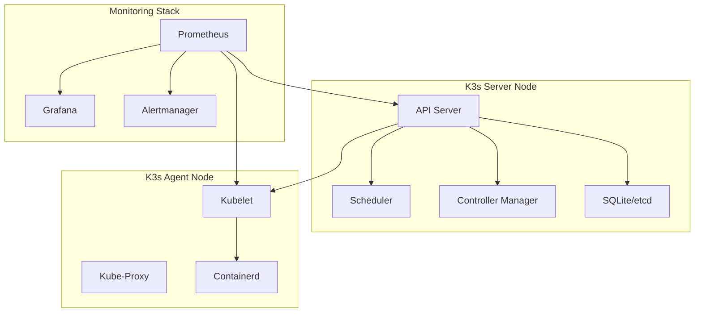
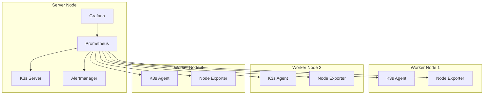
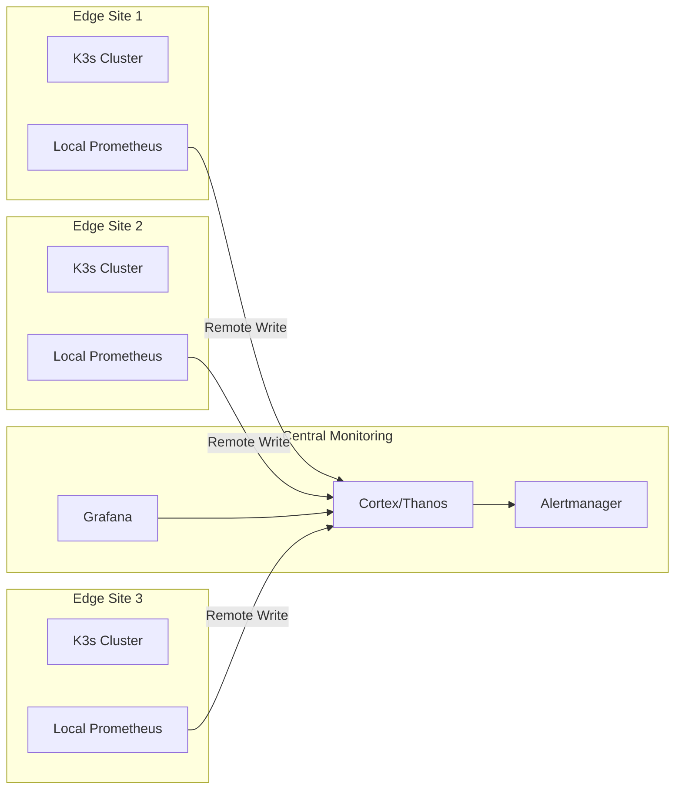

# How to Monitor K3s Clusters

Author: [nawazdhandala](https://www.github.com/nawazdhandala)

Tags: K3s, Kubernetes, Monitoring, Prometheus, Grafana, Observability, Lightweight Kubernetes

Description: A practical guide to monitoring K3s clusters in production. Learn how to set up Prometheus, Grafana, and alerting for your lightweight Kubernetes environments.

---

K3s is a lightweight Kubernetes distribution designed for edge computing, IoT, and resource-constrained environments. Monitoring K3s clusters requires a different approach than standard Kubernetes because of its smaller footprint and unique architecture.

## Understanding K3s Architecture

K3s bundles several components into a single binary, which affects how you monitor them.



## Key Metrics to Monitor in K3s

Before setting up monitoring, you should understand what metrics matter most.

### Control Plane Metrics

K3s exposes control plane metrics on port 10250 (kubelet) and 6443 (API server). The following metrics are critical:

- **apiserver_request_total** - Total API requests
- **apiserver_request_duration_seconds** - API request latency
- **etcd_db_total_size_in_bytes** - Database size (SQLite or etcd)
- **scheduler_schedule_attempts_total** - Pod scheduling attempts

### Node-Level Metrics

Node health indicators help identify resource constraints:

- **node_cpu_seconds_total** - CPU usage across all cores
- **node_memory_MemAvailable_bytes** - Available memory
- **node_filesystem_avail_bytes** - Disk space
- **node_network_receive_bytes_total** - Network throughput

### Container Metrics

Application workload metrics come from cAdvisor (built into kubelet):

- **container_cpu_usage_seconds_total** - Container CPU usage
- **container_memory_usage_bytes** - Container memory consumption
- **container_network_receive_bytes_total** - Container network I/O

## Setting Up Prometheus on K3s

Prometheus is the standard for Kubernetes monitoring. For K3s, use a lightweight deployment.

### Install Prometheus Using Helm

First, add the Prometheus community Helm repository and create a namespace for your monitoring stack.

```bash
# Add the Prometheus community Helm repository
helm repo add prometheus-community https://prometheus-community.github.io/helm-charts
helm repo update

# Create a monitoring namespace
kubectl create namespace monitoring
```

### Configure Prometheus for K3s

K3s requires specific configuration to scrape metrics correctly. Create a values file that accounts for K3s's bundled architecture.

```yaml
# prometheus-values.yaml
# Configuration optimized for K3s clusters with reduced resource usage

prometheus:
  prometheusSpec:
    # Reduce retention for edge/IoT deployments
    retention: 7d

    # Lower resource requirements for K3s
    resources:
      requests:
        memory: 256Mi
        cpu: 100m
      limits:
        memory: 512Mi
        cpu: 500m

    # Storage configuration
    storageSpec:
      volumeClaimTemplate:
        spec:
          accessModes: ["ReadWriteOnce"]
          resources:
            requests:
              storage: 10Gi

    # Additional scrape configs for K3s-specific endpoints
    additionalScrapeConfigs:
      # Scrape K3s server metrics
      - job_name: 'k3s-server'
        static_configs:
          - targets: ['localhost:10250']
        scheme: https
        tls_config:
          insecure_skip_verify: true
        bearer_token_file: /var/run/secrets/kubernetes.io/serviceaccount/token

# Disable components that may be too heavy for K3s
alertmanager:
  enabled: true
  alertmanagerSpec:
    resources:
      requests:
        memory: 64Mi
        cpu: 50m
      limits:
        memory: 128Mi
        cpu: 100m

# Use lighter-weight node exporter configuration
nodeExporter:
  enabled: true
  resources:
    requests:
      memory: 32Mi
      cpu: 50m
    limits:
      memory: 64Mi
      cpu: 100m

# Kube-state-metrics for Kubernetes object metrics
kubeStateMetrics:
  enabled: true
  resources:
    requests:
      memory: 64Mi
      cpu: 50m
    limits:
      memory: 128Mi
      cpu: 100m
```

### Install the Prometheus Stack

Deploy Prometheus with the K3s-optimized configuration.

```bash
# Install kube-prometheus-stack with K3s values
helm install prometheus prometheus-community/kube-prometheus-stack \
  --namespace monitoring \
  --values prometheus-values.yaml
```

### Verify the Installation

Check that all Prometheus components are running.

```bash
# Check pod status
kubectl get pods -n monitoring

# Expected output shows running pods
# NAME                                                     READY   STATUS
# prometheus-kube-prometheus-operator-xxx                  1/1     Running
# prometheus-prometheus-kube-prometheus-prometheus-0       2/2     Running
# prometheus-kube-state-metrics-xxx                        1/1     Running
# prometheus-prometheus-node-exporter-xxx                  1/1     Running
# alertmanager-prometheus-kube-prometheus-alertmanager-0   2/2     Running
```

## Configuring Grafana Dashboards

Grafana provides visualization for your K3s metrics.

### Access Grafana

Get the Grafana admin password and set up port forwarding.

```bash
# Get the admin password
kubectl get secret -n monitoring prometheus-grafana \
  -o jsonpath="{.data.admin-password}" | base64 --decode

# Port forward to access Grafana
kubectl port-forward -n monitoring svc/prometheus-grafana 3000:80
```

### Import K3s-Specific Dashboards

Create a custom dashboard JSON that focuses on K3s-specific metrics and resource usage patterns.

```json
{
  "dashboard": {
    "title": "K3s Cluster Overview",
    "uid": "k3s-overview",
    "timezone": "browser",
    "panels": [
      {
        "title": "Cluster CPU Usage",
        "type": "gauge",
        "gridPos": {"h": 8, "w": 6, "x": 0, "y": 0},
        "targets": [
          {
            "expr": "100 - (avg(rate(node_cpu_seconds_total{mode=\"idle\"}[5m])) * 100)",
            "legendFormat": "CPU %"
          }
        ],
        "fieldConfig": {
          "defaults": {
            "max": 100,
            "min": 0,
            "thresholds": {
              "steps": [
                {"color": "green", "value": null},
                {"color": "yellow", "value": 70},
                {"color": "red", "value": 85}
              ]
            }
          }
        }
      },
      {
        "title": "Cluster Memory Usage",
        "type": "gauge",
        "gridPos": {"h": 8, "w": 6, "x": 6, "y": 0},
        "targets": [
          {
            "expr": "(1 - sum(node_memory_MemAvailable_bytes) / sum(node_memory_MemTotal_bytes)) * 100",
            "legendFormat": "Memory %"
          }
        ]
      },
      {
        "title": "K3s API Server Request Rate",
        "type": "graph",
        "gridPos": {"h": 8, "w": 12, "x": 12, "y": 0},
        "targets": [
          {
            "expr": "sum(rate(apiserver_request_total[5m])) by (verb)",
            "legendFormat": "{{verb}}"
          }
        ]
      },
      {
        "title": "Pod Count by Namespace",
        "type": "piechart",
        "gridPos": {"h": 8, "w": 8, "x": 0, "y": 8},
        "targets": [
          {
            "expr": "count(kube_pod_info) by (namespace)",
            "legendFormat": "{{namespace}}"
          }
        ]
      },
      {
        "title": "Node Disk Usage",
        "type": "bargauge",
        "gridPos": {"h": 8, "w": 8, "x": 8, "y": 8},
        "targets": [
          {
            "expr": "100 - ((node_filesystem_avail_bytes{mountpoint=\"/\"} / node_filesystem_size_bytes{mountpoint=\"/\"}) * 100)",
            "legendFormat": "{{instance}}"
          }
        ]
      }
    ]
  }
}
```

## Setting Up Alerting Rules

Proper alerting catches issues before they affect your applications.

### Create K3s Alert Rules

Define alert rules that account for K3s's lightweight nature and typical deployment scenarios.

```yaml
# k3s-alerts.yaml
# Alert rules designed for K3s clusters in production

apiVersion: monitoring.coreos.com/v1
kind: PrometheusRule
metadata:
  name: k3s-alerts
  namespace: monitoring
  labels:
    release: prometheus
spec:
  groups:
    - name: k3s-cluster-health
      rules:
        # Alert when a K3s node becomes unreachable
        - alert: K3sNodeDown
          expr: up{job="kubernetes-nodes"} == 0
          for: 5m
          labels:
            severity: critical
          annotations:
            summary: "K3s node {{ $labels.instance }} is down"
            description: "The node has been unreachable for more than 5 minutes."

        # Alert on high CPU usage across the cluster
        - alert: K3sHighCPUUsage
          expr: 100 - (avg by(instance) (rate(node_cpu_seconds_total{mode="idle"}[5m])) * 100) > 85
          for: 10m
          labels:
            severity: warning
          annotations:
            summary: "High CPU usage on {{ $labels.instance }}"
            description: "CPU usage has been above 85% for 10 minutes."

        # Alert when memory is running low
        - alert: K3sLowMemory
          expr: (node_memory_MemAvailable_bytes / node_memory_MemTotal_bytes) * 100 < 15
          for: 5m
          labels:
            severity: critical
          annotations:
            summary: "Low memory on {{ $labels.instance }}"
            description: "Available memory is below 15%."

        # Alert on disk space running low
        - alert: K3sDiskSpaceLow
          expr: (node_filesystem_avail_bytes{mountpoint="/"} / node_filesystem_size_bytes{mountpoint="/"}) * 100 < 20
          for: 10m
          labels:
            severity: warning
          annotations:
            summary: "Low disk space on {{ $labels.instance }}"
            description: "Disk space is below 20% on root filesystem."

        # Alert on too many pod restarts
        - alert: K3sPodRestartingTooOften
          expr: increase(kube_pod_container_status_restarts_total[1h]) > 5
          for: 5m
          labels:
            severity: warning
          annotations:
            summary: "Pod {{ $labels.namespace }}/{{ $labels.pod }} restarting frequently"
            description: "Pod has restarted more than 5 times in the last hour."

        # Alert when API server latency is high
        - alert: K3sAPIServerLatencyHigh
          expr: histogram_quantile(0.99, sum(rate(apiserver_request_duration_seconds_bucket[5m])) by (le)) > 1
          for: 10m
          labels:
            severity: warning
          annotations:
            summary: "K3s API server latency is high"
            description: "99th percentile API latency is above 1 second."

    - name: k3s-workload-health
      rules:
        # Alert when deployments have no available replicas
        - alert: K3sDeploymentUnavailable
          expr: kube_deployment_status_replicas_available == 0
          for: 5m
          labels:
            severity: critical
          annotations:
            summary: "Deployment {{ $labels.namespace }}/{{ $labels.deployment }} has no available replicas"
            description: "All replicas are unavailable for this deployment."

        # Alert on pending pods
        - alert: K3sPodPending
          expr: kube_pod_status_phase{phase="Pending"} == 1
          for: 15m
          labels:
            severity: warning
          annotations:
            summary: "Pod {{ $labels.namespace }}/{{ $labels.pod }} is pending"
            description: "Pod has been in Pending state for more than 15 minutes."
```

### Apply the Alert Rules

Deploy the alert rules to your K3s cluster.

```bash
# Apply the alert rules
kubectl apply -f k3s-alerts.yaml

# Verify the rules are loaded
kubectl get prometheusrules -n monitoring
```

## Monitoring K3s-Specific Components

K3s has unique components that require special attention.

### Monitor Traefik Ingress Controller

K3s ships with Traefik as the default ingress controller. Add scraping configuration for Traefik metrics.

```yaml
# traefik-servicemonitor.yaml
# ServiceMonitor to scrape Traefik metrics in K3s

apiVersion: monitoring.coreos.com/v1
kind: ServiceMonitor
metadata:
  name: traefik
  namespace: monitoring
  labels:
    release: prometheus
spec:
  selector:
    matchLabels:
      app.kubernetes.io/name: traefik
  namespaceSelector:
    matchNames:
      - kube-system
  endpoints:
    - port: traefik
      path: /metrics
      interval: 30s
```

### Monitor Local Path Provisioner

K3s uses local-path-provisioner for storage. Monitor its health with custom metrics.

```yaml
# local-path-alerts.yaml
# Alert rules for K3s local path provisioner

apiVersion: monitoring.coreos.com/v1
kind: PrometheusRule
metadata:
  name: local-path-alerts
  namespace: monitoring
  labels:
    release: prometheus
spec:
  groups:
    - name: k3s-storage
      rules:
        # Alert when PVCs are pending for too long
        - alert: K3sPVCPending
          expr: kube_persistentvolumeclaim_status_phase{phase="Pending"} == 1
          for: 15m
          labels:
            severity: warning
          annotations:
            summary: "PVC {{ $labels.namespace }}/{{ $labels.persistentvolumeclaim }} is pending"
            description: "Persistent volume claim has been pending for over 15 minutes."

        # Alert on storage capacity issues
        - alert: K3sLocalPathStorageLow
          expr: |
            (kubelet_volume_stats_available_bytes / kubelet_volume_stats_capacity_bytes) * 100 < 10
          for: 5m
          labels:
            severity: critical
          annotations:
            summary: "Low storage on PVC {{ $labels.persistentvolumeclaim }}"
            description: "PVC storage is below 10% capacity."
```

## Monitoring Architecture for Multi-Node K3s

For clusters with multiple nodes, consider a distributed monitoring approach.



## Lightweight Monitoring Alternatives

For extremely resource-constrained K3s deployments, consider lighter alternatives.

### Victoria Metrics Single Node

Victoria Metrics uses significantly less memory than Prometheus.

```yaml
# victoriametrics-deployment.yaml
# Lightweight alternative to Prometheus for K3s

apiVersion: apps/v1
kind: Deployment
metadata:
  name: victoriametrics
  namespace: monitoring
spec:
  replicas: 1
  selector:
    matchLabels:
      app: victoriametrics
  template:
    metadata:
      labels:
        app: victoriametrics
    spec:
      containers:
        - name: victoriametrics
          image: victoriametrics/victoria-metrics:v1.93.0
          args:
            - "-retentionPeriod=7d"
            - "-storageDataPath=/data"
            # Enable scraping with Prometheus-compatible endpoint
            - "-promscrape.config=/config/scrape.yaml"
          ports:
            - containerPort: 8428
          resources:
            requests:
              memory: 128Mi
              cpu: 50m
            limits:
              memory: 256Mi
              cpu: 200m
          volumeMounts:
            - name: data
              mountPath: /data
            - name: config
              mountPath: /config
      volumes:
        - name: data
          persistentVolumeClaim:
            claimName: victoriametrics-data
        - name: config
          configMap:
            name: victoriametrics-config
---
apiVersion: v1
kind: Service
metadata:
  name: victoriametrics
  namespace: monitoring
spec:
  selector:
    app: victoriametrics
  ports:
    - port: 8428
      targetPort: 8428
```

### Metrics Server for Basic Monitoring

For simple HPA and kubectl top commands, the metrics server is sufficient.

```bash
# Install metrics-server on K3s
kubectl apply -f https://github.com/kubernetes-sigs/metrics-server/releases/latest/download/components.yaml

# Verify installation
kubectl top nodes
kubectl top pods -A
```

## Remote Write to External Systems

For edge deployments, send metrics to a central monitoring system.

### Configure Remote Write to Prometheus

Set up remote write to push metrics from K3s clusters to a central Prometheus or Cortex instance.

```yaml
# remote-write-config.yaml
# Configure Prometheus to remote write to central monitoring

prometheus:
  prometheusSpec:
    remoteWrite:
      - url: "https://central-prometheus.example.com/api/v1/write"
        basicAuth:
          username:
            name: remote-write-credentials
            key: username
          password:
            name: remote-write-credentials
            key: password
        writeRelabelConfigs:
          # Add cluster identifier label
          - sourceLabels: []
            targetLabel: cluster
            replacement: "k3s-edge-site-1"
        queueConfig:
          # Reduce queue size for memory-constrained environments
          maxSamplesPerSend: 1000
          batchSendDeadline: 30s
          capacity: 2500
```

## Monitoring Edge Deployments

Edge K3s clusters have unique monitoring challenges.



### Handling Intermittent Connectivity

Edge sites may lose connectivity. Configure Prometheus to handle network interruptions gracefully.

```yaml
# edge-prometheus-values.yaml
# Configuration for K3s edge deployments with unreliable connectivity

prometheus:
  prometheusSpec:
    # Buffer metrics during network outages
    remoteWrite:
      - url: "https://central.example.com/api/v1/write"
        queueConfig:
          # Larger queue to buffer during outages
          capacity: 10000
          maxSamplesPerSend: 500
          batchSendDeadline: 60s
          minBackoff: 30s
          maxBackoff: 5m

    # Longer local retention as backup
    retention: 3d
    retentionSize: 5GB
```

## Performance Tuning

Optimize monitoring for K3s resource constraints.

### Reduce Scrape Frequency

Lower scrape intervals reduce CPU and memory usage.

```yaml
# optimized-scrape-config.yaml
# Reduced scrape frequency for resource-constrained K3s nodes

prometheus:
  prometheusSpec:
    scrapeInterval: 60s  # Default is 30s
    evaluationInterval: 60s

    additionalScrapeConfigs:
      - job_name: 'kubernetes-pods'
        scrape_interval: 120s  # Less frequent for pod metrics
        kubernetes_sd_configs:
          - role: pod
```

### Limit Metrics Collection

Drop unnecessary metrics to save storage and memory.

```yaml
# metric-relabeling.yaml
# Drop high-cardinality metrics to reduce resource usage

prometheus:
  prometheusSpec:
    additionalScrapeConfigs:
      - job_name: 'kubernetes-nodes'
        metric_relabel_configs:
          # Drop histogram buckets with high cardinality
          - source_labels: [__name__]
            regex: 'apiserver_request_duration_seconds_bucket'
            action: drop
          # Keep only essential kubelet metrics
          - source_labels: [__name__]
            regex: 'kubelet_(running|node|volume).*'
            action: keep
```

## Troubleshooting Common Issues

### Prometheus Cannot Scrape K3s Metrics

When Prometheus fails to scrape K3s endpoints, check service account permissions.

```bash
# Verify ServiceAccount has proper RBAC
kubectl get clusterrolebinding prometheus-kube-prometheus-prometheus -o yaml

# Check if metrics endpoints are accessible
kubectl get --raw /metrics

# Verify node exporter is running
kubectl get pods -n monitoring -l app=prometheus-node-exporter
```

### High Memory Usage in Prometheus

Prometheus memory usage can grow quickly on K3s.

```bash
# Check current memory usage
kubectl top pod -n monitoring

# Reduce retention period
# Edit the Prometheus CRD
kubectl edit prometheus prometheus-kube-prometheus-prometheus -n monitoring
# Change retention from 10d to 3d

# Force a restart to apply changes
kubectl rollout restart statefulset prometheus-prometheus-kube-prometheus-prometheus -n monitoring
```

### Grafana Shows No Data

Verify the data source configuration when Grafana cannot display metrics.

```bash
# Check Prometheus service is running
kubectl get svc -n monitoring prometheus-kube-prometheus-prometheus

# Test Prometheus query
kubectl port-forward -n monitoring svc/prometheus-kube-prometheus-prometheus 9090:9090
# Then open http://localhost:9090 and run a test query

# Check Grafana data source
kubectl port-forward -n monitoring svc/prometheus-grafana 3000:80
# Navigate to Configuration > Data Sources
```

## Best Practices for K3s Monitoring

1. **Right-size resource requests** - K3s runs on limited hardware, so tune Prometheus and Grafana resource limits accordingly

2. **Use persistent storage** - Configure PVCs for Prometheus data to survive pod restarts

3. **Enable remote write for edge** - Send metrics to a central location for edge deployments

4. **Set up alerting early** - Configure alerts before problems occur, not after

5. **Monitor the monitors** - Set up alerts for Prometheus and Grafana health

6. **Use recording rules** - Pre-compute expensive queries to reduce load during dashboard viewing

```yaml
# recording-rules.yaml
# Pre-compute expensive queries for dashboards

apiVersion: monitoring.coreos.com/v1
kind: PrometheusRule
metadata:
  name: k3s-recording-rules
  namespace: monitoring
  labels:
    release: prometheus
spec:
  groups:
    - name: k3s-recording
      rules:
        # Pre-compute cluster CPU usage
        - record: k3s:cluster_cpu_usage:percent
          expr: 100 - (avg(rate(node_cpu_seconds_total{mode="idle"}[5m])) * 100)

        # Pre-compute cluster memory usage
        - record: k3s:cluster_memory_usage:percent
          expr: (1 - sum(node_memory_MemAvailable_bytes) / sum(node_memory_MemTotal_bytes)) * 100

        # Pre-compute pod counts by namespace
        - record: k3s:pods_by_namespace:count
          expr: count(kube_pod_info) by (namespace)
```

---

Monitoring K3s clusters effectively requires balancing comprehensive observability with resource constraints. Start with a minimal Prometheus and Grafana setup, add alerts for critical conditions, and expand your monitoring as your K3s deployment grows. For edge deployments, remote write capabilities ensure you maintain visibility even with unreliable network connectivity.
