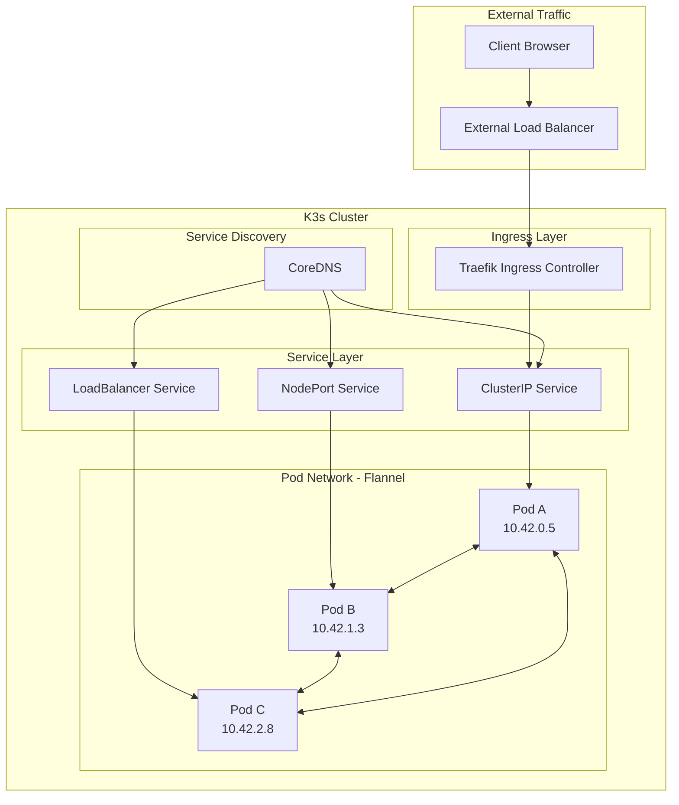
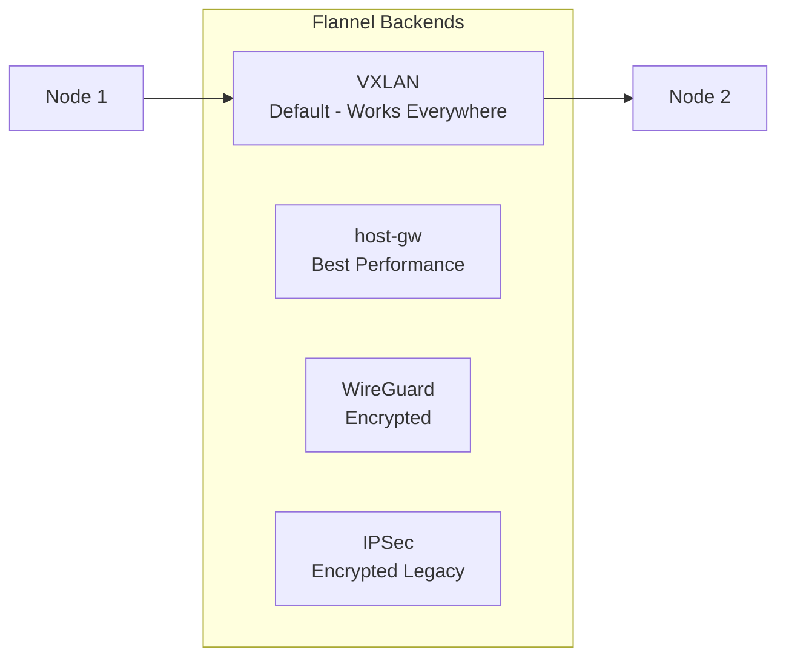
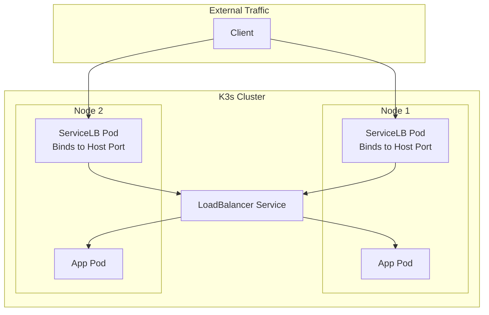
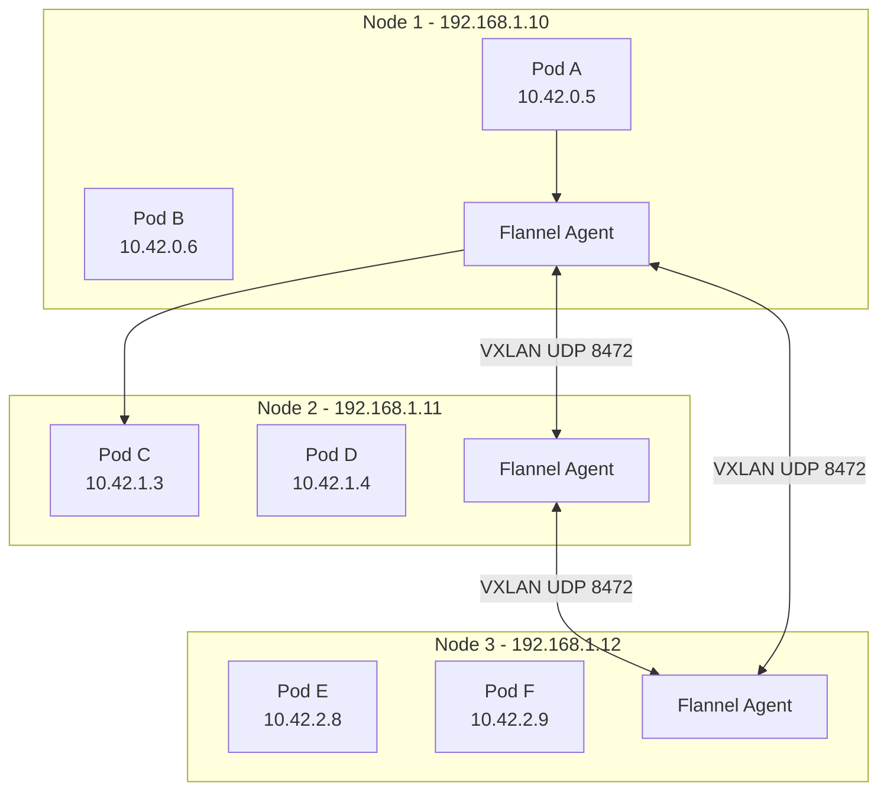

# How to Handle K3s Networking

Author: [nawazdhandala](https://github.com/nawazdhandala)

Tags: K3s, Kubernetes, Networking, Flannel, Traefik, CNI, LoadBalancer, ServiceLB

Description: A practical guide to K3s networking covering CNI plugins, service exposure, Traefik ingress, network policies, load balancing, and troubleshooting common connectivity issues in lightweight Kubernetes clusters.

---

K3s ships with sensible networking defaults that work out of the box, but production deployments demand deeper understanding. Whether you are exposing services externally, securing pod-to-pod communication, or debugging connectivity issues, mastering K3s networking unlocks the full potential of your lightweight Kubernetes clusters.

Networking in K3s differs from standard Kubernetes in key ways. Rancher Labs optimized the stack for edge deployments and resource-constrained environments, bundling Flannel as the default CNI and Traefik as the ingress controller. Understanding these components and their interactions forms the foundation for reliable cluster networking.

## Table of Contents

1. [K3s Networking Architecture Overview](#k3s-networking-architecture-overview)
2. [Understanding the Default CNI: Flannel](#understanding-the-default-cni-flannel)
3. [Service Types and Exposure](#service-types-and-exposure)
4. [Configuring Traefik Ingress Controller](#configuring-traefik-ingress-controller)
5. [Implementing Network Policies](#implementing-network-policies)
6. [Load Balancing with ServiceLB](#load-balancing-with-servicelb)
7. [Using MetalLB for Bare Metal](#using-metallb-for-bare-metal)
8. [DNS Configuration and CoreDNS](#dns-configuration-and-coredns)
9. [Multi-Node Networking](#multi-node-networking)
10. [Troubleshooting Network Issues](#troubleshooting-network-issues)
11. [Best Practices](#best-practices)

## K3s Networking Architecture Overview

K3s implements a complete networking stack with minimal configuration. The architecture handles three distinct networking requirements: pod-to-pod communication, service discovery, and external access.



### Default Components

K3s bundles these networking components by default:

| Component | Purpose | Default |
|-----------|---------|---------|
| Flannel | CNI plugin for pod networking | VXLAN backend |
| CoreDNS | Service discovery and DNS | Enabled |
| Traefik | Ingress controller | v2.x |
| ServiceLB | LoadBalancer implementation | Klipper-lb |

### Network Address Ranges

K3s uses these default CIDR ranges:

The following configuration shows the default network ranges used by K3s for pod and service addressing.

```yaml
# Default K3s network configuration
cluster-cidr: "10.42.0.0/16"     # Pod network range
service-cidr: "10.43.0.0/16"     # Service network range
cluster-dns: "10.43.0.10"        # CoreDNS service IP
```

## Understanding the Default CNI: Flannel

Flannel handles the pod network in K3s, creating an overlay network that enables pods on different nodes to communicate. K3s supports multiple Flannel backends, each suited for different environments.

### Flannel Backend Options



**VXLAN (Default)**: Works across any network topology by encapsulating layer 2 frames in UDP packets. Adds slight overhead but offers universal compatibility.

**host-gw**: Routes packets directly between nodes without encapsulation. Requires all nodes to be on the same layer 2 network. Delivers the best performance when network topology allows.

**WireGuard**: Encrypts all pod-to-pod traffic using the WireGuard VPN protocol. Ideal for clusters spanning untrusted networks.

### Selecting a Flannel Backend

Specify the backend when starting the K3s server to change from the default VXLAN.

```bash
# Use host-gw for better performance on flat networks
curl -sfL https://get.k3s.io | INSTALL_K3S_EXEC="--flannel-backend=host-gw" sh -

# Use WireGuard for encrypted pod traffic
curl -sfL https://get.k3s.io | INSTALL_K3S_EXEC="--flannel-backend=wireguard-native" sh -
```

### Custom CNI Installation

K3s supports disabling Flannel entirely to use alternative CNI plugins like Calico or Cilium.

The following command installs K3s without the default networking components, allowing you to install your preferred CNI plugin.

```bash
# Install K3s without Flannel
curl -sfL https://get.k3s.io | INSTALL_K3S_EXEC="--flannel-backend=none --disable-network-policy" sh -
```

After disabling Flannel, install Calico with these commands.

```bash
# Install Calico CNI
kubectl apply -f https://raw.githubusercontent.com/projectcalico/calico/v3.27.0/manifests/calico.yaml
```

Or install Cilium for advanced networking features.

```bash
# Install Cilium CNI using the CLI
cilium install --version 1.14.5
```

## Service Types and Exposure

Kubernetes services abstract pod networking by providing stable endpoints. K3s supports all standard service types with some lightweight-specific implementations.

### ClusterIP Services

ClusterIP services provide internal-only access within the cluster. Pods reach the service through its cluster IP or DNS name.

The following manifest creates a ClusterIP service that routes traffic to pods with the app=web label.

```yaml
# clusterip-service.yaml
apiVersion: v1
kind: Service
metadata:
  name: web-service
  namespace: default
spec:
  # ClusterIP is the default type - accessible only within the cluster
  type: ClusterIP
  selector:
    # Route traffic to pods with this label
    app: web
  ports:
    - name: http
      port: 80          # Port exposed by the service
      targetPort: 8080  # Port the pod listens on
      protocol: TCP
```

Access the service from within the cluster using DNS.

```bash
# From any pod in the cluster
curl http://web-service.default.svc.cluster.local:80

# Short form works within the same namespace
curl http://web-service:80
```

### NodePort Services

NodePort services expose applications on a static port on every node in the cluster.

The following manifest creates a NodePort service accessible on port 30080 of any cluster node.

```yaml
# nodeport-service.yaml
apiVersion: v1
kind: Service
metadata:
  name: web-nodeport
  namespace: default
spec:
  type: NodePort
  selector:
    app: web
  ports:
    - name: http
      port: 80           # Internal cluster port
      targetPort: 8080   # Pod port
      nodePort: 30080    # External port (30000-32767 range)
      protocol: TCP
```

Access the service from outside the cluster using any node IP.

```bash
# Access via any node IP
curl http://<node-ip>:30080
```

### LoadBalancer Services

K3s includes ServiceLB (formerly Klipper-lb), which provides LoadBalancer functionality without requiring external cloud provider integration.

The following manifest creates a LoadBalancer service that K3s automatically exposes using ServiceLB.

```yaml
# loadbalancer-service.yaml
apiVersion: v1
kind: Service
metadata:
  name: web-lb
  namespace: default
spec:
  type: LoadBalancer
  selector:
    app: web
  ports:
    - name: http
      port: 80
      targetPort: 8080
```

Check the assigned external IP address.

```bash
# View the external IP assigned by ServiceLB
kubectl get svc web-lb

# Output shows the EXTERNAL-IP column populated
NAME     TYPE           CLUSTER-IP    EXTERNAL-IP   PORT(S)        AGE
web-lb   LoadBalancer   10.43.45.12   192.168.1.50  80:31234/TCP   2m
```

## Configuring Traefik Ingress Controller

K3s deploys Traefik v2 as the default ingress controller. Traefik handles HTTP/HTTPS routing, TLS termination, and load balancing for your applications.

### Basic Ingress Configuration

The following Ingress resource routes traffic for myapp.example.com to the backend service.

```yaml
# basic-ingress.yaml
apiVersion: networking.k8s.io/v1
kind: Ingress
metadata:
  name: web-ingress
  namespace: default
  annotations:
    # Force HTTPS redirect
    traefik.ingress.kubernetes.io/router.entrypoints: websecure
    traefik.ingress.kubernetes.io/router.tls: "true"
spec:
  rules:
    - host: myapp.example.com
      http:
        paths:
          - path: /
            pathType: Prefix
            backend:
              service:
                name: web-service
                port:
                  number: 80
```

### TLS Configuration with Certificates

Configure TLS termination using Kubernetes secrets.

The following commands create a TLS secret and Ingress with HTTPS enabled.

```bash
# Create TLS secret from certificate files
kubectl create secret tls myapp-tls \
  --cert=path/to/tls.crt \
  --key=path/to/tls.key
```

Reference the TLS secret in your Ingress.

```yaml
# tls-ingress.yaml
apiVersion: networking.k8s.io/v1
kind: Ingress
metadata:
  name: secure-ingress
  namespace: default
spec:
  tls:
    - hosts:
        - myapp.example.com
      # Reference the TLS secret created above
      secretName: myapp-tls
  rules:
    - host: myapp.example.com
      http:
        paths:
          - path: /
            pathType: Prefix
            backend:
              service:
                name: web-service
                port:
                  number: 80
```

### Path-Based Routing

Route different paths to different services using a single Ingress.

The following Ingress configuration routes API and frontend traffic to separate backend services.

```yaml
# path-routing-ingress.yaml
apiVersion: networking.k8s.io/v1
kind: Ingress
metadata:
  name: path-based-ingress
  namespace: default
  annotations:
    # Strip path prefix when forwarding to backend
    traefik.ingress.kubernetes.io/router.middlewares: default-strip-prefix@kubernetescrd
spec:
  rules:
    - host: myapp.example.com
      http:
        paths:
          # API requests go to api-service
          - path: /api
            pathType: Prefix
            backend:
              service:
                name: api-service
                port:
                  number: 8080
          # All other requests go to frontend
          - path: /
            pathType: Prefix
            backend:
              service:
                name: frontend-service
                port:
                  number: 80
```

### Customizing Traefik

K3s allows Traefik customization through HelmChartConfig resources.

The following HelmChartConfig modifies the default Traefik deployment to add replicas and custom ports.

```yaml
# traefik-config.yaml
apiVersion: helm.cattle.io/v1
kind: HelmChartConfig
metadata:
  name: traefik
  namespace: kube-system
spec:
  valuesContent: |-
    # Increase replica count for high availability
    deployment:
      replicas: 2

    # Add custom ports
    ports:
      # Expose metrics port
      metrics:
        port: 9100
        expose: true
        exposedPort: 9100

    # Enable access logs
    logs:
      access:
        enabled: true

    # Configure resource limits
    resources:
      requests:
        cpu: "100m"
        memory: "128Mi"
      limits:
        cpu: "500m"
        memory: "512Mi"
```

### Disabling Traefik

Disable Traefik if you prefer a different ingress controller.

```bash
# Install K3s without Traefik
curl -sfL https://get.k3s.io | INSTALL_K3S_EXEC="--disable=traefik" sh -
```

Install NGINX Ingress Controller as an alternative.

```bash
# Install NGINX Ingress Controller
kubectl apply -f https://raw.githubusercontent.com/kubernetes/ingress-nginx/controller-v1.9.5/deploy/static/provider/baremetal/deploy.yaml
```

## Implementing Network Policies

Network policies control traffic flow between pods. K3s includes a basic network policy controller, though advanced use cases may require a full CNI like Calico.

### Default Deny Policy

Start with a default deny policy, then explicitly allow required traffic.

The following NetworkPolicy blocks all ingress traffic to pods in the namespace unless explicitly allowed.

```yaml
# default-deny.yaml
apiVersion: networking.k8s.io/v1
kind: NetworkPolicy
metadata:
  name: default-deny-ingress
  namespace: production
spec:
  # Apply to all pods in the namespace
  podSelector: {}
  policyTypes:
    - Ingress
```

### Allow Specific Traffic

Create policies that permit only necessary communication paths.

The following NetworkPolicy allows the API pods to receive traffic only from frontend pods on port 8080.

```yaml
# allow-frontend-to-api.yaml
apiVersion: networking.k8s.io/v1
kind: NetworkPolicy
metadata:
  name: allow-frontend-to-api
  namespace: production
spec:
  # Apply to pods with label app=api
  podSelector:
    matchLabels:
      app: api
  policyTypes:
    - Ingress
  ingress:
    - from:
        # Allow traffic from pods with label app=frontend
        - podSelector:
            matchLabels:
              app: frontend
      ports:
        - protocol: TCP
          port: 8080
```

### Cross-Namespace Policies

Control traffic between different namespaces.

The following NetworkPolicy allows monitoring tools in the observability namespace to scrape metrics from production pods.

```yaml
# cross-namespace-policy.yaml
apiVersion: networking.k8s.io/v1
kind: NetworkPolicy
metadata:
  name: allow-monitoring
  namespace: production
spec:
  podSelector:
    matchLabels:
      app: api
  policyTypes:
    - Ingress
  ingress:
    - from:
        # Allow traffic from the observability namespace
        - namespaceSelector:
            matchLabels:
              name: observability
          podSelector:
            matchLabels:
              app: prometheus
      ports:
        - protocol: TCP
          port: 9090
```

### Database Protection Policy

Protect sensitive workloads like databases with strict network policies.

The following NetworkPolicy restricts database access to only authorized backend pods.

```yaml
# database-policy.yaml
apiVersion: networking.k8s.io/v1
kind: NetworkPolicy
metadata:
  name: database-protection
  namespace: production
spec:
  podSelector:
    matchLabels:
      app: postgres
  policyTypes:
    - Ingress
    - Egress
  ingress:
    # Only allow connections from backend pods
    - from:
        - podSelector:
            matchLabels:
              role: backend
      ports:
        - protocol: TCP
          port: 5432
  egress:
    # Allow DNS resolution
    - to:
        - namespaceSelector: {}
          podSelector:
            matchLabels:
              k8s-app: kube-dns
      ports:
        - protocol: UDP
          port: 53
```

## Load Balancing with ServiceLB

K3s includes ServiceLB (Klipper-lb) for LoadBalancer service implementation. ServiceLB deploys a DaemonSet that binds directly to node ports.



### How ServiceLB Works

ServiceLB creates pods that bind to the host network and forward traffic to the service. The external IP becomes the node IP where ServiceLB runs.

View ServiceLB pods with the following command.

```bash
# View ServiceLB pods
kubectl get pods -n kube-system -l svc.k3s.cattle.io/svcname

# Output shows one pod per node for each LoadBalancer service
NAME                         READY   STATUS    RESTARTS   AGE
svclb-web-lb-7x9kj           1/1     Running   0          5m
svclb-web-lb-m4vz2           1/1     Running   0          5m
```

### Controlling ServiceLB Node Selection

Restrict which nodes run ServiceLB pods using node selectors.

The following Service annotation limits ServiceLB to nodes labeled as edge nodes.

```yaml
# selective-lb.yaml
apiVersion: v1
kind: Service
metadata:
  name: edge-service
  annotations:
    # Only run ServiceLB on nodes with this label
    svccontroller.k3s.cattle.io/nodeselector: "node-role=edge"
spec:
  type: LoadBalancer
  selector:
    app: edge-app
  ports:
    - port: 80
      targetPort: 8080
```

### Disabling ServiceLB

Disable ServiceLB when using external load balancer solutions.

```bash
# Install K3s without ServiceLB
curl -sfL https://get.k3s.io | INSTALL_K3S_EXEC="--disable=servicelb" sh -
```

## Using MetalLB for Bare Metal

MetalLB provides a more feature-rich LoadBalancer implementation for bare metal clusters.

### Installing MetalLB

Disable the default ServiceLB and install MetalLB.

```bash
# Disable ServiceLB first during K3s installation
curl -sfL https://get.k3s.io | INSTALL_K3S_EXEC="--disable=servicelb" sh -

# Install MetalLB
kubectl apply -f https://raw.githubusercontent.com/metallb/metallb/v0.14.3/config/manifests/metallb-native.yaml
```

### Layer 2 Configuration

Layer 2 mode works without special network hardware by using ARP/NDP.

The following manifests configure MetalLB to assign IPs from a specified range using Layer 2 mode.

```yaml
# metallb-config.yaml
---
apiVersion: metallb.io/v1beta1
kind: IPAddressPool
metadata:
  name: production-pool
  namespace: metallb-system
spec:
  # Define the IP range MetalLB can assign
  addresses:
    - 192.168.1.240-192.168.1.250
---
apiVersion: metallb.io/v1beta1
kind: L2Advertisement
metadata:
  name: l2-advertisement
  namespace: metallb-system
spec:
  # Advertise all IP pools using Layer 2
  ipAddressPools:
    - production-pool
```

### BGP Configuration

BGP mode integrates with network routers for true load balancing.

The following configuration sets up MetalLB BGP peering with a network router.

```yaml
# metallb-bgp.yaml
---
apiVersion: metallb.io/v1beta1
kind: IPAddressPool
metadata:
  name: bgp-pool
  namespace: metallb-system
spec:
  addresses:
    - 10.0.100.0/24
---
apiVersion: metallb.io/v1beta2
kind: BGPPeer
metadata:
  name: router-peer
  namespace: metallb-system
spec:
  # BGP router IP address
  peerAddress: 10.0.0.1
  # Router's ASN
  peerASN: 64501
  # MetalLB's ASN
  myASN: 64500
---
apiVersion: metallb.io/v1beta1
kind: BGPAdvertisement
metadata:
  name: bgp-advertisement
  namespace: metallb-system
spec:
  ipAddressPools:
    - bgp-pool
```

## DNS Configuration and CoreDNS

CoreDNS handles service discovery in K3s, resolving service names to cluster IPs.

### Viewing CoreDNS Configuration

Inspect the current CoreDNS configuration.

```bash
# View CoreDNS ConfigMap
kubectl get configmap coredns -n kube-system -o yaml
```

### Customizing CoreDNS

Add custom DNS entries or configure upstream servers.

The following ConfigMap adds custom DNS zones and forwards specific domains to internal DNS servers.

```yaml
# coredns-custom.yaml
apiVersion: v1
kind: ConfigMap
metadata:
  name: coredns-custom
  namespace: kube-system
data:
  # Add custom DNS entries
  custom.server: |
    internal.company.com:53 {
      forward . 10.0.0.53 10.0.0.54
      cache 30
    }
  # Add static host entries
  custom.hosts: |
    192.168.1.100 legacy-server.internal.company.com
    192.168.1.101 database.internal.company.com
```

Restart CoreDNS to apply changes.

```bash
# Restart CoreDNS pods
kubectl rollout restart deployment coredns -n kube-system
```

### DNS Troubleshooting

Debug DNS resolution issues with a test pod.

```bash
# Deploy a DNS test pod
kubectl run dnstest --image=busybox:1.36 --restart=Never -- sleep 3600

# Test DNS resolution
kubectl exec dnstest -- nslookup kubernetes.default.svc.cluster.local

# Test external DNS
kubectl exec dnstest -- nslookup google.com

# Clean up
kubectl delete pod dnstest
```

## Multi-Node Networking

Multi-node K3s clusters require proper network connectivity between nodes for pod communication.



### Required Firewall Ports

Open these ports for K3s cluster communication.

The following table lists all ports required for K3s multi-node networking.

| Port | Protocol | Component | Purpose |
|------|----------|-----------|---------|
| 6443 | TCP | API Server | Kubernetes API |
| 8472 | UDP | Flannel VXLAN | Pod network overlay |
| 10250 | TCP | Kubelet | Node communication |
| 51820 | UDP | WireGuard | Encrypted pod traffic |
| 51821 | UDP | WireGuard IPv6 | Encrypted IPv6 traffic |

Configure firewall rules to allow K3s traffic.

```bash
# Allow K3s ports with firewalld
firewall-cmd --permanent --add-port=6443/tcp
firewall-cmd --permanent --add-port=8472/udp
firewall-cmd --permanent --add-port=10250/tcp
firewall-cmd --reload

# Or with iptables
iptables -A INPUT -p tcp --dport 6443 -j ACCEPT
iptables -A INPUT -p udp --dport 8472 -j ACCEPT
iptables -A INPUT -p tcp --dport 10250 -j ACCEPT
```

### Verifying Node Connectivity

Test network connectivity between nodes.

```bash
# Check Flannel pods are running on all nodes
kubectl get pods -n kube-system -l app=flannel -o wide

# Verify node network configuration
kubectl get nodes -o jsonpath='{.items[*].spec.podCIDR}'

# Test pod-to-pod connectivity across nodes
kubectl run test1 --image=busybox --restart=Never -- sleep 3600
kubectl run test2 --image=busybox --restart=Never --overrides='{"spec":{"nodeName":"node2"}}' -- sleep 3600

# Get pod IPs
TEST1_IP=$(kubectl get pod test1 -o jsonpath='{.status.podIP}')
TEST2_IP=$(kubectl get pod test2 -o jsonpath='{.status.podIP}')

# Test connectivity
kubectl exec test1 -- ping -c 3 $TEST2_IP
kubectl exec test2 -- ping -c 3 $TEST1_IP
```

## Troubleshooting Network Issues

Network problems manifest in various ways. Here are systematic approaches to diagnosing common issues.

### Pod Cannot Reach Other Pods

Check Flannel status and pod CIDR assignments.

```bash
# Verify Flannel is running
kubectl get pods -n kube-system -l app=flannel

# Check Flannel logs for errors
kubectl logs -n kube-system -l app=flannel --tail=50

# Verify node pod CIDRs are assigned
kubectl get nodes -o custom-columns=NAME:.metadata.name,PODCIDR:.spec.podCIDR

# Check for IP address conflicts
kubectl get pods -A -o wide | awk '{print $7}' | sort | uniq -d
```

### Service Not Reachable

Verify service configuration and endpoint availability.

```bash
# Check service exists and has correct selector
kubectl describe svc <service-name>

# Verify endpoints are populated
kubectl get endpoints <service-name>

# If no endpoints, check pod labels match service selector
kubectl get pods --show-labels | grep <app-label>

# Test service from within a pod
kubectl run curltest --image=curlimages/curl --restart=Never --rm -it -- \
  curl -v http://<service-name>:<port>
```

### Ingress Not Working

Debug Traefik ingress issues step by step.

```bash
# Check Traefik is running
kubectl get pods -n kube-system -l app.kubernetes.io/name=traefik

# View Traefik logs
kubectl logs -n kube-system -l app.kubernetes.io/name=traefik --tail=100

# Verify Ingress resource is created
kubectl get ingress -A

# Check Ingress details for events and errors
kubectl describe ingress <ingress-name>

# Verify the backend service is reachable
kubectl port-forward svc/<backend-service> 8080:80 &
curl http://localhost:8080
```

### DNS Resolution Failing

Diagnose CoreDNS issues.

```bash
# Check CoreDNS pods
kubectl get pods -n kube-system -l k8s-app=kube-dns

# View CoreDNS logs
kubectl logs -n kube-system -l k8s-app=kube-dns --tail=50

# Test DNS from a pod
kubectl run dnsutils --image=tutum/dnsutils --restart=Never --rm -it -- \
  nslookup kubernetes.default.svc.cluster.local

# Verify CoreDNS ConfigMap
kubectl get configmap coredns -n kube-system -o yaml

# Check resolv.conf in pods
kubectl exec <pod-name> -- cat /etc/resolv.conf
```

### Network Policy Blocking Traffic

Test if network policies are affecting connectivity.

```bash
# List all network policies
kubectl get networkpolicy -A

# Describe specific policy
kubectl describe networkpolicy <policy-name> -n <namespace>

# Temporarily delete policy to test
kubectl delete networkpolicy <policy-name> -n <namespace>

# If traffic works, refine the policy and reapply
```

### Collecting Network Diagnostics

Gather comprehensive network information for deeper analysis.

```bash
# Create a diagnostic script
#!/bin/bash
echo "=== Node Network Info ==="
kubectl get nodes -o wide

echo "=== Pod Network Info ==="
kubectl get pods -A -o wide

echo "=== Services ==="
kubectl get svc -A

echo "=== Endpoints ==="
kubectl get endpoints -A

echo "=== Network Policies ==="
kubectl get networkpolicy -A

echo "=== Flannel Status ==="
kubectl get pods -n kube-system -l app=flannel -o wide
kubectl logs -n kube-system -l app=flannel --tail=20

echo "=== CoreDNS Status ==="
kubectl get pods -n kube-system -l k8s-app=kube-dns
kubectl logs -n kube-system -l k8s-app=kube-dns --tail=20

echo "=== Traefik Status ==="
kubectl get pods -n kube-system -l app.kubernetes.io/name=traefik
kubectl logs -n kube-system -l app.kubernetes.io/name=traefik --tail=20
```

## Best Practices

### 1. Use Network Policies from Day One

Implement network segmentation early to prevent lateral movement in case of compromise.

```yaml
# Start with deny-all, then whitelist required traffic
apiVersion: networking.k8s.io/v1
kind: NetworkPolicy
metadata:
  name: default-deny-all
  namespace: production
spec:
  podSelector: {}
  policyTypes:
    - Ingress
    - Egress
```

### 2. Choose the Right Flannel Backend

Match the backend to your network environment.

| Environment | Recommended Backend |
|-------------|---------------------|
| Cloud VPC | host-gw |
| Mixed/Unknown | vxlan (default) |
| Untrusted Network | wireguard-native |
| Legacy Systems | ipsec |

### 3. Monitor Network Performance

Deploy monitoring to catch network issues early.

```yaml
# prometheus-servicemonitor.yaml
apiVersion: monitoring.coreos.com/v1
kind: ServiceMonitor
metadata:
  name: traefik
  namespace: monitoring
spec:
  selector:
    matchLabels:
      app.kubernetes.io/name: traefik
  endpoints:
    - port: metrics
      interval: 30s
```

### 4. Document Your Network Configuration

Maintain clear documentation of your network architecture.

```yaml
# network-documentation.yaml (ConfigMap for reference)
apiVersion: v1
kind: ConfigMap
metadata:
  name: network-documentation
  namespace: kube-system
data:
  architecture: |
    Cluster CIDR: 10.42.0.0/16
    Service CIDR: 10.43.0.0/16
    Flannel Backend: VXLAN
    Ingress: Traefik v2
    Load Balancer: MetalLB (192.168.1.240-250)
```

### 5. Test Network Changes in Staging

Always validate network configuration changes in a non-production environment before applying to production clusters.

---

K3s networking provides enterprise-grade capabilities in a lightweight package. By understanding how Flannel, CoreDNS, Traefik, and ServiceLB work together, you can build resilient network architectures that scale from edge devices to production data centers. Start with the defaults, customize as needed, and always implement network policies to secure your workloads.
