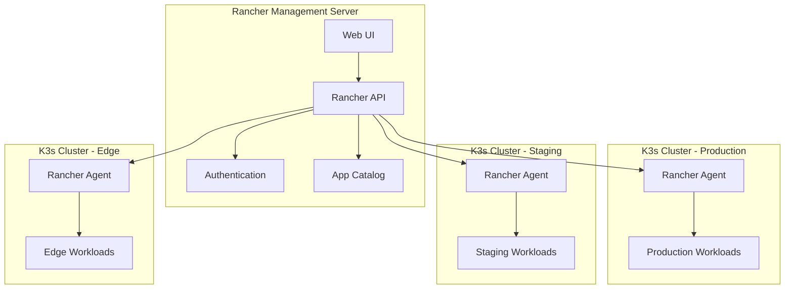
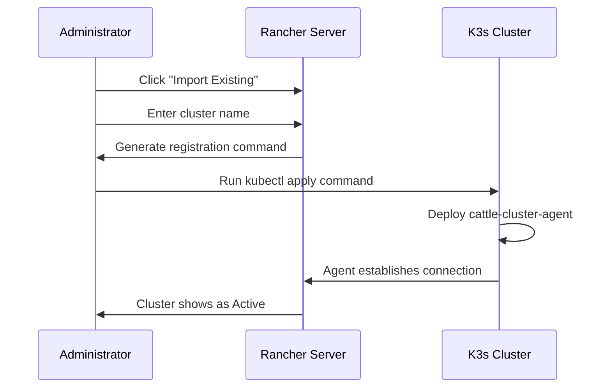
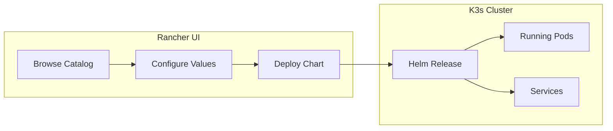

# How to Use K3s with Rancher

Author: [nawazdhandala](https://www.github.com/nawazdhandala)

Tags: K3s, Rancher, Kubernetes, DevOps, Container Management, Edge Computing

Description: A practical guide to managing K3s clusters with Rancher, covering installation, cluster import, workload deployment, and multi-cluster management from a single dashboard.

---

K3s and Rancher form a powerful combination for teams that need lightweight Kubernetes clusters with enterprise-grade management. K3s delivers a certified Kubernetes distribution in a single binary under 100MB, while Rancher provides a web-based UI for managing multiple clusters, deploying applications, and handling RBAC across your entire fleet.

Running K3s without centralized management works fine for a single cluster. But once you scale to multiple environments - development, staging, production, edge locations - keeping track of deployments, monitoring health, and maintaining consistent configurations becomes a challenge. Rancher solves exactly that problem.

## Architecture Overview

Understanding how Rancher and K3s interact helps you plan your deployment strategy.



Rancher acts as the control plane for cluster management, while each K3s cluster runs independently with a lightweight agent that reports back to Rancher. If Rancher goes offline, your K3s clusters continue running - you just lose the management interface temporarily.

## Prerequisites

Before setting up the integration, ensure you have:

- A Linux server for Rancher (4 CPU cores, 8GB RAM minimum)
- One or more Linux servers for K3s clusters (1 CPU core, 512MB RAM minimum per node)
- Docker or K3s installed on the Rancher server
- Network connectivity between Rancher and K3s nodes on ports 443 and 6443
- A domain name or static IP for Rancher (required for TLS)

## Installing Rancher

Rancher can run on any Kubernetes cluster, but for simplicity, we will deploy it on a dedicated K3s instance using Helm.

First, install K3s on your Rancher server.

```bash
# Install K3s with specific options for running Rancher
# The write-kubeconfig-mode flag makes the config readable without sudo
curl -sfL https://get.k3s.io | sh -s - --write-kubeconfig-mode 644
```

Wait for K3s to become ready and configure kubectl access.

```bash
# Set the KUBECONFIG environment variable for the current session
export KUBECONFIG=/etc/rancher/k3s/k3s.yaml

# Verify the cluster is running before proceeding
kubectl get nodes
```

Add the Rancher Helm repository and create a namespace for cert-manager, which Rancher needs for TLS certificate management.

```bash
# Add the Jetstack Helm repository for cert-manager
helm repo add jetstack https://charts.jetstack.io

# Add the official Rancher Helm repository
helm repo add rancher-stable https://releases.rancher.com/server-charts/stable

# Update Helm repositories to fetch the latest chart versions
helm repo update
```

Install cert-manager first since Rancher depends on it for certificate generation.

```bash
# Install cert-manager with CRDs included
# The CRDs must be installed for cert-manager to function
kubectl create namespace cert-manager

helm install cert-manager jetstack/cert-manager \
  --namespace cert-manager \
  --version v1.14.4 \
  --set installCRDs=true
```

Verify cert-manager pods are running before continuing.

```bash
# Check that all cert-manager pods have started successfully
kubectl get pods -n cert-manager
```

Now install Rancher with your hostname configured.

```bash
# Create the cattle-system namespace for Rancher components
kubectl create namespace cattle-system

# Install Rancher with your domain name
# Replace rancher.yourdomain.com with your actual hostname
helm install rancher rancher-stable/rancher \
  --namespace cattle-system \
  --set hostname=rancher.yourdomain.com \
  --set bootstrapPassword=admin \
  --set replicas=1
```

Monitor the rollout until Rancher becomes available.

```bash
# Watch the Rancher deployment until all pods are ready
kubectl -n cattle-system rollout status deploy/rancher
```

## Accessing the Rancher Dashboard

Once the deployment completes, access Rancher through your browser at `https://rancher.yourdomain.com`. On first login, you will need to:

1. Enter the bootstrap password (admin) or retrieve the generated one
2. Set a new admin password
3. Configure the Rancher server URL

If you used a self-signed certificate and need to retrieve the bootstrap password:

```bash
# Retrieve the randomly generated bootstrap password if you did not set one
kubectl get secret --namespace cattle-system bootstrap-secret \
  -o go-template='{{.data.bootstrapPassword|base64decode}}{{"\n"}}'
```

## Installing K3s on Target Clusters

On each server that will run your managed K3s clusters, perform the K3s installation. For a single-node cluster:

```bash
# Install K3s with TLS SANs for external access
# The TLS SAN allows Rancher to connect using this IP or hostname
curl -sfL https://get.k3s.io | sh -s - \
  --write-kubeconfig-mode 644 \
  --tls-san $(hostname -I | awk '{print $1}')
```

For multi-node clusters, install the server first, then join workers.

```bash
# On the first server node, initialize with cluster mode
curl -sfL https://get.k3s.io | sh -s - server \
  --cluster-init \
  --write-kubeconfig-mode 644 \
  --tls-san $(hostname -I | awk '{print $1}')
```

Retrieve the token for joining additional nodes.

```bash
# Get the node token needed for other nodes to join
sudo cat /var/lib/rancher/k3s/server/node-token
```

On worker nodes, join the cluster using the token.

```bash
# Join a worker node to the existing K3s cluster
# Replace K3S_SERVER_IP with your server node IP
# Replace K3S_TOKEN with the token from the server
curl -sfL https://get.k3s.io | K3S_URL=https://K3S_SERVER_IP:6443 K3S_TOKEN=K3S_TOKEN sh -
```

## Importing K3s Clusters into Rancher

With K3s clusters running, import them into Rancher for centralized management. The process involves generating a registration command from Rancher and running it on your K3s cluster.

### Method 1: Import Using the Rancher UI

Navigate to the Rancher dashboard and click "Import Existing" under Cluster Management. Give your cluster a name and click Create. Rancher generates kubectl commands to run on your K3s cluster.



Copy the provided kubectl command and run it on your K3s cluster.

```bash
# Apply the Rancher agent manifest to your K3s cluster
# This command is generated by Rancher and unique to your installation
kubectl apply -f https://rancher.yourdomain.com/v3/import/UNIQUE_TOKEN.yaml
```

If your Rancher server uses a self-signed certificate, use the insecure command instead:

```bash
# For self-signed certificates, use curl with insecure flag
curl --insecure -sfL https://rancher.yourdomain.com/v3/import/UNIQUE_TOKEN.yaml | kubectl apply -f -
```

### Method 2: Import Using the Rancher CLI

For automation and scripting, use the Rancher CLI to import clusters.

```bash
# Download and install the Rancher CLI
wget https://github.com/rancher/cli/releases/download/v2.8.0/rancher-linux-amd64-v2.8.0.tar.gz
tar -xzf rancher-linux-amd64-v2.8.0.tar.gz
sudo mv rancher-v2.8.0/rancher /usr/local/bin/

# Log in to your Rancher server
rancher login https://rancher.yourdomain.com --token YOUR_API_TOKEN

# List available clusters to verify connection
rancher cluster ls
```

Generate an import manifest for a new cluster.

```bash
# Create an import manifest for a K3s cluster named "production"
rancher cluster import production
```

## Deploying Workloads Through Rancher

Once your K3s clusters are imported, deploy applications using the Rancher catalog or kubectl through the Rancher proxy.

### Using the Built-in App Catalog

Rancher includes a catalog of Helm charts for common applications. Navigate to Apps & Marketplace in the Rancher UI to browse available charts.



### Deploying Custom Workloads

Create deployments directly from the Rancher UI or use kubectl through Rancher's proxy.

```bash
# Access kubectl for a specific cluster through Rancher
# The Rancher CLI proxies commands to the target cluster
rancher kubectl --cluster production get nodes

# Deploy a workload to the production cluster
rancher kubectl --cluster production apply -f - <<EOF
apiVersion: apps/v1
kind: Deployment
metadata:
  name: nginx-demo
  namespace: default
spec:
  replicas: 3
  selector:
    matchLabels:
      app: nginx-demo
  template:
    metadata:
      labels:
        app: nginx-demo
    spec:
      containers:
      - name: nginx
        image: nginx:alpine
        ports:
        - containerPort: 80
EOF
```

Expose the deployment with a service.

```bash
# Create a LoadBalancer service for the nginx deployment
rancher kubectl --cluster production expose deployment nginx-demo \
  --port=80 \
  --type=LoadBalancer
```

## Managing Multiple Clusters

Rancher excels at managing multiple K3s clusters from a single interface. Common multi-cluster operations include:

### Consistent Configuration Across Clusters

Use Rancher Fleet for GitOps-based deployment across multiple clusters.

```yaml
# fleet.yaml - Place in your Git repository
# Fleet automatically deploys this manifest to matching clusters
defaultNamespace: default
helm:
  releaseName: monitoring
  chart: prometheus-community/kube-prometheus-stack
  version: 55.5.0
  values:
    prometheus:
      prometheusSpec:
        retention: 7d
targets:
  - name: all-k3s-clusters
    clusterSelector:
      matchLabels:
        kubernetes.io/distribution: k3s
```

### Centralized RBAC Management

Define roles and permissions in Rancher that apply across all managed clusters.

```bash
# Create a global role using the Rancher API
# This role grants read access to workloads across all clusters
curl -k -X POST \
  -H "Authorization: Bearer $RANCHER_TOKEN" \
  -H "Content-Type: application/json" \
  https://rancher.yourdomain.com/v3/globalroles \
  -d '{
    "name": "workload-viewer",
    "description": "View workloads across all clusters",
    "rules": [
      {
        "apiGroups": ["apps"],
        "resources": ["deployments", "statefulsets", "daemonsets"],
        "verbs": ["get", "list", "watch"]
      }
    ]
  }'
```

### Cluster Templates

Create reusable cluster templates for consistent K3s deployments.

```yaml
# cluster-template.yaml
# Define a template for provisioning new K3s clusters through Rancher
apiVersion: provisioning.cattle.io/v1
kind: Cluster
metadata:
  name: cluster-template-production
  namespace: fleet-default
spec:
  kubernetesVersion: v1.28.5+k3s1
  rkeConfig:
    machineGlobalConfig:
      disable:
        - traefik
      kubelet-arg:
        - max-pods=200
    machinePools:
      - name: control-plane
        controlPlaneRole: true
        etcdRole: true
        quantity: 3
      - name: worker
        workerRole: true
        quantity: 5
```

## Monitoring and Alerting

Rancher integrates with Prometheus and Grafana for cluster monitoring. Enable monitoring from the Cluster Tools menu.

```bash
# Enable monitoring using Helm through Rancher
rancher kubectl --cluster production apply -f - <<EOF
apiVersion: catalog.cattle.io/v1
kind: ClusterRepo
metadata:
  name: rancher-charts
spec:
  gitRepo: https://git.rancher.io/charts
  gitBranch: release-v2.8
EOF
```

Configure alerting rules for critical cluster events.

```yaml
# alerting-rules.yaml
# Custom PrometheusRule for K3s-specific alerts
apiVersion: monitoring.coreos.com/v1
kind: PrometheusRule
metadata:
  name: k3s-alerts
  namespace: cattle-monitoring-system
spec:
  groups:
    - name: k3s-cluster
      rules:
        - alert: K3sNodeNotReady
          expr: kube_node_status_condition{condition="Ready",status="true"} == 0
          for: 5m
          labels:
            severity: critical
          annotations:
            summary: "K3s node {{ $labels.node }} is not ready"
            description: "Node has been in NotReady state for more than 5 minutes"

        - alert: K3sHighMemoryUsage
          expr: (1 - (node_memory_MemAvailable_bytes / node_memory_MemTotal_bytes)) > 0.9
          for: 10m
          labels:
            severity: warning
          annotations:
            summary: "High memory usage on {{ $labels.instance }}"
            description: "Memory usage is above 90% for more than 10 minutes"
```

## Backup and Disaster Recovery

Protect your Rancher and K3s configurations with regular backups.

### Backing Up Rancher

```bash
# Create a backup of the Rancher management cluster
# Use rancher-backup operator for production deployments
rancher kubectl --cluster local apply -f - <<EOF
apiVersion: resources.cattle.io/v1
kind: Backup
metadata:
  name: rancher-backup-$(date +%Y%m%d)
spec:
  resourceSetName: rancher-resource-set
  storageLocation:
    s3:
      bucketName: rancher-backups
      folder: backups
      region: us-east-1
      credentialSecretName: s3-credentials
      credentialSecretNamespace: cattle-system
EOF
```

### Backing Up K3s Clusters

For K3s clusters using embedded etcd, create snapshots.

```bash
# Create an on-demand etcd snapshot on the K3s server
sudo k3s etcd-snapshot save --name manual-backup-$(date +%Y%m%d)

# List existing snapshots
sudo k3s etcd-snapshot ls
```

Configure automatic snapshots in the K3s config.

```yaml
# /etc/rancher/k3s/config.yaml
# Enable automatic etcd snapshots for disaster recovery
etcd-snapshot-schedule-cron: "0 */6 * * *"
etcd-snapshot-retention: 10
etcd-s3: true
etcd-s3-bucket: k3s-backups
etcd-s3-region: us-east-1
etcd-s3-access-key: YOUR_ACCESS_KEY
etcd-s3-secret-key: YOUR_SECRET_KEY
```

## Troubleshooting Common Issues

### Agent Not Connecting to Rancher

Verify network connectivity and check the agent logs.

```bash
# Check the cattle-cluster-agent logs for connection errors
kubectl -n cattle-system logs -l app=cattle-cluster-agent --tail=100

# Verify the agent can reach the Rancher server
kubectl -n cattle-system exec -it deployment/cattle-cluster-agent -- \
  curl -k https://rancher.yourdomain.com/ping
```

### Cluster Showing as Unavailable

Check the cluster agent status and restart if necessary.

```bash
# Restart the cattle-cluster-agent deployment
kubectl -n cattle-system rollout restart deployment/cattle-cluster-agent

# Watch for the agent to reconnect
kubectl -n cattle-system get pods -w
```

### Certificate Errors

For self-signed certificates, ensure the CA is trusted by the agents.

```bash
# Add custom CA certificate to the agent configuration
kubectl -n cattle-system create secret generic tls-ca \
  --from-file=cacerts.pem=/path/to/ca.crt

# Update the agent deployment to use the CA
kubectl -n cattle-system set env deployment/cattle-cluster-agent \
  CATTLE_CA_CHECKSUM=$(sha256sum /path/to/ca.crt | awk '{print $1}')
```

## Best Practices

Running K3s with Rancher in production requires attention to several areas:

**Resource Allocation**: Dedicate a separate K3s cluster for Rancher management rather than running Rancher on one of your application clusters. Keeping management separate from workloads improves reliability.

**High Availability**: Run Rancher with multiple replicas behind a load balancer. For K3s clusters, use embedded etcd with three server nodes minimum for production workloads.

**Network Security**: Place Rancher and K3s management traffic on a dedicated network segment. Use network policies to restrict pod-to-pod communication.

**Regular Updates**: K3s and Rancher release updates frequently. Schedule regular maintenance windows to apply security patches and feature updates.

**Backup Strategy**: Automate backups of both Rancher and K3s etcd data. Test restoration procedures quarterly.

## Summary

Combining K3s with Rancher provides a complete solution for teams managing Kubernetes at any scale. K3s handles the lightweight runtime while Rancher delivers the management plane for multi-cluster operations, application deployment, and access control.

The integration works particularly well for edge computing scenarios, development environments, and organizations standardizing on Kubernetes across diverse infrastructure. Once configured, you gain visibility into all your clusters through a single dashboard without sacrificing the simplicity that makes K3s attractive.

---

*Managing multiple K3s clusters? [OneUptime](https://oneuptime.com) provides unified observability across all your Kubernetes environments with incident management, status pages, and real-time alerting. Monitor your entire infrastructure from one platform.*
