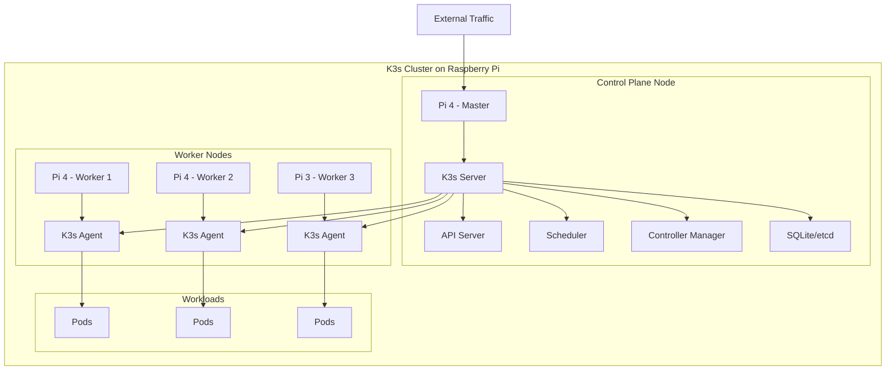
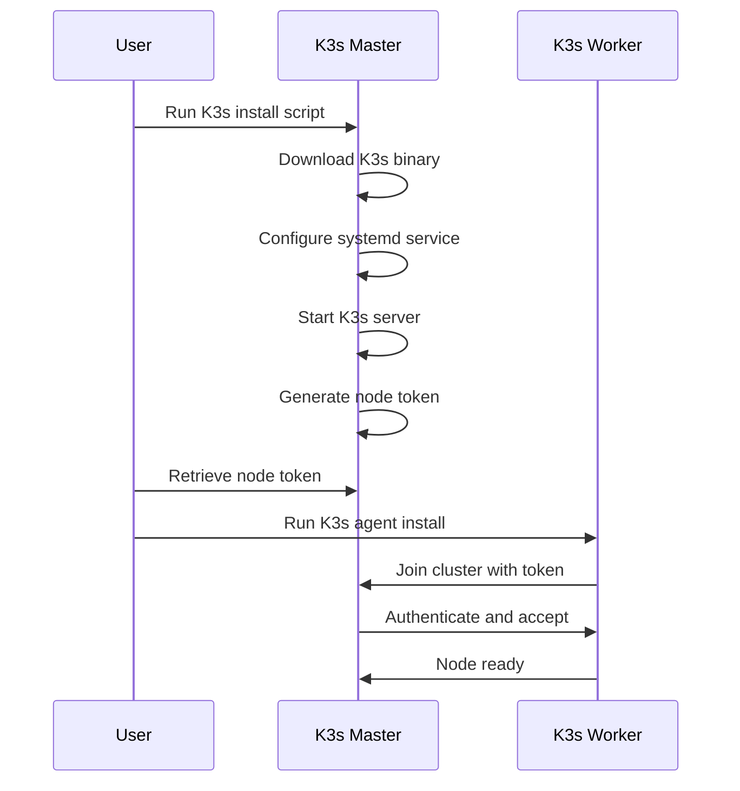
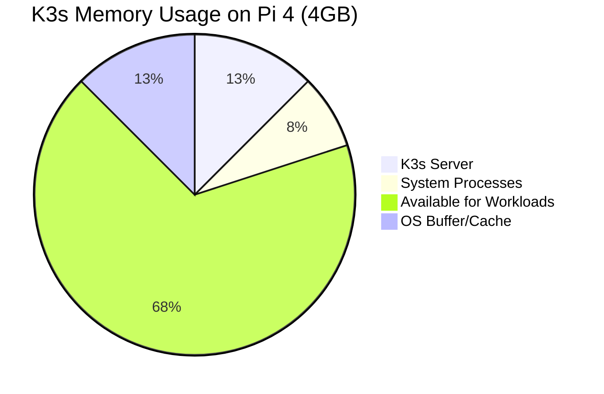
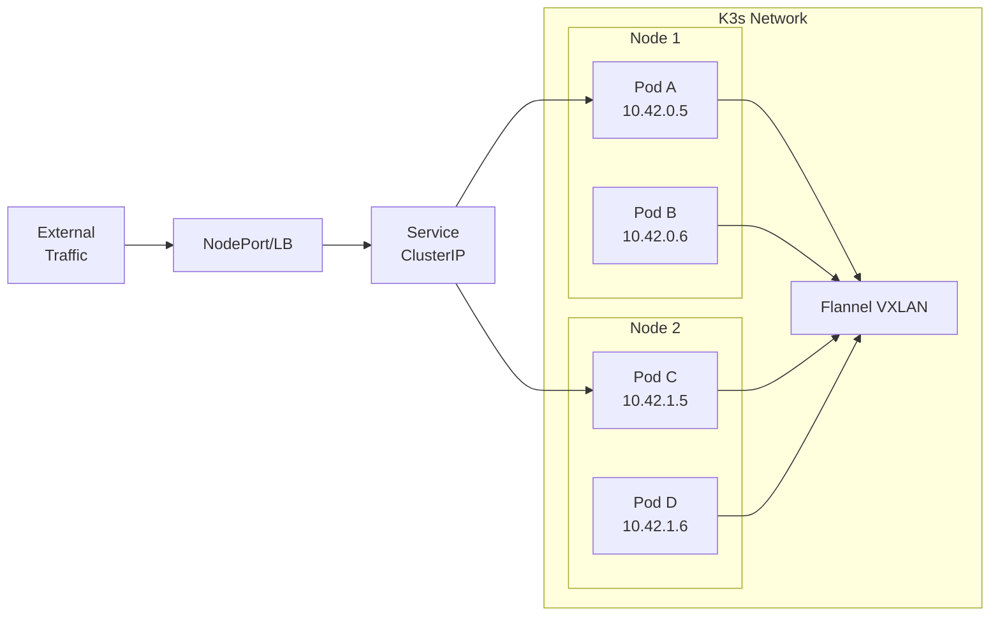

# How to Configure K3s for Raspberry Pi

Author: [nawazdhandala](https://www.github.com/nawazdhandala)

Tags: K3s, Kubernetes, Raspberry Pi, ARM, Edge Computing, DevOps, IoT

Description: A complete guide to installing and configuring K3s on Raspberry Pi devices. Learn how to set up a lightweight Kubernetes cluster for edge computing, IoT projects, and home lab environments.

Running Kubernetes on Raspberry Pi opens up exciting possibilities for edge computing, home automation, and learning distributed systems. K3s, developed by Rancher Labs, strips down Kubernetes to its essentials while maintaining full API compatibility. With a binary size under 100MB and minimal memory footprint, K3s runs beautifully on resource-constrained ARM devices like the Raspberry Pi.

## Architecture Overview

Before diving into the installation, let's understand the cluster architecture we'll build:



## Prerequisites

Before starting the installation, ensure you have the following:

- Raspberry Pi 4 (4GB or 8GB recommended) or Raspberry Pi 3B+
- 32GB or larger microSD card (Class 10 or better)
- Raspberry Pi OS Lite (64-bit recommended for Pi 4)
- Static IP addresses assigned to each Pi
- SSH access enabled on all devices

## Preparing the Raspberry Pi

### Flash the Operating System

Download Raspberry Pi OS Lite 64-bit from the official website. Using the Raspberry Pi Imager simplifies the flashing process and allows pre-configuration of SSH and network settings.

After flashing, insert the SD card and boot your Pi. Connect via SSH to continue the setup.

### Configure System Settings

Several kernel parameters need adjustment for Kubernetes to function properly. The following commands modify boot configuration and system settings:

Enable cgroup memory support by editing the boot configuration. Cgroups allow Kubernetes to manage container resources effectively.

```bash
# Edit the boot configuration file
# cgroup_memory and cgroup_enable parameters are required for container resource management
sudo nano /boot/firmware/cmdline.txt
```

Add these parameters at the end of the existing line (do not create a new line):

```
cgroup_memory=1 cgroup_enable=memory
```

The complete line should look similar to:

```
console=serial0,115200 console=tty1 root=PARTUUID=xxxxx rootfstype=ext4 fsck.repair=yes rootwait cgroup_memory=1 cgroup_enable=memory
```

### Disable Swap

K3s requires swap to be disabled for proper operation. Kubernetes scheduling depends on accurate memory availability, and swap complicates resource management.

```bash
# Disable swap immediately and prevent it from re-enabling on boot
# Kubernetes requires swap disabled for consistent memory management
sudo dphys-swapfile swapoff
sudo dphys-swapfile uninstall
sudo systemctl disable dphys-swapfile
```

### Set a Static Hostname

Each node needs a unique hostname for cluster identification:

```bash
# Set the hostname for this node
# Replace 'k3s-master' with your desired hostname
sudo hostnamectl set-hostname k3s-master
```

Reboot to apply all changes:

```bash
# Reboot to apply kernel parameters and hostname changes
sudo reboot
```

## Installing K3s on the Master Node

### Installation Process Flow



### Run the Installation Script

K3s provides a convenient installation script that handles binary download, service configuration, and startup. The following command installs K3s as a server (master node):

```bash
# Install K3s server with specific options for Raspberry Pi
# --write-kubeconfig-mode sets permissions for the kubeconfig file
# --disable servicelb removes the default load balancer if you plan to use MetalLB
# --disable traefik removes the default ingress controller if you prefer nginx or another option
curl -sfL https://get.k3s.io | sh -s - server \
    --write-kubeconfig-mode 644 \
    --disable servicelb \
    --disable traefik
```

If you want a simpler setup with default components:

```bash
# Basic K3s server installation with all defaults
# Suitable for testing or single-node clusters
curl -sfL https://get.k3s.io | sh -
```

### Verify Installation

Check that K3s is running properly:

```bash
# Check the K3s service status
# Active (running) indicates successful installation
sudo systemctl status k3s
```

Verify the node is ready:

```bash
# List all nodes in the cluster
# The master node should show Ready status
sudo k3s kubectl get nodes
```

Expected output:

```
NAME         STATUS   ROLES                  AGE   VERSION
k3s-master   Ready    control-plane,master   2m    v1.28.5+k3s1
```

### Retrieve the Node Token

Worker nodes need a token to join the cluster. The token is stored on the master node:

```bash
# Display the node token required for worker nodes to join
# Save this token securely as it allows nodes to join your cluster
sudo cat /var/lib/rancher/k3s/server/node-token
```

The output looks like:

```
K10abc123def456...::server:xyz789token
```

## Adding Worker Nodes

### Prepare Each Worker

Repeat the system preparation steps (cgroups, disable swap, set hostname) on each worker Pi. Use unique hostnames like `k3s-worker-1`, `k3s-worker-2`, etc.

### Join Workers to the Cluster

Run the following command on each worker node, replacing the placeholders with your actual values:

```bash
# Install K3s agent and join to the master node
# K3S_URL specifies the master node's address
# K3S_TOKEN is the token retrieved from the master node
curl -sfL https://get.k3s.io | K3S_URL=https://MASTER_IP:6443 K3S_TOKEN=YOUR_NODE_TOKEN sh -
```

For example:

```bash
# Example: joining a worker to master at 192.168.1.100
# Replace the token with your actual node token from the master
curl -sfL https://get.k3s.io | K3S_URL=https://192.168.1.100:6443 \
    K3S_TOKEN=K10abc123def456...::server:xyz789token sh -
```

### Verify Worker Nodes

Back on the master node, check that all workers have joined:

```bash
# List all nodes to verify workers joined successfully
# All nodes should show Ready status within a few minutes
sudo k3s kubectl get nodes -o wide
```

Expected output:

```
NAME           STATUS   ROLES                  AGE   VERSION        INTERNAL-IP     OS-IMAGE
k3s-master     Ready    control-plane,master   10m   v1.28.5+k3s1   192.168.1.100   Debian GNU/Linux 12
k3s-worker-1   Ready    <none>                 3m    v1.28.5+k3s1   192.168.1.101   Debian GNU/Linux 12
k3s-worker-2   Ready    <none>                 2m    v1.28.5+k3s1   192.168.1.102   Debian GNU/Linux 12
```

## Configuring kubectl for Remote Access

Working directly on the Pi can be inconvenient. Configure your local machine to manage the cluster remotely.

### Copy the Kubeconfig File

On the master node, the kubeconfig file contains cluster credentials:

```bash
# Display the kubeconfig content
# Copy this to your local machine's ~/.kube/config file
sudo cat /etc/rancher/k3s/k3s.yaml
```

On your local machine, create the kubeconfig:

```bash
# Create the .kube directory if it doesn't exist
mkdir -p ~/.kube

# Create or edit the config file
# Paste the content from the master node's k3s.yaml
nano ~/.kube/config
```

### Update the Server Address

The kubeconfig points to `127.0.0.1` by default. Change it to the master's IP:

```yaml
# Modified kubeconfig for remote access
# Replace 127.0.0.1 with your master node's actual IP address
apiVersion: v1
clusters:
- cluster:
    certificate-authority-data: LS0tLS1CRUdJTi...
    server: https://192.168.1.100:6443  # Changed from 127.0.0.1
  name: default
contexts:
- context:
    cluster: default
    user: default
  name: default
current-context: default
kind: Config
preferences: {}
users:
- name: default
  user:
    client-certificate-data: LS0tLS1CRUdJTi...
    client-key-data: LS0tLS1CRUdJTi...
```

Verify remote access:

```bash
# Test connectivity from your local machine
# Should list all cluster nodes
kubectl get nodes
```

## Deploying Your First Application

Let's deploy a simple web application to test the cluster.

### Create a Deployment

Save the following manifest as `nginx-deployment.yaml`:

```yaml
# Nginx deployment for testing the K3s cluster
# Runs 3 replicas distributed across worker nodes
apiVersion: apps/v1
kind: Deployment
metadata:
  name: nginx-test
  labels:
    app: nginx-test
spec:
  # Three replicas ensure distribution across nodes
  replicas: 3
  selector:
    matchLabels:
      app: nginx-test
  template:
    metadata:
      labels:
        app: nginx-test
    spec:
      containers:
      - name: nginx
        # Using the alpine variant reduces image size significantly
        image: nginx:alpine
        ports:
        - containerPort: 80
        resources:
          # Resource limits appropriate for Raspberry Pi
          limits:
            memory: "128Mi"
            cpu: "250m"
          requests:
            memory: "64Mi"
            cpu: "100m"
---
# Service to expose the nginx deployment
# NodePort makes it accessible on any node's IP
apiVersion: v1
kind: Service
metadata:
  name: nginx-test-service
spec:
  type: NodePort
  selector:
    app: nginx-test
  ports:
  - port: 80
    targetPort: 80
    # NodePort range is 30000-32767
    nodePort: 30080
```

Apply the manifest:

```bash
# Deploy the application to the cluster
kubectl apply -f nginx-deployment.yaml
```

### Verify the Deployment

Check that pods are running across nodes:

```bash
# View pods with the node they're scheduled on
# Pods should be distributed across different worker nodes
kubectl get pods -o wide
```

Access the application by visiting `http://ANY_NODE_IP:30080` in your browser.

## Performance Optimization

### CPU and Memory Considerations



Raspberry Pi 4 with 4GB RAM typically allocates memory as shown above. Keep workload requests reasonable to maintain cluster stability.

### Storage Configuration

For better performance, consider using an external SSD instead of the SD card:

```bash
# Mount an external SSD for container storage
# This improves I/O performance significantly
sudo mkdir -p /mnt/ssd

# Add to /etc/fstab for persistent mounting
# Replace UUID with your SSD's actual UUID
echo "UUID=your-ssd-uuid /mnt/ssd ext4 defaults,noatime 0 2" | sudo tee -a /etc/fstab

# Mount the drive
sudo mount -a
```

Configure K3s to use the SSD for container data:

```bash
# Stop K3s before reconfiguring
sudo systemctl stop k3s

# Move existing data to SSD
sudo mv /var/lib/rancher /mnt/ssd/

# Create symbolic link
sudo ln -s /mnt/ssd/rancher /var/lib/rancher

# Restart K3s
sudo systemctl start k3s
```

## Network Configuration

### Pod Network Architecture



K3s uses Flannel for pod networking by default. Each node receives a subnet (10.42.X.0/24) for pod IP allocation.

### Configure Custom DNS

If you need custom DNS settings for your pods:

```yaml
# CoreDNS ConfigMap customization
# Add custom DNS entries or forwarding rules
apiVersion: v1
kind: ConfigMap
metadata:
  name: coredns-custom
  namespace: kube-system
data:
  # Custom DNS entries for internal services
  custom.server: |
    homelab.local:53 {
        errors
        cache 30
        forward . 192.168.1.1
    }
```

## Monitoring the Cluster

### Install Metrics Server

K3s doesn't include metrics-server by default in minimal installations. Install it for resource monitoring:

```bash
# Install metrics-server for resource monitoring
# Required for kubectl top commands and HPA
kubectl apply -f https://github.com/kubernetes-sigs/metrics-server/releases/latest/download/components.yaml
```

For ARM-based clusters, you may need a patched version:

```bash
# Patch metrics-server for ARM compatibility
# Add kubelet-insecure-tls flag if using self-signed certificates
kubectl patch deployment metrics-server -n kube-system --type='json' -p='[
  {"op": "add", "path": "/spec/template/spec/containers/0/args/-", "value": "--kubelet-insecure-tls"}
]'
```

### View Resource Usage

After metrics-server is running:

```bash
# View node resource consumption
# Shows CPU and memory usage per node
kubectl top nodes

# View pod resource consumption
kubectl top pods --all-namespaces
```

## Troubleshooting Common Issues

### Node Not Joining Cluster

If a worker fails to join:

```bash
# Check K3s agent logs on the worker node
# Look for connection or authentication errors
sudo journalctl -u k3s-agent -f
```

Common causes include:
- Firewall blocking port 6443
- Incorrect node token
- Network connectivity issues between nodes

### Pods Stuck in Pending State

Check for resource constraints:

```bash
# Describe the pod to see scheduling failures
# Events section shows why the pod cannot be scheduled
kubectl describe pod POD_NAME
```

### High Memory Usage

K3s can consume significant memory on constrained devices. Reduce memory usage by disabling unused components:

```bash
# Reinstall K3s with minimal components
# Disables traefik, servicelb, and local-storage
curl -sfL https://get.k3s.io | sh -s - server \
    --disable traefik \
    --disable servicelb \
    --disable local-storage \
    --kube-controller-manager-arg="node-monitor-period=60s" \
    --kube-controller-manager-arg="node-monitor-grace-period=180s"
```

## Backup and Recovery

### Backup the Cluster State

K3s stores cluster state in SQLite by default. Create regular backups:

```bash
# Create a backup directory
sudo mkdir -p /backup/k3s

# Stop K3s before backing up to ensure consistency
sudo systemctl stop k3s

# Backup the entire K3s data directory
sudo tar -czvf /backup/k3s/k3s-backup-$(date +%Y%m%d).tar.gz /var/lib/rancher/k3s

# Restart K3s
sudo systemctl start k3s
```

### Restore from Backup

To restore a failed cluster:

```bash
# Stop K3s if running
sudo systemctl stop k3s

# Remove existing data
sudo rm -rf /var/lib/rancher/k3s

# Extract backup
sudo tar -xzvf /backup/k3s/k3s-backup-YYYYMMDD.tar.gz -C /

# Start K3s
sudo systemctl start k3s
```

## Upgrading K3s

K3s upgrades are straightforward. Simply rerun the installation script:

```bash
# Upgrade K3s to the latest stable version
# The script detects existing installation and performs upgrade
curl -sfL https://get.k3s.io | sh -
```

For specific versions:

```bash
# Install a specific K3s version
# Useful for maintaining version consistency across environments
curl -sfL https://get.k3s.io | INSTALL_K3S_VERSION=v1.28.5+k3s1 sh -
```

Upgrade worker nodes after the master:

```bash
# On each worker node, rerun the agent installation
# Uses the same token, automatically upgrades
curl -sfL https://get.k3s.io | K3S_URL=https://192.168.1.100:6443 K3S_TOKEN=YOUR_TOKEN sh -
```

## Conclusion

K3s transforms Raspberry Pi devices into capable Kubernetes nodes, perfect for edge computing, home labs, and IoT applications. The lightweight design ensures efficient resource usage while maintaining full Kubernetes API compatibility.

Key points to remember:
- Enable cgroups and disable swap before installation
- Use external SSDs for improved storage performance
- Monitor resource usage carefully on constrained devices
- Backup cluster state regularly

Your Raspberry Pi cluster is now ready to run containerized workloads. Start experimenting with deployments, services, and more advanced Kubernetes features.

**Related Reading:**

- [How to configure MetalLB with Kubernetes (Microk8s)](https://oneuptime.com/blog/post/2023-11-06-configure-metallb-with-kubernetes-microk8s/view)
- [How moving from AWS to Bare-Metal saved us $230,000 /yr.](https://oneuptime.com/blog/post/2023-10-30-moving-from-aws-to-bare-metal/view)
- [Why build open-source DataDog?](https://oneuptime.com/blog/post/2024-08-14-why-build-open-source-datadog/view)
