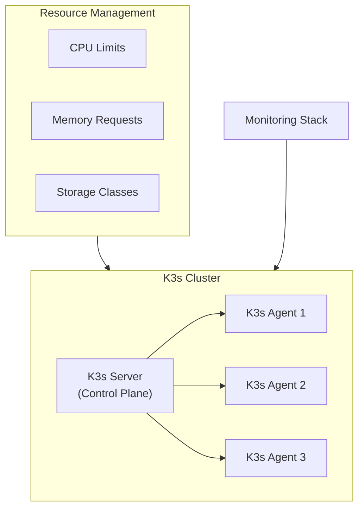
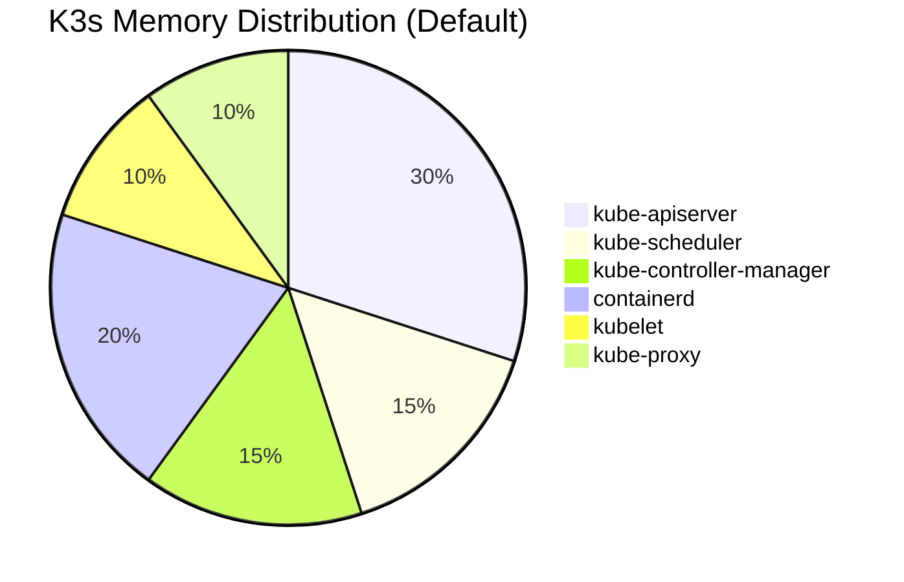
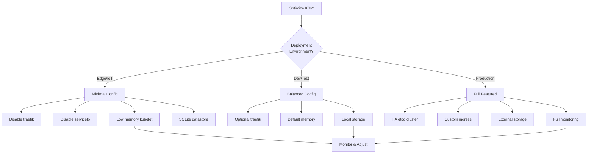

# How to Optimize K3s Resource Usage

Author: [nawazdhandala](https://www.github.com/nawazdhandala)

Tags: K3s, Kubernetes, Resource Optimization, DevOps, Edge Computing, Lightweight Kubernetes

Description: Learn how to optimize K3s resource usage for edge deployments and resource-constrained environments. Covers memory tuning, CPU limits, storage optimization, and monitoring strategies for efficient cluster operations.

---

> K3s runs Kubernetes on devices with as little as 512MB of RAM. But default configurations often waste resources. Proper tuning can reduce memory usage by 40% and CPU consumption by 30%.

Running Kubernetes in production requires careful resource management. K3s makes lightweight deployments possible, but optimization requires deliberate configuration choices.

---

## Overview



---

## Prerequisites

Before starting, ensure you have:

- K3s installed (v1.27 or later recommended)
- kubectl configured to access your cluster
- Root or sudo access on cluster nodes
- Basic understanding of Kubernetes resource concepts

---

## Understanding K3s Resource Footprint

K3s packages several components into a single binary, reducing the base memory footprint compared to standard Kubernetes. Here is the breakdown of components and their typical resource consumption:



---

## Server Node Optimization

### Disable Unused Components

K3s includes Traefik and ServiceLB by default. Disabling these when not needed saves significant resources.

The following installation command creates a minimal K3s server without the default ingress controller and load balancer:

```bash
# Install K3s with minimal components
# --disable traefik: Removes the default Traefik ingress controller (saves ~50MB RAM)
# --disable servicelb: Removes the built-in load balancer (saves ~20MB RAM)
# --disable local-storage: Removes local path provisioner if using external storage
curl -sfL https://get.k3s.io | sh -s - server \
    --disable traefik \
    --disable servicelb \
    --disable local-storage
```

For existing installations, modify the K3s service configuration:

```bash
# Edit the K3s service file to add disable flags
# Location varies by distribution but commonly found here
sudo nano /etc/systemd/system/k3s.service
```

Add the disable flags to the ExecStart line in the service file:

```ini
# K3s systemd service configuration with resource optimizations
[Unit]
Description=Lightweight Kubernetes
Documentation=https://k3s.io
After=network-online.target

[Service]
Type=notify
# The main K3s binary with optimization flags
ExecStart=/usr/local/bin/k3s server \
    --disable traefik \
    --disable servicelb \
    --disable metrics-server \
    --kube-apiserver-arg=max-requests-inflight=100 \
    --kube-apiserver-arg=max-mutating-requests-inflight=50

# Restart policy for high availability
Restart=always
RestartSec=5s

[Install]
WantedBy=multi-user.target
```

After modifying the service file, reload and restart:

```bash
# Reload systemd daemon to pick up changes and restart K3s
sudo systemctl daemon-reload
sudo systemctl restart k3s
```

---

## Memory Optimization

### Configure kubelet Memory Limits

Setting memory limits on the kubelet prevents runaway memory consumption and ensures stable node operation.

Create a kubelet configuration file that sets memory reservation and eviction thresholds:

```yaml
# /etc/rancher/k3s/kubelet.yaml
# Kubelet configuration for memory-constrained environments
apiVersion: kubelet.config.k8s.io/v1beta1
kind: KubeletConfiguration

# Reserve resources for system processes and K3s components
# Prevents pods from consuming all available memory
systemReserved:
  cpu: "250m"
  memory: "256Mi"
  ephemeral-storage: "1Gi"

# Reserve resources for Kubernetes system components
kubeReserved:
  cpu: "250m"
  memory: "256Mi"
  ephemeral-storage: "1Gi"

# Hard eviction thresholds - pods are evicted when these are breached
evictionHard:
  memory.available: "100Mi"
  nodefs.available: "10%"
  imagefs.available: "15%"

# Soft eviction with grace period - provides warning before hard eviction
evictionSoft:
  memory.available: "200Mi"
  nodefs.available: "15%"
  imagefs.available: "20%"

# Grace period before soft eviction triggers
evictionSoftGracePeriod:
  memory.available: "1m30s"
  nodefs.available: "1m30s"
  imagefs.available: "1m30s"
```

Reference the kubelet configuration when starting K3s:

```bash
# Start K3s with custom kubelet configuration
# The kubelet-arg flag passes configuration to the embedded kubelet
sudo k3s server --kubelet-arg="config=/etc/rancher/k3s/kubelet.yaml"
```

### Container Runtime Memory Settings

Containerd runs within the K3s process and can be tuned for memory efficiency.

Create a containerd configuration that limits memory usage for garbage collection and image management:

```toml
# /etc/rancher/k3s/containerd/config.toml.tmpl
# Containerd configuration template for K3s

# Base configuration version
version = 2

# Plugin configuration for containerd
[plugins."io.containerd.grpc.v1.cri"]
  # Disable the sandbox image pull on startup to save memory
  sandbox_image = "rancher/mirrored-pause:3.6"

  [plugins."io.containerd.grpc.v1.cri".containerd]
    # Default runtime configuration
    default_runtime_name = "runc"

    [plugins."io.containerd.grpc.v1.cri".containerd.runtimes.runc]
      runtime_type = "io.containerd.runc.v2"

      # Runtime options for memory efficiency
      [plugins."io.containerd.grpc.v1.cri".containerd.runtimes.runc.options]
        SystemdCgroup = true

# Limit the number of concurrent image pulls to reduce memory spikes
[plugins."io.containerd.grpc.v1.cri".registry]
  [plugins."io.containerd.grpc.v1.cri".registry.mirrors]
    [plugins."io.containerd.grpc.v1.cri".registry.mirrors."docker.io"]
      endpoint = ["https://registry-1.docker.io"]
```

---

## CPU Optimization

### API Server Request Throttling

Limiting concurrent API requests prevents CPU spikes during high-activity periods.

Configure API server throttling through K3s startup arguments:

```bash
# K3s server with API throttling configuration
# These settings limit concurrent requests to prevent CPU exhaustion
k3s server \
    --kube-apiserver-arg=max-requests-inflight=400 \
    --kube-apiserver-arg=max-mutating-requests-inflight=200 \
    --kube-apiserver-arg=min-request-timeout=300
```

### Scheduler Performance Tuning

The scheduler can consume significant CPU when making placement decisions. Tuning the scheduler reduces CPU usage without impacting placement quality.

Create a scheduler configuration file that adjusts performance parameters:

```yaml
# /etc/rancher/k3s/scheduler-config.yaml
# Scheduler configuration for resource-constrained clusters
apiVersion: kubescheduler.config.k8s.io/v1
kind: KubeSchedulerConfiguration

# Limit the percentage of nodes considered for scheduling
# Lower values reduce CPU usage but may affect placement optimization
percentageOfNodesToScore: 50

# Profiles define scheduling behavior
profiles:
  - schedulerName: default-scheduler
    plugins:
      # Scoring plugins evaluate node suitability
      score:
        enabled:
          # Balance resource allocation across nodes
          - name: NodeResourcesBalancedAllocation
            weight: 1
          # Prefer nodes with fewer pods
          - name: NodeResourcesFit
            weight: 1
```

Apply the scheduler configuration when starting K3s:

```bash
# Start K3s with custom scheduler configuration
k3s server --kube-scheduler-arg="config=/etc/rancher/k3s/scheduler-config.yaml"
```

---

## Storage Optimization

### Efficient etcd Configuration

K3s uses SQLite by default for single-node deployments and embedded etcd for multi-node clusters. Both can be tuned for better performance.

For embedded etcd, configure compaction and snapshot settings:

```bash
# Start K3s with etcd optimization flags
# These settings reduce disk I/O and memory usage
k3s server \
    --etcd-arg=auto-compaction-mode=periodic \
    --etcd-arg=auto-compaction-retention=1h \
    --etcd-arg=snapshot-count=5000 \
    --etcd-arg=quota-backend-bytes=2147483648
```

### SQLite Optimization for Single Nodes

For single-node deployments, SQLite optimization improves performance without the overhead of etcd.

Configure SQLite through K3s data store settings:

```bash
# K3s with SQLite optimizations for single-node deployments
# Use WAL mode for better concurrent read/write performance
k3s server \
    --datastore-endpoint="sqlite:///var/lib/rancher/k3s/server/db/state.db?_journal=WAL&_synchronous=NORMAL"
```

---

## Pod Resource Management

### LimitRange for Default Resources

Setting default resource limits ensures all pods have appropriate constraints, even when developers forget to specify them.

Create a LimitRange that applies sensible defaults to all pods in a namespace:

```yaml
# limit-range.yaml
# Default resource limits and requests for all containers
apiVersion: v1
kind: LimitRange
metadata:
  name: default-limits
  namespace: default
spec:
  limits:
    - type: Container
      # Default values applied when not specified
      default:
        cpu: "500m"
        memory: "256Mi"
      # Default requests applied when not specified
      defaultRequest:
        cpu: "100m"
        memory: "128Mi"
      # Maximum allowed values - rejects pods exceeding these
      max:
        cpu: "2"
        memory: "1Gi"
      # Minimum allowed values - ensures baseline allocation
      min:
        cpu: "50m"
        memory: "32Mi"
```

Apply the LimitRange to enforce default resource constraints:

```bash
# Apply the limit range to the default namespace
# Consider applying to all namespaces for cluster-wide enforcement
kubectl apply -f limit-range.yaml
```

### ResourceQuota for Namespace Budgets

ResourceQuotas prevent any single namespace from consuming excessive cluster resources.

Create a ResourceQuota that caps total resource consumption per namespace:

```yaml
# resource-quota.yaml
# Namespace-level resource constraints
apiVersion: v1
kind: ResourceQuota
metadata:
  name: namespace-quota
  namespace: production
spec:
  hard:
    # CPU limits across all pods in namespace
    requests.cpu: "4"
    limits.cpu: "8"
    # Memory limits across all pods in namespace
    requests.memory: "4Gi"
    limits.memory: "8Gi"
    # Limit number of pods to prevent pod sprawl
    pods: "20"
    # Limit PVCs to control storage consumption
    persistentvolumeclaims: "10"
    # Limit services to prevent resource exhaustion
    services: "10"
    services.loadbalancers: "2"
```

---

## Monitoring Resource Usage

### Deploy Lightweight Metrics Collection

Monitoring helps identify optimization opportunities. Deploy a minimal metrics stack that adds minimal overhead.

Create a metrics configuration using the K3s built-in metrics server or a lightweight alternative:

```yaml
# metrics-server.yaml
# Lightweight metrics server configuration for K3s
apiVersion: apps/v1
kind: Deployment
metadata:
  name: metrics-server
  namespace: kube-system
  labels:
    k8s-app: metrics-server
spec:
  selector:
    matchLabels:
      k8s-app: metrics-server
  template:
    metadata:
      labels:
        k8s-app: metrics-server
    spec:
      containers:
        - name: metrics-server
          image: rancher/mirrored-metrics-server:v0.6.3
          args:
            # Reduce memory usage with shorter metric resolution
            - --metric-resolution=30s
            # Skip TLS verification for kubelet (common in K3s)
            - --kubelet-insecure-tls
            # Prefer internal IP for node communication
            - --kubelet-preferred-address-types=InternalIP
          resources:
            # Constrain metrics server resource usage
            requests:
              cpu: 50m
              memory: 64Mi
            limits:
              cpu: 100m
              memory: 128Mi
          securityContext:
            readOnlyRootFilesystem: true
            runAsNonRoot: true
            runAsUser: 1000
      priorityClassName: system-cluster-critical
```

### Resource Monitoring Script

Create a script that monitors cluster resource usage and alerts on inefficiencies.

Save the script as a monitoring tool that runs periodically:

```bash
#!/bin/bash
# k3s-resource-monitor.sh
# Monitor K3s cluster resource usage and identify optimization opportunities

# Color codes for output formatting
RED='\033[0;31m'
GREEN='\033[0;32m'
YELLOW='\033[1;33m'
NC='\033[0m' # No Color

echo "=== K3s Resource Usage Report ==="
echo "Generated: $(date)"
echo ""

# Function to check node resource usage
check_node_resources() {
    echo "--- Node Resource Usage ---"
    kubectl top nodes 2>/dev/null || echo "Metrics server not available"
    echo ""
}

# Function to identify pods without resource limits
find_unlimited_pods() {
    echo "--- Pods Without Resource Limits ---"
    # Find containers without memory limits set
    kubectl get pods --all-namespaces -o json | \
        jq -r '.items[] |
            select(.spec.containers[].resources.limits.memory == null) |
            "\(.metadata.namespace)/\(.metadata.name)"' | \
        head -20
    echo ""
}

# Function to find over-provisioned pods
find_overprovisioned() {
    echo "--- Potentially Over-Provisioned Pods ---"
    # Compare requested resources vs actual usage
    kubectl top pods --all-namespaces 2>/dev/null | \
        awk 'NR>1 {print $1, $2, $3, $4}'
    echo ""
}

# Function to check K3s server process memory
check_k3s_memory() {
    echo "--- K3s Server Memory Usage ---"
    ps aux | grep '[k]3s server' | awk '{print "K3s Server: " $6/1024 " MB"}'
    ps aux | grep '[k]3s agent' | awk '{print "K3s Agent: " $6/1024 " MB"}'
    echo ""
}

# Run all checks
check_node_resources
find_unlimited_pods
find_overprovisioned
check_k3s_memory

echo "=== Report Complete ==="
```

Make the script executable and run it periodically:

```bash
# Make the monitoring script executable
chmod +x k3s-resource-monitor.sh

# Run the monitoring script
./k3s-resource-monitor.sh

# Optional: Add to crontab for regular monitoring
# Runs every hour and logs to file
echo "0 * * * * /path/to/k3s-resource-monitor.sh >> /var/log/k3s-resources.log 2>&1" | crontab -
```

---

## Edge Deployment Optimization

### Minimal Agent Configuration

For edge devices with limited resources, configure K3s agents with minimal footprint.

Start agents with optimized settings for constrained environments:

```bash
# Join an edge device as a K3s agent with minimal resource usage
# --node-label: Identify node as edge device for scheduling
# --kubelet-arg: Custom kubelet settings for edge
curl -sfL https://get.k3s.io | K3S_URL=https://server:6443 K3S_TOKEN=<token> sh -s - agent \
    --node-label="node-type=edge" \
    --kubelet-arg="max-pods=30" \
    --kubelet-arg="image-gc-high-threshold=70" \
    --kubelet-arg="image-gc-low-threshold=50"
```

### Taints and Tolerations for Edge Workloads

Use taints to control which workloads run on resource-constrained edge nodes.

Apply taints to edge nodes and configure tolerations for appropriate workloads:

```bash
# Taint edge nodes to prevent general workloads from scheduling
# Only pods with matching tolerations will be scheduled here
kubectl taint nodes edge-node-1 node-type=edge:NoSchedule
```

Create a deployment with tolerations for edge nodes:

```yaml
# edge-workload.yaml
# Deployment configured for edge node scheduling
apiVersion: apps/v1
kind: Deployment
metadata:
  name: edge-sensor-collector
  namespace: edge-workloads
spec:
  replicas: 1
  selector:
    matchLabels:
      app: sensor-collector
  template:
    metadata:
      labels:
        app: sensor-collector
    spec:
      # Tolerate the edge node taint
      tolerations:
        - key: "node-type"
          operator: "Equal"
          value: "edge"
          effect: "NoSchedule"
      # Prefer scheduling on edge nodes
      affinity:
        nodeAffinity:
          requiredDuringSchedulingIgnoredDuringExecution:
            nodeSelectorTerms:
              - matchExpressions:
                  - key: node-type
                    operator: In
                    values:
                      - edge
      containers:
        - name: collector
          image: sensor-collector:latest
          # Minimal resource allocation for edge devices
          resources:
            requests:
              cpu: "50m"
              memory: "32Mi"
            limits:
              cpu: "100m"
              memory: "64Mi"
```

---

## Optimization Decision Flow

Use the following diagram to guide your optimization decisions based on your deployment scenario:



---

## Common Optimization Scenarios

### Scenario 1: Raspberry Pi Cluster

For Raspberry Pi deployments, every megabyte counts. Apply aggressive optimization:

```bash
# Raspberry Pi optimized K3s installation
# Disables all optional components and uses SQLite
curl -sfL https://get.k3s.io | sh -s - server \
    --disable traefik \
    --disable servicelb \
    --disable local-storage \
    --disable metrics-server \
    --flannel-backend=host-gw \
    --kube-apiserver-arg=max-requests-inflight=50 \
    --kube-controller-manager-arg=node-monitor-period=60s \
    --kube-controller-manager-arg=node-monitor-grace-period=180s
```

### Scenario 2: Multi-Tenant Development Cluster

For shared development clusters, enforce resource isolation:

```yaml
# dev-namespace-quota.yaml
# Strict quotas for development namespaces
apiVersion: v1
kind: ResourceQuota
metadata:
  name: dev-quota
spec:
  hard:
    requests.cpu: "2"
    requests.memory: "2Gi"
    limits.cpu: "4"
    limits.memory: "4Gi"
    pods: "10"
    services: "5"
---
apiVersion: v1
kind: LimitRange
metadata:
  name: dev-limits
spec:
  limits:
    - type: Container
      default:
        cpu: "200m"
        memory: "128Mi"
      defaultRequest:
        cpu: "50m"
        memory: "64Mi"
      max:
        cpu: "1"
        memory: "512Mi"
```

---

## Validation and Testing

After applying optimizations, validate the changes with these commands:

```bash
# Verify K3s is running with new configuration
sudo systemctl status k3s

# Check current resource usage across all nodes
kubectl top nodes

# Verify LimitRange is applied
kubectl describe limitrange -A

# Verify ResourceQuota is enforced
kubectl describe resourcequota -A

# Check K3s server memory usage
ps aux | grep k3s | grep -v grep

# View K3s logs for any configuration errors
sudo journalctl -u k3s -f --no-pager | head -50
```

---

## Best Practices Summary

1. **Disable unused components** - Remove traefik and servicelb if not needed
2. **Set resource limits** - Apply LimitRange to all namespaces
3. **Configure eviction thresholds** - Prevent out-of-memory situations
4. **Monitor continuously** - Track resource trends over time
5. **Right-size workloads** - Match requests to actual usage
6. **Use node taints** - Control workload placement on constrained nodes

---

## Conclusion

K3s provides an efficient Kubernetes distribution, but achieving optimal resource usage requires deliberate configuration. Start with the basics by disabling unused components, then progressively tune memory limits, CPU throttling, and storage settings based on your monitoring data.

Key takeaways:

- **Disable unused features** to reclaim memory and CPU
- **Set appropriate limits** at both cluster and namespace levels
- **Monitor resource usage** to identify optimization opportunities
- **Tune for your environment** using edge-specific or production configurations

---

**Related Reading:**

- [How to configure MetalLB with Kubernetes (Microk8s)](https://oneuptime.com/blog/post/2023-11-06-configure-metallb-with-kubernetes-microk8s/view)
- [How moving from AWS to Bare-Metal saved us $230,000 /yr.](https://oneuptime.com/blog/post/2023-10-30-moving-from-aws-to-bare-metal/view)
- [SLI vs SLA vs SLO](https://oneuptime.com/blog/post/2023-06-12-sli-sla-slo/view)

*Need to monitor your K3s clusters? [OneUptime](https://oneuptime.com) provides lightweight monitoring solutions designed for edge and resource-constrained environments.*
