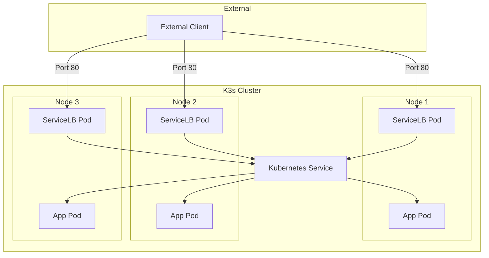
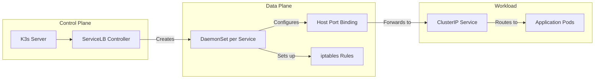
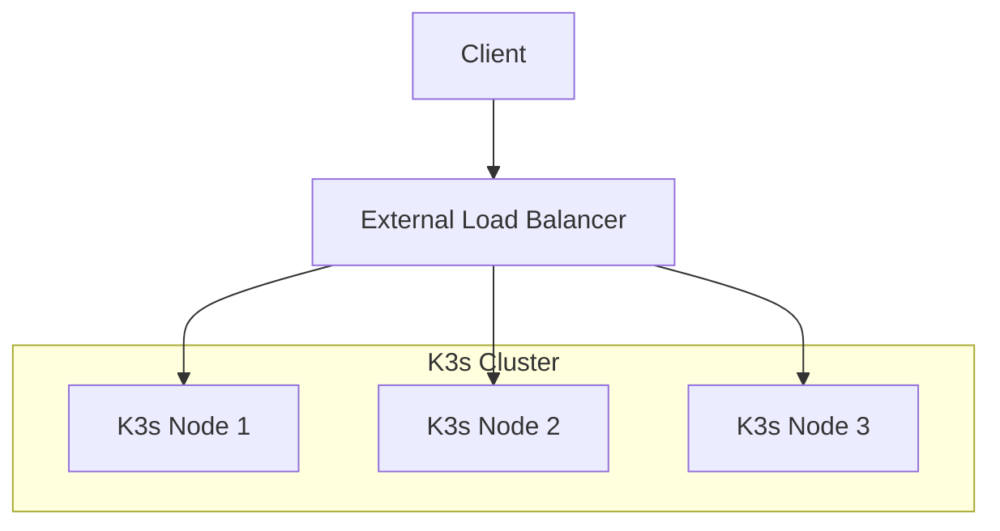

# How to Configure K3s Service Load Balancer

Author: [nawazdhandala](https://www.github.com/nawazdhandala)

Tags: K3s, Kubernetes, Load Balancer, ServiceLB, Klipper, Networking, DevOps

Description: A practical guide to configuring the built-in K3s Service Load Balancer (formerly Klipper). Covers setup, configuration options, multi-node deployments, and when to use external load balancers instead.

---

K3s ships with a built-in service load balancer called ServiceLB (previously known as Klipper). Unlike managed Kubernetes offerings from cloud providers, K3s needs to handle LoadBalancer-type services on bare metal, edge devices, and VMs where no cloud load balancer exists. ServiceLB fills that gap elegantly.

## How ServiceLB Works

When you create a Service with `type: LoadBalancer` in K3s, ServiceLB automatically deploys DaemonSet pods that listen on the node's host ports. Traffic hitting any node on the specified port gets forwarded to the service.



The key insight: ServiceLB uses host networking to bind directly to node ports, making your services accessible via any node's IP address.

## Verifying ServiceLB Is Enabled

ServiceLB comes enabled by default in K3s. Check that the controller is running before creating LoadBalancer services.

```bash
# Check if ServiceLB controller pods exist
# You should see svclb-* pods for each LoadBalancer service
kubectl get pods -n kube-system | grep svclb

# Check if any LoadBalancer services already exist
kubectl get svc --all-namespaces | grep LoadBalancer
```

## Creating Your First LoadBalancer Service

Create a simple deployment and expose it via LoadBalancer. ServiceLB automatically provisions the external access.

```yaml
# deployment.yaml
# Deploy a simple nginx web server with 3 replicas
apiVersion: apps/v1
kind: Deployment
metadata:
  name: web-app
  namespace: default
spec:
  replicas: 3
  selector:
    matchLabels:
      app: web-app
  template:
    metadata:
      labels:
        app: web-app
    spec:
      containers:
        - name: nginx
          image: nginx:1.25
          ports:
            - containerPort: 80
          resources:
            requests:
              cpu: 100m
              memory: 128Mi
            limits:
              cpu: 500m
              memory: 256Mi
---
# service.yaml
# Expose the deployment via LoadBalancer on port 80
apiVersion: v1
kind: Service
metadata:
  name: web-app
  namespace: default
spec:
  type: LoadBalancer           # Triggers ServiceLB
  selector:
    app: web-app
  ports:
    - port: 80                 # External port
      targetPort: 80           # Container port
      protocol: TCP
```

Apply and verify the service gets an external IP address. On K3s, the external IP will be the node IP.

```bash
# Apply the manifests
kubectl apply -f deployment.yaml

# Watch the service until EXTERNAL-IP is assigned
# The IP will be one of your node IPs
kubectl get svc web-app -w

# Check the ServiceLB pods created for your service
kubectl get pods -n kube-system -l svccontroller.k3s.cattle.io/svcname=web-app
```

## Configuring ServiceLB Behavior

### Restricting to Specific Nodes

By default, ServiceLB runs on all nodes. Use annotations to restrict which nodes handle load balancer traffic.

```yaml
apiVersion: v1
kind: Service
metadata:
  name: web-app
  namespace: default
  annotations:
    # Only run ServiceLB on nodes with this label
    svccontroller.k3s.cattle.io/lbpool: "frontend"
spec:
  type: LoadBalancer
  selector:
    app: web-app
  ports:
    - port: 80
      targetPort: 80
```

Label your frontend nodes to match the annotation.

```bash
# Label specific nodes for load balancing duties
kubectl label node k3s-node-1 svccontroller.k3s.cattle.io/lbpool=frontend
kubectl label node k3s-node-2 svccontroller.k3s.cattle.io/lbpool=frontend

# Verify labels
kubectl get nodes --show-labels | grep lbpool
```

### Setting a Static External IP

Request a specific IP address instead of letting K3s choose automatically.

```yaml
apiVersion: v1
kind: Service
metadata:
  name: web-app
  namespace: default
spec:
  type: LoadBalancer
  loadBalancerIP: 192.168.1.100  # Request specific IP
  selector:
    app: web-app
  ports:
    - port: 80
      targetPort: 80
```

Note: The IP must be available on at least one node for ServiceLB to bind successfully.

### Exposing Multiple Ports

A single LoadBalancer service can expose multiple ports. Each port gets its own ServiceLB binding.

```yaml
apiVersion: v1
kind: Service
metadata:
  name: my-app
  namespace: default
spec:
  type: LoadBalancer
  selector:
    app: my-app
  ports:
    # HTTP traffic
    - name: http
      port: 80
      targetPort: 8080
      protocol: TCP
    # HTTPS traffic
    - name: https
      port: 443
      targetPort: 8443
      protocol: TCP
    # Custom API port
    - name: api
      port: 9000
      targetPort: 9000
      protocol: TCP
```

## ServiceLB Architecture Deep Dive

Understanding the internal architecture helps when troubleshooting issues or planning capacity.



The controller watches for LoadBalancer services, creates DaemonSets in the kube-system namespace, and updates service status with the external IP once pods are running.

## Multi-Node Load Balancing Strategies

### Round-Robin DNS

For high availability, register multiple node IPs in DNS. Clients will naturally distribute across nodes.

```bash
# Example DNS configuration (in your DNS provider)
# myapp.example.com  A  192.168.1.10  (node-1)
# myapp.example.com  A  192.168.1.11  (node-2)
# myapp.example.com  A  192.168.1.12  (node-3)

# Verify DNS returns multiple IPs
dig +short myapp.example.com
```

### External Load Balancer Integration

For production deployments, place an external load balancer (HAProxy, NGINX, cloud LB) in front of K3s nodes.



HAProxy configuration example for load balancing across K3s nodes.

```haproxy
# /etc/haproxy/haproxy.cfg
frontend http_front
    bind *:80
    default_backend k3s_backend

backend k3s_backend
    balance roundrobin
    option httpchk GET /healthz
    # K3s nodes running ServiceLB
    server node1 192.168.1.10:80 check
    server node2 192.168.1.11:80 check
    server node3 192.168.1.12:80 check
```

## Disabling ServiceLB

Some scenarios require disabling the built-in load balancer, such as using MetalLB or a cloud provider integration.

Disable ServiceLB during K3s installation by adding the disable flag.

```bash
# Server installation without ServiceLB
curl -sfL https://get.k3s.io | INSTALL_K3S_EXEC="--disable=servicelb" sh -

# Or add to existing config file
# /etc/rancher/k3s/config.yaml
# disable:
#   - servicelb
```

Verify ServiceLB is disabled by checking that no svclb pods exist and LoadBalancer services stay pending.

```bash
# No svclb pods should exist
kubectl get pods -n kube-system | grep svclb

# LoadBalancer services will show <pending> for EXTERNAL-IP
kubectl get svc --all-namespaces | grep LoadBalancer
```

## Using MetalLB Instead

MetalLB provides more advanced load balancing features like IP address pools and BGP integration. Install it after disabling ServiceLB.

First, disable ServiceLB on all K3s nodes, then install MetalLB.

```bash
# Install MetalLB using Helm
helm repo add metallb https://metallb.github.io/metallb
helm repo update

helm install metallb metallb/metallb \
  --namespace metallb-system \
  --create-namespace
```

Configure an IP address pool for MetalLB to assign.

```yaml
# metallb-config.yaml
# Define the IP range MetalLB can assign to LoadBalancer services
apiVersion: metallb.io/v1beta1
kind: IPAddressPool
metadata:
  name: default-pool
  namespace: metallb-system
spec:
  addresses:
    - 192.168.1.200-192.168.1.250  # Available IP range
---
# Enable Layer 2 advertisement (simplest mode)
apiVersion: metallb.io/v1beta1
kind: L2Advertisement
metadata:
  name: default
  namespace: metallb-system
spec:
  ipAddressPools:
    - default-pool
```

```bash
# Apply MetalLB configuration
kubectl apply -f metallb-config.yaml

# Verify MetalLB pods are running
kubectl get pods -n metallb-system
```

## Troubleshooting ServiceLB

### Service Stuck in Pending

When EXTERNAL-IP shows pending, the ServiceLB pods may have failed to start.

```bash
# Check if ServiceLB pods exist for your service
kubectl get pods -n kube-system -l svccontroller.k3s.cattle.io/svcname=<service-name>

# View ServiceLB pod logs for errors
kubectl logs -n kube-system -l svccontroller.k3s.cattle.io/svcname=<service-name>

# Check events for the service
kubectl describe svc <service-name>
```

### Port Already in Use

ServiceLB fails when another process already binds the requested port.

```bash
# Check what's using the port on each node
# SSH to each node and run:
sudo netstat -tlnp | grep :80

# Or use ss
sudo ss -tlnp | grep :80

# Common culprits: nginx, apache, other ingress controllers
```

### Connection Refused Errors

Verify the full path from external client to application pods.

```bash
# Test from outside the cluster
curl -v http://<node-ip>:80

# Test the ClusterIP service from inside a pod
kubectl run curl --rm -it --image=curlimages/curl -- curl http://<service-name>.<namespace>.svc

# Check application pod logs
kubectl logs -l app=<app-name>
```

### ServiceLB Pods Crashing

Check resource constraints and node capacity.

```bash
# Check pod status and restart count
kubectl get pods -n kube-system -l svccontroller.k3s.cattle.io/svcname=<service-name>

# Describe pods for events and status
kubectl describe pods -n kube-system -l svccontroller.k3s.cattle.io/svcname=<service-name>

# Check node resources
kubectl top nodes
```

## Production Best Practices

### Health Check Configuration

Add readiness probes to ensure traffic only goes to healthy pods.

```yaml
apiVersion: apps/v1
kind: Deployment
metadata:
  name: web-app
spec:
  replicas: 3
  selector:
    matchLabels:
      app: web-app
  template:
    metadata:
      labels:
        app: web-app
    spec:
      containers:
        - name: app
          image: myapp:latest
          ports:
            - containerPort: 8080
          # Readiness probe prevents traffic to unhealthy pods
          readinessProbe:
            httpGet:
              path: /health
              port: 8080
            initialDelaySeconds: 5
            periodSeconds: 10
          # Liveness probe restarts crashed containers
          livenessProbe:
            httpGet:
              path: /health
              port: 8080
            initialDelaySeconds: 15
            periodSeconds: 20
```

### Session Affinity

Enable session affinity when your application requires sticky sessions.

```yaml
apiVersion: v1
kind: Service
metadata:
  name: web-app
spec:
  type: LoadBalancer
  sessionAffinity: ClientIP        # Stick clients to same pod
  sessionAffinityConfig:
    clientIP:
      timeoutSeconds: 3600         # Session timeout: 1 hour
  selector:
    app: web-app
  ports:
    - port: 80
      targetPort: 8080
```

### Resource Limits for ServiceLB

While ServiceLB pods are lightweight, ensure nodes have headroom for them.

```yaml
# Check current ServiceLB pod resource usage
kubectl top pods -n kube-system | grep svclb
```

Each ServiceLB pod typically uses minimal resources (10-50Mi memory, negligible CPU) but runs on every selected node.

## ServiceLB vs Cloud Load Balancers vs MetalLB

| Feature | ServiceLB | Cloud LB | MetalLB |
|---------|-----------|----------|---------|
| Setup Complexity | None | Cloud-specific | Medium |
| Cost | Free | Per-LB pricing | Free |
| IP Pools | Node IPs | Elastic IPs | Configurable |
| BGP Support | No | Depends | Yes |
| High Availability | Manual | Built-in | Configurable |
| Best For | Development, edge | Cloud deployments | Bare metal production |

## When to Use What

### ServiceLB Is Ideal For:

- Development and testing environments
- Single-node K3s deployments
- Edge computing with limited resources
- Simple bare metal setups
- IoT gateways and appliances

### Consider MetalLB When:

- Running production workloads on bare metal
- Needing dedicated IP addresses per service
- Requiring BGP integration with network infrastructure
- Operating multi-tenant environments

### Use Cloud Load Balancers When:

- Running K3s on cloud VMs (AWS, GCP, Azure)
- Needing managed SSL termination
- Requiring DDoS protection
- Integrating with cloud-native services

---

ServiceLB makes K3s remarkably practical for environments without cloud load balancers. For simple deployments, the zero-configuration approach works out of the box. For production workloads on bare metal, evaluate MetalLB for its additional features. Either way, understanding how traffic flows from external clients to your pods helps you build reliable services on K3s.
