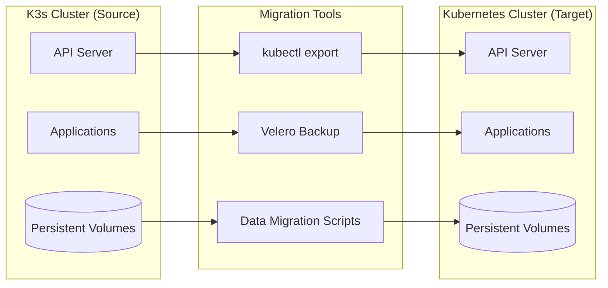
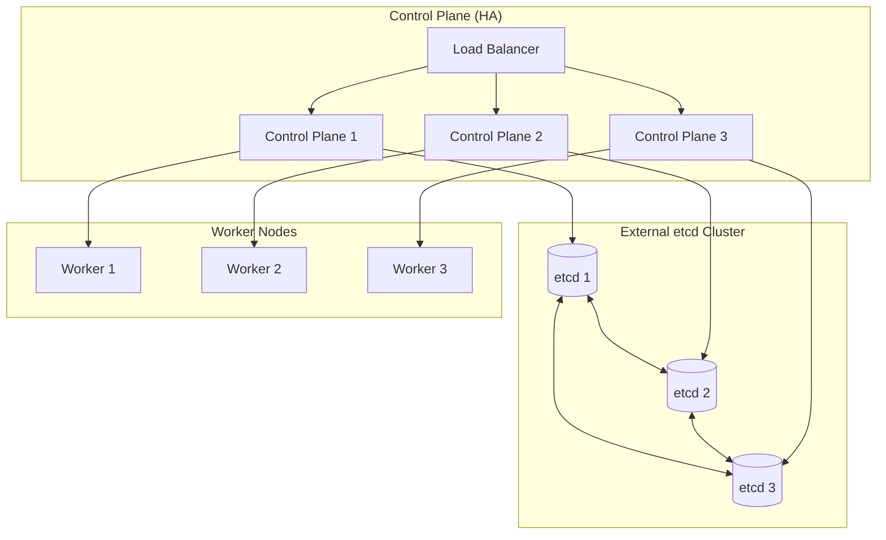
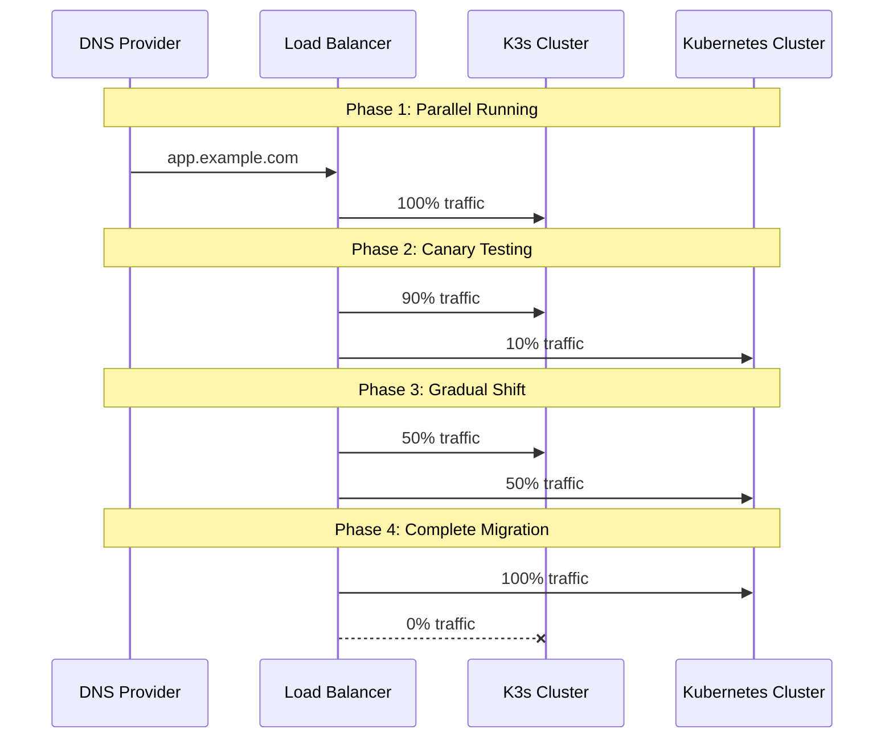

# How to Migrate from K3s to Full Kubernetes

Author: [nawazdhandala](https://www.github.com/nawazdhandala)

Tags: K3s, Kubernetes, Migration, DevOps, Kubeadm, Container Orchestration

Description: A comprehensive guide to migrating your workloads from K3s to a full Kubernetes cluster using kubeadm, including backup strategies, resource export techniques, and production deployment patterns.

---

K3s serves as an excellent entry point into the Kubernetes ecosystem. The lightweight distribution handles edge deployments, home labs, and development environments with minimal overhead. But as your infrastructure grows, you may need features that K3s intentionally excludes: external etcd clusters, advanced networking options, or specific cloud provider integrations.

Migrating from K3s to full Kubernetes involves more than copying YAML files. You need to extract your existing workloads, prepare a new cluster with proper configuration, and orchestrate the transition with minimal downtime. The process requires careful planning, especially for stateful applications with persistent data.

## When to Consider Migration

K3s works well for many production scenarios. Before investing time in migration, evaluate whether full Kubernetes actually solves a problem you have:

| Scenario | Recommendation |
| --- | --- |
| Need external etcd for strict HA requirements | Migrate to kubeadm |
| Require specific cloud controller manager | Migrate to kubeadm or managed K8s |
| Running at edge with limited resources | Stay with K3s |
| Need certified Kubernetes conformance | Migrate to kubeadm |
| Development and testing environments | Stay with K3s |
| Custom CNI not supported by K3s | Migrate to kubeadm |

If your K3s cluster handles production traffic reliably today, migration introduces risk without guaranteed benefit. Only proceed when you have concrete requirements that K3s cannot satisfy.

## Migration Architecture Overview

The migration follows a blue-green pattern where both clusters run simultaneously during transition. Workloads move incrementally, validated at each step before proceeding.



The migration process consists of four phases:

1. **Inventory and Assessment** - Catalog all resources in K3s
2. **Cluster Preparation** - Set up the target Kubernetes cluster
3. **Resource Migration** - Export and import Kubernetes objects
4. **Data Migration** - Move persistent volumes and verify integrity

## Prerequisites

Before starting migration, ensure you have:

- kubectl configured to access both clusters (use different contexts)
- Sufficient infrastructure for the new Kubernetes cluster
- Backup storage accessible from both environments
- Maintenance window for stateful application migration
- Documented rollback procedure if migration fails

Verify kubectl can reach your K3s cluster before proceeding.

```bash
# Confirm connectivity to K3s cluster and view existing contexts
kubectl config get-contexts

# Switch to K3s context (adjust name based on your setup)
kubectl config use-context k3s-cluster

# Verify cluster access works
kubectl get nodes
```

## Phase 1: Inventory Your K3s Cluster

Start by documenting everything running in your K3s cluster. Missing resources during migration leads to broken deployments and debugging sessions at 2 AM.

The following script exports a complete inventory of your cluster resources to a JSON file for review.

```bash
#!/bin/bash
# k3s-inventory.sh
# Generates a complete inventory of K3s cluster resources

INVENTORY_DIR="./k3s-inventory"
mkdir -p "$INVENTORY_DIR"

# Capture all namespaces for iteration
echo "Collecting namespace list..."
kubectl get namespaces -o jsonpath='{.items[*].metadata.name}' > "$INVENTORY_DIR/namespaces.txt"

# Export all resource types across all namespaces
# Using api-resources ensures we capture CRDs and custom resources
echo "Discovering API resources..."
kubectl api-resources --verbs=list --namespaced -o name | while read resource; do
    echo "Exporting $resource..."
    kubectl get "$resource" --all-namespaces -o yaml > "$INVENTORY_DIR/${resource}.yaml" 2>/dev/null
done

# Export cluster-scoped resources separately
echo "Exporting cluster-scoped resources..."
kubectl api-resources --verbs=list --namespaced=false -o name | while read resource; do
    echo "Exporting cluster resource: $resource..."
    kubectl get "$resource" -o yaml > "$INVENTORY_DIR/cluster-${resource}.yaml" 2>/dev/null
done

# Generate summary report
echo "Generating inventory summary..."
cat > "$INVENTORY_DIR/summary.txt" << EOF
K3s Cluster Inventory - $(date)
================================
Namespaces: $(kubectl get namespaces --no-headers | wc -l)
Deployments: $(kubectl get deployments -A --no-headers | wc -l)
StatefulSets: $(kubectl get statefulsets -A --no-headers | wc -l)
Services: $(kubectl get services -A --no-headers | wc -l)
ConfigMaps: $(kubectl get configmaps -A --no-headers | wc -l)
Secrets: $(kubectl get secrets -A --no-headers | wc -l)
PersistentVolumeClaims: $(kubectl get pvc -A --no-headers | wc -l)
Ingresses: $(kubectl get ingress -A --no-headers | wc -l)
CRDs: $(kubectl get crds --no-headers | wc -l)
EOF

cat "$INVENTORY_DIR/summary.txt"
echo "Inventory complete. Files saved to $INVENTORY_DIR/"
```

Run the inventory script and review the output carefully.

```bash
# Make the script executable and run it
chmod +x k3s-inventory.sh
./k3s-inventory.sh
```

Pay special attention to:

- **Custom Resource Definitions (CRDs)**: Operators and custom controllers need their CRDs installed first
- **Secrets**: Some may reference K3s-specific service accounts
- **StorageClasses**: K3s uses local-path-provisioner by default
- **Ingress configurations**: Traefik annotations differ from nginx-ingress

## Phase 2: Set Up Target Kubernetes Cluster

Initialize a new Kubernetes cluster using kubeadm. For production environments, deploy at least three control plane nodes and separate etcd clusters.

The diagram below shows a recommended production architecture.



### Install Container Runtime

Kubernetes requires a container runtime. Containerd works well and matches what K3s uses internally.

```bash
# Install containerd on all nodes
# Update packages and install prerequisites
sudo apt-get update
sudo apt-get install -y apt-transport-https ca-certificates curl software-properties-common

# Add Docker repository for containerd packages
curl -fsSL https://download.docker.com/linux/ubuntu/gpg | sudo gpg --dearmor -o /usr/share/keyrings/docker-archive-keyring.gpg
echo "deb [arch=amd64 signed-by=/usr/share/keyrings/docker-archive-keyring.gpg] https://download.docker.com/linux/ubuntu $(lsb_release -cs) stable" | sudo tee /etc/apt/sources.list.d/docker.list

sudo apt-get update
sudo apt-get install -y containerd.io

# Configure containerd to use systemd cgroup driver
sudo mkdir -p /etc/containerd
containerd config default | sudo tee /etc/containerd/config.toml
sudo sed -i 's/SystemdCgroup = false/SystemdCgroup = true/' /etc/containerd/config.toml
sudo systemctl restart containerd
```

### Configure Kernel Parameters

Kubernetes networking requires specific kernel modules and sysctl settings.

```bash
# Load required kernel modules immediately
sudo modprobe overlay
sudo modprobe br_netfilter

# Persist modules across reboots
cat <<EOF | sudo tee /etc/modules-load.d/kubernetes.conf
overlay
br_netfilter
EOF

# Configure network settings for Kubernetes
cat <<EOF | sudo tee /etc/sysctl.d/kubernetes.conf
net.bridge.bridge-nf-call-iptables  = 1
net.bridge.bridge-nf-call-ip6tables = 1
net.ipv4.ip_forward                 = 1
EOF

# Apply sysctl settings without reboot
sudo sysctl --system
```

### Install Kubeadm, Kubelet, and Kubectl

Add the Kubernetes repository and install the required binaries.

```bash
# Add Kubernetes apt repository signing key
curl -fsSL https://pkgs.k8s.io/core:/stable:/v1.31/deb/Release.key | sudo gpg --dearmor -o /etc/apt/keyrings/kubernetes-apt-keyring.gpg

# Add the repository
echo 'deb [signed-by=/etc/apt/keyrings/kubernetes-apt-keyring.gpg] https://pkgs.k8s.io/core:/stable:/v1.31/deb/ /' | sudo tee /etc/apt/sources.list.d/kubernetes.list

# Install kubernetes components
sudo apt-get update
sudo apt-get install -y kubelet kubeadm kubectl

# Prevent automatic upgrades which could break your cluster
sudo apt-mark hold kubelet kubeadm kubectl
```

### Initialize the Control Plane

Create a kubeadm configuration file that matches your network requirements.

```yaml
# kubeadm-config.yaml
# Configuration for initializing the Kubernetes control plane
apiVersion: kubeadm.k8s.io/v1beta3
kind: ClusterConfiguration
kubernetesVersion: "1.31.0"
controlPlaneEndpoint: "loadbalancer.example.com:6443"
networking:
  podSubnet: "10.244.0.0/16"      # Match your CNI requirements
  serviceSubnet: "10.96.0.0/12"
apiServer:
  certSANs:
    - "loadbalancer.example.com"
    - "192.168.1.100"             # Add all IPs that may access the API
---
apiVersion: kubeadm.k8s.io/v1beta3
kind: InitConfiguration
localAPIEndpoint:
  advertiseAddress: "192.168.1.101"
  bindPort: 6443
nodeRegistration:
  criSocket: "unix:///var/run/containerd/containerd.sock"
```

Initialize the first control plane node with the configuration.

```bash
# Initialize the cluster using the configuration file
# Save the output - it contains the join commands for other nodes
sudo kubeadm init --config=kubeadm-config.yaml --upload-certs | tee kubeadm-init.log

# Configure kubectl for your user
mkdir -p $HOME/.kube
sudo cp /etc/kubernetes/admin.conf $HOME/.kube/config
sudo chown $(id -u):$(id -g) $HOME/.kube/config
```

### Install a CNI Plugin

Kubernetes requires a Container Network Interface (CNI) plugin. Calico provides network policy support and works well at scale.

```bash
# Install Calico CNI for pod networking and network policies
kubectl apply -f https://raw.githubusercontent.com/projectcalico/calico/v3.27.0/manifests/calico.yaml

# Wait for Calico pods to become ready before proceeding
kubectl wait --for=condition=Ready pods -l k8s-app=calico-node -n kube-system --timeout=300s
```

### Join Additional Nodes

Use the join commands from the kubeadm init output to add more control plane nodes and workers.

```bash
# Join command for additional control plane nodes
# Replace tokens with actual values from kubeadm init output
sudo kubeadm join loadbalancer.example.com:6443 \
  --token <token> \
  --discovery-token-ca-cert-hash sha256:<hash> \
  --control-plane \
  --certificate-key <cert-key>

# Join command for worker nodes (simpler, no control-plane flag)
sudo kubeadm join loadbalancer.example.com:6443 \
  --token <token> \
  --discovery-token-ca-cert-hash sha256:<hash>
```

Verify all nodes joined successfully.

```bash
# List all nodes and their status
kubectl get nodes -o wide

# Check system pods are running on all nodes
kubectl get pods -n kube-system -o wide
```

## Phase 3: Migrate Kubernetes Resources

With both clusters running, begin migrating workloads. Start with stateless applications and work toward stateful ones.

### Set Up Dual-Cluster kubectl Access

Configure kubectl to switch between clusters easily.

```bash
# Add the new cluster to your kubeconfig
# Assuming the admin.conf is accessible
export KUBECONFIG=~/.kube/config:~/.kube/k3s-config:~/.kube/k8s-config

# Merge configurations
kubectl config view --flatten > ~/.kube/merged-config
mv ~/.kube/merged-config ~/.kube/config

# Rename contexts for clarity
kubectl config rename-context k3s k3s-source
kubectl config rename-context kubernetes-admin@kubernetes k8s-target

# Verify both contexts exist
kubectl config get-contexts
```

### Export Resources from K3s

Create a migration script that exports resources in a clean, reusable format.

```bash
#!/bin/bash
# export-resources.sh
# Exports Kubernetes resources from K3s, removing cluster-specific metadata

EXPORT_DIR="./k3s-export"
mkdir -p "$EXPORT_DIR"

# Switch to source cluster
kubectl config use-context k3s-source

# Function to clean exported YAML
# Removes auto-generated fields that should not be applied to new cluster
clean_export() {
    local resource=$1
    local namespace=$2
    local output=$3

    kubectl get "$resource" -n "$namespace" -o yaml | \
    yq eval 'del(.metadata.uid,
              .metadata.resourceVersion,
              .metadata.creationTimestamp,
              .metadata.generation,
              .metadata.managedFields,
              .metadata.selfLink,
              .metadata.annotations["kubectl.kubernetes.io/last-applied-configuration"],
              .status)' - > "$output"
}

# List of namespaces to migrate (exclude system namespaces)
NAMESPACES=$(kubectl get namespaces -o jsonpath='{.items[*].metadata.name}' | tr ' ' '\n' | grep -v "^kube-" | grep -v "^default$")

for ns in $NAMESPACES; do
    echo "Processing namespace: $ns"
    mkdir -p "$EXPORT_DIR/$ns"

    # Export each resource type
    for resource in configmaps secrets deployments services statefulsets daemonsets \
                    ingresses persistentvolumeclaims horizontalpodautoscalers \
                    serviceaccounts roles rolebindings networkpolicies; do

        count=$(kubectl get "$resource" -n "$ns" --no-headers 2>/dev/null | wc -l)
        if [ "$count" -gt 0 ]; then
            echo "  Exporting $count $resource..."
            clean_export "$resource" "$ns" "$EXPORT_DIR/$ns/${resource}.yaml"
        fi
    done
done

echo "Export complete. Resources saved to $EXPORT_DIR/"
```

### Handle K3s-Specific Resources

Some K3s resources need transformation before applying to standard Kubernetes.

The following table shows common mappings between K3s and standard Kubernetes:

| K3s Resource | Standard Kubernetes Equivalent |
| --- | --- |
| Traefik IngressRoute | Ingress or nginx-ingress annotations |
| local-path StorageClass | Your target storage provisioner |
| ServiceLB annotations | MetalLB or cloud load balancer |
| K3s-specific tolerations | Remove or update for target cluster |

Create a transformation script for ingress resources if migrating from Traefik to nginx.

```python
#!/usr/bin/env python3
# transform-ingress.py
# Converts Traefik IngressRoute CRDs to standard Kubernetes Ingress objects

import yaml
import sys
import os

def transform_traefik_to_ingress(traefik_route):
    """
    Transform a Traefik IngressRoute to a standard Kubernetes Ingress.
    Handles common annotations and path matching rules.
    """
    ingress = {
        'apiVersion': 'networking.k8s.io/v1',
        'kind': 'Ingress',
        'metadata': {
            'name': traefik_route['metadata']['name'],
            'namespace': traefik_route['metadata']['namespace'],
            'annotations': {
                'kubernetes.io/ingress.class': 'nginx'
            }
        },
        'spec': {
            'rules': []
        }
    }

    # Convert Traefik routes to Ingress rules
    for route in traefik_route.get('spec', {}).get('routes', []):
        # Parse the match expression (simplified parsing)
        match = route.get('match', '')

        # Extract host from Host(`example.com`) pattern
        if 'Host(' in match:
            host = match.split('Host(`')[1].split('`)')[0]
        else:
            host = '*'

        # Build path rules from services
        paths = []
        for service in route.get('services', []):
            paths.append({
                'path': route.get('match', '/').split('PathPrefix(`')[-1].rstrip('`)') if 'PathPrefix' in route.get('match', '') else '/',
                'pathType': 'Prefix',
                'backend': {
                    'service': {
                        'name': service['name'],
                        'port': {
                            'number': service.get('port', 80)
                        }
                    }
                }
            })

        ingress['spec']['rules'].append({
            'host': host if host != '*' else None,
            'http': {
                'paths': paths
            }
        })

    # Handle TLS configuration
    tls_config = traefik_route.get('spec', {}).get('tls', {})
    if tls_config:
        ingress['spec']['tls'] = [{
            'hosts': [rule['host'] for rule in ingress['spec']['rules'] if rule.get('host')],
            'secretName': tls_config.get('secretName', 'tls-secret')
        }]

    return ingress

def main():
    if len(sys.argv) < 2:
        print("Usage: transform-ingress.py <input-file> [output-file]")
        sys.exit(1)

    input_file = sys.argv[1]
    output_file = sys.argv[2] if len(sys.argv) > 2 else None

    with open(input_file, 'r') as f:
        documents = list(yaml.safe_load_all(f))

    transformed = []
    for doc in documents:
        if doc and doc.get('kind') == 'IngressRoute':
            transformed.append(transform_traefik_to_ingress(doc))
        elif doc:
            transformed.append(doc)

    output = yaml.dump_all(transformed, default_flow_style=False)

    if output_file:
        with open(output_file, 'w') as f:
            f.write(output)
        print(f"Transformed ingress written to {output_file}")
    else:
        print(output)

if __name__ == '__main__':
    main()
```

### Apply Resources to Target Cluster

Apply exported resources in the correct order to satisfy dependencies.

```bash
#!/bin/bash
# import-resources.sh
# Imports resources into the target Kubernetes cluster in dependency order

EXPORT_DIR="./k3s-export"

# Switch to target cluster
kubectl config use-context k8s-target

# Apply order matters for dependencies
RESOURCE_ORDER=(
    "namespaces"
    "serviceaccounts"
    "secrets"
    "configmaps"
    "persistentvolumeclaims"
    "services"
    "deployments"
    "statefulsets"
    "daemonsets"
    "horizontalpodautoscalers"
    "ingresses"
    "networkpolicies"
)

# First, create namespaces
for ns_dir in "$EXPORT_DIR"/*/; do
    ns=$(basename "$ns_dir")
    echo "Creating namespace: $ns"
    kubectl create namespace "$ns" --dry-run=client -o yaml | kubectl apply -f -
done

# Apply resources in order
for resource in "${RESOURCE_ORDER[@]}"; do
    echo "Applying $resource..."
    for ns_dir in "$EXPORT_DIR"/*/; do
        ns=$(basename "$ns_dir")
        file="$ns_dir/${resource}.yaml"
        if [ -f "$file" ]; then
            echo "  Applying $resource in $ns..."
            kubectl apply -f "$file" -n "$ns" 2>&1 | grep -v "unchanged"
        fi
    done
done

echo "Import complete. Verify resources:"
kubectl get pods -A
```

## Phase 4: Migrate Persistent Data

Stateful applications require careful data migration to prevent loss or corruption.

### Option 1: Velero Backup and Restore

Velero provides cluster-level backup and restore capabilities that work across different Kubernetes distributions.

Install Velero in both clusters with a shared object storage backend.

```bash
# Install Velero CLI
curl -LO https://github.com/vmware-tanzu/velero/releases/download/v1.13.0/velero-v1.13.0-linux-amd64.tar.gz
tar -xvf velero-v1.13.0-linux-amd64.tar.gz
sudo mv velero-v1.13.0-linux-amd64/velero /usr/local/bin/

# Create credentials file for S3-compatible storage
cat > credentials-velero << EOF
[default]
aws_access_key_id=YOUR_ACCESS_KEY
aws_secret_access_key=YOUR_SECRET_KEY
EOF

# Install Velero in K3s source cluster
kubectl config use-context k3s-source
velero install \
  --provider aws \
  --plugins velero/velero-plugin-for-aws:v1.9.0 \
  --bucket velero-backups \
  --secret-file ./credentials-velero \
  --backup-location-config region=us-east-1,s3ForcePathStyle=true,s3Url=https://s3.example.com \
  --use-volume-snapshots=false

# Install Velero in target cluster with same configuration
kubectl config use-context k8s-target
velero install \
  --provider aws \
  --plugins velero/velero-plugin-for-aws:v1.9.0 \
  --bucket velero-backups \
  --secret-file ./credentials-velero \
  --backup-location-config region=us-east-1,s3ForcePathStyle=true,s3Url=https://s3.example.com \
  --use-volume-snapshots=false
```

Create a backup in the source cluster.

```bash
# Switch to source cluster
kubectl config use-context k3s-source

# Create a backup of all resources and persistent volumes
# Include all namespaces except system namespaces
velero backup create k3s-full-backup \
  --exclude-namespaces kube-system,kube-public,kube-node-lease \
  --include-resources '*' \
  --default-volumes-to-fs-backup \
  --wait

# Verify backup completed successfully
velero backup describe k3s-full-backup
velero backup logs k3s-full-backup
```

Restore in the target cluster.

```bash
# Switch to target cluster
kubectl config use-context k8s-target

# Restore from the backup
# Map storage classes if they differ between clusters
velero restore create k3s-restore \
  --from-backup k3s-full-backup \
  --restore-volumes=true \
  --wait

# Check restore status
velero restore describe k3s-restore
velero restore logs k3s-restore
```

### Option 2: Manual Data Migration

For fine-grained control, migrate data manually using rsync or database-native tools.

The following script handles PostgreSQL database migration between clusters.

```bash
#!/bin/bash
# migrate-postgres.sh
# Migrates PostgreSQL data between K3s and target Kubernetes clusters

SOURCE_CONTEXT="k3s-source"
TARGET_CONTEXT="k8s-target"
NAMESPACE="database"
POD_LABEL="app=postgresql"
DUMP_FILE="/tmp/postgres-migration.sql"

# Scale down applications writing to the database
echo "Scaling down dependent applications..."
kubectl --context="$TARGET_CONTEXT" -n "$NAMESPACE" scale deployment --all --replicas=0

# Get source pod name
SOURCE_POD=$(kubectl --context="$SOURCE_CONTEXT" -n "$NAMESPACE" get pods -l "$POD_LABEL" -o jsonpath='{.items[0].metadata.name}')
echo "Source pod: $SOURCE_POD"

# Create database dump in source cluster
echo "Creating database dump..."
kubectl --context="$SOURCE_CONTEXT" -n "$NAMESPACE" exec "$SOURCE_POD" -- \
  pg_dumpall -U postgres > "$DUMP_FILE"

# Verify dump file size
DUMP_SIZE=$(ls -lh "$DUMP_FILE" | awk '{print $5}')
echo "Dump file size: $DUMP_SIZE"

# Get target pod name
TARGET_POD=$(kubectl --context="$TARGET_CONTEXT" -n "$NAMESPACE" get pods -l "$POD_LABEL" -o jsonpath='{.items[0].metadata.name}')
echo "Target pod: $TARGET_POD"

# Copy dump to target pod
echo "Copying dump to target cluster..."
kubectl --context="$TARGET_CONTEXT" -n "$NAMESPACE" cp "$DUMP_FILE" "$TARGET_POD:/tmp/restore.sql"

# Restore database in target cluster
echo "Restoring database..."
kubectl --context="$TARGET_CONTEXT" -n "$NAMESPACE" exec "$TARGET_POD" -- \
  psql -U postgres -f /tmp/restore.sql

# Scale applications back up
echo "Scaling applications back up..."
kubectl --context="$TARGET_CONTEXT" -n "$NAMESPACE" scale deployment --all --replicas=1

# Cleanup
rm -f "$DUMP_FILE"
echo "Migration complete!"
```

## Validation and Testing

Before switching traffic, validate the migrated environment thoroughly.

### Smoke Tests

Run automated tests against the new cluster to verify functionality.

```bash
#!/bin/bash
# validate-migration.sh
# Runs validation checks against the migrated Kubernetes cluster

TARGET_CONTEXT="k8s-target"
ERRORS=0

echo "=== Migration Validation ==="
kubectl config use-context "$TARGET_CONTEXT"

# Check all pods are running
echo -n "Checking pod health... "
NOT_RUNNING=$(kubectl get pods -A --field-selector=status.phase!=Running,status.phase!=Succeeded --no-headers 2>/dev/null | wc -l)
if [ "$NOT_RUNNING" -gt 0 ]; then
    echo "FAILED - $NOT_RUNNING pods not running"
    kubectl get pods -A --field-selector=status.phase!=Running,status.phase!=Succeeded
    ((ERRORS++))
else
    echo "OK"
fi

# Check all deployments have desired replicas
echo -n "Checking deployment replicas... "
UNHEALTHY=$(kubectl get deployments -A -o jsonpath='{range .items[*]}{.metadata.namespace}/{.metadata.name}: {.status.availableReplicas}/{.spec.replicas}{"\n"}{end}' | grep -v "^$" | awk -F': ' '{split($2,a,"/"); if(a[1]!=a[2] && a[2]!="") print $0}')
if [ -n "$UNHEALTHY" ]; then
    echo "FAILED"
    echo "$UNHEALTHY"
    ((ERRORS++))
else
    echo "OK"
fi

# Check services have endpoints
echo -n "Checking service endpoints... "
NO_ENDPOINTS=$(kubectl get endpoints -A -o jsonpath='{range .items[*]}{.metadata.namespace}/{.metadata.name}: {.subsets[*].addresses[*].ip}{"\n"}{end}' | grep ": $" | wc -l)
if [ "$NO_ENDPOINTS" -gt 0 ]; then
    echo "WARNING - $NO_ENDPOINTS services without endpoints"
    ((ERRORS++))
else
    echo "OK"
fi

# Check persistent volume claims are bound
echo -n "Checking PVC status... "
UNBOUND_PVC=$(kubectl get pvc -A --field-selector=status.phase!=Bound --no-headers 2>/dev/null | wc -l)
if [ "$UNBOUND_PVC" -gt 0 ]; then
    echo "FAILED - $UNBOUND_PVC PVCs not bound"
    kubectl get pvc -A --field-selector=status.phase!=Bound
    ((ERRORS++))
else
    echo "OK"
fi

# Check ingress controllers are working
echo -n "Checking ingress controller... "
INGRESS_PODS=$(kubectl get pods -n ingress-nginx -l app.kubernetes.io/name=ingress-nginx --no-headers 2>/dev/null | grep Running | wc -l)
if [ "$INGRESS_PODS" -eq 0 ]; then
    echo "WARNING - No ingress controller pods found"
else
    echo "OK ($INGRESS_PODS pods)"
fi

echo ""
echo "=== Validation Summary ==="
if [ "$ERRORS" -eq 0 ]; then
    echo "All checks passed!"
    exit 0
else
    echo "$ERRORS check(s) failed. Review errors above."
    exit 1
fi
```

### Compare Resource Counts

Verify resource counts match between clusters.

```bash
# Compare resource counts between source and target clusters
echo "=== Resource Comparison ==="
echo ""
printf "%-30s %10s %10s\n" "Resource" "K3s" "K8s"
printf "%-30s %10s %10s\n" "--------" "---" "---"

for resource in deployments statefulsets daemonsets services configmaps secrets pvc; do
    k3s_count=$(kubectl --context=k3s-source get "$resource" -A --no-headers 2>/dev/null | wc -l)
    k8s_count=$(kubectl --context=k8s-target get "$resource" -A --no-headers 2>/dev/null | wc -l)
    printf "%-30s %10d %10d\n" "$resource" "$k3s_count" "$k8s_count"
done
```

## Traffic Cutover

Once validation passes, switch traffic from K3s to the new cluster.



### DNS-Based Cutover

For simple deployments, update DNS records to point to the new cluster.

```bash
# Update DNS records (example using Route53)
# Reduce TTL before migration to speed up propagation
aws route53 change-resource-record-sets --hosted-zone-id ZONE_ID --change-batch '{
  "Changes": [{
    "Action": "UPSERT",
    "ResourceRecordSet": {
      "Name": "app.example.com",
      "Type": "A",
      "TTL": 60,
      "ResourceRecords": [{"Value": "NEW_CLUSTER_IP"}]
    }
  }]
}'
```

### Load Balancer Weighted Routing

For zero-downtime migration, use weighted routing to gradually shift traffic.

```yaml
# Example: AWS ALB weighted target group configuration
# Gradually increase weight to new cluster target group
apiVersion: v1
kind: ConfigMap
metadata:
  name: traffic-weights
  namespace: migration
data:
  # Adjust these weights during migration
  k3s-weight: "0"
  k8s-weight: "100"
```

## Post-Migration Cleanup

After successful migration and a stability period, decommission the K3s cluster.

```bash
# Final checklist before decommissioning K3s
echo "=== Pre-Decommission Checklist ==="
echo ""
echo "[ ] All traffic routed to new cluster for 48+ hours"
echo "[ ] No errors in new cluster logs"
echo "[ ] Application metrics match pre-migration baseline"
echo "[ ] Final backup of K3s cluster created"
echo "[ ] Stakeholders notified of decommission"
echo ""

# Create final backup before teardown
kubectl config use-context k3s-source
velero backup create k3s-final-backup --wait

# Uninstall K3s from all nodes
# Run on server nodes first, then agents
/usr/local/bin/k3s-uninstall.sh        # On server nodes
/usr/local/bin/k3s-agent-uninstall.sh  # On agent nodes

echo "K3s cluster decommissioned."
```

## Troubleshooting Common Issues

### Pods Stuck in Pending State

Check for resource constraints or missing storage classes.

```bash
# Describe pending pods to find the reason
kubectl describe pods -A | grep -A 20 "Status:.*Pending"

# Check events for scheduling failures
kubectl get events -A --field-selector reason=FailedScheduling
```

### Image Pull Failures

Private registries may need reconfiguration in the new cluster.

```bash
# Verify image pull secrets exist in correct namespaces
kubectl get secrets -A -o jsonpath='{range .items[?(@.type=="kubernetes.io/dockerconfigjson")]}{.metadata.namespace}/{.metadata.name}{"\n"}{end}'

# Create missing pull secrets
kubectl create secret docker-registry regcred \
  --docker-server=registry.example.com \
  --docker-username=user \
  --docker-password=password \
  -n target-namespace
```

### Network Policy Issues

Calico network policies may block traffic that Flannel allowed by default.

```bash
# Check for network policies that may block traffic
kubectl get networkpolicies -A

# Temporarily allow all traffic for debugging (not for production)
kubectl delete networkpolicy --all -n problematic-namespace
```

## Summary

Migrating from K3s to full Kubernetes requires methodical planning and execution. The key phases involve inventorying existing resources, preparing the target cluster infrastructure, exporting and transforming Kubernetes objects, migrating persistent data, and validating everything before cutting over traffic.

K3s and standard Kubernetes share the same API, which simplifies most resource migrations. The challenges typically arise from K3s-specific components like Traefik and the local-path provisioner, which need equivalent replacements in your target environment.

Keep your K3s cluster running until the new environment proves stable under production load. A rollback path eliminates the pressure of an all-or-nothing migration and lets you address issues methodically.

---

*Running Kubernetes in production? [OneUptime](https://oneuptime.com) provides comprehensive monitoring for your clusters with real-time alerting, status pages, and incident management. Track node health, pod restarts, and resource utilization from a single platform.*
