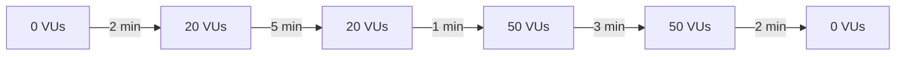
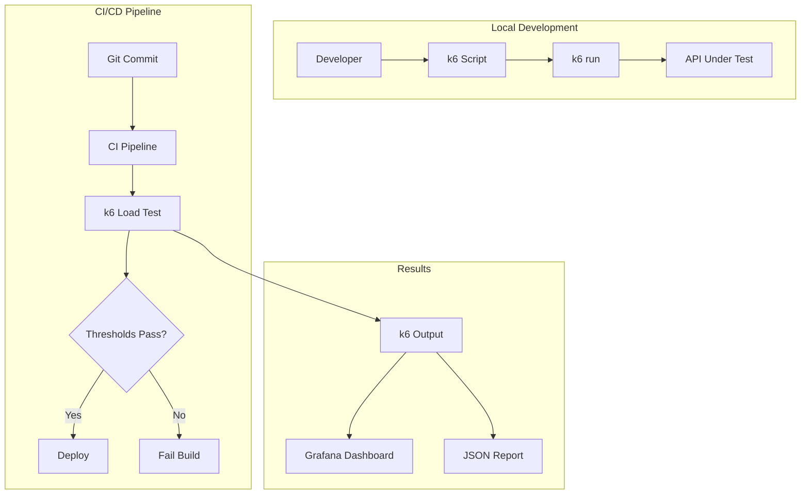

# How to Write k6 Load Tests

Author: [nawazdhandala](https://github.com/nawazdhandala)

Tags: k6, Load Testing, Performance, Testing, API

Description: A practical guide to writing k6 load tests that catch performance issues before they reach production.

---

You need to know how your application behaves under load before users find out the hard way. k6 is a developer-friendly load testing tool that uses JavaScript to define test scenarios. It runs locally, integrates with CI/CD, and provides clear metrics without complex infrastructure.

## Why k6?

| Feature | Benefit |
|---------|---------|
| **JavaScript-based** | Use familiar syntax, no learning curve |
| **Single binary** | No dependencies, runs anywhere |
| **Scriptable scenarios** | Complex user flows, not just simple requests |
| **Built-in metrics** | Response times, error rates, throughput |
| **CI/CD friendly** | Exit codes based on thresholds |

## Installation

k6 runs as a single binary. Install it based on your platform.

```bash
# macOS
brew install k6

# Linux (Debian/Ubuntu)
sudo gpg -k
sudo gpg --no-default-keyring --keyring /usr/share/keyrings/k6-archive-keyring.gpg --keyserver hkp://keyserver.ubuntu.com:80 --recv-keys C5AD17C747E3415A3642D57D77C6C491D6AC1D69
echo "deb [signed-by=/usr/share/keyrings/k6-archive-keyring.gpg] https://dl.k6.io/deb stable main" | sudo tee /etc/apt/sources.list.d/k6.list
sudo apt-get update
sudo apt-get install k6

# Docker
docker run --rm -i grafana/k6 run - <script.js

# Windows
choco install k6
```

## Your First Load Test

This minimal test hits an endpoint with 10 virtual users for 30 seconds. The default function runs once per virtual user iteration.

```javascript
// basic-test.js
// A simple load test that sends GET requests to an endpoint
// VUs (virtual users) run the default function in a loop
import http from 'k6/http';
import { sleep } from 'k6';

export const options = {
  // 10 virtual users making requests simultaneously
  vus: 10,
  // Run for 30 seconds
  duration: '30s',
};

export default function () {
  // Each VU sends a request, then sleeps before the next iteration
  http.get('https://test-api.k6.io/public/crocodiles/');

  // Think time between requests - simulates real user behavior
  sleep(1);
}
```

Run the test from the command line.

```bash
k6 run basic-test.js
```

## Understanding k6 Output

k6 prints metrics after each run. Here's what matters.

```
          /\      |‾‾| /‾‾/   /‾‾/
     /\  /  \     |  |/  /   /  /
    /  \/    \    |     (   /   ‾‾\
   /          \   |  |\  \ |  (‾)  |
  / __________ \  |__| \__\ \_____/

     execution: local
        script: basic-test.js
        output: -

     scenarios: (100.00%) 1 scenario, 10 max VUs, 1m0s max duration
              * default: 10 looping VUs for 30s

     data_received..................: 1.2 MB  40 kB/s
     data_sent......................: 52 kB   1.7 kB/s
     http_req_blocked...............: avg=1.2ms   min=1µs    max=98ms   p(90)=2µs    p(95)=3µs
     http_req_duration..............: avg=142ms   min=120ms  max=280ms  p(90)=165ms  p(95)=180ms
     http_reqs......................: 280     9.33/s
     iteration_duration.............: avg=1.14s   min=1.12s  max=1.38s  p(90)=1.17s  p(95)=1.18s
     iterations.....................: 280     9.33/s
     vus............................: 10      min=10  max=10
     vus_max........................: 10      min=10  max=10
```

| Metric | Meaning |
|--------|---------|
| **http_req_duration** | Response time (focus on p95) |
| **http_reqs** | Total requests and requests/second |
| **iterations** | Completed test iterations |
| **vus** | Active virtual users |

## Testing with Checks

Checks validate response data. Unlike assertions, failed checks don't stop the test - they're recorded as metrics so you can set thresholds on them.

```javascript
// checks-test.js
// Validates responses contain expected data
// Checks are soft assertions - they don't stop the test on failure
import http from 'k6/http';
import { check, sleep } from 'k6';

export const options = {
  vus: 5,
  duration: '30s',
};

export default function () {
  const response = http.get('https://test-api.k6.io/public/crocodiles/');

  // Check multiple conditions on the response
  // Each check is tracked separately in metrics
  check(response, {
    // Status code validation
    'status is 200': (r) => r.status === 200,

    // Response time validation
    'response time < 500ms': (r) => r.timings.duration < 500,

    // Body content validation
    'body contains crocodiles': (r) => r.body.includes('crocodile'),

    // JSON structure validation
    'response is array': (r) => {
      const json = r.json();
      return Array.isArray(json);
    },

    // Array length validation
    'has at least 5 items': (r) => {
      const json = r.json();
      return json.length >= 5;
    },
  });

  sleep(1);
}
```

## Setting Thresholds

Thresholds define pass/fail criteria. If any threshold fails, k6 exits with a non-zero code, which fails your CI/CD pipeline.

```javascript
// thresholds-test.js
// Defines pass/fail criteria for the load test
// Failed thresholds cause k6 to exit with code 99
import http from 'k6/http';
import { check, sleep } from 'k6';

export const options = {
  vus: 20,
  duration: '1m',

  thresholds: {
    // 95th percentile response time must be under 500ms
    http_req_duration: ['p(95)<500'],

    // 99th percentile must be under 1 second
    'http_req_duration{expected_response:true}': ['p(99)<1000'],

    // Error rate must be under 1%
    http_req_failed: ['rate<0.01'],

    // 95% of checks must pass
    checks: ['rate>0.95'],

    // Minimum throughput of 10 requests per second
    http_reqs: ['rate>10'],
  },
};

export default function () {
  const response = http.get('https://test-api.k6.io/public/crocodiles/');

  check(response, {
    'status is 200': (r) => r.status === 200,
    'response time OK': (r) => r.timings.duration < 400,
  });

  sleep(0.5);
}
```

## Ramping Load Patterns

Real traffic doesn't stay constant. Use stages to gradually increase and decrease load, which helps identify at what point your system starts degrading.

```javascript
// stages-test.js
// Simulates realistic traffic patterns with ramping VUs
// Helps identify the breaking point of your system
import http from 'k6/http';
import { check, sleep } from 'k6';

export const options = {
  stages: [
    // Warm up: ramp from 0 to 20 users over 2 minutes
    { duration: '2m', target: 20 },

    // Steady state: maintain 20 users for 5 minutes
    { duration: '5m', target: 20 },

    // Load spike: ramp up to 50 users over 1 minute
    { duration: '1m', target: 50 },

    // Peak load: maintain 50 users for 3 minutes
    { duration: '3m', target: 50 },

    // Cool down: ramp back to 0 over 2 minutes
    { duration: '2m', target: 0 },
  ],

  thresholds: {
    http_req_duration: ['p(95)<600'],
    http_req_failed: ['rate<0.05'],
  },
};

export default function () {
  const response = http.get('https://test-api.k6.io/public/crocodiles/');

  check(response, {
    'status is 200': (r) => r.status === 200,
  });

  sleep(1);
}
```

Here's how the load pattern looks over time:



## Testing API Endpoints with POST Requests

Most real tests involve POST requests with JSON bodies, headers, and authentication.

```javascript
// api-test.js
// Tests API endpoints with authentication and POST requests
// Demonstrates common patterns for API load testing
import http from 'k6/http';
import { check, sleep } from 'k6';

export const options = {
  vus: 10,
  duration: '1m',
  thresholds: {
    http_req_duration: ['p(95)<400'],
    http_req_failed: ['rate<0.01'],
  },
};

const BASE_URL = 'https://test-api.k6.io';

// Setup function runs once before the test starts
// Use it for authentication, data preparation, etc.
export function setup() {
  // Login to get auth token
  const loginResponse = http.post(`${BASE_URL}/auth/token/login/`, JSON.stringify({
    username: 'testuser',
    password: 'testpassword',
  }), {
    headers: { 'Content-Type': 'application/json' },
  });

  const token = loginResponse.json('access');

  return { token };
}

export default function (data) {
  // Common headers for all requests
  const headers = {
    'Content-Type': 'application/json',
    'Authorization': `Bearer ${data.token}`,
  };

  // GET request with auth
  const getResponse = http.get(`${BASE_URL}/my/crocodiles/`, { headers });

  check(getResponse, {
    'GET status is 200': (r) => r.status === 200,
  });

  // POST request with JSON body
  const payload = JSON.stringify({
    name: 'Test Croc',
    sex: 'M',
    date_of_birth: '2020-01-01',
  });

  const postResponse = http.post(`${BASE_URL}/my/crocodiles/`, payload, { headers });

  check(postResponse, {
    'POST status is 201': (r) => r.status === 201,
    'created crocodile has name': (r) => r.json('name') === 'Test Croc',
  });

  // Clean up: delete the created resource
  if (postResponse.status === 201) {
    const id = postResponse.json('id');
    http.del(`${BASE_URL}/my/crocodiles/${id}/`, { headers });
  }

  sleep(1);
}

// Teardown runs once after all VUs finish
export function teardown(data) {
  console.log('Test complete');
}
```

## Grouping Requests

Groups organize related requests together, making it easier to analyze specific user flows in the metrics.

```javascript
// groups-test.js
// Organizes requests into logical groups for better metrics
// Groups appear as separate metrics in the output
import http from 'k6/http';
import { check, group, sleep } from 'k6';

export const options = {
  vus: 5,
  duration: '30s',
};

const BASE_URL = 'https://test-api.k6.io';

export default function () {
  // Group: Homepage flow
  group('homepage', function () {
    const response = http.get(`${BASE_URL}/`);

    check(response, {
      'homepage status is 200': (r) => r.status === 200,
    });

    sleep(1);
  });

  // Group: Browse API
  group('browse crocodiles', function () {
    // List all crocodiles
    const listResponse = http.get(`${BASE_URL}/public/crocodiles/`);

    check(listResponse, {
      'list status is 200': (r) => r.status === 200,
      'list has items': (r) => r.json().length > 0,
    });

    // Get first crocodile details
    const crocodiles = listResponse.json();
    if (crocodiles.length > 0) {
      const detailResponse = http.get(`${BASE_URL}/public/crocodiles/${crocodiles[0].id}/`);

      check(detailResponse, {
        'detail status is 200': (r) => r.status === 200,
        'detail has name': (r) => r.json('name') !== undefined,
      });
    }

    sleep(2);
  });

  // Group: Search
  group('search', function () {
    const response = http.get(`${BASE_URL}/public/crocodiles/?sex=M`);

    check(response, {
      'search status is 200': (r) => r.status === 200,
    });

    sleep(1);
  });
}
```

## Data Parameterization

Real tests need realistic data. Use shared arrays to efficiently distribute test data across virtual users.

```javascript
// parameterized-test.js
// Uses external data to make tests more realistic
// SharedArray efficiently distributes data across VUs
import http from 'k6/http';
import { check, sleep } from 'k6';
import { SharedArray } from 'k6/data';

export const options = {
  vus: 10,
  duration: '1m',
};

// SharedArray loads data once and shares it across all VUs
// Much more memory efficient than loading in each VU
const users = new SharedArray('users', function () {
  return [
    { username: 'user1', email: 'user1@example.com' },
    { username: 'user2', email: 'user2@example.com' },
    { username: 'user3', email: 'user3@example.com' },
    { username: 'user4', email: 'user4@example.com' },
    { username: 'user5', email: 'user5@example.com' },
  ];
});

const searchTerms = new SharedArray('searches', function () {
  return ['crocodile', 'alligator', 'reptile', 'swamp', 'river'];
});

export default function () {
  // Each VU gets a different user based on its ID
  const user = users[__VU % users.length];

  // Random search term for each iteration
  const searchTerm = searchTerms[Math.floor(Math.random() * searchTerms.length)];

  // Use parameterized data in requests
  const response = http.post('https://httpbin.test.k6.io/post', JSON.stringify({
    username: user.username,
    email: user.email,
    query: searchTerm,
  }), {
    headers: { 'Content-Type': 'application/json' },
  });

  check(response, {
    'status is 200': (r) => r.status === 200,
    'echoes username': (r) => r.json('json').username === user.username,
  });

  sleep(1);
}
```

## Custom Metrics

Built-in metrics cover most cases, but custom metrics let you track business-specific values.

```javascript
// custom-metrics-test.js
// Defines custom metrics for business-specific measurements
// Useful for tracking things like items processed or specific response fields
import http from 'k6/http';
import { check, sleep } from 'k6';
import { Counter, Gauge, Rate, Trend } from 'k6/metrics';

// Custom metrics
const itemsProcessed = new Counter('items_processed');
const processingTime = new Trend('processing_time');
const successRate = new Rate('success_rate');
const activeOrders = new Gauge('active_orders');

export const options = {
  vus: 5,
  duration: '30s',
  thresholds: {
    // Set thresholds on custom metrics
    'items_processed': ['count>100'],
    'processing_time': ['p(95)<200'],
    'success_rate': ['rate>0.95'],
  },
};

export default function () {
  const startTime = Date.now();

  const response = http.get('https://test-api.k6.io/public/crocodiles/');

  const processingDuration = Date.now() - startTime;

  if (response.status === 200) {
    const items = response.json();

    // Counter: increment by number of items
    itemsProcessed.add(items.length);

    // Trend: track processing time
    processingTime.add(processingDuration);

    // Rate: track success/failure
    successRate.add(1);

    // Gauge: set current value
    activeOrders.add(items.length);

    check(response, {
      'has items': (r) => items.length > 0,
    });
  } else {
    successRate.add(0);
  }

  sleep(1);
}
```

## Scenarios for Complex Load Patterns

Scenarios let you run different workloads simultaneously - simulating how different user types interact with your system at the same time.

```javascript
// scenarios-test.js
// Runs multiple workload patterns simultaneously
// Simulates real-world traffic with different user behaviors
import http from 'k6/http';
import { check, sleep } from 'k6';

export const options = {
  scenarios: {
    // Scenario 1: Constant browsing traffic
    browse: {
      executor: 'constant-vus',
      vus: 10,
      duration: '5m',
      exec: 'browseProducts',
    },

    // Scenario 2: Burst of API calls
    api_burst: {
      executor: 'ramping-arrival-rate',
      startRate: 10,
      timeUnit: '1s',
      preAllocatedVUs: 50,
      stages: [
        { duration: '1m', target: 10 },
        { duration: '2m', target: 50 },
        { duration: '1m', target: 10 },
      ],
      exec: 'apiCalls',
    },

    // Scenario 3: Steady checkout flow
    checkout: {
      executor: 'constant-arrival-rate',
      rate: 5,
      timeUnit: '1s',
      duration: '5m',
      preAllocatedVUs: 20,
      exec: 'checkout',
    },
  },

  thresholds: {
    'http_req_duration{scenario:browse}': ['p(95)<300'],
    'http_req_duration{scenario:api_burst}': ['p(95)<500'],
    'http_req_duration{scenario:checkout}': ['p(95)<1000'],
  },
};

const BASE_URL = 'https://test-api.k6.io';

// Function for browse scenario
export function browseProducts() {
  const response = http.get(`${BASE_URL}/public/crocodiles/`);

  check(response, {
    'browse: status 200': (r) => r.status === 200,
  });

  sleep(2);
}

// Function for API burst scenario
export function apiCalls() {
  const response = http.get(`${BASE_URL}/public/crocodiles/1/`);

  check(response, {
    'api: status 200': (r) => r.status === 200,
  });
}

// Function for checkout scenario
export function checkout() {
  // Simulate a multi-step checkout flow
  const responses = http.batch([
    ['GET', `${BASE_URL}/public/crocodiles/1/`],
    ['GET', `${BASE_URL}/public/crocodiles/2/`],
  ]);

  check(responses[0], {
    'checkout step 1: status 200': (r) => r.status === 200,
  });

  sleep(1);
}
```

## Load Testing Architecture

Here's how k6 fits into your testing infrastructure:



## CI/CD Integration

Run load tests in your pipeline to catch performance regressions before deployment.

```yaml
# .github/workflows/load-test.yml
# GitHub Actions workflow that runs k6 load tests
# Fails the build if thresholds are not met
name: Load Test

on:
  push:
    branches: [main]
  pull_request:
    branches: [main]

jobs:
  load-test:
    runs-on: ubuntu-latest

    steps:
      - uses: actions/checkout@v4

      - name: Install k6
        run: |
          sudo gpg -k
          sudo gpg --no-default-keyring --keyring /usr/share/keyrings/k6-archive-keyring.gpg --keyserver hkp://keyserver.ubuntu.com:80 --recv-keys C5AD17C747E3415A3642D57D77C6C491D6AC1D69
          echo "deb [signed-by=/usr/share/keyrings/k6-archive-keyring.gpg] https://dl.k6.io/deb stable main" | sudo tee /etc/apt/sources.list.d/k6.list
          sudo apt-get update
          sudo apt-get install k6

      - name: Run load test
        run: k6 run --out json=results.json tests/load-test.js

      - name: Upload results
        uses: actions/upload-artifact@v4
        if: always()
        with:
          name: k6-results
          path: results.json
```

## Outputting Results

k6 supports multiple output formats for analysis and monitoring.

```bash
# Output to JSON file for processing
k6 run --out json=results.json script.js

# Output to CSV for spreadsheet analysis
k6 run --out csv=results.csv script.js

# Stream to InfluxDB for real-time dashboards
k6 run --out influxdb=http://localhost:8086/k6 script.js

# Multiple outputs simultaneously
k6 run --out json=results.json --out influxdb=http://localhost:8086/k6 script.js
```

## Common Load Test Types

| Test Type | Purpose | Configuration |
|-----------|---------|---------------|
| **Smoke** | Verify system works | 1-2 VUs, 1-2 minutes |
| **Load** | Typical production load | Expected VUs, 10+ minutes |
| **Stress** | Find breaking point | Ramp beyond capacity |
| **Spike** | Sudden traffic surge | Instant high VUs |
| **Soak** | Memory leaks, degradation | Moderate load, hours |

Here's a spike test example that simulates sudden traffic:

```javascript
// spike-test.js
// Simulates sudden traffic spikes to test system resilience
// Useful for testing auto-scaling and error handling
import http from 'k6/http';
import { check, sleep } from 'k6';

export const options = {
  stages: [
    // Normal load
    { duration: '1m', target: 10 },

    // Sudden spike
    { duration: '10s', target: 100 },

    // Stay at spike
    { duration: '1m', target: 100 },

    // Quick recovery
    { duration: '10s', target: 10 },

    // Continue normal
    { duration: '2m', target: 10 },
  ],

  thresholds: {
    // More lenient thresholds during spike
    http_req_duration: ['p(95)<2000'],
    http_req_failed: ['rate<0.10'],
  },
};

export default function () {
  const response = http.get('https://test-api.k6.io/public/crocodiles/');

  check(response, {
    'status is 200': (r) => r.status === 200,
  });

  sleep(0.5);
}
```

## Best Practices

1. **Start small**: Run smoke tests first to verify scripts work
2. **Use realistic think times**: Add sleep() between requests
3. **Set meaningful thresholds**: Base them on SLOs, not arbitrary numbers
4. **Test incrementally**: Find your baseline before stress testing
5. **Clean test data**: Avoid polluting production with test records
6. **Monitor the target**: Watch server metrics during tests
7. **Run from multiple locations**: Use k6 Cloud or distributed runners for realistic latency
8. **Version control tests**: Treat load tests like application code

## Summary

k6 makes load testing accessible for developers. Start with simple tests, add checks and thresholds, then build up to complex scenarios. The key is to test early and often - catch performance issues in CI before they become production incidents.

| What You Learned | When to Use It |
|------------------|----------------|
| Basic load test | Verify API handles expected load |
| Checks | Validate response content |
| Thresholds | Automate pass/fail criteria |
| Stages | Simulate realistic traffic patterns |
| Groups | Organize complex user flows |
| Custom metrics | Track business-specific values |
| Scenarios | Run multiple workloads simultaneously |

---

*Need to monitor your application's performance in production after load testing? [OneUptime](https://oneuptime.com) provides comprehensive observability with metrics, logs, and traces - so you can track real user performance alongside your synthetic tests.*
