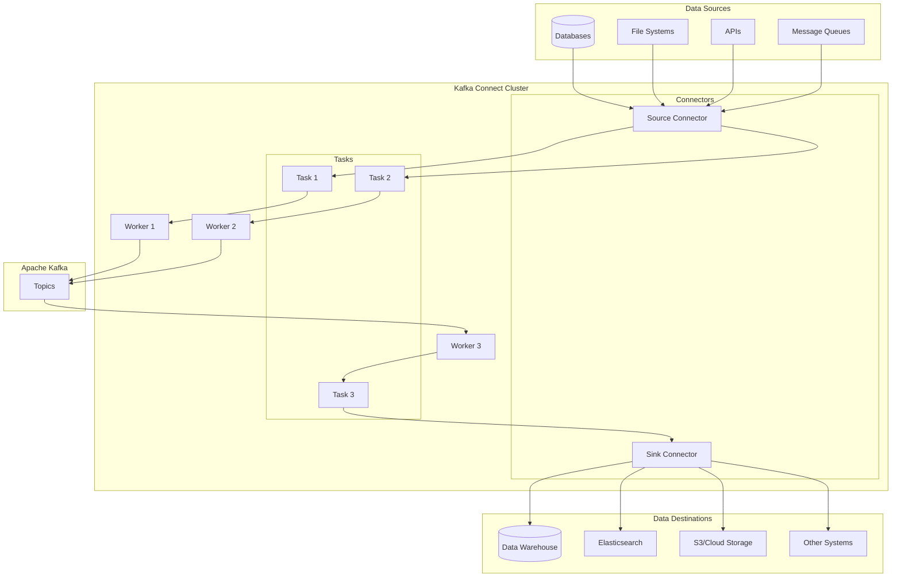
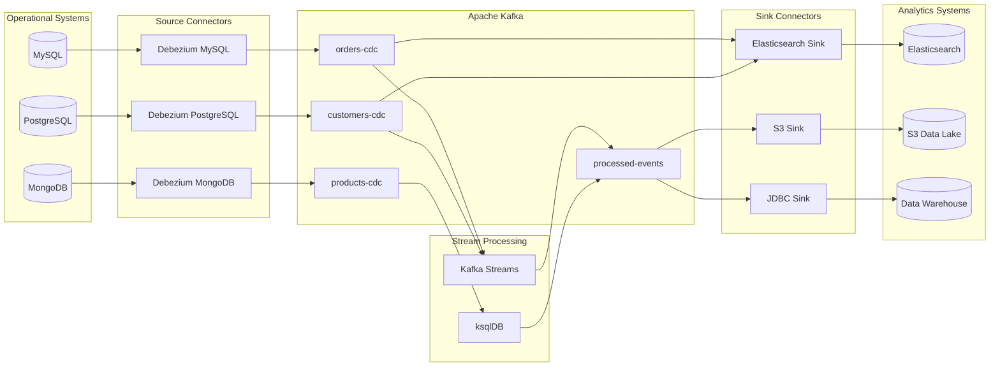
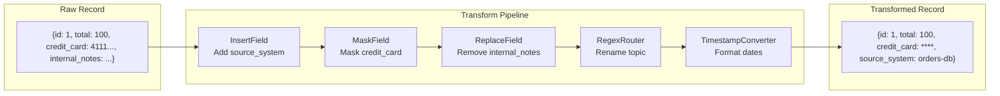
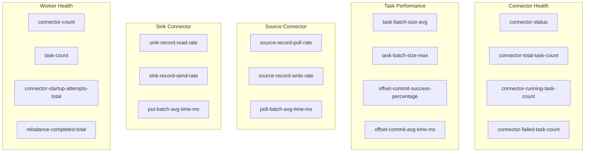

# How to Use Kafka Connect for Data Integration

Author: [nawazdhandala](https://github.com/nawazdhandala)

Tags: Kafka, Kafka Connect, Data Integration, ETL, Streaming, Apache Kafka, Connectors, Real-Time Data

Description: A comprehensive guide to using Kafka Connect for data integration, covering architecture, source and sink connectors, transformations, deployment modes, and best practices for building reliable data pipelines.

---

Data integration is a fundamental challenge in modern distributed systems. Moving data between databases, data warehouses, message queues, and cloud services reliably and efficiently requires careful planning. Kafka Connect provides a scalable, fault-tolerant framework for streaming data between Apache Kafka and external systems without writing custom integration code.

This guide covers everything you need to know about using Kafka Connect for data integration, from basic concepts to production deployment patterns.

## What is Kafka Connect?

Kafka Connect is an open-source component of Apache Kafka that enables scalable and reliable streaming of data between Kafka and other systems. It standardizes how data flows into and out of Kafka, providing a framework that handles common integration concerns like fault tolerance, parallelism, offset management, and data serialization.

### Key Benefits

**Standardized Integration** - Kafka Connect provides a unified API for integrating diverse systems, eliminating the need to write custom producers and consumers for each data source or destination.

**Scalability** - Connectors can scale horizontally by adding more tasks, distributing the workload across multiple workers in a cluster.

**Fault Tolerance** - Kafka Connect automatically handles failures, restarting failed tasks and resuming from the last committed offset.

**Schema Management** - Integration with Schema Registry enables schema evolution and ensures data compatibility across the pipeline.

**No Code Required** - Most integrations work through configuration alone, without writing custom code.

## Architecture Overview

Understanding the Kafka Connect architecture helps in designing and troubleshooting data pipelines effectively.



### Core Components

**Workers** - Worker processes run the connectors and tasks. They handle REST API requests, configuration management, and task distribution.

**Connectors** - Connectors define how to copy data between Kafka and another system. They coordinate tasks and manage connector-level configuration.

**Tasks** - Tasks perform the actual data movement. A connector partitions work across multiple tasks for parallelism.

**Converters** - Converters serialize and deserialize data between Kafka and connectors, supporting formats like JSON, Avro, and Protobuf.

**Transforms** - Single Message Transforms (SMTs) modify records as they flow through the pipeline.

## Deployment Modes

Kafka Connect supports two deployment modes, each suited for different use cases.

### Standalone Mode

Standalone mode runs a single worker process on a single machine. It is suitable for development, testing, or simple production deployments where high availability is not required.

The following configuration file sets up a standalone Kafka Connect worker with JSON converters and local offset storage.

```properties
# standalone.properties
# Kafka cluster connection
bootstrap.servers=localhost:9092

# Converter configuration for key and value serialization
key.converter=org.apache.kafka.connect.json.JsonConverter
value.converter=org.apache.kafka.connect.json.JsonConverter

# Disable schemas for JSON data (use true if your data includes schemas)
key.converter.schemas.enable=false
value.converter.schemas.enable=false

# Local file storage for offsets in standalone mode
offset.storage.file.filename=/var/lib/kafka-connect/offsets.dat

# Flush interval for offset storage
offset.flush.interval.ms=10000

# REST API configuration
rest.host.name=localhost
rest.port=8083
```

To start the standalone worker, use the following command with the worker configuration and one or more connector configuration files.

```bash
# Start standalone worker with connector configurations
connect-standalone.sh standalone.properties mysql-source.properties elasticsearch-sink.properties
```

### Distributed Mode

Distributed mode runs multiple worker processes across a cluster, providing scalability and fault tolerance. Workers coordinate through Kafka topics, automatically rebalancing tasks when workers join or leave the cluster.

This distributed worker configuration uses Kafka topics for storing offsets, configurations, and status information, enabling automatic failover.

```properties
# distributed.properties
# Kafka cluster connection
bootstrap.servers=kafka-1:9092,kafka-2:9092,kafka-3:9092

# Unique group ID for this Connect cluster
group.id=connect-cluster

# Converter configuration with Schema Registry for Avro support
key.converter=io.confluent.connect.avro.AvroConverter
key.converter.schema.registry.url=http://schema-registry:8081
value.converter=io.confluent.connect.avro.AvroConverter
value.converter.schema.registry.url=http://schema-registry:8081

# Internal storage topics for Connect cluster coordination
config.storage.topic=connect-configs
config.storage.replication.factor=3

offset.storage.topic=connect-offsets
offset.storage.replication.factor=3
offset.storage.partitions=25

status.storage.topic=connect-status
status.storage.replication.factor=3
status.storage.partitions=5

# Offset flush interval
offset.flush.interval.ms=10000

# REST API configuration
rest.host.name=0.0.0.0
rest.port=8083
rest.advertised.host.name=kafka-connect-1
rest.advertised.port=8083

# Plugin path for connector JARs
plugin.path=/usr/share/java,/usr/share/confluent-hub-components
```

Start distributed workers on multiple machines.

```bash
# Start distributed worker (run on each machine in the cluster)
connect-distributed.sh distributed.properties
```

## Setting Up a Complete Environment

The following Docker Compose configuration sets up a complete Kafka Connect environment with Kafka, Schema Registry, and common connectors.

```yaml
# docker-compose.yml
version: '3.8'

services:
  # Kafka broker using KRaft mode (no Zookeeper required)
  kafka:
    image: apache/kafka:3.7.0
    container_name: kafka
    ports:
      - "9092:9092"
    environment:
      KAFKA_NODE_ID: 1
      KAFKA_PROCESS_ROLES: broker,controller
      KAFKA_LISTENERS: PLAINTEXT://0.0.0.0:9092,CONTROLLER://0.0.0.0:9093
      KAFKA_ADVERTISED_LISTENERS: PLAINTEXT://kafka:9092
      KAFKA_CONTROLLER_LISTENER_NAMES: CONTROLLER
      KAFKA_LISTENER_SECURITY_PROTOCOL_MAP: CONTROLLER:PLAINTEXT,PLAINTEXT:PLAINTEXT
      KAFKA_CONTROLLER_QUORUM_VOTERS: 1@kafka:9093
      KAFKA_OFFSETS_TOPIC_REPLICATION_FACTOR: 1
      KAFKA_TRANSACTION_STATE_LOG_REPLICATION_FACTOR: 1
      KAFKA_TRANSACTION_STATE_LOG_MIN_ISR: 1
      CLUSTER_ID: MkU3OEVBNTcwNTJENDM2Qk
    volumes:
      - kafka-data:/var/lib/kafka/data

  # Schema Registry for Avro schema management
  schema-registry:
    image: confluentinc/cp-schema-registry:7.5.0
    container_name: schema-registry
    ports:
      - "8081:8081"
    environment:
      SCHEMA_REGISTRY_HOST_NAME: schema-registry
      SCHEMA_REGISTRY_KAFKASTORE_BOOTSTRAP_SERVERS: kafka:9092
      SCHEMA_REGISTRY_LISTENERS: http://0.0.0.0:8081
    depends_on:
      - kafka

  # Kafka Connect worker with pre-installed connectors
  kafka-connect:
    image: confluentinc/cp-kafka-connect:7.5.0
    container_name: kafka-connect
    ports:
      - "8083:8083"
    environment:
      CONNECT_BOOTSTRAP_SERVERS: kafka:9092
      CONNECT_REST_PORT: 8083
      CONNECT_GROUP_ID: connect-cluster
      # Storage topics for distributed mode
      CONNECT_CONFIG_STORAGE_TOPIC: connect-configs
      CONNECT_OFFSET_STORAGE_TOPIC: connect-offsets
      CONNECT_STATUS_STORAGE_TOPIC: connect-status
      CONNECT_CONFIG_STORAGE_REPLICATION_FACTOR: 1
      CONNECT_OFFSET_STORAGE_REPLICATION_FACTOR: 1
      CONNECT_STATUS_STORAGE_REPLICATION_FACTOR: 1
      # Converters with Schema Registry
      CONNECT_KEY_CONVERTER: io.confluent.connect.avro.AvroConverter
      CONNECT_KEY_CONVERTER_SCHEMA_REGISTRY_URL: http://schema-registry:8081
      CONNECT_VALUE_CONVERTER: io.confluent.connect.avro.AvroConverter
      CONNECT_VALUE_CONVERTER_SCHEMA_REGISTRY_URL: http://schema-registry:8081
      CONNECT_REST_ADVERTISED_HOST_NAME: kafka-connect
      CONNECT_PLUGIN_PATH: /usr/share/java,/usr/share/confluent-hub-components
    command:
      - bash
      - -c
      - |
        # Install additional connectors from Confluent Hub
        confluent-hub install --no-prompt debezium/debezium-connector-mysql:2.4.0
        confluent-hub install --no-prompt debezium/debezium-connector-postgresql:2.4.0
        confluent-hub install --no-prompt confluentinc/kafka-connect-elasticsearch:14.0.0
        confluent-hub install --no-prompt confluentinc/kafka-connect-s3:10.5.0
        confluent-hub install --no-prompt confluentinc/kafka-connect-jdbc:10.7.0
        # Start the Connect worker
        /etc/confluent/docker/run
    depends_on:
      - kafka
      - schema-registry

  # PostgreSQL for testing source connectors
  postgres:
    image: postgres:15
    container_name: postgres
    ports:
      - "5432:5432"
    environment:
      POSTGRES_USER: postgres
      POSTGRES_PASSWORD: postgres
      POSTGRES_DB: demo
    command:
      - postgres
      - -c
      - wal_level=logical
    volumes:
      - postgres-data:/var/lib/postgresql/data

  # Elasticsearch for testing sink connectors
  elasticsearch:
    image: docker.elastic.co/elasticsearch/elasticsearch:8.11.0
    container_name: elasticsearch
    ports:
      - "9200:9200"
    environment:
      - discovery.type=single-node
      - xpack.security.enabled=false
      - "ES_JAVA_OPTS=-Xms512m -Xmx512m"
    volumes:
      - elasticsearch-data:/usr/share/elasticsearch/data

volumes:
  kafka-data:
  postgres-data:
  elasticsearch-data:
```

Start the environment.

```bash
# Start all services
docker compose up -d

# Wait for Kafka Connect to be ready (may take 2-3 minutes for connector installation)
until curl -s http://localhost:8083/connectors > /dev/null 2>&1; do
  echo "Waiting for Kafka Connect..."
  sleep 5
done

echo "Kafka Connect is ready"
```

## Source Connectors

Source connectors read data from external systems and write it to Kafka topics. They handle offset tracking automatically, ensuring no data is lost or duplicated.

### JDBC Source Connector

The JDBC Source Connector queries databases periodically and writes results to Kafka topics. It supports incremental queries using timestamp or incrementing columns.

This configuration sets up a JDBC source connector that monitors for new and updated records using an incrementing ID column and a timestamp column together.

```json
{
  "name": "jdbc-source-orders",
  "config": {
    "connector.class": "io.confluent.connect.jdbc.JdbcSourceConnector",
    "tasks.max": "1",

    "connection.url": "jdbc:postgresql://postgres:5432/demo",
    "connection.user": "postgres",
    "connection.password": "postgres",

    "table.whitelist": "orders,customers,products",

    "mode": "timestamp+incrementing",
    "incrementing.column.name": "id",
    "timestamp.column.name": "updated_at",

    "topic.prefix": "db.",

    "poll.interval.ms": "5000",
    "batch.max.rows": "1000",

    "transforms": "createKey,extractInt",
    "transforms.createKey.type": "org.apache.kafka.connect.transforms.ValueToKey",
    "transforms.createKey.fields": "id",
    "transforms.extractInt.type": "org.apache.kafka.connect.transforms.ExtractField$Key",
    "transforms.extractInt.field": "id"
  }
}
```

### Debezium CDC Source Connector

Debezium connectors capture changes from database transaction logs, providing real-time change data capture (CDC) with full event history.

The following Debezium PostgreSQL connector configuration captures all changes from the public schema, including inserts, updates, and deletes.

```json
{
  "name": "debezium-postgres-source",
  "config": {
    "connector.class": "io.debezium.connector.postgresql.PostgresConnector",
    "tasks.max": "1",

    "database.hostname": "postgres",
    "database.port": "5432",
    "database.user": "postgres",
    "database.password": "postgres",
    "database.dbname": "demo",

    "topic.prefix": "cdc",

    "schema.include.list": "public",
    "table.include.list": "public.orders,public.customers",

    "plugin.name": "pgoutput",
    "publication.autocreate.mode": "filtered",

    "slot.name": "debezium_orders",

    "snapshot.mode": "initial",

    "tombstones.on.delete": "true",

    "transforms": "unwrap",
    "transforms.unwrap.type": "io.debezium.transforms.ExtractNewRecordState",
    "transforms.unwrap.drop.tombstones": "false",
    "transforms.unwrap.delete.handling.mode": "rewrite",
    "transforms.unwrap.add.fields": "op,source.ts_ms"
  }
}
```

### File Source Connector

The file source connector reads data from files, useful for batch ingestion or legacy system integration.

```json
{
  "name": "file-source-logs",
  "config": {
    "connector.class": "org.apache.kafka.connect.file.FileStreamSourceConnector",
    "tasks.max": "1",
    "file": "/var/log/application.log",
    "topic": "application-logs"
  }
}
```

## Sink Connectors

Sink connectors read data from Kafka topics and write to external systems. They handle offset commits automatically, supporting at-least-once delivery semantics.

### Elasticsearch Sink Connector

The Elasticsearch sink connector indexes Kafka messages into Elasticsearch, supporting automatic index creation and schema mapping.

This configuration writes Kafka messages to Elasticsearch with daily index rotation and automatic document ID extraction from the message key.

```json
{
  "name": "elasticsearch-sink",
  "config": {
    "connector.class": "io.confluent.connect.elasticsearch.ElasticsearchSinkConnector",
    "tasks.max": "3",

    "topics": "db.orders,db.customers",

    "connection.url": "http://elasticsearch:9200",

    "type.name": "_doc",
    "key.ignore": "false",

    "schema.ignore": "false",
    "compact.map.entries": "true",

    "write.method": "upsert",

    "batch.size": "1000",
    "linger.ms": "1000",
    "flush.timeout.ms": "60000",

    "max.retries": "5",
    "retry.backoff.ms": "1000",

    "behavior.on.null.values": "delete",
    "behavior.on.malformed.documents": "warn",

    "transforms": "extractTimestamp,routeByTopic",
    "transforms.extractTimestamp.type": "org.apache.kafka.connect.transforms.InsertField$Value",
    "transforms.extractTimestamp.timestamp.field": "indexed_at",
    "transforms.routeByTopic.type": "org.apache.kafka.connect.transforms.RegexRouter",
    "transforms.routeByTopic.regex": "db\\.(.*)",
    "transforms.routeByTopic.replacement": "$1-${timestamp}"
  }
}
```

### JDBC Sink Connector

The JDBC sink connector writes Kafka messages to relational databases, supporting upsert operations and automatic table creation.

```json
{
  "name": "jdbc-sink-analytics",
  "config": {
    "connector.class": "io.confluent.connect.jdbc.JdbcSinkConnector",
    "tasks.max": "3",

    "topics": "processed-orders",

    "connection.url": "jdbc:postgresql://analytics-db:5432/warehouse",
    "connection.user": "analytics",
    "connection.password": "${secrets:jdbc:password}",

    "insert.mode": "upsert",
    "pk.mode": "record_key",
    "pk.fields": "id",

    "auto.create": "true",
    "auto.evolve": "true",

    "batch.size": "3000",

    "table.name.format": "orders_${topic}",

    "fields.whitelist": "id,customer_id,total,status,created_at,updated_at"
  }
}
```

### S3 Sink Connector

The S3 sink connector writes Kafka data to Amazon S3, enabling data lake ingestion with various partitioning strategies.

```json
{
  "name": "s3-sink-datalake",
  "config": {
    "connector.class": "io.confluent.connect.s3.S3SinkConnector",
    "tasks.max": "3",

    "topics": "db.orders,db.events",

    "s3.bucket.name": "company-data-lake",
    "s3.region": "us-east-1",
    "topics.dir": "raw",

    "storage.class": "io.confluent.connect.s3.storage.S3Storage",
    "format.class": "io.confluent.connect.s3.format.parquet.ParquetFormat",
    "parquet.codec": "snappy",

    "partitioner.class": "io.confluent.connect.storage.partitioner.TimeBasedPartitioner",
    "partition.duration.ms": "3600000",
    "path.format": "'year'=YYYY/'month'=MM/'day'=dd/'hour'=HH",
    "locale": "en-US",
    "timezone": "UTC",

    "flush.size": "10000",
    "rotate.interval.ms": "600000",

    "schema.compatibility": "NONE",

    "errors.tolerance": "all",
    "errors.deadletterqueue.topic.name": "s3-sink-errors",
    "errors.deadletterqueue.topic.replication.factor": "3"
  }
}
```

## Data Flow Visualization

The following diagram shows a typical data integration pipeline using Kafka Connect, illustrating how data flows from operational databases through Kafka to analytics systems.



## Single Message Transforms (SMTs)

SMTs modify records as they pass through connectors, enabling lightweight data transformations without external stream processing.

### Common Transformations

The following configuration demonstrates multiple SMTs applied in sequence to transform incoming records.

```json
{
  "name": "orders-source-with-transforms",
  "config": {
    "connector.class": "io.confluent.connect.jdbc.JdbcSourceConnector",
    "tasks.max": "1",
    "connection.url": "jdbc:postgresql://postgres:5432/demo",
    "connection.user": "postgres",
    "connection.password": "postgres",
    "table.whitelist": "orders",
    "mode": "timestamp+incrementing",
    "incrementing.column.name": "id",
    "timestamp.column.name": "updated_at",
    "topic.prefix": "db.",

    "transforms": "insertSource,maskPII,filterFields,routeTopic,convertTimestamp",

    "transforms.insertSource.type": "org.apache.kafka.connect.transforms.InsertField$Value",
    "transforms.insertSource.static.field": "source_system",
    "transforms.insertSource.static.value": "orders-db",

    "transforms.maskPII.type": "org.apache.kafka.connect.transforms.MaskField$Value",
    "transforms.maskPII.fields": "credit_card,ssn",
    "transforms.maskPII.replacement": "****",

    "transforms.filterFields.type": "org.apache.kafka.connect.transforms.ReplaceField$Value",
    "transforms.filterFields.exclude": "internal_notes,temp_data",

    "transforms.routeTopic.type": "org.apache.kafka.connect.transforms.RegexRouter",
    "transforms.routeTopic.regex": "db\\.orders",
    "transforms.routeTopic.replacement": "orders-events",

    "transforms.convertTimestamp.type": "org.apache.kafka.connect.transforms.TimestampConverter$Value",
    "transforms.convertTimestamp.field": "created_at",
    "transforms.convertTimestamp.target.type": "string",
    "transforms.convertTimestamp.format": "yyyy-MM-dd'T'HH:mm:ss.SSS'Z'"
  }
}
```

### Transform Pipeline Flow



### Custom SMT Example

For complex transformations, you can create custom SMTs by implementing the Transformation interface.

```java
// CustomMaskingTransform.java
package com.example.transforms;

import org.apache.kafka.common.config.ConfigDef;
import org.apache.kafka.connect.connector.ConnectRecord;
import org.apache.kafka.connect.data.Field;
import org.apache.kafka.connect.data.Schema;
import org.apache.kafka.connect.data.SchemaBuilder;
import org.apache.kafka.connect.data.Struct;
import org.apache.kafka.connect.transforms.Transformation;
import org.apache.kafka.connect.transforms.util.SimpleConfig;

import java.util.HashMap;
import java.util.Map;
import java.util.regex.Pattern;

/**
 * Custom SMT that masks email addresses in specified fields.
 * Transforms "user@example.com" to "u***@example.com"
 */
public class EmailMaskingTransform<R extends ConnectRecord<R>> implements Transformation<R> {

    // Configuration key for specifying which fields contain emails
    private static final String FIELDS_CONFIG = "fields";

    // Regex pattern to match email addresses
    private static final Pattern EMAIL_PATTERN =
        Pattern.compile("([a-zA-Z0-9._%+-]+)@([a-zA-Z0-9.-]+\\.[a-zA-Z]{2,})");

    private String[] fieldsToMask;

    // Define the configuration schema for this transform
    @Override
    public ConfigDef config() {
        return new ConfigDef()
            .define(FIELDS_CONFIG,
                    ConfigDef.Type.LIST,
                    ConfigDef.NO_DEFAULT_VALUE,
                    ConfigDef.Importance.HIGH,
                    "Fields containing email addresses to mask");
    }

    // Initialize the transform with provided configuration
    @Override
    public void configure(Map<String, ?> configs) {
        SimpleConfig simpleConfig = new SimpleConfig(config(), configs);
        fieldsToMask = simpleConfig.getList(FIELDS_CONFIG).toArray(new String[0]);
    }

    // Apply the transformation to each record
    @Override
    public R apply(R record) {
        if (record.value() == null) {
            return record;
        }

        Schema schema = record.valueSchema();
        Struct value = (Struct) record.value();
        Struct newValue = new Struct(schema);

        // Copy all fields, masking emails in specified fields
        for (Field field : schema.fields()) {
            Object fieldValue = value.get(field);

            if (shouldMask(field.name()) && fieldValue instanceof String) {
                fieldValue = maskEmail((String) fieldValue);
            }

            newValue.put(field, fieldValue);
        }

        return record.newRecord(
            record.topic(),
            record.kafkaPartition(),
            record.keySchema(),
            record.key(),
            schema,
            newValue,
            record.timestamp()
        );
    }

    // Check if a field should be masked
    private boolean shouldMask(String fieldName) {
        for (String field : fieldsToMask) {
            if (field.equals(fieldName)) {
                return true;
            }
        }
        return false;
    }

    // Mask an email address, keeping first character and domain
    private String maskEmail(String email) {
        if (email == null || !EMAIL_PATTERN.matcher(email).matches()) {
            return email;
        }

        int atIndex = email.indexOf('@');
        String localPart = email.substring(0, atIndex);
        String domain = email.substring(atIndex);

        if (localPart.length() <= 1) {
            return "***" + domain;
        }

        return localPart.charAt(0) + "***" + domain;
    }

    @Override
    public void close() {
        // Cleanup resources if needed
    }
}
```

## Managing Connectors with the REST API

Kafka Connect exposes a REST API for managing connectors programmatically. All connector operations can be performed through HTTP requests.

### Connector Lifecycle Management

The following script demonstrates common connector management operations using curl.

```bash
#!/bin/bash
# connector-management.sh

CONNECT_URL="http://localhost:8083"

# List all installed connector plugins
echo "Available connector plugins:"
curl -s "$CONNECT_URL/connector-plugins" | jq '.[].class'

# Create a new connector
echo "Creating connector..."
curl -X POST "$CONNECT_URL/connectors" \
  -H "Content-Type: application/json" \
  -d '{
    "name": "orders-source",
    "config": {
      "connector.class": "io.confluent.connect.jdbc.JdbcSourceConnector",
      "tasks.max": "1",
      "connection.url": "jdbc:postgresql://postgres:5432/demo",
      "connection.user": "postgres",
      "connection.password": "postgres",
      "table.whitelist": "orders",
      "mode": "incrementing",
      "incrementing.column.name": "id",
      "topic.prefix": "db."
    }
  }'

# List all connectors
echo "Active connectors:"
curl -s "$CONNECT_URL/connectors" | jq

# Get connector status
echo "Connector status:"
curl -s "$CONNECT_URL/connectors/orders-source/status" | jq

# Get connector configuration
echo "Connector config:"
curl -s "$CONNECT_URL/connectors/orders-source/config" | jq

# Update connector configuration
echo "Updating connector..."
curl -X PUT "$CONNECT_URL/connectors/orders-source/config" \
  -H "Content-Type: application/json" \
  -d '{
    "connector.class": "io.confluent.connect.jdbc.JdbcSourceConnector",
    "tasks.max": "2",
    "connection.url": "jdbc:postgresql://postgres:5432/demo",
    "connection.user": "postgres",
    "connection.password": "postgres",
    "table.whitelist": "orders,customers",
    "mode": "incrementing",
    "incrementing.column.name": "id",
    "topic.prefix": "db."
  }'

# Pause connector
echo "Pausing connector..."
curl -X PUT "$CONNECT_URL/connectors/orders-source/pause"

# Resume connector
echo "Resuming connector..."
curl -X PUT "$CONNECT_URL/connectors/orders-source/resume"

# Restart connector
echo "Restarting connector..."
curl -X POST "$CONNECT_URL/connectors/orders-source/restart"

# Restart specific task
echo "Restarting task 0..."
curl -X POST "$CONNECT_URL/connectors/orders-source/tasks/0/restart"

# Delete connector
echo "Deleting connector..."
curl -X DELETE "$CONNECT_URL/connectors/orders-source"
```

## Error Handling and Dead Letter Queues

Robust error handling is essential for production deployments. Kafka Connect supports configurable error handling with dead letter queues for failed records.

### Error Handling Configuration

This configuration demonstrates comprehensive error handling with tolerance for all errors, detailed logging, and a dead letter queue for failed records.

```json
{
  "name": "elasticsearch-sink-with-dlq",
  "config": {
    "connector.class": "io.confluent.connect.elasticsearch.ElasticsearchSinkConnector",
    "tasks.max": "3",
    "topics": "orders",
    "connection.url": "http://elasticsearch:9200",

    "errors.tolerance": "all",

    "errors.log.enable": "true",
    "errors.log.include.messages": "true",

    "errors.deadletterqueue.topic.name": "orders-dlq",
    "errors.deadletterqueue.topic.replication.factor": "3",

    "errors.deadletterqueue.context.headers.enable": "true",

    "errors.retry.delay.max.ms": "60000",
    "errors.retry.timeout": "300000"
  }
}
```

### Processing Dead Letter Queue Records

The following Python script processes failed records from a dead letter queue, logging errors and optionally retrying them.

```python
# process_dlq.py
"""
Dead Letter Queue processor for Kafka Connect failures.
Reads failed records, logs errors, and optionally retries processing.
"""

from kafka import KafkaConsumer, KafkaProducer
import json
import logging

logging.basicConfig(level=logging.INFO)
logger = logging.getLogger(__name__)

# Configuration for connecting to Kafka
KAFKA_BOOTSTRAP_SERVERS = ['localhost:9092']
DLQ_TOPIC = 'orders-dlq'
RETRY_TOPIC = 'orders'
MAX_RETRIES = 3

def create_consumer():
    """Create a Kafka consumer for the dead letter queue."""
    return KafkaConsumer(
        DLQ_TOPIC,
        bootstrap_servers=KAFKA_BOOTSTRAP_SERVERS,
        auto_offset_reset='earliest',
        enable_auto_commit=False,
        group_id='dlq-processor',
        value_deserializer=lambda x: x.decode('utf-8') if x else None
    )

def create_producer():
    """Create a Kafka producer for retrying messages."""
    return KafkaProducer(
        bootstrap_servers=KAFKA_BOOTSTRAP_SERVERS,
        value_serializer=lambda x: x.encode('utf-8') if isinstance(x, str) else x
    )

def extract_error_context(headers):
    """Extract error information from Kafka Connect headers."""
    error_context = {}

    header_map = {
        '__connect.errors.topic': 'original_topic',
        '__connect.errors.partition': 'original_partition',
        '__connect.errors.offset': 'original_offset',
        '__connect.errors.connector.name': 'connector',
        '__connect.errors.task.id': 'task_id',
        '__connect.errors.stage': 'error_stage',
        '__connect.errors.class.name': 'exception_class',
        '__connect.errors.exception.message': 'exception_message'
    }

    if headers:
        for key, value in headers:
            if key in header_map:
                error_context[header_map[key]] = value.decode('utf-8') if value else None

    return error_context

def should_retry(error_context, retry_count):
    """Determine if a failed record should be retried."""
    # Do not retry serialization errors
    if 'SerializationException' in error_context.get('exception_class', ''):
        return False

    # Do not retry if max retries exceeded
    if retry_count >= MAX_RETRIES:
        return False

    return True

def process_dlq():
    """Main processing loop for dead letter queue records."""
    consumer = create_consumer()
    producer = create_producer()

    logger.info(f"Starting DLQ processor for topic: {DLQ_TOPIC}")

    for message in consumer:
        error_context = extract_error_context(message.headers)

        logger.error(
            f"DLQ Record - Topic: {error_context.get('original_topic')}, "
            f"Partition: {error_context.get('original_partition')}, "
            f"Offset: {error_context.get('original_offset')}, "
            f"Error: {error_context.get('exception_message')}"
        )

        # Get retry count from headers
        retry_count = 0
        if message.headers:
            for key, value in message.headers:
                if key == '__retry_count':
                    retry_count = int(value.decode('utf-8'))

        if should_retry(error_context, retry_count):
            # Add retry count header and send to retry topic
            headers = [('__retry_count', str(retry_count + 1).encode('utf-8'))]
            producer.send(
                RETRY_TOPIC,
                value=message.value,
                key=message.key,
                headers=headers
            )
            logger.info(f"Retrying record (attempt {retry_count + 1})")
        else:
            # Log permanently failed record for manual review
            logger.warning(
                f"Record permanently failed after {retry_count} retries. "
                f"Value: {message.value[:200] if message.value else 'None'}..."
            )

        consumer.commit()

    consumer.close()
    producer.close()

if __name__ == '__main__':
    process_dlq()
```

## Monitoring and Observability

Effective monitoring is critical for maintaining reliable data pipelines. Kafka Connect exposes JMX metrics and integrates with standard monitoring tools.

### Key Metrics to Monitor



### Prometheus Metrics Configuration

The following JMX exporter configuration exposes Kafka Connect metrics for Prometheus scraping.

```yaml
# jmx-exporter-config.yml
# Prometheus JMX Exporter configuration for Kafka Connect

lowercaseOutputName: true
lowercaseOutputLabelNames: true

rules:
  # Worker-level metrics
  - pattern: 'kafka.connect<type=connect-worker-metrics>([^:]+):'
    name: kafka_connect_worker_$1
    type: GAUGE

  # Connector-level metrics
  - pattern: 'kafka.connect<type=connector-metrics, connector=([^,]+)><>([^:]+):'
    name: kafka_connect_connector_$2
    type: GAUGE
    labels:
      connector: $1

  # Task-level metrics
  - pattern: 'kafka.connect<type=connector-task-metrics, connector=([^,]+), task=([^,]+)><>([^:]+):'
    name: kafka_connect_task_$3
    type: GAUGE
    labels:
      connector: $1
      task: $2

  # Source connector metrics
  - pattern: 'kafka.connect<type=source-task-metrics, connector=([^,]+), task=([^,]+)><>([^:]+):'
    name: kafka_connect_source_task_$3
    type: GAUGE
    labels:
      connector: $1
      task: $2

  # Sink connector metrics
  - pattern: 'kafka.connect<type=sink-task-metrics, connector=([^,]+), task=([^,]+)><>([^:]+):'
    name: kafka_connect_sink_task_$3
    type: GAUGE
    labels:
      connector: $1
      task: $2

  # Worker rebalance metrics
  - pattern: 'kafka.connect<type=connect-worker-rebalance-metrics>([^:]+):'
    name: kafka_connect_worker_rebalance_$1
    type: GAUGE
```

### Health Check Script

This script provides comprehensive health checks for Kafka Connect deployments.

```bash
#!/bin/bash
# kafka-connect-health-check.sh

CONNECT_URL="${CONNECT_URL:-http://localhost:8083}"
EXIT_CODE=0

echo "Kafka Connect Health Check"
echo "=========================="

# Check if Connect REST API is accessible
echo -n "REST API Status: "
if curl -s "$CONNECT_URL/" > /dev/null 2>&1; then
    echo "OK"
else
    echo "FAILED"
    exit 1
fi

# Get list of connectors
CONNECTORS=$(curl -s "$CONNECT_URL/connectors")

if [ "$CONNECTORS" == "[]" ]; then
    echo "No connectors configured"
    exit 0
fi

# Check each connector status
echo ""
echo "Connector Status:"
echo "-----------------"

for CONNECTOR in $(echo "$CONNECTORS" | jq -r '.[]'); do
    STATUS=$(curl -s "$CONNECT_URL/connectors/$CONNECTOR/status")

    CONNECTOR_STATE=$(echo "$STATUS" | jq -r '.connector.state')
    TASK_STATES=$(echo "$STATUS" | jq -r '.tasks[].state')

    echo -n "$CONNECTOR: "

    if [ "$CONNECTOR_STATE" == "RUNNING" ]; then
        FAILED_TASKS=$(echo "$STATUS" | jq '[.tasks[] | select(.state != "RUNNING")] | length')

        if [ "$FAILED_TASKS" -gt 0 ]; then
            echo "DEGRADED ($FAILED_TASKS failed tasks)"

            # Show failed task details
            echo "  Failed tasks:"
            echo "$STATUS" | jq -r '.tasks[] | select(.state != "RUNNING") | "    Task \(.id): \(.state) - \(.trace // "No trace")"'

            EXIT_CODE=1
        else
            RUNNING_TASKS=$(echo "$STATUS" | jq '.tasks | length')
            echo "RUNNING ($RUNNING_TASKS tasks)"
        fi
    else
        echo "$CONNECTOR_STATE"

        # Show connector error trace if available
        TRACE=$(echo "$STATUS" | jq -r '.connector.trace // empty')
        if [ -n "$TRACE" ]; then
            echo "  Error: ${TRACE:0:200}..."
        fi

        EXIT_CODE=1
    fi
done

# Check worker metrics
echo ""
echo "Worker Metrics:"
echo "--------------"

WORKER_STATUS=$(curl -s "$CONNECT_URL/")
echo "Version: $(echo "$WORKER_STATUS" | jq -r '.version')"
echo "Commit: $(echo "$WORKER_STATUS" | jq -r '.commit')"

exit $EXIT_CODE
```

## Best Practices

### Configuration Best Practices

**Use Distributed Mode in Production** - Standalone mode lacks fault tolerance. Always use distributed mode for production deployments to ensure high availability.

**Configure Appropriate Replication** - Set replication factors for internal topics (config, offset, status) to at least 3 for durability.

**Tune Task Parallelism** - Set `tasks.max` based on the parallelism of your source/sink. For databases, this might match the number of tables. For partitioned topics, match the partition count.

**Use Schema Registry** - Enable schema management with Avro or Protobuf converters for type safety and schema evolution support.

### Performance Best Practices

**Batch Configuration** - Tune batch sizes and linger times for optimal throughput. Larger batches improve throughput but increase latency.

```json
{
  "config": {
    "batch.size": "5000",
    "linger.ms": "100"
  }
}
```

**Offset Flush Interval** - Balance between data durability and performance. Shorter intervals mean more frequent commits but higher overhead.

**Connection Pooling** - For JDBC connectors, configure connection pooling to avoid connection exhaustion.

```json
{
  "config": {
    "connection.pool.max.size": "10",
    "connection.pool.max.idle.ms": "60000"
  }
}
```

### Operational Best Practices

**Implement Health Checks** - Monitor connector and task status continuously. Set up alerts for failed connectors and tasks.

**Use Dead Letter Queues** - Configure DLQs for all sink connectors to capture and investigate failed records without blocking the pipeline.

**Version Control Configurations** - Store connector configurations in version control and deploy using CI/CD pipelines.

**Test Before Production** - Use staging environments with production-like data volumes to validate connector configurations.

### Security Best Practices

**Externalize Secrets** - Never store credentials in connector configurations. Use secret management solutions.

```json
{
  "config": {
    "connection.password": "${secrets:database:password}"
  }
}
```

**Enable SSL/TLS** - Configure encrypted connections between Connect workers and Kafka, as well as external systems.

**Use Authentication** - Enable SASL authentication for Kafka connections and appropriate authentication for external systems.

## Common Pitfalls and Solutions

| Pitfall | Solution |
|---------|----------|
| Connector starts but no data flows | Check source table/topic exists and has data; verify permissions |
| High memory usage | Reduce batch sizes; increase tasks.max to distribute load |
| Duplicate records | Verify exactly-once settings; check consumer idempotency |
| Schema errors | Use Schema Registry; verify schema compatibility settings |
| Slow performance | Tune batch sizes; increase parallelism; check network latency |
| Connector restarts frequently | Check error logs; verify source/sink availability |
| Offset lag growing | Increase tasks; tune batch sizes; check for slow consumers |

## Summary

Kafka Connect provides a robust, scalable framework for data integration that eliminates the need for custom integration code. By understanding the architecture, properly configuring connectors, implementing error handling, and following best practices, you can build reliable data pipelines that handle millions of records with ease.

Key takeaways:

- Use distributed mode for production deployments with proper replication factors
- Leverage Schema Registry for type safety and schema evolution
- Implement comprehensive error handling with dead letter queues
- Monitor connector health and performance metrics continuously
- Follow security best practices for credentials and network communication

Whether you are building real-time CDC pipelines, data lake ingestion, or search index synchronization, Kafka Connect provides the tools and flexibility to meet your data integration needs reliably and at scale.
