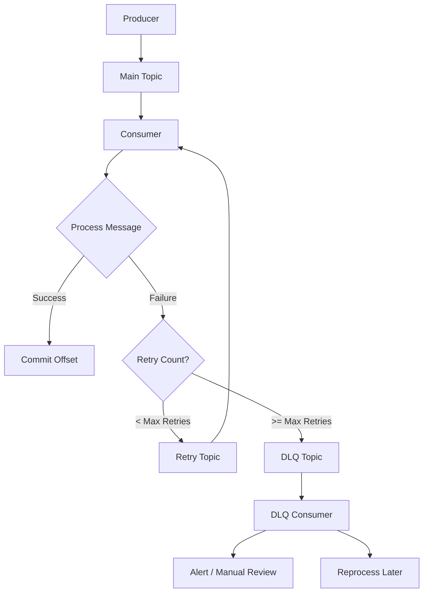
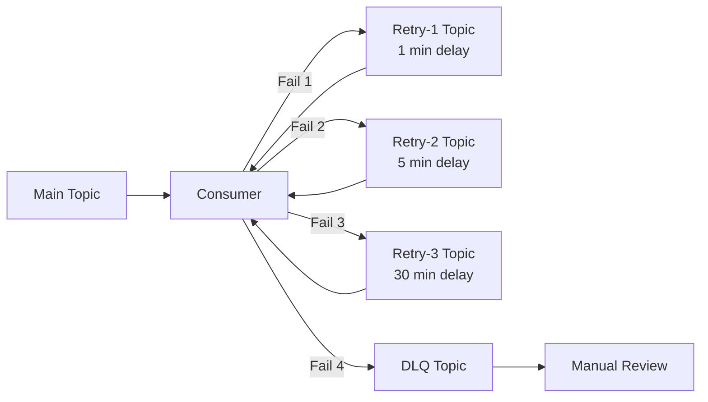

# How to Route Failed Kafka Messages to DLQ Topics

Author: [nawazdhandala](https://github.com/nawazdhandala)

Tags: Kafka, Message Queue, DLQ, Dead Letter Queue, Event Streaming, Error Handling, Java, Node.js

Description: Learn how to implement Dead Letter Queue (DLQ) patterns in Apache Kafka to handle failed messages gracefully. Covers retry strategies, error classification, monitoring, and production best practices.

---

When processing Kafka messages, failures are inevitable. Network issues, invalid payloads, downstream service outages, and business logic errors will cause some messages to fail. Without proper handling, these failures can block your consumers, cause infinite retry loops, or result in lost data. Dead Letter Queues (DLQs) provide a systematic approach to isolate and manage failed messages without disrupting the main processing pipeline.

## Why Dead Letter Queues Matter

| Scenario | Without DLQ | With DLQ |
|----------|-------------|----------|
| Poison message | Consumer crashes repeatedly | Message isolated, processing continues |
| Temporary failure | Infinite retries, lag builds up | Retries with backoff, then DLQ |
| Invalid data | Manual intervention required | Automatic routing for later analysis |
| Downstream outage | All processing stops | Failed messages queued for reprocessing |

## DLQ Architecture Overview

The following diagram illustrates the message flow from a Kafka topic through processing with retry logic to a Dead Letter Queue.



## Basic DLQ Implementation in Java

The Spring Kafka library provides built-in support for error handling and DLQ routing. The following configuration sets up automatic retry with exponential backoff and routes permanently failed messages to a DLQ topic.

```java
import org.apache.kafka.clients.consumer.ConsumerConfig;
import org.apache.kafka.clients.producer.ProducerConfig;
import org.apache.kafka.common.serialization.StringDeserializer;
import org.apache.kafka.common.serialization.StringSerializer;
import org.springframework.context.annotation.Bean;
import org.springframework.context.annotation.Configuration;
import org.springframework.kafka.config.ConcurrentKafkaListenerContainerFactory;
import org.springframework.kafka.core.*;
import org.springframework.kafka.listener.DeadLetterPublishingRecoverer;
import org.springframework.kafka.listener.DefaultErrorHandler;
import org.springframework.kafka.support.ExponentialBackOffWithMaxRetries;

import java.util.HashMap;
import java.util.Map;

@Configuration
public class KafkaDLQConfig {

    // Bootstrap servers for Kafka cluster
    private static final String BOOTSTRAP_SERVERS = "localhost:9092";

    // Maximum number of retry attempts before sending to DLQ
    private static final int MAX_RETRIES = 3;

    // Configure the Kafka consumer factory with deserialization settings
    @Bean
    public ConsumerFactory<String, String> consumerFactory() {
        Map<String, Object> props = new HashMap<>();
        props.put(ConsumerConfig.BOOTSTRAP_SERVERS_CONFIG, BOOTSTRAP_SERVERS);
        props.put(ConsumerConfig.GROUP_ID_CONFIG, "order-processing-group");
        props.put(ConsumerConfig.KEY_DESERIALIZER_CLASS_CONFIG, StringDeserializer.class);
        props.put(ConsumerConfig.VALUE_DESERIALIZER_CLASS_CONFIG, StringDeserializer.class);

        // Disable auto-commit to control offset management manually
        props.put(ConsumerConfig.ENABLE_AUTO_COMMIT_CONFIG, false);

        return new DefaultKafkaConsumerFactory<>(props);
    }

    // Configure the producer factory for sending messages to DLQ
    @Bean
    public ProducerFactory<String, String> producerFactory() {
        Map<String, Object> props = new HashMap<>();
        props.put(ProducerConfig.BOOTSTRAP_SERVERS_CONFIG, BOOTSTRAP_SERVERS);
        props.put(ProducerConfig.KEY_SERIALIZER_CLASS_CONFIG, StringSerializer.class);
        props.put(ProducerConfig.VALUE_SERIALIZER_CLASS_CONFIG, StringSerializer.class);

        // Ensure messages are durably written before acknowledging
        props.put(ProducerConfig.ACKS_CONFIG, "all");

        return new DefaultKafkaProducerFactory<>(props);
    }

    @Bean
    public KafkaTemplate<String, String> kafkaTemplate() {
        return new KafkaTemplate<>(producerFactory());
    }

    // Configure the DLQ recoverer that publishes failed messages to a DLQ topic
    // The default naming convention appends ".DLQ" to the original topic name
    @Bean
    public DeadLetterPublishingRecoverer deadLetterPublishingRecoverer(
            KafkaTemplate<String, String> kafkaTemplate) {
        return new DeadLetterPublishingRecoverer(kafkaTemplate);
    }

    // Configure error handler with exponential backoff retry strategy
    @Bean
    public DefaultErrorHandler errorHandler(
            DeadLetterPublishingRecoverer deadLetterPublishingRecoverer) {

        // Exponential backoff: 1s, 2s, 4s between retries
        ExponentialBackOffWithMaxRetries backOff =
            new ExponentialBackOffWithMaxRetries(MAX_RETRIES);
        backOff.setInitialInterval(1000L);
        backOff.setMultiplier(2.0);
        backOff.setMaxInterval(10000L);

        DefaultErrorHandler errorHandler =
            new DefaultErrorHandler(deadLetterPublishingRecoverer, backOff);

        // Add exceptions that should not be retried (non-recoverable errors)
        errorHandler.addNotRetryableExceptions(
            IllegalArgumentException.class,
            NullPointerException.class
        );

        return errorHandler;
    }

    // Configure the listener container factory with error handling
    @Bean
    public ConcurrentKafkaListenerContainerFactory<String, String> kafkaListenerContainerFactory(
            ConsumerFactory<String, String> consumerFactory,
            DefaultErrorHandler errorHandler) {

        ConcurrentKafkaListenerContainerFactory<String, String> factory =
            new ConcurrentKafkaListenerContainerFactory<>();
        factory.setConsumerFactory(consumerFactory);
        factory.setCommonErrorHandler(errorHandler);

        return factory;
    }
}
```

## Message Consumer with Error Handling

The consumer implementation should throw appropriate exceptions to trigger the DLQ routing logic. Different exception types can be used to distinguish between retryable and non-retryable errors.

```java
import org.slf4j.Logger;
import org.slf4j.LoggerFactory;
import org.springframework.kafka.annotation.KafkaListener;
import org.springframework.stereotype.Service;

@Service
public class OrderConsumer {

    private static final Logger logger = LoggerFactory.getLogger(OrderConsumer.class);

    // Listen to the main orders topic
    @KafkaListener(topics = "orders", groupId = "order-processing-group")
    public void processOrder(String message) {
        logger.info("Received order: {}", message);

        try {
            // Parse and validate the order
            Order order = parseOrder(message);
            validateOrder(order);

            // Process the order with external service
            processWithExternalService(order);

            logger.info("Order processed successfully: {}", order.getId());

        } catch (InvalidOrderException e) {
            // Non-retryable error - message is malformed
            logger.error("Invalid order format, sending to DLQ: {}", e.getMessage());
            throw new IllegalArgumentException("Invalid order: " + e.getMessage(), e);

        } catch (ExternalServiceException e) {
            // Retryable error - external service might recover
            logger.warn("External service error, will retry: {}", e.getMessage());
            throw new RuntimeException("External service failure", e);
        }
    }

    private Order parseOrder(String message) throws InvalidOrderException {
        // Parse JSON to Order object
        // Throws InvalidOrderException if parsing fails
        return Order.fromJson(message);
    }

    private void validateOrder(Order order) throws InvalidOrderException {
        if (order.getId() == null || order.getId().isEmpty()) {
            throw new InvalidOrderException("Order ID is required");
        }
        if (order.getAmount() <= 0) {
            throw new InvalidOrderException("Order amount must be positive");
        }
    }

    private void processWithExternalService(Order order) throws ExternalServiceException {
        // Call external payment or inventory service
        // Throws ExternalServiceException on failure
    }
}
```

## Custom DLQ Topic Naming and Headers

For more control over DLQ routing, you can implement a custom resolver that determines the DLQ topic name and adds diagnostic headers to failed messages.

```java
import org.apache.kafka.clients.consumer.ConsumerRecord;
import org.apache.kafka.clients.producer.ProducerRecord;
import org.apache.kafka.common.header.internals.RecordHeader;
import org.springframework.kafka.core.KafkaTemplate;
import org.springframework.kafka.listener.DeadLetterPublishingRecoverer;
import org.springframework.stereotype.Component;

import java.nio.charset.StandardCharsets;
import java.time.Instant;
import java.util.function.BiFunction;

@Component
public class CustomDLQRecoverer extends DeadLetterPublishingRecoverer {

    public CustomDLQRecoverer(KafkaTemplate<Object, Object> template) {
        super(template, destinationResolver());
    }

    // Custom resolver determines the DLQ topic based on the original topic
    // and adds useful diagnostic headers to the message
    private static BiFunction<ConsumerRecord<?, ?>, Exception, TopicPartition>
            destinationResolver() {
        return (record, exception) -> {
            // Route to topic-specific DLQ
            String dlqTopic = record.topic() + ".dlq";
            return new TopicPartition(dlqTopic, record.partition());
        };
    }

    @Override
    protected ProducerRecord<Object, Object> createProducerRecord(
            ConsumerRecord<?, ?> record,
            TopicPartition topicPartition,
            Exception exception) {

        ProducerRecord<Object, Object> producerRecord =
            super.createProducerRecord(record, topicPartition, exception);

        // Add diagnostic headers to help with debugging and reprocessing
        producerRecord.headers().add(new RecordHeader(
            "dlq.original.topic",
            record.topic().getBytes(StandardCharsets.UTF_8)
        ));

        producerRecord.headers().add(new RecordHeader(
            "dlq.original.partition",
            String.valueOf(record.partition()).getBytes(StandardCharsets.UTF_8)
        ));

        producerRecord.headers().add(new RecordHeader(
            "dlq.original.offset",
            String.valueOf(record.offset()).getBytes(StandardCharsets.UTF_8)
        ));

        producerRecord.headers().add(new RecordHeader(
            "dlq.timestamp",
            Instant.now().toString().getBytes(StandardCharsets.UTF_8)
        ));

        producerRecord.headers().add(new RecordHeader(
            "dlq.exception.class",
            exception.getClass().getName().getBytes(StandardCharsets.UTF_8)
        ));

        producerRecord.headers().add(new RecordHeader(
            "dlq.exception.message",
            (exception.getMessage() != null ? exception.getMessage() : "null")
                .getBytes(StandardCharsets.UTF_8)
        ));

        return producerRecord;
    }
}
```

## Node.js Implementation with KafkaJS

For Node.js applications, KafkaJS provides a flexible way to implement DLQ patterns. Manual error handling gives you full control over retry logic and DLQ routing.

```javascript
const { Kafka } = require('kafkajs');

// Initialize Kafka client with connection settings
const kafka = new Kafka({
  clientId: 'order-service',
  brokers: ['localhost:9092'],
  retry: {
    initialRetryTime: 100,
    retries: 5,
  },
});

const consumer = kafka.consumer({ groupId: 'order-processing-group' });
const producer = kafka.producer();

// DLQ configuration
const DLQ_CONFIG = {
  maxRetries: 3,
  retryDelays: [1000, 2000, 4000], // Exponential backoff in ms
  dlqTopicSuffix: '.dlq',
  retryTopicSuffix: '.retry',
};

// Track retry counts per message using a combination of topic, partition, and offset
const retryTracker = new Map();

// Generate a unique key for tracking retries
function getRetryKey(topic, partition, offset) {
  return `${topic}-${partition}-${offset}`;
}

// Send a message to the DLQ with diagnostic headers
async function sendToDLQ(originalMessage, error, topic) {
  const dlqTopic = topic + DLQ_CONFIG.dlqTopicSuffix;

  const dlqMessage = {
    key: originalMessage.key,
    value: originalMessage.value,
    headers: {
      ...originalMessage.headers,
      'dlq.original.topic': topic,
      'dlq.original.partition': String(originalMessage.partition),
      'dlq.original.offset': String(originalMessage.offset),
      'dlq.timestamp': new Date().toISOString(),
      'dlq.exception.class': error.name || 'Error',
      'dlq.exception.message': error.message || 'Unknown error',
      'dlq.stack.trace': error.stack ? error.stack.substring(0, 1000) : '',
    },
  };

  await producer.send({
    topic: dlqTopic,
    messages: [dlqMessage],
  });

  console.log(`Message sent to DLQ: ${dlqTopic}`);
}

// Check if an error is retryable based on its type
function isRetryableError(error) {
  // Non-retryable errors - do not retry these
  const nonRetryableErrors = [
    'ValidationError',
    'SyntaxError',
    'TypeError',
  ];

  if (nonRetryableErrors.includes(error.name)) {
    return false;
  }

  // Retryable errors - temporary failures that might succeed on retry
  const retryablePatterns = [
    'ECONNREFUSED',
    'ETIMEDOUT',
    'ENOTFOUND',
    'NetworkError',
    'ServiceUnavailable',
  ];

  return retryablePatterns.some(pattern =>
    error.message && error.message.includes(pattern)
  );
}

// Process a single message with retry and DLQ logic
async function processMessage(message, topic, partition) {
  const retryKey = getRetryKey(topic, partition, message.offset);
  const currentRetries = retryTracker.get(retryKey) || 0;

  try {
    // Parse the message value
    const orderData = JSON.parse(message.value.toString());

    // Validate required fields
    if (!orderData.orderId) {
      throw new ValidationError('Order ID is required');
    }

    if (!orderData.amount || orderData.amount <= 0) {
      throw new ValidationError('Valid order amount is required');
    }

    // Process the order
    await processOrder(orderData);

    // Clear retry tracking on success
    retryTracker.delete(retryKey);

    console.log(`Successfully processed order: ${orderData.orderId}`);

  } catch (error) {
    console.error(`Error processing message: ${error.message}`);

    // Check if we should retry
    if (isRetryableError(error) && currentRetries < DLQ_CONFIG.maxRetries) {
      // Increment retry count
      retryTracker.set(retryKey, currentRetries + 1);

      // Calculate delay with exponential backoff
      const delay = DLQ_CONFIG.retryDelays[currentRetries] ||
        DLQ_CONFIG.retryDelays[DLQ_CONFIG.retryDelays.length - 1];

      console.log(`Scheduling retry ${currentRetries + 1}/${DLQ_CONFIG.maxRetries} ` +
        `in ${delay}ms`);

      // Wait before throwing to trigger retry
      await new Promise(resolve => setTimeout(resolve, delay));
      throw error;

    } else {
      // Max retries exceeded or non-retryable error - send to DLQ
      console.log(`Sending to DLQ after ${currentRetries} retries: ${error.message}`);
      await sendToDLQ(message, error, topic);
      retryTracker.delete(retryKey);
    }
  }
}

// Custom validation error class
class ValidationError extends Error {
  constructor(message) {
    super(message);
    this.name = 'ValidationError';
  }
}

// Simulate order processing
async function processOrder(orderData) {
  // Call external service, database, etc.
  console.log(`Processing order: ${orderData.orderId}`);
}

// Main consumer loop
async function startConsumer() {
  await producer.connect();
  await consumer.connect();
  await consumer.subscribe({ topic: 'orders', fromBeginning: false });

  await consumer.run({
    // Process messages one at a time for reliable DLQ handling
    eachMessage: async ({ topic, partition, message }) => {
      await processMessage(message, topic, partition);
    },
  });
}

// Graceful shutdown handling
async function shutdown() {
  console.log('Shutting down consumer...');
  await consumer.disconnect();
  await producer.disconnect();
  process.exit(0);
}

process.on('SIGTERM', shutdown);
process.on('SIGINT', shutdown);

startConsumer().catch(console.error);
```

## DLQ Consumer for Monitoring and Reprocessing

A dedicated DLQ consumer enables monitoring of failed messages and provides options for manual review or automatic reprocessing.

```java
import org.apache.kafka.clients.consumer.ConsumerRecord;
import org.slf4j.Logger;
import org.slf4j.LoggerFactory;
import org.springframework.kafka.annotation.KafkaListener;
import org.springframework.kafka.core.KafkaTemplate;
import org.springframework.stereotype.Service;

import java.nio.charset.StandardCharsets;

@Service
public class DLQConsumer {

    private static final Logger logger = LoggerFactory.getLogger(DLQConsumer.class);

    private final KafkaTemplate<String, String> kafkaTemplate;
    private final AlertService alertService;
    private final DLQRepository dlqRepository;

    public DLQConsumer(
            KafkaTemplate<String, String> kafkaTemplate,
            AlertService alertService,
            DLQRepository dlqRepository) {
        this.kafkaTemplate = kafkaTemplate;
        this.alertService = alertService;
        this.dlqRepository = dlqRepository;
    }

    // Listen to all DLQ topics using a pattern
    @KafkaListener(topicPattern = ".*\\.dlq", groupId = "dlq-monitor-group")
    public void handleDLQMessage(ConsumerRecord<String, String> record) {
        logger.info("DLQ message received from topic: {}", record.topic());

        // Extract diagnostic headers
        DLQMetadata metadata = extractMetadata(record);

        // Log detailed information for debugging
        logger.error(
            "Failed message - Original topic: {}, Partition: {}, Offset: {}, " +
            "Exception: {}, Message: {}",
            metadata.getOriginalTopic(),
            metadata.getOriginalPartition(),
            metadata.getOriginalOffset(),
            metadata.getExceptionClass(),
            metadata.getExceptionMessage()
        );

        // Store in database for later analysis
        DLQEntry entry = new DLQEntry();
        entry.setOriginalTopic(metadata.getOriginalTopic());
        entry.setMessageKey(record.key());
        entry.setMessageValue(record.value());
        entry.setExceptionClass(metadata.getExceptionClass());
        entry.setExceptionMessage(metadata.getExceptionMessage());
        entry.setTimestamp(metadata.getTimestamp());
        entry.setStatus(DLQStatus.PENDING);

        dlqRepository.save(entry);

        // Send alert for critical failures
        if (isCriticalError(metadata)) {
            alertService.sendAlert(
                "Critical DLQ Alert",
                String.format(
                    "Failed message in %s: %s",
                    metadata.getOriginalTopic(),
                    metadata.getExceptionMessage()
                )
            );
        }
    }

    // Extract metadata from message headers
    private DLQMetadata extractMetadata(ConsumerRecord<String, String> record) {
        DLQMetadata metadata = new DLQMetadata();

        record.headers().forEach(header -> {
            String value = new String(header.value(), StandardCharsets.UTF_8);
            switch (header.key()) {
                case "dlq.original.topic":
                    metadata.setOriginalTopic(value);
                    break;
                case "dlq.original.partition":
                    metadata.setOriginalPartition(Integer.parseInt(value));
                    break;
                case "dlq.original.offset":
                    metadata.setOriginalOffset(Long.parseLong(value));
                    break;
                case "dlq.timestamp":
                    metadata.setTimestamp(value);
                    break;
                case "dlq.exception.class":
                    metadata.setExceptionClass(value);
                    break;
                case "dlq.exception.message":
                    metadata.setExceptionMessage(value);
                    break;
            }
        });

        return metadata;
    }

    // Determine if an error is critical and requires immediate attention
    private boolean isCriticalError(DLQMetadata metadata) {
        return metadata.getOriginalTopic().contains("payments") ||
               metadata.getExceptionClass().contains("DatabaseException");
    }

    // Reprocess a message from DLQ back to the original topic
    public void reprocessMessage(Long entryId) {
        DLQEntry entry = dlqRepository.findById(entryId)
            .orElseThrow(() -> new RuntimeException("DLQ entry not found"));

        logger.info("Reprocessing DLQ entry {} to topic {}",
            entryId, entry.getOriginalTopic());

        kafkaTemplate.send(
            entry.getOriginalTopic(),
            entry.getMessageKey(),
            entry.getMessageValue()
        );

        entry.setStatus(DLQStatus.REPROCESSED);
        dlqRepository.save(entry);
    }
}
```

## Multi-Tier Retry Strategy

For complex scenarios, a multi-tier retry strategy with separate retry topics provides more granular control over retry intervals and allows different handling at each tier.



The following implementation creates separate retry topics with increasing delays between attempts.

```java
import org.apache.kafka.clients.consumer.ConsumerRecord;
import org.springframework.kafka.annotation.KafkaListener;
import org.springframework.kafka.core.KafkaTemplate;
import org.springframework.stereotype.Service;

import java.util.concurrent.TimeUnit;

@Service
public class MultiTierRetryProcessor {

    private final KafkaTemplate<String, String> kafkaTemplate;

    // Retry tiers with increasing delays
    private static final RetryTier[] RETRY_TIERS = {
        new RetryTier("orders.retry-1", 1, TimeUnit.MINUTES),
        new RetryTier("orders.retry-2", 5, TimeUnit.MINUTES),
        new RetryTier("orders.retry-3", 30, TimeUnit.MINUTES),
    };

    private static final String DLQ_TOPIC = "orders.dlq";

    public MultiTierRetryProcessor(KafkaTemplate<String, String> kafkaTemplate) {
        this.kafkaTemplate = kafkaTemplate;
    }

    @KafkaListener(topics = "orders", groupId = "order-processor")
    public void processMainTopic(ConsumerRecord<String, String> record) {
        processWithRetry(record, 0);
    }

    @KafkaListener(topics = "orders.retry-1", groupId = "order-processor")
    public void processRetry1(ConsumerRecord<String, String> record) {
        processWithRetry(record, 1);
    }

    @KafkaListener(topics = "orders.retry-2", groupId = "order-processor")
    public void processRetry2(ConsumerRecord<String, String> record) {
        processWithRetry(record, 2);
    }

    @KafkaListener(topics = "orders.retry-3", groupId = "order-processor")
    public void processRetry3(ConsumerRecord<String, String> record) {
        processWithRetry(record, 3);
    }

    private void processWithRetry(ConsumerRecord<String, String> record, int currentTier) {
        try {
            // Attempt to process the message
            processOrder(record.value());

        } catch (Exception e) {
            handleFailure(record, currentTier, e);
        }
    }

    private void handleFailure(
            ConsumerRecord<String, String> record,
            int currentTier,
            Exception e) {

        // Check if there are more retry tiers available
        if (currentTier < RETRY_TIERS.length) {
            RetryTier nextTier = RETRY_TIERS[currentTier];

            System.out.printf("Routing to %s after %d %s delay%n",
                nextTier.topic, nextTier.delay, nextTier.unit);

            // Add retry metadata headers
            kafkaTemplate.send(
                nextTier.topic,
                record.key(),
                record.value()
            );

        } else {
            // All retries exhausted - send to DLQ
            System.out.println("All retries exhausted, sending to DLQ");
            kafkaTemplate.send(DLQ_TOPIC, record.key(), record.value());
        }
    }

    private void processOrder(String message) throws Exception {
        // Actual business logic
    }

    // Helper class to represent retry tier configuration
    private static class RetryTier {
        final String topic;
        final long delay;
        final TimeUnit unit;

        RetryTier(String topic, long delay, TimeUnit unit) {
            this.topic = topic;
            this.delay = delay;
            this.unit = unit;
        }
    }
}
```

## Monitoring DLQ Health

Monitoring DLQ metrics helps identify systemic issues early and track the health of message processing pipelines.

```java
import io.micrometer.core.instrument.Counter;
import io.micrometer.core.instrument.Gauge;
import io.micrometer.core.instrument.MeterRegistry;
import io.micrometer.core.instrument.Timer;
import org.springframework.stereotype.Component;

import java.util.concurrent.ConcurrentHashMap;
import java.util.concurrent.atomic.AtomicLong;

@Component
public class DLQMetrics {

    private final Counter dlqMessagesTotal;
    private final Counter retriedMessagesTotal;
    private final Counter reprocessedMessagesTotal;
    private final Timer processingTimer;

    // Track current DLQ depth per topic
    private final ConcurrentHashMap<String, AtomicLong> dlqDepthByTopic;

    public DLQMetrics(MeterRegistry registry) {
        // Counter for total messages sent to DLQ
        this.dlqMessagesTotal = Counter.builder("kafka.dlq.messages.total")
            .description("Total messages sent to DLQ")
            .tag("application", "order-service")
            .register(registry);

        // Counter for retried messages
        this.retriedMessagesTotal = Counter.builder("kafka.dlq.retries.total")
            .description("Total message retry attempts")
            .tag("application", "order-service")
            .register(registry);

        // Counter for successfully reprocessed DLQ messages
        this.reprocessedMessagesTotal = Counter.builder("kafka.dlq.reprocessed.total")
            .description("Total DLQ messages reprocessed")
            .tag("application", "order-service")
            .register(registry);

        // Timer for message processing duration
        this.processingTimer = Timer.builder("kafka.message.processing.duration")
            .description("Message processing duration")
            .tag("application", "order-service")
            .register(registry);

        // Initialize DLQ depth tracking
        this.dlqDepthByTopic = new ConcurrentHashMap<>();
    }

    // Call when a message is sent to DLQ
    public void recordDLQMessage(String topic, String errorType) {
        dlqMessagesTotal.increment();
        dlqDepthByTopic.computeIfAbsent(topic, k -> new AtomicLong(0))
            .incrementAndGet();
    }

    // Call when a message is retried
    public void recordRetry(String topic, int retryCount) {
        retriedMessagesTotal.increment();
    }

    // Call when a DLQ message is successfully reprocessed
    public void recordReprocessed(String topic) {
        reprocessedMessagesTotal.increment();
        AtomicLong depth = dlqDepthByTopic.get(topic);
        if (depth != null && depth.get() > 0) {
            depth.decrementAndGet();
        }
    }

    // Get processing timer for instrumentation
    public Timer getProcessingTimer() {
        return processingTimer;
    }

    // Get current DLQ depth for a topic
    public long getDLQDepth(String topic) {
        AtomicLong depth = dlqDepthByTopic.get(topic);
        return depth != null ? depth.get() : 0;
    }
}
```

## Alert Configuration

Configure alerts based on DLQ metrics to catch issues before they become critical.

```yaml
# Prometheus alerting rules for Kafka DLQ monitoring
groups:
  - name: kafka_dlq_alerts
    rules:
      # Alert when DLQ message rate is high
      - alert: HighDLQRate
        expr: rate(kafka_dlq_messages_total[5m]) > 10
        for: 5m
        labels:
          severity: warning
        annotations:
          summary: "High DLQ message rate detected"
          description: "More than 10 messages per minute are being sent to DLQ"

      # Alert when DLQ depth is growing
      - alert: DLQBacklogGrowing
        expr: kafka_dlq_depth > 100
        for: 15m
        labels:
          severity: critical
        annotations:
          summary: "DLQ backlog is growing"
          description: "DLQ has more than 100 unprocessed messages for 15 minutes"

      # Alert on retry exhaustion spike
      - alert: RetryExhaustionSpike
        expr: |
          increase(kafka_dlq_messages_total[1h])
          / increase(kafka_dlq_retries_total[1h]) > 0.5
        for: 10m
        labels:
          severity: warning
        annotations:
          summary: "High retry exhaustion rate"
          description: "More than 50% of retried messages are ending up in DLQ"

      # Alert when no DLQ messages are being reprocessed
      - alert: DLQNotBeingProcessed
        expr: |
          kafka_dlq_depth > 50
          and rate(kafka_dlq_reprocessed_total[1h]) == 0
        for: 2h
        labels:
          severity: warning
        annotations:
          summary: "DLQ messages not being processed"
          description: "DLQ has messages but none have been reprocessed in 2 hours"
```

## Best Practices

| Practice | Description |
|----------|-------------|
| **Preserve message metadata** | Include original topic, partition, offset, and timestamp in DLQ headers |
| **Classify errors** | Distinguish between retryable and non-retryable errors to avoid wasted retries |
| **Use exponential backoff** | Prevent thundering herd by spacing out retries with increasing delays |
| **Monitor DLQ depth** | Set alerts on DLQ size to catch systemic issues early |
| **Implement reprocessing** | Build tools to replay DLQ messages after fixes are deployed |
| **Set retention policies** | Configure appropriate retention for DLQ topics based on your SLAs |
| **Document error codes** | Maintain documentation of common DLQ errors and their resolutions |
| **Test failure scenarios** | Include DLQ routing in integration tests to verify error handling |

## Summary

Dead Letter Queues are essential for building resilient Kafka-based systems. By implementing proper error classification, retry strategies, and monitoring, you can ensure that failed messages are handled gracefully without blocking your main processing pipeline. Key takeaways include distinguishing between retryable and permanent failures, using exponential backoff for retries, preserving diagnostic metadata in DLQ messages, and monitoring DLQ health to identify systemic issues early.
