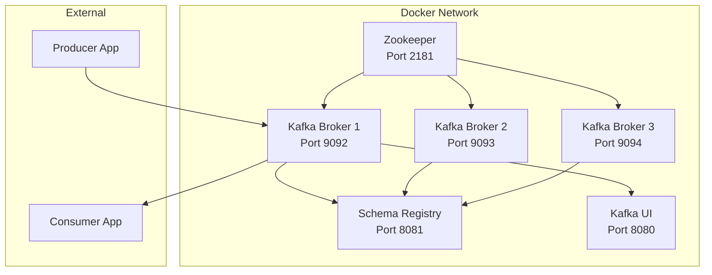
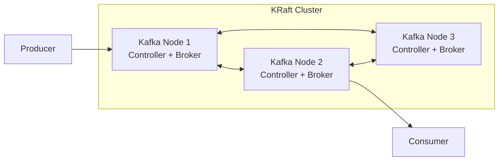
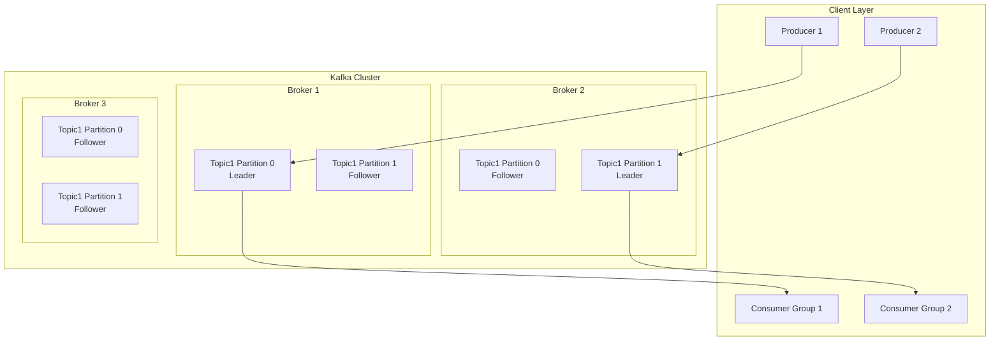
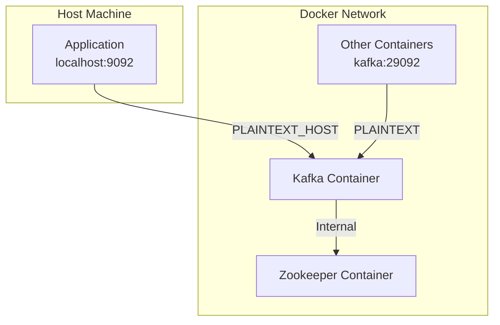
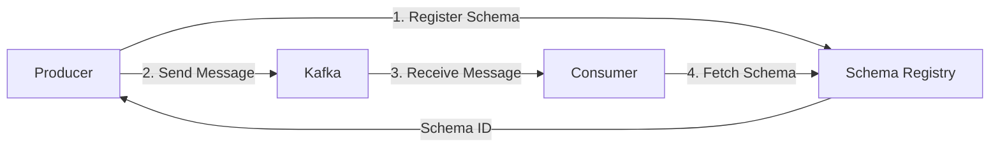

# How to Use Kafka with Docker

Author: [nawazdhandala](https://github.com/nawazdhandala)

Tags: Docker, Kafka, Streaming, Message Queue, DevOps, Containers

Description: Learn how to run Apache Kafka in Docker containers for local development and production environments. Covers single-node setup, multi-broker clusters, networking, producers, consumers, and monitoring strategies.

---

Apache Kafka is a distributed event streaming platform widely used for building real-time data pipelines and streaming applications. Running Kafka in Docker simplifies deployment, ensures consistency across environments, and makes it easy to spin up development clusters. In this guide, you will learn how to containerize Kafka effectively.

## Architecture Overview

Before diving into implementation, understanding how Kafka components interact within Docker is essential.



## Quick Start with Docker

The simplest way to run Kafka in Docker uses the Bitnami image, which handles configuration automatically.

The following command starts a single Kafka instance with embedded Zookeeper functionality using KRaft mode.

```bash
# Pull and run Kafka in standalone mode using KRaft (no Zookeeper required)
# The KAFKA_CFG_NODE_ID identifies this broker uniquely
# KAFKA_CFG_PROCESS_ROLES enables both broker and controller functionality
docker run -d --name kafka \
  -p 9092:9092 \
  -e KAFKA_CFG_NODE_ID=1 \
  -e KAFKA_CFG_PROCESS_ROLES=broker,controller \
  -e KAFKA_CFG_LISTENERS=PLAINTEXT://:9092,CONTROLLER://:9093 \
  -e KAFKA_CFG_LISTENER_SECURITY_PROTOCOL_MAP=CONTROLLER:PLAINTEXT,PLAINTEXT:PLAINTEXT \
  -e KAFKA_CFG_CONTROLLER_QUORUM_VOTERS=1@localhost:9093 \
  -e KAFKA_CFG_CONTROLLER_LISTENER_NAMES=CONTROLLER \
  -e ALLOW_PLAINTEXT_LISTENER=yes \
  bitnami/kafka:latest
```

## Docker Compose Setup with Zookeeper

For development environments, Docker Compose provides a better approach to managing multiple services.

The configuration below sets up Kafka with Zookeeper for cluster coordination. Each environment variable serves a specific purpose in configuring broker behavior.

```yaml
# docker-compose.yml
# Basic Kafka setup with Zookeeper for local development
version: '3.8'

services:
  # Zookeeper manages cluster metadata and broker coordination
  zookeeper:
    image: confluentinc/cp-zookeeper:7.5.0
    container_name: zookeeper
    environment:
      # Port for client connections
      ZOOKEEPER_CLIENT_PORT: 2181
      # Base time unit in milliseconds for heartbeats
      ZOOKEEPER_TICK_TIME: 2000
    ports:
      - "2181:2181"
    volumes:
      # Persist Zookeeper data across container restarts
      - zookeeper_data:/var/lib/zookeeper/data
      - zookeeper_logs:/var/lib/zookeeper/log
    networks:
      - kafka-network
    healthcheck:
      test: ["CMD", "nc", "-z", "localhost", "2181"]
      interval: 10s
      timeout: 5s
      retries: 5

  # Kafka broker handles message storage and delivery
  kafka:
    image: confluentinc/cp-kafka:7.5.0
    container_name: kafka
    depends_on:
      zookeeper:
        condition: service_healthy
    ports:
      # External port for host machine connections
      - "9092:9092"
    environment:
      # Unique identifier for this broker in the cluster
      KAFKA_BROKER_ID: 1
      # Connection string for Zookeeper
      KAFKA_ZOOKEEPER_CONNECT: zookeeper:2181
      # Define listener addresses - internal for Docker, external for host
      KAFKA_ADVERTISED_LISTENERS: PLAINTEXT://kafka:29092,PLAINTEXT_HOST://localhost:9092
      # Map listener names to security protocols
      KAFKA_LISTENER_SECURITY_PROTOCOL_MAP: PLAINTEXT:PLAINTEXT,PLAINTEXT_HOST:PLAINTEXT
      # Listener used for inter-broker communication
      KAFKA_INTER_BROKER_LISTENER_NAME: PLAINTEXT
      # Replication factor for internal topics (1 for single-node)
      KAFKA_OFFSETS_TOPIC_REPLICATION_FACTOR: 1
      # Enable automatic topic creation when producing/consuming
      KAFKA_AUTO_CREATE_TOPICS_ENABLE: "true"
      # How long to retain messages (7 days in hours)
      KAFKA_LOG_RETENTION_HOURS: 168
    volumes:
      # Persist Kafka data across container restarts
      - kafka_data:/var/lib/kafka/data
    networks:
      - kafka-network
    healthcheck:
      test: ["CMD", "kafka-broker-api-versions", "--bootstrap-server", "localhost:9092"]
      interval: 30s
      timeout: 10s
      retries: 5

networks:
  kafka-network:
    driver: bridge

volumes:
  zookeeper_data:
  zookeeper_logs:
  kafka_data:
```

Start the stack with the following command.

```bash
# Start all services in detached mode
docker compose up -d

# View logs to confirm successful startup
docker compose logs -f kafka
```

## KRaft Mode (Zookeeper-less)

Kafka 3.3+ introduced KRaft mode, which removes the dependency on Zookeeper. KRaft simplifies operations and improves performance.



The following configuration runs Kafka without Zookeeper, using the built-in Raft consensus protocol.

```yaml
# docker-compose-kraft.yml
# Kafka KRaft mode - no Zookeeper dependency
version: '3.8'

services:
  kafka:
    image: confluentinc/cp-kafka:7.5.0
    container_name: kafka-kraft
    ports:
      - "9092:9092"
    environment:
      # Unique node identifier
      KAFKA_NODE_ID: 1
      # Node acts as both broker and controller
      KAFKA_PROCESS_ROLES: broker,controller
      # Define all listeners - external, internal, and controller
      KAFKA_LISTENERS: PLAINTEXT://kafka:29092,CONTROLLER://kafka:29093,PLAINTEXT_HOST://0.0.0.0:9092
      # Advertise addresses clients should use
      KAFKA_ADVERTISED_LISTENERS: PLAINTEXT://kafka:29092,PLAINTEXT_HOST://localhost:9092
      # Security protocol mapping for each listener
      KAFKA_LISTENER_SECURITY_PROTOCOL_MAP: CONTROLLER:PLAINTEXT,PLAINTEXT:PLAINTEXT,PLAINTEXT_HOST:PLAINTEXT
      # Define controller quorum voters (node_id@host:port)
      KAFKA_CONTROLLER_QUORUM_VOTERS: 1@kafka:29093
      # Listener name for controller communication
      KAFKA_CONTROLLER_LISTENER_NAMES: CONTROLLER
      # Listener for broker-to-broker communication
      KAFKA_INTER_BROKER_LISTENER_NAME: PLAINTEXT
      # Replication settings for single-node setup
      KAFKA_OFFSETS_TOPIC_REPLICATION_FACTOR: 1
      KAFKA_TRANSACTION_STATE_LOG_REPLICATION_FACTOR: 1
      KAFKA_TRANSACTION_STATE_LOG_MIN_ISR: 1
      # Unique cluster identifier (generate with: kafka-storage random-uuid)
      CLUSTER_ID: MkU3OEVBNTcwNTJENDM2Qk
    volumes:
      - kafka_kraft_data:/var/lib/kafka/data
    networks:
      - kafka-network

networks:
  kafka-network:
    driver: bridge

volumes:
  kafka_kraft_data:
```

## Multi-Broker Production Cluster

Production environments require multiple brokers for fault tolerance and high availability.



The following configuration creates a three-broker cluster with proper replication settings.

```yaml
# docker-compose-cluster.yml
# Production-ready multi-broker Kafka cluster
version: '3.8'

services:
  zookeeper:
    image: confluentinc/cp-zookeeper:7.5.0
    container_name: zookeeper
    environment:
      ZOOKEEPER_CLIENT_PORT: 2181
      ZOOKEEPER_TICK_TIME: 2000
      # Server ID for multi-node Zookeeper (optional for single ZK)
      ZOOKEEPER_SERVER_ID: 1
    volumes:
      - zookeeper_data:/var/lib/zookeeper/data
    networks:
      - kafka-cluster
    healthcheck:
      test: ["CMD", "nc", "-z", "localhost", "2181"]
      interval: 10s
      timeout: 5s
      retries: 5

  # First Kafka broker
  kafka1:
    image: confluentinc/cp-kafka:7.5.0
    container_name: kafka1
    depends_on:
      zookeeper:
        condition: service_healthy
    ports:
      - "9092:9092"
    environment:
      KAFKA_BROKER_ID: 1
      KAFKA_ZOOKEEPER_CONNECT: zookeeper:2181
      KAFKA_ADVERTISED_LISTENERS: PLAINTEXT://kafka1:29092,PLAINTEXT_HOST://localhost:9092
      KAFKA_LISTENER_SECURITY_PROTOCOL_MAP: PLAINTEXT:PLAINTEXT,PLAINTEXT_HOST:PLAINTEXT
      KAFKA_INTER_BROKER_LISTENER_NAME: PLAINTEXT
      # Replication factor of 3 ensures data redundancy
      KAFKA_OFFSETS_TOPIC_REPLICATION_FACTOR: 3
      KAFKA_DEFAULT_REPLICATION_FACTOR: 3
      # Minimum replicas that must acknowledge writes
      KAFKA_MIN_INSYNC_REPLICAS: 2
      # Number of partitions for new topics
      KAFKA_NUM_PARTITIONS: 3
    volumes:
      - kafka1_data:/var/lib/kafka/data
    networks:
      - kafka-cluster

  # Second Kafka broker
  kafka2:
    image: confluentinc/cp-kafka:7.5.0
    container_name: kafka2
    depends_on:
      zookeeper:
        condition: service_healthy
    ports:
      - "9093:9092"
    environment:
      KAFKA_BROKER_ID: 2
      KAFKA_ZOOKEEPER_CONNECT: zookeeper:2181
      KAFKA_ADVERTISED_LISTENERS: PLAINTEXT://kafka2:29092,PLAINTEXT_HOST://localhost:9093
      KAFKA_LISTENER_SECURITY_PROTOCOL_MAP: PLAINTEXT:PLAINTEXT,PLAINTEXT_HOST:PLAINTEXT
      KAFKA_INTER_BROKER_LISTENER_NAME: PLAINTEXT
      KAFKA_OFFSETS_TOPIC_REPLICATION_FACTOR: 3
      KAFKA_DEFAULT_REPLICATION_FACTOR: 3
      KAFKA_MIN_INSYNC_REPLICAS: 2
      KAFKA_NUM_PARTITIONS: 3
    volumes:
      - kafka2_data:/var/lib/kafka/data
    networks:
      - kafka-cluster

  # Third Kafka broker
  kafka3:
    image: confluentinc/cp-kafka:7.5.0
    container_name: kafka3
    depends_on:
      zookeeper:
        condition: service_healthy
    ports:
      - "9094:9092"
    environment:
      KAFKA_BROKER_ID: 3
      KAFKA_ZOOKEEPER_CONNECT: zookeeper:2181
      KAFKA_ADVERTISED_LISTENERS: PLAINTEXT://kafka3:29092,PLAINTEXT_HOST://localhost:9094
      KAFKA_LISTENER_SECURITY_PROTOCOL_MAP: PLAINTEXT:PLAINTEXT,PLAINTEXT_HOST:PLAINTEXT
      KAFKA_INTER_BROKER_LISTENER_NAME: PLAINTEXT
      KAFKA_OFFSETS_TOPIC_REPLICATION_FACTOR: 3
      KAFKA_DEFAULT_REPLICATION_FACTOR: 3
      KAFKA_MIN_INSYNC_REPLICAS: 2
      KAFKA_NUM_PARTITIONS: 3
    volumes:
      - kafka3_data:/var/lib/kafka/data
    networks:
      - kafka-cluster

networks:
  kafka-cluster:
    driver: bridge

volumes:
  zookeeper_data:
  kafka1_data:
  kafka2_data:
  kafka3_data:
```

## Topic Management Commands

Managing topics is essential for Kafka operations. The commands below demonstrate common administrative tasks.

```bash
# Create a topic with 3 partitions and replication factor of 2
# Partitions enable parallel processing, replication ensures durability
docker exec kafka kafka-topics --create \
  --bootstrap-server localhost:9092 \
  --topic orders \
  --partitions 3 \
  --replication-factor 1

# List all topics in the cluster
docker exec kafka kafka-topics --list \
  --bootstrap-server localhost:9092

# Describe a specific topic to view partition and replica details
docker exec kafka kafka-topics --describe \
  --bootstrap-server localhost:9092 \
  --topic orders

# Delete a topic (requires delete.topic.enable=true)
docker exec kafka kafka-topics --delete \
  --bootstrap-server localhost:9092 \
  --topic orders

# Alter topic configuration - increase retention to 30 days
docker exec kafka kafka-configs --alter \
  --bootstrap-server localhost:9092 \
  --entity-type topics \
  --entity-name orders \
  --add-config retention.ms=2592000000
```

## Producing and Consuming Messages

Testing your Kafka setup requires producing and consuming messages. The following examples demonstrate both operations.

```bash
# Start a console producer - type messages and press Enter to send
# Each line becomes a separate message
docker exec -it kafka kafka-console-producer \
  --bootstrap-server localhost:9092 \
  --topic orders

# Start a console consumer reading from the beginning
# The --from-beginning flag reads all existing messages
docker exec kafka kafka-console-consumer \
  --bootstrap-server localhost:9092 \
  --topic orders \
  --from-beginning

# Consumer with consumer group for load balancing
# Multiple consumers with the same group-id share partitions
docker exec kafka kafka-console-consumer \
  --bootstrap-server localhost:9092 \
  --topic orders \
  --group order-processors \
  --from-beginning

# Produce messages with keys (key:value format)
# Keys determine partition assignment for ordering guarantees
docker exec -it kafka kafka-console-producer \
  --bootstrap-server localhost:9092 \
  --topic orders \
  --property parse.key=true \
  --property key.separator=:

# Consume messages showing keys
docker exec kafka kafka-console-consumer \
  --bootstrap-server localhost:9092 \
  --topic orders \
  --from-beginning \
  --property print.key=true \
  --property key.separator=:
```

## Python Producer and Consumer Example

Integrating Kafka with applications requires client libraries. The following Python examples demonstrate production-ready patterns.

```python
# producer.py
# Kafka producer with error handling and message serialization
from kafka import KafkaProducer
import json
import logging

# Configure logging for debugging
logging.basicConfig(level=logging.INFO)
logger = logging.getLogger(__name__)

def create_producer():
    """
    Create a Kafka producer with JSON serialization.
    The producer handles connection pooling and batching automatically.
    """
    return KafkaProducer(
        # Connect to broker - use comma-separated list for multiple brokers
        bootstrap_servers=['localhost:9092'],
        # Serialize values to JSON bytes
        value_serializer=lambda v: json.dumps(v).encode('utf-8'),
        # Serialize keys to UTF-8 bytes
        key_serializer=lambda k: k.encode('utf-8') if k else None,
        # Wait for all replicas to acknowledge (strongest guarantee)
        acks='all',
        # Retry failed sends up to 3 times
        retries=3,
        # Maximum time to wait for acknowledgment
        request_timeout_ms=30000,
        # Enable idempotent producer to prevent duplicates
        enable_idempotence=True
    )

def send_order(producer, order_id, order_data):
    """
    Send an order message to the orders topic.
    Using order_id as key ensures all messages for the same order
    go to the same partition, maintaining order.
    """
    try:
        # Send message and get future for result
        future = producer.send(
            topic='orders',
            key=order_id,
            value=order_data
        )
        # Wait for send to complete and get metadata
        record_metadata = future.get(timeout=10)
        logger.info(
            f"Sent order {order_id} to partition {record_metadata.partition} "
            f"at offset {record_metadata.offset}"
        )
        return True
    except Exception as e:
        logger.error(f"Failed to send order {order_id}: {e}")
        return False

if __name__ == "__main__":
    producer = create_producer()

    # Send sample orders
    orders = [
        {"order_id": "ORD-001", "customer": "Alice", "amount": 150.00},
        {"order_id": "ORD-002", "customer": "Bob", "amount": 299.99},
        {"order_id": "ORD-003", "customer": "Charlie", "amount": 75.50},
    ]

    for order in orders:
        send_order(producer, order["order_id"], order)

    # Flush any remaining messages
    producer.flush()
    producer.close()
```

```python
# consumer.py
# Kafka consumer with consumer groups and error handling
from kafka import KafkaConsumer
import json
import logging

logging.basicConfig(level=logging.INFO)
logger = logging.getLogger(__name__)

def create_consumer(group_id):
    """
    Create a Kafka consumer with JSON deserialization.
    Consumer groups enable horizontal scaling of consumers.
    """
    return KafkaConsumer(
        'orders',
        # Connect to broker cluster
        bootstrap_servers=['localhost:9092'],
        # Consumer group for load balancing
        group_id=group_id,
        # Start from earliest message if no offset stored
        auto_offset_reset='earliest',
        # Automatically commit offsets periodically
        enable_auto_commit=True,
        # Commit interval in milliseconds
        auto_commit_interval_ms=5000,
        # Deserialize JSON messages
        value_deserializer=lambda m: json.loads(m.decode('utf-8')),
        # Deserialize keys
        key_deserializer=lambda k: k.decode('utf-8') if k else None,
        # Maximum time between polls before rebalance
        max_poll_interval_ms=300000,
        # Session timeout for consumer liveness
        session_timeout_ms=45000
    )

def process_orders(consumer):
    """
    Process orders from the Kafka topic.
    The consumer automatically handles partition assignment
    and rebalancing when consumers join or leave the group.
    """
    try:
        logger.info("Starting order processor...")
        for message in consumer:
            order = message.value
            logger.info(
                f"Received order from partition {message.partition}, "
                f"offset {message.offset}: {order}"
            )
            # Process the order (add your business logic here)
            process_single_order(order)
    except KeyboardInterrupt:
        logger.info("Shutting down consumer...")
    finally:
        consumer.close()

def process_single_order(order):
    """Process a single order - implement your business logic."""
    logger.info(f"Processing order: {order.get('order_id')} for {order.get('customer')}")
    # Add order processing logic here

if __name__ == "__main__":
    consumer = create_consumer('order-processors')
    process_orders(consumer)
```

## Docker Networking Explained

Understanding Docker networking is crucial for Kafka connectivity. The diagram below illustrates how different listeners work.



The key concept is having separate listeners for internal (Docker network) and external (host machine) communication.

```yaml
# Listener configuration explained
environment:
  # LISTENERS: What interfaces Kafka binds to inside the container
  # Format: LISTENER_NAME://HOST:PORT
  KAFKA_LISTENERS: PLAINTEXT://kafka:29092,PLAINTEXT_HOST://0.0.0.0:9092

  # ADVERTISED_LISTENERS: What addresses clients should use to connect
  # Internal services use kafka:29092, external apps use localhost:9092
  KAFKA_ADVERTISED_LISTENERS: PLAINTEXT://kafka:29092,PLAINTEXT_HOST://localhost:9092

  # Maps listener names to security protocols
  KAFKA_LISTENER_SECURITY_PROTOCOL_MAP: PLAINTEXT:PLAINTEXT,PLAINTEXT_HOST:PLAINTEXT

  # Which listener brokers use to communicate with each other
  KAFKA_INTER_BROKER_LISTENER_NAME: PLAINTEXT
```

## Adding Monitoring with Kafka UI

Monitoring Kafka clusters helps identify issues and optimize performance. Kafka UI provides a web interface for cluster management.

```yaml
# docker-compose-with-ui.yml
# Complete setup with monitoring UI
version: '3.8'

services:
  zookeeper:
    image: confluentinc/cp-zookeeper:7.5.0
    environment:
      ZOOKEEPER_CLIENT_PORT: 2181
    networks:
      - kafka-network

  kafka:
    image: confluentinc/cp-kafka:7.5.0
    depends_on:
      - zookeeper
    ports:
      - "9092:9092"
    environment:
      KAFKA_BROKER_ID: 1
      KAFKA_ZOOKEEPER_CONNECT: zookeeper:2181
      KAFKA_ADVERTISED_LISTENERS: PLAINTEXT://kafka:29092,PLAINTEXT_HOST://localhost:9092
      KAFKA_LISTENER_SECURITY_PROTOCOL_MAP: PLAINTEXT:PLAINTEXT,PLAINTEXT_HOST:PLAINTEXT
      KAFKA_INTER_BROKER_LISTENER_NAME: PLAINTEXT
      KAFKA_OFFSETS_TOPIC_REPLICATION_FACTOR: 1
      # Enable JMX for metrics collection
      KAFKA_JMX_PORT: 9999
      KAFKA_JMX_HOSTNAME: kafka
    networks:
      - kafka-network

  # Kafka UI for visual management
  kafka-ui:
    image: provectuslabs/kafka-ui:latest
    container_name: kafka-ui
    ports:
      - "8080:8080"
    environment:
      # Cluster configuration
      KAFKA_CLUSTERS_0_NAME: local-cluster
      KAFKA_CLUSTERS_0_BOOTSTRAPSERVERS: kafka:29092
      # Enable JMX metrics
      KAFKA_CLUSTERS_0_METRICS_PORT: 9999
      # Optional: Add Schema Registry if using Avro
      # KAFKA_CLUSTERS_0_SCHEMAREGISTRY: http://schema-registry:8081
    depends_on:
      - kafka
    networks:
      - kafka-network

networks:
  kafka-network:
    driver: bridge
```

Access the UI at `http://localhost:8080` to view topics, messages, consumer groups, and broker metrics.

## Schema Registry Integration

Schema Registry manages schemas for Kafka messages, ensuring data compatibility between producers and consumers.



```yaml
# Adding Schema Registry to your stack
services:
  schema-registry:
    image: confluentinc/cp-schema-registry:7.5.0
    container_name: schema-registry
    depends_on:
      - kafka
    ports:
      - "8081:8081"
    environment:
      # Hostname for Schema Registry
      SCHEMA_REGISTRY_HOST_NAME: schema-registry
      # Kafka bootstrap servers for storing schemas
      SCHEMA_REGISTRY_KAFKASTORE_BOOTSTRAP_SERVERS: kafka:29092
      # Listener configuration
      SCHEMA_REGISTRY_LISTENERS: http://0.0.0.0:8081
      # Schema compatibility mode (BACKWARD, FORWARD, FULL, NONE)
      SCHEMA_REGISTRY_SCHEMA_COMPATIBILITY_LEVEL: BACKWARD
    networks:
      - kafka-network
```

Register and retrieve schemas using the REST API.

```bash
# Register a new Avro schema
curl -X POST -H "Content-Type: application/vnd.schemaregistry.v1+json" \
  --data '{
    "schema": "{\"type\":\"record\",\"name\":\"Order\",\"fields\":[{\"name\":\"order_id\",\"type\":\"string\"},{\"name\":\"amount\",\"type\":\"double\"}]}"
  }' \
  http://localhost:8081/subjects/orders-value/versions

# List all registered subjects (schemas)
curl http://localhost:8081/subjects

# Get the latest schema version
curl http://localhost:8081/subjects/orders-value/versions/latest
```

## Health Checks and Monitoring

Implementing proper health checks ensures your Kafka deployment remains reliable.

```yaml
# Complete healthcheck configuration
services:
  kafka:
    image: confluentinc/cp-kafka:7.5.0
    healthcheck:
      # Check if broker API is responding
      test: ["CMD", "kafka-broker-api-versions", "--bootstrap-server", "localhost:9092"]
      # Time between checks
      interval: 30s
      # Maximum time for check to complete
      timeout: 10s
      # Number of failures before marking unhealthy
      retries: 5
      # Initial delay before first check
      start_period: 60s
    # Restart policy for production
    restart: unless-stopped
    # Resource limits prevent runaway processes
    deploy:
      resources:
        limits:
          memory: 2G
          cpus: '1.0'
        reservations:
          memory: 1G
          cpus: '0.5'
```

## Troubleshooting Common Issues

When working with Kafka in Docker, you may encounter these common problems.

### Connection Refused

Verify the advertised listeners match what clients expect.

```bash
# Check Kafka logs for listener configuration
docker logs kafka 2>&1 | grep -i listener

# Test connectivity from host
nc -zv localhost 9092

# Test connectivity from another container
docker exec other-container nc -zv kafka 29092
```

### Topic Not Found

Ensure auto-creation is enabled or create topics manually.

```bash
# Check if auto.create.topics.enable is set
docker exec kafka kafka-configs --describe \
  --bootstrap-server localhost:9092 \
  --entity-type brokers \
  --entity-name 1 | grep auto.create

# Create topic manually if needed
docker exec kafka kafka-topics --create \
  --bootstrap-server localhost:9092 \
  --topic my-topic \
  --partitions 1 \
  --replication-factor 1
```

### Consumer Group Lag

Monitor consumer lag to identify slow consumers.

```bash
# Check consumer group lag
docker exec kafka kafka-consumer-groups --describe \
  --bootstrap-server localhost:9092 \
  --group my-consumer-group

# Reset consumer group offset to latest
docker exec kafka kafka-consumer-groups --reset-offsets \
  --bootstrap-server localhost:9092 \
  --group my-consumer-group \
  --topic my-topic \
  --to-latest \
  --execute
```

## Environment Variables Reference

The table below summarizes essential Kafka environment variables for Docker deployments.

| Variable | Description | Example |
|----------|-------------|---------|
| KAFKA_BROKER_ID | Unique broker identifier | 1 |
| KAFKA_ZOOKEEPER_CONNECT | Zookeeper connection string | zookeeper:2181 |
| KAFKA_ADVERTISED_LISTENERS | Client-facing listener addresses | PLAINTEXT://kafka:29092 |
| KAFKA_LISTENER_SECURITY_PROTOCOL_MAP | Security protocol per listener | PLAINTEXT:PLAINTEXT |
| KAFKA_OFFSETS_TOPIC_REPLICATION_FACTOR | Replication for internal topics | 3 |
| KAFKA_AUTO_CREATE_TOPICS_ENABLE | Auto-create topics on produce/consume | true |
| KAFKA_LOG_RETENTION_HOURS | Message retention period | 168 |
| KAFKA_NUM_PARTITIONS | Default partitions for new topics | 3 |
| KAFKA_DEFAULT_REPLICATION_FACTOR | Default replication for new topics | 3 |
| KAFKA_MIN_INSYNC_REPLICAS | Minimum replicas for write acknowledgment | 2 |

## Summary

Running Kafka in Docker provides flexibility for both development and production environments. Key takeaways include:

- Use KRaft mode for simpler deployments without Zookeeper dependency
- Configure separate listeners for internal Docker and external host communication
- Implement health checks and resource limits for production stability
- Use consumer groups for horizontal scaling of message processing
- Add Schema Registry for data compatibility enforcement
- Monitor with Kafka UI or Prometheus/Grafana for operational visibility

Start with the basic single-node setup for development, then graduate to multi-broker clusters with proper replication for production workloads.

