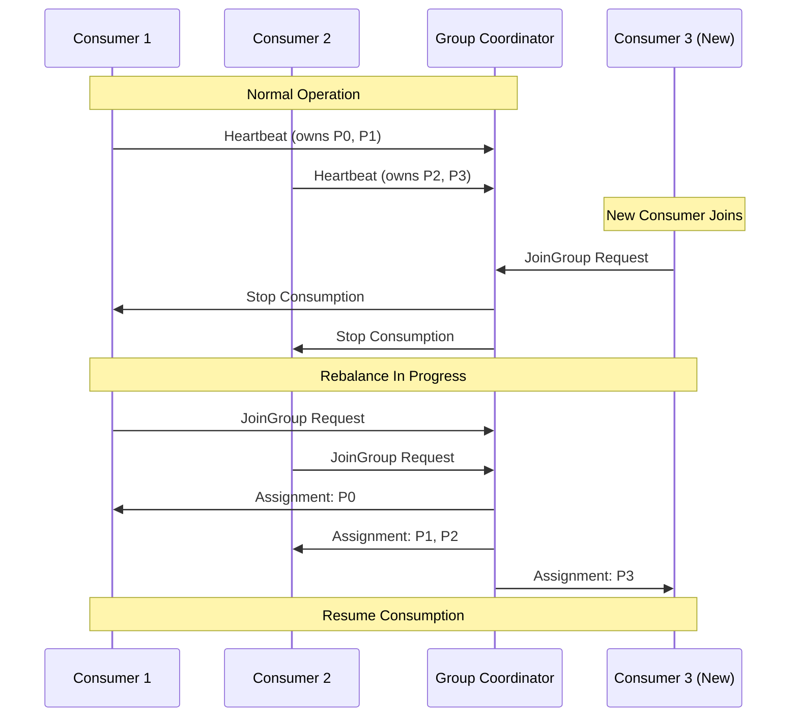
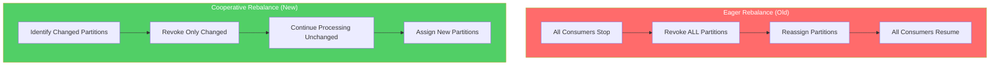
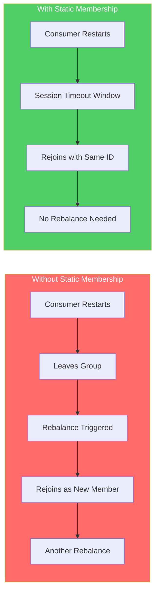
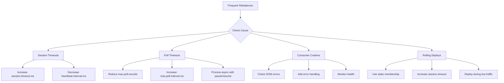

# How to Handle Kafka Partition Rebalancing

Author: [nawazdhandala](https://github.com/nawazdhandala)

Tags: Kafka, Distributed Systems, Messaging, Event Streaming, Java, Backend

Description: Learn how to handle Kafka partition rebalancing effectively with strategies for minimizing consumer downtime, implementing cooperative rebalancing, and managing offset commits during rebalance events.

---

Kafka consumer groups undergo partition rebalancing whenever consumers join or leave a group, or when topics have partitions added. During rebalancing, message consumption pauses across all consumers in the group, which can significantly impact throughput and latency. Understanding how to manage these rebalances is critical for building resilient event-driven systems.

## Understanding Partition Rebalancing

When a Kafka consumer group rebalances, partitions get redistributed among active consumers. Every consumer must stop processing until the rebalance completes, making rebalances expensive operations that should be minimized.



## Common Rebalance Triggers

| Trigger | Cause | Prevention Strategy |
|---------|-------|---------------------|
| Consumer crash | Unhandled exception, OOM | Robust error handling, memory monitoring |
| Session timeout | Heartbeat not sent in time | Tune session.timeout.ms |
| Poll timeout | Processing took too long | Reduce max.poll.records, increase max.poll.interval.ms |
| Consumer scale | New instance joins group | Use static membership |
| Topic changes | Partitions added | Planned maintenance windows |

## Basic Consumer with Rebalance Listener

Implementing a rebalance listener helps you manage offset commits and cleanup during partition reassignment.

```java
import org.apache.kafka.clients.consumer.*;
import org.apache.kafka.common.TopicPartition;
import java.time.Duration;
import java.util.*;
import java.util.concurrent.ConcurrentHashMap;

public class RebalanceAwareConsumer {

    private final KafkaConsumer<String, String> consumer;
    // Track offsets that have been processed but not yet committed
    private final Map<TopicPartition, OffsetAndMetadata> currentOffsets =
        new ConcurrentHashMap<>();

    public RebalanceAwareConsumer(Properties props) {
        this.consumer = new KafkaConsumer<>(props);
    }

    public void subscribe(String topic) {
        // The rebalance listener handles offset management during partition changes
        consumer.subscribe(Collections.singletonList(topic), new ConsumerRebalanceListener() {

            @Override
            public void onPartitionsRevoked(Collection<TopicPartition> partitions) {
                // Called before rebalance starts - commit processed offsets
                System.out.println("Partitions revoked: " + partitions);
                commitCurrentOffsets();

                // Clean up any partition-specific resources
                for (TopicPartition partition : partitions) {
                    cleanupPartitionState(partition);
                }
            }

            @Override
            public void onPartitionsAssigned(Collection<TopicPartition> partitions) {
                // Called after rebalance completes - initialize new partition state
                System.out.println("Partitions assigned: " + partitions);

                for (TopicPartition partition : partitions) {
                    initializePartitionState(partition);
                }
            }
        });
    }

    public void poll() {
        while (true) {
            ConsumerRecords<String, String> records = consumer.poll(Duration.ofMillis(100));

            for (ConsumerRecord<String, String> record : records) {
                processRecord(record);

                // Track the offset of the next record to consume
                currentOffsets.put(
                    new TopicPartition(record.topic(), record.partition()),
                    new OffsetAndMetadata(record.offset() + 1)
                );
            }

            // Commit offsets periodically
            if (!currentOffsets.isEmpty()) {
                commitCurrentOffsets();
            }
        }
    }

    private void commitCurrentOffsets() {
        if (!currentOffsets.isEmpty()) {
            consumer.commitSync(new HashMap<>(currentOffsets));
            currentOffsets.clear();
        }
    }

    private void processRecord(ConsumerRecord<String, String> record) {
        System.out.printf("Processing: topic=%s, partition=%d, offset=%d, value=%s%n",
            record.topic(), record.partition(), record.offset(), record.value());
    }

    private void cleanupPartitionState(TopicPartition partition) {
        // Close file handles, flush buffers, release locks
        currentOffsets.remove(partition);
    }

    private void initializePartitionState(TopicPartition partition) {
        // Load state, open connections, prepare for processing
    }
}
```

## Cooperative Rebalancing (Incremental Rebalancing)

Cooperative rebalancing (introduced in Kafka 2.4) allows consumers to keep processing partitions that are not being reassigned. Only affected partitions pause during rebalance, dramatically reducing downtime.



Configuring cooperative rebalancing requires setting the partition assignor in your consumer properties.

```java
import org.apache.kafka.clients.consumer.*;
import java.util.Properties;

public class CooperativeRebalanceConfig {

    public static Properties createCooperativeConsumerConfig() {
        Properties props = new Properties();
        props.put(ConsumerConfig.BOOTSTRAP_SERVERS_CONFIG, "localhost:9092");
        props.put(ConsumerConfig.GROUP_ID_CONFIG, "my-consumer-group");
        props.put(ConsumerConfig.KEY_DESERIALIZER_CLASS_CONFIG,
            "org.apache.kafka.common.serialization.StringDeserializer");
        props.put(ConsumerConfig.VALUE_DESERIALIZER_CLASS_CONFIG,
            "org.apache.kafka.common.serialization.StringDeserializer");

        // Enable cooperative rebalancing with CooperativeStickyAssignor
        // Partitions stick to their current owner when possible
        props.put(ConsumerConfig.PARTITION_ASSIGNMENT_STRATEGY_CONFIG,
            CooperativeStickyAssignor.class.getName());

        // Alternative: Use multiple assignors for rolling upgrade compatibility
        // props.put(ConsumerConfig.PARTITION_ASSIGNMENT_STRATEGY_CONFIG,
        //     "org.apache.kafka.clients.consumer.CooperativeStickyAssignor," +
        //     "org.apache.kafka.clients.consumer.RangeAssignor");

        return props;
    }
}
```

## Implementing Cooperative Rebalance Listener

Cooperative rebalancing introduces a new callback method for handling partitions that are being lost.

```java
import org.apache.kafka.clients.consumer.*;
import org.apache.kafka.common.TopicPartition;
import java.time.Duration;
import java.util.*;

public class CooperativeRebalanceConsumer {

    private final KafkaConsumer<String, String> consumer;
    private final Map<TopicPartition, Long> partitionProcessingTimes = new HashMap<>();

    public CooperativeRebalanceConsumer(Properties props) {
        this.consumer = new KafkaConsumer<>(props);
    }

    public void subscribe(String topic) {
        consumer.subscribe(Collections.singletonList(topic), new ConsumerRebalanceListener() {

            @Override
            public void onPartitionsRevoked(Collection<TopicPartition> partitions) {
                // With cooperative rebalancing, only partitions being moved are revoked
                // Other partitions continue processing without interruption
                System.out.println("Partitions revoked (cooperative): " + partitions);

                for (TopicPartition partition : partitions) {
                    // Commit offsets for revoked partitions only
                    commitPartitionOffset(partition);
                    logPartitionStatistics(partition);
                }
            }

            @Override
            public void onPartitionsAssigned(Collection<TopicPartition> partitions) {
                // New partitions assigned to this consumer
                System.out.println("Partitions assigned: " + partitions);

                for (TopicPartition partition : partitions) {
                    partitionProcessingTimes.put(partition, System.currentTimeMillis());

                    // Optionally seek to a specific offset for new partitions
                    // consumer.seek(partition, getLastProcessedOffset(partition));
                }
            }

            @Override
            public void onPartitionsLost(Collection<TopicPartition> partitions) {
                // Called when partitions are lost unexpectedly (consumer crashed)
                // Different from revoked - no time to commit offsets cleanly
                System.out.println("Partitions lost (unexpected): " + partitions);

                for (TopicPartition partition : partitions) {
                    // Handle potential duplicate processing when partition is reassigned
                    markPartitionAsLost(partition);
                }
            }
        });
    }

    private void commitPartitionOffset(TopicPartition partition) {
        // Commit the current offset for a specific partition
        try {
            consumer.commitSync(Duration.ofSeconds(5));
        } catch (Exception e) {
            System.err.println("Failed to commit offset for partition: " + partition);
        }
    }

    private void logPartitionStatistics(TopicPartition partition) {
        Long startTime = partitionProcessingTimes.remove(partition);
        if (startTime != null) {
            long duration = System.currentTimeMillis() - startTime;
            System.out.printf("Partition %s was owned for %d ms%n", partition, duration);
        }
    }

    private void markPartitionAsLost(TopicPartition partition) {
        // Log for monitoring, may need idempotency handling
        partitionProcessingTimes.remove(partition);
    }
}
```

## Static Group Membership

Static membership prevents rebalances when consumers restart by assigning a persistent identity to each consumer instance. Consumers rejoining with the same ID reclaim their previous partition assignments.



Setting up static membership requires configuring a unique group instance ID for each consumer.

```java
import org.apache.kafka.clients.consumer.*;
import java.util.Properties;
import java.util.UUID;

public class StaticMembershipConfig {

    public static Properties createStaticMemberConsumerConfig(String instanceId) {
        Properties props = new Properties();
        props.put(ConsumerConfig.BOOTSTRAP_SERVERS_CONFIG, "localhost:9092");
        props.put(ConsumerConfig.GROUP_ID_CONFIG, "order-processing-group");
        props.put(ConsumerConfig.KEY_DESERIALIZER_CLASS_CONFIG,
            "org.apache.kafka.common.serialization.StringDeserializer");
        props.put(ConsumerConfig.VALUE_DESERIALIZER_CLASS_CONFIG,
            "org.apache.kafka.common.serialization.StringDeserializer");

        // Assign a stable, unique identifier for this consumer instance
        // Use hostname, pod name, or a consistent identifier
        props.put(ConsumerConfig.GROUP_INSTANCE_ID_CONFIG, instanceId);

        // Increase session timeout for static members
        // Consumer can be down for this long without triggering rebalance
        props.put(ConsumerConfig.SESSION_TIMEOUT_MS_CONFIG, 300000); // 5 minutes

        // Heartbeat interval should be less than session timeout
        props.put(ConsumerConfig.HEARTBEAT_INTERVAL_MS_CONFIG, 10000); // 10 seconds

        return props;
    }

    // Example: Generate instance ID from environment
    public static String getInstanceId() {
        // In Kubernetes, use pod name
        String podName = System.getenv("HOSTNAME");
        if (podName != null) {
            return "consumer-" + podName;
        }

        // Fallback to a persistent file-based ID
        return loadOrCreatePersistentId();
    }

    private static String loadOrCreatePersistentId() {
        // Implementation to load from file or create new UUID
        return "consumer-" + UUID.randomUUID().toString().substring(0, 8);
    }
}
```

## Handling Long Processing Times

Long message processing can trigger rebalances if polling does not occur frequently enough. Managing this requires careful tuning of poll intervals and implementing background processing.

```java
import org.apache.kafka.clients.consumer.*;
import org.apache.kafka.common.TopicPartition;
import java.time.Duration;
import java.util.*;
import java.util.concurrent.*;

public class LongProcessingConsumer {

    private final KafkaConsumer<String, String> consumer;
    private final ExecutorService executor;
    private final Map<TopicPartition, Future<?>> processingTasks = new ConcurrentHashMap<>();
    private volatile boolean running = true;

    public LongProcessingConsumer(Properties props) {
        // Configure for long processing scenarios
        props.put(ConsumerConfig.MAX_POLL_RECORDS_CONFIG, 10); // Fewer records per poll
        props.put(ConsumerConfig.MAX_POLL_INTERVAL_MS_CONFIG, 600000); // 10 minutes max

        this.consumer = new KafkaConsumer<>(props);
        this.executor = Executors.newFixedThreadPool(4);
    }

    public void consume(String topic) {
        consumer.subscribe(Collections.singletonList(topic), new ConsumerRebalanceListener() {
            @Override
            public void onPartitionsRevoked(Collection<TopicPartition> partitions) {
                // Wait for in-flight processing to complete before rebalance
                waitForProcessingCompletion(partitions);
            }

            @Override
            public void onPartitionsAssigned(Collection<TopicPartition> partitions) {
                // Ready to process new partitions
            }
        });

        while (running) {
            ConsumerRecords<String, String> records = consumer.poll(Duration.ofMillis(100));

            for (ConsumerRecord<String, String> record : records) {
                TopicPartition partition = new TopicPartition(record.topic(), record.partition());

                // Submit processing task asynchronously
                Future<?> task = executor.submit(() -> {
                    try {
                        processLongRunningTask(record);

                        // Commit offset after successful processing
                        synchronized (consumer) {
                            consumer.commitSync(Collections.singletonMap(
                                partition,
                                new OffsetAndMetadata(record.offset() + 1)
                            ));
                        }
                    } catch (Exception e) {
                        handleProcessingError(record, e);
                    }
                });

                processingTasks.put(partition, task);
            }

            // Pause partitions with pending tasks to prevent fetching more records
            pausePartitionsWithPendingTasks();
        }
    }

    private void pausePartitionsWithPendingTasks() {
        Set<TopicPartition> toPause = new HashSet<>();
        Set<TopicPartition> toResume = new HashSet<>();

        for (Map.Entry<TopicPartition, Future<?>> entry : processingTasks.entrySet()) {
            if (entry.getValue().isDone()) {
                toResume.add(entry.getKey());
                processingTasks.remove(entry.getKey());
            } else {
                toPause.add(entry.getKey());
            }
        }

        if (!toPause.isEmpty()) {
            consumer.pause(toPause);
        }
        if (!toResume.isEmpty()) {
            consumer.resume(toResume);
        }
    }

    private void waitForProcessingCompletion(Collection<TopicPartition> partitions) {
        for (TopicPartition partition : partitions) {
            Future<?> task = processingTasks.get(partition);
            if (task != null) {
                try {
                    // Wait up to 30 seconds for task completion
                    task.get(30, TimeUnit.SECONDS);
                } catch (TimeoutException e) {
                    System.err.println("Processing timeout for partition: " + partition);
                    task.cancel(true);
                } catch (Exception e) {
                    System.err.println("Error waiting for task completion: " + e.getMessage());
                }
            }
        }
    }

    private void processLongRunningTask(ConsumerRecord<String, String> record) {
        // Simulate long processing
        try {
            Thread.sleep(5000);
        } catch (InterruptedException e) {
            Thread.currentThread().interrupt();
        }
    }

    private void handleProcessingError(ConsumerRecord<String, String> record, Exception e) {
        System.err.printf("Error processing record at offset %d: %s%n",
            record.offset(), e.getMessage());
    }

    public void shutdown() {
        running = false;
        executor.shutdown();
        consumer.close();
    }
}
```

## Monitoring Rebalance Events

Tracking rebalance metrics helps identify issues and optimize consumer group performance.

```java
import org.apache.kafka.clients.consumer.*;
import org.apache.kafka.common.TopicPartition;
import io.micrometer.core.instrument.*;
import java.time.Duration;
import java.time.Instant;
import java.util.*;
import java.util.concurrent.atomic.*;

public class MonitoredRebalanceConsumer {

    private final KafkaConsumer<String, String> consumer;
    private final MeterRegistry meterRegistry;

    // Metrics
    private final Counter rebalanceCounter;
    private final Timer rebalanceDuration;
    private final AtomicLong assignedPartitions;
    private final AtomicReference<Instant> rebalanceStartTime = new AtomicReference<>();

    public MonitoredRebalanceConsumer(Properties props, MeterRegistry meterRegistry) {
        this.consumer = new KafkaConsumer<>(props);
        this.meterRegistry = meterRegistry;

        // Initialize metrics
        this.rebalanceCounter = Counter.builder("kafka.consumer.rebalance.total")
            .description("Total number of rebalances")
            .tag("group", props.getProperty(ConsumerConfig.GROUP_ID_CONFIG))
            .register(meterRegistry);

        this.rebalanceDuration = Timer.builder("kafka.consumer.rebalance.duration")
            .description("Duration of rebalance operations")
            .tag("group", props.getProperty(ConsumerConfig.GROUP_ID_CONFIG))
            .register(meterRegistry);

        this.assignedPartitions = new AtomicLong(0);
        Gauge.builder("kafka.consumer.partitions.assigned", assignedPartitions, AtomicLong::get)
            .description("Number of partitions currently assigned")
            .tag("group", props.getProperty(ConsumerConfig.GROUP_ID_CONFIG))
            .register(meterRegistry);
    }

    public void subscribe(String topic) {
        consumer.subscribe(Collections.singletonList(topic), new ConsumerRebalanceListener() {

            @Override
            public void onPartitionsRevoked(Collection<TopicPartition> partitions) {
                // Record rebalance start time
                rebalanceStartTime.set(Instant.now());

                System.out.printf("Rebalance started - revoking %d partitions%n",
                    partitions.size());

                // Log which partitions are being revoked
                partitions.forEach(p ->
                    System.out.printf("  Revoking: %s-%d%n", p.topic(), p.partition())
                );
            }

            @Override
            public void onPartitionsAssigned(Collection<TopicPartition> partitions) {
                // Calculate rebalance duration
                Instant startTime = rebalanceStartTime.getAndSet(null);
                if (startTime != null) {
                    Duration duration = Duration.between(startTime, Instant.now());
                    rebalanceDuration.record(duration);

                    System.out.printf("Rebalance completed in %d ms%n",
                        duration.toMillis());
                }

                // Update metrics
                rebalanceCounter.increment();
                assignedPartitions.set(partitions.size());

                // Log new assignments
                System.out.printf("Assigned %d partitions:%n", partitions.size());
                partitions.forEach(p ->
                    System.out.printf("  Assigned: %s-%d%n", p.topic(), p.partition())
                );
            }
        });
    }

    // Expose consumer metrics for monitoring
    public Map<String, Object> getConsumerMetrics() {
        Map<String, Object> metrics = new HashMap<>();

        consumer.metrics().forEach((name, metric) -> {
            if (name.name().contains("rebalance") ||
                name.name().contains("assigned-partitions") ||
                name.name().contains("commit")) {
                metrics.put(name.name(), metric.metricValue());
            }
        });

        return metrics;
    }
}
```

## Rebalance-Safe State Management

When consumers maintain local state for partitions, proper state management during rebalances prevents data loss and corruption.

```java
import org.apache.kafka.clients.consumer.*;
import org.apache.kafka.common.TopicPartition;
import java.util.*;
import java.util.concurrent.ConcurrentHashMap;

public class StatefulRebalanceConsumer {

    private final KafkaConsumer<String, String> consumer;
    // Local state store for each partition
    private final Map<TopicPartition, PartitionState> partitionStates =
        new ConcurrentHashMap<>();
    private final StateStore stateStore;

    public StatefulRebalanceConsumer(Properties props, StateStore stateStore) {
        this.consumer = new KafkaConsumer<>(props);
        this.stateStore = stateStore;
    }

    public void subscribe(String topic) {
        consumer.subscribe(Collections.singletonList(topic), new ConsumerRebalanceListener() {

            @Override
            public void onPartitionsRevoked(Collection<TopicPartition> partitions) {
                for (TopicPartition partition : partitions) {
                    PartitionState state = partitionStates.remove(partition);
                    if (state != null) {
                        // Persist state before losing ownership
                        savePartitionState(partition, state);
                    }
                }
            }

            @Override
            public void onPartitionsAssigned(Collection<TopicPartition> partitions) {
                for (TopicPartition partition : partitions) {
                    // Restore state for newly assigned partitions
                    PartitionState state = loadPartitionState(partition);
                    partitionStates.put(partition, state);

                    // Seek to the stored offset if available
                    if (state.getLastProcessedOffset() > 0) {
                        consumer.seek(partition, state.getLastProcessedOffset() + 1);
                    }
                }
            }
        });
    }

    public void process() {
        while (true) {
            ConsumerRecords<String, String> records = consumer.poll(java.time.Duration.ofMillis(100));

            for (ConsumerRecord<String, String> record : records) {
                TopicPartition partition = new TopicPartition(record.topic(), record.partition());
                PartitionState state = partitionStates.get(partition);

                if (state != null) {
                    // Update state based on record
                    state.updateState(record);
                    state.setLastProcessedOffset(record.offset());

                    // Checkpoint state periodically
                    if (state.shouldCheckpoint()) {
                        savePartitionState(partition, state);
                        consumer.commitSync(Collections.singletonMap(
                            partition,
                            new OffsetAndMetadata(record.offset() + 1)
                        ));
                    }
                }
            }
        }
    }

    private void savePartitionState(TopicPartition partition, PartitionState state) {
        stateStore.save(partition.toString(), state);
        System.out.printf("Saved state for partition %s%n", partition);
    }

    private PartitionState loadPartitionState(TopicPartition partition) {
        PartitionState state = stateStore.load(partition.toString());
        if (state != null) {
            System.out.printf("Restored state for partition %s%n", partition);
            return state;
        }
        return new PartitionState();
    }

    // State object for each partition
    static class PartitionState {
        private long lastProcessedOffset = -1;
        private long recordCount = 0;
        private long lastCheckpoint = System.currentTimeMillis();

        public void updateState(ConsumerRecord<String, String> record) {
            recordCount++;
        }

        public long getLastProcessedOffset() {
            return lastProcessedOffset;
        }

        public void setLastProcessedOffset(long offset) {
            this.lastProcessedOffset = offset;
        }

        public boolean shouldCheckpoint() {
            // Checkpoint every 1000 records or every 30 seconds
            boolean shouldCheckpoint = recordCount % 1000 == 0 ||
                (System.currentTimeMillis() - lastCheckpoint) > 30000;

            if (shouldCheckpoint) {
                lastCheckpoint = System.currentTimeMillis();
            }
            return shouldCheckpoint;
        }
    }

    // Interface for external state storage
    interface StateStore {
        void save(String key, PartitionState state);
        PartitionState load(String key);
    }
}
```

## Python Implementation

For Python applications using the confluent-kafka library, here is how to implement rebalance handling.

```python
from confluent_kafka import Consumer, KafkaError, KafkaException
from typing import List, Dict, Set
import logging

logging.basicConfig(level=logging.INFO)
logger = logging.getLogger(__name__)

class RebalanceHandler:
    """Handles Kafka consumer rebalance events with offset management."""

    def __init__(self, consumer: Consumer):
        self.consumer = consumer
        self.current_offsets: Dict[str, int] = {}
        self.assigned_partitions: Set[str] = set()

    def on_assign(self, consumer: Consumer, partitions: List) -> None:
        """Called when partitions are assigned to this consumer."""
        logger.info(f"Partitions assigned: {[p.partition for p in partitions]}")

        for partition in partitions:
            key = f"{partition.topic}-{partition.partition}"
            self.assigned_partitions.add(key)

            # Optionally load state or seek to specific offset
            stored_offset = self.load_offset(key)
            if stored_offset is not None:
                partition.offset = stored_offset
                logger.info(f"Seeking {key} to offset {stored_offset}")

        # Apply any offset changes
        consumer.assign(partitions)

    def on_revoke(self, consumer: Consumer, partitions: List) -> None:
        """Called when partitions are being revoked before rebalance."""
        logger.info(f"Partitions revoked: {[p.partition for p in partitions]}")

        # Commit current offsets before losing partitions
        self.commit_current_offsets()

        for partition in partitions:
            key = f"{partition.topic}-{partition.partition}"
            self.assigned_partitions.discard(key)

            # Save any local state
            self.save_partition_state(key)

    def on_lost(self, consumer: Consumer, partitions: List) -> None:
        """Called when partitions are lost unexpectedly."""
        logger.warning(f"Partitions lost: {[p.partition for p in partitions]}")

        # Cannot commit, partitions already reassigned
        for partition in partitions:
            key = f"{partition.topic}-{partition.partition}"
            self.assigned_partitions.discard(key)

    def track_offset(self, topic: str, partition: int, offset: int) -> None:
        """Track processed offset for a partition."""
        key = f"{topic}-{partition}"
        self.current_offsets[key] = offset + 1  # Next offset to consume

    def commit_current_offsets(self) -> None:
        """Commit all tracked offsets synchronously."""
        if self.current_offsets:
            try:
                self.consumer.commit(asynchronous=False)
                logger.info(f"Committed offsets: {self.current_offsets}")
                self.current_offsets.clear()
            except KafkaException as e:
                logger.error(f"Failed to commit offsets: {e}")

    def load_offset(self, partition_key: str) -> int:
        """Load stored offset for a partition."""
        # Implement loading from external store if needed
        return None

    def save_partition_state(self, partition_key: str) -> None:
        """Save partition state before revocation."""
        # Implement saving to external store if needed
        pass


def create_consumer_with_rebalance_handling():
    """Create a Kafka consumer with proper rebalance handling."""

    config = {
        'bootstrap.servers': 'localhost:9092',
        'group.id': 'python-consumer-group',
        'auto.offset.reset': 'earliest',
        'enable.auto.commit': False,  # Manual commit for control
        'partition.assignment.strategy': 'cooperative-sticky',  # Cooperative rebalancing
        'session.timeout.ms': 45000,
        'max.poll.interval.ms': 300000,
    }

    consumer = Consumer(config)
    handler = RebalanceHandler(consumer)

    # Subscribe with rebalance callbacks
    consumer.subscribe(
        ['orders-topic'],
        on_assign=handler.on_assign,
        on_revoke=handler.on_revoke,
        on_lost=handler.on_lost
    )

    try:
        while True:
            msg = consumer.poll(timeout=1.0)

            if msg is None:
                continue

            if msg.error():
                if msg.error().code() == KafkaError._PARTITION_EOF:
                    logger.info(f"End of partition {msg.partition()}")
                else:
                    raise KafkaException(msg.error())
            else:
                # Process message
                process_message(msg)

                # Track offset for commit
                handler.track_offset(msg.topic(), msg.partition(), msg.offset())

                # Periodic commit
                if should_commit():
                    handler.commit_current_offsets()

    except KeyboardInterrupt:
        logger.info("Shutting down consumer")
    finally:
        # Commit final offsets before closing
        handler.commit_current_offsets()
        consumer.close()


def process_message(msg) -> None:
    """Process a Kafka message."""
    logger.info(f"Processing: partition={msg.partition()}, offset={msg.offset()}")


def should_commit() -> bool:
    """Determine if offsets should be committed."""
    # Implement based on record count or time elapsed
    return True


if __name__ == '__main__':
    create_consumer_with_rebalance_handling()
```

## Configuration Best Practices

Proper configuration significantly reduces unnecessary rebalances and improves consumer group stability.

```properties
# Consumer configuration for stable consumer groups

# Session and heartbeat settings
session.timeout.ms=45000
heartbeat.interval.ms=15000

# Poll interval - increase for long processing
max.poll.interval.ms=300000
max.poll.records=500

# Cooperative rebalancing
partition.assignment.strategy=org.apache.kafka.clients.consumer.CooperativeStickyAssignor

# Static membership (optional)
group.instance.id=consumer-instance-1

# Offset management
enable.auto.commit=false
auto.offset.reset=earliest

# Network resilience
reconnect.backoff.ms=1000
reconnect.backoff.max.ms=10000
retry.backoff.ms=100
```

## Rebalance Troubleshooting

Common issues and their solutions can help diagnose rebalance problems quickly.



| Symptom | Likely Cause | Solution |
|---------|--------------|----------|
| Rebalance every 10 seconds | Session timeout too short | Increase session.timeout.ms |
| Rebalance during long processing | Poll interval exceeded | Increase max.poll.interval.ms, use pause/resume |
| Rebalance on every deploy | Missing static membership | Configure group.instance.id |
| Partitions not balanced | Wrong assignor | Use CooperativeStickyAssignor |
| Duplicate processing after rebalance | Offsets not committed | Commit in onPartitionsRevoked |

## Summary

Effective Kafka partition rebalancing management involves several key strategies:

| Strategy | Benefit | When to Use |
|----------|---------|-------------|
| Cooperative Rebalancing | Minimizes stop-the-world pauses | Always (Kafka 2.4+) |
| Static Membership | Prevents rebalance on restart | Stable consumer deployments |
| Rebalance Listeners | Proper offset commit and cleanup | Stateful consumers |
| Long Processing Handling | Prevents timeout-triggered rebalances | Slow message processing |
| Monitoring | Early detection of issues | Production environments |

By implementing these patterns, you can significantly reduce consumer downtime during rebalances and build more resilient event-driven applications. The key is combining cooperative rebalancing with proper offset management and appropriate timeout configurations for your workload.
