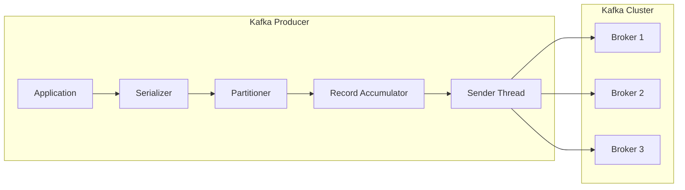
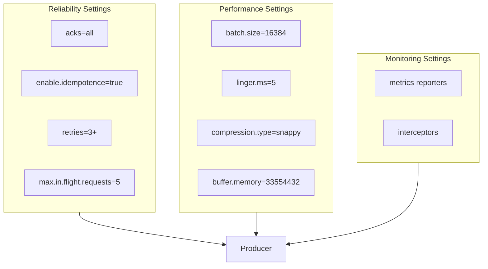
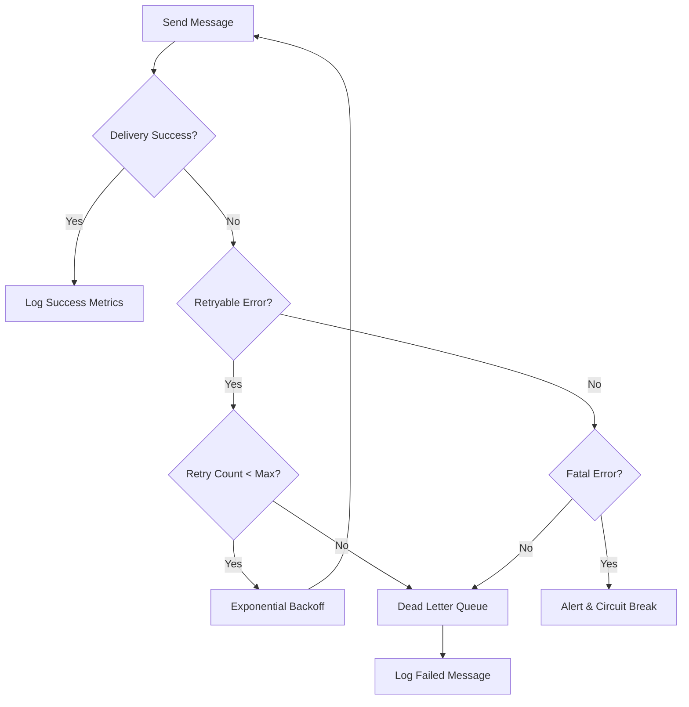
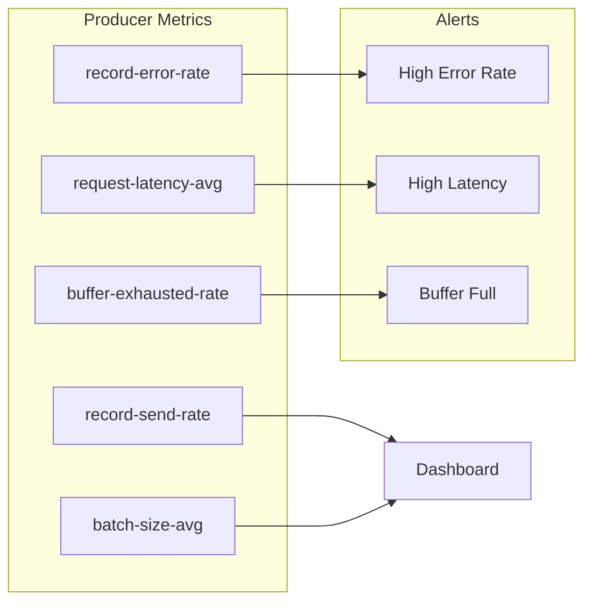

# How to Build Kafka Producers in Various Languages

Author: [nawazdhandala](https://github.com/nawazdhandala)

Tags: Kafka, Messaging, Java, Python, Node.js, Go, Distributed Systems

Description: Learn how to build Kafka producers in Java, Python, Node.js, and Go with practical code examples, configuration best practices, and production-ready patterns for reliable message delivery.

---

Apache Kafka has become the de facto standard for building event-driven architectures and real-time data pipelines. Producers are the entry point for data into Kafka, responsible for publishing messages to topics. Understanding how to build robust producers across different programming languages enables teams to integrate Kafka into polyglot microservices architectures.

## Kafka Producer Architecture

Before diving into code, understanding how Kafka producers work helps you make better configuration decisions.



The producer workflow follows these steps:

1. **Serialization**: Convert key and value objects to bytes
2. **Partitioning**: Determine which partition receives the message
3. **Batching**: Accumulate messages in memory for efficiency
4. **Sending**: Transmit batches to Kafka brokers asynchronously

## Java Producer

Java is the native language for Kafka, offering the most complete and well-tested client library. The official Apache Kafka client provides full access to all producer features.

### Dependencies

Add the Kafka client dependency to your Maven project. Match the version with your Kafka cluster version for compatibility.

```xml
<dependency>
    <groupId>org.apache.kafka</groupId>
    <artifactId>kafka-clients</artifactId>
    <version>3.6.1</version>
</dependency>
```

### Basic Producer

The following example demonstrates a complete producer setup with essential configurations. Each property affects reliability, performance, or both.

```java
import org.apache.kafka.clients.producer.*;
import org.apache.kafka.common.serialization.StringSerializer;

import java.util.Properties;
import java.util.concurrent.ExecutionException;

public class KafkaProducerExample {

    public static void main(String[] args) {
        // Configure producer properties
        Properties props = new Properties();

        // Bootstrap servers - initial connection points to the Kafka cluster
        // List multiple brokers for fault tolerance during initial connection
        props.put(ProducerConfig.BOOTSTRAP_SERVERS_CONFIG, "localhost:9092,localhost:9093");

        // Serializers convert Java objects to bytes for transmission
        // StringSerializer handles String keys and values
        props.put(ProducerConfig.KEY_SERIALIZER_CLASS_CONFIG, StringSerializer.class.getName());
        props.put(ProducerConfig.VALUE_SERIALIZER_CLASS_CONFIG, StringSerializer.class.getName());

        // acks controls durability guarantees:
        // "0" = fire and forget (fastest, least safe)
        // "1" = leader acknowledgment (balanced)
        // "all" = all in-sync replicas must acknowledge (safest)
        props.put(ProducerConfig.ACKS_CONFIG, "all");

        // Retries handle transient failures automatically
        // Combined with delivery.timeout.ms for overall send timeout
        props.put(ProducerConfig.RETRIES_CONFIG, 3);
        props.put(ProducerConfig.RETRY_BACKOFF_MS_CONFIG, 1000);

        // Idempotence prevents duplicate messages on retries
        // Requires acks=all and retries > 0
        props.put(ProducerConfig.ENABLE_IDEMPOTENCE_CONFIG, true);

        // Batching improves throughput by sending multiple messages together
        // linger.ms adds artificial delay to allow batch accumulation
        props.put(ProducerConfig.BATCH_SIZE_CONFIG, 16384);  // 16KB batches
        props.put(ProducerConfig.LINGER_MS_CONFIG, 5);       // Wait up to 5ms

        // Compression reduces network bandwidth and storage
        // Options: none, gzip, snappy, lz4, zstd
        props.put(ProducerConfig.COMPRESSION_TYPE_CONFIG, "snappy");

        // Create the producer instance
        try (KafkaProducer<String, String> producer = new KafkaProducer<>(props)) {

            // Create a record with topic, key, and value
            // Keys determine partition assignment - same key always goes to same partition
            ProducerRecord<String, String> record = new ProducerRecord<>(
                "orders",           // topic name
                "order-123",        // message key
                "{\"item\": \"laptop\", \"quantity\": 1}"  // message value
            );

            // Asynchronous send with callback for result handling
            producer.send(record, (metadata, exception) -> {
                if (exception != null) {
                    // Handle send failure - log, retry, or alert
                    System.err.println("Failed to send: " + exception.getMessage());
                } else {
                    // Success - metadata contains partition and offset info
                    System.out.printf("Sent to partition %d at offset %d%n",
                        metadata.partition(), metadata.offset());
                }
            });

            // Ensure all buffered messages are sent before closing
            producer.flush();

        }  // Producer automatically closes here due to try-with-resources
    }
}
```

### Synchronous vs Asynchronous Sending

Choose the sending pattern based on your requirements for throughput versus confirmation.

```java
// Synchronous send - blocks until broker confirms receipt
// Use when you need immediate confirmation or ordering guarantees
public void sendSync(KafkaProducer<String, String> producer, String topic, String key, String value)
        throws ExecutionException, InterruptedException {

    ProducerRecord<String, String> record = new ProducerRecord<>(topic, key, value);

    // get() blocks until send completes or fails
    RecordMetadata metadata = producer.send(record).get();

    System.out.printf("Sync send complete: topic=%s, partition=%d, offset=%d%n",
        metadata.topic(), metadata.partition(), metadata.offset());
}

// Asynchronous send - returns immediately, processes result in callback
// Use for high throughput when you can handle failures asynchronously
public void sendAsync(KafkaProducer<String, String> producer, String topic, String key, String value) {

    ProducerRecord<String, String> record = new ProducerRecord<>(topic, key, value);

    producer.send(record, (metadata, exception) -> {
        if (exception != null) {
            // Log failure and potentially add to retry queue
            handleSendFailure(key, value, exception);
        } else {
            System.out.printf("Async send complete: partition=%d, offset=%d%n",
                metadata.partition(), metadata.offset());
        }
    });
}

private void handleSendFailure(String key, String value, Exception exception) {
    // Implement your failure handling strategy:
    // - Log for manual investigation
    // - Add to dead letter queue
    // - Retry with exponential backoff
    System.err.println("Send failed for key " + key + ": " + exception.getMessage());
}
```

### Custom Partitioner

Implement a custom partitioner when you need control over message distribution beyond the default key-based hashing.

```java
import org.apache.kafka.clients.producer.Partitioner;
import org.apache.kafka.common.Cluster;
import org.apache.kafka.common.PartitionInfo;

import java.util.List;
import java.util.Map;

// Custom partitioner routes messages based on business logic
// Example: Route premium customers to dedicated partitions for priority processing
public class PriorityPartitioner implements Partitioner {

    @Override
    public int partition(String topic, Object key, byte[] keyBytes,
                         Object value, byte[] valueBytes, Cluster cluster) {

        List<PartitionInfo> partitions = cluster.partitionsForTopic(topic);
        int numPartitions = partitions.size();

        // Reserve first partition for premium messages
        if (key != null && key.toString().startsWith("premium-")) {
            return 0;  // Always route to partition 0
        }

        // Distribute other messages across remaining partitions
        if (keyBytes == null) {
            // No key - round robin among non-premium partitions
            return 1 + (int)(Math.random() * (numPartitions - 1));
        }

        // Hash key to partition (excluding partition 0)
        int hash = Math.abs(key.hashCode());
        return 1 + (hash % (numPartitions - 1));
    }

    @Override
    public void close() {
        // Clean up resources if needed
    }

    @Override
    public void configure(Map<String, ?> configs) {
        // Read configuration if needed
    }
}

// Register the custom partitioner in producer config
// props.put(ProducerConfig.PARTITIONER_CLASS_CONFIG, PriorityPartitioner.class.getName());
```

## Python Producer

Python producers use the confluent-kafka library, which wraps the high-performance librdkafka C library. Performance is comparable to Java while providing Pythonic APIs.

### Installation

Install the confluent-kafka package. The library includes pre-built binaries for common platforms.

```bash
pip install confluent-kafka
```

### Basic Producer

The Python producer follows similar patterns to Java but with Python idioms. The producer handles batching and compression internally.

```python
from confluent_kafka import Producer
import json
import socket

# Configuration dictionary for the producer
# Keys match the librdkafka configuration options
config = {
    # Bootstrap servers for initial cluster connection
    'bootstrap.servers': 'localhost:9092,localhost:9093',

    # Client ID helps identify this producer in broker logs
    'client.id': socket.gethostname(),

    # Acknowledgment level for durability
    # -1 (all), 0 (none), 1 (leader only)
    'acks': 'all',

    # Retry configuration for transient failures
    'retries': 3,
    'retry.backoff.ms': 1000,

    # Enable idempotent producer to prevent duplicates
    'enable.idempotence': True,

    # Batching settings for throughput optimization
    'batch.size': 16384,      # Max batch size in bytes
    'linger.ms': 5,           # Time to wait for batch accumulation

    # Compression reduces network and storage usage
    'compression.type': 'snappy',

    # Queue limits prevent memory exhaustion
    'queue.buffering.max.messages': 100000,
    'queue.buffering.max.kbytes': 1048576,  # 1GB
}

# Create producer instance
producer = Producer(config)


def delivery_callback(err, msg):
    """
    Callback invoked when message delivery succeeds or fails.
    Called from poll() or flush() - not from produce() directly.
    """
    if err is not None:
        # Delivery failed - handle the error
        print(f'Message delivery failed: {err}')
        # Consider adding to a retry queue or dead letter topic
    else:
        # Delivery succeeded
        print(f'Message delivered to {msg.topic()} [{msg.partition()}] at offset {msg.offset()}')


def send_message(topic: str, key: str, value: dict):
    """
    Send a message to Kafka with proper error handling.

    Args:
        topic: Target Kafka topic
        key: Message key for partitioning
        value: Message payload as dictionary
    """
    try:
        # Serialize the value to JSON bytes
        value_bytes = json.dumps(value).encode('utf-8')
        key_bytes = key.encode('utf-8') if key else None

        # produce() is asynchronous - message goes to internal queue
        # Callback fires when broker acknowledges (or rejects) the message
        producer.produce(
            topic=topic,
            key=key_bytes,
            value=value_bytes,
            callback=delivery_callback
        )

        # poll() triggers delivery callbacks for completed sends
        # Call regularly to handle callbacks and free memory
        # 0 means non-blocking - return immediately
        producer.poll(0)

    except BufferError:
        # Internal queue is full - back off and retry
        print('Producer queue is full, waiting...')
        producer.poll(1)  # Wait up to 1 second for queue space
        # Retry the send
        send_message(topic, key, value)


def send_batch(topic: str, messages: list):
    """
    Send multiple messages efficiently with batch processing.

    Args:
        topic: Target Kafka topic
        messages: List of (key, value) tuples
    """
    for key, value in messages:
        send_message(topic, key, value)

    # Flush ensures all queued messages are sent
    # Blocks until all messages are delivered or timeout
    remaining = producer.flush(timeout=30)

    if remaining > 0:
        print(f'Warning: {remaining} messages were not delivered')


# Example usage
if __name__ == '__main__':
    # Single message
    order = {
        'order_id': 'ORD-001',
        'customer': 'john@example.com',
        'items': [{'sku': 'LAPTOP-001', 'quantity': 1}],
        'total': 999.99
    }
    send_message('orders', 'ORD-001', order)

    # Batch of messages
    events = [
        ('user-123', {'event': 'login', 'timestamp': '2024-01-15T10:30:00Z'}),
        ('user-456', {'event': 'purchase', 'timestamp': '2024-01-15T10:31:00Z'}),
        ('user-123', {'event': 'logout', 'timestamp': '2024-01-15T11:00:00Z'}),
    ]
    send_batch('user-events', events)

    # Clean shutdown
    producer.flush()
```

### Avro Serialization

For schema evolution and data governance, use Avro serialization with Schema Registry integration.

```python
from confluent_kafka import Producer
from confluent_kafka.serialization import StringSerializer, SerializationContext, MessageField
from confluent_kafka.schema_registry import SchemaRegistryClient
from confluent_kafka.schema_registry.avro import AvroSerializer

# Schema Registry configuration
schema_registry_conf = {
    'url': 'http://localhost:8081',
    # Add authentication if required
    # 'basic.auth.user.info': 'user:password'
}

schema_registry_client = SchemaRegistryClient(schema_registry_conf)

# Define Avro schema for order events
order_schema_str = """
{
    "type": "record",
    "name": "Order",
    "namespace": "com.example.orders",
    "fields": [
        {"name": "order_id", "type": "string"},
        {"name": "customer_email", "type": "string"},
        {"name": "total_amount", "type": "double"},
        {"name": "created_at", "type": "string"}
    ]
}
"""


class Order:
    """Order class matching the Avro schema."""
    def __init__(self, order_id: str, customer_email: str, total_amount: float, created_at: str):
        self.order_id = order_id
        self.customer_email = customer_email
        self.total_amount = total_amount
        self.created_at = created_at


def order_to_dict(order: Order, ctx: SerializationContext) -> dict:
    """Convert Order object to dictionary for Avro serialization."""
    return {
        'order_id': order.order_id,
        'customer_email': order.customer_email,
        'total_amount': order.total_amount,
        'created_at': order.created_at
    }


# Create serializers
key_serializer = StringSerializer('utf_8')
value_serializer = AvroSerializer(
    schema_registry_client,
    order_schema_str,
    order_to_dict
)

# Producer configuration
producer_conf = {
    'bootstrap.servers': 'localhost:9092',
    'acks': 'all',
    'enable.idempotence': True,
}

producer = Producer(producer_conf)


def send_order(order: Order):
    """Send an order with Avro serialization."""
    topic = 'orders-avro'

    producer.produce(
        topic=topic,
        key=key_serializer(order.order_id),
        value=value_serializer(order, SerializationContext(topic, MessageField.VALUE)),
        callback=lambda err, msg: print(f'Delivered: {msg.offset()}' if not err else f'Error: {err}')
    )
    producer.poll(0)


# Example usage
order = Order(
    order_id='ORD-002',
    customer_email='jane@example.com',
    total_amount=1299.99,
    created_at='2024-01-15T14:30:00Z'
)
send_order(order)
producer.flush()
```

## Node.js Producer

KafkaJS is the most popular pure JavaScript Kafka client. Being native JavaScript means no native dependencies to compile, making it ideal for containerized deployments.

### Installation

Install KafkaJS from npm. No native compilation required.

```bash
npm install kafkajs
```

### Basic Producer

KafkaJS uses modern async/await patterns throughout. The producer manages connections and batching automatically.

```javascript
const { Kafka, CompressionTypes, logLevel } = require('kafkajs');

// Create Kafka client instance
// The client manages connections to the cluster
const kafka = new Kafka({
    // Client identifier for logging and monitoring
    clientId: 'order-service',

    // Broker addresses for initial connection
    // KafkaJS discovers other brokers automatically
    brokers: ['localhost:9092', 'localhost:9093'],

    // Connection timeout settings
    connectionTimeout: 10000,  // 10 seconds to establish connection
    requestTimeout: 30000,     // 30 seconds for requests

    // Retry configuration for transient failures
    retry: {
        initialRetryTime: 100,    // Start with 100ms delay
        retries: 8,               // Max retry attempts
        maxRetryTime: 30000,      // Cap delay at 30 seconds
        factor: 2,                // Exponential backoff multiplier
    },

    // Log level for debugging
    logLevel: logLevel.INFO,
});

// Create producer instance from the Kafka client
const producer = kafka.producer({
    // Allow sending to non-existent topics (creates them if auto.create.topics.enable=true)
    allowAutoTopicCreation: false,

    // Transaction configuration (optional)
    // transactionalId: 'order-producer-1',
    // idempotent: true,

    // Max time to wait for in-flight requests during close
    maxInFlightRequests: 5,
});

/**
 * Initialize the producer connection.
 * Must be called before sending messages.
 */
async function initProducer() {
    try {
        await producer.connect();
        console.log('Producer connected to Kafka');
    } catch (error) {
        console.error('Failed to connect producer:', error);
        throw error;
    }
}

/**
 * Send a single message to a Kafka topic.
 *
 * @param {string} topic - Target topic name
 * @param {string} key - Message key for partitioning
 * @param {object} value - Message payload
 * @returns {Promise<RecordMetadata[]>} - Metadata for sent messages
 */
async function sendMessage(topic, key, value) {
    try {
        const result = await producer.send({
            topic,
            // Compression reduces message size - snappy offers good balance
            compression: CompressionTypes.Snappy,
            // Messages array allows batching multiple messages in one call
            messages: [
                {
                    // Key determines partition assignment
                    key: key,
                    // Value must be string or Buffer
                    value: JSON.stringify(value),
                    // Optional headers for metadata
                    headers: {
                        'correlation-id': `${Date.now()}`,
                        'source': 'order-service',
                    },
                },
            ],
        });

        console.log('Message sent:', result);
        return result;
    } catch (error) {
        console.error('Failed to send message:', error);
        throw error;
    }
}

/**
 * Send multiple messages efficiently in a batch.
 * All messages go in a single request for better throughput.
 *
 * @param {string} topic - Target topic name
 * @param {Array<{key: string, value: object}>} messages - Array of messages
 */
async function sendBatch(topic, messages) {
    try {
        const kafkaMessages = messages.map(({ key, value }) => ({
            key,
            value: JSON.stringify(value),
            headers: {
                'batch-id': `batch-${Date.now()}`,
            },
        }));

        const result = await producer.send({
            topic,
            compression: CompressionTypes.Snappy,
            messages: kafkaMessages,
        });

        console.log(`Batch of ${messages.length} messages sent`);
        return result;
    } catch (error) {
        console.error('Failed to send batch:', error);
        throw error;
    }
}

/**
 * Send messages to multiple topics in one request.
 * Useful for event fan-out scenarios.
 *
 * @param {Array<{topic: string, messages: Array}>} topicMessages - Messages grouped by topic
 */
async function sendToMultipleTopics(topicMessages) {
    try {
        const result = await producer.sendBatch({
            topicMessages: topicMessages.map(({ topic, messages }) => ({
                topic,
                messages: messages.map(({ key, value }) => ({
                    key,
                    value: JSON.stringify(value),
                })),
            })),
            compression: CompressionTypes.Snappy,
        });

        console.log('Multi-topic batch sent');
        return result;
    } catch (error) {
        console.error('Failed to send multi-topic batch:', error);
        throw error;
    }
}

/**
 * Gracefully disconnect the producer.
 * Waits for pending messages before closing.
 */
async function disconnectProducer() {
    try {
        await producer.disconnect();
        console.log('Producer disconnected');
    } catch (error) {
        console.error('Error disconnecting producer:', error);
    }
}

// Handle process termination gracefully
process.on('SIGINT', async () => {
    console.log('Shutting down...');
    await disconnectProducer();
    process.exit(0);
});

// Example usage
async function main() {
    await initProducer();

    // Send single message
    await sendMessage('orders', 'order-123', {
        orderId: 'order-123',
        customer: 'alice@example.com',
        items: [{ sku: 'PHONE-001', quantity: 2 }],
        total: 1999.98,
    });

    // Send batch
    const events = [
        { key: 'user-1', value: { event: 'page_view', page: '/products' } },
        { key: 'user-2', value: { event: 'add_to_cart', product: 'LAPTOP-001' } },
        { key: 'user-1', value: { event: 'checkout_started' } },
    ];
    await sendBatch('analytics', events);

    await disconnectProducer();
}

main().catch(console.error);
```

### TypeScript Producer with Schema Validation

Add type safety with TypeScript and runtime validation with a schema library.

```typescript
import { Kafka, Producer, RecordMetadata, CompressionTypes } from 'kafkajs';
import { z } from 'zod';

// Define message schemas using Zod for runtime validation
const OrderSchema = z.object({
    orderId: z.string().min(1),
    customerId: z.string().uuid(),
    items: z.array(z.object({
        sku: z.string(),
        quantity: z.number().positive(),
        price: z.number().positive(),
    })).min(1),
    totalAmount: z.number().positive(),
    createdAt: z.string().datetime(),
});

type Order = z.infer<typeof OrderSchema>;

// Generic Kafka producer wrapper with type safety
class TypedKafkaProducer<T> {
    private producer: Producer;
    private topic: string;
    private schema: z.ZodType<T>;

    constructor(
        kafka: Kafka,
        topic: string,
        schema: z.ZodType<T>
    ) {
        this.producer = kafka.producer({
            allowAutoTopicCreation: false,
            maxInFlightRequests: 5,
        });
        this.topic = topic;
        this.schema = schema;
    }

    async connect(): Promise<void> {
        await this.producer.connect();
    }

    async disconnect(): Promise<void> {
        await this.producer.disconnect();
    }

    /**
     * Send a validated message to Kafka.
     * Throws if message fails schema validation.
     */
    async send(key: string, value: T): Promise<RecordMetadata[]> {
        // Validate message against schema
        const validated = this.schema.parse(value);

        return this.producer.send({
            topic: this.topic,
            compression: CompressionTypes.Snappy,
            messages: [{
                key,
                value: JSON.stringify(validated),
                timestamp: Date.now().toString(),
            }],
        });
    }

    /**
     * Send multiple validated messages.
     * Fails fast if any message is invalid.
     */
    async sendBatch(messages: Array<{ key: string; value: T }>): Promise<RecordMetadata[]> {
        // Validate all messages first
        const validated = messages.map(({ key, value }) => ({
            key,
            value: JSON.stringify(this.schema.parse(value)),
        }));

        return this.producer.send({
            topic: this.topic,
            compression: CompressionTypes.Snappy,
            messages: validated,
        });
    }
}

// Usage example
async function main() {
    const kafka = new Kafka({
        clientId: 'order-service',
        brokers: ['localhost:9092'],
    });

    const orderProducer = new TypedKafkaProducer(kafka, 'orders', OrderSchema);
    await orderProducer.connect();

    // Type-safe message sending
    const order: Order = {
        orderId: 'ORD-001',
        customerId: '550e8400-e29b-41d4-a716-446655440000',
        items: [
            { sku: 'LAPTOP-001', quantity: 1, price: 999.99 },
        ],
        totalAmount: 999.99,
        createdAt: new Date().toISOString(),
    };

    await orderProducer.send(order.orderId, order);
    await orderProducer.disconnect();
}

main().catch(console.error);
```

## Go Producer

Go's confluent-kafka-go library provides excellent performance with a clean API. The library wraps librdkafka, delivering native-level throughput.

### Installation

Install the confluent-kafka-go package. Requires librdkafka to be installed on the system or uses the bundled version.

```bash
go get github.com/confluentinc/confluent-kafka-go/v2/kafka
```

### Basic Producer

Go's producer uses channels for event delivery, fitting naturally with Go's concurrency model.

```go
package main

import (
	"encoding/json"
	"fmt"
	"os"
	"os/signal"
	"syscall"

	"github.com/confluentinc/confluent-kafka-go/v2/kafka"
)

// Order represents an order event
type Order struct {
	OrderID     string  `json:"order_id"`
	CustomerID  string  `json:"customer_id"`
	TotalAmount float64 `json:"total_amount"`
	CreatedAt   string  `json:"created_at"`
}

func main() {
	// Producer configuration
	// See https://github.com/confluentinc/librdkafka/blob/master/CONFIGURATION.md
	config := &kafka.ConfigMap{
		// Broker connection
		"bootstrap.servers": "localhost:9092,localhost:9093",

		// Client identification
		"client.id": "order-service-go",

		// Acknowledgment level: all, -1, 0, 1
		// "all" waits for all in-sync replicas
		"acks": "all",

		// Idempotent producer prevents duplicates on retry
		"enable.idempotence": true,

		// Retry configuration
		"retries":          3,
		"retry.backoff.ms": 1000,

		// Batching for throughput
		"batch.size":   16384,
		"linger.ms":    5,

		// Compression
		"compression.type": "snappy",

		// Request timeout
		"request.timeout.ms": 30000,
	}

	// Create producer
	producer, err := kafka.NewProducer(config)
	if err != nil {
		fmt.Printf("Failed to create producer: %s\n", err)
		os.Exit(1)
	}
	defer producer.Close()

	// Handle delivery reports in a separate goroutine
	// This is required to receive acknowledgments from brokers
	go func() {
		for event := range producer.Events() {
			switch ev := event.(type) {
			case *kafka.Message:
				if ev.TopicPartition.Error != nil {
					// Delivery failed
					fmt.Printf("Delivery failed: %v\n", ev.TopicPartition.Error)
				} else {
					// Delivery succeeded
					fmt.Printf("Delivered to %s [%d] at offset %v\n",
						*ev.TopicPartition.Topic,
						ev.TopicPartition.Partition,
						ev.TopicPartition.Offset)
				}
			case kafka.Error:
				// Kafka error (connection issues, etc.)
				fmt.Printf("Kafka error: %v\n", ev)
			}
		}
	}()

	// Create and send an order
	order := Order{
		OrderID:     "ORD-001",
		CustomerID:  "CUST-123",
		TotalAmount: 999.99,
		CreatedAt:   "2024-01-15T10:30:00Z",
	}

	err = sendOrder(producer, "orders", order)
	if err != nil {
		fmt.Printf("Failed to send order: %s\n", err)
	}

	// Handle graceful shutdown
	sigchan := make(chan os.Signal, 1)
	signal.Notify(sigchan, syscall.SIGINT, syscall.SIGTERM)

	select {
	case sig := <-sigchan:
		fmt.Printf("Caught signal %v: terminating\n", sig)
	}

	// Flush outstanding messages before exit
	// Parameter is timeout in milliseconds (-1 for infinite)
	remaining := producer.Flush(10000)
	if remaining > 0 {
		fmt.Printf("Warning: %d messages not delivered\n", remaining)
	}
}

// sendOrder serializes and sends an order to Kafka
func sendOrder(producer *kafka.Producer, topic string, order Order) error {
	// Serialize order to JSON
	value, err := json.Marshal(order)
	if err != nil {
		return fmt.Errorf("failed to serialize order: %w", err)
	}

	// Create the message
	message := &kafka.Message{
		TopicPartition: kafka.TopicPartition{
			Topic:     &topic,
			Partition: kafka.PartitionAny, // Let Kafka choose partition
		},
		Key:   []byte(order.OrderID),  // Use order ID as key
		Value: value,
		Headers: []kafka.Header{
			{Key: "source", Value: []byte("order-service")},
			{Key: "version", Value: []byte("1.0")},
		},
	}

	// Produce is asynchronous - returns immediately
	// Delivery report comes via Events channel
	err = producer.Produce(message, nil)
	if err != nil {
		return fmt.Errorf("failed to produce message: %w", err)
	}

	return nil
}
```

### Synchronous Producer with Context

For scenarios requiring immediate confirmation, use a synchronous wrapper with context support for timeouts and cancellation.

```go
package main

import (
	"context"
	"encoding/json"
	"fmt"
	"time"

	"github.com/confluentinc/confluent-kafka-go/v2/kafka"
)

// SyncProducer wraps Kafka producer with synchronous send capability
type SyncProducer struct {
	producer *kafka.Producer
}

// NewSyncProducer creates a new synchronous producer
func NewSyncProducer(brokers string) (*SyncProducer, error) {
	producer, err := kafka.NewProducer(&kafka.ConfigMap{
		"bootstrap.servers":   brokers,
		"acks":                "all",
		"enable.idempotence":  true,
		"retries":             3,
		"request.timeout.ms":  30000,
		"delivery.timeout.ms": 120000,
	})
	if err != nil {
		return nil, err
	}

	return &SyncProducer{producer: producer}, nil
}

// SendSync sends a message and waits for delivery confirmation
// Returns error if delivery fails or context is cancelled
func (p *SyncProducer) SendSync(ctx context.Context, topic string, key string, value interface{}) error {
	// Serialize value
	data, err := json.Marshal(value)
	if err != nil {
		return fmt.Errorf("serialization error: %w", err)
	}

	// Create delivery channel for this message
	deliveryChan := make(chan kafka.Event, 1)

	// Produce with delivery channel
	err = p.producer.Produce(&kafka.Message{
		TopicPartition: kafka.TopicPartition{
			Topic:     &topic,
			Partition: kafka.PartitionAny,
		},
		Key:   []byte(key),
		Value: data,
	}, deliveryChan)

	if err != nil {
		return fmt.Errorf("produce error: %w", err)
	}

	// Wait for delivery or context cancellation
	select {
	case <-ctx.Done():
		return ctx.Err()
	case event := <-deliveryChan:
		msg := event.(*kafka.Message)
		if msg.TopicPartition.Error != nil {
			return fmt.Errorf("delivery failed: %w", msg.TopicPartition.Error)
		}
		fmt.Printf("Delivered to partition %d at offset %v\n",
			msg.TopicPartition.Partition,
			msg.TopicPartition.Offset)
		return nil
	}
}

// Close flushes pending messages and closes the producer
func (p *SyncProducer) Close() {
	p.producer.Flush(15 * 1000) // 15 second timeout
	p.producer.Close()
}

func main() {
	producer, err := NewSyncProducer("localhost:9092")
	if err != nil {
		panic(err)
	}
	defer producer.Close()

	// Create context with timeout
	ctx, cancel := context.WithTimeout(context.Background(), 10*time.Second)
	defer cancel()

	order := map[string]interface{}{
		"order_id": "ORD-002",
		"amount":   199.99,
	}

	err = producer.SendSync(ctx, "orders", "ORD-002", order)
	if err != nil {
		fmt.Printf("Send failed: %v\n", err)
		return
	}

	fmt.Println("Order sent successfully")
}
```

## Producer Configuration Best Practices

Configuration significantly impacts reliability and performance. The following diagram shows key configuration categories.



### Configuration Recommendations by Use Case

| Use Case | acks | Idempotence | Batch Size | Compression |
|----------|------|-------------|------------|-------------|
| Financial transactions | all | true | 1KB | none |
| Log aggregation | 1 | false | 64KB | lz4 |
| Metrics collection | 0 | false | 32KB | snappy |
| Event sourcing | all | true | 16KB | zstd |

## Error Handling Patterns

Robust error handling prevents data loss and provides observability into producer health.



### Common Error Types

Understanding error categories helps implement appropriate handling strategies.

| Error Type | Retryable | Action |
|------------|-----------|--------|
| Network timeout | Yes | Retry with backoff |
| Leader not available | Yes | Retry after brief wait |
| Message too large | No | Dead letter or split |
| Authorization failure | No | Alert, check credentials |
| Invalid topic | No | Alert, check configuration |

## Monitoring and Observability

Track producer health with these key metrics.



### Key Metrics to Monitor

- **record-send-rate**: Messages sent per second
- **record-error-rate**: Failed sends per second
- **request-latency-avg**: Average time for broker acknowledgment
- **batch-size-avg**: Average batch size in bytes
- **buffer-available-bytes**: Available buffer memory
- **waiting-threads**: Threads waiting for buffer space

## Summary

Building Kafka producers across languages follows similar patterns with language-specific idioms:

| Language | Library | Key Features |
|----------|---------|--------------|
| Java | kafka-clients | Native, full feature set |
| Python | confluent-kafka | librdkafka performance |
| Node.js | KafkaJS | Pure JS, no native deps |
| Go | confluent-kafka-go | librdkafka with Go idioms |

Regardless of language, focus on:

1. **Reliability**: Use acks=all and enable idempotence for important data
2. **Performance**: Configure batching and compression appropriately
3. **Error handling**: Implement retries and dead letter patterns
4. **Monitoring**: Track delivery rates and latencies

These patterns ensure your Kafka producers reliably handle real-world production workloads across any technology stack.
