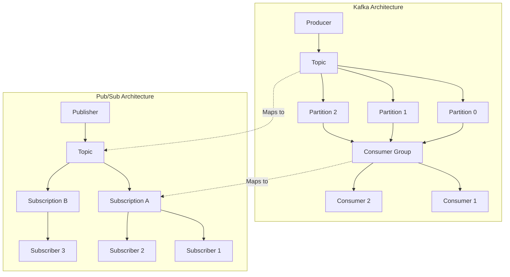
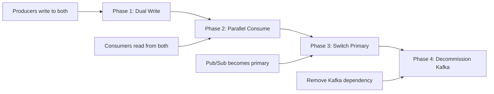
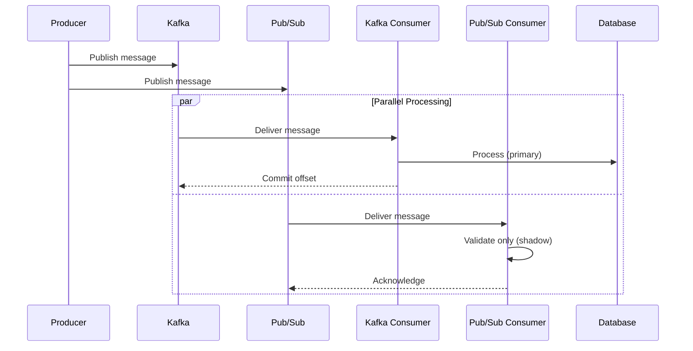
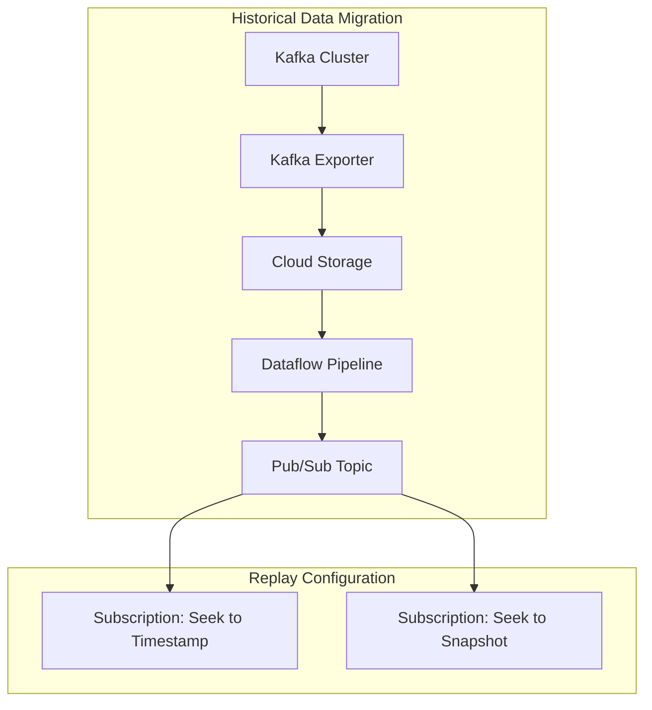
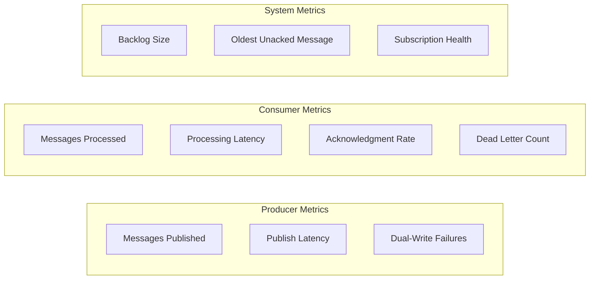
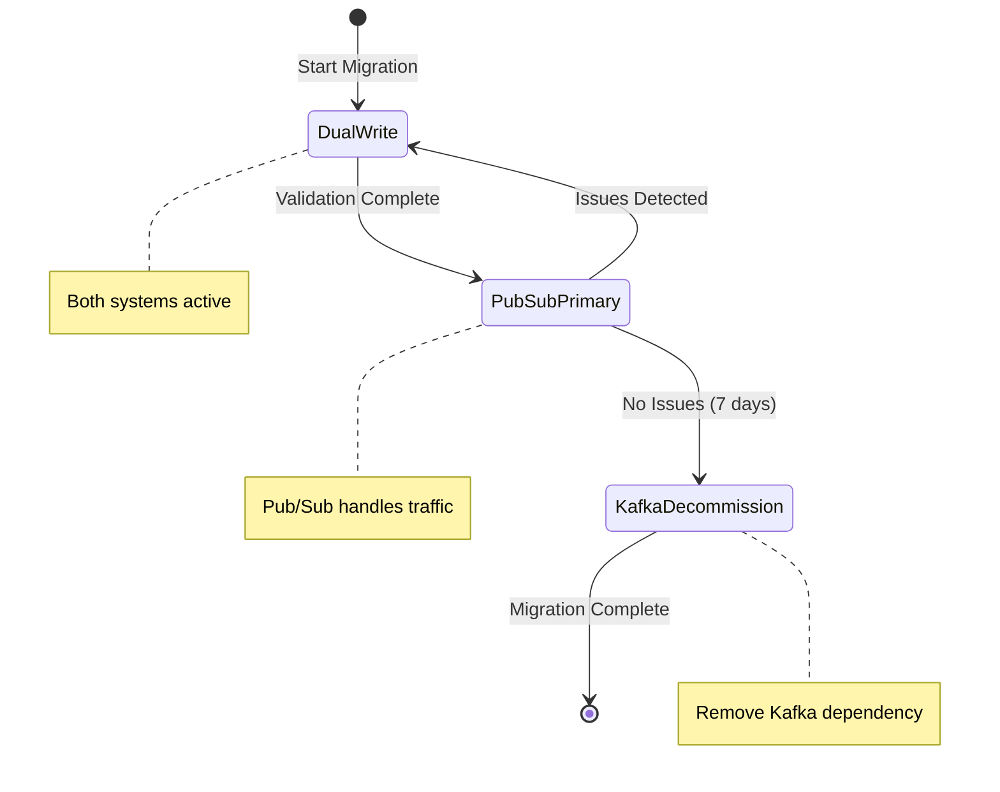

# How to Migrate from Kafka to Pub/Sub

Author: [nawazdhandala](https://github.com/nawazdhandala)

Tags: Kafka, Google Cloud, Pub/Sub, Migration, Messaging, Event-Driven

Description: Learn how to migrate your messaging infrastructure from Apache Kafka to Google Cloud Pub/Sub, including architecture mapping, code migration patterns, and production deployment strategies.

---

Apache Kafka has served as the backbone of event-driven architectures for many organizations. However, as teams move to Google Cloud Platform, migrating to Pub/Sub offers significant operational benefits - no cluster management, automatic scaling, and native GCP integration. The migration journey requires careful planning, understanding of architectural differences, and a phased approach to minimize disruption.

## Understanding the Key Differences

Before diving into migration, understanding the fundamental differences between Kafka and Pub/Sub helps avoid common pitfalls.

| Feature | Apache Kafka | Google Cloud Pub/Sub |
|---------|--------------|---------------------|
| Deployment | Self-managed clusters | Fully managed service |
| Message Ordering | Partition-level ordering | Per-key ordering (optional) |
| Retention | Configurable (default 7 days) | 31 days maximum |
| Consumer Model | Pull-based with offsets | Push or Pull subscriptions |
| Partitioning | Manual partition management | Automatic scaling |
| Message Replay | Seek to offset | Seek to timestamp |
| Schema Registry | Confluent Schema Registry | Pub/Sub Schemas |
| Dead Letter Handling | Manual implementation | Built-in dead letter topics |

## Architecture Mapping

The following diagram shows how Kafka concepts map to Pub/Sub equivalents.



Key mapping concepts:

- **Kafka Topics** map directly to **Pub/Sub Topics**
- **Kafka Consumer Groups** map to **Pub/Sub Subscriptions**
- **Kafka Partitions** are abstracted away - Pub/Sub handles scaling automatically
- **Kafka Offsets** are replaced by **Pub/Sub message acknowledgment**

## Migration Strategy Overview

A successful migration follows a phased approach to minimize risk and allow validation at each step.



## Phase 1: Setting Up Pub/Sub Infrastructure

### Creating Topics and Subscriptions

Start by creating the Pub/Sub infrastructure that mirrors your Kafka topology. The following Terraform configuration creates a topic with multiple subscriptions, dead letter handling, and message retention.

```hcl
# main.tf - Pub/Sub infrastructure for migrated Kafka topics

# Define the project and region variables
variable "project_id" {
  description = "GCP project ID"
  type        = string
}

variable "region" {
  description = "GCP region for resources"
  type        = string
  default     = "us-central1"
}

# Create the main topic that replaces the Kafka topic
# Message retention is set to maximum 31 days for replay capability
resource "google_pubsub_topic" "orders" {
  name    = "orders"
  project = var.project_id

  # Enable message ordering for consumers that need it
  # Messages with the same ordering key will be delivered in order
  message_retention_duration = "2678400s" # 31 days in seconds

  # Schema enforcement ensures message format consistency
  schema_settings {
    schema   = google_pubsub_schema.orders_schema.id
    encoding = "JSON"
  }
}

# Define the message schema - similar to Kafka Schema Registry
resource "google_pubsub_schema" "orders_schema" {
  name       = "orders-schema"
  project    = var.project_id
  type       = "AVRO"
  definition = jsonencode({
    type = "record"
    name = "Order"
    fields = [
      { name = "order_id", type = "string" },
      { name = "customer_id", type = "string" },
      { name = "amount", type = "double" },
      { name = "timestamp", type = "long" }
    ]
  })
}

# Dead letter topic for messages that fail processing
# Equivalent to implementing DLQ pattern manually in Kafka
resource "google_pubsub_topic" "orders_dlq" {
  name    = "orders-dlq"
  project = var.project_id
}

# Main subscription - replaces Kafka consumer group
# Includes dead letter policy and retry configuration
resource "google_pubsub_subscription" "orders_processor" {
  name    = "orders-processor"
  topic   = google_pubsub_topic.orders.name
  project = var.project_id

  # Acknowledgement deadline - how long subscriber has to ack
  # Similar to Kafka's max.poll.interval.ms
  ack_deadline_seconds = 60

  # Enable message ordering for ordered processing
  # Requires ordering key to be set on messages
  enable_message_ordering = true

  # Retry policy for failed messages
  retry_policy {
    minimum_backoff = "10s"
    maximum_backoff = "600s"
  }

  # Dead letter policy - messages go to DLQ after 5 failed attempts
  dead_letter_policy {
    dead_letter_topic     = google_pubsub_topic.orders_dlq.id
    max_delivery_attempts = 5
  }

  # Message retention for replay - similar to Kafka retention
  message_retention_duration = "1209600s" # 14 days

  # Retain acked messages for seek/replay capability
  retain_acked_messages = true

  # Expiration policy - subscription auto-deletes if inactive
  # Set to never expire for production subscriptions
  expiration_policy {
    ttl = "" # Never expire
  }
}

# Analytics subscription - separate consumer group in Kafka terms
# Multiple subscriptions allow fan-out pattern
resource "google_pubsub_subscription" "orders_analytics" {
  name    = "orders-analytics"
  topic   = google_pubsub_topic.orders.name
  project = var.project_id

  ack_deadline_seconds = 120

  # Push delivery to Cloud Run service
  push_config {
    push_endpoint = "https://analytics-service-xyz.run.app/webhook"

    oidc_token {
      service_account_email = google_service_account.pubsub_invoker.email
    }
  }
}
```

## Phase 2: Implementing the Dual-Write Producer

During migration, producers must write to both Kafka and Pub/Sub simultaneously. The following wrapper ensures messages reach both systems reliably.

### Python Dual-Write Producer

The dual-write producer sends messages to both Kafka and Pub/Sub, with configurable failure handling. Primary system failure can either block the message or log and continue.

```python
# dual_write_producer.py
import json
import logging
from concurrent import futures
from typing import Optional, Dict, Any, Callable
from dataclasses import dataclass
from enum import Enum

from kafka import KafkaProducer
from google.cloud import pubsub_v1
from google.api_core import retry

logging.basicConfig(level=logging.INFO)
logger = logging.getLogger(__name__)


class FailureMode(Enum):
    """Defines behavior when one system fails during dual-write."""
    FAIL_FAST = "fail_fast"      # Raise exception if either system fails
    LOG_AND_CONTINUE = "log"     # Log error but continue if secondary fails
    RETRY_ASYNC = "retry_async"  # Queue for async retry on failure


@dataclass
class DualWriteConfig:
    """Configuration for dual-write producer."""
    kafka_bootstrap_servers: str
    pubsub_project_id: str
    failure_mode: FailureMode = FailureMode.LOG_AND_CONTINUE
    pubsub_timeout: float = 30.0
    kafka_timeout: float = 30.0


class DualWriteProducer:
    """
    Producer that writes messages to both Kafka and Pub/Sub.

    During migration, this ensures both systems receive all messages,
    allowing consumers to be migrated independently of producers.
    """

    def __init__(self, config: DualWriteConfig):
        self.config = config
        self._init_kafka_producer()
        self._init_pubsub_publisher()

        # Track pending Pub/Sub publishes for batching
        self._publish_futures: list = []

    def _init_kafka_producer(self) -> None:
        """Initialize Kafka producer with production settings."""
        self.kafka_producer = KafkaProducer(
            bootstrap_servers=self.config.kafka_bootstrap_servers,
            # Serialize messages as JSON - matches Pub/Sub format
            value_serializer=lambda v: json.dumps(v).encode('utf-8'),
            key_serializer=lambda k: k.encode('utf-8') if k else None,
            # Wait for all replicas to acknowledge
            acks='all',
            # Retry transient failures
            retries=3,
            # Enable idempotent producer to prevent duplicates
            enable_idempotence=True,
        )

    def _init_pubsub_publisher(self) -> None:
        """Initialize Pub/Sub publisher with batching settings."""
        # Configure batching for better throughput
        batch_settings = pubsub_v1.types.BatchSettings(
            max_messages=100,        # Batch up to 100 messages
            max_bytes=1024 * 1024,   # Or 1MB, whichever comes first
            max_latency=0.05,        # Flush every 50ms max
        )

        self.pubsub_publisher = pubsub_v1.PublisherClient(
            batch_settings=batch_settings
        )
        self.project_id = self.config.pubsub_project_id

    def _kafka_topic_to_pubsub(self, kafka_topic: str) -> str:
        """
        Map Kafka topic name to Pub/Sub topic path.

        Kafka topics use dots/underscores, Pub/Sub uses hyphens.
        Adjust mapping based on your naming conventions.
        """
        # Convert Kafka naming to Pub/Sub naming
        pubsub_topic_name = kafka_topic.replace('.', '-').replace('_', '-')
        return f"projects/{self.project_id}/topics/{pubsub_topic_name}"

    def _kafka_key_to_ordering_key(self, kafka_key: Optional[str]) -> str:
        """
        Convert Kafka partition key to Pub/Sub ordering key.

        In Kafka, keys determine partition assignment for ordering.
        In Pub/Sub, ordering keys serve the same purpose when
        message ordering is enabled on the subscription.
        """
        # Empty string means no ordering guarantee
        return kafka_key if kafka_key else ""

    def publish(
        self,
        topic: str,
        message: Dict[str, Any],
        key: Optional[str] = None,
        headers: Optional[Dict[str, str]] = None
    ) -> bool:
        """
        Publish message to both Kafka and Pub/Sub.

        Args:
            topic: Kafka topic name (will be mapped to Pub/Sub)
            message: Message payload as dictionary
            key: Partition/ordering key for ordered delivery
            headers: Message headers/attributes

        Returns:
            True if message was successfully sent to primary system
        """
        kafka_success = False
        pubsub_success = False

        # Attempt Kafka publish first (current primary)
        try:
            kafka_success = self._publish_to_kafka(topic, message, key, headers)
        except Exception as e:
            logger.error(f"Kafka publish failed: {e}")
            if self.config.failure_mode == FailureMode.FAIL_FAST:
                raise

        # Attempt Pub/Sub publish (future primary)
        try:
            pubsub_success = self._publish_to_pubsub(topic, message, key, headers)
        except Exception as e:
            logger.error(f"Pub/Sub publish failed: {e}")
            if self.config.failure_mode == FailureMode.FAIL_FAST:
                raise

        # Log discrepancies for monitoring
        if kafka_success != pubsub_success:
            logger.warning(
                f"Dual-write inconsistency: Kafka={kafka_success}, "
                f"Pub/Sub={pubsub_success}, topic={topic}"
            )

        return kafka_success  # Return primary system status

    def _publish_to_kafka(
        self,
        topic: str,
        message: Dict[str, Any],
        key: Optional[str],
        headers: Optional[Dict[str, str]]
    ) -> bool:
        """Send message to Kafka topic."""
        # Convert headers dict to Kafka header format
        kafka_headers = [
            (k, v.encode('utf-8'))
            for k, v in (headers or {}).items()
        ]

        # Send synchronously to ensure delivery before returning
        future = self.kafka_producer.send(
            topic=topic,
            value=message,
            key=key,
            headers=kafka_headers
        )

        # Block until message is acknowledged
        record_metadata = future.get(timeout=self.config.kafka_timeout)

        logger.debug(
            f"Kafka publish: topic={record_metadata.topic}, "
            f"partition={record_metadata.partition}, "
            f"offset={record_metadata.offset}"
        )

        return True

    def _publish_to_pubsub(
        self,
        topic: str,
        message: Dict[str, Any],
        key: Optional[str],
        headers: Optional[Dict[str, str]]
    ) -> bool:
        """Send message to Pub/Sub topic."""
        pubsub_topic = self._kafka_topic_to_pubsub(topic)

        # Pub/Sub message data must be bytes
        data = json.dumps(message).encode('utf-8')

        # Headers become Pub/Sub attributes
        # Add ordering key as attribute for traceability
        attributes = headers.copy() if headers else {}
        if key:
            attributes['ordering_key'] = key

        # Publish with ordering key for ordered subscriptions
        future = self.pubsub_publisher.publish(
            pubsub_topic,
            data=data,
            ordering_key=self._kafka_key_to_ordering_key(key),
            **attributes
        )

        # Store future for batch completion tracking
        self._publish_futures.append(future)

        # Wait for publish confirmation
        message_id = future.result(timeout=self.config.pubsub_timeout)

        logger.debug(f"Pub/Sub publish: topic={pubsub_topic}, message_id={message_id}")

        return True

    def flush(self) -> None:
        """Ensure all pending messages are sent to both systems."""
        # Flush Kafka producer
        self.kafka_producer.flush(timeout=self.config.kafka_timeout)

        # Wait for all Pub/Sub futures to complete
        if self._publish_futures:
            futures.wait(
                [f for f in self._publish_futures],
                timeout=self.config.pubsub_timeout
            )
            self._publish_futures.clear()

    def close(self) -> None:
        """Clean up resources."""
        self.flush()
        self.kafka_producer.close()
        # Pub/Sub publisher is thread-safe and managed by the library


# Usage example
if __name__ == "__main__":
    config = DualWriteConfig(
        kafka_bootstrap_servers="kafka1:9092,kafka2:9092,kafka3:9092",
        pubsub_project_id="my-gcp-project",
        failure_mode=FailureMode.LOG_AND_CONTINUE
    )

    producer = DualWriteProducer(config)

    # Publish order event to both systems
    order_event = {
        "order_id": "ord-12345",
        "customer_id": "cust-6789",
        "amount": 99.99,
        "timestamp": 1706832000
    }

    producer.publish(
        topic="orders",
        message=order_event,
        key="cust-6789",  # Orders for same customer stay ordered
        headers={"event_type": "order_created"}
    )

    producer.close()
```

## Phase 3: Migrating Consumers

Consumer migration requires careful handling of message processing semantics. The following diagram shows the parallel consumption phase where both systems are active.



### Python Pub/Sub Consumer

The consumer implementation handles message processing with proper acknowledgment, dead letter handling, and graceful shutdown.

```python
# pubsub_consumer.py
import json
import logging
import signal
import sys
from concurrent import futures
from typing import Callable, Dict, Any, Optional
from dataclasses import dataclass
from google.cloud import pubsub_v1
from google.api_core import retry

logging.basicConfig(level=logging.INFO)
logger = logging.getLogger(__name__)


@dataclass
class ConsumerConfig:
    """Configuration for Pub/Sub consumer."""
    project_id: str
    subscription_id: str
    max_messages: int = 100          # Max messages to pull at once
    ack_deadline: int = 60           # Seconds to process before redelivery
    flow_control_max: int = 1000     # Max outstanding messages
    num_workers: int = 4             # Parallel message processors


class PubSubConsumer:
    """
    Pub/Sub consumer that replaces Kafka consumer functionality.

    Key differences from Kafka consumer:
    - No partition assignment - Pub/Sub handles distribution
    - Explicit ack/nack instead of offset commits
    - Built-in dead letter handling
    - Automatic scaling based on backlog
    """

    def __init__(
        self,
        config: ConsumerConfig,
        message_handler: Callable[[Dict[str, Any]], bool]
    ):
        self.config = config
        self.message_handler = message_handler
        self._running = False
        self._streaming_pull_future = None

        # Initialize subscriber client
        self.subscriber = pubsub_v1.SubscriberClient()
        self.subscription_path = self.subscriber.subscription_path(
            config.project_id,
            config.subscription_id
        )

        # Set up graceful shutdown handlers
        signal.signal(signal.SIGTERM, self._handle_shutdown)
        signal.signal(signal.SIGINT, self._handle_shutdown)

    def _handle_shutdown(self, signum, frame) -> None:
        """Handle shutdown signal gracefully."""
        logger.info(f"Received signal {signum}, initiating graceful shutdown")
        self.stop()

    def _process_message(self, message: pubsub_v1.subscriber.message.Message) -> None:
        """
        Process a single message from Pub/Sub.

        Unlike Kafka where you commit offsets after processing a batch,
        Pub/Sub requires explicit acknowledgment for each message.

        - ack(): Message processed successfully, remove from subscription
        - nack(): Processing failed, redeliver message (with backoff)
        - Don't ack/nack: Message redelivered after ack deadline
        """
        try:
            # Parse message data - Pub/Sub delivers bytes
            data = json.loads(message.data.decode('utf-8'))

            # Extract Pub/Sub attributes (equivalent to Kafka headers)
            attributes = dict(message.attributes)

            # Log message metadata for debugging
            logger.debug(
                f"Processing message: id={message.message_id}, "
                f"publish_time={message.publish_time}, "
                f"ordering_key={message.ordering_key}"
            )

            # Add metadata to message for handler
            data['_pubsub_metadata'] = {
                'message_id': message.message_id,
                'publish_time': message.publish_time.isoformat(),
                'ordering_key': message.ordering_key,
                'attributes': attributes,
                'delivery_attempt': message.delivery_attempt
            }

            # Call application-specific message handler
            success = self.message_handler(data)

            if success:
                # Acknowledge successful processing
                # Message is removed from subscription
                message.ack()
                logger.debug(f"Message acknowledged: {message.message_id}")
            else:
                # Negative acknowledge - message will be redelivered
                # Pub/Sub applies exponential backoff based on retry policy
                message.nack()
                logger.warning(f"Message nacked for retry: {message.message_id}")

        except json.JSONDecodeError as e:
            # Invalid message format - ack to prevent infinite retries
            # Consider publishing to dead letter topic manually
            logger.error(f"Invalid JSON in message {message.message_id}: {e}")
            message.ack()  # Remove poison message

        except Exception as e:
            # Unexpected error - nack for retry
            logger.error(f"Error processing message {message.message_id}: {e}")
            message.nack()

    def start(self) -> None:
        """
        Start consuming messages from Pub/Sub subscription.

        Uses streaming pull for efficient message delivery.
        Streaming pull maintains a persistent connection and
        delivers messages as they become available.
        """
        logger.info(f"Starting consumer for subscription: {self.subscription_path}")
        self._running = True

        # Configure flow control to prevent overwhelming the consumer
        # Similar to Kafka's max.poll.records and max.partition.fetch.bytes
        flow_control = pubsub_v1.types.FlowControl(
            # Maximum number of outstanding (unacked) messages
            max_messages=self.config.flow_control_max,
            # Maximum total size of outstanding messages
            max_bytes=100 * 1024 * 1024,  # 100 MB
        )

        # Create streaming pull configuration
        # Streaming pull is more efficient than synchronous pull
        # for high-throughput scenarios
        self._streaming_pull_future = self.subscriber.subscribe(
            self.subscription_path,
            callback=self._process_message,
            flow_control=flow_control,
            # Use multiple threads for parallel processing
            scheduler=pubsub_v1.subscriber.scheduler.ThreadScheduler(
                max_workers=self.config.num_workers
            )
        )

        logger.info("Consumer started, waiting for messages...")

        # Block until shutdown is requested
        try:
            self._streaming_pull_future.result()
        except Exception as e:
            if self._running:
                logger.error(f"Streaming pull error: {e}")
                raise

    def stop(self) -> None:
        """Stop the consumer gracefully."""
        logger.info("Stopping consumer...")
        self._running = False

        if self._streaming_pull_future:
            # Cancel the streaming pull
            # This will wait for in-flight messages to be processed
            self._streaming_pull_future.cancel()

            try:
                # Wait for clean shutdown with timeout
                self._streaming_pull_future.result(timeout=30)
            except futures.CancelledError:
                pass  # Expected when cancelled
            except futures.TimeoutError:
                logger.warning("Shutdown timed out, some messages may be redelivered")

        self.subscriber.close()
        logger.info("Consumer stopped")


class MigrationConsumer:
    """
    Consumer that supports gradual migration from Kafka to Pub/Sub.

    During migration:
    1. Shadow mode: Process from Kafka, validate against Pub/Sub
    2. Primary mode: Process from Pub/Sub, validate against Kafka
    3. Full mode: Process only from Pub/Sub
    """

    def __init__(
        self,
        pubsub_config: ConsumerConfig,
        message_handler: Callable[[Dict[str, Any]], bool],
        shadow_mode: bool = True
    ):
        self.shadow_mode = shadow_mode
        self.message_handler = message_handler
        self.processed_ids: set = set()  # Track for deduplication

        # Wrap handler with deduplication for dual-write period
        self.consumer = PubSubConsumer(
            config=pubsub_config,
            message_handler=self._deduplicated_handler
        )

    def _deduplicated_handler(self, message: Dict[str, Any]) -> bool:
        """
        Handle message with deduplication.

        During dual-write migration, the same logical message
        may arrive from both Kafka and Pub/Sub. Deduplicate
        using a business key (e.g., order_id) to prevent
        double processing.
        """
        # Use business key for deduplication
        dedup_key = message.get('order_id') or message.get('event_id')

        if dedup_key in self.processed_ids:
            logger.debug(f"Skipping duplicate message: {dedup_key}")
            return True  # Ack duplicate

        # Process the message
        result = self.message_handler(message)

        if result:
            # Track processed ID (use TTL cache in production)
            self.processed_ids.add(dedup_key)

            # Prevent memory leak - keep only recent IDs
            if len(self.processed_ids) > 100000:
                # In production, use Redis or similar for distributed dedup
                self.processed_ids = set(list(self.processed_ids)[-50000:])

        return result

    def start(self) -> None:
        """Start the migration consumer."""
        self.consumer.start()

    def stop(self) -> None:
        """Stop the migration consumer."""
        self.consumer.stop()


# Usage example
def process_order(message: Dict[str, Any]) -> bool:
    """Application-specific message processing logic."""
    try:
        order_id = message['order_id']
        customer_id = message['customer_id']
        amount = message['amount']

        logger.info(f"Processing order {order_id} for customer {customer_id}")

        # Business logic here
        # ...

        return True

    except KeyError as e:
        logger.error(f"Missing required field: {e}")
        return False
    except Exception as e:
        logger.error(f"Processing error: {e}")
        return False


if __name__ == "__main__":
    config = ConsumerConfig(
        project_id="my-gcp-project",
        subscription_id="orders-processor",
        max_messages=100,
        num_workers=4
    )

    consumer = MigrationConsumer(
        pubsub_config=config,
        message_handler=process_order,
        shadow_mode=False  # Set to True during validation phase
    )

    consumer.start()
```

## Phase 4: Handling Message Ordering

Kafka guarantees ordering within partitions. Pub/Sub provides similar guarantees with ordering keys, but requires explicit configuration.

### Configuring Ordered Delivery

The following example shows how to publish ordered messages and configure subscriptions to maintain order.

```python
# ordered_publisher.py
from google.cloud import pubsub_v1
from google.api_core import retry
import json
import logging

logger = logging.getLogger(__name__)


class OrderedPublisher:
    """
    Publisher that maintains message ordering using ordering keys.

    In Kafka, messages with the same key go to the same partition,
    ensuring ordering. In Pub/Sub, messages with the same ordering
    key are delivered in order to subscriptions with ordering enabled.
    """

    def __init__(self, project_id: str):
        self.project_id = project_id

        # Enable ordering on the publisher
        # Required for using ordering keys
        publisher_options = pubsub_v1.types.PublisherOptions(
            enable_message_ordering=True,
        )

        # Configure batching - smaller batches reduce latency for ordered messages
        batch_settings = pubsub_v1.types.BatchSettings(
            max_messages=10,
            max_latency=0.01,  # 10ms max latency
        )

        self.publisher = pubsub_v1.PublisherClient(
            publisher_options=publisher_options,
            batch_settings=batch_settings
        )

    def publish_ordered(
        self,
        topic_id: str,
        message: dict,
        ordering_key: str
    ) -> str:
        """
        Publish a message with ordering guarantee.

        Messages with the same ordering_key will be delivered
        in the order they were published, as long as:
        1. Publisher has ordering enabled
        2. Subscription has enable_message_ordering = true
        3. Messages are acknowledged in order
        """
        topic_path = self.publisher.topic_path(self.project_id, topic_id)
        data = json.dumps(message).encode('utf-8')

        # Publish with ordering key
        future = self.publisher.publish(
            topic_path,
            data=data,
            ordering_key=ordering_key
        )

        try:
            message_id = future.result(timeout=30)
            logger.debug(
                f"Published ordered message: {message_id}, "
                f"ordering_key={ordering_key}"
            )
            return message_id

        except Exception as e:
            # When ordered publishing fails, subsequent messages
            # with the same key will also fail until resumed
            logger.error(f"Ordered publish failed: {e}")

            # Resume publishing for this ordering key
            self.publisher.resume_publish(topic_path, ordering_key)
            raise

    def publish_batch_ordered(
        self,
        topic_id: str,
        messages: list[tuple[dict, str]]  # (message, ordering_key) pairs
    ) -> list[str]:
        """
        Publish multiple messages maintaining order within each key.

        Messages with the same ordering key will be delivered in
        the order they appear in the input list.
        """
        topic_path = self.publisher.topic_path(self.project_id, topic_id)
        futures = []

        for message, ordering_key in messages:
            data = json.dumps(message).encode('utf-8')
            future = self.publisher.publish(
                topic_path,
                data=data,
                ordering_key=ordering_key
            )
            futures.append((future, ordering_key))

        # Collect results
        message_ids = []
        for future, ordering_key in futures:
            try:
                message_id = future.result(timeout=30)
                message_ids.append(message_id)
            except Exception as e:
                logger.error(f"Batch publish failed for key {ordering_key}: {e}")
                self.publisher.resume_publish(topic_path, ordering_key)
                raise

        return message_ids


# Example: Processing order lifecycle events in order
if __name__ == "__main__":
    publisher = OrderedPublisher("my-gcp-project")

    # Order events must be processed in sequence
    order_id = "ord-12345"

    events = [
        {"event": "order_created", "order_id": order_id, "seq": 1},
        {"event": "payment_received", "order_id": order_id, "seq": 2},
        {"event": "order_shipped", "order_id": order_id, "seq": 3},
        {"event": "order_delivered", "order_id": order_id, "seq": 4},
    ]

    # Use order_id as ordering key - all events for same order stay ordered
    for event in events:
        publisher.publish_ordered(
            topic_id="order-events",
            message=event,
            ordering_key=order_id
        )
```

## Phase 5: Data Migration and Replay

Migrating historical data from Kafka to Pub/Sub enables replay capability during the transition period.



### Dataflow Pipeline for Historical Migration

Apache Beam pipeline reads historical messages from Kafka and publishes them to Pub/Sub, preserving timestamps and ordering.

```python
# kafka_to_pubsub_pipeline.py
import apache_beam as beam
from apache_beam.options.pipeline_options import PipelineOptions
from apache_beam.io.kafka import ReadFromKafka
from apache_beam.io.gcp.pubsub import WriteToPubSub
import json
import logging
from typing import Dict, Any, Tuple

logger = logging.getLogger(__name__)


class KafkaToPubSubOptions(PipelineOptions):
    """Pipeline options for Kafka to Pub/Sub migration."""

    @classmethod
    def _add_argparse_args(cls, parser):
        parser.add_argument(
            '--kafka_bootstrap_servers',
            required=True,
            help='Kafka bootstrap servers'
        )
        parser.add_argument(
            '--kafka_topic',
            required=True,
            help='Source Kafka topic'
        )
        parser.add_argument(
            '--pubsub_topic',
            required=True,
            help='Destination Pub/Sub topic'
        )
        parser.add_argument(
            '--start_timestamp',
            type=int,
            help='Start timestamp in milliseconds (optional)'
        )


class ExtractAndTransform(beam.DoFn):
    """
    Transform Kafka messages to Pub/Sub format.

    Preserves message key as ordering key and timestamp
    for accurate replay capability.
    """

    def process(self, kafka_record: Tuple[bytes, bytes]):
        """
        Process a single Kafka record.

        Args:
            kafka_record: Tuple of (key, value) bytes from Kafka

        Yields:
            Tuple of (pubsub_message, attributes) for publishing
        """
        key, value = kafka_record

        try:
            # Decode Kafka message
            message_data = json.loads(value.decode('utf-8'))

            # Build Pub/Sub attributes from Kafka metadata
            attributes = {}

            if key:
                # Preserve Kafka key as ordering key attribute
                ordering_key = key.decode('utf-8')
                attributes['ordering_key'] = ordering_key
                attributes['kafka_key'] = ordering_key

            # Add migration metadata for traceability
            attributes['migrated_from'] = 'kafka'
            attributes['migration_timestamp'] = str(
                beam.window.Timestamp.now().micros
            )

            # Yield message data and attributes
            yield (json.dumps(message_data).encode('utf-8'), attributes)

        except Exception as e:
            logger.error(f"Failed to transform message: {e}")
            # Yield to dead letter collection
            yield beam.pvalue.TaggedOutput('dead_letter', {
                'error': str(e),
                'original_value': value.decode('utf-8', errors='replace')
            })


class FormatForPubSub(beam.DoFn):
    """Format messages for Pub/Sub WriteToPubSub transform."""

    def process(self, element):
        data, attributes = element
        # WriteToPubSub expects data as bytes
        yield beam.io.gcp.pubsub.PubsubMessage(
            data=data,
            attributes=attributes
        )


def run_migration_pipeline(argv=None):
    """
    Run the Kafka to Pub/Sub migration pipeline.

    Pipeline stages:
    1. Read from Kafka topic (optionally from specific timestamp)
    2. Transform messages to Pub/Sub format
    3. Write to Pub/Sub topic with attributes
    """
    options = KafkaToPubSubOptions(argv)

    # Build Kafka consumer config
    kafka_config = {
        'bootstrap.servers': options.kafka_bootstrap_servers,
        'group.id': 'pubsub-migration-pipeline',
        'auto.offset.reset': 'earliest',
        # Read all historical data
        'enable.auto.commit': 'false',
    }

    # Add timestamp filter if specified
    if options.start_timestamp:
        kafka_config['start_timestamp'] = options.start_timestamp

    with beam.Pipeline(options=options) as pipeline:
        # Read from Kafka
        kafka_messages = (
            pipeline
            | 'ReadFromKafka' >> ReadFromKafka(
                consumer_config=kafka_config,
                topics=[options.kafka_topic],
                # Preserve Kafka timestamps
                timestamp_policy='CreateTime'
            )
        )

        # Transform messages
        transformed = (
            kafka_messages
            | 'ExtractAndTransform' >> beam.ParDo(
                ExtractAndTransform()
            ).with_outputs('dead_letter', main='messages')
        )

        # Write successful messages to Pub/Sub
        (
            transformed.messages
            | 'FormatForPubSub' >> beam.ParDo(FormatForPubSub())
            | 'WriteToPubSub' >> WriteToPubSub(
                topic=options.pubsub_topic,
                with_attributes=True
            )
        )

        # Write failed messages to dead letter topic
        (
            transformed.dead_letter
            | 'FormatDeadLetter' >> beam.Map(
                lambda x: json.dumps(x).encode('utf-8')
            )
            | 'WriteDeadLetter' >> WriteToPubSub(
                topic=f"{options.pubsub_topic}-dlq"
            )
        )


if __name__ == '__main__':
    logging.getLogger().setLevel(logging.INFO)
    run_migration_pipeline()
```

## Phase 6: Monitoring and Validation

Comprehensive monitoring ensures the migration proceeds safely. Track metrics from both systems to validate message delivery and processing.

### Key Metrics to Monitor



### Monitoring Implementation

The following module provides comprehensive monitoring for the migration, tracking metrics from both Kafka and Pub/Sub to detect discrepancies.

```python
# migration_monitor.py
from google.cloud import monitoring_v3
from google.cloud import pubsub_v1
from kafka.admin import KafkaAdminClient
from kafka import KafkaConsumer
from dataclasses import dataclass
from typing import Dict, Optional
import time
import logging

logger = logging.getLogger(__name__)


@dataclass
class MigrationMetrics:
    """Aggregated metrics for migration validation."""
    kafka_lag: int
    pubsub_backlog: int
    kafka_throughput: float
    pubsub_throughput: float
    message_delta: int
    latency_p99_ms: float


class MigrationMonitor:
    """
    Monitor migration health by comparing Kafka and Pub/Sub metrics.

    Key validations:
    - Message counts match between systems
    - Processing latency within acceptable bounds
    - No growing backlog in either system
    - Dead letter rate below threshold
    """

    def __init__(
        self,
        project_id: str,
        kafka_bootstrap_servers: str,
        topics_to_monitor: list[str]
    ):
        self.project_id = project_id
        self.kafka_servers = kafka_bootstrap_servers
        self.topics = topics_to_monitor

        # Initialize clients
        self.monitoring_client = monitoring_v3.MetricServiceClient()
        self.subscriber = pubsub_v1.SubscriberClient()
        self.kafka_admin = KafkaAdminClient(
            bootstrap_servers=kafka_bootstrap_servers
        )

    def get_kafka_consumer_lag(self, topic: str, group_id: str) -> int:
        """
        Calculate total consumer lag for a Kafka consumer group.

        Lag = sum of (latest offset - committed offset) across partitions
        """
        try:
            # Get consumer group offsets
            consumer = KafkaConsumer(
                bootstrap_servers=self.kafka_servers,
                group_id=group_id,
            )

            # Get topic partitions
            partitions = consumer.partitions_for_topic(topic)
            if not partitions:
                return 0

            total_lag = 0

            for partition in partitions:
                # Get end offset (latest message)
                tp = (topic, partition)
                end_offset = consumer.end_offsets([tp])[tp]

                # Get committed offset
                committed = consumer.committed(tp) or 0

                # Calculate lag for this partition
                partition_lag = end_offset - committed
                total_lag += partition_lag

            consumer.close()
            return total_lag

        except Exception as e:
            logger.error(f"Failed to get Kafka lag: {e}")
            return -1

    def get_pubsub_backlog(self, subscription_id: str) -> int:
        """
        Get the number of unacknowledged messages in a Pub/Sub subscription.

        Backlog indicates processing capacity and potential issues.
        """
        subscription_path = self.subscriber.subscription_path(
            self.project_id,
            subscription_id
        )

        # Query Cloud Monitoring for subscription metrics
        project_name = f"projects/{self.project_id}"

        now = time.time()
        interval = monitoring_v3.TimeInterval({
            'end_time': {'seconds': int(now)},
            'start_time': {'seconds': int(now - 300)},  # Last 5 minutes
        })

        # Query num_undelivered_messages metric
        results = self.monitoring_client.list_time_series(
            request={
                'name': project_name,
                'filter': f'''
                    metric.type="pubsub.googleapis.com/subscription/num_undelivered_messages"
                    AND resource.labels.subscription_id="{subscription_id}"
                ''',
                'interval': interval,
            }
        )

        # Get latest value
        for series in results:
            if series.points:
                return int(series.points[0].value.int64_value)

        return 0

    def get_dead_letter_count(self, dlq_subscription_id: str) -> int:
        """Get count of messages in dead letter subscription."""
        return self.get_pubsub_backlog(dlq_subscription_id)

    def compare_message_counts(
        self,
        kafka_topic: str,
        pubsub_topic: str,
        time_window_seconds: int = 3600
    ) -> Dict[str, int]:
        """
        Compare message counts between Kafka and Pub/Sub.

        During dual-write, counts should be nearly identical.
        Large discrepancies indicate message loss or delivery issues.
        """
        # Query Pub/Sub message count from Cloud Monitoring
        project_name = f"projects/{self.project_id}"

        now = time.time()
        interval = monitoring_v3.TimeInterval({
            'end_time': {'seconds': int(now)},
            'start_time': {'seconds': int(now - time_window_seconds)},
        })

        # Get Pub/Sub publish count
        pubsub_results = self.monitoring_client.list_time_series(
            request={
                'name': project_name,
                'filter': f'''
                    metric.type="pubsub.googleapis.com/topic/send_message_operation_count"
                    AND resource.labels.topic_id="{pubsub_topic}"
                ''',
                'interval': interval,
                'aggregation': {
                    'alignment_period': {'seconds': time_window_seconds},
                    'per_series_aligner': 'ALIGN_SUM',
                },
            }
        )

        pubsub_count = 0
        for series in pubsub_results:
            if series.points:
                pubsub_count = int(series.points[0].value.int64_value)

        # Get Kafka message count (approximate from offsets)
        kafka_count = self._get_kafka_message_count(
            kafka_topic,
            time_window_seconds
        )

        return {
            'kafka_count': kafka_count,
            'pubsub_count': pubsub_count,
            'delta': abs(kafka_count - pubsub_count),
            'delta_percent': (
                abs(kafka_count - pubsub_count) / max(kafka_count, 1) * 100
            )
        }

    def _get_kafka_message_count(
        self,
        topic: str,
        time_window_seconds: int
    ) -> int:
        """Get approximate message count from Kafka topic."""
        consumer = KafkaConsumer(
            bootstrap_servers=self.kafka_servers,
        )

        partitions = consumer.partitions_for_topic(topic)
        if not partitions:
            consumer.close()
            return 0

        total_messages = 0
        for partition in partitions:
            tp = (topic, partition)
            # Get current end offset
            end_offset = consumer.end_offsets([tp])[tp]
            # Get offset from time_window_seconds ago
            timestamp_ms = (time.time() - time_window_seconds) * 1000
            offset_for_time = consumer.offsets_for_times({tp: timestamp_ms})
            start_offset = offset_for_time.get(tp)

            if start_offset:
                total_messages += end_offset - start_offset.offset

        consumer.close()
        return total_messages

    def run_health_check(self) -> Dict[str, any]:
        """
        Run comprehensive health check for migration status.

        Returns dict with health status and any issues detected.
        """
        health = {
            'status': 'healthy',
            'issues': [],
            'metrics': {}
        }

        for topic in self.topics:
            # Check Kafka lag
            kafka_lag = self.get_kafka_consumer_lag(
                topic,
                f"{topic}-consumer-group"
            )

            # Check Pub/Sub backlog
            pubsub_backlog = self.get_pubsub_backlog(f"{topic}-processor")

            # Check dead letter count
            dlq_count = self.get_dead_letter_count(f"{topic}-dlq-processor")

            # Compare message counts
            counts = self.compare_message_counts(topic, topic)

            health['metrics'][topic] = {
                'kafka_lag': kafka_lag,
                'pubsub_backlog': pubsub_backlog,
                'dlq_count': dlq_count,
                'message_counts': counts
            }

            # Check for issues
            if kafka_lag > 10000:
                health['issues'].append(
                    f"{topic}: High Kafka lag ({kafka_lag})"
                )
                health['status'] = 'degraded'

            if pubsub_backlog > 10000:
                health['issues'].append(
                    f"{topic}: High Pub/Sub backlog ({pubsub_backlog})"
                )
                health['status'] = 'degraded'

            if dlq_count > 100:
                health['issues'].append(
                    f"{topic}: High DLQ count ({dlq_count})"
                )
                health['status'] = 'degraded'

            if counts['delta_percent'] > 1:
                health['issues'].append(
                    f"{topic}: Message count mismatch ({counts['delta_percent']:.2f}%)"
                )
                health['status'] = 'warning'

        return health


# Usage example
if __name__ == "__main__":
    monitor = MigrationMonitor(
        project_id="my-gcp-project",
        kafka_bootstrap_servers="kafka1:9092,kafka2:9092",
        topics_to_monitor=["orders", "payments", "inventory"]
    )

    health = monitor.run_health_check()

    print(f"Migration Health: {health['status']}")
    if health['issues']:
        print("Issues detected:")
        for issue in health['issues']:
            print(f"  - {issue}")
```

## Phase 7: Cutover and Rollback

The final migration phase switches primary traffic to Pub/Sub while maintaining rollback capability.



### Feature Flag Implementation

Use feature flags to control traffic routing during cutover. The following configuration allows gradual rollout and instant rollback.

```python
# migration_feature_flags.py
from dataclasses import dataclass
from enum import Enum
from typing import Optional
import json
import logging

logger = logging.getLogger(__name__)


class MigrationPhase(Enum):
    """Migration phases for traffic routing."""
    KAFKA_ONLY = "kafka_only"           # Pre-migration state
    DUAL_WRITE = "dual_write"           # Write to both, read from Kafka
    PUBSUB_PRIMARY = "pubsub_primary"   # Write to both, read from Pub/Sub
    PUBSUB_ONLY = "pubsub_only"         # Post-migration state


@dataclass
class MigrationConfig:
    """Configuration for migration feature flags."""
    phase: MigrationPhase
    pubsub_read_percentage: int  # 0-100, percentage of reads from Pub/Sub
    enable_comparison: bool       # Compare results between systems
    rollback_on_error: bool      # Auto-rollback on errors
    error_threshold: int         # Errors before rollback


class MigrationFeatureFlags:
    """
    Feature flag manager for controlling migration phases.

    Allows gradual traffic shifting and instant rollback.
    In production, integrate with a feature flag service
    like LaunchDarkly or Firebase Remote Config.
    """

    def __init__(self, config_path: Optional[str] = None):
        self.config_path = config_path
        self._config = self._load_config()
        self._error_count = 0

    def _load_config(self) -> MigrationConfig:
        """Load configuration from file or defaults."""
        if self.config_path:
            try:
                with open(self.config_path) as f:
                    data = json.load(f)
                    return MigrationConfig(
                        phase=MigrationPhase(data['phase']),
                        pubsub_read_percentage=data.get('pubsub_read_percentage', 0),
                        enable_comparison=data.get('enable_comparison', True),
                        rollback_on_error=data.get('rollback_on_error', True),
                        error_threshold=data.get('error_threshold', 100)
                    )
            except Exception as e:
                logger.error(f"Failed to load config: {e}")

        # Default to safe state
        return MigrationConfig(
            phase=MigrationPhase.KAFKA_ONLY,
            pubsub_read_percentage=0,
            enable_comparison=False,
            rollback_on_error=True,
            error_threshold=100
        )

    def should_write_to_kafka(self) -> bool:
        """Determine if messages should be written to Kafka."""
        return self._config.phase in [
            MigrationPhase.KAFKA_ONLY,
            MigrationPhase.DUAL_WRITE,
            MigrationPhase.PUBSUB_PRIMARY
        ]

    def should_write_to_pubsub(self) -> bool:
        """Determine if messages should be written to Pub/Sub."""
        return self._config.phase in [
            MigrationPhase.DUAL_WRITE,
            MigrationPhase.PUBSUB_PRIMARY,
            MigrationPhase.PUBSUB_ONLY
        ]

    def should_read_from_pubsub(self) -> bool:
        """
        Determine if this request should read from Pub/Sub.

        Uses percentage-based routing for gradual rollout.
        """
        if self._config.phase == MigrationPhase.KAFKA_ONLY:
            return False

        if self._config.phase == MigrationPhase.PUBSUB_ONLY:
            return True

        # Percentage-based routing for DUAL_WRITE and PUBSUB_PRIMARY
        import random
        return random.randint(1, 100) <= self._config.pubsub_read_percentage

    def report_error(self, error: Exception, context: str) -> None:
        """
        Report an error during migration.

        Tracks error count and triggers rollback if threshold exceeded.
        """
        self._error_count += 1
        logger.error(f"Migration error ({context}): {error}")

        if self._config.rollback_on_error:
            if self._error_count >= self._config.error_threshold:
                self._trigger_rollback()

    def _trigger_rollback(self) -> None:
        """
        Trigger automatic rollback to previous phase.

        In production, this should alert on-call and
        potentially integrate with an incident management system.
        """
        logger.critical("Error threshold exceeded, triggering rollback!")

        rollback_map = {
            MigrationPhase.PUBSUB_ONLY: MigrationPhase.PUBSUB_PRIMARY,
            MigrationPhase.PUBSUB_PRIMARY: MigrationPhase.DUAL_WRITE,
            MigrationPhase.DUAL_WRITE: MigrationPhase.KAFKA_ONLY,
        }

        new_phase = rollback_map.get(self._config.phase)
        if new_phase:
            self._config.phase = new_phase
            self._error_count = 0
            logger.info(f"Rolled back to phase: {new_phase.value}")

            # Persist rollback state
            self._save_config()

    def _save_config(self) -> None:
        """Save current configuration state."""
        if self.config_path:
            with open(self.config_path, 'w') as f:
                json.dump({
                    'phase': self._config.phase.value,
                    'pubsub_read_percentage': self._config.pubsub_read_percentage,
                    'enable_comparison': self._config.enable_comparison,
                    'rollback_on_error': self._config.rollback_on_error,
                    'error_threshold': self._config.error_threshold
                }, f)

    def get_current_phase(self) -> MigrationPhase:
        """Get current migration phase."""
        return self._config.phase

    def advance_phase(self) -> bool:
        """
        Advance to next migration phase.

        Returns True if advanced, False if already at final phase.
        """
        phase_order = [
            MigrationPhase.KAFKA_ONLY,
            MigrationPhase.DUAL_WRITE,
            MigrationPhase.PUBSUB_PRIMARY,
            MigrationPhase.PUBSUB_ONLY
        ]

        current_index = phase_order.index(self._config.phase)
        if current_index < len(phase_order) - 1:
            self._config.phase = phase_order[current_index + 1]
            self._error_count = 0
            self._save_config()
            logger.info(f"Advanced to phase: {self._config.phase.value}")
            return True

        return False
```

## Best Practices Summary

### Before Migration

1. **Audit existing Kafka usage** - Document all topics, consumer groups, and message patterns
2. **Test Pub/Sub compatibility** - Verify message sizes, ordering requirements, and retention needs
3. **Set up monitoring** - Establish baselines for both systems before migration
4. **Plan rollback procedures** - Test rollback at each phase

### During Migration

1. **Monitor continuously** - Track message counts, latency, and error rates
2. **Validate message delivery** - Compare messages between systems
3. **Handle duplicates** - Implement idempotent processing for dual-write period
4. **Communicate progress** - Keep stakeholders informed of migration status

### After Migration

1. **Decommission gradually** - Keep Kafka running for 1-2 weeks after cutover
2. **Clean up resources** - Remove dual-write code and Kafka infrastructure
3. **Update documentation** - Reflect new Pub/Sub architecture
4. **Conduct retrospective** - Document lessons learned

## Conclusion

Migrating from Kafka to Pub/Sub is a significant undertaking that requires careful planning and execution. The phased approach outlined in this guide minimizes risk by allowing validation at each step. Key success factors include thorough monitoring, proper handling of message ordering, and maintaining rollback capability throughout the process.

Pub/Sub offers compelling benefits for teams on Google Cloud - zero operational overhead, automatic scaling, and native integration with GCP services. With proper planning and execution, the migration can be completed with minimal disruption to production workloads.
