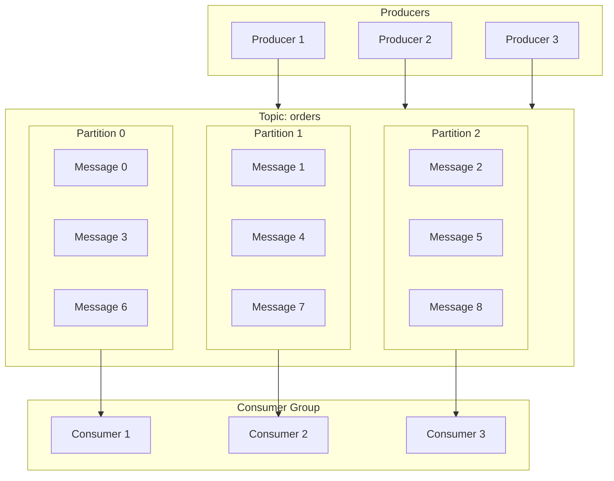
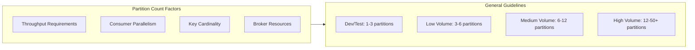
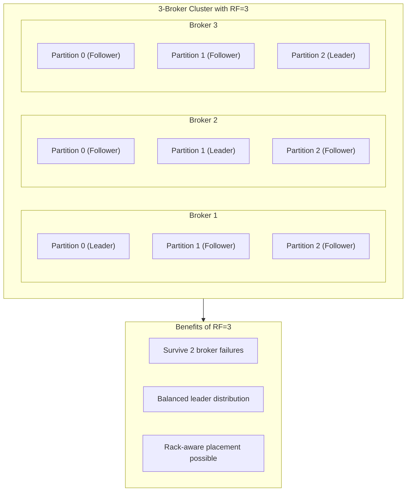
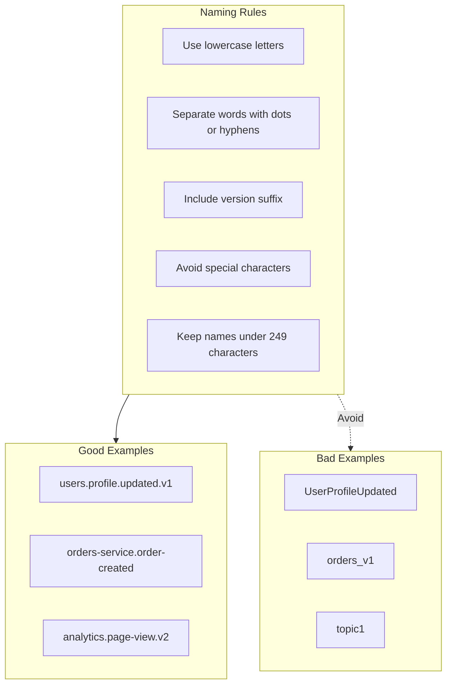
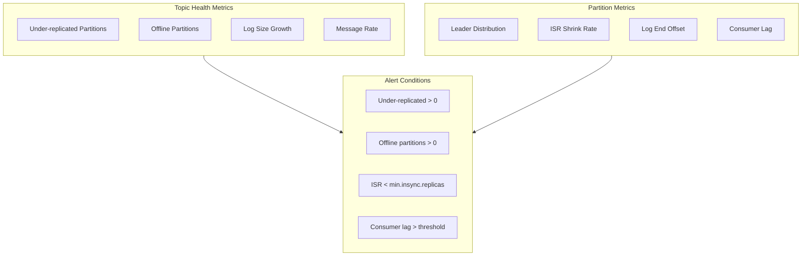

# How to Create Kafka Topics with Best Practices

Author: [nawazdhandala](https://www.github.com/nawazdhandala)

Tags: Kafka, Topics, Messaging, Best Practices, Streaming, Apache Kafka

Description: A comprehensive guide to creating and configuring Apache Kafka topics with production-ready best practices, covering partition strategies, replication, retention policies, and naming conventions.

---

Apache Kafka is the backbone of modern event-driven architectures, powering real-time data pipelines at companies like LinkedIn, Netflix, and Uber. At the heart of Kafka lies a fundamental concept: topics. Getting topic configuration right from the start can mean the difference between a scalable, maintainable system and an operational nightmare.

This guide covers everything you need to know about creating Kafka topics the right way, from basic creation commands to production-grade configuration strategies.

## Understanding Kafka Topics

A Kafka topic is a category or feed name to which records are published. Topics in Kafka are always multi-subscriber; that is, a topic can have zero, one, or many consumers that subscribe to the data written to it.



### Key Concepts

Before creating topics, understand these fundamental concepts:

- **Partitions**: Topics are split into partitions for parallelism. Each partition is an ordered, immutable sequence of records.
- **Replication Factor**: The number of copies of each partition across different brokers for fault tolerance.
- **Retention**: How long Kafka keeps messages before deletion (time-based or size-based).
- **Compaction**: An alternative to deletion where only the latest value for each key is retained.

## Prerequisites

Before creating topics, ensure you have:

1. A running Kafka cluster (single broker for development, 3+ for production)
2. Access to Kafka CLI tools or Admin API
3. Appropriate permissions (if ACLs are enabled)

The following command verifies your Kafka installation is accessible.

```bash
# Verify Kafka is running by listing existing topics
kafka-topics.sh --bootstrap-server localhost:9092 --list
```

## Creating Topics with CLI

### Basic Topic Creation

The simplest way to create a topic uses the kafka-topics.sh command with essential parameters.

```bash
# Create a basic topic with default configurations
# --topic: the name of the topic to create
# --partitions: number of partitions (affects parallelism)
# --replication-factor: number of replicas (affects durability)
kafka-topics.sh --bootstrap-server localhost:9092 \
    --create \
    --topic orders \
    --partitions 6 \
    --replication-factor 3
```

### Creating Topics with Custom Configuration

Production topics require additional configuration. This command creates a topic with custom retention settings.

```bash
# Create a topic with custom retention and segment settings
# retention.ms: how long to keep messages (7 days = 604800000ms)
# segment.bytes: size of each log segment file
# min.insync.replicas: minimum replicas that must acknowledge writes
kafka-topics.sh --bootstrap-server localhost:9092 \
    --create \
    --topic user-events \
    --partitions 12 \
    --replication-factor 3 \
    --config retention.ms=604800000 \
    --config segment.bytes=1073741824 \
    --config min.insync.replicas=2
```

### Creating Compacted Topics

Compacted topics retain only the latest value for each key, perfect for maintaining state.

```bash
# Create a compacted topic for maintaining current state
# cleanup.policy=compact: retain latest value per key instead of time-based deletion
# delete.retention.ms: time to retain tombstone markers
# min.cleanable.dirty.ratio: ratio that triggers compaction
kafka-topics.sh --bootstrap-server localhost:9092 \
    --create \
    --topic user-profiles \
    --partitions 6 \
    --replication-factor 3 \
    --config cleanup.policy=compact \
    --config delete.retention.ms=86400000 \
    --config min.cleanable.dirty.ratio=0.5
```

## Creating Topics Programmatically

### Using Java Admin Client

For application-managed topic creation, use the Kafka Admin Client API. This approach is essential for automated deployments.

```java
import org.apache.kafka.clients.admin.*;
import org.apache.kafka.common.config.TopicConfig;

import java.util.*;
import java.util.concurrent.ExecutionException;

public class KafkaTopicCreator {

    // Create an AdminClient with connection properties
    // The AdminClient provides administrative operations on Kafka
    private AdminClient createAdminClient(String bootstrapServers) {
        Properties props = new Properties();
        props.put(AdminClientConfig.BOOTSTRAP_SERVERS_CONFIG, bootstrapServers);
        props.put(AdminClientConfig.REQUEST_TIMEOUT_MS_CONFIG, 30000);
        props.put(AdminClientConfig.DEFAULT_API_TIMEOUT_MS_CONFIG, 60000);
        return AdminClient.create(props);
    }

    // Create a topic with specified configuration
    // Returns true if topic was created, false if it already exists
    public boolean createTopic(String bootstrapServers,
                               String topicName,
                               int partitions,
                               short replicationFactor,
                               Map<String, String> configs) {

        try (AdminClient admin = createAdminClient(bootstrapServers)) {
            // Check if topic already exists to avoid exceptions
            Set<String> existingTopics = admin.listTopics().names().get();
            if (existingTopics.contains(topicName)) {
                System.out.println("Topic " + topicName + " already exists");
                return false;
            }

            // Define the new topic with all configurations
            NewTopic newTopic = new NewTopic(topicName, partitions, replicationFactor);
            newTopic.configs(configs);

            // Execute the creation and wait for completion
            CreateTopicsResult result = admin.createTopics(
                Collections.singleton(newTopic)
            );

            // Wait for the operation to complete
            result.all().get();
            System.out.println("Topic " + topicName + " created successfully");
            return true;

        } catch (ExecutionException | InterruptedException e) {
            System.err.println("Failed to create topic: " + e.getMessage());
            return false;
        }
    }

    // Example usage demonstrating production-ready topic creation
    public static void main(String[] args) {
        KafkaTopicCreator creator = new KafkaTopicCreator();

        // Define topic configurations following best practices
        Map<String, String> configs = new HashMap<>();
        configs.put(TopicConfig.RETENTION_MS_CONFIG, "604800000");      // 7 days
        configs.put(TopicConfig.SEGMENT_BYTES_CONFIG, "1073741824");    // 1GB segments
        configs.put(TopicConfig.MIN_IN_SYNC_REPLICAS_CONFIG, "2");      // ISR of 2
        configs.put(TopicConfig.CLEANUP_POLICY_CONFIG, "delete");       // Time-based cleanup

        // Create the topic with production settings
        creator.createTopic(
            "localhost:9092",
            "order-events",
            12,                    // 12 partitions for good parallelism
            (short) 3,             // Replication factor of 3
            configs
        );
    }
}
```

### Using Python with confluent-kafka

Python developers can use the confluent-kafka library for topic management.

```python
from confluent_kafka.admin import AdminClient, NewTopic
from confluent_kafka import KafkaException
import time


def create_admin_client(bootstrap_servers: str) -> AdminClient:
    """
    Create and return a Kafka AdminClient.
    The AdminClient is used for administrative operations like
    creating topics, managing configurations, and cluster inspection.
    """
    config = {
        'bootstrap.servers': bootstrap_servers,
        'client.id': 'topic-admin-client',
        'request.timeout.ms': 30000,
    }
    return AdminClient(config)


def create_topic(
    bootstrap_servers: str,
    topic_name: str,
    num_partitions: int,
    replication_factor: int,
    config: dict = None
) -> bool:
    """
    Create a Kafka topic with specified configuration.

    Args:
        bootstrap_servers: Kafka broker addresses
        topic_name: Name of the topic to create
        num_partitions: Number of partitions
        replication_factor: Number of replicas per partition
        config: Optional dictionary of topic configurations

    Returns:
        True if topic was created successfully, False otherwise
    """
    admin = create_admin_client(bootstrap_servers)

    # Check if topic already exists
    existing_topics = admin.list_topics(timeout=10).topics
    if topic_name in existing_topics:
        print(f"Topic '{topic_name}' already exists")
        return False

    # Define the new topic with all configurations
    # NewTopic accepts topic name, partition count, replication factor, and config
    new_topic = NewTopic(
        topic=topic_name,
        num_partitions=num_partitions,
        replication_factor=replication_factor,
        config=config or {}
    )

    # Create topics returns a dict of futures for each topic
    futures = admin.create_topics([new_topic])

    # Wait for each topic creation to complete
    for topic, future in futures.items():
        try:
            future.result()  # Block until complete
            print(f"Topic '{topic}' created successfully")
            return True
        except KafkaException as e:
            print(f"Failed to create topic '{topic}': {e}")
            return False


def create_production_topics():
    """
    Example function demonstrating creation of production-ready topics
    with appropriate configurations for different use cases.
    """
    bootstrap_servers = "localhost:9092"

    # Configuration for high-throughput event streaming
    event_config = {
        'retention.ms': '604800000',           # 7 days retention
        'segment.bytes': '1073741824',         # 1GB segments
        'min.insync.replicas': '2',            # Require 2 ISR for writes
        'cleanup.policy': 'delete',            # Time-based deletion
        'compression.type': 'lz4',             # LZ4 compression for speed
    }

    # Configuration for compacted state topics
    state_config = {
        'cleanup.policy': 'compact',           # Keep latest per key
        'delete.retention.ms': '86400000',     # 1 day tombstone retention
        'min.cleanable.dirty.ratio': '0.5',    # Compact at 50% dirty
        'segment.ms': '3600000',               # 1 hour segments for faster compaction
    }

    # Create event streaming topic
    create_topic(
        bootstrap_servers=bootstrap_servers,
        topic_name="order-events",
        num_partitions=12,
        replication_factor=3,
        config=event_config
    )

    # Create state/lookup topic
    create_topic(
        bootstrap_servers=bootstrap_servers,
        topic_name="customer-state",
        num_partitions=6,
        replication_factor=3,
        config=state_config
    )


if __name__ == "__main__":
    create_production_topics()
```

## Best Practice: Partition Count Strategy

Choosing the right partition count is critical. Too few partitions limit parallelism; too many create overhead.



### Calculating Partition Count

Use this formula as a starting point:

```
Partitions = max(Target Throughput / Partition Throughput, Consumer Count)
```

For example:
- Target throughput: 100 MB/s
- Single partition throughput: 10 MB/s
- Maximum consumers: 8

```
Partitions = max(100/10, 8) = max(10, 8) = 10
```

### Partition Count Recommendations

| Use Case | Partition Count | Rationale |
|----------|-----------------|-----------|
| Development | 1-3 | Simplicity, easy debugging |
| Low-volume production | 3-6 | Basic redundancy and parallelism |
| Medium-volume production | 6-12 | Good balance of parallelism and overhead |
| High-volume production | 12-50 | High parallelism for demanding workloads |
| Extreme scale | 50-100+ | Only when absolutely necessary |

### Important Partition Considerations

Partitions cannot be decreased, only increased. Starting with too many partitions creates unnecessary overhead.

```bash
# View current partition count for a topic
kafka-topics.sh --bootstrap-server localhost:9092 \
    --describe \
    --topic orders

# Increase partitions (WARNING: affects key-based ordering!)
# Only do this when absolutely necessary
kafka-topics.sh --bootstrap-server localhost:9092 \
    --alter \
    --topic orders \
    --partitions 24
```

## Best Practice: Replication Factor

Replication factor determines fault tolerance. Always use a replication factor of at least 3 for production.



### Replication Settings

This configuration ensures durability while maintaining performance.

```bash
# Create a highly durable topic
# replication-factor=3: three copies of each partition
# min.insync.replicas=2: at least 2 replicas must acknowledge writes
kafka-topics.sh --bootstrap-server localhost:9092 \
    --create \
    --topic critical-transactions \
    --partitions 12 \
    --replication-factor 3 \
    --config min.insync.replicas=2
```

### Producer Configuration for Durability

Match your topic settings with appropriate producer configuration.

```java
import org.apache.kafka.clients.producer.*;
import java.util.Properties;

public class DurableProducerConfig {

    // Configure a producer for maximum durability
    // These settings ensure messages are not lost
    public static Properties getDurableProducerConfig(String bootstrapServers) {
        Properties props = new Properties();
        props.put(ProducerConfig.BOOTSTRAP_SERVERS_CONFIG, bootstrapServers);

        // Wait for all in-sync replicas to acknowledge
        // This works with min.insync.replicas on the topic
        props.put(ProducerConfig.ACKS_CONFIG, "all");

        // Enable idempotence to prevent duplicates
        props.put(ProducerConfig.ENABLE_IDEMPOTENCE_CONFIG, true);

        // Retry configuration for transient failures
        props.put(ProducerConfig.RETRIES_CONFIG, Integer.MAX_VALUE);
        props.put(ProducerConfig.RETRY_BACKOFF_MS_CONFIG, 100);

        // Limit in-flight requests to maintain ordering with retries
        props.put(ProducerConfig.MAX_IN_FLIGHT_REQUESTS_PER_CONNECTION, 5);

        // Serializers
        props.put(ProducerConfig.KEY_SERIALIZER_CLASS_CONFIG,
            "org.apache.kafka.common.serialization.StringSerializer");
        props.put(ProducerConfig.VALUE_SERIALIZER_CLASS_CONFIG,
            "org.apache.kafka.common.serialization.StringSerializer");

        return props;
    }
}
```

## Best Practice: Retention Configuration

Configure retention based on your data lifecycle requirements.

### Time-Based Retention

Time-based retention automatically deletes messages older than the specified duration.

```bash
# Create topic with 30-day retention
# retention.ms: maximum age of messages before deletion
# retention.bytes: maximum size per partition before deletion (-1 = unlimited)
kafka-topics.sh --bootstrap-server localhost:9092 \
    --create \
    --topic audit-logs \
    --partitions 12 \
    --replication-factor 3 \
    --config retention.ms=2592000000 \
    --config retention.bytes=-1
```

### Size-Based Retention

Size-based retention limits storage per partition.

```bash
# Create topic with size-based retention
# retention.bytes: 50GB per partition maximum
# retention.ms: also keep time limit as safety
kafka-topics.sh --bootstrap-server localhost:9092 \
    --create \
    --topic metrics \
    --partitions 24 \
    --replication-factor 3 \
    --config retention.bytes=53687091200 \
    --config retention.ms=604800000
```

### Retention Decision Matrix

| Use Case | retention.ms | retention.bytes | cleanup.policy |
|----------|--------------|-----------------|----------------|
| Real-time events | 24-72 hours | -1 (unlimited) | delete |
| Audit logs | 30-365 days | -1 (unlimited) | delete |
| Metrics/Telemetry | 7-14 days | 50-100 GB | delete |
| State/Lookup | -1 (forever) | -1 (unlimited) | compact |
| Change data capture | 7 days | -1 (unlimited) | compact,delete |

## Best Practice: Topic Naming Conventions

Consistent naming makes topics discoverable and manageable.

### Recommended Naming Pattern

```
<domain>.<entity>.<event-type>.<version>
```

Examples:
- `orders.purchase.created.v1`
- `inventory.product.updated.v2`
- `payments.transaction.completed.v1`

### Naming Convention Rules



### Creating Topics with Standardized Names

```bash
# Create topics following naming conventions
# Domain: orders
# Entity: purchase
# Event types: created, updated, cancelled

# Order created events
kafka-topics.sh --bootstrap-server localhost:9092 \
    --create \
    --topic orders.purchase.created.v1 \
    --partitions 12 \
    --replication-factor 3

# Order updated events
kafka-topics.sh --bootstrap-server localhost:9092 \
    --create \
    --topic orders.purchase.updated.v1 \
    --partitions 12 \
    --replication-factor 3

# Order cancelled events
kafka-topics.sh --bootstrap-server localhost:9092 \
    --create \
    --topic orders.purchase.cancelled.v1 \
    --partitions 6 \
    --replication-factor 3
```

## Best Practice: Segment Configuration

Segments affect log compaction and recovery time. Configure them based on your throughput.

```bash
# High-throughput topic with optimized segments
# segment.bytes: 1GB segments (default is 1GB)
# segment.ms: roll segment every 6 hours regardless of size
# segment.index.bytes: index file size per segment
kafka-topics.sh --bootstrap-server localhost:9092 \
    --create \
    --topic high-throughput-events \
    --partitions 24 \
    --replication-factor 3 \
    --config segment.bytes=1073741824 \
    --config segment.ms=21600000 \
    --config segment.index.bytes=10485760
```

### Segment Size Guidelines

| Throughput | segment.bytes | segment.ms |
|------------|---------------|------------|
| Low (< 1 MB/s) | 100 MB | 24 hours |
| Medium (1-10 MB/s) | 500 MB | 6 hours |
| High (10-100 MB/s) | 1 GB | 1-6 hours |
| Very High (> 100 MB/s) | 1 GB | 1 hour |

## Best Practice: Compression

Enable compression to reduce storage and network usage.

```bash
# Create topic with producer-side compression
# compression.type: algorithm used (lz4, snappy, gzip, zstd)
# lz4 offers best balance of speed and compression
kafka-topics.sh --bootstrap-server localhost:9092 \
    --create \
    --topic compressed-events \
    --partitions 12 \
    --replication-factor 3 \
    --config compression.type=lz4
```

### Compression Comparison

| Algorithm | Compression Ratio | CPU Usage | Best For |
|-----------|-------------------|-----------|----------|
| none | 1:1 | Lowest | Already compressed data |
| lz4 | 2-3:1 | Low | High throughput, balanced |
| snappy | 2-3:1 | Low | Similar to lz4 |
| gzip | 4-5:1 | High | Maximum compression |
| zstd | 3-4:1 | Medium | Good balance, newer |

## Automating Topic Creation

### Terraform Configuration

Use Terraform for infrastructure-as-code topic management.

```hcl
# Configure the Kafka provider for topic management
terraform {
  required_providers {
    kafka = {
      source  = "Mongey/kafka"
      version = "~> 0.5"
    }
  }
}

# Provider configuration pointing to your Kafka cluster
provider "kafka" {
  bootstrap_servers = ["kafka1:9092", "kafka2:9092", "kafka3:9092"]

  # TLS configuration for secure clusters
  tls_enabled    = true
  skip_tls_verify = false

  # SASL authentication if enabled
  sasl_username  = var.kafka_username
  sasl_password  = var.kafka_password
  sasl_mechanism = "SCRAM-SHA-512"
}

# Define a reusable module for standard topic configuration
resource "kafka_topic" "order_events" {
  name               = "orders.purchase.created.v1"
  partitions         = 12
  replication_factor = 3

  config = {
    # Retention settings
    "retention.ms"          = "604800000"    # 7 days
    "retention.bytes"       = "-1"           # Unlimited

    # Durability settings
    "min.insync.replicas"   = "2"

    # Performance settings
    "compression.type"      = "lz4"
    "segment.bytes"         = "1073741824"   # 1GB

    # Cleanup policy
    "cleanup.policy"        = "delete"
  }
}

# Compacted topic for state management
resource "kafka_topic" "customer_state" {
  name               = "customers.profile.state.v1"
  partitions         = 6
  replication_factor = 3

  config = {
    "cleanup.policy"              = "compact"
    "delete.retention.ms"         = "86400000"
    "min.cleanable.dirty.ratio"   = "0.5"
    "segment.ms"                  = "3600000"
    "min.insync.replicas"         = "2"
  }
}
```

### Kubernetes Strimzi Operator

For Kubernetes deployments, use Strimzi to manage topics declaratively.

```yaml
# KafkaTopic custom resource for Strimzi operator
# This creates and manages the topic through Kubernetes
apiVersion: kafka.strimzi.io/v1beta2
kind: KafkaTopic
metadata:
  name: orders-purchase-created-v1
  labels:
    # Link to your Kafka cluster
    strimzi.io/cluster: production-kafka
spec:
  # Topic configuration
  topicName: orders.purchase.created.v1
  partitions: 12
  replicas: 3

  # Topic-level configuration
  config:
    retention.ms: "604800000"
    min.insync.replicas: "2"
    compression.type: lz4
    segment.bytes: "1073741824"
    cleanup.policy: delete

---
# Compacted topic for maintaining state
apiVersion: kafka.strimzi.io/v1beta2
kind: KafkaTopic
metadata:
  name: customers-profile-state-v1
  labels:
    strimzi.io/cluster: production-kafka
spec:
  topicName: customers.profile.state.v1
  partitions: 6
  replicas: 3

  config:
    cleanup.policy: compact
    delete.retention.ms: "86400000"
    min.cleanable.dirty.ratio: "0.5"
    segment.ms: "3600000"
    min.insync.replicas: "2"
```

## Monitoring Topic Health

After creating topics, monitor their health and performance.

### Key Metrics to Monitor



### Checking Topic Status

Use these commands to verify topic health after creation.

```bash
# Describe topic to see partition assignments and configuration
kafka-topics.sh --bootstrap-server localhost:9092 \
    --describe \
    --topic orders.purchase.created.v1

# Check for under-replicated partitions (should be 0)
kafka-topics.sh --bootstrap-server localhost:9092 \
    --describe \
    --under-replicated-partitions

# View topic configuration
kafka-configs.sh --bootstrap-server localhost:9092 \
    --entity-type topics \
    --entity-name orders.purchase.created.v1 \
    --describe

# Get topic partition offsets (earliest and latest)
kafka-run-class.sh kafka.tools.GetOffsetShell \
    --broker-list localhost:9092 \
    --topic orders.purchase.created.v1 \
    --time -1
```

## Common Pitfalls and Solutions

### Pitfall 1: Too Many Partitions

Creating topics with excessive partitions increases metadata overhead and slows recovery.

```bash
# BAD: Too many partitions for low-volume topic
kafka-topics.sh --create --topic low-volume --partitions 100

# GOOD: Appropriate partition count
kafka-topics.sh --create --topic low-volume --partitions 6
```

### Pitfall 2: Replication Factor of 1

Never use RF=1 in production. A single broker failure causes data loss.

```bash
# BAD: No replication means no fault tolerance
kafka-topics.sh --create --topic important --replication-factor 1

# GOOD: Proper replication for production
kafka-topics.sh --create --topic important --replication-factor 3
```

### Pitfall 3: Missing min.insync.replicas

Without min.insync.replicas, producers with acks=all might write to a single replica during failures.

```bash
# GOOD: Set min.insync.replicas to ensure durability
kafka-topics.sh --create \
    --topic critical \
    --replication-factor 3 \
    --config min.insync.replicas=2
```

### Pitfall 4: Inconsistent Naming

Inconsistent naming makes topics hard to discover and manage.

```bash
# BAD: Inconsistent naming patterns
OrderCreated
user_updated
payment-completed-v1

# GOOD: Consistent naming pattern
orders.order.created.v1
users.user.updated.v1
payments.payment.completed.v1
```

## Topic Creation Checklist

Use this checklist before creating production topics:

- [ ] Topic name follows naming convention
- [ ] Partition count based on throughput requirements
- [ ] Replication factor is at least 3
- [ ] min.insync.replicas is set (typically RF - 1)
- [ ] Retention policy matches data lifecycle
- [ ] Compression enabled if beneficial
- [ ] Segment size appropriate for throughput
- [ ] Topic documented in schema registry
- [ ] Monitoring and alerting configured
- [ ] ACLs configured if security is enabled

## Summary

Creating Kafka topics correctly from the start prevents operational headaches later. Remember these key principles:

1. **Start with appropriate partitions**: Calculate based on throughput and consumer parallelism, but do not over-provision.

2. **Always replicate**: Use RF=3 with min.insync.replicas=2 for production.

3. **Configure retention thoughtfully**: Match retention to your data lifecycle and compliance requirements.

4. **Use consistent naming**: Adopt a naming convention and stick to it across all topics.

5. **Automate creation**: Use Terraform, Strimzi, or CI/CD pipelines for reproducible topic management.

6. **Monitor continuously**: Track under-replicated partitions, consumer lag, and partition balance.

By following these best practices, you will build a Kafka infrastructure that scales reliably and remains maintainable as your data platform grows.
