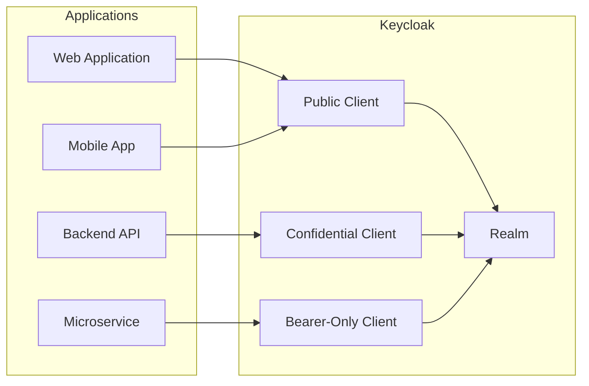
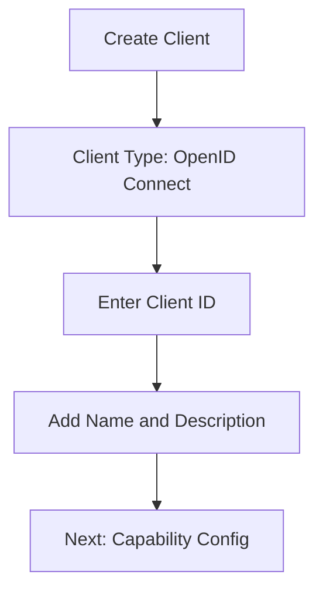
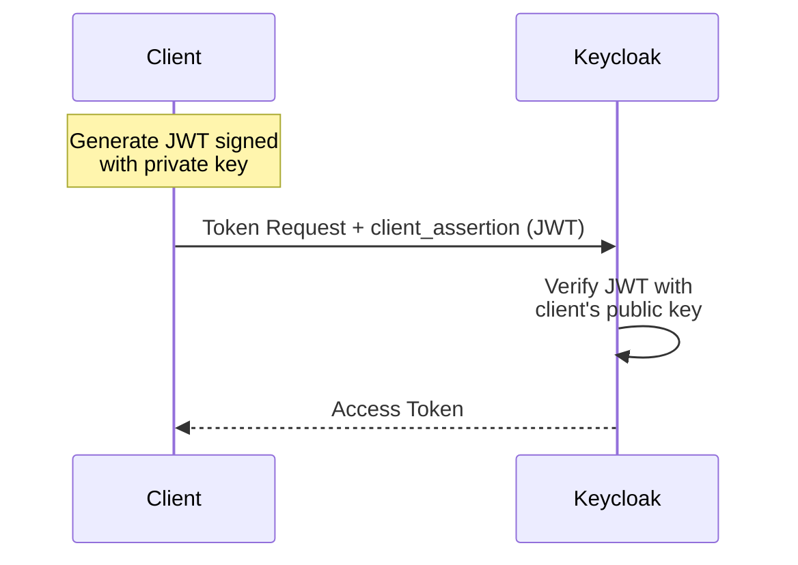

# How to Create Keycloak Clients

Author: [nawazdhandala](https://www.github.com/nawazdhandala)

Tags: Keycloak, OAuth2, OIDC, Authentication, Identity Management, SSO, Security

Description: A hands-on guide to creating Keycloak clients for different application types, covering UI-based setup, CLI automation, REST API integration, and production-ready configurations.

---

Keycloak clients are the bridge between your applications and the identity provider. Every app that needs authentication - whether a web frontend, mobile app, or backend service - requires a properly configured client. Getting the settings right means secure, seamless authentication. Getting them wrong opens security holes or breaks user flows entirely.

## Understanding Keycloak Clients

Before creating any client, understanding what clients actually do helps avoid common mistakes.



A client in Keycloak represents an application that can request authentication. Depending on the application type, you choose different client configurations:

| Client Type | Use Case | Can Store Secrets | Authentication Flow |
|-------------|----------|-------------------|---------------------|
| Public | SPAs, Mobile Apps | No | Authorization Code + PKCE |
| Confidential | Server-side Apps, APIs | Yes | Authorization Code, Client Credentials |
| Bearer-Only | Resource Servers | N/A | Token Validation Only |

## Creating Clients via Admin Console

The Admin Console provides the most visual way to create and configure clients.

### Step 1: Access the Admin Console

Navigate to your Keycloak instance and log in with admin credentials.

```
https://your-keycloak-domain/admin/master/console/
```

### Step 2: Select Your Realm

From the dropdown in the top-left corner, select the realm where you want to create the client. Never create application clients in the master realm.

### Step 3: Navigate to Clients

Click **Clients** in the left sidebar, then click **Create client** button.

### Step 4: Configure General Settings



Fill in the initial settings:

- **Client type**: OpenID Connect (for OAuth2/OIDC) or SAML
- **Client ID**: A unique identifier like `my-web-app` or `api-gateway`
- **Name**: Human-readable display name
- **Description**: Purpose of the client

### Step 5: Configure Capability

Choose the authentication capabilities based on your application type.

For a **web application**:
- Client authentication: ON (confidential client)
- Authorization: OFF (unless using fine-grained permissions)
- Standard flow: ON
- Direct access grants: OFF

For a **single-page application**:
- Client authentication: OFF (public client)
- Standard flow: ON
- Direct access grants: OFF

For a **service account** (machine-to-machine):
- Client authentication: ON
- Service accounts roles: ON
- Standard flow: OFF

### Step 6: Configure Login Settings

Set the valid redirect URIs and web origins.

Example redirect URIs for development:
```
http://localhost:3000/*
http://localhost:8080/callback
```

Example for production:
```
https://app.example.com/auth/callback
https://app.example.com/silent-renew
```

## Creating Clients via Admin CLI

The kcadm.sh CLI tool enables scriptable client creation, perfect for automation and infrastructure-as-code workflows.

### Authenticate to Keycloak

Before running any commands, authenticate the CLI to your Keycloak instance.

```bash
# Configure credentials for the admin CLI
/opt/keycloak/bin/kcadm.sh config credentials \
  --server https://keycloak.example.com \
  --realm master \
  --user admin \
  --password "${KEYCLOAK_ADMIN_PASSWORD}"
```

### Create a Confidential Client

Server-side applications that can securely store secrets use confidential clients.

```bash
# Create a confidential client for a backend API
/opt/keycloak/bin/kcadm.sh create clients \
  -r mycompany \
  -s clientId=payment-service \
  -s name="Payment Service" \
  -s description="Internal payment processing API" \
  -s enabled=true \
  -s protocol=openid-connect \
  -s publicClient=false \
  -s bearerOnly=false \
  -s standardFlowEnabled=true \
  -s directAccessGrantsEnabled=false \
  -s serviceAccountsEnabled=true \
  -s 'redirectUris=["https://payment.internal.example.com/callback"]' \
  -s 'webOrigins=["https://payment.internal.example.com"]'
```

### Retrieve the Client Secret

After creating a confidential client, retrieve its secret for application configuration.

```bash
# Get the client ID (internal UUID)
CLIENT_UUID=$(/opt/keycloak/bin/kcadm.sh get clients \
  -r mycompany \
  -q clientId=payment-service \
  --fields id \
  --format csv \
  --noquotes | tail -1)

# Retrieve the client secret
/opt/keycloak/bin/kcadm.sh get clients/${CLIENT_UUID}/client-secret \
  -r mycompany \
  --fields value \
  --format csv \
  --noquotes
```

### Create a Public Client with PKCE

Browser-based SPAs and mobile apps cannot store secrets securely, so they use public clients with PKCE.

```bash
# Create a public client for a React SPA
/opt/keycloak/bin/kcadm.sh create clients \
  -r mycompany \
  -s clientId=customer-portal \
  -s name="Customer Portal" \
  -s description="Customer-facing React application" \
  -s enabled=true \
  -s protocol=openid-connect \
  -s publicClient=true \
  -s standardFlowEnabled=true \
  -s directAccessGrantsEnabled=false \
  -s implicitFlowEnabled=false \
  -s 'redirectUris=["https://portal.example.com/*", "http://localhost:3000/*"]' \
  -s 'webOrigins=["https://portal.example.com", "http://localhost:3000"]' \
  -s 'attributes={"pkce.code.challenge.method": "S256"}'
```

### Create a Bearer-Only Client

APIs that only validate tokens and never initiate login flows use bearer-only configuration.

```bash
# Create a bearer-only client for an API gateway
/opt/keycloak/bin/kcadm.sh create clients \
  -r mycompany \
  -s clientId=api-gateway \
  -s name="API Gateway" \
  -s description="Gateway that validates incoming tokens" \
  -s enabled=true \
  -s protocol=openid-connect \
  -s publicClient=false \
  -s bearerOnly=true \
  -s standardFlowEnabled=false \
  -s directAccessGrantsEnabled=false
```

## Creating Clients via REST API

For programmatic client management from applications, the Keycloak Admin REST API provides full control.

### Obtain an Admin Access Token

First, acquire an access token with admin privileges.

```bash
# Get admin token from master realm
ADMIN_TOKEN=$(curl -s -X POST \
  "https://keycloak.example.com/realms/master/protocol/openid-connect/token" \
  -H "Content-Type: application/x-www-form-urlencoded" \
  -d "grant_type=password" \
  -d "client_id=admin-cli" \
  -d "username=admin" \
  -d "password=${KEYCLOAK_ADMIN_PASSWORD}" \
  | jq -r '.access_token')
```

### Create a Client via API

Send a POST request with the client configuration.

```bash
# Create a new confidential client
curl -s -X POST \
  "https://keycloak.example.com/admin/realms/mycompany/clients" \
  -H "Authorization: Bearer ${ADMIN_TOKEN}" \
  -H "Content-Type: application/json" \
  -d '{
    "clientId": "order-service",
    "name": "Order Service",
    "description": "Order management microservice",
    "enabled": true,
    "protocol": "openid-connect",
    "publicClient": false,
    "bearerOnly": false,
    "standardFlowEnabled": true,
    "directAccessGrantsEnabled": false,
    "serviceAccountsEnabled": true,
    "redirectUris": [
      "https://orders.internal.example.com/callback"
    ],
    "webOrigins": [
      "https://orders.internal.example.com"
    ],
    "attributes": {
      "access.token.lifespan": "300"
    }
  }'
```

### Retrieve All Clients

List existing clients to verify creation or find client IDs.

```bash
# List all clients in the realm
curl -s -X GET \
  "https://keycloak.example.com/admin/realms/mycompany/clients" \
  -H "Authorization: Bearer ${ADMIN_TOKEN}" \
  | jq '.[] | {clientId: .clientId, id: .id, enabled: .enabled}'
```

### Get Client Secret via API

Fetch the generated secret for a confidential client.

```bash
# Get client UUID first
CLIENT_UUID=$(curl -s -X GET \
  "https://keycloak.example.com/admin/realms/mycompany/clients?clientId=order-service" \
  -H "Authorization: Bearer ${ADMIN_TOKEN}" \
  | jq -r '.[0].id')

# Retrieve the secret
curl -s -X GET \
  "https://keycloak.example.com/admin/realms/mycompany/clients/${CLIENT_UUID}/client-secret" \
  -H "Authorization: Bearer ${ADMIN_TOKEN}" \
  | jq -r '.value'
```

### Regenerate Client Secret

Rotate secrets periodically for security.

```bash
# Generate a new client secret
curl -s -X POST \
  "https://keycloak.example.com/admin/realms/mycompany/clients/${CLIENT_UUID}/client-secret" \
  -H "Authorization: Bearer ${ADMIN_TOKEN}" \
  -H "Content-Type: application/json" \
  | jq -r '.value'
```

## Client Configuration with JSON Import

For repeatable deployments, define clients in JSON and import them.

### Complete Client Configuration File

Save the following as `clients/order-service.json`.

```json
{
  "clientId": "order-service",
  "name": "Order Service",
  "description": "Order management microservice",
  "rootUrl": "https://orders.internal.example.com",
  "adminUrl": "https://orders.internal.example.com",
  "baseUrl": "/",
  "surrogateAuthRequired": false,
  "enabled": true,
  "alwaysDisplayInConsole": false,
  "clientAuthenticatorType": "client-secret",
  "redirectUris": [
    "https://orders.internal.example.com/*"
  ],
  "webOrigins": [
    "https://orders.internal.example.com"
  ],
  "notBefore": 0,
  "bearerOnly": false,
  "consentRequired": false,
  "standardFlowEnabled": true,
  "implicitFlowEnabled": false,
  "directAccessGrantsEnabled": false,
  "serviceAccountsEnabled": true,
  "publicClient": false,
  "frontchannelLogout": true,
  "protocol": "openid-connect",
  "attributes": {
    "oidc.ciba.grant.enabled": "false",
    "oauth2.device.authorization.grant.enabled": "false",
    "backchannel.logout.session.required": "true",
    "backchannel.logout.revoke.offline.tokens": "false",
    "access.token.lifespan": "300",
    "pkce.code.challenge.method": "S256"
  },
  "authenticationFlowBindingOverrides": {},
  "fullScopeAllowed": true,
  "nodeReRegistrationTimeout": -1,
  "defaultClientScopes": [
    "web-origins",
    "acr",
    "profile",
    "roles",
    "email"
  ],
  "optionalClientScopes": [
    "address",
    "phone",
    "offline_access",
    "microprofile-jwt"
  ]
}
```

### Import Client from JSON

Use the CLI to import the configuration.

```bash
# Import client from JSON file
/opt/keycloak/bin/kcadm.sh create clients \
  -r mycompany \
  -f clients/order-service.json
```

## Configuring Client Roles

Clients can have their own roles for fine-grained access control.

### Create Client Roles

Define roles specific to the client's functionality.

```bash
# Get the client UUID
CLIENT_UUID=$(/opt/keycloak/bin/kcadm.sh get clients \
  -r mycompany \
  -q clientId=order-service \
  --fields id \
  --format csv \
  --noquotes | tail -1)

# Create client-specific roles
/opt/keycloak/bin/kcadm.sh create clients/${CLIENT_UUID}/roles \
  -r mycompany \
  -s name=order-read \
  -s description="Read orders"

/opt/keycloak/bin/kcadm.sh create clients/${CLIENT_UUID}/roles \
  -r mycompany \
  -s name=order-write \
  -s description="Create and update orders"

/opt/keycloak/bin/kcadm.sh create clients/${CLIENT_UUID}/roles \
  -r mycompany \
  -s name=order-admin \
  -s description="Full order management"
```

### Assign Roles to Service Account

When using service accounts, assign roles directly to the service account user.

```bash
# Get the service account user ID
SERVICE_ACCOUNT=$(/opt/keycloak/bin/kcadm.sh get clients/${CLIENT_UUID}/service-account-user \
  -r mycompany \
  --fields id \
  --format csv \
  --noquotes)

# Assign client roles to service account
/opt/keycloak/bin/kcadm.sh add-roles \
  -r mycompany \
  --uid ${SERVICE_ACCOUNT} \
  --cclientid order-service \
  --rolename order-read \
  --rolename order-write
```

## Configuring Protocol Mappers

Protocol mappers control what claims appear in tokens issued to the client.

### Add Custom Claim Mapper

Include additional user attributes in access tokens.

```bash
# Add a mapper to include department in tokens
/opt/keycloak/bin/kcadm.sh create clients/${CLIENT_UUID}/protocol-mappers/models \
  -r mycompany \
  -s name=department-mapper \
  -s protocol=openid-connect \
  -s protocolMapper=oidc-usermodel-attribute-mapper \
  -s 'config."user.attribute"=department' \
  -s 'config."claim.name"=department' \
  -s 'config."jsonType.label"=String' \
  -s 'config."id.token.claim"=true' \
  -s 'config."access.token.claim"=true' \
  -s 'config."userinfo.token.claim"=true'
```

### Add Audience Mapper

Ensure the correct audience appears in tokens for API validation.

```bash
# Add audience mapper for API validation
/opt/keycloak/bin/kcadm.sh create clients/${CLIENT_UUID}/protocol-mappers/models \
  -r mycompany \
  -s name=api-audience \
  -s protocol=openid-connect \
  -s protocolMapper=oidc-audience-mapper \
  -s 'config."included.client.audience"=api-gateway' \
  -s 'config."id.token.claim"=false' \
  -s 'config."access.token.claim"=true' \
  -s 'config."included.custom.audience"='
```

## Client Authentication Methods

Beyond client secrets, Keycloak supports various authentication methods.

### JWT Client Authentication

Use signed JWTs instead of secrets for client authentication.



Configure the client for JWT authentication.

```bash
# Update client to use JWT authentication
/opt/keycloak/bin/kcadm.sh update clients/${CLIENT_UUID} \
  -r mycompany \
  -s clientAuthenticatorType=client-jwt \
  -s 'attributes."token.endpoint.auth.signing.alg"=RS256'
```

Upload the client's public key or certificate in the Admin Console under **Keys** tab.

### Mutual TLS (mTLS) Authentication

For high-security environments, use client certificates.

```bash
# Configure client for X.509 certificate authentication
/opt/keycloak/bin/kcadm.sh update clients/${CLIENT_UUID} \
  -r mycompany \
  -s clientAuthenticatorType=client-x509 \
  -s 'attributes."x509.subjectdn"=CN=order-service,O=MyCompany,C=US'
```

## Testing Client Configuration

After creating a client, verify the configuration works correctly.

### Test Authorization Code Flow

For web applications using the authorization code flow.

```bash
# Step 1: Generate PKCE values
CODE_VERIFIER=$(openssl rand -base64 32 | tr -d '=+/' | cut -c1-43)
CODE_CHALLENGE=$(echo -n "$CODE_VERIFIER" | openssl dgst -sha256 -binary | base64 | tr -d '=' | tr '+/' '-_')

# Step 2: Build authorization URL
AUTH_URL="https://keycloak.example.com/realms/mycompany/protocol/openid-connect/auth"
AUTH_URL="${AUTH_URL}?client_id=customer-portal"
AUTH_URL="${AUTH_URL}&redirect_uri=http://localhost:3000/callback"
AUTH_URL="${AUTH_URL}&response_type=code"
AUTH_URL="${AUTH_URL}&scope=openid%20profile%20email"
AUTH_URL="${AUTH_URL}&state=$(openssl rand -hex 16)"
AUTH_URL="${AUTH_URL}&code_challenge=${CODE_CHALLENGE}"
AUTH_URL="${AUTH_URL}&code_challenge_method=S256"

echo "Open in browser: ${AUTH_URL}"
```

### Test Client Credentials Flow

For service-to-service authentication.

```bash
# Request token using client credentials
curl -s -X POST \
  "https://keycloak.example.com/realms/mycompany/protocol/openid-connect/token" \
  -H "Content-Type: application/x-www-form-urlencoded" \
  -d "grant_type=client_credentials" \
  -d "client_id=order-service" \
  -d "client_secret=${CLIENT_SECRET}" \
  | jq '.'
```

### Validate Token Claims

Decode the access token to verify claims.

```bash
# Get a token
TOKEN_RESPONSE=$(curl -s -X POST \
  "https://keycloak.example.com/realms/mycompany/protocol/openid-connect/token" \
  -H "Content-Type: application/x-www-form-urlencoded" \
  -d "grant_type=client_credentials" \
  -d "client_id=order-service" \
  -d "client_secret=${CLIENT_SECRET}")

# Extract and decode access token
ACCESS_TOKEN=$(echo $TOKEN_RESPONSE | jq -r '.access_token')
echo $ACCESS_TOKEN | cut -d'.' -f2 | base64 -d 2>/dev/null | jq '.'
```

## Production Best Practices

### Redirect URI Security

Never use wildcard redirects in production. Be as specific as possible.

```json
{
  "redirectUris": [
    "https://app.example.com/auth/callback",
    "https://app.example.com/auth/silent-renew"
  ]
}
```

### Token Lifespan Configuration

Set appropriate token lifespans based on security requirements.

```bash
# Configure token lifespans for a client
/opt/keycloak/bin/kcadm.sh update clients/${CLIENT_UUID} \
  -r mycompany \
  -s 'attributes."access.token.lifespan"=300' \
  -s 'attributes."client.session.idle.timeout"=1800' \
  -s 'attributes."client.session.max.lifespan"=36000'
```

### Disable Unused Flows

Minimize attack surface by disabling flows the client does not need.

```bash
# Disable unnecessary flows
/opt/keycloak/bin/kcadm.sh update clients/${CLIENT_UUID} \
  -r mycompany \
  -s implicitFlowEnabled=false \
  -s directAccessGrantsEnabled=false \
  -s 'attributes."oauth2.device.authorization.grant.enabled"=false' \
  -s 'attributes."oidc.ciba.grant.enabled"=false'
```

### Regular Secret Rotation

Implement a process for rotating client secrets.

```bash
#!/bin/bash
# rotate-secret.sh - Rotate client secret and update applications

CLIENT_ID="order-service"
REALM="mycompany"

# Authenticate
/opt/keycloak/bin/kcadm.sh config credentials \
  --server https://keycloak.example.com \
  --realm master \
  --user admin \
  --password "${KEYCLOAK_ADMIN_PASSWORD}"

# Get client UUID
CLIENT_UUID=$(/opt/keycloak/bin/kcadm.sh get clients \
  -r ${REALM} \
  -q clientId=${CLIENT_ID} \
  --fields id \
  --format csv \
  --noquotes | tail -1)

# Regenerate secret
NEW_SECRET=$(/opt/keycloak/bin/kcadm.sh create clients/${CLIENT_UUID}/client-secret \
  -r ${REALM} \
  -o \
  --fields value \
  --format csv \
  --noquotes)

echo "New secret for ${CLIENT_ID}: ${NEW_SECRET}"

# Update secret in your secrets manager (example with Vault)
# vault kv put secret/keycloak/${CLIENT_ID} client_secret="${NEW_SECRET}"
```

## Troubleshooting Common Issues

### Invalid Redirect URI

Keycloak rejects requests if the redirect URI does not match exactly.

**Solution**: Check that the redirect URI in your application matches one of the configured URIs, including protocol, host, port, and path.

### CORS Errors

Browser requests fail with CORS errors when web origins are not configured.

**Solution**: Add the frontend origin to the client's Web Origins setting.

```bash
/opt/keycloak/bin/kcadm.sh update clients/${CLIENT_UUID} \
  -r mycompany \
  -s 'webOrigins=["https://app.example.com", "http://localhost:3000"]'
```

### Token Audience Mismatch

API rejects tokens because the audience claim is missing or incorrect.

**Solution**: Add an audience mapper to include the API's client ID in the token.

### Client Secret Not Working

Token requests fail with "invalid client credentials."

**Solution**: Regenerate the secret and ensure no whitespace or encoding issues.

```bash
# Regenerate and retrieve new secret
/opt/keycloak/bin/kcadm.sh create clients/${CLIENT_UUID}/client-secret -r mycompany
/opt/keycloak/bin/kcadm.sh get clients/${CLIENT_UUID}/client-secret \
  -r mycompany \
  --fields value
```

---

Creating Keycloak clients correctly sets the foundation for secure authentication across your applications. Whether you use the Admin Console for quick setup, the CLI for automation, or the REST API for programmatic management, the key is matching the client configuration to your application's security requirements.

Monitor your Keycloak infrastructure and authentication flows with [OneUptime](https://oneuptime.com) to detect authentication failures, token issues, and service availability problems before they impact users.
