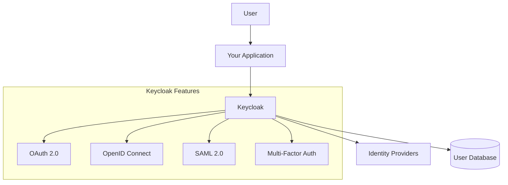
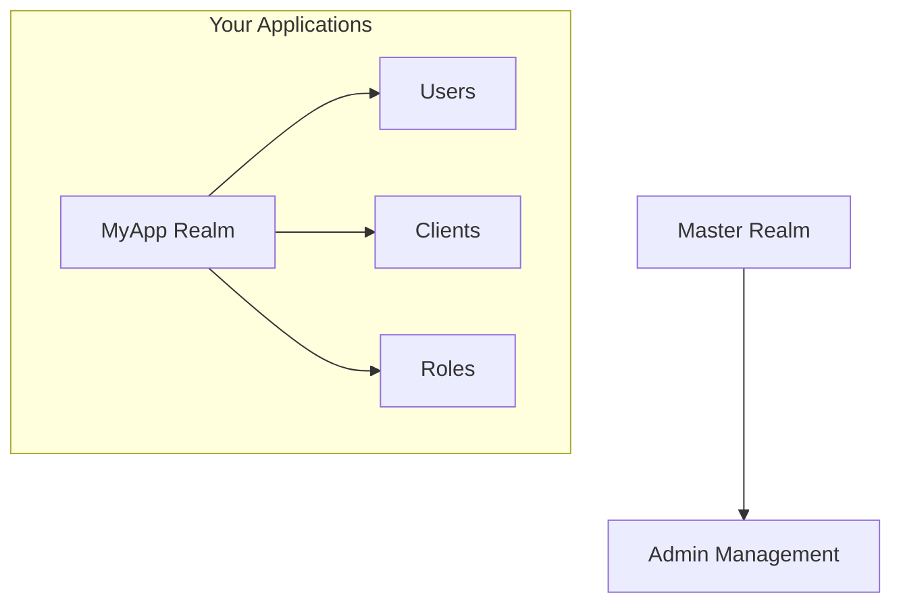

# How to Install and Configure Keycloak

Author: [nawazdhandala](https://www.github.com/nawazdhandala)

Tags: Keycloak, Authentication, Identity, OAuth, OIDC

Description: A practical guide to installing and configuring Keycloak for centralized identity management, covering Docker deployment, realm setup, client configuration, and integration patterns.

---

Keycloak is an open-source identity and access management solution that handles authentication so you don't have to build it yourself. It supports OAuth 2.0, OpenID Connect, and SAML 2.0 out of the box.

## What Is Keycloak?



Keycloak provides:
- **Single Sign-On (SSO)** - One login for all your applications
- **Identity Federation** - Connect to LDAP, Active Directory, or social providers
- **User Management** - Admin console for managing users and roles
- **Standard Protocols** - OAuth 2.0, OIDC, and SAML support

## Installation Options

### Option 1: Docker (Recommended for Development)

The fastest way to get Keycloak running is with Docker.

```bash
# Pull and run Keycloak in development mode
docker run -d \
  --name keycloak \
  -p 8080:8080 \
  -e KEYCLOAK_ADMIN=admin \
  -e KEYCLOAK_ADMIN_PASSWORD=admin \
  quay.io/keycloak/keycloak:latest \
  start-dev
```

Wait about 30 seconds, then open http://localhost:8080 and log in with admin/admin.

### Option 2: Docker Compose (Development with Database)

For a more realistic setup with PostgreSQL:

```yaml
# docker-compose.yml
version: '3.8'

services:
  postgres:
    image: postgres:16-alpine
    container_name: keycloak-db
    environment:
      POSTGRES_DB: keycloak
      POSTGRES_USER: keycloak
      POSTGRES_PASSWORD: keycloak_db_password
    volumes:
      - postgres_data:/var/lib/postgresql/data
    healthcheck:
      test: ["CMD-SHELL", "pg_isready -U keycloak"]
      interval: 10s
      timeout: 5s
      retries: 5

  keycloak:
    image: quay.io/keycloak/keycloak:latest
    container_name: keycloak
    environment:
      # Admin credentials
      KEYCLOAK_ADMIN: admin
      KEYCLOAK_ADMIN_PASSWORD: change_me_in_production
      # Database connection
      KC_DB: postgres
      KC_DB_URL: jdbc:postgresql://postgres:5432/keycloak
      KC_DB_USERNAME: keycloak
      KC_DB_PASSWORD: keycloak_db_password
      # Hostname settings
      KC_HOSTNAME: localhost
      KC_HOSTNAME_STRICT: false
      KC_HTTP_ENABLED: true
    ports:
      - "8080:8080"
    depends_on:
      postgres:
        condition: service_healthy
    command: start-dev

volumes:
  postgres_data:
```

Start with:

```bash
docker-compose up -d
```

### Option 3: Production Deployment with Docker

Production requires HTTPS, proper hostname configuration, and optimized settings.

```yaml
# docker-compose.prod.yml
version: '3.8'

services:
  postgres:
    image: postgres:16-alpine
    environment:
      POSTGRES_DB: keycloak
      POSTGRES_USER: keycloak
      POSTGRES_PASSWORD: ${DB_PASSWORD}
    volumes:
      - postgres_data:/var/lib/postgresql/data
    restart: unless-stopped

  keycloak:
    image: quay.io/keycloak/keycloak:latest
    environment:
      # Database
      KC_DB: postgres
      KC_DB_URL: jdbc:postgresql://postgres:5432/keycloak
      KC_DB_USERNAME: keycloak
      KC_DB_PASSWORD: ${DB_PASSWORD}
      # Production settings
      KC_HOSTNAME: auth.yourdomain.com
      KC_HOSTNAME_STRICT: true
      KC_PROXY: edge
      # Admin credentials from secrets
      KEYCLOAK_ADMIN: ${KEYCLOAK_ADMIN}
      KEYCLOAK_ADMIN_PASSWORD: ${KEYCLOAK_ADMIN_PASSWORD}
    ports:
      - "8080:8080"
    depends_on:
      - postgres
    command: start --optimized
    restart: unless-stopped

volumes:
  postgres_data:
```

Build an optimized image for production:

```dockerfile
# Dockerfile.keycloak
FROM quay.io/keycloak/keycloak:latest as builder

# Enable health and metrics
ENV KC_HEALTH_ENABLED=true
ENV KC_METRICS_ENABLED=true
ENV KC_DB=postgres

# Build optimized configuration
RUN /opt/keycloak/bin/kc.sh build

FROM quay.io/keycloak/keycloak:latest
COPY --from=builder /opt/keycloak/ /opt/keycloak/

ENTRYPOINT ["/opt/keycloak/bin/kc.sh"]
```

### Option 4: Kubernetes with Helm

For Kubernetes deployments, use the Bitnami Helm chart:

```bash
# Add the Bitnami repo
helm repo add bitnami https://charts.bitnami.com/bitnami
helm repo update

# Install Keycloak
helm install keycloak bitnami/keycloak \
  --namespace keycloak \
  --create-namespace \
  --set auth.adminUser=admin \
  --set auth.adminPassword=admin \
  --set postgresql.enabled=true
```

Or with a values file for more control:

```yaml
# values.yaml
auth:
  adminUser: admin
  adminPassword: "" # Use existing secret instead
  existingSecret: keycloak-admin-secret

replicaCount: 2

postgresql:
  enabled: true
  auth:
    postgresPassword: ""
    existingSecret: keycloak-db-secret

ingress:
  enabled: true
  hostname: auth.yourdomain.com
  tls: true
  annotations:
    cert-manager.io/cluster-issuer: letsencrypt-prod

resources:
  requests:
    cpu: 500m
    memory: 1Gi
  limits:
    cpu: 2
    memory: 2Gi
```

## Initial Configuration

### Step 1: Create a Realm

A realm is a security domain. You should create a new realm for your applications instead of using the master realm.



1. Log in to the admin console at http://localhost:8080
2. Hover over "master" in the top-left dropdown
3. Click "Create Realm"
4. Enter a name like "myapp" and click Create

Or use the Admin CLI:

```bash
# Get admin token
TOKEN=$(curl -s -X POST "http://localhost:8080/realms/master/protocol/openid-connect/token" \
  -H "Content-Type: application/x-www-form-urlencoded" \
  -d "username=admin" \
  -d "password=admin" \
  -d "grant_type=password" \
  -d "client_id=admin-cli" | jq -r '.access_token')

# Create realm
curl -X POST "http://localhost:8080/admin/realms" \
  -H "Authorization: Bearer $TOKEN" \
  -H "Content-Type: application/json" \
  -d '{
    "realm": "myapp",
    "enabled": true,
    "registrationAllowed": true,
    "loginWithEmailAllowed": true
  }'
```

### Step 2: Configure Realm Settings

Some important settings to configure:

| Setting | Recommended Value | Purpose |
|---------|-------------------|---------|
| Login > User registration | Enable for self-service | Allow users to sign up |
| Login > Email as username | Enable | Users log in with email |
| Login > Remember me | Enable | Persistent sessions |
| Tokens > Access Token Lifespan | 5 minutes | Security best practice |
| Tokens > Refresh Token Lifespan | 30 days | Balance security and UX |
| Sessions > SSO Session Idle | 30 minutes | Auto logout after inactivity |

### Step 3: Create a Client

A client represents an application that will use Keycloak for authentication.

```bash
# Create a public client for a SPA
curl -X POST "http://localhost:8080/admin/realms/myapp/clients" \
  -H "Authorization: Bearer $TOKEN" \
  -H "Content-Type: application/json" \
  -d '{
    "clientId": "myapp-frontend",
    "name": "My Application Frontend",
    "enabled": true,
    "publicClient": true,
    "standardFlowEnabled": true,
    "directAccessGrantsEnabled": false,
    "redirectUris": [
      "http://localhost:3000/*",
      "https://myapp.com/*"
    ],
    "webOrigins": [
      "http://localhost:3000",
      "https://myapp.com"
    ],
    "protocol": "openid-connect"
  }'
```

For a backend service (confidential client):

```bash
curl -X POST "http://localhost:8080/admin/realms/myapp/clients" \
  -H "Authorization: Bearer $TOKEN" \
  -H "Content-Type: application/json" \
  -d '{
    "clientId": "myapp-backend",
    "name": "My Application Backend",
    "enabled": true,
    "publicClient": false,
    "serviceAccountsEnabled": true,
    "standardFlowEnabled": true,
    "directAccessGrantsEnabled": true,
    "redirectUris": ["http://localhost:8000/callback"],
    "protocol": "openid-connect"
  }'
```

### Client Types Explained

| Type | Use Case | Has Secret |
|------|----------|------------|
| Public | SPAs, Mobile Apps | No |
| Confidential | Backend Services | Yes |
| Bearer-only | APIs that only validate tokens | No |

## Creating Users and Roles

### Create Roles

Roles define what users can do in your application.

```bash
# Create realm roles
curl -X POST "http://localhost:8080/admin/realms/myapp/roles" \
  -H "Authorization: Bearer $TOKEN" \
  -H "Content-Type: application/json" \
  -d '{"name": "admin", "description": "Administrator role"}'

curl -X POST "http://localhost:8080/admin/realms/myapp/roles" \
  -H "Authorization: Bearer $TOKEN" \
  -H "Content-Type: application/json" \
  -d '{"name": "user", "description": "Regular user role"}'
```

### Create a User

```bash
# Create user
curl -X POST "http://localhost:8080/admin/realms/myapp/users" \
  -H "Authorization: Bearer $TOKEN" \
  -H "Content-Type: application/json" \
  -d '{
    "username": "johndoe",
    "email": "john@example.com",
    "firstName": "John",
    "lastName": "Doe",
    "enabled": true,
    "emailVerified": true,
    "credentials": [{
      "type": "password",
      "value": "password123",
      "temporary": false
    }]
  }'

# Get user ID
USER_ID=$(curl -s "http://localhost:8080/admin/realms/myapp/users?username=johndoe" \
  -H "Authorization: Bearer $TOKEN" | jq -r '.[0].id')

# Assign role to user
curl -X POST "http://localhost:8080/admin/realms/myapp/users/$USER_ID/role-mappings/realm" \
  -H "Authorization: Bearer $TOKEN" \
  -H "Content-Type: application/json" \
  -d '[{"name": "user"}]'
```

## Integrating with Applications

### Node.js/Express Integration

Install the required packages:

```bash
npm install express express-session keycloak-connect
```

Set up the middleware:

```javascript
// app.js
const express = require('express');
const session = require('express-session');
const Keycloak = require('keycloak-connect');

const app = express();

// Session configuration - required for Keycloak
const memoryStore = new session.MemoryStore();
app.use(session({
  secret: 'your-session-secret',
  resave: false,
  saveUninitialized: true,
  store: memoryStore
}));

// Keycloak configuration
const keycloak = new Keycloak({ store: memoryStore }, {
  realm: 'myapp',
  'auth-server-url': 'http://localhost:8080/',
  'ssl-required': 'external',
  resource: 'myapp-backend',
  credentials: {
    secret: 'your-client-secret'
  },
  'confidential-port': 0
});

// Initialize Keycloak middleware
app.use(keycloak.middleware());

// Public route - no authentication required
app.get('/', (req, res) => {
  res.send('Welcome to the app');
});

// Protected route - requires authentication
app.get('/profile', keycloak.protect(), (req, res) => {
  // Access user info from the token
  const userInfo = req.kauth.grant.access_token.content;
  res.json({
    username: userInfo.preferred_username,
    email: userInfo.email,
    roles: userInfo.realm_access?.roles || []
  });
});

// Role-based protection - only admins can access
app.get('/admin', keycloak.protect('realm:admin'), (req, res) => {
  res.json({ message: 'Admin area' });
});

app.listen(8000, () => {
  console.log('Server running on port 8000');
});
```

### Python/FastAPI Integration

Install the required packages:

```bash
pip install fastapi uvicorn python-keycloak python-jose
```

Set up the FastAPI application:

```python
# main.py
from fastapi import FastAPI, Depends, HTTPException, status
from fastapi.security import OAuth2AuthorizationCodeBearer
from jose import jwt, JWTError
import httpx

app = FastAPI()

# Keycloak configuration
KEYCLOAK_URL = "http://localhost:8080"
REALM = "myapp"
CLIENT_ID = "myapp-backend"

# OAuth2 scheme for token extraction
oauth2_scheme = OAuth2AuthorizationCodeBearer(
    authorizationUrl=f"{KEYCLOAK_URL}/realms/{REALM}/protocol/openid-connect/auth",
    tokenUrl=f"{KEYCLOAK_URL}/realms/{REALM}/protocol/openid-connect/token",
)

# Cache for JWKS keys
_jwks_cache = None

async def get_jwks():
    """Fetch and cache the JWKS from Keycloak."""
    global _jwks_cache
    if _jwks_cache is None:
        async with httpx.AsyncClient() as client:
            response = await client.get(
                f"{KEYCLOAK_URL}/realms/{REALM}/protocol/openid-connect/certs"
            )
            _jwks_cache = response.json()
    return _jwks_cache

async def get_current_user(token: str = Depends(oauth2_scheme)):
    """Validate the JWT token and extract user information."""
    credentials_exception = HTTPException(
        status_code=status.HTTP_401_UNAUTHORIZED,
        detail="Could not validate credentials",
        headers={"WWW-Authenticate": "Bearer"},
    )

    try:
        # Get the JWKS for token verification
        jwks = await get_jwks()

        # Decode the token header to get the key ID
        unverified_header = jwt.get_unverified_header(token)

        # Find the matching key
        rsa_key = None
        for key in jwks["keys"]:
            if key["kid"] == unverified_header["kid"]:
                rsa_key = key
                break

        if rsa_key is None:
            raise credentials_exception

        # Verify and decode the token
        payload = jwt.decode(
            token,
            rsa_key,
            algorithms=["RS256"],
            audience=CLIENT_ID,
            issuer=f"{KEYCLOAK_URL}/realms/{REALM}"
        )

        return payload

    except JWTError:
        raise credentials_exception

def require_role(required_role: str):
    """Dependency to check if user has a specific role."""
    async def role_checker(user: dict = Depends(get_current_user)):
        roles = user.get("realm_access", {}).get("roles", [])
        if required_role not in roles:
            raise HTTPException(
                status_code=status.HTTP_403_FORBIDDEN,
                detail="Insufficient permissions"
            )
        return user
    return role_checker

# Public endpoint
@app.get("/")
async def root():
    return {"message": "Welcome"}

# Protected endpoint - any authenticated user
@app.get("/profile")
async def profile(user: dict = Depends(get_current_user)):
    return {
        "username": user.get("preferred_username"),
        "email": user.get("email"),
        "roles": user.get("realm_access", {}).get("roles", [])
    }

# Protected endpoint - admin role required
@app.get("/admin")
async def admin_area(user: dict = Depends(require_role("admin"))):
    return {"message": "Welcome, admin!"}
```

### React SPA Integration

Install the required package:

```bash
npm install keycloak-js
```

Set up Keycloak in your React app:

```javascript
// src/keycloak.js
import Keycloak from 'keycloak-js';

const keycloak = new Keycloak({
  url: 'http://localhost:8080',
  realm: 'myapp',
  clientId: 'myapp-frontend'
});

export default keycloak;
```

Create a provider component:

```javascript
// src/KeycloakProvider.jsx
import { createContext, useContext, useEffect, useState } from 'react';
import keycloak from './keycloak';

const KeycloakContext = createContext(null);

export function KeycloakProvider({ children }) {
  const [initialized, setInitialized] = useState(false);
  const [authenticated, setAuthenticated] = useState(false);

  useEffect(() => {
    // Initialize Keycloak with check-sso to silently check if user is logged in
    keycloak.init({
      onLoad: 'check-sso',
      silentCheckSsoRedirectUri: window.location.origin + '/silent-check-sso.html',
      pkceMethod: 'S256'
    }).then((auth) => {
      setAuthenticated(auth);
      setInitialized(true);

      // Set up token refresh
      if (auth) {
        setInterval(() => {
          keycloak.updateToken(60).catch(() => {
            console.log('Failed to refresh token');
          });
        }, 60000);
      }
    }).catch((error) => {
      console.error('Keycloak init failed', error);
      setInitialized(true);
    });
  }, []);

  if (!initialized) {
    return <div>Loading...</div>;
  }

  return (
    <KeycloakContext.Provider value={{ keycloak, authenticated }}>
      {children}
    </KeycloakContext.Provider>
  );
}

export function useKeycloak() {
  const context = useContext(KeycloakContext);
  if (!context) {
    throw new Error('useKeycloak must be used within a KeycloakProvider');
  }
  return context;
}
```

Use it in your components:

```javascript
// src/App.jsx
import { KeycloakProvider, useKeycloak } from './KeycloakProvider';

function LoginButton() {
  const { keycloak, authenticated } = useKeycloak();

  if (authenticated) {
    return (
      <div>
        <p>Welcome, {keycloak.tokenParsed?.preferred_username}</p>
        <button onClick={() => keycloak.logout()}>Logout</button>
      </div>
    );
  }

  return <button onClick={() => keycloak.login()}>Login</button>;
}

function ProtectedContent() {
  const { authenticated, keycloak } = useKeycloak();

  if (!authenticated) {
    return <p>Please log in to view this content.</p>;
  }

  return (
    <div>
      <h2>Protected Content</h2>
      <p>Email: {keycloak.tokenParsed?.email}</p>
      <p>Roles: {keycloak.tokenParsed?.realm_access?.roles?.join(', ')}</p>
    </div>
  );
}

function App() {
  return (
    <KeycloakProvider>
      <div>
        <h1>My Application</h1>
        <LoginButton />
        <ProtectedContent />
      </div>
    </KeycloakProvider>
  );
}

export default App;
```

## Adding Social Login

### Google Login

1. Create OAuth credentials in Google Cloud Console
2. Configure the identity provider in Keycloak:

```bash
curl -X POST "http://localhost:8080/admin/realms/myapp/identity-provider/instances" \
  -H "Authorization: Bearer $TOKEN" \
  -H "Content-Type: application/json" \
  -d '{
    "alias": "google",
    "providerId": "google",
    "enabled": true,
    "config": {
      "clientId": "your-google-client-id",
      "clientSecret": "your-google-client-secret",
      "defaultScope": "openid email profile",
      "syncMode": "IMPORT"
    }
  }'
```

### GitHub Login

```bash
curl -X POST "http://localhost:8080/admin/realms/myapp/identity-provider/instances" \
  -H "Authorization: Bearer $TOKEN" \
  -H "Content-Type: application/json" \
  -d '{
    "alias": "github",
    "providerId": "github",
    "enabled": true,
    "config": {
      "clientId": "your-github-client-id",
      "clientSecret": "your-github-client-secret",
      "defaultScope": "user:email",
      "syncMode": "IMPORT"
    }
  }'
```

## LDAP/Active Directory Integration

Connect Keycloak to your corporate directory:

```bash
curl -X POST "http://localhost:8080/admin/realms/myapp/components" \
  -H "Authorization: Bearer $TOKEN" \
  -H "Content-Type: application/json" \
  -d '{
    "name": "ldap",
    "providerId": "ldap",
    "providerType": "org.keycloak.storage.UserStorageProvider",
    "config": {
      "editMode": ["READ_ONLY"],
      "vendor": ["ad"],
      "usernameLDAPAttribute": ["sAMAccountName"],
      "rdnLDAPAttribute": ["cn"],
      "uuidLDAPAttribute": ["objectGUID"],
      "userObjectClasses": ["person, organizationalPerson, user"],
      "connectionUrl": ["ldap://ad.company.com:389"],
      "usersDn": ["CN=Users,DC=company,DC=com"],
      "bindDn": ["CN=keycloak,CN=Users,DC=company,DC=com"],
      "bindCredential": ["ldap-password"],
      "searchScope": ["1"],
      "importEnabled": ["true"],
      "syncRegistrations": ["false"],
      "authType": ["simple"]
    }
  }'
```

## Production Checklist

Before going to production, ensure you have addressed these items:

| Item | Status | Notes |
|------|--------|-------|
| HTTPS enabled | Required | Use reverse proxy with TLS termination |
| Strong admin password | Required | Change from default immediately |
| Database backup | Required | Regular PostgreSQL backups |
| Brute force protection | Required | Enable in Realm Settings > Security Defenses |
| Session timeouts | Recommended | Set appropriate idle and max timeouts |
| Email configured | Recommended | For password reset and verification |
| Rate limiting | Recommended | Protect login endpoints |
| Monitoring | Recommended | Enable metrics endpoint |

### Enable Metrics

```yaml
# In your docker-compose.yml
environment:
  KC_METRICS_ENABLED: true
  KC_HEALTH_ENABLED: true
```

Access metrics at:
- Health: http://localhost:8080/health
- Metrics: http://localhost:8080/metrics

### Configure Email

```bash
curl -X PUT "http://localhost:8080/admin/realms/myapp" \
  -H "Authorization: Bearer $TOKEN" \
  -H "Content-Type: application/json" \
  -d '{
    "smtpServer": {
      "host": "smtp.example.com",
      "port": "587",
      "from": "noreply@example.com",
      "fromDisplayName": "My App",
      "auth": true,
      "user": "smtp-user",
      "password": "smtp-password",
      "starttls": true
    }
  }'
```

## Troubleshooting

### Common Issues

**"Invalid redirect URI" error**
- Check that your redirect URI in the client matches exactly
- Include wildcards if needed: `http://localhost:3000/*`

**"CORS error" in browser**
- Add your frontend origin to Web Origins in the client settings
- Use `+` to allow all redirect URIs as origins

**"Token expired" errors**
- Implement token refresh logic in your application
- Check that your server's clock is synchronized

**Users can't log in after restart**
- Ensure database is persistent (volume mounted)
- Check database connection settings

### Debug Logging

Enable debug logging for troubleshooting:

```yaml
environment:
  KC_LOG_LEVEL: DEBUG
  QUARKUS_LOG_CATEGORY__ORG_KEYCLOAK__LEVEL: DEBUG
```

---

*Keycloak simplifies authentication, but monitoring your identity infrastructure is just as important. [OneUptime](https://oneuptime.com) can monitor your Keycloak endpoints, track authentication failures, and alert you when users are having trouble logging in - giving you full visibility into your authentication stack.*
