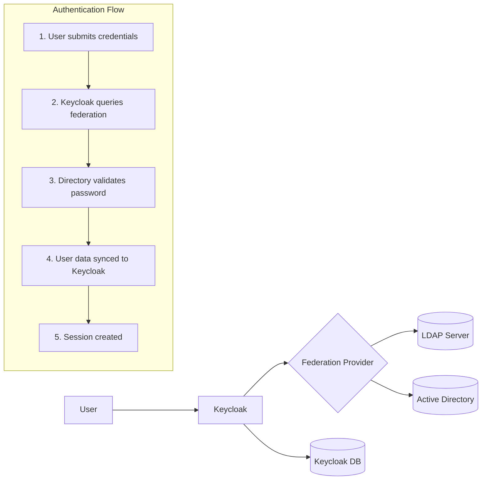
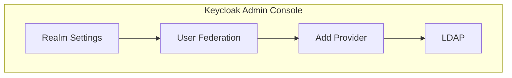
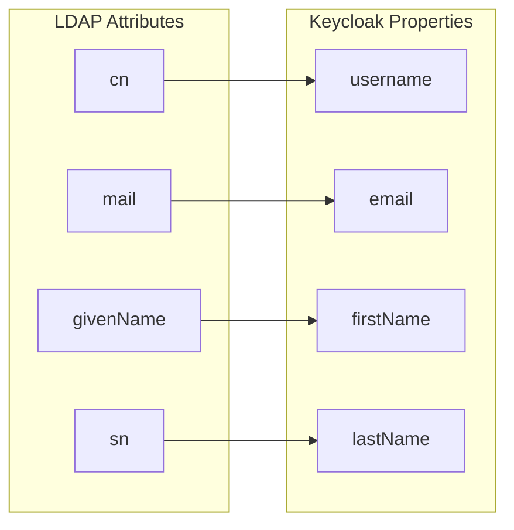
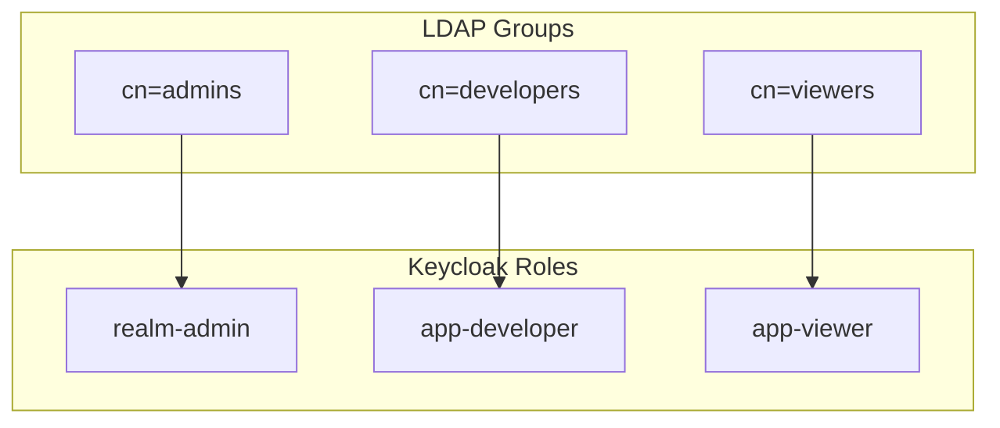
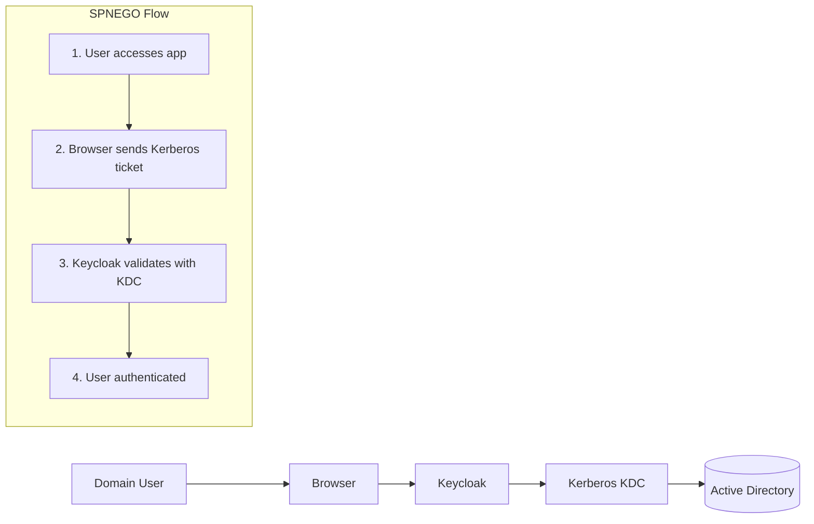

# How to Configure Keycloak Federation (LDAP/AD)

Author: [nawazdhandala](https://www.github.com/nawazdhandala)

Tags: Keycloak, LDAP, Active Directory, Federation, Identity Management, SSO, Authentication, IAM

Description: A practical guide to configuring Keycloak user federation with LDAP and Active Directory, covering connection setup, user synchronization, group mapping, and troubleshooting common issues.

---

Enterprise identity management rarely starts from scratch. Most organizations have years of user data stored in LDAP directories or Active Directory. Keycloak's federation feature lets you connect these existing directories without migrating users, preserving passwords and maintaining your current identity infrastructure.

## Understanding User Federation

User federation allows Keycloak to delegate authentication to external identity stores. When a user logs in, Keycloak queries the federated directory, validates credentials there, and creates a local representation of the user.



## Prerequisites

Before configuring federation, ensure you have:

- Keycloak 22.0 or later running
- Network connectivity to your LDAP/AD server
- Service account credentials with read access
- Base DN and connection details from your directory admin

## Configuring LDAP Federation

### Step 1: Add a New User Federation Provider

Navigate to User Federation in the Keycloak admin console and select LDAP as the provider type.



### Step 2: Configure Connection Settings

The connection settings establish how Keycloak communicates with your directory server. Here is an example configuration for OpenLDAP.

```properties
# Connection URL - use ldaps:// for secure connections
Connection URL: ldaps://ldap.example.com:636

# Bind credentials - service account for directory queries
Bind DN: cn=keycloak,ou=services,dc=example,dc=com
Bind Credential: your-service-account-password

# Connection pooling improves performance
Connection Pooling: ON
Connection Timeout: 5000
```

### Step 3: Configure LDAP Searching

These settings determine how Keycloak finds users in your directory tree.

```properties
# Edit Mode determines what Keycloak can modify
Edit Mode: READ_ONLY

# User search settings
Users DN: ou=people,dc=example,dc=com
Username LDAP Attribute: uid
RDN LDAP Attribute: uid
UUID LDAP Attribute: entryUUID

# Object classes that identify user entries
User Object Classes: inetOrgPerson, organizationalPerson

# Search scope - SUBTREE searches the entire tree below Users DN
Search Scope: SUBTREE
```

### Step 4: Configure Synchronization

Synchronization controls when and how user data flows between LDAP and Keycloak.

```properties
# Import users on first login only (recommended for large directories)
Import Users: ON
Sync Registrations: OFF

# Periodic sync keeps user data current
Periodic Full Sync: ON
Full Sync Period: 86400

# Changed user sync catches updates between full syncs
Periodic Changed Users Sync: ON
Changed Users Sync Period: 3600
```

## Active Directory Configuration

Active Directory requires specific attribute mappings that differ from standard LDAP.

### Connection Settings for AD

Active Directory connection strings follow a specific pattern for domain-joined environments.

```properties
# AD connection using domain controller
Connection URL: ldaps://dc01.corp.example.com:636

# Bind using UPN format (recommended) or DN format
Bind DN: keycloak-svc@corp.example.com
Bind Credential: your-service-account-password

# Enable pagination for large directories
Pagination: ON
```

### AD-Specific LDAP Settings

Active Directory uses different attribute names and object classes than OpenLDAP.

```properties
# AD user settings
Users DN: CN=Users,DC=corp,DC=example,DC=com
Username LDAP Attribute: sAMAccountName
RDN LDAP Attribute: cn
UUID LDAP Attribute: objectGUID

# AD object classes
User Object Classes: person, organizationalPerson, user

# Custom filter to exclude disabled accounts
Custom User LDAP Filter: (&(objectClass=user)(!(userAccountControl:1.2.840.113556.1.4.803:=2)))
```

## Configuring Attribute Mappers

Attribute mappers transform LDAP attributes into Keycloak user properties. Default mappers handle common attributes, but custom mappers extend functionality.

### Default Mapper Configuration

Keycloak creates default mappers automatically. Here is how to verify and adjust them.



### Adding Custom Attribute Mappers

Custom mappers pull additional attributes into Keycloak user profiles. Here is an example mapping employee ID.

Navigate to the LDAP provider settings and select Mappers, then Add Mapper.

```properties
# Employee ID mapper configuration
Name: employee-id-mapper
Mapper Type: user-attribute-ldap-mapper
User Model Attribute: employeeId
LDAP Attribute: employeeNumber
Read Only: ON
Always Read Value From LDAP: ON
Is Mandatory In LDAP: OFF
```

### Hardcoded Attribute Mapper

Sometimes you need to assign a fixed value to all federated users. Hardcoded mappers accomplish this without modifying the directory.

```properties
# Assign all LDAP users to a specific attribute
Name: ldap-source-marker
Mapper Type: hardcoded-attribute-mapper
User Model Attribute Name: identitySource
Attribute Value: corporate-ldap
```

## Group Mapping

Group synchronization imports LDAP groups into Keycloak, enabling role-based access control based on directory membership.

### LDAP Group Mapper

Configure group mapping to import groups and their memberships.

```properties
# Group mapper settings
Name: ldap-group-mapper
Mapper Type: group-ldap-mapper
LDAP Groups DN: ou=groups,dc=example,dc=com
Group Name LDAP Attribute: cn
Group Object Classes: groupOfNames
Membership LDAP Attribute: member
Membership Attribute Type: DN
Mode: READ_ONLY
User Groups Retrieve Strategy: LOAD_GROUPS_BY_MEMBER_ATTRIBUTE
Drop Non-Existing Groups During Sync: OFF
```

### Active Directory Group Mapping

AD uses different group structures with nested group support.

```properties
# AD group mapper
Name: ad-group-mapper
Mapper Type: group-ldap-mapper
LDAP Groups DN: OU=Security Groups,DC=corp,DC=example,DC=com
Group Name LDAP Attribute: cn
Group Object Classes: group
Membership LDAP Attribute: member
Membership Attribute Type: DN
Mode: READ_ONLY

# Enable nested group resolution for AD
Membership User LDAP Attribute: sAMAccountName
```

## Role Mapping from Groups

Map LDAP groups to Keycloak roles for application-level authorization.



### Hardcoded Role Mapper

Assign specific roles to all users from a particular LDAP provider.

```properties
# Assign base role to all LDAP users
Name: ldap-default-role
Mapper Type: hardcoded-role-mapper
Role: corporate-employee
```

## Testing the Configuration

### Connection Test

After saving your configuration, use the Test Connection and Test Authentication buttons in the admin console.

The following script verifies LDAP connectivity from the command line.

```bash
#!/bin/bash
# Test LDAP connectivity before configuring Keycloak

LDAP_HOST="ldap.example.com"
LDAP_PORT="636"
BIND_DN="cn=keycloak,ou=services,dc=example,dc=com"
BASE_DN="ou=people,dc=example,dc=com"

# Test TLS connection
echo "Testing TLS connection..."
openssl s_client -connect ${LDAP_HOST}:${LDAP_PORT} -showcerts </dev/null 2>/dev/null | \
    openssl x509 -noout -subject -dates

# Test LDAP search (requires ldapsearch)
echo "Testing LDAP search..."
ldapsearch -H ldaps://${LDAP_HOST}:${LDAP_PORT} \
    -D "${BIND_DN}" \
    -W \
    -b "${BASE_DN}" \
    "(uid=testuser)" \
    cn mail uid
```

### Sync Users Manually

Trigger a manual sync to verify user import works correctly.

```bash
# Using Keycloak Admin CLI to trigger sync
/opt/keycloak/bin/kcadm.sh config credentials \
    --server http://localhost:8080 \
    --realm master \
    --user admin \
    --password admin

# Trigger full sync for LDAP provider
/opt/keycloak/bin/kcadm.sh create user-storage/<provider-id>/sync \
    -r myrealm \
    -s action=triggerFullSync
```

### Verify User Login

Test authentication with an LDAP user account.

```bash
# Test token request with LDAP credentials
curl -X POST "http://localhost:8080/realms/myrealm/protocol/openid-connect/token" \
    -H "Content-Type: application/x-www-form-urlencoded" \
    -d "client_id=my-app" \
    -d "client_secret=my-secret" \
    -d "grant_type=password" \
    -d "username=ldapuser" \
    -d "password=ldappassword"
```

## High Availability Configuration

Production deployments should connect to multiple directory servers for redundancy.

### Multiple LDAP Servers

Specify multiple servers in the connection URL with failover capability.

```properties
# Space-separated list of LDAP servers
Connection URL: ldaps://ldap1.example.com:636 ldaps://ldap2.example.com:636

# Or use DNS SRV records
Connection URL: ldaps://ldap.example.com:636
Use Truststore SPI: ldapsOnly
```

### Connection Pool Tuning

Optimize connection pooling for high-traffic environments.

```properties
# Connection pool settings
Connection Pooling: ON
Connection Pool Authentication: simple
Connection Pool Debug: OFF
Connection Pool Initial Size: 5
Connection Pool Maximum Size: 50
Connection Pool Preferred Size: 10
Connection Pool Timeout: 300000
```

## Kerberos Integration

Keycloak supports SPNEGO authentication for seamless Windows desktop SSO.



### Kerberos Configuration

Enable Kerberos for true single sign-on with Active Directory.

```properties
# Enable Kerberos
Allow Kerberos Authentication: ON
Kerberos Realm: CORP.EXAMPLE.COM
Server Principal: HTTP/keycloak.corp.example.com@CORP.EXAMPLE.COM
KeyTab: /opt/keycloak/conf/keycloak.keytab
Use Kerberos For Password Authentication: ON
```

### Generate KeyTab File

Create the keytab on your domain controller or use ktpass.

```bash
# On Windows Domain Controller
ktpass -princ HTTP/keycloak.corp.example.com@CORP.EXAMPLE.COM \
    -mapuser CORP\keycloak-svc \
    -pass * \
    -crypto AES256-SHA1 \
    -ptype KRB5_NT_PRINCIPAL \
    -out keycloak.keytab
```

## Troubleshooting Common Issues

### Connection Failures

Certificate issues often cause connection failures with LDAPS.

```bash
# Check certificate chain
openssl s_client -connect ldap.example.com:636 -showcerts

# Import CA certificate into Keycloak truststore
keytool -import -alias ldap-ca \
    -file ldap-ca.crt \
    -keystore /opt/keycloak/conf/truststore.jks \
    -storepass changeit
```

### Authentication Failures

Bind DN format varies between LDAP implementations.

```properties
# OpenLDAP format
Bind DN: cn=keycloak,ou=services,dc=example,dc=com

# Active Directory DN format
Bind DN: CN=Keycloak Service,OU=Service Accounts,DC=corp,DC=example,DC=com

# Active Directory UPN format (often more reliable)
Bind DN: keycloak-svc@corp.example.com
```

### User Search Issues

Debug user search problems by testing filters directly.

```bash
# Test LDAP filter
ldapsearch -H ldaps://ldap.example.com:636 \
    -D "cn=keycloak,ou=services,dc=example,dc=com" \
    -W \
    -b "ou=people,dc=example,dc=com" \
    "(&(objectClass=inetOrgPerson)(uid=testuser))"
```

### Enable Debug Logging

Enable LDAP debug logging in Keycloak to diagnose issues.

```bash
# Set log level via environment variable
export KC_LOG_LEVEL=org.keycloak.storage.ldap:DEBUG

# Or in keycloak.conf
log-level=org.keycloak.storage.ldap:DEBUG
```

## Performance Optimization

### Caching Configuration

Keycloak caches LDAP users locally to reduce directory queries.

```properties
# Cache settings
Cache Policy: DEFAULT
Max Lifespan: 86400000
Eviction Day: (empty for no specific day)
Eviction Hour: (empty for no specific hour)
Eviction Minute: (empty for no specific minute)
```

### Pagination for Large Directories

Enable pagination when querying directories with thousands of users.

```properties
# Enable pagination
Pagination: ON
Batch Size for Synchronization: 1000
```

### Read-Only vs Writable Mode

Read-only mode performs better and prevents accidental modifications.

```properties
# Edit mode options
# READ_ONLY - Keycloak cannot modify LDAP (recommended)
# WRITABLE - Keycloak can modify LDAP attributes
# UNSYNCED - Users exist in Keycloak only after LDAP auth
Edit Mode: READ_ONLY
```

## Security Best Practices

### Use LDAPS Always

Never use plain LDAP in production environments.

```properties
# Always use LDAPS (port 636) or StartTLS
Connection URL: ldaps://ldap.example.com:636

# Alternative: use StartTLS on standard port
Connection URL: ldap://ldap.example.com:389
Use Truststore SPI: ldapsOnly
Start TLS: ON
```

### Service Account Permissions

Create a dedicated service account with minimal permissions.

```ldif
# OpenLDAP example - create service account
dn: cn=keycloak,ou=services,dc=example,dc=com
objectClass: organizationalRole
objectClass: simpleSecurityObject
cn: keycloak
userPassword: {SSHA}encrypted-password-here

# Grant read-only access
dn: olcDatabase={1}mdb,cn=config
changetype: modify
add: olcAccess
olcAccess: {2}to dn.subtree="ou=people,dc=example,dc=com"
    by dn.exact="cn=keycloak,ou=services,dc=example,dc=com" read
    by * none
```

### Audit Logging

Enable audit logging to track federation events.

```bash
# Enable audit logging in Keycloak
/opt/keycloak/bin/kc.sh start \
    --spi-events-listener-jboss-logging-success-level=info \
    --spi-events-listener-jboss-logging-error-level=error
```

## Complete Configuration Example

Here is a complete LDAP federation configuration for Active Directory.

```json
{
  "name": "corporate-ad",
  "providerId": "ldap",
  "providerType": "org.keycloak.storage.UserStorageProvider",
  "config": {
    "connectionUrl": ["ldaps://dc01.corp.example.com:636"],
    "bindDn": ["keycloak-svc@corp.example.com"],
    "bindCredential": ["service-account-password"],
    "usersDn": ["OU=Users,DC=corp,DC=example,DC=com"],
    "usernameLDAPAttribute": ["sAMAccountName"],
    "rdnLDAPAttribute": ["cn"],
    "uuidLDAPAttribute": ["objectGUID"],
    "userObjectClasses": ["person, organizationalPerson, user"],
    "editMode": ["READ_ONLY"],
    "syncRegistrations": ["false"],
    "vendor": ["ad"],
    "searchScope": ["2"],
    "pagination": ["true"],
    "batchSizeForSync": ["1000"],
    "fullSyncPeriod": ["86400"],
    "changedSyncPeriod": ["3600"],
    "connectionPooling": ["true"],
    "connectionTimeout": ["5000"],
    "trustEmail": ["true"],
    "importEnabled": ["true"]
  }
}
```

---

Proper LDAP federation configuration bridges your existing identity infrastructure with modern authentication protocols. Take time to test thoroughly in a staging environment before deploying to production, and monitor synchronization logs regularly to catch issues early. With the right configuration, your users gain seamless access across all applications while you maintain centralized identity management.
