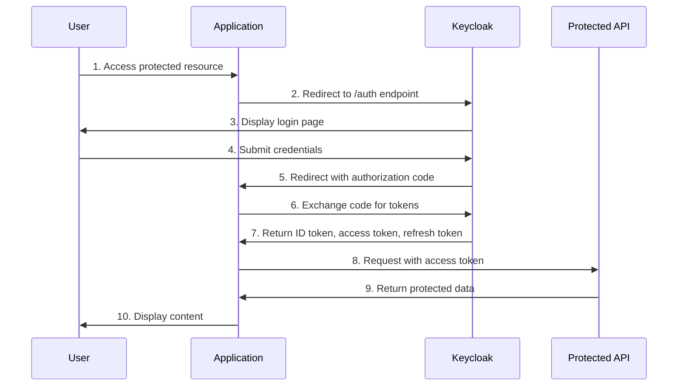
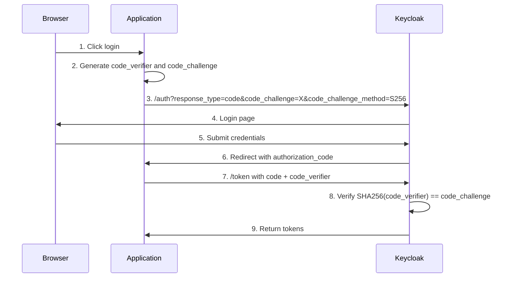
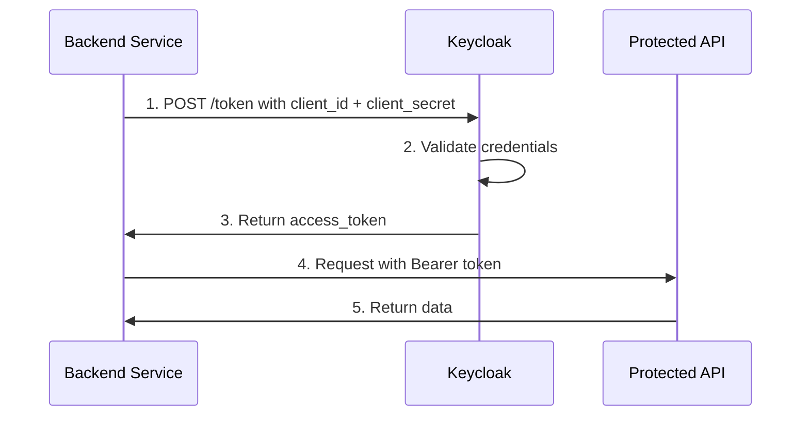

# How to Implement Keycloak OIDC

Author: [nawazdhandala](https://www.github.com/nawazdhandala)

Tags: Keycloak, OIDC, Authentication, Identity, OAuth2, Security, SSO

Description: A comprehensive guide to implementing OpenID Connect (OIDC) authentication with Keycloak, covering client setup, token management, flow types, integration patterns, and production best practices.

---

> OIDC provides a standardized identity layer on top of OAuth 2.0, enabling secure authentication while maintaining the flexibility and simplicity of modern web protocols.

## Understanding OpenID Connect

OpenID Connect (OIDC) is an identity layer built on top of the OAuth 2.0 protocol. While OAuth 2.0 handles authorization (what you can access), OIDC adds authentication (who you are). Keycloak implements OIDC as a certified OpenID Provider, making it an excellent choice for centralized identity management.

### Core OIDC Concepts

Before implementing OIDC with Keycloak, you need to understand these fundamental concepts:

- **ID Token**: A JWT that contains user identity information (claims). This proves who the user is.
- **Access Token**: A credential used to access protected resources. This proves what the user can do.
- **Refresh Token**: A long-lived token used to obtain new access tokens without re-authentication.
- **UserInfo Endpoint**: An API endpoint that returns additional claims about the authenticated user.
- **Scopes**: Define what information and access the application requests (openid, profile, email, etc.).
- **Claims**: Individual pieces of information about the user embedded in tokens.

### OIDC Authentication Flow Overview

The following diagram illustrates the standard Authorization Code flow, which is the most secure and commonly used OIDC flow:



---

## Setting Up Keycloak for OIDC

Before integrating applications, you need to configure Keycloak properly. This section covers the essential setup steps.

### Creating a Realm

A realm is a space where you manage objects like users, applications, roles, and groups. Each realm is isolated from others.

The following JSON shows a minimal realm configuration with sensible defaults for OIDC:

```json
{
  "realm": "my-application",
  "enabled": true,
  "displayName": "My Application",

  "sslRequired": "external",
  "registrationAllowed": false,
  "loginWithEmailAllowed": true,
  "duplicateEmailsAllowed": false,
  "verifyEmail": true,

  "defaultSignatureAlgorithm": "RS256",

  "accessTokenLifespan": 300,
  "accessTokenLifespanForImplicitFlow": 900,
  "ssoSessionIdleTimeout": 1800,
  "ssoSessionMaxLifespan": 36000,

  "offlineSessionIdleTimeout": 2592000,
  "offlineSessionMaxLifespanEnabled": true,
  "offlineSessionMaxLifespan": 5184000,

  "browserSecurityHeaders": {
    "contentSecurityPolicyReportOnly": "",
    "xContentTypeOptions": "nosniff",
    "xRobotsTag": "none",
    "xFrameOptions": "SAMEORIGIN",
    "xXSSProtection": "1; mode=block",
    "strictTransportSecurity": "max-age=31536000; includeSubDomains"
  }
}
```

### Creating an OIDC Client

The client configuration determines how your application authenticates with Keycloak. Different application types require different configurations.

#### Confidential Client for Backend Applications

Confidential clients can securely store secrets. Use this type for server-side applications:

```json
{
  "clientId": "my-backend-api",
  "name": "My Backend API",
  "description": "Backend service that handles user authentication",
  "enabled": true,
  "protocol": "openid-connect",

  "publicClient": false,
  "clientAuthenticatorType": "client-secret",

  "redirectUris": [
    "https://api.example.com/auth/callback",
    "https://api.example.com/auth/silent-refresh"
  ],

  "webOrigins": [
    "https://api.example.com"
  ],

  "standardFlowEnabled": true,
  "implicitFlowEnabled": false,
  "directAccessGrantsEnabled": false,
  "serviceAccountsEnabled": false,

  "authorizationServicesEnabled": false,

  "attributes": {
    "pkce.code.challenge.method": "S256",
    "access.token.lifespan": "300",
    "oauth2.device.authorization.grant.enabled": "false",
    "backchannel.logout.session.required": "true",
    "backchannel.logout.revoke.offline.tokens": "false"
  }
}
```

#### Public Client for Single Page Applications

Public clients cannot securely store secrets. SPAs and mobile apps fall into this category:

```json
{
  "clientId": "my-spa",
  "name": "My Single Page Application",
  "enabled": true,
  "protocol": "openid-connect",

  "publicClient": true,

  "redirectUris": [
    "https://app.example.com/callback",
    "https://app.example.com/silent-renew.html"
  ],

  "webOrigins": [
    "https://app.example.com"
  ],

  "standardFlowEnabled": true,
  "implicitFlowEnabled": false,
  "directAccessGrantsEnabled": false,

  "attributes": {
    "pkce.code.challenge.method": "S256",
    "post.logout.redirect.uris": "https://app.example.com/logged-out"
  }
}
```

### Creating Clients via Admin CLI

The following bash commands demonstrate creating clients programmatically, which is useful for automation and infrastructure as code:

```bash
# First, authenticate with the Keycloak admin CLI
/opt/keycloak/bin/kcadm.sh config credentials \
  --server https://keycloak.example.com \
  --realm master \
  --user admin \
  --password "$KEYCLOAK_ADMIN_PASSWORD"

# Create a confidential OIDC client
/opt/keycloak/bin/kcadm.sh create clients \
  -r my-application \
  -s clientId=my-backend-service \
  -s enabled=true \
  -s protocol=openid-connect \
  -s publicClient=false \
  -s 'redirectUris=["https://api.example.com/callback"]' \
  -s 'webOrigins=["https://api.example.com"]' \
  -s standardFlowEnabled=true \
  -s directAccessGrantsEnabled=false \
  -s 'attributes={"pkce.code.challenge.method":"S256"}'

# Retrieve the client secret for configuration
CLIENT_UUID=$(/opt/keycloak/bin/kcadm.sh get clients \
  -r my-application \
  -q clientId=my-backend-service \
  --fields id \
  --format csv \
  --noquotes | tail -1)

/opt/keycloak/bin/kcadm.sh get clients/$CLIENT_UUID/client-secret \
  -r my-application
```

---

## OIDC Flow Types

Keycloak supports multiple OIDC flows. Choosing the right one depends on your application type and security requirements.

### Authorization Code Flow with PKCE

This is the recommended flow for most applications. PKCE (Proof Key for Code Exchange) adds an extra layer of security, especially important for public clients.



The following JavaScript implementation shows how to perform the Authorization Code flow with PKCE:

```javascript
// PKCE helper functions for generating the code challenge
// These functions implement the SHA-256 hashing required by PKCE

function generateCodeVerifier() {
  // Generate a random 32-byte string and encode it as base64url
  const array = new Uint8Array(32);
  crypto.getRandomValues(array);
  return base64UrlEncode(array);
}

async function generateCodeChallenge(verifier) {
  // Hash the verifier using SHA-256 and encode as base64url
  const encoder = new TextEncoder();
  const data = encoder.encode(verifier);
  const hash = await crypto.subtle.digest('SHA-256', data);
  return base64UrlEncode(new Uint8Array(hash));
}

function base64UrlEncode(buffer) {
  // Convert to base64 and make it URL-safe
  return btoa(String.fromCharCode(...buffer))
    .replace(/\+/g, '-')
    .replace(/\//g, '_')
    .replace(/=+$/, '');
}

// Main authentication class implementing the OIDC flow
class OIDCAuthenticator {
  constructor(config) {
    this.issuer = config.issuer;
    this.clientId = config.clientId;
    this.redirectUri = config.redirectUri;
    this.scopes = config.scopes || ['openid', 'profile', 'email'];
  }

  async login() {
    // Step 1: Generate PKCE values
    const codeVerifier = generateCodeVerifier();
    const codeChallenge = await generateCodeChallenge(codeVerifier);

    // Store verifier for later use in token exchange
    sessionStorage.setItem('pkce_code_verifier', codeVerifier);

    // Generate state for CSRF protection
    const state = generateCodeVerifier();
    sessionStorage.setItem('oauth_state', state);

    // Step 2: Build authorization URL
    const authUrl = new URL(`${this.issuer}/protocol/openid-connect/auth`);
    authUrl.searchParams.set('response_type', 'code');
    authUrl.searchParams.set('client_id', this.clientId);
    authUrl.searchParams.set('redirect_uri', this.redirectUri);
    authUrl.searchParams.set('scope', this.scopes.join(' '));
    authUrl.searchParams.set('state', state);
    authUrl.searchParams.set('code_challenge', codeChallenge);
    authUrl.searchParams.set('code_challenge_method', 'S256');

    // Step 3: Redirect to Keycloak
    window.location.href = authUrl.toString();
  }

  async handleCallback() {
    const params = new URLSearchParams(window.location.search);
    const code = params.get('code');
    const state = params.get('state');
    const error = params.get('error');

    // Check for errors from Keycloak
    if (error) {
      throw new Error(`Authentication error: ${error}`);
    }

    // Verify state to prevent CSRF attacks
    const savedState = sessionStorage.getItem('oauth_state');
    if (state !== savedState) {
      throw new Error('State mismatch - possible CSRF attack');
    }

    // Retrieve the code verifier
    const codeVerifier = sessionStorage.getItem('pkce_code_verifier');
    if (!codeVerifier) {
      throw new Error('Code verifier not found');
    }

    // Exchange code for tokens
    const tokenResponse = await fetch(
      `${this.issuer}/protocol/openid-connect/token`,
      {
        method: 'POST',
        headers: {
          'Content-Type': 'application/x-www-form-urlencoded'
        },
        body: new URLSearchParams({
          grant_type: 'authorization_code',
          client_id: this.clientId,
          code: code,
          redirect_uri: this.redirectUri,
          code_verifier: codeVerifier
        })
      }
    );

    if (!tokenResponse.ok) {
      const error = await tokenResponse.json();
      throw new Error(`Token exchange failed: ${error.error_description}`);
    }

    const tokens = await tokenResponse.json();

    // Clean up session storage
    sessionStorage.removeItem('pkce_code_verifier');
    sessionStorage.removeItem('oauth_state');

    return tokens;
  }
}

// Usage example
const auth = new OIDCAuthenticator({
  issuer: 'https://keycloak.example.com/realms/my-application',
  clientId: 'my-spa',
  redirectUri: 'https://app.example.com/callback',
  scopes: ['openid', 'profile', 'email', 'roles']
});

// Start login
auth.login();

// In your callback page
auth.handleCallback()
  .then(tokens => {
    console.log('ID Token:', tokens.id_token);
    console.log('Access Token:', tokens.access_token);
    // Store tokens securely and proceed with application
  })
  .catch(error => {
    console.error('Authentication failed:', error);
  });
```

### Client Credentials Flow

Use this flow for machine-to-machine communication where no user is involved:



The following Python implementation shows how to use the client credentials flow for service-to-service authentication:

```python
import requests
from datetime import datetime, timedelta
from typing import Optional
import threading


class KeycloakServiceClient:
    """
    A client for obtaining and managing access tokens using the
    client credentials flow. Suitable for backend services that
    need to authenticate with other services.
    """

    def __init__(
        self,
        server_url: str,
        realm: str,
        client_id: str,
        client_secret: str
    ):
        self.token_url = f"{server_url}/realms/{realm}/protocol/openid-connect/token"
        self.client_id = client_id
        self.client_secret = client_secret

        # Token cache to avoid unnecessary token requests
        self._access_token: Optional[str] = None
        self._token_expiry: Optional[datetime] = None
        self._lock = threading.Lock()

    def get_access_token(self) -> str:
        """
        Get a valid access token, refreshing if necessary.
        Thread-safe implementation with token caching.
        """
        with self._lock:
            # Check if we have a valid cached token
            # Refresh 30 seconds before expiry to avoid edge cases
            if (
                self._access_token and
                self._token_expiry and
                datetime.now() < self._token_expiry - timedelta(seconds=30)
            ):
                return self._access_token

            # Request a new token
            response = requests.post(
                self.token_url,
                data={
                    'grant_type': 'client_credentials',
                    'client_id': self.client_id,
                    'client_secret': self.client_secret,
                    'scope': 'openid'
                },
                headers={
                    'Content-Type': 'application/x-www-form-urlencoded'
                }
            )

            response.raise_for_status()
            token_data = response.json()

            # Cache the token
            self._access_token = token_data['access_token']
            self._token_expiry = datetime.now() + timedelta(
                seconds=token_data['expires_in']
            )

            return self._access_token

    def call_protected_api(self, url: str, method: str = 'GET', **kwargs) -> requests.Response:
        """
        Make an authenticated request to a protected API.
        Automatically includes the Bearer token in the Authorization header.
        """
        token = self.get_access_token()

        headers = kwargs.pop('headers', {})
        headers['Authorization'] = f'Bearer {token}'

        return requests.request(method, url, headers=headers, **kwargs)


# Usage example for a background job or service
client = KeycloakServiceClient(
    server_url='https://keycloak.example.com',
    realm='my-application',
    client_id='my-background-service',
    client_secret='your-client-secret'
)

# Make authenticated requests
response = client.call_protected_api(
    'https://api.example.com/internal/data',
    method='POST',
    json={'action': 'process'}
)
print(response.json())
```

### Direct Access Grants (Resource Owner Password)

This flow should only be used for legacy applications that cannot redirect to Keycloak. It is less secure because the application handles user credentials directly:

```python
# WARNING: Only use this flow for legacy applications
# that cannot implement the authorization code flow

def authenticate_with_password(
    server_url: str,
    realm: str,
    client_id: str,
    client_secret: str,
    username: str,
    password: str
) -> dict:
    """
    Authenticate a user with username and password.
    This flow should be avoided when possible as it requires
    the application to handle user credentials.
    """
    token_url = f"{server_url}/realms/{realm}/protocol/openid-connect/token"

    response = requests.post(
        token_url,
        data={
            'grant_type': 'password',
            'client_id': client_id,
            'client_secret': client_secret,
            'username': username,
            'password': password,
            'scope': 'openid profile email'
        }
    )

    response.raise_for_status()
    return response.json()
```

---

## Token Validation and Management

Proper token validation is critical for security. This section covers how to validate and manage OIDC tokens.

### Understanding Token Structure

OIDC tokens are JWTs (JSON Web Tokens) consisting of three parts: header, payload, and signature. The following shows a typical Keycloak access token structure:

```json
{
  "header": {
    "alg": "RS256",
    "typ": "JWT",
    "kid": "key-id-from-keycloak"
  },
  "payload": {
    "exp": 1738500000,
    "iat": 1738499700,
    "auth_time": 1738499700,
    "jti": "unique-token-id",
    "iss": "https://keycloak.example.com/realms/my-application",
    "aud": "account",
    "sub": "user-uuid",
    "typ": "Bearer",
    "azp": "my-backend-api",
    "session_state": "session-uuid",
    "acr": "1",
    "allowed-origins": ["https://api.example.com"],
    "realm_access": {
      "roles": ["user", "admin"]
    },
    "resource_access": {
      "my-backend-api": {
        "roles": ["api-user", "api-admin"]
      }
    },
    "scope": "openid email profile",
    "email_verified": true,
    "name": "John Doe",
    "preferred_username": "johndoe",
    "given_name": "John",
    "family_name": "Doe",
    "email": "john.doe@example.com"
  }
}
```

### Server-Side Token Validation

The following Node.js implementation shows comprehensive token validation for a backend API:

```javascript
const jwt = require('jsonwebtoken');
const jwksClient = require('jwks-rsa');

// Configure the JWKS client to fetch public keys from Keycloak
// This allows automatic key rotation without service restarts
const client = jwksClient({
  jwksUri: 'https://keycloak.example.com/realms/my-application/protocol/openid-connect/certs',
  cache: true,
  cacheMaxAge: 600000, // Cache keys for 10 minutes
  rateLimit: true,
  jwksRequestsPerMinute: 10
});

// Function to retrieve the signing key from Keycloak
function getSigningKey(header, callback) {
  client.getSigningKey(header.kid, (err, key) => {
    if (err) {
      return callback(err);
    }
    const signingKey = key.publicKey || key.rsaPublicKey;
    callback(null, signingKey);
  });
}

// Comprehensive token validation function
async function validateAccessToken(token) {
  return new Promise((resolve, reject) => {
    jwt.verify(
      token,
      getSigningKey,
      {
        // Verify the token was issued by our Keycloak realm
        issuer: 'https://keycloak.example.com/realms/my-application',

        // Verify the token is intended for our application
        audience: 'account',

        // Use RS256 algorithm as configured in Keycloak
        algorithms: ['RS256'],

        // Additional validation options
        clockTolerance: 30 // Allow 30 seconds clock skew
      },
      (err, decoded) => {
        if (err) {
          return reject(err);
        }

        // Additional custom validations

        // Check if token type is Bearer
        if (decoded.typ !== 'Bearer') {
          return reject(new Error('Invalid token type'));
        }

        // Verify the authorized party matches our client
        if (decoded.azp !== 'my-backend-api') {
          return reject(new Error('Token not issued for this client'));
        }

        resolve(decoded);
      }
    );
  });
}

// Express middleware for protecting routes
function authenticateToken(requiredRoles = []) {
  return async (req, res, next) => {
    const authHeader = req.headers.authorization;

    if (!authHeader || !authHeader.startsWith('Bearer ')) {
      return res.status(401).json({ error: 'Missing or invalid authorization header' });
    }

    const token = authHeader.substring(7);

    try {
      const decoded = await validateAccessToken(token);

      // Check required roles if specified
      if (requiredRoles.length > 0) {
        const userRoles = decoded.realm_access?.roles || [];
        const clientRoles = decoded.resource_access?.['my-backend-api']?.roles || [];
        const allRoles = [...userRoles, ...clientRoles];

        const hasRequiredRole = requiredRoles.some(role => allRoles.includes(role));

        if (!hasRequiredRole) {
          return res.status(403).json({
            error: 'Insufficient permissions',
            required: requiredRoles,
            actual: allRoles
          });
        }
      }

      // Attach user info to request for downstream handlers
      req.user = {
        id: decoded.sub,
        username: decoded.preferred_username,
        email: decoded.email,
        name: decoded.name,
        roles: decoded.realm_access?.roles || []
      };

      next();
    } catch (error) {
      console.error('Token validation failed:', error.message);

      if (error.name === 'TokenExpiredError') {
        return res.status(401).json({ error: 'Token expired' });
      }

      return res.status(401).json({ error: 'Invalid token' });
    }
  };
}

// Usage in Express routes
const express = require('express');
const app = express();

// Public route - no authentication required
app.get('/api/health', (req, res) => {
  res.json({ status: 'healthy' });
});

// Protected route - requires valid token
app.get('/api/profile', authenticateToken(), (req, res) => {
  res.json({ user: req.user });
});

// Protected route - requires specific role
app.get('/api/admin/users', authenticateToken(['admin']), (req, res) => {
  // Only users with 'admin' role can access this
  res.json({ users: [] });
});

app.listen(3000);
```

### Token Refresh Implementation

The following implementation shows how to handle token refresh in a React application:

```javascript
import { createContext, useContext, useEffect, useRef, useState } from 'react';

// Token management context for React applications
const AuthContext = createContext(null);

export function AuthProvider({ children, config }) {
  const [tokens, setTokens] = useState(null);
  const [user, setUser] = useState(null);
  const [isLoading, setIsLoading] = useState(true);
  const refreshTimerRef = useRef(null);

  // Parse JWT to extract expiration time
  function parseJwt(token) {
    try {
      const base64Payload = token.split('.')[1];
      const payload = atob(base64Payload);
      return JSON.parse(payload);
    } catch (e) {
      return null;
    }
  }

  // Schedule token refresh before expiration
  function scheduleTokenRefresh(accessToken, refreshToken) {
    // Clear any existing timer
    if (refreshTimerRef.current) {
      clearTimeout(refreshTimerRef.current);
    }

    const decoded = parseJwt(accessToken);
    if (!decoded) return;

    // Calculate time until refresh (refresh 60 seconds before expiry)
    const expiresAt = decoded.exp * 1000;
    const refreshAt = expiresAt - Date.now() - 60000;

    if (refreshAt > 0) {
      refreshTimerRef.current = setTimeout(() => {
        performTokenRefresh(refreshToken);
      }, refreshAt);
    } else {
      // Token already expired or about to expire, refresh immediately
      performTokenRefresh(refreshToken);
    }
  }

  // Perform the token refresh
  async function performTokenRefresh(refreshToken) {
    try {
      const response = await fetch(
        `${config.issuer}/protocol/openid-connect/token`,
        {
          method: 'POST',
          headers: {
            'Content-Type': 'application/x-www-form-urlencoded'
          },
          body: new URLSearchParams({
            grant_type: 'refresh_token',
            client_id: config.clientId,
            refresh_token: refreshToken
          })
        }
      );

      if (!response.ok) {
        throw new Error('Token refresh failed');
      }

      const newTokens = await response.json();

      // Update state with new tokens
      setTokens(newTokens);

      // Store tokens securely (consider using secure storage)
      sessionStorage.setItem('auth_tokens', JSON.stringify(newTokens));

      // Schedule next refresh
      scheduleTokenRefresh(newTokens.access_token, newTokens.refresh_token);

      return newTokens;
    } catch (error) {
      console.error('Failed to refresh token:', error);
      // Clear auth state and redirect to login
      logout();
      throw error;
    }
  }

  // Initialize auth state on mount
  useEffect(() => {
    const storedTokens = sessionStorage.getItem('auth_tokens');

    if (storedTokens) {
      try {
        const parsedTokens = JSON.parse(storedTokens);
        const decoded = parseJwt(parsedTokens.access_token);

        if (decoded && decoded.exp * 1000 > Date.now()) {
          // Token is still valid
          setTokens(parsedTokens);
          setUser({
            id: decoded.sub,
            username: decoded.preferred_username,
            email: decoded.email,
            name: decoded.name
          });
          scheduleTokenRefresh(parsedTokens.access_token, parsedTokens.refresh_token);
        } else if (parsedTokens.refresh_token) {
          // Access token expired, try to refresh
          performTokenRefresh(parsedTokens.refresh_token);
        }
      } catch (e) {
        sessionStorage.removeItem('auth_tokens');
      }
    }

    setIsLoading(false);

    // Cleanup on unmount
    return () => {
      if (refreshTimerRef.current) {
        clearTimeout(refreshTimerRef.current);
      }
    };
  }, []);

  function logout() {
    // Clear timers
    if (refreshTimerRef.current) {
      clearTimeout(refreshTimerRef.current);
    }

    // Clear state
    setTokens(null);
    setUser(null);
    sessionStorage.removeItem('auth_tokens');

    // Redirect to Keycloak logout
    const logoutUrl = new URL(`${config.issuer}/protocol/openid-connect/logout`);
    logoutUrl.searchParams.set('post_logout_redirect_uri', config.postLogoutRedirectUri);
    logoutUrl.searchParams.set('client_id', config.clientId);

    window.location.href = logoutUrl.toString();
  }

  // Provide a function to get fresh access token for API calls
  async function getAccessToken() {
    if (!tokens) {
      throw new Error('Not authenticated');
    }

    const decoded = parseJwt(tokens.access_token);

    // If token expires in less than 30 seconds, refresh first
    if (decoded && decoded.exp * 1000 - Date.now() < 30000) {
      const newTokens = await performTokenRefresh(tokens.refresh_token);
      return newTokens.access_token;
    }

    return tokens.access_token;
  }

  const value = {
    user,
    isAuthenticated: !!tokens,
    isLoading,
    getAccessToken,
    logout
  };

  return (
    <AuthContext.Provider value={value}>
      {children}
    </AuthContext.Provider>
  );
}

export function useAuth() {
  const context = useContext(AuthContext);
  if (!context) {
    throw new Error('useAuth must be used within an AuthProvider');
  }
  return context;
}
```

---

## Customizing Tokens with Protocol Mappers

Protocol mappers allow you to customize what information is included in tokens. This is essential for including application-specific claims.

### Common Mapper Configurations

The following JSON shows mapper configurations for common use cases:

```json
[
  {
    "name": "department-mapper",
    "protocol": "openid-connect",
    "protocolMapper": "oidc-usermodel-attribute-mapper",
    "consentRequired": false,
    "config": {
      "userinfo.token.claim": "true",
      "id.token.claim": "true",
      "access.token.claim": "true",
      "claim.name": "department",
      "user.attribute": "department",
      "jsonType.label": "String"
    }
  },
  {
    "name": "groups-mapper",
    "protocol": "openid-connect",
    "protocolMapper": "oidc-group-membership-mapper",
    "consentRequired": false,
    "config": {
      "full.path": "false",
      "id.token.claim": "true",
      "access.token.claim": "true",
      "claim.name": "groups",
      "userinfo.token.claim": "true"
    }
  },
  {
    "name": "audience-mapper",
    "protocol": "openid-connect",
    "protocolMapper": "oidc-audience-mapper",
    "consentRequired": false,
    "config": {
      "included.client.audience": "my-api-service",
      "id.token.claim": "false",
      "access.token.claim": "true"
    }
  }
]
```

### Creating Mappers via Admin CLI

The following commands show how to create protocol mappers programmatically:

```bash
# Add a custom user attribute to the access token
/opt/keycloak/bin/kcadm.sh create clients/$CLIENT_UUID/protocol-mappers/models \
  -r my-application \
  -s name=employee-id-mapper \
  -s protocol=openid-connect \
  -s protocolMapper=oidc-usermodel-attribute-mapper \
  -s 'config."user.attribute"=employee_id' \
  -s 'config."claim.name"=employee_id' \
  -s 'config."jsonType.label"=String' \
  -s 'config."id.token.claim"=true' \
  -s 'config."access.token.claim"=true' \
  -s 'config."userinfo.token.claim"=true'

# Add a hardcoded claim (useful for identifying the environment)
/opt/keycloak/bin/kcadm.sh create clients/$CLIENT_UUID/protocol-mappers/models \
  -r my-application \
  -s name=environment-mapper \
  -s protocol=openid-connect \
  -s protocolMapper=oidc-hardcoded-claim-mapper \
  -s 'config."claim.name"=environment' \
  -s 'config."claim.value"=production' \
  -s 'config."jsonType.label"=String' \
  -s 'config."access.token.claim"=true'
```

---

## Integrating with Popular Frameworks

### Spring Boot Integration

The following shows how to integrate Keycloak OIDC with a Spring Boot application:

```java
// application.yml configuration
/*
spring:
  security:
    oauth2:
      resourceserver:
        jwt:
          issuer-uri: https://keycloak.example.com/realms/my-application
          jwk-set-uri: https://keycloak.example.com/realms/my-application/protocol/openid-connect/certs
*/

// Security configuration class
import org.springframework.context.annotation.Bean;
import org.springframework.context.annotation.Configuration;
import org.springframework.security.config.annotation.method.configuration.EnableMethodSecurity;
import org.springframework.security.config.annotation.web.builders.HttpSecurity;
import org.springframework.security.config.annotation.web.configuration.EnableWebSecurity;
import org.springframework.security.config.http.SessionCreationPolicy;
import org.springframework.security.oauth2.server.resource.authentication.JwtAuthenticationConverter;
import org.springframework.security.oauth2.server.resource.authentication.JwtGrantedAuthoritiesConverter;
import org.springframework.security.web.SecurityFilterChain;

@Configuration
@EnableWebSecurity
@EnableMethodSecurity
public class SecurityConfig {

    @Bean
    public SecurityFilterChain filterChain(HttpSecurity http) throws Exception {
        http
            // Disable CSRF for stateless API
            .csrf(csrf -> csrf.disable())

            // Stateless session management
            .sessionManagement(session ->
                session.sessionCreationPolicy(SessionCreationPolicy.STATELESS)
            )

            // Configure authorization rules
            .authorizeHttpRequests(auth -> auth
                .requestMatchers("/api/public/**").permitAll()
                .requestMatchers("/api/health").permitAll()
                .requestMatchers("/api/admin/**").hasRole("ADMIN")
                .anyRequest().authenticated()
            )

            // Configure OAuth2 resource server with JWT
            .oauth2ResourceServer(oauth2 -> oauth2
                .jwt(jwt -> jwt
                    .jwtAuthenticationConverter(jwtAuthenticationConverter())
                )
            );

        return http.build();
    }

    /**
     * Custom JWT converter to extract roles from Keycloak token structure.
     * Keycloak stores roles in realm_access.roles and resource_access.{client}.roles
     */
    @Bean
    public JwtAuthenticationConverter jwtAuthenticationConverter() {
        JwtGrantedAuthoritiesConverter grantedAuthoritiesConverter =
            new JwtGrantedAuthoritiesConverter();

        // Keycloak roles are in realm_access.roles
        grantedAuthoritiesConverter.setAuthoritiesClaimName("realm_access.roles");
        grantedAuthoritiesConverter.setAuthorityPrefix("ROLE_");

        JwtAuthenticationConverter jwtAuthenticationConverter =
            new JwtAuthenticationConverter();
        jwtAuthenticationConverter.setJwtGrantedAuthoritiesConverter(
            new KeycloakRoleConverter()
        );

        return jwtAuthenticationConverter;
    }
}

// Custom converter to handle Keycloak's nested role structure
import org.springframework.core.convert.converter.Converter;
import org.springframework.security.core.GrantedAuthority;
import org.springframework.security.core.authority.SimpleGrantedAuthority;
import org.springframework.security.oauth2.jwt.Jwt;

import java.util.ArrayList;
import java.util.Collection;
import java.util.List;
import java.util.Map;
import java.util.stream.Collectors;

public class KeycloakRoleConverter implements Converter<Jwt, Collection<GrantedAuthority>> {

    @Override
    public Collection<GrantedAuthority> convert(Jwt jwt) {
        List<GrantedAuthority> authorities = new ArrayList<>();

        // Extract realm roles
        Map<String, Object> realmAccess = jwt.getClaim("realm_access");
        if (realmAccess != null && realmAccess.containsKey("roles")) {
            List<String> roles = (List<String>) realmAccess.get("roles");
            authorities.addAll(
                roles.stream()
                    .map(role -> new SimpleGrantedAuthority("ROLE_" + role.toUpperCase()))
                    .collect(Collectors.toList())
            );
        }

        // Extract client-specific roles
        Map<String, Object> resourceAccess = jwt.getClaim("resource_access");
        if (resourceAccess != null) {
            resourceAccess.forEach((clientId, access) -> {
                Map<String, Object> clientAccess = (Map<String, Object>) access;
                if (clientAccess.containsKey("roles")) {
                    List<String> clientRoles = (List<String>) clientAccess.get("roles");
                    authorities.addAll(
                        clientRoles.stream()
                            .map(role -> new SimpleGrantedAuthority(
                                "ROLE_" + clientId.toUpperCase() + "_" + role.toUpperCase()
                            ))
                            .collect(Collectors.toList())
                    );
                }
            });
        }

        return authorities;
    }
}
```

### FastAPI Integration

The following Python implementation shows Keycloak OIDC integration with FastAPI:

```python
from fastapi import FastAPI, Depends, HTTPException, status
from fastapi.security import OAuth2AuthorizationCodeBearer
from jose import jwt, JWTError
from pydantic import BaseModel
from typing import List, Optional
import httpx
from functools import lru_cache

app = FastAPI()

# Configuration
KEYCLOAK_URL = "https://keycloak.example.com"
REALM = "my-application"
CLIENT_ID = "my-fastapi-app"

# OIDC endpoints
ISSUER = f"{KEYCLOAK_URL}/realms/{REALM}"
JWKS_URL = f"{ISSUER}/protocol/openid-connect/certs"
AUTH_URL = f"{ISSUER}/protocol/openid-connect/auth"
TOKEN_URL = f"{ISSUER}/protocol/openid-connect/token"

# OAuth2 scheme for Swagger UI integration
oauth2_scheme = OAuth2AuthorizationCodeBearer(
    authorizationUrl=AUTH_URL,
    tokenUrl=TOKEN_URL,
    scopes={"openid": "OpenID Connect", "profile": "User profile", "email": "Email"}
)


class User(BaseModel):
    """Represents an authenticated user extracted from the JWT token."""
    id: str
    username: str
    email: Optional[str]
    name: Optional[str]
    roles: List[str]


@lru_cache(maxsize=1)
def get_jwks():
    """
    Fetch and cache the JWKS (JSON Web Key Set) from Keycloak.
    The cache prevents excessive requests to Keycloak.
    """
    response = httpx.get(JWKS_URL)
    response.raise_for_status()
    return response.json()


def get_public_key(token: str):
    """
    Extract the public key for verifying the token signature.
    Matches the key ID (kid) from the token header with JWKS.
    """
    # Decode header without verification to get kid
    unverified_header = jwt.get_unverified_header(token)
    kid = unverified_header.get("kid")

    jwks = get_jwks()

    for key in jwks.get("keys", []):
        if key.get("kid") == kid:
            return key

    raise HTTPException(
        status_code=status.HTTP_401_UNAUTHORIZED,
        detail="Unable to find appropriate key"
    )


async def get_current_user(token: str = Depends(oauth2_scheme)) -> User:
    """
    Dependency that validates the JWT token and extracts user information.
    Use this in route handlers to require authentication.
    """
    credentials_exception = HTTPException(
        status_code=status.HTTP_401_UNAUTHORIZED,
        detail="Could not validate credentials",
        headers={"WWW-Authenticate": "Bearer"}
    )

    try:
        # Get the public key for verification
        public_key = get_public_key(token)

        # Verify and decode the token
        payload = jwt.decode(
            token,
            public_key,
            algorithms=["RS256"],
            audience="account",
            issuer=ISSUER,
            options={"verify_exp": True}
        )

        # Extract user information from claims
        user_id = payload.get("sub")
        if user_id is None:
            raise credentials_exception

        # Extract roles from Keycloak token structure
        roles = []
        realm_access = payload.get("realm_access", {})
        if "roles" in realm_access:
            roles.extend(realm_access["roles"])

        return User(
            id=user_id,
            username=payload.get("preferred_username", ""),
            email=payload.get("email"),
            name=payload.get("name"),
            roles=roles
        )

    except JWTError as e:
        raise HTTPException(
            status_code=status.HTTP_401_UNAUTHORIZED,
            detail=f"Token validation failed: {str(e)}",
            headers={"WWW-Authenticate": "Bearer"}
        )


def require_roles(required_roles: List[str]):
    """
    Dependency factory for role-based access control.
    Returns a dependency that checks if the user has required roles.
    """
    async def role_checker(user: User = Depends(get_current_user)):
        for role in required_roles:
            if role not in user.roles:
                raise HTTPException(
                    status_code=status.HTTP_403_FORBIDDEN,
                    detail=f"Role '{role}' required"
                )
        return user
    return role_checker


# Example routes demonstrating authentication and authorization

@app.get("/api/public/health")
async def health_check():
    """Public endpoint - no authentication required."""
    return {"status": "healthy"}


@app.get("/api/profile")
async def get_profile(user: User = Depends(get_current_user)):
    """Protected endpoint - requires valid authentication."""
    return {
        "id": user.id,
        "username": user.username,
        "email": user.email,
        "name": user.name,
        "roles": user.roles
    }


@app.get("/api/admin/users")
async def list_users(user: User = Depends(require_roles(["admin"]))):
    """Admin endpoint - requires 'admin' role."""
    return {"users": [], "requested_by": user.username}


@app.delete("/api/admin/users/{user_id}")
async def delete_user(
    user_id: str,
    user: User = Depends(require_roles(["admin", "user-manager"]))
):
    """
    Admin endpoint requiring multiple roles.
    User must have both 'admin' and 'user-manager' roles.
    """
    return {"deleted": user_id, "deleted_by": user.username}
```

---

## Security Best Practices

### Token Security Checklist

The following diagram shows the security considerations at each stage of the OIDC flow:

```mermaid
flowchart TD
    A[Security Considerations] --> B[Client Configuration]
    A --> C[Token Management]
    A --> D[Network Security]
    A --> E[Session Management]

    B --> B1[Use PKCE for all clients]
    B --> B2[Restrict redirect URIs]
    B --> B3[Disable unnecessary flows]
    B --> B4[Rotate client secrets]

    C --> C1[Validate tokens server-side]
    C --> C2[Check all claims]
    C --> C3[Handle expiration gracefully]
    C --> C4[Store tokens securely]

    D --> D1[Always use HTTPS]
    D --> D2[Validate SSL certificates]
    D --> D3[Configure CORS properly]
    D --> D4[Implement rate limiting]

    E --> E1[Set appropriate timeouts]
    E --> E2[Implement logout properly]
    E --> E3[Handle concurrent sessions]
    E --> E4[Audit authentication events]
```



### Secure Client Configuration

```json
{
  "clientId": "secure-application",
  "enabled": true,
  "protocol": "openid-connect",

  "publicClient": false,

  "redirectUris": [
    "https://app.example.com/callback"
  ],

  "webOrigins": [
    "https://app.example.com"
  ],

  "standardFlowEnabled": true,
  "implicitFlowEnabled": false,
  "directAccessGrantsEnabled": false,
  "serviceAccountsEnabled": false,

  "attributes": {
    "pkce.code.challenge.method": "S256",

    "access.token.lifespan": "300",

    "oauth2.device.authorization.grant.enabled": "false",

    "backchannel.logout.session.required": "true",
    "backchannel.logout.revoke.offline.tokens": "true",

    "client.session.idle.timeout": "1800",
    "client.session.max.lifespan": "36000",

    "use.refresh.tokens": "true",
    "client_credentials.use_refresh_token": "false",

    "tls-client-certificate-bound-access-tokens": "false"
  }
}
```

### Token Storage Recommendations

For different application types, follow these token storage guidelines:

| Application Type | Access Token | Refresh Token | Recommendation |
|-----------------|--------------|---------------|----------------|
| SPA (Browser) | Memory only | HttpOnly cookie or memory | Never use localStorage for tokens |
| Mobile App | Secure storage | Secure storage | Use platform-specific secure storage |
| Backend Service | Memory/Cache | Not needed | Use client credentials flow |
| Server-rendered Web | HttpOnly cookie | HttpOnly cookie | Use BFF pattern |

### Implementing the Backend-for-Frontend (BFF) Pattern

For maximum security with SPAs, implement the BFF pattern where tokens stay on the server:

```javascript
// BFF server implementation (Express.js)
const express = require('express');
const session = require('express-session');
const { Issuer, generators } = require('openid-client');

const app = express();

// Session configuration - tokens stored server-side
app.use(session({
  secret: process.env.SESSION_SECRET,
  resave: false,
  saveUninitialized: false,
  cookie: {
    secure: true,       // HTTPS only
    httpOnly: true,     // Not accessible via JavaScript
    sameSite: 'strict', // CSRF protection
    maxAge: 3600000     // 1 hour
  }
}));

let keycloakClient;

// Initialize OIDC client
async function initializeOIDC() {
  const keycloakIssuer = await Issuer.discover(
    'https://keycloak.example.com/realms/my-application'
  );

  keycloakClient = new keycloakIssuer.Client({
    client_id: 'my-bff',
    client_secret: process.env.KEYCLOAK_CLIENT_SECRET,
    redirect_uris: ['https://bff.example.com/callback'],
    response_types: ['code']
  });
}

// Login endpoint - initiates OIDC flow
app.get('/auth/login', (req, res) => {
  const codeVerifier = generators.codeVerifier();
  const codeChallenge = generators.codeChallenge(codeVerifier);
  const state = generators.state();

  // Store PKCE verifier and state in session
  req.session.codeVerifier = codeVerifier;
  req.session.state = state;

  const authUrl = keycloakClient.authorizationUrl({
    scope: 'openid profile email',
    code_challenge: codeChallenge,
    code_challenge_method: 'S256',
    state: state
  });

  res.redirect(authUrl);
});

// Callback endpoint - exchanges code for tokens
app.get('/callback', async (req, res) => {
  try {
    const params = keycloakClient.callbackParams(req);

    const tokenSet = await keycloakClient.callback(
      'https://bff.example.com/callback',
      params,
      {
        code_verifier: req.session.codeVerifier,
        state: req.session.state
      }
    );

    // Store tokens in server-side session
    req.session.accessToken = tokenSet.access_token;
    req.session.refreshToken = tokenSet.refresh_token;
    req.session.idToken = tokenSet.id_token;
    req.session.tokenExpiry = tokenSet.expires_at;

    // Clean up PKCE values
    delete req.session.codeVerifier;
    delete req.session.state;

    // Redirect to SPA
    res.redirect('https://app.example.com');
  } catch (error) {
    console.error('Callback error:', error);
    res.status(500).json({ error: 'Authentication failed' });
  }
});

// Proxy API calls with token injection
app.use('/api', async (req, res, next) => {
  if (!req.session.accessToken) {
    return res.status(401).json({ error: 'Not authenticated' });
  }

  // Check if token needs refresh
  if (Date.now() >= (req.session.tokenExpiry - 60) * 1000) {
    try {
      const tokenSet = await keycloakClient.refresh(req.session.refreshToken);
      req.session.accessToken = tokenSet.access_token;
      req.session.refreshToken = tokenSet.refresh_token;
      req.session.tokenExpiry = tokenSet.expires_at;
    } catch (error) {
      // Refresh failed, user needs to re-authenticate
      return res.status(401).json({ error: 'Session expired' });
    }
  }

  // Forward request to actual API with token
  // Implementation depends on your API proxy setup
  next();
});

// Logout endpoint
app.post('/auth/logout', async (req, res) => {
  const idToken = req.session.idToken;

  // Clear session
  req.session.destroy();

  // Build Keycloak logout URL
  const logoutUrl = keycloakClient.endSessionUrl({
    id_token_hint: idToken,
    post_logout_redirect_uri: 'https://app.example.com'
  });

  res.json({ logoutUrl });
});

initializeOIDC().then(() => {
  app.listen(3000);
});
```

---

## Troubleshooting Common Issues

### Invalid Token Signature

This error typically occurs when the public key used for verification does not match the key that signed the token.

```javascript
// Debugging token signature issues
async function debugTokenSignature(token) {
  const header = JSON.parse(
    Buffer.from(token.split('.')[0], 'base64').toString()
  );

  console.log('Token algorithm:', header.alg);
  console.log('Token key ID:', header.kid);

  // Fetch JWKS and check if key exists
  const jwksResponse = await fetch(
    'https://keycloak.example.com/realms/my-application/protocol/openid-connect/certs'
  );
  const jwks = await jwksResponse.json();

  const matchingKey = jwks.keys.find(k => k.kid === header.kid);

  if (!matchingKey) {
    console.error('No matching key found in JWKS');
    console.log('Available keys:', jwks.keys.map(k => k.kid));
  } else {
    console.log('Matching key found');
  }
}
```

### Token Expired Errors

Handle token expiration gracefully in your application:

```javascript
// Axios interceptor for handling token expiration
axios.interceptors.response.use(
  response => response,
  async error => {
    const originalRequest = error.config;

    // Check if error is due to expired token
    if (error.response?.status === 401 && !originalRequest._retry) {
      originalRequest._retry = true;

      try {
        // Attempt to refresh the token
        const newToken = await refreshAccessToken();

        // Update the request with new token
        originalRequest.headers['Authorization'] = `Bearer ${newToken}`;

        // Retry the request
        return axios(originalRequest);
      } catch (refreshError) {
        // Refresh failed, redirect to login
        window.location.href = '/login';
        return Promise.reject(refreshError);
      }
    }

    return Promise.reject(error);
  }
);
```

### CORS Issues

Configure CORS properly in both Keycloak and your application:

```javascript
// Express CORS configuration for OIDC
const cors = require('cors');

app.use(cors({
  origin: ['https://app.example.com'],
  credentials: true,
  methods: ['GET', 'POST', 'PUT', 'DELETE', 'OPTIONS'],
  allowedHeaders: ['Authorization', 'Content-Type'],
  exposedHeaders: ['WWW-Authenticate']
}));
```

---

## Monitoring and Observability

Implement proper monitoring for your OIDC integration to detect issues early.

### Key Metrics to Track

| Metric | Description | Alert Threshold |
|--------|-------------|-----------------|
| Token validation failures | Failed JWT verifications | > 10 per minute |
| Token refresh failures | Failed refresh token exchanges | > 5 per minute |
| Authentication latency | Time to complete auth flow | > 2 seconds |
| Active sessions | Number of concurrent sessions | Based on capacity |
| Failed login attempts | Authentication failures | > 50 per minute |

### Logging Best Practices

```javascript
// Structured logging for authentication events
const logger = require('pino')();

function logAuthEvent(event, details) {
  logger.info({
    type: 'auth_event',
    event: event,
    timestamp: new Date().toISOString(),
    ...details,
    // Never log sensitive data
    accessToken: undefined,
    refreshToken: undefined,
    password: undefined
  });
}

// Usage examples
logAuthEvent('login_success', {
  userId: user.id,
  username: user.username,
  clientId: 'my-app',
  ipAddress: req.ip
});

logAuthEvent('token_refresh', {
  userId: user.id,
  clientId: 'my-app',
  refreshed: true
});

logAuthEvent('login_failure', {
  username: attemptedUsername,
  reason: 'invalid_credentials',
  ipAddress: req.ip
});
```

---

## Summary

Implementing Keycloak OIDC requires understanding the protocol fundamentals, choosing the right flow for your application type, and following security best practices. Key takeaways include:

1. **Use Authorization Code flow with PKCE** for all client types
2. **Validate tokens server-side** with proper signature and claim verification
3. **Implement token refresh** to maintain seamless user sessions
4. **Follow the principle of least privilege** when configuring scopes and roles
5. **Store tokens securely** based on your application type
6. **Monitor authentication events** for security and operational visibility

For comprehensive monitoring of your Keycloak deployment and OIDC integrations, consider using [OneUptime](https://oneuptime.com) to track authentication metrics, set up alerts for failures, and maintain visibility into your identity infrastructure.
