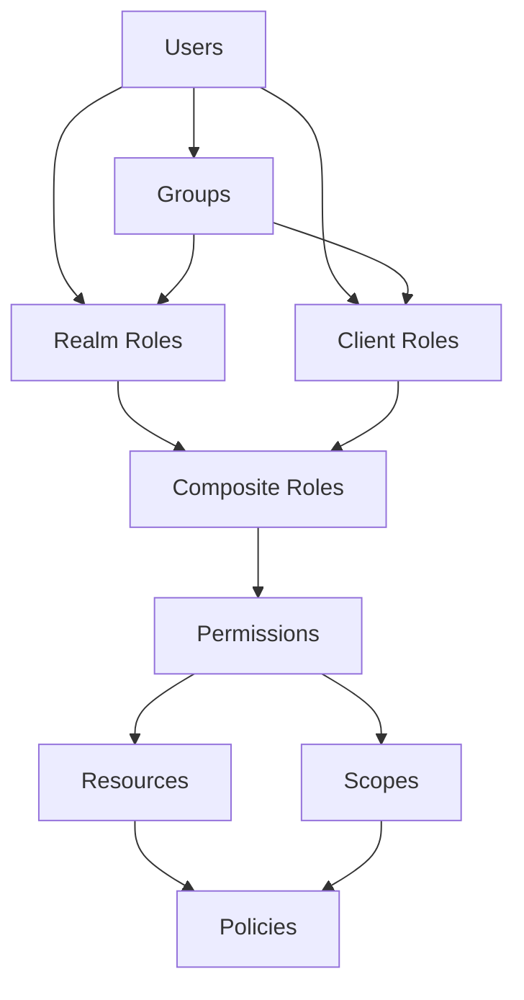
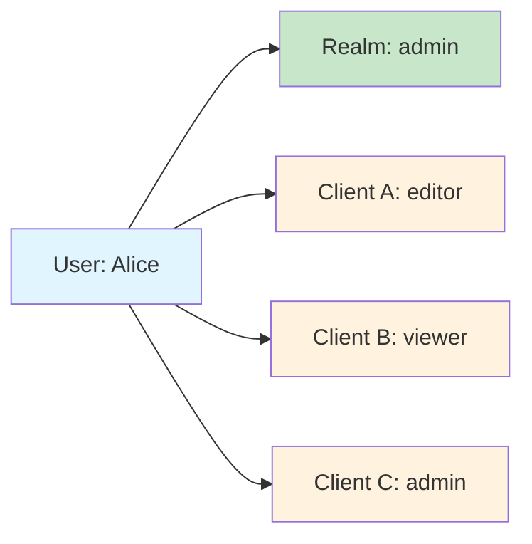
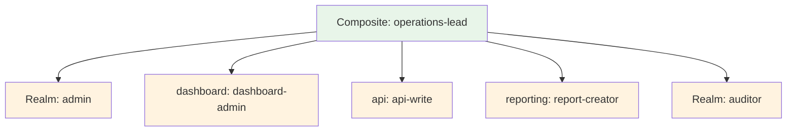
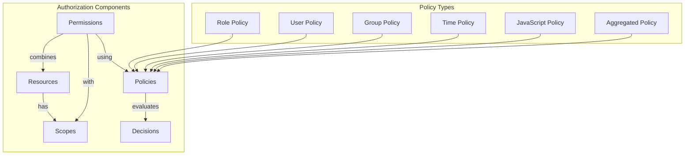
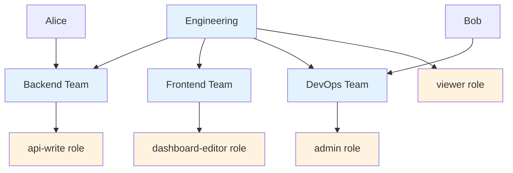

# How to Configure Keycloak Roles and Permissions

Author: [nawazdhandala](https://www.github.com/nawazdhandala)

Tags: Keycloak, Authentication, Authorization, RBAC, Security, Identity Management, OAuth2, OpenID Connect

Description: Learn how to configure Keycloak roles and permissions for fine-grained access control. Master realm roles, client roles, composite roles, and authorization services to build secure applications with proper access management.

---

> Keycloak provides one of the most comprehensive authorization systems available in open-source identity management. Understanding how to properly configure roles and permissions can mean the difference between a secure application and a security nightmare. Let me walk you through everything you need to know.

Identity and access management often gets treated as an afterthought, but getting it right from the start saves countless hours of refactoring and security patching later.

---

## Understanding Keycloak's Authorization Model

Before diving into configuration, let's understand how Keycloak structures its authorization system.



### Key Concepts

**Realm Roles** apply across all clients in a realm. Use them for organization-wide permissions like "admin" or "auditor".

**Client Roles** are specific to individual applications. A user might be an admin in one application but only a viewer in another.

**Composite Roles** combine multiple roles into a single assignable unit. An "operations" role might include "monitoring-read", "alerts-manage", and "incidents-respond".

**Groups** let you organize users and assign roles at the group level, simplifying management for large user bases.

---

## Setting Up Your Realm

### Creating a New Realm

Every Keycloak deployment starts with realm configuration. Each realm operates independently with its own users, roles, and clients.

```bash
# Use the Keycloak Admin CLI to create a realm
# First, authenticate as the admin user
/opt/keycloak/bin/kcadm.sh config credentials \
    --server http://localhost:8080 \
    --realm master \
    --user admin \
    --password admin

# Create a new realm for your application
/opt/keycloak/bin/kcadm.sh create realms \
    -s realm=myapp \
    -s enabled=true \
    -s displayName="My Application"
```

### Realm Configuration via REST API

For automation and infrastructure-as-code approaches, the REST API provides full control over realm configuration.

```python
# keycloak_setup.py
# Automates Keycloak realm and role configuration using the Admin REST API
import requests
from typing import Dict, List, Optional

class KeycloakAdmin:
    """Keycloak Admin API client for managing realms, roles, and users"""

    def __init__(self, server_url: str, username: str, password: str):
        self.server_url = server_url.rstrip('/')
        self.token = self._get_admin_token(username, password)
        self.headers = {
            'Authorization': f'Bearer {self.token}',
            'Content-Type': 'application/json'
        }

    def _get_admin_token(self, username: str, password: str) -> str:
        """Authenticate with Keycloak and retrieve an admin access token"""
        token_url = f"{self.server_url}/realms/master/protocol/openid-connect/token"

        # Request token using resource owner password credentials grant
        response = requests.post(token_url, data={
            'grant_type': 'password',
            'client_id': 'admin-cli',
            'username': username,
            'password': password
        })
        response.raise_for_status()
        return response.json()['access_token']

    def create_realm(self, realm_name: str, display_name: str = None) -> Dict:
        """Create a new realm with basic configuration"""
        realm_url = f"{self.server_url}/admin/realms"

        realm_config = {
            'realm': realm_name,
            'enabled': True,
            'displayName': display_name or realm_name,
            # Security defaults for production
            'bruteForceProtected': True,
            'permanentLockout': False,
            'maxFailureWaitSeconds': 900,
            'minimumQuickLoginWaitSeconds': 60,
            'waitIncrementSeconds': 60,
            'quickLoginCheckMilliSeconds': 1000,
            'maxDeltaTimeSeconds': 43200,
            'failureFactor': 5,
            # Token settings
            'accessTokenLifespan': 300,  # 5 minutes
            'ssoSessionIdleTimeout': 1800,  # 30 minutes
            'ssoSessionMaxLifespan': 36000,  # 10 hours
        }

        response = requests.post(realm_url, json=realm_config, headers=self.headers)
        response.raise_for_status()
        return realm_config

    def create_realm_role(
        self,
        realm: str,
        role_name: str,
        description: str = None,
        composite: bool = False
    ) -> Dict:
        """Create a realm-level role that applies across all clients"""
        roles_url = f"{self.server_url}/admin/realms/{realm}/roles"

        role_config = {
            'name': role_name,
            'description': description or f'{role_name} role',
            'composite': composite,
            # Attributes for additional role metadata
            'attributes': {
                'created_by': ['admin-api'],
                'managed': ['true']
            }
        }

        response = requests.post(roles_url, json=role_config, headers=self.headers)
        response.raise_for_status()
        return role_config

    def get_realm_role(self, realm: str, role_name: str) -> Dict:
        """Retrieve role details including its ID"""
        role_url = f"{self.server_url}/admin/realms/{realm}/roles/{role_name}"
        response = requests.get(role_url, headers=self.headers)
        response.raise_for_status()
        return response.json()
```

---

## Configuring Realm Roles

Realm roles define permissions that apply across your entire realm. These work best for organization-wide access levels.

### Creating Realm Roles via Admin Console

1. Navigate to your realm in the Keycloak Admin Console
2. Select "Realm roles" from the left menu
3. Click "Create role"
4. Enter the role name and description
5. Save the role

### Creating Roles Programmatically

Automation ensures consistency across environments and enables version control of your authorization configuration.

```python
# roles_configuration.py
# Defines and creates the complete role hierarchy for an application
from keycloak_setup import KeycloakAdmin

def setup_realm_roles(admin: KeycloakAdmin, realm: str):
    """Create the base realm roles for organization-wide permissions"""

    # Define the role hierarchy from most restrictive to most permissive
    realm_roles = [
        {
            'name': 'viewer',
            'description': 'Read-only access to all resources'
        },
        {
            'name': 'editor',
            'description': 'Can modify resources but not delete or configure'
        },
        {
            'name': 'admin',
            'description': 'Full administrative access within the realm'
        },
        {
            'name': 'auditor',
            'description': 'Read access to all resources including audit logs'
        },
        {
            'name': 'support',
            'description': 'Can view and respond to support requests'
        }
    ]

    created_roles = []
    for role in realm_roles:
        try:
            result = admin.create_realm_role(
                realm=realm,
                role_name=role['name'],
                description=role['description']
            )
            created_roles.append(result)
            print(f"Created realm role: {role['name']}")
        except Exception as e:
            # Role might already exist, which is fine for idempotent setup
            print(f"Role {role['name']} may already exist: {e}")

    return created_roles

# Initialize the admin client and create roles
admin = KeycloakAdmin(
    server_url='http://localhost:8080',
    username='admin',
    password='admin'
)

setup_realm_roles(admin, 'myapp')
```

---

## Configuring Client Roles

Client roles provide application-specific permissions. A single user can have different roles in different applications.



### Creating Clients with Roles

The following code creates a client application and defines its specific roles.

```python
# client_configuration.py
# Creates and configures Keycloak clients with their role definitions
import requests
from typing import Dict, List

class KeycloakClientManager:
    """Manages Keycloak client applications and their roles"""

    def __init__(self, admin: KeycloakAdmin, realm: str):
        self.admin = admin
        self.realm = realm
        self.base_url = f"{admin.server_url}/admin/realms/{realm}"

    def create_client(
        self,
        client_id: str,
        client_name: str,
        redirect_uris: List[str],
        public_client: bool = False
    ) -> Dict:
        """Create a new OAuth2/OIDC client application"""
        clients_url = f"{self.base_url}/clients"

        client_config = {
            'clientId': client_id,
            'name': client_name,
            'enabled': True,
            # Protocol settings
            'protocol': 'openid-connect',
            'publicClient': public_client,
            # For confidential clients, generate a secret
            'clientAuthenticatorType': 'client-secret' if not public_client else None,
            # Redirect URIs for OAuth2 flows
            'redirectUris': redirect_uris,
            'webOrigins': ['+'],  # Allow origins from redirect URIs
            # Token settings
            'standardFlowEnabled': True,  # Authorization code flow
            'directAccessGrantsEnabled': False,  # Disable password grant in production
            'serviceAccountsEnabled': not public_client,  # For server-to-server auth
            # Authorization settings
            'authorizationServicesEnabled': True,  # Enable fine-grained permissions
        }

        response = requests.post(
            clients_url,
            json=client_config,
            headers=self.admin.headers
        )
        response.raise_for_status()

        # Retrieve the created client to get its internal ID
        return self.get_client_by_client_id(client_id)

    def get_client_by_client_id(self, client_id: str) -> Dict:
        """Look up a client by its client_id (not internal UUID)"""
        clients_url = f"{self.base_url}/clients"
        response = requests.get(
            clients_url,
            params={'clientId': client_id},
            headers=self.admin.headers
        )
        response.raise_for_status()
        clients = response.json()

        if not clients:
            raise ValueError(f"Client {client_id} not found")
        return clients[0]

    def create_client_role(
        self,
        client_internal_id: str,
        role_name: str,
        description: str = None
    ) -> Dict:
        """Create a role specific to a client application"""
        roles_url = f"{self.base_url}/clients/{client_internal_id}/roles"

        role_config = {
            'name': role_name,
            'description': description or f'{role_name} client role',
            'clientRole': True
        }

        response = requests.post(
            roles_url,
            json=role_config,
            headers=self.admin.headers
        )
        response.raise_for_status()
        return role_config

    def setup_application_roles(self, client_id: str) -> List[Dict]:
        """Create standard application roles for a client"""
        client = self.get_client_by_client_id(client_id)
        client_uuid = client['id']

        # Define application-specific roles
        app_roles = [
            {'name': 'app-viewer', 'description': 'View application data'},
            {'name': 'app-editor', 'description': 'Edit application data'},
            {'name': 'app-admin', 'description': 'Administer application settings'},
            {'name': 'app-billing', 'description': 'Manage billing and subscriptions'},
            {'name': 'app-api-access', 'description': 'API access for integrations'},
        ]

        created = []
        for role in app_roles:
            result = self.create_client_role(
                client_internal_id=client_uuid,
                role_name=role['name'],
                description=role['description']
            )
            created.append(result)
            print(f"Created client role: {role['name']}")

        return created
```

### Practical Example: Multi-Application Setup

Many organizations run multiple applications that need different permission sets for the same users.

```python
# multi_app_setup.py
# Configures multiple applications with their specific role requirements
def setup_multi_app_environment(admin: KeycloakAdmin, realm: str):
    """Configure roles for a multi-application environment"""

    manager = KeycloakClientManager(admin, realm)

    # Dashboard application - internal tool for monitoring
    dashboard = manager.create_client(
        client_id='dashboard-app',
        client_name='Operations Dashboard',
        redirect_uris=['https://dashboard.example.com/*'],
        public_client=True  # Single-page application
    )

    dashboard_roles = [
        ('dashboard-viewer', 'View dashboards and metrics'),
        ('dashboard-editor', 'Create and modify dashboards'),
        ('dashboard-admin', 'Manage dashboard settings and users'),
    ]

    for role_name, description in dashboard_roles:
        manager.create_client_role(dashboard['id'], role_name, description)

    # API Gateway - backend service
    api_gateway = manager.create_client(
        client_id='api-gateway',
        client_name='API Gateway Service',
        redirect_uris=['https://api.example.com/callback'],
        public_client=False  # Confidential client with secret
    )

    api_roles = [
        ('api-read', 'Read access to API resources'),
        ('api-write', 'Write access to API resources'),
        ('api-delete', 'Delete access to API resources'),
        ('api-admin', 'Full API administration'),
    ]

    for role_name, description in api_roles:
        manager.create_client_role(api_gateway['id'], role_name, description)

    # Reporting service
    reporting = manager.create_client(
        client_id='reporting-service',
        client_name='Reporting Service',
        redirect_uris=['https://reports.example.com/*'],
        public_client=False
    )

    report_roles = [
        ('report-viewer', 'View generated reports'),
        ('report-creator', 'Generate new reports'),
        ('report-scheduler', 'Schedule automated reports'),
        ('report-admin', 'Manage report templates and settings'),
    ]

    for role_name, description in report_roles:
        manager.create_client_role(reporting['id'], role_name, description)

    print("Multi-application environment configured successfully")
```

---

## Composite Roles

Composite roles bundle multiple roles together for easier assignment. Instead of assigning ten individual roles, you assign one composite role that includes all of them.



### Creating Composite Roles

Composite roles reference other roles by their internal IDs, requiring a lookup step before composition.

```python
# composite_roles.py
# Creates composite roles that bundle multiple permissions together
import requests
from typing import List, Dict

class CompositeRoleManager:
    """Manages composite roles that combine multiple individual roles"""

    def __init__(self, admin: KeycloakAdmin, realm: str):
        self.admin = admin
        self.realm = realm
        self.base_url = f"{admin.server_url}/admin/realms/{realm}"

    def create_composite_role(
        self,
        role_name: str,
        description: str,
        realm_roles: List[str] = None,
        client_roles: Dict[str, List[str]] = None
    ):
        """Create a composite role from realm and client roles

        Args:
            role_name: Name for the new composite role
            description: Role description
            realm_roles: List of realm role names to include
            client_roles: Dict mapping client_id to list of role names
        """
        # First create the composite role itself
        role_url = f"{self.base_url}/roles"

        role_config = {
            'name': role_name,
            'description': description,
            'composite': True  # Mark as composite role
        }

        response = requests.post(
            role_url,
            json=role_config,
            headers=self.admin.headers
        )
        response.raise_for_status()

        # Collect all roles to add as composites
        roles_to_add = []

        # Add realm roles if specified
        if realm_roles:
            for realm_role_name in realm_roles:
                role = self._get_realm_role(realm_role_name)
                roles_to_add.append(role)

        # Add client roles if specified
        if client_roles:
            for client_id, role_names in client_roles.items():
                client = self._get_client(client_id)
                for client_role_name in role_names:
                    role = self._get_client_role(client['id'], client_role_name)
                    roles_to_add.append(role)

        # Associate the collected roles with the composite
        if roles_to_add:
            composite_url = f"{self.base_url}/roles/{role_name}/composites"
            response = requests.post(
                composite_url,
                json=roles_to_add,
                headers=self.admin.headers
            )
            response.raise_for_status()

        print(f"Created composite role '{role_name}' with {len(roles_to_add)} sub-roles")
        return role_config

    def _get_realm_role(self, role_name: str) -> Dict:
        """Retrieve realm role details by name"""
        url = f"{self.base_url}/roles/{role_name}"
        response = requests.get(url, headers=self.admin.headers)
        response.raise_for_status()
        return response.json()

    def _get_client(self, client_id: str) -> Dict:
        """Retrieve client by client_id"""
        url = f"{self.base_url}/clients"
        response = requests.get(
            url,
            params={'clientId': client_id},
            headers=self.admin.headers
        )
        response.raise_for_status()
        clients = response.json()
        if not clients:
            raise ValueError(f"Client {client_id} not found")
        return clients[0]

    def _get_client_role(self, client_uuid: str, role_name: str) -> Dict:
        """Retrieve client role details"""
        url = f"{self.base_url}/clients/{client_uuid}/roles/{role_name}"
        response = requests.get(url, headers=self.admin.headers)
        response.raise_for_status()
        return response.json()


def create_job_role_composites(admin: KeycloakAdmin, realm: str):
    """Create composite roles matching job functions"""

    manager = CompositeRoleManager(admin, realm)

    # Developer role - access to development tools and APIs
    manager.create_composite_role(
        role_name='developer',
        description='Development team member',
        realm_roles=['viewer'],
        client_roles={
            'api-gateway': ['api-read', 'api-write'],
            'dashboard-app': ['dashboard-viewer'],
            'reporting-service': ['report-viewer']
        }
    )

    # Operations lead - full operational access
    manager.create_composite_role(
        role_name='operations-lead',
        description='Operations team lead with full operational access',
        realm_roles=['admin', 'auditor'],
        client_roles={
            'api-gateway': ['api-read', 'api-write', 'api-admin'],
            'dashboard-app': ['dashboard-admin'],
            'reporting-service': ['report-creator', 'report-scheduler']
        }
    )

    # Finance role - billing and reporting access
    manager.create_composite_role(
        role_name='finance',
        description='Finance team member',
        realm_roles=['viewer'],
        client_roles={
            'dashboard-app': ['dashboard-viewer'],
            'reporting-service': ['report-viewer', 'report-creator']
        }
    )

    # Support engineer - customer support access
    manager.create_composite_role(
        role_name='support-engineer',
        description='Customer support team member',
        realm_roles=['support', 'viewer'],
        client_roles={
            'api-gateway': ['api-read'],
            'dashboard-app': ['dashboard-viewer', 'dashboard-editor']
        }
    )
```

---

## Authorization Services

Keycloak's Authorization Services provide fine-grained permission control beyond simple role-based access.

### Understanding the Authorization Model



### Configuring Resources and Scopes

Resources represent protected entities in your application. Scopes define operations that can be performed on those resources.

```python
# authorization_setup.py
# Configures Keycloak Authorization Services for fine-grained access control
import requests
from typing import Dict, List, Optional

class AuthorizationManager:
    """Manages Keycloak Authorization Services configuration"""

    def __init__(self, admin: KeycloakAdmin, realm: str, client_id: str):
        self.admin = admin
        self.realm = realm
        self.client_id = client_id

        # Get the client's internal UUID
        client = self._get_client()
        self.client_uuid = client['id']
        self.base_url = f"{admin.server_url}/admin/realms/{realm}/clients/{self.client_uuid}"

    def _get_client(self) -> Dict:
        """Retrieve client details by client_id"""
        url = f"{self.admin.server_url}/admin/realms/{self.realm}/clients"
        response = requests.get(
            url,
            params={'clientId': self.client_id},
            headers=self.admin.headers
        )
        response.raise_for_status()
        clients = response.json()
        if not clients:
            raise ValueError(f"Client {self.client_id} not found")
        return clients[0]

    def create_resource(
        self,
        name: str,
        display_name: str,
        resource_type: str,
        uris: List[str] = None,
        scopes: List[str] = None,
        owner_managed: bool = False
    ) -> Dict:
        """Create a protected resource with optional scopes

        Args:
            name: Unique resource identifier
            display_name: Human-readable name
            resource_type: Category for grouping (e.g., 'document', 'project')
            uris: Optional list of URI patterns this resource protects
            scopes: Optional list of scope names to associate
            owner_managed: Whether resource owners can manage permissions
        """
        resources_url = f"{self.base_url}/authz/resource-server/resource"

        resource_config = {
            'name': name,
            'displayName': display_name,
            'type': resource_type,
            'ownerManagedAccess': owner_managed,
        }

        if uris:
            resource_config['uris'] = uris

        if scopes:
            # Scopes must exist first or be created inline
            resource_config['scopes'] = [{'name': scope} for scope in scopes]

        response = requests.post(
            resources_url,
            json=resource_config,
            headers=self.admin.headers
        )
        response.raise_for_status()
        return response.json()

    def create_scope(self, name: str, display_name: str = None) -> Dict:
        """Create an authorization scope (permission type)"""
        scopes_url = f"{self.base_url}/authz/resource-server/scope"

        scope_config = {
            'name': name,
            'displayName': display_name or name
        }

        response = requests.post(
            scopes_url,
            json=scope_config,
            headers=self.admin.headers
        )
        response.raise_for_status()
        return response.json()

    def create_role_policy(
        self,
        name: str,
        description: str,
        roles: List[Dict],
        logic: str = 'POSITIVE'
    ) -> Dict:
        """Create a policy based on role membership

        Args:
            name: Policy name
            description: Policy description
            roles: List of role references {'id': 'role-uuid', 'required': True}
            logic: POSITIVE (must have roles) or NEGATIVE (must not have roles)
        """
        policies_url = f"{self.base_url}/authz/resource-server/policy/role"

        policy_config = {
            'name': name,
            'description': description,
            'type': 'role',
            'logic': logic,
            'decisionStrategy': 'UNANIMOUS',
            'roles': roles
        }

        response = requests.post(
            policies_url,
            json=policy_config,
            headers=self.admin.headers
        )
        response.raise_for_status()
        return response.json()

    def create_time_policy(
        self,
        name: str,
        description: str,
        not_before: str = None,
        not_after: str = None,
        day_of_month: str = None,
        month: str = None,
        year: str = None,
        hour: str = None,
        minute: str = None
    ) -> Dict:
        """Create a time-based policy for temporal access control

        Useful for business hours restrictions or temporary access grants
        """
        policies_url = f"{self.base_url}/authz/resource-server/policy/time"

        policy_config = {
            'name': name,
            'description': description,
            'type': 'time',
            'logic': 'POSITIVE'
        }

        # Add time constraints if specified
        if not_before:
            policy_config['notBefore'] = not_before
        if not_after:
            policy_config['notAfter'] = not_after
        if hour:
            policy_config['hour'] = hour
        if minute:
            policy_config['minute'] = minute

        response = requests.post(
            policies_url,
            json=policy_config,
            headers=self.admin.headers
        )
        response.raise_for_status()
        return response.json()

    def create_permission(
        self,
        name: str,
        description: str,
        resource_type: str = None,
        resources: List[str] = None,
        scopes: List[str] = None,
        policies: List[str] = None,
        decision_strategy: str = 'UNANIMOUS'
    ) -> Dict:
        """Create a permission linking resources, scopes, and policies

        Args:
            name: Permission name
            description: Permission description
            resource_type: Apply to all resources of this type
            resources: Specific resource names to protect
            scopes: Scope names this permission covers
            policies: Policy names that must be satisfied
            decision_strategy: UNANIMOUS (all), AFFIRMATIVE (any), CONSENSUS (majority)
        """
        # Determine permission type based on whether scopes are specified
        if scopes:
            perm_url = f"{self.base_url}/authz/resource-server/permission/scope"
            perm_type = 'scope'
        else:
            perm_url = f"{self.base_url}/authz/resource-server/permission/resource"
            perm_type = 'resource'

        perm_config = {
            'name': name,
            'description': description,
            'type': perm_type,
            'decisionStrategy': decision_strategy
        }

        if resource_type:
            perm_config['resourceType'] = resource_type
        if resources:
            perm_config['resources'] = resources
        if scopes:
            perm_config['scopes'] = scopes
        if policies:
            perm_config['policies'] = policies

        response = requests.post(
            perm_url,
            json=perm_config,
            headers=self.admin.headers
        )
        response.raise_for_status()
        return response.json()
```

### Practical Authorization Example

Here's a complete example setting up authorization for a document management system.

```python
# document_authorization.py
# Complete authorization setup for a document management application
def setup_document_authorization(admin: KeycloakAdmin, realm: str):
    """Configure authorization for a document management system"""

    auth = AuthorizationManager(admin, realm, 'document-service')

    # Step 1: Create scopes (actions that can be performed)
    scopes = ['read', 'write', 'delete', 'share', 'download', 'print']
    for scope in scopes:
        auth.create_scope(scope, f'{scope.capitalize()} documents')

    # Step 2: Create resource types
    # User documents - personal files owned by individual users
    auth.create_resource(
        name='user-documents',
        display_name='User Documents',
        resource_type='document:personal',
        uris=['/api/documents/personal/*'],
        scopes=['read', 'write', 'delete', 'download']
    )

    # Shared documents - files shared within teams
    auth.create_resource(
        name='shared-documents',
        display_name='Shared Documents',
        resource_type='document:shared',
        uris=['/api/documents/shared/*'],
        scopes=['read', 'write', 'share', 'download']
    )

    # Confidential documents - restricted access files
    auth.create_resource(
        name='confidential-documents',
        display_name='Confidential Documents',
        resource_type='document:confidential',
        uris=['/api/documents/confidential/*'],
        scopes=['read', 'download']
    )

    # Step 3: Create policies
    # Get role IDs for policy configuration
    viewer_role = admin.get_realm_role(realm, 'viewer')
    editor_role = admin.get_realm_role(realm, 'editor')
    admin_role = admin.get_realm_role(realm, 'admin')

    # Policy: Users with viewer role can read
    auth.create_role_policy(
        name='viewer-policy',
        description='Users with viewer role',
        roles=[{'id': viewer_role['id'], 'required': True}]
    )

    # Policy: Users with editor role can modify
    auth.create_role_policy(
        name='editor-policy',
        description='Users with editor role',
        roles=[{'id': editor_role['id'], 'required': True}]
    )

    # Policy: Only admins can access confidential documents
    auth.create_role_policy(
        name='admin-only-policy',
        description='Restricted to administrators',
        roles=[{'id': admin_role['id'], 'required': True}]
    )

    # Policy: Business hours only (9 AM to 6 PM)
    auth.create_time_policy(
        name='business-hours-policy',
        description='Access allowed during business hours only',
        hour='9-18'
    )

    # Step 4: Create permissions combining resources, scopes, and policies
    # Viewers can read shared documents
    auth.create_permission(
        name='shared-document-read',
        description='Allow viewers to read shared documents',
        resources=['shared-documents'],
        scopes=['read', 'download'],
        policies=['viewer-policy'],
        decision_strategy='AFFIRMATIVE'
    )

    # Editors can modify shared documents
    auth.create_permission(
        name='shared-document-write',
        description='Allow editors to modify shared documents',
        resources=['shared-documents'],
        scopes=['write', 'share'],
        policies=['editor-policy'],
        decision_strategy='AFFIRMATIVE'
    )

    # Confidential documents require admin role AND business hours
    auth.create_permission(
        name='confidential-document-access',
        description='Confidential document access during business hours',
        resources=['confidential-documents'],
        scopes=['read', 'download'],
        policies=['admin-only-policy', 'business-hours-policy'],
        decision_strategy='UNANIMOUS'  # Both policies must pass
    )

    print("Document authorization configured successfully")
```

---

## Managing Users and Role Assignments

### Assigning Roles to Users

Users can receive roles directly or through group membership.

```python
# user_management.py
# Handles user creation and role assignment operations
import requests
from typing import Dict, List

class UserManager:
    """Manages Keycloak users and their role assignments"""

    def __init__(self, admin: KeycloakAdmin, realm: str):
        self.admin = admin
        self.realm = realm
        self.base_url = f"{admin.server_url}/admin/realms/{realm}"

    def create_user(
        self,
        username: str,
        email: str,
        first_name: str,
        last_name: str,
        password: str = None,
        temporary_password: bool = True,
        enabled: bool = True
    ) -> Dict:
        """Create a new user in the realm"""
        users_url = f"{self.base_url}/users"

        user_config = {
            'username': username,
            'email': email,
            'firstName': first_name,
            'lastName': last_name,
            'enabled': enabled,
            'emailVerified': False,
            'attributes': {
                'created_via': ['admin-api']
            }
        }

        # Set initial password if provided
        if password:
            user_config['credentials'] = [{
                'type': 'password',
                'value': password,
                'temporary': temporary_password  # Force change on first login
            }]

        response = requests.post(
            users_url,
            json=user_config,
            headers=self.admin.headers
        )
        response.raise_for_status()

        # Get the created user to return their ID
        return self.get_user_by_username(username)

    def get_user_by_username(self, username: str) -> Dict:
        """Find a user by username"""
        users_url = f"{self.base_url}/users"
        response = requests.get(
            users_url,
            params={'username': username, 'exact': 'true'},
            headers=self.admin.headers
        )
        response.raise_for_status()
        users = response.json()

        if not users:
            raise ValueError(f"User {username} not found")
        return users[0]

    def assign_realm_roles(self, user_id: str, role_names: List[str]):
        """Assign realm roles to a user"""
        # First, get the role representations
        roles = []
        for role_name in role_names:
            role_url = f"{self.base_url}/roles/{role_name}"
            response = requests.get(role_url, headers=self.admin.headers)
            response.raise_for_status()
            roles.append(response.json())

        # Assign roles to user
        mapping_url = f"{self.base_url}/users/{user_id}/role-mappings/realm"
        response = requests.post(
            mapping_url,
            json=roles,
            headers=self.admin.headers
        )
        response.raise_for_status()

        print(f"Assigned realm roles {role_names} to user {user_id}")

    def assign_client_roles(
        self,
        user_id: str,
        client_id: str,
        role_names: List[str]
    ):
        """Assign client-specific roles to a user"""
        # Get client UUID
        clients_url = f"{self.base_url}/clients"
        response = requests.get(
            clients_url,
            params={'clientId': client_id},
            headers=self.admin.headers
        )
        response.raise_for_status()
        client = response.json()[0]
        client_uuid = client['id']

        # Get role representations
        roles = []
        for role_name in role_names:
            role_url = f"{self.base_url}/clients/{client_uuid}/roles/{role_name}"
            response = requests.get(role_url, headers=self.admin.headers)
            response.raise_for_status()
            roles.append(response.json())

        # Assign roles
        mapping_url = f"{self.base_url}/users/{user_id}/role-mappings/clients/{client_uuid}"
        response = requests.post(
            mapping_url,
            json=roles,
            headers=self.admin.headers
        )
        response.raise_for_status()

        print(f"Assigned client roles {role_names} from {client_id} to user {user_id}")

    def get_user_roles(self, user_id: str) -> Dict:
        """Get all roles assigned to a user (realm and client)"""
        mapping_url = f"{self.base_url}/users/{user_id}/role-mappings"
        response = requests.get(mapping_url, headers=self.admin.headers)
        response.raise_for_status()
        return response.json()


def setup_example_users(admin: KeycloakAdmin, realm: str):
    """Create example users with different role assignments"""

    manager = UserManager(admin, realm)

    # Create a developer user
    dev_user = manager.create_user(
        username='alice.developer',
        email='alice@example.com',
        first_name='Alice',
        last_name='Developer',
        password='initial-password',
        temporary_password=True
    )

    # Assign the composite developer role
    manager.assign_realm_roles(dev_user['id'], ['developer'])

    # Create an operations lead
    ops_user = manager.create_user(
        username='bob.operations',
        email='bob@example.com',
        first_name='Bob',
        last_name='Operations',
        password='initial-password',
        temporary_password=True
    )

    # Assign operations lead composite role
    manager.assign_realm_roles(ops_user['id'], ['operations-lead'])

    # Create a finance user with specific client roles
    finance_user = manager.create_user(
        username='carol.finance',
        email='carol@example.com',
        first_name='Carol',
        last_name='Finance',
        password='initial-password',
        temporary_password=True
    )

    manager.assign_realm_roles(finance_user['id'], ['finance'])
    # Additional client-specific roles beyond the composite
    manager.assign_client_roles(
        finance_user['id'],
        'reporting-service',
        ['report-scheduler']
    )
```

---

## Group-Based Role Management

Groups provide hierarchical organization of users with inherited roles.



```python
# group_management.py
# Manages hierarchical groups with role inheritance
import requests
from typing import Dict, List, Optional

class GroupManager:
    """Manages Keycloak groups and their role assignments"""

    def __init__(self, admin: KeycloakAdmin, realm: str):
        self.admin = admin
        self.realm = realm
        self.base_url = f"{admin.server_url}/admin/realms/{realm}"

    def create_group(
        self,
        name: str,
        parent_id: Optional[str] = None,
        attributes: Dict = None
    ) -> Dict:
        """Create a group, optionally as a subgroup of another"""
        if parent_id:
            # Create as subgroup
            groups_url = f"{self.base_url}/groups/{parent_id}/children"
        else:
            # Create as top-level group
            groups_url = f"{self.base_url}/groups"

        group_config = {
            'name': name,
            'attributes': attributes or {}
        }

        response = requests.post(
            groups_url,
            json=group_config,
            headers=self.admin.headers
        )
        response.raise_for_status()

        # Return the created group
        return self.get_group_by_name(name)

    def get_group_by_name(self, name: str) -> Dict:
        """Find a group by name (searches all levels)"""
        groups_url = f"{self.base_url}/groups"
        response = requests.get(
            groups_url,
            params={'search': name},
            headers=self.admin.headers
        )
        response.raise_for_status()

        # Search through results and subgroups
        def find_group(groups, target_name):
            for group in groups:
                if group['name'] == target_name:
                    return group
                if 'subGroups' in group:
                    found = find_group(group['subGroups'], target_name)
                    if found:
                        return found
            return None

        group = find_group(response.json(), name)
        if not group:
            raise ValueError(f"Group {name} not found")
        return group

    def assign_realm_roles_to_group(self, group_id: str, role_names: List[str]):
        """Assign realm roles to a group (inherited by members)"""
        roles = []
        for role_name in role_names:
            role_url = f"{self.base_url}/roles/{role_name}"
            response = requests.get(role_url, headers=self.admin.headers)
            response.raise_for_status()
            roles.append(response.json())

        mapping_url = f"{self.base_url}/groups/{group_id}/role-mappings/realm"
        response = requests.post(
            mapping_url,
            json=roles,
            headers=self.admin.headers
        )
        response.raise_for_status()

    def assign_client_roles_to_group(
        self,
        group_id: str,
        client_id: str,
        role_names: List[str]
    ):
        """Assign client roles to a group"""
        # Get client UUID
        clients_url = f"{self.base_url}/clients"
        response = requests.get(
            clients_url,
            params={'clientId': client_id},
            headers=self.admin.headers
        )
        response.raise_for_status()
        client = response.json()[0]
        client_uuid = client['id']

        roles = []
        for role_name in role_names:
            role_url = f"{self.base_url}/clients/{client_uuid}/roles/{role_name}"
            response = requests.get(role_url, headers=self.admin.headers)
            response.raise_for_status()
            roles.append(response.json())

        mapping_url = f"{self.base_url}/groups/{group_id}/role-mappings/clients/{client_uuid}"
        response = requests.post(
            mapping_url,
            json=roles,
            headers=self.admin.headers
        )
        response.raise_for_status()

    def add_user_to_group(self, user_id: str, group_id: str):
        """Add a user to a group (they inherit group roles)"""
        membership_url = f"{self.base_url}/users/{user_id}/groups/{group_id}"
        response = requests.put(membership_url, headers=self.admin.headers)
        response.raise_for_status()


def setup_organization_groups(admin: KeycloakAdmin, realm: str):
    """Create organizational group hierarchy with role assignments"""

    manager = GroupManager(admin, realm)

    # Top-level department groups
    engineering = manager.create_group('Engineering')
    product = manager.create_group('Product')
    operations = manager.create_group('Operations')

    # Engineering subgroups
    backend = manager.create_group('Backend Team', parent_id=engineering['id'])
    frontend = manager.create_group('Frontend Team', parent_id=engineering['id'])
    devops = manager.create_group('DevOps Team', parent_id=engineering['id'])

    # Operations subgroups
    support = manager.create_group('Support', parent_id=operations['id'])
    infrastructure = manager.create_group('Infrastructure', parent_id=operations['id'])

    # Assign roles to groups
    # All engineering gets viewer access
    manager.assign_realm_roles_to_group(engineering['id'], ['viewer'])

    # Backend team gets API write access
    manager.assign_client_roles_to_group(
        backend['id'],
        'api-gateway',
        ['api-read', 'api-write']
    )

    # Frontend team gets dashboard access
    manager.assign_client_roles_to_group(
        frontend['id'],
        'dashboard-app',
        ['dashboard-viewer', 'dashboard-editor']
    )

    # DevOps gets admin access
    manager.assign_realm_roles_to_group(devops['id'], ['admin'])

    # Support gets the support composite role
    manager.assign_realm_roles_to_group(support['id'], ['support-engineer'])

    print("Organization groups configured with role inheritance")
```

---

## Token Claims and Role Mapping

Roles appear in JWT tokens for client-side authorization decisions. Configure which roles appear in tokens through client mappers.

### Configuring Protocol Mappers

Protocol mappers control what information appears in tokens.

```python
# token_mappers.py
# Configures JWT token claims for role information
import requests
from typing import Dict

class TokenMapperManager:
    """Manages protocol mappers for JWT token customization"""

    def __init__(self, admin: KeycloakAdmin, realm: str, client_id: str):
        self.admin = admin
        self.realm = realm

        # Get client UUID
        clients_url = f"{admin.server_url}/admin/realms/{realm}/clients"
        response = requests.get(
            clients_url,
            params={'clientId': client_id},
            headers=admin.headers
        )
        response.raise_for_status()
        self.client_uuid = response.json()[0]['id']
        self.base_url = f"{admin.server_url}/admin/realms/{realm}/clients/{self.client_uuid}"

    def add_realm_roles_mapper(
        self,
        name: str = 'realm-roles',
        claim_name: str = 'realm_roles',
        add_to_id_token: bool = True,
        add_to_access_token: bool = True
    ):
        """Add a mapper to include realm roles in tokens"""
        mappers_url = f"{self.base_url}/protocol-mappers/models"

        mapper_config = {
            'name': name,
            'protocol': 'openid-connect',
            'protocolMapper': 'oidc-usermodel-realm-role-mapper',
            'config': {
                'claim.name': claim_name,
                'jsonType.label': 'String',
                'multivalued': 'true',
                'id.token.claim': str(add_to_id_token).lower(),
                'access.token.claim': str(add_to_access_token).lower(),
                'userinfo.token.claim': 'true'
            }
        }

        response = requests.post(
            mappers_url,
            json=mapper_config,
            headers=self.admin.headers
        )
        response.raise_for_status()
        return mapper_config

    def add_client_roles_mapper(
        self,
        name: str = 'client-roles',
        claim_name: str = 'resource_access.${client_id}.roles',
        add_to_id_token: bool = True,
        add_to_access_token: bool = True
    ):
        """Add a mapper to include client roles in tokens"""
        mappers_url = f"{self.base_url}/protocol-mappers/models"

        mapper_config = {
            'name': name,
            'protocol': 'openid-connect',
            'protocolMapper': 'oidc-usermodel-client-role-mapper',
            'config': {
                'claim.name': claim_name,
                'jsonType.label': 'String',
                'multivalued': 'true',
                'id.token.claim': str(add_to_id_token).lower(),
                'access.token.claim': str(add_to_access_token).lower(),
                'userinfo.token.claim': 'true'
            }
        }

        response = requests.post(
            mappers_url,
            json=mapper_config,
            headers=self.admin.headers
        )
        response.raise_for_status()
        return mapper_config

    def add_group_membership_mapper(
        self,
        name: str = 'groups',
        claim_name: str = 'groups',
        full_path: bool = True
    ):
        """Add a mapper to include group membership in tokens"""
        mappers_url = f"{self.base_url}/protocol-mappers/models"

        mapper_config = {
            'name': name,
            'protocol': 'openid-connect',
            'protocolMapper': 'oidc-group-membership-mapper',
            'config': {
                'claim.name': claim_name,
                'full.path': str(full_path).lower(),
                'id.token.claim': 'true',
                'access.token.claim': 'true',
                'userinfo.token.claim': 'true'
            }
        }

        response = requests.post(
            mappers_url,
            json=mapper_config,
            headers=self.admin.headers
        )
        response.raise_for_status()
        return mapper_config
```

### Example Token Structure

After configuration, tokens contain role information for authorization.

```json
{
  "exp": 1704067200,
  "iat": 1704063600,
  "sub": "user-uuid-here",
  "realm_access": {
    "roles": [
      "viewer",
      "developer"
    ]
  },
  "resource_access": {
    "api-gateway": {
      "roles": [
        "api-read",
        "api-write"
      ]
    },
    "dashboard-app": {
      "roles": [
        "dashboard-viewer"
      ]
    }
  },
  "groups": [
    "/Engineering/Backend Team"
  ],
  "preferred_username": "alice.developer",
  "email": "alice@example.com"
}
```

---

## Application Integration

### Validating Roles in Your Application

Your application needs to extract and validate roles from tokens.

```python
# app_authorization.py
# Application-side role validation for FastAPI
from fastapi import FastAPI, Depends, HTTPException, status
from fastapi.security import OAuth2PasswordBearer
from jose import jwt, JWTError
from typing import List, Optional
import requests
from functools import wraps

app = FastAPI()
oauth2_scheme = OAuth2PasswordBearer(tokenUrl="token")

# Keycloak configuration
KEYCLOAK_URL = "http://localhost:8080"
REALM = "myapp"
CLIENT_ID = "api-gateway"

# Cache for Keycloak's public keys
_public_keys_cache = None

def get_keycloak_public_keys():
    """Fetch Keycloak's public keys for token verification"""
    global _public_keys_cache

    if _public_keys_cache is None:
        certs_url = f"{KEYCLOAK_URL}/realms/{REALM}/protocol/openid-connect/certs"
        response = requests.get(certs_url)
        response.raise_for_status()
        _public_keys_cache = response.json()

    return _public_keys_cache

def decode_token(token: str) -> dict:
    """Decode and validate a Keycloak JWT token"""
    try:
        # Get the key ID from token header
        unverified_header = jwt.get_unverified_header(token)
        kid = unverified_header.get('kid')

        # Find matching public key
        keys = get_keycloak_public_keys()
        public_key = None
        for key in keys['keys']:
            if key['kid'] == kid:
                public_key = jwt.algorithms.RSAAlgorithm.from_jwk(key)
                break

        if not public_key:
            raise ValueError("Public key not found")

        # Decode and verify token
        payload = jwt.decode(
            token,
            public_key,
            algorithms=['RS256'],
            audience=CLIENT_ID,
            issuer=f"{KEYCLOAK_URL}/realms/{REALM}"
        )

        return payload

    except JWTError as e:
        raise ValueError(f"Token validation failed: {e}")

def get_current_user(token: str = Depends(oauth2_scheme)) -> dict:
    """Extract user information from token"""
    try:
        payload = decode_token(token)
        return payload
    except ValueError as e:
        raise HTTPException(
            status_code=status.HTTP_401_UNAUTHORIZED,
            detail=str(e),
            headers={"WWW-Authenticate": "Bearer"}
        )

def extract_roles(token_payload: dict) -> dict:
    """Extract all roles from token payload"""
    roles = {
        'realm': [],
        'client': {}
    }

    # Realm roles
    if 'realm_access' in token_payload:
        roles['realm'] = token_payload['realm_access'].get('roles', [])

    # Client roles
    if 'resource_access' in token_payload:
        for client_id, access in token_payload['resource_access'].items():
            roles['client'][client_id] = access.get('roles', [])

    return roles

def require_realm_role(role: str):
    """Decorator to require a specific realm role"""
    def decorator(func):
        @wraps(func)
        async def wrapper(*args, user: dict = Depends(get_current_user), **kwargs):
            roles = extract_roles(user)

            if role not in roles['realm']:
                raise HTTPException(
                    status_code=status.HTTP_403_FORBIDDEN,
                    detail=f"Realm role '{role}' required"
                )

            return await func(*args, user=user, **kwargs)
        return wrapper
    return decorator

def require_client_role(client_id: str, role: str):
    """Decorator to require a specific client role"""
    def decorator(func):
        @wraps(func)
        async def wrapper(*args, user: dict = Depends(get_current_user), **kwargs):
            roles = extract_roles(user)

            client_roles = roles['client'].get(client_id, [])
            if role not in client_roles:
                raise HTTPException(
                    status_code=status.HTTP_403_FORBIDDEN,
                    detail=f"Client role '{role}' on '{client_id}' required"
                )

            return await func(*args, user=user, **kwargs)
        return wrapper
    return decorator

def require_any_role(realm_roles: List[str] = None, client_roles: dict = None):
    """Decorator requiring at least one of the specified roles"""
    def decorator(func):
        @wraps(func)
        async def wrapper(*args, user: dict = Depends(get_current_user), **kwargs):
            roles = extract_roles(user)

            # Check realm roles
            if realm_roles:
                for role in realm_roles:
                    if role in roles['realm']:
                        return await func(*args, user=user, **kwargs)

            # Check client roles
            if client_roles:
                for client_id, required_roles in client_roles.items():
                    user_client_roles = roles['client'].get(client_id, [])
                    for role in required_roles:
                        if role in user_client_roles:
                            return await func(*args, user=user, **kwargs)

            raise HTTPException(
                status_code=status.HTTP_403_FORBIDDEN,
                detail="Insufficient permissions"
            )
        return wrapper
    return decorator


# Example API endpoints with role protection

@app.get("/api/documents")
@require_realm_role("viewer")
async def list_documents(user: dict = Depends(get_current_user)):
    """List documents - requires viewer role"""
    return {"documents": [], "user": user['preferred_username']}

@app.post("/api/documents")
@require_client_role("api-gateway", "api-write")
async def create_document(user: dict = Depends(get_current_user)):
    """Create document - requires api-write client role"""
    return {"message": "Document created", "user": user['preferred_username']}

@app.delete("/api/documents/{doc_id}")
@require_any_role(
    realm_roles=["admin"],
    client_roles={"api-gateway": ["api-delete", "api-admin"]}
)
async def delete_document(doc_id: str, user: dict = Depends(get_current_user)):
    """Delete document - requires admin or api-delete/api-admin role"""
    return {"message": f"Document {doc_id} deleted"}

@app.get("/api/admin/users")
@require_realm_role("admin")
async def list_users(user: dict = Depends(get_current_user)):
    """Admin endpoint - requires admin realm role"""
    return {"users": []}
```

---

## Best Practices

### Role Design Principles

1. **Principle of Least Privilege**: Start with minimal permissions and add as needed
2. **Role Granularity**: Create specific roles rather than broad ones
3. **Avoid Role Explosion**: Use composite roles and groups to manage complexity
4. **Consistent Naming**: Use clear, descriptive names like `service-action` format

### Security Recommendations

Keep these security considerations in mind when designing your role structure.

```python
# security_audit.py
# Utility to audit role configurations for security issues
import requests
from typing import List, Dict

class RoleAuditor:
    """Audits Keycloak role configurations for security issues"""

    def __init__(self, admin: KeycloakAdmin, realm: str):
        self.admin = admin
        self.realm = realm
        self.base_url = f"{admin.server_url}/admin/realms/{realm}"

    def audit_role_assignments(self) -> List[Dict]:
        """Check for potential security issues in role assignments"""
        issues = []

        # Get all users
        users_url = f"{self.base_url}/users"
        response = requests.get(users_url, headers=self.admin.headers)
        users = response.json()

        for user in users:
            user_id = user['id']
            username = user['username']

            # Get user's effective roles
            roles_url = f"{self.base_url}/users/{user_id}/role-mappings"
            response = requests.get(roles_url, headers=self.admin.headers)
            mappings = response.json()

            realm_roles = mappings.get('realmMappings', [])

            # Check for admin role on non-admin accounts
            admin_roles = [r for r in realm_roles if 'admin' in r['name'].lower()]
            if admin_roles and not username.endswith('.admin'):
                issues.append({
                    'severity': 'HIGH',
                    'user': username,
                    'issue': f"Admin roles assigned to non-admin account: {[r['name'] for r in admin_roles]}"
                })

            # Check for excessive role count
            total_roles = len(realm_roles)
            for client_id, client_roles in mappings.get('clientMappings', {}).items():
                total_roles += len(client_roles.get('mappings', []))

            if total_roles > 10:
                issues.append({
                    'severity': 'MEDIUM',
                    'user': username,
                    'issue': f"User has {total_roles} roles - consider using composite roles"
                })

        return issues

    def audit_composite_roles(self) -> List[Dict]:
        """Check composite role configurations"""
        issues = []

        roles_url = f"{self.base_url}/roles"
        response = requests.get(roles_url, headers=self.admin.headers)
        roles = response.json()

        for role in roles:
            if role.get('composite'):
                # Get composite role contents
                composites_url = f"{self.base_url}/roles/{role['name']}/composites"
                response = requests.get(composites_url, headers=self.admin.headers)
                composites = response.json()

                # Check for circular references or excessive depth
                if len(composites) > 15:
                    issues.append({
                        'severity': 'LOW',
                        'role': role['name'],
                        'issue': f"Composite role contains {len(composites)} sub-roles - may be hard to manage"
                    })

        return issues

    def generate_audit_report(self) -> str:
        """Generate a complete security audit report"""
        report_lines = ["# Keycloak Role Security Audit Report", ""]

        # Role assignment issues
        assignment_issues = self.audit_role_assignments()
        report_lines.append("## User Role Assignment Issues")
        if assignment_issues:
            for issue in assignment_issues:
                report_lines.append(f"- [{issue['severity']}] {issue['user']}: {issue['issue']}")
        else:
            report_lines.append("No issues found.")

        report_lines.append("")

        # Composite role issues
        composite_issues = self.audit_composite_roles()
        report_lines.append("## Composite Role Issues")
        if composite_issues:
            for issue in composite_issues:
                report_lines.append(f"- [{issue['severity']}] {issue['role']}: {issue['issue']}")
        else:
            report_lines.append("No issues found.")

        return "\n".join(report_lines)
```

---

## Troubleshooting Common Issues

### Role Not Appearing in Token

When roles don't appear in tokens, check these common causes:

1. **Scope not requested**: Ensure your client requests the `roles` scope
2. **Mapper misconfigured**: Verify protocol mappers are set to include roles in tokens
3. **Role not assigned**: Confirm the role is actually assigned to the user

```bash
# Debug token contents using Keycloak's token introspection
curl -X POST "http://localhost:8080/realms/myapp/protocol/openid-connect/token/introspect" \
  -H "Content-Type: application/x-www-form-urlencoded" \
  -d "client_id=api-gateway" \
  -d "client_secret=your-client-secret" \
  -d "token=eyJhbGciOiJSUzI1NiIsInR5cCI6..."
```

### Permission Denied Errors

Verify the complete authorization chain.

```python
# debug_authorization.py
# Helps diagnose authorization failures
def debug_user_permissions(admin: KeycloakAdmin, realm: str, username: str):
    """Print detailed permission information for a user"""

    user_manager = UserManager(admin, realm)
    user = user_manager.get_user_by_username(username)

    print(f"=== Permissions for {username} ===\n")

    # Get direct role assignments
    roles = user_manager.get_user_roles(user['id'])

    print("Direct Realm Roles:")
    for role in roles.get('realmMappings', []):
        print(f"  - {role['name']}")

    print("\nDirect Client Roles:")
    for client_id, client_data in roles.get('clientMappings', {}).items():
        print(f"  {client_id}:")
        for role in client_data.get('mappings', []):
            print(f"    - {role['name']}")

    # Get group memberships
    groups_url = f"{admin.server_url}/admin/realms/{realm}/users/{user['id']}/groups"
    response = requests.get(groups_url, headers=admin.headers)
    groups = response.json()

    print("\nGroup Memberships:")
    for group in groups:
        print(f"  - {group['path']}")

    # Get effective roles (includes inherited from groups)
    effective_url = f"{admin.server_url}/admin/realms/{realm}/users/{user['id']}/role-mappings/realm/composite"
    response = requests.get(effective_url, headers=admin.headers)
    effective_roles = response.json()

    print("\nEffective Realm Roles (including inherited):")
    for role in effective_roles:
        print(f"  - {role['name']}")
```

---

## Conclusion

Keycloak provides a robust and flexible authorization system that scales from simple role-based access to complex policy-driven permissions. Key takeaways:

- **Realm roles** work for organization-wide permissions
- **Client roles** enable application-specific access control
- **Composite roles** simplify management by bundling permissions
- **Groups** provide hierarchical organization with role inheritance
- **Authorization Services** enable fine-grained resource-level permissions

Start with a clear role hierarchy, use groups for organization, and leverage composite roles to keep management simple as your system grows.

---

*Need to monitor your authentication and authorization events? [OneUptime](https://oneuptime.com) provides comprehensive logging and alerting for Keycloak deployments, helping you track access patterns and detect security anomalies.*

**Related Reading:**
- [How to Handle JWT Authentication Securely in Python](https://oneuptime.com/blog/post/2025-01-06-python-jwt-authentication/view)
