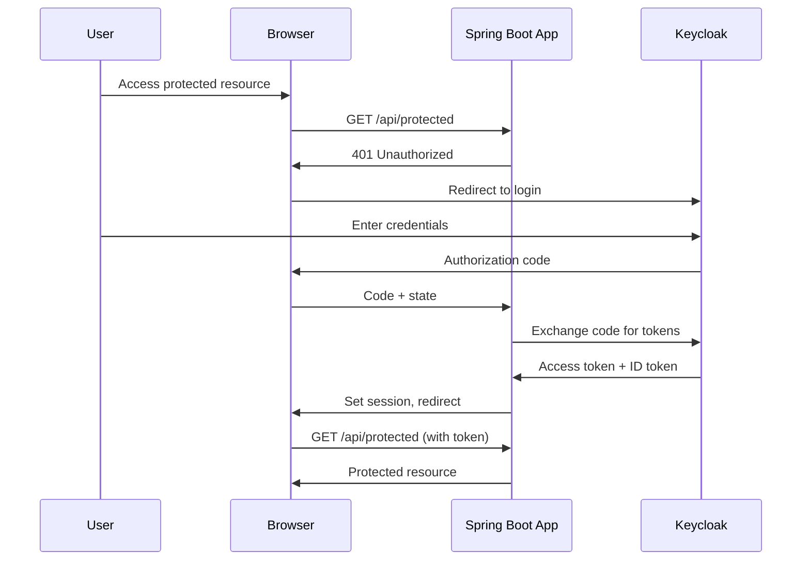
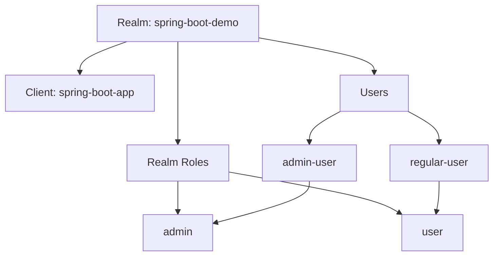
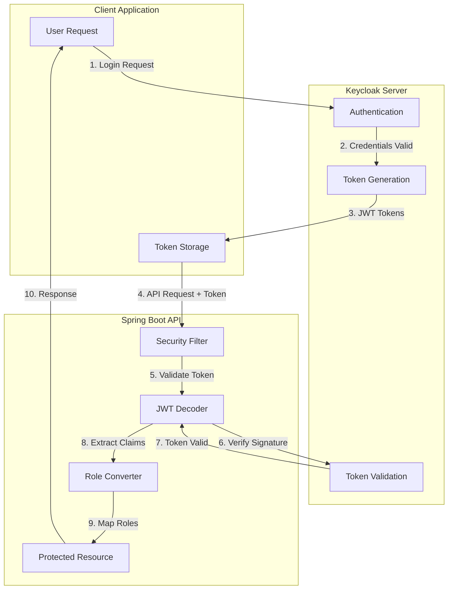

# How to Use Keycloak with Spring Boot

Author: [nawazdhandala](https://www.github.com/nawazdhandala)

Tags: Keycloak, Spring Boot, Authentication, Java

Description: A comprehensive guide to integrating Keycloak identity and access management with Spring Boot applications, covering OAuth2/OIDC configuration, role-based access control, custom security filters, and production best practices.

---

> Keycloak provides enterprise-grade identity and access management for your applications. Integrating it with Spring Boot enables secure authentication, single sign-on, and fine-grained authorization without building these complex features from scratch.

User authentication and authorization are critical for any application. While you could implement these features yourself, Keycloak provides a battle-tested solution that handles the complexity for you. This guide walks you through integrating Keycloak with Spring Boot applications.

---

## What is Keycloak?

Keycloak is an open-source identity and access management solution developed by Red Hat. It provides:

- Single Sign-On (SSO) and Single Sign-Out
- OpenID Connect, OAuth 2.0, and SAML 2.0 support
- User federation with LDAP and Active Directory
- Social login integration
- Fine-grained authorization
- Multi-tenancy with realms

---

## Architecture Overview



---

## Prerequisites

Before starting, ensure you have:

- Java 17 or later
- Maven or Gradle
- Docker (for running Keycloak locally)
- A running Keycloak instance

---

## Setting Up Keycloak

### Running Keycloak with Docker

The quickest way to get Keycloak running locally is using Docker.

```bash
# Start Keycloak in development mode with an admin user
docker run -d \
  --name keycloak \
  -p 8080:8080 \
  -e KEYCLOAK_ADMIN=admin \
  -e KEYCLOAK_ADMIN_PASSWORD=admin \
  quay.io/keycloak/keycloak:latest \
  start-dev
```

Access the admin console at `http://localhost:8080` and log in with admin/admin.

### Creating a Realm

Realms are isolated tenants in Keycloak. Each realm has its own users, clients, and configurations.

1. Log into the Keycloak admin console
2. Hover over "master" in the top-left dropdown
3. Click "Create Realm"
4. Enter "spring-boot-demo" as the realm name
5. Click "Create"

### Creating a Client

Clients represent applications that can request authentication.

1. In your realm, go to "Clients" and click "Create client"
2. Set Client ID to "spring-boot-app"
3. Enable "Client authentication"
4. Set Valid redirect URIs to `http://localhost:8081/*`
5. Set Web origins to `http://localhost:8081`
6. Save and note the client secret from the "Credentials" tab

### Creating Roles and Users

Create roles for authorization.



1. Go to "Realm roles" and create roles: "admin" and "user"
2. Go to "Users" and create a test user
3. Set credentials in the "Credentials" tab
4. Assign roles in the "Role mappings" tab

---

## Spring Boot Project Setup

### Dependencies

Add the required dependencies to your pom.xml. These provide OAuth2 resource server capabilities and Keycloak-specific configurations.

```xml
<?xml version="1.0" encoding="UTF-8"?>
<project xmlns="http://maven.apache.org/POM/4.0.0"
         xmlns:xsi="http://www.w3.org/2001/XMLSchema-instance"
         xsi:schemaLocation="http://maven.apache.org/POM/4.0.0
         http://maven.apache.org/xsd/maven-4.0.0.xsd">
    <modelVersion>4.0.0</modelVersion>

    <parent>
        <groupId>org.springframework.boot</groupId>
        <artifactId>spring-boot-starter-parent</artifactId>
        <version>3.2.0</version>
        <relativePath/>
    </parent>

    <groupId>com.example</groupId>
    <artifactId>keycloak-spring-demo</artifactId>
    <version>1.0.0</version>

    <properties>
        <java.version>17</java.version>
    </properties>

    <dependencies>
        <!-- Spring Boot Web for REST APIs -->
        <dependency>
            <groupId>org.springframework.boot</groupId>
            <artifactId>spring-boot-starter-web</artifactId>
        </dependency>

        <!-- OAuth2 Resource Server for JWT validation -->
        <dependency>
            <groupId>org.springframework.boot</groupId>
            <artifactId>spring-boot-starter-oauth2-resource-server</artifactId>
        </dependency>

        <!-- OAuth2 Client for login flows -->
        <dependency>
            <groupId>org.springframework.boot</groupId>
            <artifactId>spring-boot-starter-oauth2-client</artifactId>
        </dependency>

        <!-- Spring Security core -->
        <dependency>
            <groupId>org.springframework.boot</groupId>
            <artifactId>spring-boot-starter-security</artifactId>
        </dependency>

        <!-- Validation support -->
        <dependency>
            <groupId>org.springframework.boot</groupId>
            <artifactId>spring-boot-starter-validation</artifactId>
        </dependency>

        <!-- Testing dependencies -->
        <dependency>
            <groupId>org.springframework.boot</groupId>
            <artifactId>spring-boot-starter-test</artifactId>
            <scope>test</scope>
        </dependency>
        <dependency>
            <groupId>org.springframework.security</groupId>
            <artifactId>spring-security-test</artifactId>
            <scope>test</scope>
        </dependency>
    </dependencies>

    <build>
        <plugins>
            <plugin>
                <groupId>org.springframework.boot</groupId>
                <artifactId>spring-boot-maven-plugin</artifactId>
            </plugin>
        </plugins>
    </build>
</project>
```

### Application Configuration

Configure the OAuth2 settings in application.yml. The issuer-uri tells Spring where to find Keycloak's OpenID Connect configuration.

```yaml
# application.yml
server:
  port: 8081

spring:
  application:
    name: keycloak-spring-demo

  security:
    oauth2:
      # Resource server configuration for API protection
      resourceserver:
        jwt:
          # Keycloak's issuer URI - Spring fetches OIDC config from here
          issuer-uri: http://localhost:8080/realms/spring-boot-demo
          # JWK Set URI for token signature verification
          jwk-set-uri: http://localhost:8080/realms/spring-boot-demo/protocol/openid-connect/certs

      # Client configuration for OAuth2 login
      client:
        registration:
          keycloak:
            client-id: spring-boot-app
            client-secret: ${KEYCLOAK_CLIENT_SECRET}
            scope: openid,profile,email,roles
            authorization-grant-type: authorization_code
            redirect-uri: "{baseUrl}/login/oauth2/code/{registrationId}"
        provider:
          keycloak:
            issuer-uri: http://localhost:8080/realms/spring-boot-demo
            user-name-attribute: preferred_username

# Custom application properties
app:
  cors:
    allowed-origins: http://localhost:3000
  security:
    # Paths that don't require authentication
    public-paths:
      - /api/public/**
      - /actuator/health
      - /swagger-ui/**
      - /v3/api-docs/**

logging:
  level:
    org.springframework.security: DEBUG
    org.springframework.web: DEBUG
```

---

## Security Configuration

### Basic Security Setup

This configuration sets up JWT-based authentication for your REST APIs. It validates tokens from Keycloak and extracts roles from the JWT claims.

```java
package com.example.keycloak.config;

import org.springframework.context.annotation.Bean;
import org.springframework.context.annotation.Configuration;
import org.springframework.security.config.annotation.method.configuration.EnableMethodSecurity;
import org.springframework.security.config.annotation.web.builders.HttpSecurity;
import org.springframework.security.config.annotation.web.configuration.EnableWebSecurity;
import org.springframework.security.config.http.SessionCreationPolicy;
import org.springframework.security.oauth2.server.resource.authentication.JwtAuthenticationConverter;
import org.springframework.security.web.SecurityFilterChain;

/**
 * Security configuration for Keycloak integration.
 * Configures JWT validation, role extraction, and endpoint protection.
 */
@Configuration
@EnableWebSecurity
@EnableMethodSecurity(prePostEnabled = true)
public class SecurityConfig {

    /**
     * Main security filter chain configuration.
     * Sets up OAuth2 resource server with JWT support.
     */
    @Bean
    public SecurityFilterChain securityFilterChain(HttpSecurity http) throws Exception {
        http
            // Disable CSRF for stateless APIs (tokens provide protection)
            .csrf(csrf -> csrf.disable())

            // Use stateless sessions - no server-side session storage
            .sessionManagement(session ->
                session.sessionCreationPolicy(SessionCreationPolicy.STATELESS)
            )

            // Configure endpoint authorization
            .authorizeHttpRequests(auth -> auth
                // Public endpoints - no authentication required
                .requestMatchers("/api/public/**").permitAll()
                .requestMatchers("/actuator/health").permitAll()
                .requestMatchers("/swagger-ui/**", "/v3/api-docs/**").permitAll()

                // Admin endpoints require admin role
                .requestMatchers("/api/admin/**").hasRole("admin")

                // User endpoints require user or admin role
                .requestMatchers("/api/user/**").hasAnyRole("user", "admin")

                // All other requests require authentication
                .anyRequest().authenticated()
            )

            // Configure OAuth2 resource server with JWT
            .oauth2ResourceServer(oauth2 -> oauth2
                .jwt(jwt -> jwt
                    .jwtAuthenticationConverter(jwtAuthenticationConverter())
                )
            );

        return http.build();
    }

    /**
     * Configures how JWT claims are converted to Spring Security authorities.
     * Keycloak stores roles in a nested structure that needs custom extraction.
     */
    @Bean
    public JwtAuthenticationConverter jwtAuthenticationConverter() {
        JwtAuthenticationConverter converter = new JwtAuthenticationConverter();
        converter.setJwtGrantedAuthoritiesConverter(new KeycloakRoleConverter());
        return converter;
    }
}
```

### Keycloak Role Converter

Keycloak stores roles in a nested JSON structure within the JWT. This converter extracts those roles and converts them to Spring Security authorities.

```java
package com.example.keycloak.config;

import org.springframework.core.convert.converter.Converter;
import org.springframework.security.core.GrantedAuthority;
import org.springframework.security.core.authority.SimpleGrantedAuthority;
import org.springframework.security.oauth2.jwt.Jwt;

import java.util.ArrayList;
import java.util.Collection;
import java.util.List;
import java.util.Map;
import java.util.stream.Collectors;

/**
 * Converts Keycloak JWT claims to Spring Security GrantedAuthority objects.
 *
 * Keycloak JWT structure for roles:
 * {
 *   "realm_access": {
 *     "roles": ["admin", "user"]
 *   },
 *   "resource_access": {
 *     "spring-boot-app": {
 *       "roles": ["app-admin"]
 *     }
 *   }
 * }
 */
public class KeycloakRoleConverter implements Converter<Jwt, Collection<GrantedAuthority>> {

    // Prefix for Spring Security roles (ROLE_admin, ROLE_user, etc.)
    private static final String ROLE_PREFIX = "ROLE_";

    // Client ID for extracting client-specific roles
    private static final String CLIENT_ID = "spring-boot-app";

    @Override
    public Collection<GrantedAuthority> convert(Jwt jwt) {
        List<GrantedAuthority> authorities = new ArrayList<>();

        // Extract realm-level roles
        authorities.addAll(extractRealmRoles(jwt));

        // Extract client-level roles
        authorities.addAll(extractClientRoles(jwt));

        return authorities;
    }

    /**
     * Extracts roles from the realm_access claim.
     * These are global roles assigned to users in the realm.
     */
    @SuppressWarnings("unchecked")
    private Collection<GrantedAuthority> extractRealmRoles(Jwt jwt) {
        Map<String, Object> realmAccess = jwt.getClaimAsMap("realm_access");

        if (realmAccess == null || !realmAccess.containsKey("roles")) {
            return List.of();
        }

        List<String> roles = (List<String>) realmAccess.get("roles");

        return roles.stream()
            .map(role -> new SimpleGrantedAuthority(ROLE_PREFIX + role))
            .collect(Collectors.toList());
    }

    /**
     * Extracts roles from the resource_access claim.
     * These are client-specific roles for fine-grained permissions.
     */
    @SuppressWarnings("unchecked")
    private Collection<GrantedAuthority> extractClientRoles(Jwt jwt) {
        Map<String, Object> resourceAccess = jwt.getClaimAsMap("resource_access");

        if (resourceAccess == null || !resourceAccess.containsKey(CLIENT_ID)) {
            return List.of();
        }

        Map<String, Object> clientAccess = (Map<String, Object>) resourceAccess.get(CLIENT_ID);

        if (!clientAccess.containsKey("roles")) {
            return List.of();
        }

        List<String> roles = (List<String>) clientAccess.get("roles");

        return roles.stream()
            .map(role -> new SimpleGrantedAuthority(ROLE_PREFIX + "CLIENT_" + role))
            .collect(Collectors.toList());
    }
}
```

---

## Building REST Controllers

### Public Controller

This controller handles endpoints that don't require authentication.

```java
package com.example.keycloak.controller;

import org.springframework.http.ResponseEntity;
import org.springframework.web.bind.annotation.GetMapping;
import org.springframework.web.bind.annotation.RequestMapping;
import org.springframework.web.bind.annotation.RestController;

import java.util.Map;

/**
 * Controller for public endpoints.
 * No authentication required for these endpoints.
 */
@RestController
@RequestMapping("/api/public")
public class PublicController {

    /**
     * Health check endpoint - useful for load balancers and monitoring.
     */
    @GetMapping("/health")
    public ResponseEntity<Map<String, String>> health() {
        return ResponseEntity.ok(Map.of(
            "status", "UP",
            "message", "Application is running"
        ));
    }

    /**
     * Public information endpoint - no authentication needed.
     */
    @GetMapping("/info")
    public ResponseEntity<Map<String, Object>> info() {
        return ResponseEntity.ok(Map.of(
            "application", "Keycloak Spring Boot Demo",
            "version", "1.0.0",
            "authentication", "Keycloak OAuth2/OIDC"
        ));
    }
}
```

### User Controller

This controller requires authentication and extracts user information from the JWT token.

```java
package com.example.keycloak.controller;

import org.springframework.http.ResponseEntity;
import org.springframework.security.access.prepost.PreAuthorize;
import org.springframework.security.core.annotation.AuthenticationPrincipal;
import org.springframework.security.oauth2.jwt.Jwt;
import org.springframework.web.bind.annotation.GetMapping;
import org.springframework.web.bind.annotation.RequestMapping;
import org.springframework.web.bind.annotation.RestController;

import java.util.HashMap;
import java.util.Map;

/**
 * Controller for authenticated user endpoints.
 * Requires valid JWT token with appropriate roles.
 */
@RestController
@RequestMapping("/api/user")
public class UserController {

    /**
     * Returns the profile of the currently authenticated user.
     * Extracts user information from the JWT token claims.
     *
     * @param jwt The JWT token injected by Spring Security
     */
    @GetMapping("/profile")
    @PreAuthorize("hasAnyRole('user', 'admin')")
    public ResponseEntity<Map<String, Object>> getProfile(
            @AuthenticationPrincipal Jwt jwt) {

        Map<String, Object> profile = new HashMap<>();

        // Standard claims
        profile.put("subject", jwt.getSubject());
        profile.put("username", jwt.getClaimAsString("preferred_username"));
        profile.put("email", jwt.getClaimAsString("email"));
        profile.put("emailVerified", jwt.getClaimAsBoolean("email_verified"));
        profile.put("name", jwt.getClaimAsString("name"));
        profile.put("givenName", jwt.getClaimAsString("given_name"));
        profile.put("familyName", jwt.getClaimAsString("family_name"));

        // Token metadata
        profile.put("issuedAt", jwt.getIssuedAt());
        profile.put("expiresAt", jwt.getExpiresAt());
        profile.put("issuer", jwt.getIssuer().toString());

        return ResponseEntity.ok(profile);
    }

    /**
     * Returns the roles assigned to the current user.
     * Useful for frontend applications to determine UI permissions.
     */
    @GetMapping("/roles")
    @PreAuthorize("hasAnyRole('user', 'admin')")
    @SuppressWarnings("unchecked")
    public ResponseEntity<Map<String, Object>> getRoles(
            @AuthenticationPrincipal Jwt jwt) {

        Map<String, Object> roles = new HashMap<>();

        // Extract realm roles
        Map<String, Object> realmAccess = jwt.getClaimAsMap("realm_access");
        if (realmAccess != null) {
            roles.put("realmRoles", realmAccess.get("roles"));
        }

        // Extract client roles
        Map<String, Object> resourceAccess = jwt.getClaimAsMap("resource_access");
        if (resourceAccess != null) {
            roles.put("clientRoles", resourceAccess);
        }

        return ResponseEntity.ok(roles);
    }

    /**
     * Protected endpoint for regular users.
     * Demonstrates role-based access control.
     */
    @GetMapping("/data")
    @PreAuthorize("hasRole('user')")
    public ResponseEntity<Map<String, Object>> getUserData(
            @AuthenticationPrincipal Jwt jwt) {

        String username = jwt.getClaimAsString("preferred_username");

        return ResponseEntity.ok(Map.of(
            "message", "Hello, " + username + "!",
            "data", "This is user-specific data",
            "accessLevel", "user"
        ));
    }
}
```

### Admin Controller

This controller is restricted to users with the admin role.

```java
package com.example.keycloak.controller;

import org.springframework.http.ResponseEntity;
import org.springframework.security.access.prepost.PreAuthorize;
import org.springframework.security.core.annotation.AuthenticationPrincipal;
import org.springframework.security.oauth2.jwt.Jwt;
import org.springframework.web.bind.annotation.*;

import java.util.List;
import java.util.Map;

/**
 * Controller for admin-only endpoints.
 * All endpoints require the admin role.
 */
@RestController
@RequestMapping("/api/admin")
@PreAuthorize("hasRole('admin')")
public class AdminController {

    /**
     * Admin dashboard endpoint.
     * Returns administrative statistics and information.
     */
    @GetMapping("/dashboard")
    public ResponseEntity<Map<String, Object>> getDashboard(
            @AuthenticationPrincipal Jwt jwt) {

        String adminName = jwt.getClaimAsString("preferred_username");

        return ResponseEntity.ok(Map.of(
            "admin", adminName,
            "message", "Welcome to the admin dashboard",
            "stats", Map.of(
                "totalUsers", 150,
                "activeUsers", 45,
                "pendingRequests", 12
            )
        ));
    }

    /**
     * List all users (simulated).
     * In a real application, this might query Keycloak's Admin API.
     */
    @GetMapping("/users")
    public ResponseEntity<List<Map<String, Object>>> listUsers() {
        // In production, you would call Keycloak Admin API
        List<Map<String, Object>> users = List.of(
            Map.of("id", "1", "username", "user1", "email", "user1@example.com"),
            Map.of("id", "2", "username", "user2", "email", "user2@example.com"),
            Map.of("id", "3", "username", "admin1", "email", "admin@example.com")
        );

        return ResponseEntity.ok(users);
    }

    /**
     * Admin configuration endpoint.
     * Demonstrates combining URL-based and method-based security.
     */
    @GetMapping("/config")
    @PreAuthorize("hasRole('admin') and #jwt.subject == authentication.name")
    public ResponseEntity<Map<String, Object>> getConfig(
            @AuthenticationPrincipal Jwt jwt) {

        return ResponseEntity.ok(Map.of(
            "keycloakRealm", "spring-boot-demo",
            "sessionTimeout", 3600,
            "maxFailedAttempts", 5,
            "passwordPolicy", "length(8) and digits(1) and upperCase(1)"
        ));
    }
}
```

---

## Advanced Configuration

### CORS Configuration

Configure CORS to allow frontend applications to communicate with your API.

```java
package com.example.keycloak.config;

import org.springframework.beans.factory.annotation.Value;
import org.springframework.context.annotation.Bean;
import org.springframework.context.annotation.Configuration;
import org.springframework.web.cors.CorsConfiguration;
import org.springframework.web.cors.CorsConfigurationSource;
import org.springframework.web.cors.UrlBasedCorsConfigurationSource;

import java.util.Arrays;
import java.util.List;

/**
 * CORS configuration for cross-origin requests.
 * Required when frontend and backend are on different origins.
 */
@Configuration
public class CorsConfig {

    @Value("${app.cors.allowed-origins}")
    private String allowedOrigins;

    /**
     * Configures CORS settings for the application.
     * Allows credentials (cookies, authorization headers) for OAuth2 flows.
     */
    @Bean
    public CorsConfigurationSource corsConfigurationSource() {
        CorsConfiguration configuration = new CorsConfiguration();

        // Allow specified origins
        configuration.setAllowedOrigins(
            Arrays.asList(allowedOrigins.split(","))
        );

        // Allow common HTTP methods
        configuration.setAllowedMethods(
            Arrays.asList("GET", "POST", "PUT", "DELETE", "PATCH", "OPTIONS")
        );

        // Allow authorization headers for JWT tokens
        configuration.setAllowedHeaders(
            Arrays.asList("Authorization", "Content-Type", "X-Requested-With")
        );

        // Expose headers that frontend might need
        configuration.setExposedHeaders(
            Arrays.asList("X-Total-Count", "X-Page-Number")
        );

        // Allow credentials for cookie-based sessions if needed
        configuration.setAllowCredentials(true);

        // Cache preflight response for 1 hour
        configuration.setMaxAge(3600L);

        UrlBasedCorsConfigurationSource source = new UrlBasedCorsConfigurationSource();
        source.registerCorsConfiguration("/**", configuration);

        return source;
    }
}
```

### Custom JWT Decoder

Customize JWT validation with additional checks.

```java
package com.example.keycloak.config;

import org.springframework.beans.factory.annotation.Value;
import org.springframework.context.annotation.Bean;
import org.springframework.context.annotation.Configuration;
import org.springframework.security.oauth2.core.DelegatingOAuth2TokenValidator;
import org.springframework.security.oauth2.core.OAuth2TokenValidator;
import org.springframework.security.oauth2.jwt.*;

import java.time.Duration;

/**
 * Custom JWT decoder configuration.
 * Adds additional validation beyond the default issuer validation.
 */
@Configuration
public class JwtConfig {

    @Value("${spring.security.oauth2.resourceserver.jwt.issuer-uri}")
    private String issuerUri;

    @Value("${spring.security.oauth2.resourceserver.jwt.jwk-set-uri}")
    private String jwkSetUri;

    /**
     * Creates a custom JWT decoder with additional validators.
     * Validates issuer, audience, and adds clock skew tolerance.
     */
    @Bean
    public JwtDecoder jwtDecoder() {
        // Create decoder from JWK Set URI
        NimbusJwtDecoder jwtDecoder = NimbusJwtDecoder
            .withJwkSetUri(jwkSetUri)
            .build();

        // Combine multiple validators
        OAuth2TokenValidator<Jwt> validator = new DelegatingOAuth2TokenValidator<>(
            // Validate issuer matches expected value
            JwtValidators.createDefaultWithIssuer(issuerUri),

            // Add custom audience validator
            new AudienceValidator("spring-boot-app", "account"),

            // Add timestamp validator with clock skew tolerance
            new JwtTimestampValidator(Duration.ofSeconds(60))
        );

        jwtDecoder.setJwtValidator(validator);

        return jwtDecoder;
    }
}
```

### Audience Validator

Validate that the token was issued for your application.

```java
package com.example.keycloak.config;

import org.springframework.security.oauth2.core.OAuth2Error;
import org.springframework.security.oauth2.core.OAuth2TokenValidator;
import org.springframework.security.oauth2.core.OAuth2TokenValidatorResult;
import org.springframework.security.oauth2.jwt.Jwt;

import java.util.Arrays;
import java.util.List;

/**
 * Validates JWT audience claim.
 * Ensures the token was intended for this application.
 */
public class AudienceValidator implements OAuth2TokenValidator<Jwt> {

    private final List<String> allowedAudiences;

    private static final OAuth2Error INVALID_AUDIENCE = new OAuth2Error(
        "invalid_token",
        "The required audience is missing",
        null
    );

    public AudienceValidator(String... audiences) {
        this.allowedAudiences = Arrays.asList(audiences);
    }

    @Override
    public OAuth2TokenValidatorResult validate(Jwt jwt) {
        List<String> audiences = jwt.getAudience();

        // Check if any allowed audience is present
        if (audiences != null) {
            for (String allowed : allowedAudiences) {
                if (audiences.contains(allowed)) {
                    return OAuth2TokenValidatorResult.success();
                }
            }
        }

        // Keycloak may not include audience for some configurations
        // In that case, check the azp (authorized party) claim
        String azp = jwt.getClaimAsString("azp");
        if (azp != null && allowedAudiences.contains(azp)) {
            return OAuth2TokenValidatorResult.success();
        }

        return OAuth2TokenValidatorResult.failure(INVALID_AUDIENCE);
    }
}
```

---

## Token Flow Visualization



---

## Calling Keycloak Admin API

Sometimes you need to manage users programmatically. Here's how to call Keycloak's Admin API.

```java
package com.example.keycloak.service;

import org.springframework.beans.factory.annotation.Value;
import org.springframework.http.*;
import org.springframework.stereotype.Service;
import org.springframework.util.LinkedMultiValueMap;
import org.springframework.util.MultiValueMap;
import org.springframework.web.client.RestTemplate;

import java.util.List;
import java.util.Map;

/**
 * Service for interacting with Keycloak Admin API.
 * Allows programmatic user management.
 */
@Service
public class KeycloakAdminService {

    @Value("${keycloak.auth-server-url:http://localhost:8080}")
    private String keycloakUrl;

    @Value("${keycloak.realm:spring-boot-demo}")
    private String realm;

    @Value("${keycloak.admin.client-id:admin-cli}")
    private String adminClientId;

    @Value("${keycloak.admin.client-secret}")
    private String adminClientSecret;

    private final RestTemplate restTemplate;

    public KeycloakAdminService() {
        this.restTemplate = new RestTemplate();
    }

    /**
     * Obtains an admin access token using client credentials.
     * Required for calling Admin API endpoints.
     */
    public String getAdminToken() {
        String tokenUrl = keycloakUrl + "/realms/" + realm + "/protocol/openid-connect/token";

        HttpHeaders headers = new HttpHeaders();
        headers.setContentType(MediaType.APPLICATION_FORM_URLENCODED);

        MultiValueMap<String, String> body = new LinkedMultiValueMap<>();
        body.add("grant_type", "client_credentials");
        body.add("client_id", adminClientId);
        body.add("client_secret", adminClientSecret);

        HttpEntity<MultiValueMap<String, String>> request = new HttpEntity<>(body, headers);

        @SuppressWarnings("unchecked")
        Map<String, Object> response = restTemplate.postForObject(
            tokenUrl, request, Map.class
        );

        return (String) response.get("access_token");
    }

    /**
     * Lists all users in the realm.
     * Requires admin access token.
     */
    @SuppressWarnings("unchecked")
    public List<Map<String, Object>> listUsers() {
        String token = getAdminToken();
        String usersUrl = keycloakUrl + "/admin/realms/" + realm + "/users";

        HttpHeaders headers = new HttpHeaders();
        headers.setBearerAuth(token);

        HttpEntity<Void> request = new HttpEntity<>(headers);

        ResponseEntity<List> response = restTemplate.exchange(
            usersUrl, HttpMethod.GET, request, List.class
        );

        return response.getBody();
    }

    /**
     * Creates a new user in Keycloak.
     * Returns the user ID if successful.
     */
    public String createUser(String username, String email, String password) {
        String token = getAdminToken();
        String usersUrl = keycloakUrl + "/admin/realms/" + realm + "/users";

        HttpHeaders headers = new HttpHeaders();
        headers.setBearerAuth(token);
        headers.setContentType(MediaType.APPLICATION_JSON);

        // User representation
        Map<String, Object> user = Map.of(
            "username", username,
            "email", email,
            "enabled", true,
            "emailVerified", true,
            "credentials", List.of(
                Map.of(
                    "type", "password",
                    "value", password,
                    "temporary", false
                )
            )
        );

        HttpEntity<Map<String, Object>> request = new HttpEntity<>(user, headers);

        ResponseEntity<Void> response = restTemplate.postForEntity(
            usersUrl, request, Void.class
        );

        // Extract user ID from Location header
        String location = response.getHeaders().getLocation().toString();
        return location.substring(location.lastIndexOf("/") + 1);
    }

    /**
     * Assigns a realm role to a user.
     */
    public void assignRole(String userId, String roleName) {
        String token = getAdminToken();

        // First, get the role representation
        String roleUrl = keycloakUrl + "/admin/realms/" + realm + "/roles/" + roleName;

        HttpHeaders headers = new HttpHeaders();
        headers.setBearerAuth(token);

        HttpEntity<Void> getRequest = new HttpEntity<>(headers);

        @SuppressWarnings("unchecked")
        Map<String, Object> role = restTemplate.exchange(
            roleUrl, HttpMethod.GET, getRequest, Map.class
        ).getBody();

        // Then assign the role to the user
        String assignUrl = keycloakUrl + "/admin/realms/" + realm +
                          "/users/" + userId + "/role-mappings/realm";

        headers.setContentType(MediaType.APPLICATION_JSON);
        HttpEntity<List<Map<String, Object>>> assignRequest =
            new HttpEntity<>(List.of(role), headers);

        restTemplate.postForEntity(assignUrl, assignRequest, Void.class);
    }
}
```

---

## Error Handling

Implement proper error handling for authentication failures.

```java
package com.example.keycloak.config;

import com.fasterxml.jackson.databind.ObjectMapper;
import jakarta.servlet.http.HttpServletRequest;
import jakarta.servlet.http.HttpServletResponse;
import org.springframework.http.HttpStatus;
import org.springframework.http.MediaType;
import org.springframework.security.access.AccessDeniedException;
import org.springframework.security.core.AuthenticationException;
import org.springframework.security.web.AuthenticationEntryPoint;
import org.springframework.security.web.access.AccessDeniedHandler;
import org.springframework.stereotype.Component;

import java.io.IOException;
import java.time.LocalDateTime;
import java.util.HashMap;
import java.util.Map;

/**
 * Custom authentication entry point for handling 401 errors.
 * Returns JSON response instead of redirect for API clients.
 */
@Component
public class CustomAuthenticationEntryPoint implements AuthenticationEntryPoint {

    private final ObjectMapper objectMapper = new ObjectMapper();

    @Override
    public void commence(
            HttpServletRequest request,
            HttpServletResponse response,
            AuthenticationException authException) throws IOException {

        response.setStatus(HttpStatus.UNAUTHORIZED.value());
        response.setContentType(MediaType.APPLICATION_JSON_VALUE);

        Map<String, Object> body = new HashMap<>();
        body.put("status", HttpStatus.UNAUTHORIZED.value());
        body.put("error", "Unauthorized");
        body.put("message", "Authentication required. Please provide a valid token.");
        body.put("path", request.getRequestURI());
        body.put("timestamp", LocalDateTime.now().toString());

        objectMapper.writeValue(response.getOutputStream(), body);
    }
}

/**
 * Custom access denied handler for handling 403 errors.
 * Returns JSON response with details about the required permissions.
 */
@Component
public class CustomAccessDeniedHandler implements AccessDeniedHandler {

    private final ObjectMapper objectMapper = new ObjectMapper();

    @Override
    public void handle(
            HttpServletRequest request,
            HttpServletResponse response,
            AccessDeniedException accessDeniedException) throws IOException {

        response.setStatus(HttpStatus.FORBIDDEN.value());
        response.setContentType(MediaType.APPLICATION_JSON_VALUE);

        Map<String, Object> body = new HashMap<>();
        body.put("status", HttpStatus.FORBIDDEN.value());
        body.put("error", "Forbidden");
        body.put("message", "You don't have permission to access this resource.");
        body.put("path", request.getRequestURI());
        body.put("timestamp", LocalDateTime.now().toString());

        objectMapper.writeValue(response.getOutputStream(), body);
    }
}
```

Update the security configuration to use these handlers.

```java
// Add to SecurityConfig.java
@Bean
public SecurityFilterChain securityFilterChain(HttpSecurity http,
        CustomAuthenticationEntryPoint authEntryPoint,
        CustomAccessDeniedHandler accessDeniedHandler) throws Exception {

    http
        // ... existing configuration ...

        // Custom error handlers
        .exceptionHandling(ex -> ex
            .authenticationEntryPoint(authEntryPoint)
            .accessDeniedHandler(accessDeniedHandler)
        );

    return http.build();
}
```

---

## Testing

### Unit Testing with Mock JWT

Test your controllers without a running Keycloak instance.

```java
package com.example.keycloak.controller;

import org.junit.jupiter.api.Test;
import org.springframework.beans.factory.annotation.Autowired;
import org.springframework.boot.test.autoconfigure.web.servlet.AutoConfigureMockMvc;
import org.springframework.boot.test.context.SpringBootTest;
import org.springframework.security.test.context.support.WithMockUser;
import org.springframework.test.web.servlet.MockMvc;

import static org.springframework.security.test.web.servlet.request.SecurityMockMvcRequestPostProcessors.jwt;
import static org.springframework.test.web.servlet.request.MockMvcRequestBuilders.get;
import static org.springframework.test.web.servlet.result.MockMvcResultMatchers.*;

/**
 * Integration tests for controllers with mocked JWT authentication.
 */
@SpringBootTest
@AutoConfigureMockMvc
class ControllerSecurityTest {

    @Autowired
    private MockMvc mockMvc;

    /**
     * Test public endpoint - should be accessible without authentication.
     */
    @Test
    void publicEndpoint_shouldBeAccessible() throws Exception {
        mockMvc.perform(get("/api/public/health"))
            .andExpect(status().isOk())
            .andExpect(jsonPath("$.status").value("UP"));
    }

    /**
     * Test protected endpoint without authentication.
     * Should return 401 Unauthorized.
     */
    @Test
    void protectedEndpoint_withoutAuth_shouldReturn401() throws Exception {
        mockMvc.perform(get("/api/user/profile"))
            .andExpect(status().isUnauthorized());
    }

    /**
     * Test user endpoint with valid JWT and user role.
     * Uses Spring Security Test's jwt() request post processor.
     */
    @Test
    void userEndpoint_withUserRole_shouldSucceed() throws Exception {
        mockMvc.perform(get("/api/user/profile")
            .with(jwt()
                .jwt(builder -> builder
                    .subject("test-user-id")
                    .claim("preferred_username", "testuser")
                    .claim("email", "test@example.com")
                    .claim("realm_access", Map.of("roles", List.of("user")))
                )
            ))
            .andExpect(status().isOk())
            .andExpect(jsonPath("$.username").value("testuser"));
    }

    /**
     * Test admin endpoint with user role.
     * Should return 403 Forbidden.
     */
    @Test
    void adminEndpoint_withUserRole_shouldReturn403() throws Exception {
        mockMvc.perform(get("/api/admin/dashboard")
            .with(jwt()
                .jwt(builder -> builder
                    .claim("realm_access", Map.of("roles", List.of("user")))
                )
            ))
            .andExpect(status().isForbidden());
    }

    /**
     * Test admin endpoint with admin role.
     * Should succeed.
     */
    @Test
    void adminEndpoint_withAdminRole_shouldSucceed() throws Exception {
        mockMvc.perform(get("/api/admin/dashboard")
            .with(jwt()
                .jwt(builder -> builder
                    .claim("preferred_username", "admin")
                    .claim("realm_access", Map.of("roles", List.of("admin")))
                )
            ))
            .andExpect(status().isOk())
            .andExpect(jsonPath("$.admin").value("admin"));
    }
}
```

### Integration Testing with Testcontainers

For full integration tests with a real Keycloak instance.

```java
package com.example.keycloak;

import dasniko.testcontainers.keycloak.KeycloakContainer;
import org.junit.jupiter.api.BeforeAll;
import org.junit.jupiter.api.Test;
import org.springframework.beans.factory.annotation.Autowired;
import org.springframework.boot.test.context.SpringBootTest;
import org.springframework.boot.test.web.client.TestRestTemplate;
import org.springframework.http.*;
import org.springframework.test.context.DynamicPropertyRegistry;
import org.springframework.test.context.DynamicPropertySource;
import org.testcontainers.junit.jupiter.Container;
import org.testcontainers.junit.jupiter.Testcontainers;

import java.util.Map;

import static org.assertj.core.api.Assertions.assertThat;

/**
 * Full integration test with Keycloak Testcontainer.
 * Tests real OAuth2 flows.
 */
@SpringBootTest(webEnvironment = SpringBootTest.WebEnvironment.RANDOM_PORT)
@Testcontainers
class KeycloakIntegrationTest {

    // Start Keycloak container with test realm configuration
    @Container
    static KeycloakContainer keycloak = new KeycloakContainer()
        .withRealmImportFile("test-realm.json");

    @Autowired
    private TestRestTemplate restTemplate;

    /**
     * Configure Spring to use the Testcontainer's Keycloak instance.
     */
    @DynamicPropertySource
    static void configureProperties(DynamicPropertyRegistry registry) {
        registry.add(
            "spring.security.oauth2.resourceserver.jwt.issuer-uri",
            () -> keycloak.getAuthServerUrl() + "/realms/test-realm"
        );
    }

    /**
     * Helper method to get access token from Keycloak.
     */
    private String getAccessToken(String username, String password) {
        String tokenUrl = keycloak.getAuthServerUrl() +
                         "/realms/test-realm/protocol/openid-connect/token";

        HttpHeaders headers = new HttpHeaders();
        headers.setContentType(MediaType.APPLICATION_FORM_URLENCODED);

        String body = "grant_type=password" +
                     "&client_id=test-client" +
                     "&username=" + username +
                     "&password=" + password;

        HttpEntity<String> request = new HttpEntity<>(body, headers);

        @SuppressWarnings("unchecked")
        Map<String, Object> response = restTemplate.postForObject(
            tokenUrl, request, Map.class
        );

        return (String) response.get("access_token");
    }

    @Test
    void protectedEndpoint_withValidToken_shouldSucceed() {
        String token = getAccessToken("testuser", "testpassword");

        HttpHeaders headers = new HttpHeaders();
        headers.setBearerAuth(token);

        ResponseEntity<Map> response = restTemplate.exchange(
            "/api/user/profile",
            HttpMethod.GET,
            new HttpEntity<>(headers),
            Map.class
        );

        assertThat(response.getStatusCode()).isEqualTo(HttpStatus.OK);
        assertThat(response.getBody()).containsKey("username");
    }
}
```

---

## Production Best Practices

### 1. Secure Token Configuration

```yaml
# production-application.yml
spring:
  security:
    oauth2:
      resourceserver:
        jwt:
          # Use HTTPS in production
          issuer-uri: https://keycloak.yourcompany.com/realms/production
          jwk-set-uri: https://keycloak.yourcompany.com/realms/production/protocol/openid-connect/certs
```

### 2. Token Caching

Cache the JWK Set to reduce calls to Keycloak.

```java
@Bean
public JwtDecoder jwtDecoder() {
    NimbusJwtDecoder jwtDecoder = NimbusJwtDecoder
        .withJwkSetUri(jwkSetUri)
        // Cache JWK Set for 5 minutes
        .cache(Duration.ofMinutes(5))
        .build();

    return jwtDecoder;
}
```

### 3. Rate Limiting

Protect your endpoints from abuse.

```java
@Bean
public FilterRegistrationBean<RateLimitFilter> rateLimitFilter() {
    FilterRegistrationBean<RateLimitFilter> registration = new FilterRegistrationBean<>();
    registration.setFilter(new RateLimitFilter());
    registration.addUrlPatterns("/api/*");
    registration.setOrder(1);
    return registration;
}
```

### 4. Security Headers

Add security headers to responses.

```java
@Bean
public SecurityFilterChain securityFilterChain(HttpSecurity http) throws Exception {
    http
        // ... existing configuration ...

        .headers(headers -> headers
            .contentSecurityPolicy(csp ->
                csp.policyDirectives("default-src 'self'")
            )
            .frameOptions(frame -> frame.deny())
            .xssProtection(xss -> xss.enable())
        );

    return http.build();
}
```

### 5. Monitoring and Logging

```java
/**
 * Log authentication events for security monitoring.
 */
@Component
public class AuthenticationEventListener {

    private static final Logger log = LoggerFactory.getLogger(AuthenticationEventListener.class);

    @EventListener
    public void onSuccess(AuthenticationSuccessEvent event) {
        Authentication auth = event.getAuthentication();
        log.info("Successful authentication for user: {}", auth.getName());
    }

    @EventListener
    public void onFailure(AbstractAuthenticationFailureEvent event) {
        log.warn("Authentication failed: {}", event.getException().getMessage());
    }
}
```

---

## Common Issues and Solutions

| Issue | Cause | Solution |
|-------|-------|----------|
| 401 Unauthorized | Invalid or expired token | Check token expiration, verify issuer URI |
| 403 Forbidden | Missing required role | Verify role mapping in Keycloak, check role converter |
| CORS errors | Missing CORS configuration | Configure CorsConfigurationSource bean |
| Token signature invalid | Wrong JWK Set URI | Verify jwk-set-uri matches Keycloak realm |
| Roles not extracted | Wrong claim path | Check Keycloak role mapping, update KeycloakRoleConverter |

---

## Summary

Integrating Keycloak with Spring Boot provides a robust authentication and authorization solution. Key takeaways:

- Use Spring Security's OAuth2 Resource Server for JWT validation
- Implement a custom role converter to extract Keycloak roles
- Apply method-level security with @PreAuthorize for fine-grained control
- Use Testcontainers for realistic integration testing
- Follow security best practices in production

With this setup, your Spring Boot application has enterprise-grade identity management without the complexity of building authentication from scratch.

---

*Need to monitor authentication failures and security events? [OneUptime](https://oneuptime.com) provides comprehensive monitoring and alerting for your applications.*

**Related Reading:**
- [How to Implement OAuth2 Resource Server in Spring Boot](https://oneuptime.com/blog/post/2026-01-28-spring-boot-oauth2-resource-server/view)
- [How to Configure Keycloak Realms and Clients](https://oneuptime.com/blog/post/2026-01-27-keycloak-realms-clients/view)
- [How to Debug Keycloak Authentication Issues](https://oneuptime.com/blog/post/2026-01-28-keycloak-debug-authentication/view)
