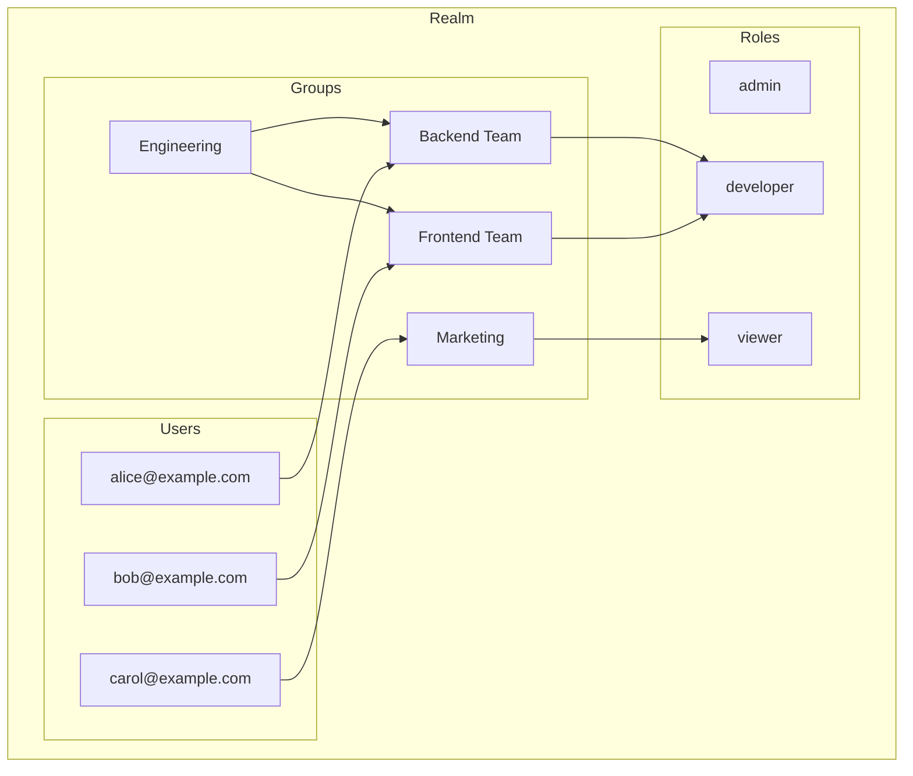
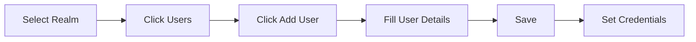
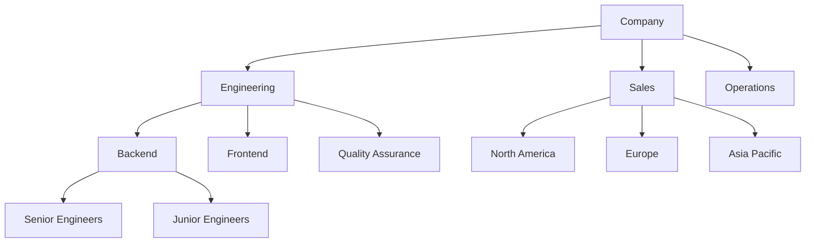
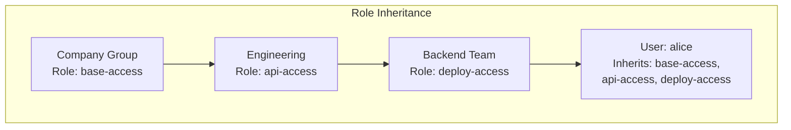
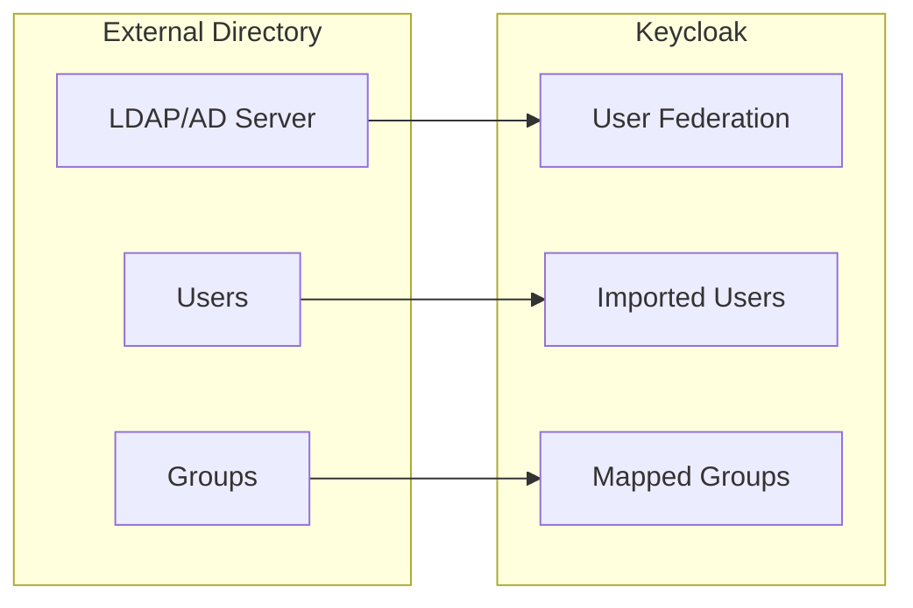
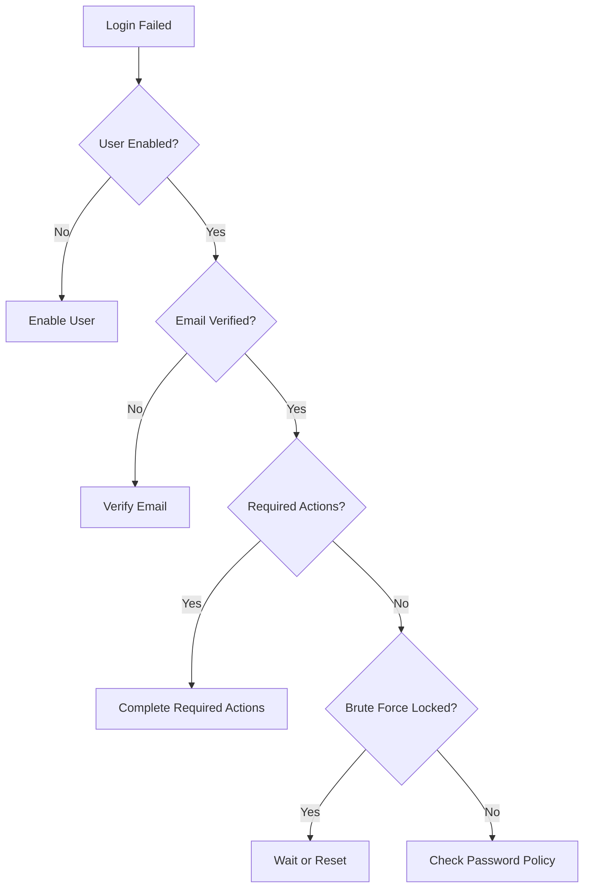

# How to Configure Keycloak Users and Groups

Author: [nawazdhandala](https://www.github.com/nawazdhandala)

Tags: Keycloak, Users, Groups, Identity Management, Authentication, RBAC, IAM, Security

Description: A practical guide to configuring users and groups in Keycloak, covering user creation, group hierarchies, role assignments, attribute mapping, and integration patterns for enterprise identity management.

---

> Managing users and groups effectively in Keycloak forms the foundation of any secure identity management system. Whether you're building a small application or an enterprise-grade platform, understanding how to structure users, groups, and their relationships will save countless hours of troubleshooting.

User management seems straightforward until your organization scales. Groups provide the abstraction layer needed to manage permissions efficiently across hundreds or thousands of users.

---

## User and Group Architecture

Keycloak organizes identity data in a hierarchical structure where users belong to groups, and both can have roles assigned to them. Understanding how these pieces fit together helps you design a maintainable access control system.



---

## Creating Users

### Via Admin Console

The Keycloak Admin Console provides a straightforward interface for user creation. Navigate to your realm, then select **Users** from the left sidebar.



### Via Admin CLI

The Admin CLI offers scripted user creation for automation and bulk operations. Before running user commands, authenticate with the Keycloak server.

```bash
# Authenticate to Keycloak Admin CLI
# Replace credentials and server URL with your values
./kcadm.sh config credentials \
  --server http://localhost:8080 \
  --realm master \
  --user admin \
  --password admin
```

After authentication, create users with the following command structure.

```bash
# Create a new user in the 'mycompany' realm
# The -r flag specifies the target realm
# The -s flags set user attributes
./kcadm.sh create users -r mycompany \
  -s username=alice \
  -s email=alice@example.com \
  -s emailVerified=true \
  -s enabled=true \
  -s firstName=Alice \
  -s lastName=Johnson
```

Setting the initial password requires a separate command.

```bash
# Set password for the user
# The --temporary flag forces password change on first login
./kcadm.sh set-password -r mycompany \
  --username alice \
  --new-password "initialPassword123" \
  --temporary
```

### Via REST API

The Keycloak Admin REST API enables programmatic user management from any language. First, obtain an admin access token.

```bash
# Get an admin access token
# Store the token for subsequent API calls
TOKEN=$(curl -s -X POST \
  "http://localhost:8080/realms/master/protocol/openid-connect/token" \
  -H "Content-Type: application/x-www-form-urlencoded" \
  -d "username=admin" \
  -d "password=admin" \
  -d "grant_type=password" \
  -d "client_id=admin-cli" | jq -r '.access_token')
```

Use the token to create users via the REST API.

```bash
# Create a user via REST API
# The JSON payload contains all user attributes
curl -X POST \
  "http://localhost:8080/admin/realms/mycompany/users" \
  -H "Authorization: Bearer $TOKEN" \
  -H "Content-Type: application/json" \
  -d '{
    "username": "bob",
    "email": "bob@example.com",
    "emailVerified": true,
    "enabled": true,
    "firstName": "Bob",
    "lastName": "Smith",
    "credentials": [{
      "type": "password",
      "value": "tempPassword456",
      "temporary": true
    }]
  }'
```

---

## User Attributes

Custom attributes extend the user model beyond the built-in fields. Attributes store application-specific data like department codes, employee IDs, or preferences.

### Setting Attributes via CLI

```bash
# Add custom attributes to a user
# Multiple -s flags can set multiple attributes
./kcadm.sh update users/<USER_ID> -r mycompany \
  -s 'attributes.department=["Engineering"]' \
  -s 'attributes.employeeId=["EMP001"]' \
  -s 'attributes.costCenter=["CC-1234"]'
```

### Setting Attributes via REST API

```bash
# Update user attributes via API
# First, get the user ID by username
USER_ID=$(curl -s \
  "http://localhost:8080/admin/realms/mycompany/users?username=bob" \
  -H "Authorization: Bearer $TOKEN" | jq -r '.[0].id')

# Update the user with custom attributes
curl -X PUT \
  "http://localhost:8080/admin/realms/mycompany/users/$USER_ID" \
  -H "Authorization: Bearer $TOKEN" \
  -H "Content-Type: application/json" \
  -d '{
    "attributes": {
      "department": ["Engineering"],
      "employeeId": ["EMP002"],
      "manager": ["alice"]
    }
  }'
```

### Mapping Attributes to Tokens

Include custom attributes in JWT tokens using protocol mappers. Create a client scope or add a mapper directly to your client.

```json
{
  "name": "department-mapper",
  "protocol": "openid-connect",
  "protocolMapper": "oidc-usermodel-attribute-mapper",
  "config": {
    "user.attribute": "department",
    "claim.name": "department",
    "jsonType.label": "String",
    "id.token.claim": "true",
    "access.token.claim": "true",
    "userinfo.token.claim": "true"
  }
}
```

---

## Creating Groups

Groups simplify permission management by allowing you to assign roles and attributes once, then add users to inherit those settings.

### Group Hierarchy Design

Plan your group structure before implementation. A well-designed hierarchy mirrors your organizational structure and access requirements.



### Via Admin CLI

```bash
# Create a top-level group
./kcadm.sh create groups -r mycompany \
  -s name=Engineering

# Get the group ID for creating subgroups
ENG_GROUP_ID=$(./kcadm.sh get groups -r mycompany \
  --fields id,name | jq -r '.[] | select(.name=="Engineering") | .id')

# Create a subgroup under Engineering
./kcadm.sh create groups/$ENG_GROUP_ID/children -r mycompany \
  -s name="Backend Team"

# Create another subgroup
./kcadm.sh create groups/$ENG_GROUP_ID/children -r mycompany \
  -s name="Frontend Team"
```

### Via REST API

```bash
# Create a top-level group via REST API
curl -X POST \
  "http://localhost:8080/admin/realms/mycompany/groups" \
  -H "Authorization: Bearer $TOKEN" \
  -H "Content-Type: application/json" \
  -d '{"name": "Marketing"}'

# Get the group ID
MARKETING_ID=$(curl -s \
  "http://localhost:8080/admin/realms/mycompany/groups?search=Marketing" \
  -H "Authorization: Bearer $TOKEN" | jq -r '.[0].id')

# Create a subgroup
curl -X POST \
  "http://localhost:8080/admin/realms/mycompany/groups/$MARKETING_ID/children" \
  -H "Authorization: Bearer $TOKEN" \
  -H "Content-Type: application/json" \
  -d '{"name": "Content Team"}'
```

---

## Adding Users to Groups

### Single User Assignment

```bash
# Add a user to a group via CLI
# First, get the user ID
USER_ID=$(./kcadm.sh get users -r mycompany \
  -q username=alice --fields id | jq -r '.[0].id')

# Get the group ID
GROUP_ID=$(./kcadm.sh get groups -r mycompany \
  --fields id,name | jq -r '.[] | select(.name=="Backend Team") | .id')

# Add user to group
./kcadm.sh update users/$USER_ID/groups/$GROUP_ID -r mycompany -s realm=mycompany -n
```

### Via REST API

```bash
# Add user to group via REST API
# PUT request with empty body creates the membership
curl -X PUT \
  "http://localhost:8080/admin/realms/mycompany/users/$USER_ID/groups/$GROUP_ID" \
  -H "Authorization: Bearer $TOKEN"
```

### Bulk Assignment Script

Automate group assignments for multiple users with a simple script.

```bash
#!/bin/bash
# bulk_group_assign.sh
# Assigns multiple users to a group from a CSV file

# Configuration
KEYCLOAK_URL="http://localhost:8080"
REALM="mycompany"
GROUP_NAME="Engineering"

# Get admin token
TOKEN=$(curl -s -X POST \
  "$KEYCLOAK_URL/realms/master/protocol/openid-connect/token" \
  -d "username=admin&password=admin&grant_type=password&client_id=admin-cli" \
  | jq -r '.access_token')

# Get group ID
GROUP_ID=$(curl -s \
  "$KEYCLOAK_URL/admin/realms/$REALM/groups?search=$GROUP_NAME" \
  -H "Authorization: Bearer $TOKEN" | jq -r '.[0].id')

# Read usernames from file and add to group
while IFS= read -r username; do
  # Get user ID
  USER_ID=$(curl -s \
    "$KEYCLOAK_URL/admin/realms/$REALM/users?username=$username" \
    -H "Authorization: Bearer $TOKEN" | jq -r '.[0].id')

  if [ "$USER_ID" != "null" ]; then
    # Add user to group
    curl -X PUT \
      "$KEYCLOAK_URL/admin/realms/$REALM/users/$USER_ID/groups/$GROUP_ID" \
      -H "Authorization: Bearer $TOKEN"
    echo "Added $username to $GROUP_NAME"
  else
    echo "User not found: $username"
  fi
done < users.txt
```

---

## Group Roles and Inheritance

Roles assigned to groups are inherited by all members. Role inheritance follows the group hierarchy, so users in subgroups inherit roles from parent groups.



### Assigning Roles to Groups

```bash
# Get the role representation
ROLE_ID=$(./kcadm.sh get roles -r mycompany \
  --fields id,name | jq -r '.[] | select(.name=="developer") | .id')

# Assign realm role to group
./kcadm.sh create groups/$GROUP_ID/role-mappings/realm -r mycompany \
  -f - << EOF
[{"id": "$ROLE_ID", "name": "developer"}]
EOF
```

### Client Roles to Groups

```bash
# Get client ID first
CLIENT_ID=$(./kcadm.sh get clients -r mycompany \
  -q clientId=myapp --fields id | jq -r '.[0].id')

# Get client role
CLIENT_ROLE=$(./kcadm.sh get clients/$CLIENT_ID/roles -r mycompany \
  --fields id,name | jq -r '.[] | select(.name=="editor")')

# Assign client role to group
./kcadm.sh create groups/$GROUP_ID/role-mappings/clients/$CLIENT_ID -r mycompany \
  -f - << EOF
[$CLIENT_ROLE]
EOF
```

---

## Group Attributes

Groups can have custom attributes that propagate to all members. Use group attributes for shared configuration like feature flags or resource limits.

```bash
# Set group attributes via CLI
./kcadm.sh update groups/$GROUP_ID -r mycompany \
  -s 'attributes.maxApiCalls=["10000"]' \
  -s 'attributes.featureFlags=["beta-features", "dark-mode"]' \
  -s 'attributes.supportTier=["premium"]'
```

### Include Group Attributes in Tokens

Create a protocol mapper to include group attributes in JWT tokens.

```json
{
  "name": "group-attributes-mapper",
  "protocol": "openid-connect",
  "protocolMapper": "oidc-group-membership-mapper",
  "config": {
    "full.path": "false",
    "id.token.claim": "true",
    "access.token.claim": "true",
    "claim.name": "groups",
    "userinfo.token.claim": "true"
  }
}
```

---

## User Federation with LDAP

Connect Keycloak to existing LDAP or Active Directory servers to import users and groups automatically.



### Configure LDAP Federation

```bash
# Create LDAP user federation provider
./kcadm.sh create components -r mycompany -s name=ldap-provider \
  -s providerId=ldap \
  -s providerType=org.keycloak.storage.UserStorageProvider \
  -s 'config.vendor=["ad"]' \
  -s 'config.connectionUrl=["ldap://ldap.example.com:389"]' \
  -s 'config.bindDn=["cn=admin,dc=example,dc=com"]' \
  -s 'config.bindCredential=["password"]' \
  -s 'config.usersDn=["ou=users,dc=example,dc=com"]' \
  -s 'config.usernameLDAPAttribute=["sAMAccountName"]' \
  -s 'config.uuidLDAPAttribute=["objectGUID"]' \
  -s 'config.userObjectClasses=["person, organizationalPerson, user"]' \
  -s 'config.editMode=["READ_ONLY"]' \
  -s 'config.syncRegistrations=["false"]'
```

### Configure Group Mapper for LDAP

```bash
# Get the LDAP provider ID first
LDAP_ID=$(./kcadm.sh get components -r mycompany \
  --fields id,name | jq -r '.[] | select(.name=="ldap-provider") | .id')

# Create group mapper
./kcadm.sh create components -r mycompany \
  -s name=group-ldap-mapper \
  -s providerId=group-ldap-mapper \
  -s providerType=org.keycloak.storage.ldap.mappers.LDAPStorageMapper \
  -s parentId=$LDAP_ID \
  -s 'config.groups.dn=["ou=groups,dc=example,dc=com"]' \
  -s 'config.group.name.ldap.attribute=["cn"]' \
  -s 'config.group.object.classes=["group"]' \
  -s 'config.membership.ldap.attribute=["member"]' \
  -s 'config.membership.attribute.type=["DN"]' \
  -s 'config.mode=["LDAP_ONLY"]' \
  -s 'config.drop.non.existing.groups.during.sync=["false"]'
```

---

## Self-Service User Registration

Enable users to register themselves without admin intervention.

### Enable Registration in Realm

```bash
# Enable user registration for the realm
./kcadm.sh update realms/mycompany \
  -s registrationAllowed=true \
  -s registrationEmailAsUsername=true \
  -s verifyEmail=true
```

### Configure Required Actions

Required actions force users to complete specific steps on first login.

```bash
# Get list of required actions
./kcadm.sh get authentication/required-actions -r mycompany

# Set default required actions for new users
./kcadm.sh update realms/mycompany \
  -s 'defaultDefaultClientScopes=["profile", "email"]' \
  -s 'requiredActions=["VERIFY_EMAIL", "UPDATE_PASSWORD"]'
```

### Auto-Assign Groups on Registration

Create an authentication flow that automatically adds new users to a default group.

```bash
# Configure default group for new registrations
# First, get the group ID
DEFAULT_GROUP_ID=$(./kcadm.sh get groups -r mycompany \
  --fields id,name | jq -r '.[] | select(.name=="New Users") | .id')

# Set as default group
./kcadm.sh update realms/mycompany \
  -s "defaultGroups=[\"$DEFAULT_GROUP_ID\"]"
```

---

## Programmatic User Management

### Python SDK Example

Use the python-keycloak library for programmatic user and group management.

```python
# user_management.py
# Keycloak user and group management with Python SDK
from keycloak import KeycloakAdmin
from keycloak import KeycloakOpenIDConnection

# Initialize connection to Keycloak
# Store credentials in environment variables for production
keycloak_connection = KeycloakOpenIDConnection(
    server_url="http://localhost:8080/",
    username="admin",
    password="admin",
    realm_name="master",
    verify=True
)

# Create admin client for user management
keycloak_admin = KeycloakAdmin(connection=keycloak_connection)

# Switch to target realm
keycloak_admin.change_current_realm("mycompany")


def create_user_with_group(username: str, email: str,
                           group_name: str, temp_password: str) -> str:
    """Create a user and assign to a group in one operation"""

    # Create the user
    # Returns the user ID on success
    user_id = keycloak_admin.create_user({
        "username": username,
        "email": email,
        "emailVerified": True,
        "enabled": True,
        "credentials": [{
            "type": "password",
            "value": temp_password,
            "temporary": True
        }]
    })

    # Get group ID by name
    groups = keycloak_admin.get_groups()
    group_id = None
    for group in groups:
        if group["name"] == group_name:
            group_id = group["id"]
            break

    if group_id:
        # Add user to group
        keycloak_admin.group_user_add(user_id, group_id)

    return user_id


def sync_users_from_csv(csv_path: str, default_group: str):
    """Bulk import users from a CSV file"""
    import csv

    with open(csv_path, 'r') as f:
        reader = csv.DictReader(f)
        for row in reader:
            try:
                user_id = create_user_with_group(
                    username=row['username'],
                    email=row['email'],
                    group_name=row.get('group', default_group),
                    temp_password=row.get('password', 'ChangeMe123!')
                )
                print(f"Created user: {row['username']} ({user_id})")
            except Exception as e:
                print(f"Failed to create {row['username']}: {e}")


def get_users_in_group(group_name: str) -> list:
    """Retrieve all users in a specific group"""

    # Find group by name
    groups = keycloak_admin.get_groups()
    group_id = None
    for group in groups:
        if group["name"] == group_name:
            group_id = group["id"]
            break

    if not group_id:
        return []

    # Get group members
    return keycloak_admin.get_group_members(group_id)


def update_user_groups(username: str, new_groups: list,
                       remove_existing: bool = False):
    """Update group memberships for a user"""

    # Get user ID
    users = keycloak_admin.get_users({"username": username})
    if not users:
        raise ValueError(f"User not found: {username}")

    user_id = users[0]["id"]

    # Remove from existing groups if requested
    if remove_existing:
        current_groups = keycloak_admin.get_user_groups(user_id)
        for group in current_groups:
            keycloak_admin.group_user_remove(user_id, group["id"])

    # Add to new groups
    all_groups = keycloak_admin.get_groups()
    group_map = {g["name"]: g["id"] for g in all_groups}

    for group_name in new_groups:
        if group_name in group_map:
            keycloak_admin.group_user_add(user_id, group_map[group_name])
```

### Go SDK Example

```go
// user_management.go
// Keycloak user and group management with Go SDK
package main

import (
    "context"
    "fmt"
    "log"

    "github.com/Nerzal/gocloak/v13"
)

func main() {
    // Initialize Keycloak client
    client := gocloak.NewClient("http://localhost:8080")
    ctx := context.Background()

    // Authenticate as admin
    // Store credentials securely in production
    token, err := client.LoginAdmin(ctx, "admin", "admin", "master")
    if err != nil {
        log.Fatalf("Failed to login: %v", err)
    }

    realm := "mycompany"

    // Create a new user
    user := gocloak.User{
        Username:      gocloak.StringP("carol"),
        Email:         gocloak.StringP("carol@example.com"),
        EmailVerified: gocloak.BoolP(true),
        Enabled:       gocloak.BoolP(true),
        FirstName:     gocloak.StringP("Carol"),
        LastName:      gocloak.StringP("Williams"),
    }

    userID, err := client.CreateUser(ctx, token.AccessToken, realm, user)
    if err != nil {
        log.Fatalf("Failed to create user: %v", err)
    }
    fmt.Printf("Created user: %s\n", userID)

    // Set initial password
    err = client.SetPassword(ctx, token.AccessToken, userID, realm,
        "tempPassword789", true)
    if err != nil {
        log.Fatalf("Failed to set password: %v", err)
    }

    // Get group by name
    groups, err := client.GetGroups(ctx, token.AccessToken, realm,
        gocloak.GetGroupsParams{Search: gocloak.StringP("Engineering")})
    if err != nil {
        log.Fatalf("Failed to get groups: %v", err)
    }

    if len(groups) > 0 {
        // Add user to group
        err = client.AddUserToGroup(ctx, token.AccessToken, realm,
            userID, *groups[0].ID)
        if err != nil {
            log.Fatalf("Failed to add user to group: %v", err)
        }
        fmt.Println("Added user to Engineering group")
    }
}
```

---

## Security Best Practices

### Password Policies

Configure strong password policies at the realm level.

```bash
# Set comprehensive password policy
./kcadm.sh update realms/mycompany \
  -s 'passwordPolicy="length(12) and digits(2) and upperCase(1) and lowerCase(1) and specialChars(1) and notUsername and passwordHistory(5)"'
```

### Brute Force Protection

Enable brute force detection to prevent password guessing attacks.

```bash
# Enable brute force protection
./kcadm.sh update realms/mycompany \
  -s bruteForceProtected=true \
  -s failureFactor=5 \
  -s maxFailureWaitSeconds=900 \
  -s minimumQuickLoginWaitSeconds=60 \
  -s waitIncrementSeconds=60 \
  -s quickLoginCheckMilliSeconds=1000 \
  -s maxDeltaTimeSeconds=43200 \
  -s permanentLockout=false
```

### Session Management

```bash
# Configure session timeouts
./kcadm.sh update realms/mycompany \
  -s ssoSessionIdleTimeout=1800 \
  -s ssoSessionMaxLifespan=36000 \
  -s accessTokenLifespan=300 \
  -s accessTokenLifespanForImplicitFlow=900
```

---

## Troubleshooting Common Issues

### User Cannot Login



### Debug User Session

```bash
# List active sessions for a user
USER_ID=$(./kcadm.sh get users -r mycompany \
  -q username=alice --fields id | jq -r '.[0].id')

./kcadm.sh get users/$USER_ID/sessions -r mycompany

# Force logout all sessions for a user
./kcadm.sh create users/$USER_ID/logout -r mycompany
```

### Audit User Events

```bash
# Enable event logging
./kcadm.sh update realms/mycompany \
  -s eventsEnabled=true \
  -s adminEventsEnabled=true \
  -s adminEventsDetailsEnabled=true

# Query user events
curl -s \
  "http://localhost:8080/admin/realms/mycompany/events?user=alice&type=LOGIN" \
  -H "Authorization: Bearer $TOKEN" | jq
```

---

## Conclusion

Effective user and group management in Keycloak requires planning your hierarchy before implementation. Key takeaways include:

- **Use groups liberally** - Assign roles to groups, not individual users
- **Design hierarchies carefully** - Mirror your organizational structure
- **Leverage attributes** - Store custom data on users and groups
- **Automate everything** - Use CLI or API for repeatable operations
- **Enable security features** - Password policies and brute force protection are essential

With proper configuration, Keycloak handles identity management at any scale while maintaining security and flexibility.

---

*Managing identity across your infrastructure? [OneUptime](https://oneuptime.com) provides monitoring and alerting for your Keycloak instances and the applications they protect, ensuring your authentication layer stays healthy.*

**Related Reading:**
- [How to Install and Configure Keycloak](https://oneuptime.com/blog/post/2026-02-02-keycloak-installation-configuration/view)
- [How to Configure Keycloak Realms and Clients](https://oneuptime.com/blog/post/2026-01-27-keycloak-realms-clients/view)
- [How to Configure Keycloak Single Sign-On](https://oneuptime.com/blog/post/2026-01-27-keycloak-sso/view)
