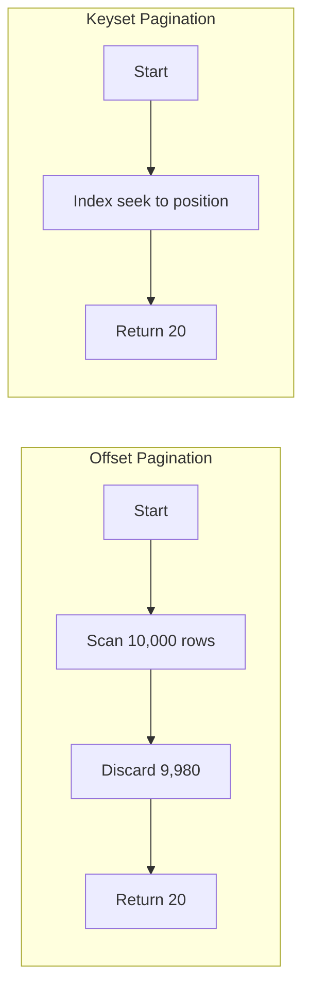
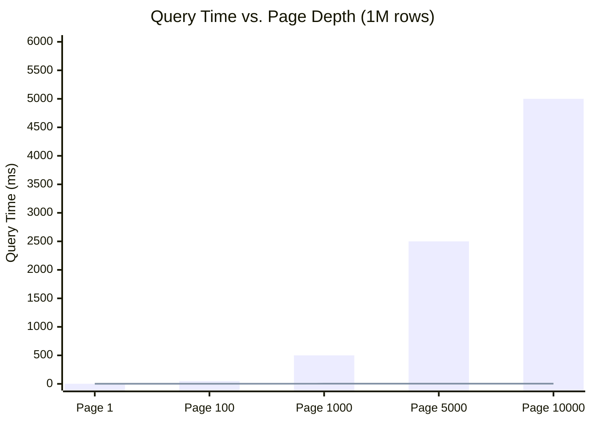

# How to Implement Keyset Pagination for Large Datasets

Author: [nawazdhandala](https://www.github.com/nawazdhandala)

Tags: Pagination, REST API, Database, Performance, PostgreSQL, MySQL, SQL, Backend Development

Description: Learn how to implement keyset pagination (also known as seek pagination) for efficiently handling large datasets. This guide covers the fundamentals, database indexing strategies, multi-column sorting, bidirectional navigation, and production best practices.

---

Offset pagination breaks down at scale. When a user requests page 10,000 of your results, the database still scans and discards 200,000 rows before returning the 20 they asked for. Keyset pagination solves this by using indexed column values to jump directly to the right position, maintaining constant-time performance regardless of how deep into the dataset you go.

This guide covers everything you need to implement production-ready keyset pagination, from basic concepts to handling complex multi-column sorts and bidirectional navigation.

---

## Why Keyset Pagination Matters

Traditional offset pagination suffers from two fundamental problems:

**1. Performance Degradation at Scale**

The database must process all rows up to your offset, even though it discards most of them. Performance degrades linearly with offset size.

| Offset | Query Time (1M rows) | Rows Scanned |
|--------|---------------------|--------------|
| 0 | 2ms | 20 |
| 1,000 | 15ms | 1,020 |
| 10,000 | 120ms | 10,020 |
| 100,000 | 1,200ms | 100,020 |
| 500,000 | 6,000ms | 500,020 |

**2. Inconsistent Results with Concurrent Writes**

When data changes between page requests, offset pagination can skip items or show duplicates. If a new record is inserted on page 1 while you are viewing page 2, the item at the boundary shifts and you might see it twice or miss it entirely.

Keyset pagination addresses both issues by using the actual values of the last seen record to fetch the next batch.

---

## How Keyset Pagination Works

Instead of saying "skip N rows," keyset pagination says "give me rows after this specific value." The database uses an index seek operation instead of a full scan.



The key insight is that with proper indexing, the database can jump directly to the position defined by your keyset values without scanning intermediate rows.

---

## Basic Implementation

Here is a simple keyset pagination implementation using a single column.

The following SQL shows the difference between offset and keyset approaches for the same logical page.

```sql
-- Offset approach: scans and discards 1000 rows before returning 20
-- Slow and gets worse as offset increases
SELECT id, title, created_at
FROM articles
ORDER BY id
LIMIT 20 OFFSET 1000;

-- Keyset approach: uses index to jump directly to position
-- Constant time regardless of position in dataset
SELECT id, title, created_at
FROM articles
WHERE id > 1000
ORDER BY id
LIMIT 20;
```

The index on `id` allows the database to seek directly to value 1000 and start returning rows from there.

### Node.js Implementation

This Express handler demonstrates a complete keyset pagination endpoint with proper validation and response formatting.

```javascript
// keyset-pagination.js
// Implements keyset pagination using the id column as the cursor
const express = require('express');
const app = express();

app.get('/api/articles', async (req, res) => {
  // Parse the keyset cursor from query params
  // afterId represents the last id the client received
  const afterId = req.query.after_id ? parseInt(req.query.after_id) : null;

  // Enforce a maximum limit to prevent excessive data transfer
  const limit = Math.min(parseInt(req.query.limit) || 20, 100);

  // Build the query with keyset condition
  // When afterId is null, we start from the beginning
  let query = `
    SELECT id, title, author, created_at
    FROM articles
    WHERE ($1::int IS NULL OR id > $1)
    ORDER BY id ASC
    LIMIT $2
  `;

  const result = await db.query(query, [afterId, limit + 1]);
  const rows = result.rows;

  // Check if there are more results by fetching one extra row
  const hasMore = rows.length > limit;
  const items = hasMore ? rows.slice(0, limit) : rows;

  // Build the next cursor from the last item
  const nextCursor = hasMore && items.length > 0
    ? items[items.length - 1].id
    : null;

  res.json({
    data: items,
    pagination: {
      next_cursor: nextCursor,
      has_more: hasMore,
      limit: limit
    }
  });
});
```

---

## Multi-Column Keyset Pagination

Real applications often need to sort by columns that are not unique. For example, sorting articles by `created_at` requires a tiebreaker column (usually the primary key) to ensure deterministic ordering.

### The Tuple Comparison Pattern

When sorting by multiple columns, you need to compare them as a tuple to maintain proper ordering. The condition becomes more complex but remains efficient with the right index.

```sql
-- Multi-column keyset pagination with created_at DESC, id DESC
-- The tuple comparison ensures correct ordering across both columns
SELECT id, title, author, created_at
FROM articles
WHERE (created_at, id) < ($1, $2)
ORDER BY created_at DESC, id DESC
LIMIT 20;
```

This query returns articles that come after the cursor position in the sort order. The tuple comparison `(created_at, id) < ($1, $2)` is equivalent to:

```sql
-- Expanded form of the tuple comparison
-- Less readable but shows the actual logic
WHERE created_at < $1
   OR (created_at = $1 AND id < $2)
```

### Python Implementation with SQLAlchemy

This implementation handles multi-column sorting with proper tuple comparison.

```python
# keyset_pagination.py
# Multi-column keyset pagination using SQLAlchemy
from fastapi import FastAPI, Query, Depends, HTTPException
from sqlalchemy.orm import Session
from sqlalchemy import and_, or_, desc
from datetime import datetime
from typing import Optional
from pydantic import BaseModel

app = FastAPI()

class KeysetParams(BaseModel):
    """Parameters for keyset pagination cursor"""
    created_at: datetime
    id: int

class PaginatedResponse(BaseModel):
    """Response format with keyset cursor"""
    data: list
    next_cursor: Optional[KeysetParams]
    has_more: bool

@app.get("/articles")
def list_articles(
    # Keyset cursor values from the previous page
    after_created_at: Optional[datetime] = Query(
        None,
        description="created_at value of last item from previous page"
    ),
    after_id: Optional[int] = Query(
        None,
        description="id value of last item from previous page"
    ),
    limit: int = Query(20, ge=1, le=100),
    db: Session = Depends(get_db)
):
    """
    Fetch articles with keyset pagination.

    Both after_created_at and after_id must be provided together
    when requesting subsequent pages.
    """
    # Validate that both cursor values are present or both are absent
    if (after_created_at is None) != (after_id is None):
        raise HTTPException(
            status_code=400,
            detail="Both after_created_at and after_id must be provided together"
        )

    # Start building the query with sort order
    query = db.query(Article).order_by(
        desc(Article.created_at),
        desc(Article.id)
    )

    # Apply keyset filter when cursor is provided
    if after_created_at is not None:
        # Tuple comparison for multi-column sort
        # This finds all rows that come after the cursor position
        query = query.filter(
            or_(
                Article.created_at < after_created_at,
                and_(
                    Article.created_at == after_created_at,
                    Article.id < after_id
                )
            )
        )

    # Fetch one extra row to determine if more results exist
    items = query.limit(limit + 1).all()
    has_more = len(items) > limit

    if has_more:
        items = items[:limit]

    # Build the cursor for the next page
    next_cursor = None
    if has_more and items:
        last_item = items[-1]
        next_cursor = KeysetParams(
            created_at=last_item.created_at,
            id=last_item.id
        )

    return PaginatedResponse(
        data=[item.to_dict() for item in items],
        next_cursor=next_cursor,
        has_more=has_more
    )
```

---

## Database Indexing Strategy

Keyset pagination only performs well with proper indexing. The index must match your sort order exactly.

### Creating the Right Index

The index columns and their sort directions must match your query's ORDER BY clause.

```sql
-- For ORDER BY created_at DESC, id DESC
-- Create a composite index matching the exact sort order
CREATE INDEX idx_articles_keyset
ON articles (created_at DESC, id DESC);

-- Verify the index is being used
EXPLAIN ANALYZE
SELECT id, title, created_at
FROM articles
WHERE (created_at, id) < ('2026-01-15 10:00:00', 12345)
ORDER BY created_at DESC, id DESC
LIMIT 20;
```

The explain output should show an "Index Scan" or "Index Only Scan" rather than a "Seq Scan".

### Index Design Guidelines

Follow these rules when creating indexes for keyset pagination.

```sql
-- Rule 1: Index column order must match ORDER BY column order
-- Good: columns in same order as ORDER BY
CREATE INDEX idx_good ON articles (created_at DESC, id DESC);

-- Bad: columns in different order
CREATE INDEX idx_bad ON articles (id DESC, created_at DESC);

-- Rule 2: Index sort direction must match ORDER BY sort direction
-- Good: descending to match ORDER BY ... DESC
CREATE INDEX idx_good ON articles (created_at DESC, id DESC);

-- Bad: ascending when query needs descending
CREATE INDEX idx_bad ON articles (created_at ASC, id ASC);

-- Rule 3: Include filter columns if using covering index
-- Covers the entire query without table lookups
CREATE INDEX idx_covering
ON articles (created_at DESC, id DESC)
INCLUDE (title, author);
```

---

## Bidirectional Navigation

Users sometimes need to go backward through results. Keyset pagination supports this by reversing the comparison operators and sort direction.


### Implementation

This implementation supports both forward and backward navigation using direction-aware queries.

```python
# bidirectional_pagination.py
# Supports both forward and backward navigation through results
from enum import Enum

class Direction(str, Enum):
    FORWARD = "forward"
    BACKWARD = "backward"

@app.get("/articles/bidirectional")
def list_articles_bidirectional(
    cursor_created_at: Optional[datetime] = None,
    cursor_id: Optional[int] = None,
    direction: Direction = Query(Direction.FORWARD),
    limit: int = Query(20, ge=1, le=100),
    db: Session = Depends(get_db)
):
    """
    Fetch articles with bidirectional keyset pagination.

    For forward navigation: returns items after the cursor
    For backward navigation: returns items before the cursor
    """
    has_cursor = cursor_created_at is not None and cursor_id is not None

    if direction == Direction.FORWARD:
        # Forward: ORDER BY created_at DESC, id DESC
        # Filter: (created_at, id) < cursor
        query = db.query(Article).order_by(
            desc(Article.created_at),
            desc(Article.id)
        )

        if has_cursor:
            query = query.filter(
                or_(
                    Article.created_at < cursor_created_at,
                    and_(
                        Article.created_at == cursor_created_at,
                        Article.id < cursor_id
                    )
                )
            )
    else:
        # Backward: reverse the sort order temporarily
        # ORDER BY created_at ASC, id ASC
        # Filter: (created_at, id) > cursor
        query = db.query(Article).order_by(
            Article.created_at.asc(),
            Article.id.asc()
        )

        if has_cursor:
            query = query.filter(
                or_(
                    Article.created_at > cursor_created_at,
                    and_(
                        Article.created_at == cursor_created_at,
                        Article.id > cursor_id
                    )
                )
            )

    items = query.limit(limit + 1).all()
    has_more = len(items) > limit

    if has_more:
        items = items[:limit]

    # For backward navigation, reverse results to maintain display order
    if direction == Direction.BACKWARD:
        items = list(reversed(items))

    # Build cursors for both directions
    response = {
        "data": [item.to_dict() for item in items],
        "has_more": has_more
    }

    if items:
        first_item = items[0]
        last_item = items[-1]

        response["cursors"] = {
            "previous": {
                "created_at": first_item.created_at.isoformat(),
                "id": first_item.id,
                "direction": "backward"
            },
            "next": {
                "created_at": last_item.created_at.isoformat(),
                "id": last_item.id,
                "direction": "forward"
            }
        }

    return response
```

---

## Handling NULL Values

NULL values require special handling in keyset pagination because NULL comparisons behave differently in SQL.

### The NULL Problem

Standard comparison operators do not work with NULL values as you might expect.

```sql
-- This will NOT return rows where created_at is NULL
SELECT * FROM articles
WHERE created_at < '2026-01-15'
ORDER BY created_at DESC;

-- NULL values are not less than, greater than, or equal to anything
-- They are simply unknown
```

### Solution: Explicit NULL Handling

Handle NULLs explicitly in your keyset conditions.

```python
# null_handling.py
# Keyset pagination that properly handles NULL values in sort columns
@app.get("/articles/with-nulls")
def list_articles_with_nulls(
    cursor_published_at: Optional[datetime] = None,
    cursor_id: Optional[int] = None,
    cursor_is_null: bool = Query(False, description="Whether cursor published_at was NULL"),
    limit: int = Query(20, ge=1, le=100),
    db: Session = Depends(get_db)
):
    """
    Keyset pagination handling NULL values in published_at column.

    Sort order: published_at DESC NULLS LAST, id DESC
    NULLs appear at the end of the result set.
    """
    # Base query with NULLS LAST ordering
    query = db.query(Article).order_by(
        desc(Article.published_at).nulls_last(),
        desc(Article.id)
    )

    if cursor_id is not None:
        if cursor_is_null:
            # Cursor was on a NULL row
            # Only return other NULL rows with smaller id
            query = query.filter(
                and_(
                    Article.published_at.is_(None),
                    Article.id < cursor_id
                )
            )
        elif cursor_published_at is not None:
            # Cursor was on a non-NULL row
            # Return rows with earlier published_at OR NULL values OR same date with smaller id
            query = query.filter(
                or_(
                    Article.published_at < cursor_published_at,
                    Article.published_at.is_(None),
                    and_(
                        Article.published_at == cursor_published_at,
                        Article.id < cursor_id
                    )
                )
            )

    items = query.limit(limit + 1).all()
    has_more = len(items) > limit

    if has_more:
        items = items[:limit]

    # Build cursor indicating whether last item has NULL published_at
    next_cursor = None
    if has_more and items:
        last_item = items[-1]
        next_cursor = {
            "published_at": last_item.published_at.isoformat() if last_item.published_at else None,
            "id": last_item.id,
            "is_null": last_item.published_at is None
        }

    return {
        "data": items,
        "next_cursor": next_cursor,
        "has_more": has_more
    }
```

---

## Cursor Encoding Strategies

Exposing raw database values in cursors can leak internal details. Consider encoding cursors for cleaner APIs.

### Base64 Encoded Cursors

Encode cursor data as a single opaque string that clients pass back without understanding its contents.

```python
# cursor_encoding.py
# Encode keyset values into opaque cursor strings
import base64
import json
from typing import Optional
from datetime import datetime

def encode_cursor(created_at: datetime, record_id: int) -> str:
    """
    Encode keyset values into an opaque cursor string.

    Uses base64 to create a URL-safe string that hides
    the internal structure from clients.
    """
    cursor_data = {
        "c": created_at.isoformat(),
        "i": record_id
    }
    json_bytes = json.dumps(cursor_data).encode('utf-8')
    return base64.urlsafe_b64encode(json_bytes).decode('utf-8')

def decode_cursor(cursor: str) -> Optional[dict]:
    """
    Decode cursor string back to keyset values.

    Returns None if cursor is invalid or malformed.
    """
    try:
        json_bytes = base64.urlsafe_b64decode(cursor.encode('utf-8'))
        data = json.loads(json_bytes.decode('utf-8'))
        return {
            "created_at": datetime.fromisoformat(data["c"]),
            "id": data["i"]
        }
    except (ValueError, KeyError, json.JSONDecodeError):
        return None

@app.get("/articles/encoded")
def list_articles_encoded(
    cursor: Optional[str] = Query(None, description="Opaque pagination cursor"),
    limit: int = Query(20, ge=1, le=100),
    db: Session = Depends(get_db)
):
    """
    Keyset pagination with encoded cursor.

    Clients receive and return opaque cursor strings
    without knowing the internal structure.
    """
    keyset_values = None
    if cursor:
        keyset_values = decode_cursor(cursor)
        if keyset_values is None:
            raise HTTPException(status_code=400, detail="Invalid cursor")

    query = db.query(Article).order_by(
        desc(Article.created_at),
        desc(Article.id)
    )

    if keyset_values:
        query = query.filter(
            or_(
                Article.created_at < keyset_values["created_at"],
                and_(
                    Article.created_at == keyset_values["created_at"],
                    Article.id < keyset_values["id"]
                )
            )
        )

    items = query.limit(limit + 1).all()
    has_more = len(items) > limit

    if has_more:
        items = items[:limit]

    next_cursor = None
    if has_more and items:
        last_item = items[-1]
        next_cursor = encode_cursor(last_item.created_at, last_item.id)

    return {
        "data": [item.to_dict() for item in items],
        "next_cursor": next_cursor,
        "has_more": has_more
    }
```

### Signed Cursors for Tamper Protection

Add HMAC signatures to prevent cursor tampering.

```python
# signed_cursor.py
# Cursors with HMAC signatures for tamper detection
import hmac
import hashlib
import os

# Load secret from environment variable
CURSOR_SECRET = os.environ.get("CURSOR_SECRET", "change-me-in-production")

def sign_cursor(cursor_data: str) -> str:
    """
    Add HMAC signature to cursor for tamper detection.

    Returns cursor in format: data.signature
    """
    signature = hmac.new(
        CURSOR_SECRET.encode(),
        cursor_data.encode(),
        hashlib.sha256
    ).hexdigest()[:16]  # Truncate for shorter URLs

    return f"{cursor_data}.{signature}"

def verify_cursor(signed_cursor: str) -> Optional[str]:
    """
    Verify cursor signature and return the data portion.

    Returns None if signature is invalid.
    """
    try:
        cursor_data, signature = signed_cursor.rsplit('.', 1)
        expected_signature = hmac.new(
            CURSOR_SECRET.encode(),
            cursor_data.encode(),
            hashlib.sha256
        ).hexdigest()[:16]

        if hmac.compare_digest(signature, expected_signature):
            return cursor_data
        return None
    except ValueError:
        return None
```

---

## Filtering with Keyset Pagination

Combining filters with keyset pagination requires careful index design to maintain performance.

### Filter-Aware Indexes

Create indexes that include your filter columns as leading columns.

```sql
-- For queries filtering by status and paginating by created_at
-- Filter column (status) comes first in the index
CREATE INDEX idx_articles_status_keyset
ON articles (status, created_at DESC, id DESC);

-- This query will use the index efficiently
SELECT id, title, created_at
FROM articles
WHERE status = 'published'
  AND (created_at, id) < ('2026-01-15', 12345)
ORDER BY created_at DESC, id DESC
LIMIT 20;
```

### Implementation with Filters

Handle filters that partition the data into separate result sets.

```python
# filtered_keyset.py
# Keyset pagination combined with filtering
@app.get("/articles/filtered")
def list_articles_filtered(
    # Filter parameters
    status: Optional[str] = Query(None, description="Filter by status"),
    author_id: Optional[int] = Query(None, description="Filter by author"),
    # Keyset cursor
    after_created_at: Optional[datetime] = None,
    after_id: Optional[int] = None,
    limit: int = Query(20, ge=1, le=100),
    db: Session = Depends(get_db)
):
    """
    Keyset pagination with optional filters.

    Filters are applied before keyset conditions.
    Ensure appropriate indexes exist for filter combinations.
    """
    query = db.query(Article)

    # Apply filters first
    # These should have corresponding indexes
    if status:
        query = query.filter(Article.status == status)

    if author_id:
        query = query.filter(Article.author_id == author_id)

    # Apply sort order
    query = query.order_by(
        desc(Article.created_at),
        desc(Article.id)
    )

    # Apply keyset condition
    if after_created_at is not None and after_id is not None:
        query = query.filter(
            or_(
                Article.created_at < after_created_at,
                and_(
                    Article.created_at == after_created_at,
                    Article.id < after_id
                )
            )
        )

    items = query.limit(limit + 1).all()
    has_more = len(items) > limit

    if has_more:
        items = items[:limit]

    return {
        "data": items,
        "filters": {"status": status, "author_id": author_id},
        "has_more": has_more,
        "next_cursor": {
            "after_created_at": items[-1].created_at.isoformat(),
            "after_id": items[-1].id
        } if has_more and items else None
    }
```

---

## Go Implementation

Here is a complete keyset pagination implementation in Go using the standard library and pgx driver.

```go
// keyset_pagination.go
// Production-ready keyset pagination in Go
package main

import (
    "context"
    "encoding/json"
    "net/http"
    "strconv"
    "time"

    "github.com/jackc/pgx/v5/pgxpool"
)

// Article represents an article in the database
type Article struct {
    ID        int64     `json:"id"`
    Title     string    `json:"title"`
    Author    string    `json:"author"`
    CreatedAt time.Time `json:"created_at"`
}

// KeysetCursor contains the values needed to resume pagination
type KeysetCursor struct {
    CreatedAt time.Time `json:"created_at"`
    ID        int64     `json:"id"`
}

// PaginatedResponse wraps the paginated results with cursor information
type PaginatedResponse struct {
    Data       []Article     `json:"data"`
    NextCursor *KeysetCursor `json:"next_cursor,omitempty"`
    HasMore    bool          `json:"has_more"`
}

// ArticleHandler handles article listing with keyset pagination
type ArticleHandler struct {
    db *pgxpool.Pool
}

func (h *ArticleHandler) ListArticles(w http.ResponseWriter, r *http.Request) {
    ctx := r.Context()

    // Parse limit with default and maximum values
    limit := 20
    if l := r.URL.Query().Get("limit"); l != "" {
        if parsed, err := strconv.Atoi(l); err == nil && parsed > 0 {
            limit = min(parsed, 100)
        }
    }

    // Parse keyset cursor values
    var afterCreatedAt *time.Time
    var afterID *int64

    if c := r.URL.Query().Get("after_created_at"); c != "" {
        if t, err := time.Parse(time.RFC3339, c); err == nil {
            afterCreatedAt = &t
        }
    }

    if i := r.URL.Query().Get("after_id"); i != "" {
        if id, err := strconv.ParseInt(i, 10, 64); err == nil {
            afterID = &id
        }
    }

    // Build and execute query
    articles, err := h.fetchArticles(ctx, afterCreatedAt, afterID, limit)
    if err != nil {
        http.Error(w, "Database error", http.StatusInternalServerError)
        return
    }

    // Determine if more results exist
    hasMore := len(articles) > limit
    if hasMore {
        articles = articles[:limit]
    }

    // Build response with next cursor
    response := PaginatedResponse{
        Data:    articles,
        HasMore: hasMore,
    }

    if hasMore && len(articles) > 0 {
        lastArticle := articles[len(articles)-1]
        response.NextCursor = &KeysetCursor{
            CreatedAt: lastArticle.CreatedAt,
            ID:        lastArticle.ID,
        }
    }

    w.Header().Set("Content-Type", "application/json")
    json.NewEncoder(w).Encode(response)
}

func (h *ArticleHandler) fetchArticles(
    ctx context.Context,
    afterCreatedAt *time.Time,
    afterID *int64,
    limit int,
) ([]Article, error) {
    // Query with keyset condition
    // Uses tuple comparison for correct multi-column ordering
    query := `
        SELECT id, title, author, created_at
        FROM articles
        WHERE ($1::timestamp IS NULL OR $2::bigint IS NULL)
           OR (created_at, id) < ($1, $2)
        ORDER BY created_at DESC, id DESC
        LIMIT $3
    `

    rows, err := h.db.Query(ctx, query, afterCreatedAt, afterID, limit+1)
    if err != nil {
        return nil, err
    }
    defer rows.Close()

    var articles []Article
    for rows.Next() {
        var a Article
        if err := rows.Scan(&a.ID, &a.Title, &a.Author, &a.CreatedAt); err != nil {
            return nil, err
        }
        articles = append(articles, a)
    }

    return articles, rows.Err()
}
```

---

## Performance Benchmarks

Compare keyset pagination against offset pagination across different dataset sizes.



The bar represents offset pagination times, while the line represents keyset pagination. Keyset maintains nearly constant performance regardless of position.

### Benchmark Script

Use this script to benchmark pagination performance in your own environment.

```python
# benchmark_pagination.py
# Compare offset vs keyset pagination performance
import time
import statistics
from typing import List, Callable

def benchmark_query(query_func: Callable, iterations: int = 10) -> dict:
    """
    Benchmark a query function over multiple iterations.

    Returns timing statistics including mean, median, and p95.
    """
    times: List[float] = []

    for _ in range(iterations):
        start = time.perf_counter()
        query_func()
        elapsed = (time.perf_counter() - start) * 1000  # Convert to ms
        times.append(elapsed)

    return {
        "mean_ms": statistics.mean(times),
        "median_ms": statistics.median(times),
        "p95_ms": statistics.quantiles(times, n=20)[18] if len(times) >= 20 else max(times),
        "min_ms": min(times),
        "max_ms": max(times)
    }

def run_pagination_benchmark(db, offsets: List[int]):
    """
    Compare offset and keyset pagination at various depths.

    Prints formatted comparison table.
    """
    print(f"{'Offset':<10} {'Offset Pagination':<20} {'Keyset Pagination':<20}")
    print("-" * 50)

    for offset in offsets:
        # Benchmark offset pagination
        def offset_query():
            db.execute(f"""
                SELECT id, title, created_at
                FROM articles
                ORDER BY created_at DESC, id DESC
                LIMIT 20 OFFSET {offset}
            """)

        offset_stats = benchmark_query(offset_query)

        # Get the keyset values at this position first
        cursor = db.execute(f"""
            SELECT created_at, id
            FROM articles
            ORDER BY created_at DESC, id DESC
            LIMIT 1 OFFSET {offset}
        """).fetchone()

        # Benchmark keyset pagination
        def keyset_query():
            db.execute("""
                SELECT id, title, created_at
                FROM articles
                WHERE (created_at, id) < (%s, %s)
                ORDER BY created_at DESC, id DESC
                LIMIT 20
            """, (cursor[0], cursor[1]))

        keyset_stats = benchmark_query(keyset_query)

        print(f"{offset:<10} {offset_stats['mean_ms']:<20.2f} {keyset_stats['mean_ms']:<20.2f}")

# Example usage
# run_pagination_benchmark(db, [0, 1000, 10000, 50000, 100000])
```

---

## Common Pitfalls and Solutions

### Pitfall 1: Missing or Wrong Index

**Problem:** Query uses sequential scan instead of index scan.

**Solution:** Create composite index matching ORDER BY exactly.

```sql
-- Check if query uses index
EXPLAIN ANALYZE
SELECT id, title FROM articles
WHERE (created_at, id) < ('2026-01-15', 1000)
ORDER BY created_at DESC, id DESC
LIMIT 20;

-- If you see "Seq Scan", create the proper index
CREATE INDEX CONCURRENTLY idx_articles_keyset
ON articles (created_at DESC, id DESC);
```

### Pitfall 2: Non-Deterministic Sort Order

**Problem:** Sort column is not unique, causing inconsistent results.

**Solution:** Always include a unique tiebreaker column.

```python
# Bad: created_at alone is not unique
# Multiple articles can have the same timestamp
query = query.order_by(desc(Article.created_at))

# Good: add id as tiebreaker for deterministic ordering
query = query.order_by(desc(Article.created_at), desc(Article.id))
```

### Pitfall 3: Timezone Inconsistencies

**Problem:** Timestamp comparisons fail due to timezone mismatches.

**Solution:** Always use UTC timestamps and convert consistently.

```python
# timezone_handling.py
# Ensure consistent timezone handling for timestamp comparisons
from datetime import datetime, timezone

def parse_cursor_timestamp(timestamp_str: str) -> datetime:
    """
    Parse cursor timestamp ensuring UTC timezone.

    Handles both timezone-aware and naive datetime strings.
    """
    dt = datetime.fromisoformat(timestamp_str.replace('Z', '+00:00'))

    # Convert to UTC if timezone-aware, assume UTC if naive
    if dt.tzinfo is None:
        dt = dt.replace(tzinfo=timezone.utc)
    else:
        dt = dt.astimezone(timezone.utc)

    return dt
```

---

## Conclusion

Keyset pagination is the right choice when you need consistent performance across large datasets. The key principles to remember:

- Use indexed columns for your keyset values
- Include a unique tiebreaker column for deterministic ordering
- Match your index definition exactly to your ORDER BY clause
- Handle NULL values explicitly when they can appear in sort columns
- Consider encoding cursors to create cleaner APIs

Start with keyset pagination if you expect your dataset to grow significantly. The implementation complexity is slightly higher than offset pagination, but the performance benefits are substantial at scale.

---

*Need to monitor your API pagination performance? [OneUptime](https://oneuptime.com) provides real-time monitoring for API response times, helping you detect when pagination queries slow down before they impact your users. Set up alerts for p95 latency increases and track query performance trends over time.*
