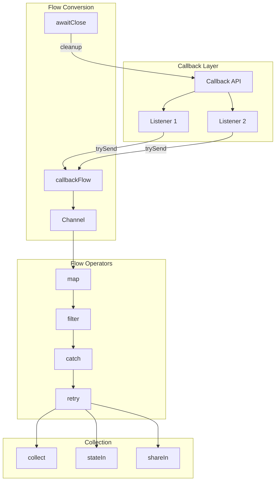

# How to Convert Callbacks to Flows in Kotlin

Author: [nawazdhandala](https://www.github.com/nawazdhandala)

Tags: Kotlin, Flow, Callbacks, Coroutines, Reactive

Description: Learn how to convert callback-based APIs to Kotlin Flows for cleaner, more maintainable reactive code with proper error handling and cancellation support.

---

> Callbacks were the bread and butter of asynchronous programming for years. But they lead to nested code, error handling nightmares, and the infamous "callback hell." Kotlin Flows provide a cleaner, more composable approach to handling asynchronous data streams. This guide shows you how to bridge the gap.

If you're working with Android SDKs, Firebase, legacy Java libraries, or any callback-based API, you'll eventually want to wrap them in Flows. The benefits are significant: structured concurrency, proper cancellation, easy composition, and readable code.

---

## Understanding the Problem

### Callback Hell Example

This is what typical callback-based code looks like. Notice how each callback nests inside the previous one, making the code hard to follow and maintain:

```kotlin
// Typical callback-based code - hard to read, harder to maintain
fun fetchUserData(userId: String) {
    // First callback - get user
    userService.getUser(userId, object : Callback<User> {
        override fun onSuccess(user: User) {
            // Second callback - get user's orders (nested inside first)
            orderService.getOrders(user.id, object : Callback<List<Order>> {
                override fun onSuccess(orders: List<Order>) {
                    // Third callback - get order details (nested again)
                    orders.forEach { order ->
                        detailService.getDetails(order.id, object : Callback<OrderDetails> {
                            override fun onSuccess(details: OrderDetails) {
                                // Finally do something with the data
                                // But what if one of these fails?
                                updateUI(user, orders, details)
                            }
                            override fun onError(error: Throwable) {
                                // Error handling scattered everywhere
                                handleError(error)
                            }
                        })
                    }
                }
                override fun onError(error: Throwable) {
                    handleError(error)
                }
            })
        }
        override fun onError(error: Throwable) {
            handleError(error)
        }
    })
}
```

### The Flow Solution

The same logic with Flows is flat, readable, and has centralized error handling:

```kotlin
// Same logic with Flows - flat, readable, centralized error handling
fun fetchUserData(userId: String): Flow<UserData> = flow {
    val user = userService.getUser(userId)
    val orders = orderService.getOrders(user.id)

    // Process orders concurrently and emit results
    orders.forEach { order ->
        val details = detailService.getDetails(order.id)
        emit(UserData(user, order, details))
    }
}.catch { error ->
    // Single place for error handling
    emit(UserData.Error(error))
}
```

---

## Basic Callback to Flow Conversion

### callbackFlow - The Primary Tool

`callbackFlow` is designed specifically for converting callback-based APIs to Flows. It creates a channel-backed flow that can emit values from callbacks:

```kotlin
import kotlinx.coroutines.channels.awaitClose
import kotlinx.coroutines.flow.Flow
import kotlinx.coroutines.flow.callbackFlow

// Generic callback interface - common pattern in many libraries
interface DataCallback<T> {
    fun onSuccess(data: T)
    fun onError(error: Throwable)
}

// Service with callback-based API
class LegacyService {
    fun fetchData(id: String, callback: DataCallback<String>) {
        // Simulates async operation with callback
    }
}

// Convert to Flow using callbackFlow
fun LegacyService.fetchDataAsFlow(id: String): Flow<String> = callbackFlow {
    // Create callback that sends data to the flow
    val callback = object : DataCallback<String> {
        override fun onSuccess(data: String) {
            // trySend is non-suspending, safe to call from callbacks
            // It returns a ChannelResult indicating success or failure
            trySend(data)
            // Close the flow after single emission (for one-shot operations)
            close()
        }

        override fun onError(error: Throwable) {
            // close with exception propagates error to flow collector
            close(error)
        }
    }

    // Register the callback with the legacy service
    fetchData(id, callback)

    // awaitClose keeps the flow active until cancelled or closed
    // This is where you clean up resources like listeners
    awaitClose {
        // Cleanup: unregister callback, release resources
        // This runs when the flow collector cancels or completes
    }
}

// Usage - clean and straightforward
suspend fun main() {
    val service = LegacyService()

    service.fetchDataAsFlow("123")
        .catch { error -> println("Error: $error") }
        .collect { data -> println("Received: $data") }
}
```

### Handling Multiple Emissions

For APIs that emit multiple values over time (like listeners), the pattern is similar but without closing after each emission:

```kotlin
// Listener-based API that emits multiple values over time
interface DataListener<T> {
    fun onDataReceived(data: T)
    fun onError(error: Throwable)
    fun onComplete()
}

class DataSource {
    private var listener: DataListener<String>? = null

    fun subscribe(listener: DataListener<String>) {
        this.listener = listener
    }

    fun unsubscribe() {
        this.listener = null
    }
}

// Convert to Flow - note we don't close after each emission
fun DataSource.asFlow(): Flow<String> = callbackFlow {
    val listener = object : DataListener<String> {
        override fun onDataReceived(data: String) {
            // Emit each piece of data as it arrives
            // Don't close here - more data may come
            trySend(data)
        }

        override fun onError(error: Throwable) {
            close(error)
        }

        override fun onComplete() {
            // Only close when the source signals completion
            close()
        }
    }

    // Start listening
    subscribe(listener)

    // Critical: clean up when flow is cancelled
    // Without this, the listener would leak
    awaitClose {
        unsubscribe()
    }
}
```

---

## Real-World Examples

### Firebase Realtime Database

Firebase uses listeners for real-time updates. Here's how to wrap them in a Flow:

```kotlin
import com.google.firebase.database.*
import kotlinx.coroutines.channels.awaitClose
import kotlinx.coroutines.flow.Flow
import kotlinx.coroutines.flow.callbackFlow

// Convert Firebase Realtime Database listener to Flow
// This flow emits whenever the data at the reference changes
fun DatabaseReference.asFlow(): Flow<DataSnapshot> = callbackFlow {
    // Create the Firebase listener
    val listener = object : ValueEventListener {
        override fun onDataChange(snapshot: DataSnapshot) {
            // Emit the new snapshot to flow collectors
            trySend(snapshot)
        }

        override fun onCancelled(error: DatabaseError) {
            // Convert Firebase error to exception and close
            close(error.toException())
        }
    }

    // Attach the listener to start receiving updates
    addValueEventListener(listener)

    // Remove listener when flow collection stops
    // This prevents memory leaks and unnecessary network usage
    awaitClose {
        removeEventListener(listener)
    }
}

// Usage example
fun observeUserProfile(userId: String): Flow<UserProfile?> {
    return FirebaseDatabase.getInstance()
        .getReference("users/$userId")
        .asFlow()
        .map { snapshot ->
            // Transform DataSnapshot to domain model
            snapshot.getValue(UserProfile::class.java)
        }
}
```

### Android Location Updates

Converting Android's LocationManager callbacks to a Flow:

```kotlin
import android.annotation.SuppressLint
import android.location.Location
import android.location.LocationListener
import android.location.LocationManager
import android.os.Bundle
import android.os.Looper
import kotlinx.coroutines.channels.awaitClose
import kotlinx.coroutines.flow.Flow
import kotlinx.coroutines.flow.callbackFlow

// Extension function to get location updates as a Flow
// Note: Requires location permissions to be granted
@SuppressLint("MissingPermission")
fun LocationManager.locationUpdates(
    provider: String = LocationManager.GPS_PROVIDER,
    minTimeMs: Long = 1000,
    minDistanceM: Float = 10f
): Flow<Location> = callbackFlow {

    // Create location listener that emits to the flow
    val listener = object : LocationListener {
        override fun onLocationChanged(location: Location) {
            // Emit each location update
            trySend(location)
        }

        // These methods are deprecated but required for older APIs
        override fun onStatusChanged(provider: String?, status: Int, extras: Bundle?) {}
        override fun onProviderEnabled(provider: String) {}
        override fun onProviderDisabled(provider: String) {
            // Optionally close or emit error when provider disabled
            close(IllegalStateException("Location provider disabled"))
        }
    }

    // Start location updates on main looper
    requestLocationUpdates(
        provider,
        minTimeMs,
        minDistanceM,
        listener,
        Looper.getMainLooper()
    )

    // Stop updates when flow collection stops
    // Critical for battery life
    awaitClose {
        removeUpdates(listener)
    }
}

// Usage in ViewModel
class LocationViewModel(
    private val locationManager: LocationManager
) : ViewModel() {

    // Expose location as StateFlow for UI consumption
    val location: StateFlow<Location?> = locationManager
        .locationUpdates(minTimeMs = 5000)
        .catch { emit(null) }  // Handle errors gracefully
        .stateIn(
            scope = viewModelScope,
            started = SharingStarted.WhileSubscribed(5000),
            initialValue = null
        )
}
```

### Retrofit/OkHttp Callbacks

Converting Retrofit callbacks to Flows for network requests:

```kotlin
import kotlinx.coroutines.channels.awaitClose
import kotlinx.coroutines.flow.Flow
import kotlinx.coroutines.flow.callbackFlow
import retrofit2.Call
import retrofit2.Callback
import retrofit2.Response

// Extension function to convert Retrofit Call to Flow
// Useful when you can't use suspend functions directly
fun <T> Call<T>.asFlow(): Flow<T> = callbackFlow {
    // Create Retrofit callback
    val callback = object : Callback<T> {
        override fun onResponse(call: Call<T>, response: Response<T>) {
            if (response.isSuccessful) {
                // Emit successful response body
                response.body()?.let { trySend(it) }
                close()  // One-shot request, close after emission
            } else {
                // Convert HTTP error to exception
                close(HttpException(response.code(), response.message()))
            }
        }

        override fun onFailure(call: Call<T>, t: Throwable) {
            // Network or parsing error
            close(t)
        }
    }

    // Execute the request
    enqueue(callback)

    // Cancel request if flow collection stops
    awaitClose {
        cancel()  // Cancel the HTTP request
    }
}

// Custom exception for HTTP errors
class HttpException(val code: Int, message: String) : Exception("HTTP $code: $message")

// Usage
interface ApiService {
    @GET("users/{id}")
    fun getUser(@Path("id") id: String): Call<User>
}

fun fetchUser(id: String): Flow<User> {
    return apiService.getUser(id).asFlow()
}
```

### WebSocket Connections

WebSockets are a perfect use case for Flows since they emit multiple messages over time:

```kotlin
import kotlinx.coroutines.channels.awaitClose
import kotlinx.coroutines.flow.Flow
import kotlinx.coroutines.flow.callbackFlow
import okhttp3.*

// Sealed class to represent different WebSocket events
sealed class WebSocketEvent {
    data class Message(val text: String) : WebSocketEvent()
    data class BinaryMessage(val bytes: ByteArray) : WebSocketEvent()
    object Connected : WebSocketEvent()
    data class Closed(val code: Int, val reason: String) : WebSocketEvent()
    data class Error(val error: Throwable) : WebSocketEvent()
}

// Convert WebSocket to Flow of events
fun OkHttpClient.webSocketFlow(request: Request): Flow<WebSocketEvent> = callbackFlow {
    var webSocket: WebSocket? = null

    // Create WebSocket listener that emits events to flow
    val listener = object : WebSocketListener() {
        override fun onOpen(ws: WebSocket, response: Response) {
            webSocket = ws
            trySend(WebSocketEvent.Connected)
        }

        override fun onMessage(ws: WebSocket, text: String) {
            trySend(WebSocketEvent.Message(text))
        }

        override fun onMessage(ws: WebSocket, bytes: okio.ByteString) {
            trySend(WebSocketEvent.BinaryMessage(bytes.toByteArray()))
        }

        override fun onClosing(ws: WebSocket, code: Int, reason: String) {
            // Echo the close back to complete the closing handshake
            ws.close(code, reason)
        }

        override fun onClosed(ws: WebSocket, code: Int, reason: String) {
            trySend(WebSocketEvent.Closed(code, reason))
            close()  // End the flow
        }

        override fun onFailure(ws: WebSocket, t: Throwable, response: Response?) {
            trySend(WebSocketEvent.Error(t))
            close(t)
        }
    }

    // Connect WebSocket
    newWebSocket(request, listener)

    // Close WebSocket when flow collection stops
    awaitClose {
        webSocket?.close(1000, "Flow cancelled")
    }
}

// Usage example
fun connectToChat(url: String): Flow<WebSocketEvent> {
    val client = OkHttpClient()
    val request = Request.Builder().url(url).build()

    return client.webSocketFlow(request)
}
```

---

## Advanced Patterns

### Combining Multiple Callback Sources

Sometimes you need to combine data from multiple callback-based sources:

```kotlin
import kotlinx.coroutines.flow.*

// Data class representing combined data
data class DashboardData(
    val user: User,
    val notifications: List<Notification>,
    val settings: Settings
)

// Combine multiple callback-based sources into single Flow
fun getDashboardData(userId: String): Flow<DashboardData> {
    // Convert each callback-based service to Flow
    val userFlow = userService.getUserAsFlow(userId)
    val notificationsFlow = notificationService.getNotificationsAsFlow(userId)
    val settingsFlow = settingsService.getSettingsAsFlow(userId)

    // combine emits whenever any source emits
    // All sources must emit at least once
    return combine(
        userFlow,
        notificationsFlow,
        settingsFlow
    ) { user, notifications, settings ->
        DashboardData(user, notifications, settings)
    }
}

// Alternative: zip waits for all sources to emit in lockstep
fun getDashboardDataOnce(userId: String): Flow<DashboardData> {
    return userService.getUserAsFlow(userId)
        .zip(notificationService.getNotificationsAsFlow(userId)) { user, notifications ->
            user to notifications
        }
        .zip(settingsService.getSettingsAsFlow(userId)) { (user, notifications), settings ->
            DashboardData(user, notifications, settings)
        }
}
```

### Handling Backpressure

When callbacks emit faster than you can process, you need backpressure handling:

```kotlin
import kotlinx.coroutines.flow.*
import kotlinx.coroutines.channels.BufferOverflow

// High-frequency sensor data example
fun sensorDataFlow(): Flow<SensorData> = callbackFlow {
    val listener = object : SensorListener {
        override fun onData(data: SensorData) {
            // trySend may fail if buffer is full
            val result = trySend(data)
            if (result.isFailure) {
                // Log dropped data or handle overflow
                println("Dropped sensor data due to backpressure")
            }
        }
    }

    sensorManager.registerListener(listener)
    awaitClose { sensorManager.unregisterListener(listener) }
}
    // Buffer with DROP_OLDEST strategy - keeps most recent data
    .buffer(
        capacity = 64,
        onBufferOverflow = BufferOverflow.DROP_OLDEST
    )

// Alternative strategies for different use cases
fun sensorDataWithSampling(): Flow<SensorData> = callbackFlow {
    // ... callback setup
    awaitClose { }
}
    // Sample: emit most recent value every 100ms
    // Good for UI updates that don't need every value
    .sample(100)

fun sensorDataDebounced(): Flow<SensorData> = callbackFlow {
    // ... callback setup
    awaitClose { }
}
    // Debounce: emit only after 100ms of no new values
    // Good for search-as-you-type scenarios
    .debounce(100)
```

### Converting suspendCancellableCoroutine for One-Shot Operations

For single-value callbacks, `suspendCancellableCoroutine` is cleaner than `callbackFlow`:

```kotlin
import kotlinx.coroutines.suspendCancellableCoroutine
import kotlin.coroutines.resume
import kotlin.coroutines.resumeWithException

// For one-shot operations, suspendCancellableCoroutine is simpler
suspend fun LegacyService.fetchDataSuspend(id: String): String {
    return suspendCancellableCoroutine { continuation ->
        val callback = object : DataCallback<String> {
            override fun onSuccess(data: String) {
                // Resume the coroutine with the result
                continuation.resume(data)
            }

            override fun onError(error: Throwable) {
                // Resume with exception
                continuation.resumeWithException(error)
            }
        }

        // Register callback
        fetchData(id, callback)

        // Handle cancellation
        continuation.invokeOnCancellation {
            // Clean up if coroutine is cancelled
            cancelRequest(id)
        }
    }
}

// Convert suspend function to Flow if needed
fun LegacyService.fetchDataAsFlowFromSuspend(id: String): Flow<String> = flow {
    emit(fetchDataSuspend(id))
}
```

---

## Error Handling Strategies

### Retry with Exponential Backoff

```kotlin
import kotlinx.coroutines.delay
import kotlinx.coroutines.flow.*
import kotlin.math.pow

// Retry flow with exponential backoff
fun <T> Flow<T>.retryWithBackoff(
    maxRetries: Int = 3,
    initialDelayMs: Long = 1000,
    maxDelayMs: Long = 30000,
    factor: Double = 2.0,
    retryOn: (Throwable) -> Boolean = { true }
): Flow<T> = retryWhen { cause, attempt ->
    // Check if we should retry this error
    if (attempt < maxRetries && retryOn(cause)) {
        // Calculate delay with exponential backoff
        val delayMs = (initialDelayMs * factor.pow(attempt.toDouble()))
            .toLong()
            .coerceAtMost(maxDelayMs)

        println("Retry attempt ${attempt + 1} after ${delayMs}ms")
        delay(delayMs)
        true  // Retry
    } else {
        false  // Don't retry, propagate error
    }
}

// Usage
fun fetchWithRetry(id: String): Flow<Data> {
    return callbackService.fetchAsFlow(id)
        .retryWithBackoff(
            maxRetries = 3,
            initialDelayMs = 1000,
            retryOn = { it is NetworkException }  // Only retry network errors
        )
        .catch { error ->
            // Final error handling after all retries exhausted
            emit(Data.Error(error.message ?: "Unknown error"))
        }
}
```

### Fallback Values

```kotlin
// Provide fallback when flow fails
fun getUserWithFallback(userId: String): Flow<User> {
    return userService.getUserAsFlow(userId)
        .catch { error ->
            // Log the error
            logger.error("Failed to fetch user", error)
            // Emit cached or default user
            emit(userCache.get(userId) ?: User.default())
        }
}

// Chain of fallbacks
fun getDataWithFallbacks(id: String): Flow<Data> {
    return primaryService.getDataAsFlow(id)
        .catch { primaryError ->
            // Try secondary service
            emitAll(
                secondaryService.getDataAsFlow(id)
                    .catch { secondaryError ->
                        // Try cache as last resort
                        emit(cache.get(id) ?: throw secondaryError)
                    }
            )
        }
}
```

---

## Flow Architecture Diagram

The following diagram shows how callback-based data flows through the conversion layer to become a Kotlin Flow:



---

## Testing Flows from Callbacks

### Using Turbine for Flow Testing

```kotlin
import app.cash.turbine.test
import kotlinx.coroutines.test.runTest
import kotlin.test.Test
import kotlin.test.assertEquals

class CallbackFlowTest {

    @Test
    fun `flow emits callback data correctly`() = runTest {
        // Create mock callback service
        val mockService = MockCallbackService()

        // Convert to flow and test
        mockService.dataAsFlow().test {
            // Trigger callback
            mockService.simulateCallback("data1")
            assertEquals("data1", awaitItem())

            // Trigger another callback
            mockService.simulateCallback("data2")
            assertEquals("data2", awaitItem())

            // Simulate completion
            mockService.simulateComplete()
            awaitComplete()
        }
    }

    @Test
    fun `flow handles errors correctly`() = runTest {
        val mockService = MockCallbackService()

        mockService.dataAsFlow().test {
            // Simulate error
            mockService.simulateError(RuntimeException("Test error"))

            // Verify error is propagated
            val error = awaitError()
            assertEquals("Test error", error.message)
        }
    }
}

// Mock service for testing
class MockCallbackService {
    private var callback: DataCallback<String>? = null

    fun dataAsFlow(): Flow<String> = callbackFlow {
        callback = object : DataCallback<String> {
            override fun onSuccess(data: String) = trySend(data).let {}
            override fun onError(error: Throwable) = close(error).let {}
        }
        awaitClose { callback = null }
    }

    fun simulateCallback(data: String) = callback?.onSuccess(data)
    fun simulateError(error: Throwable) = callback?.onError(error)
    fun simulateComplete() { /* trigger close */ }
}
```

---

## Best Practices Summary

| Practice | Do | Don't |
|----------|-----|-------|
| Cleanup | Always use `awaitClose` | Forget to unregister listeners |
| Emissions | Use `trySend` from callbacks | Use `send` (suspending) in callbacks |
| One-shot | Use `suspendCancellableCoroutine` | Use `callbackFlow` for single values |
| Errors | Close flow with exception | Swallow errors silently |
| Threading | Respect callback thread | Assume main thread |
| Cancellation | Handle in `awaitClose` | Ignore cancellation |

---

## Conclusion

Converting callbacks to Flows brings several benefits:

- **Readability**: Flat, sequential code instead of nested callbacks
- **Composability**: Chain operators like `map`, `filter`, `combine`
- **Error handling**: Centralized with `catch` and `retry`
- **Cancellation**: Automatic cleanup through structured concurrency
- **Testing**: Easy to test with libraries like Turbine

The key is using `callbackFlow` with proper `awaitClose` cleanup. For one-shot operations, prefer `suspendCancellableCoroutine`. With these patterns, you can wrap any callback-based API and enjoy the benefits of reactive streams.

---

*Building Kotlin applications that need monitoring? [OneUptime](https://oneuptime.com) provides comprehensive observability for your applications, including distributed tracing, metrics, and alerting to help you track performance across your entire stack.*
