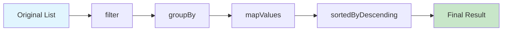

# How to Handle Collections in Kotlin

Author: [nawazdhandala](https://github.com/nawazdhandala)

Tags: Kotlin, Collections, Lists, Maps, Functional Programming

Description: A comprehensive guide to working with Kotlin collections, covering lists, sets, maps, and functional operations like filter, map, and reduce.

---

Collections are the backbone of most applications. Whether you're processing user data, handling API responses, or building business logic, you'll work with lists, sets, and maps constantly. Kotlin's collection framework builds on Java's but adds a bunch of useful functions that make your code cleaner and more expressive.

This guide covers everything from creating basic collections to chaining complex transformations.

## Mutable vs Immutable Collections

The first thing to understand is that Kotlin distinguishes between read-only and mutable collections. This isn't about whether the underlying data can change - it's about whether your reference can modify it.

```kotlin
// Read-only list - you can't add or remove elements through this reference
val readOnlyList: List<String> = listOf("apple", "banana", "cherry")

// Mutable list - full access to add, remove, and modify elements
val mutableList: MutableList<String> = mutableListOf("apple", "banana", "cherry")
mutableList.add("date")
mutableList.removeAt(0)
```

The same pattern applies to sets and maps:

| Type | Read-only | Mutable |
|------|-----------|---------|
| List | `listOf()` | `mutableListOf()` |
| Set | `setOf()` | `mutableSetOf()` |
| Map | `mapOf()` | `mutableMapOf()` |

Use read-only collections by default. Only switch to mutable when you actually need to modify the collection in place.

## Creating Collections

Kotlin provides several ways to create collections. Here are the most common patterns:

```kotlin
// Creating lists
val fruits = listOf("apple", "banana", "cherry")
val emptyList = emptyList<String>()
val nullableList = listOfNotNull("apple", null, "cherry") // Results in ["apple", "cherry"]

// Creating sets - duplicates are automatically removed
val uniqueNumbers = setOf(1, 2, 3, 2, 1) // Results in {1, 2, 3}

// Creating maps with key-value pairs using the 'to' infix function
val userAges = mapOf(
    "Alice" to 25,
    "Bob" to 30,
    "Charlie" to 35
)

// Building collections with buildList (useful for conditional additions)
val dynamicList = buildList {
    add("always included")
    if (someCondition) {
        add("conditionally included")
    }
    addAll(listOf("more", "items"))
}
```

## Transforming Collections with map

The `map` function transforms each element in a collection. It's one of the most frequently used operations.

```kotlin
data class User(val name: String, val email: String, val age: Int)

val users = listOf(
    User("Alice", "alice@example.com", 25),
    User("Bob", "bob@example.com", 30),
    User("Charlie", "charlie@example.com", 35)
)

// Extract just the names from each user
val names: List<String> = users.map { it.name }
// Result: ["Alice", "Bob", "Charlie"]

// Transform to a different data structure
data class UserSummary(val name: String, val email: String)

val summaries: List<UserSummary> = users.map { user ->
    UserSummary(user.name, user.email)
}

// mapIndexed gives you access to the index as well
val indexedNames = users.mapIndexed { index, user ->
    "${index + 1}. ${user.name}"
}
// Result: ["1. Alice", "2. Bob", "3. Charlie"]
```

## Filtering Collections

Filtering lets you select elements that match certain criteria.

```kotlin
val numbers = listOf(1, 2, 3, 4, 5, 6, 7, 8, 9, 10)

// Keep only even numbers
val evenNumbers = numbers.filter { it % 2 == 0 }
// Result: [2, 4, 6, 8, 10]

// Remove elements that match the predicate
val oddNumbers = numbers.filterNot { it % 2 == 0 }
// Result: [1, 3, 5, 7, 9]

// Filter with index access
val everyThird = numbers.filterIndexed { index, _ -> index % 3 == 0 }
// Result: [1, 4, 7, 10]

// Filter out null values from a nullable list
val mixedList: List<String?> = listOf("apple", null, "banana", null, "cherry")
val nonNullValues: List<String> = mixedList.filterNotNull()
// Result: ["apple", "banana", "cherry"]
```

Here's a practical example combining filter with real-world data:

```kotlin
data class Order(
    val id: String,
    val customerId: String,
    val total: Double,
    val status: String
)

val orders = listOf(
    Order("O1", "C1", 150.00, "COMPLETED"),
    Order("O2", "C2", 75.50, "PENDING"),
    Order("O3", "C1", 200.00, "COMPLETED"),
    Order("O4", "C3", 50.00, "CANCELLED"),
    Order("O5", "C2", 300.00, "COMPLETED")
)

// Find all completed orders over $100
val highValueCompleted = orders.filter { order ->
    order.status == "COMPLETED" && order.total > 100
}
// Result: [Order(O1), Order(O3), Order(O5)]
```

## Aggregating with reduce and fold

When you need to combine all elements into a single value, `reduce` and `fold` are your tools.

```kotlin
val numbers = listOf(1, 2, 3, 4, 5)

// reduce starts with the first element as the accumulator
val sum = numbers.reduce { acc, num -> acc + num }
// Result: 15

// fold lets you specify an initial value
val sumWithInitial = numbers.fold(100) { acc, num -> acc + num }
// Result: 115

// Practical example: calculate total order value
val orders = listOf(
    Order("O1", "C1", 150.00, "COMPLETED"),
    Order("O2", "C2", 75.50, "COMPLETED"),
    Order("O3", "C1", 200.00, "COMPLETED")
)

val totalRevenue = orders.fold(0.0) { total, order ->
    total + order.total
}
// Result: 425.50

// Building a string from elements
val concatenated = listOf("Hello", "World", "Kotlin").reduce { acc, s ->
    "$acc $s"
}
// Result: "Hello World Kotlin"
```

## Grouping and Associating

These operations help you organize data into maps for quick lookups.

```kotlin
data class Product(val id: String, val category: String, val name: String, val price: Double)

val products = listOf(
    Product("P1", "Electronics", "Laptop", 999.99),
    Product("P2", "Electronics", "Phone", 599.99),
    Product("P3", "Clothing", "T-Shirt", 29.99),
    Product("P4", "Clothing", "Jeans", 79.99),
    Product("P5", "Electronics", "Tablet", 399.99)
)

// Group products by category
val byCategory: Map<String, List<Product>> = products.groupBy { it.category }
// Result: {
//   "Electronics": [Laptop, Phone, Tablet],
//   "Clothing": [T-Shirt, Jeans]
// }

// Create a lookup map by product ID
val productById: Map<String, Product> = products.associateBy { it.id }
// Result: {"P1": Laptop, "P2": Phone, ...}

// Create a map of ID to name
val idToName: Map<String, String> = products.associate { it.id to it.name }
// Result: {"P1": "Laptop", "P2": "Phone", ...}

// Group and transform in one step
val categoryPrices: Map<String, List<Double>> = products.groupBy(
    keySelector = { it.category },
    valueTransform = { it.price }
)
// Result: {"Electronics": [999.99, 599.99, 399.99], "Clothing": [29.99, 79.99]}
```

## Chaining Operations

The real power of Kotlin collections comes from chaining multiple operations together.

```kotlin
data class Transaction(
    val id: String,
    val userId: String,
    val amount: Double,
    val type: String,
    val timestamp: Long
)

val transactions = listOf(
    Transaction("T1", "U1", 100.0, "CREDIT", 1706800000000),
    Transaction("T2", "U2", 50.0, "DEBIT", 1706800001000),
    Transaction("T3", "U1", 200.0, "CREDIT", 1706800002000),
    Transaction("T4", "U3", 75.0, "CREDIT", 1706800003000),
    Transaction("T5", "U1", 25.0, "DEBIT", 1706800004000)
)

// Find total credits per user, sorted by amount descending
val creditsByUser = transactions
    .filter { it.type == "CREDIT" }
    .groupBy { it.userId }
    .mapValues { (_, txns) -> txns.sumOf { it.amount } }
    .toList()
    .sortedByDescending { it.second }
    .toMap()
// Result: {"U1": 300.0, "U3": 75.0, "U2": 0.0}
```

Here's a visual representation of how chaining works:



## Working with Maps

Maps have their own set of useful operations.

```kotlin
val userScores = mutableMapOf(
    "Alice" to 85,
    "Bob" to 92,
    "Charlie" to 78
)

// Get value with default if key doesn't exist
val score = userScores.getOrDefault("Dave", 0)
// Result: 0

// Get or put a default value
val newScore = userScores.getOrPut("Dave") { 50 }
// Result: 50 (and "Dave" is now in the map)

// Transform map values
val letterGrades = userScores.mapValues { (_, score) ->
    when {
        score >= 90 -> "A"
        score >= 80 -> "B"
        score >= 70 -> "C"
        else -> "D"
    }
}
// Result: {"Alice": "B", "Bob": "A", "Charlie": "C", "Dave": "D"}

// Filter map entries
val passingStudents = userScores.filter { (_, score) -> score >= 80 }
// Result: {"Alice": 85, "Bob": 92}

// Iterate over map entries
userScores.forEach { (name, score) ->
    println("$name scored $score")
}
```

## Sequences for Large Collections

When working with large collections or expensive operations, sequences can improve performance by processing elements lazily.

```kotlin
// Regular collection - each operation creates an intermediate list
val result1 = (1..1_000_000)
    .map { it * 2 }        // Creates a list of 1M elements
    .filter { it % 3 == 0 } // Creates another list
    .take(10)               // Finally takes 10

// Sequence - processes elements one at a time, stops early
val result2 = (1..1_000_000).asSequence()
    .map { it * 2 }
    .filter { it % 3 == 0 }
    .take(10)
    .toList() // Terminal operation triggers the computation
```

Use sequences when:
- Your collection has many elements (thousands or more)
- You're chaining multiple operations
- You only need a subset of results (using `take`, `first`, etc.)

Stick with regular collections when:
- Your data is small
- You need indexed access
- The operations are simple

## Common Pitfalls and Tips

**Avoid modifying a collection while iterating:**

```kotlin
// This will throw ConcurrentModificationException
val list = mutableListOf(1, 2, 3, 4, 5)
for (item in list) {
    if (item % 2 == 0) {
        list.remove(item) // Don't do this
    }
}

// Instead, use filter or removeIf
val filtered = list.filter { it % 2 != 0 }
// Or for in-place modification:
list.removeIf { it % 2 == 0 }
```

**Use the right collection for the job:**

```kotlin
// Need unique elements? Use a Set
val uniqueVisitors = mutableSetOf<String>()
uniqueVisitors.add("user1")
uniqueVisitors.add("user1") // No duplicate added

// Need fast lookups? Use a Map
val userCache = mutableMapOf<String, User>()
userCache["user123"] = User("Alice", "alice@example.com", 25)

// Need ordering? Use sorted collections or sortedSetOf
val sortedScores = sortedSetOf(85, 92, 78, 95, 88)
// Automatically sorted: [78, 85, 88, 92, 95]
```

**Prefer immutable operations:**

```kotlin
// Instead of modifying in place
val mutableList = mutableListOf(1, 2, 3)
mutableList.add(4)

// Consider creating new collections
val originalList = listOf(1, 2, 3)
val newList = originalList + 4 // Creates a new list [1, 2, 3, 4]
```

## Quick Reference

Here's a summary of the most commonly used collection operations:

| Operation | Description | Example |
|-----------|-------------|---------|
| `map` | Transform each element | `list.map { it * 2 }` |
| `filter` | Keep matching elements | `list.filter { it > 0 }` |
| `reduce` | Combine all elements | `list.reduce { a, b -> a + b }` |
| `fold` | Combine with initial value | `list.fold(0) { a, b -> a + b }` |
| `groupBy` | Group by key | `list.groupBy { it.category }` |
| `associateBy` | Create lookup map | `list.associateBy { it.id }` |
| `sortedBy` | Sort by selector | `list.sortedBy { it.name }` |
| `take` | Get first n elements | `list.take(5)` |
| `drop` | Skip first n elements | `list.drop(5)` |
| `first` | Get first matching | `list.first { it > 0 }` |
| `any` | Check if any match | `list.any { it > 0 }` |
| `all` | Check if all match | `list.all { it > 0 }` |
| `none` | Check if none match | `list.none { it < 0 }` |
| `distinct` | Remove duplicates | `list.distinct()` |
| `flatten` | Flatten nested lists | `listOfLists.flatten()` |
| `flatMap` | Map and flatten | `list.flatMap { it.items }` |

## Wrapping Up

Kotlin's collection framework gives you a lot of power with a clean API. The key points to remember:

1. Prefer read-only collections unless you need mutation
2. Chain operations together for readable data transformations
3. Use sequences for large datasets or when you need early termination
4. Group and associate operations are great for building lookup structures
5. Pick the right collection type for your access patterns

Once you get comfortable with these operations, you'll find yourself writing less code that does more. The functional style might feel unfamiliar at first if you're coming from imperative programming, but it pays off in maintainability and expressiveness.

---

*Need to monitor your Kotlin applications in production? [OneUptime](https://oneuptime.com) provides comprehensive observability with metrics, logs, and traces to help you understand how your code performs in the real world.*
