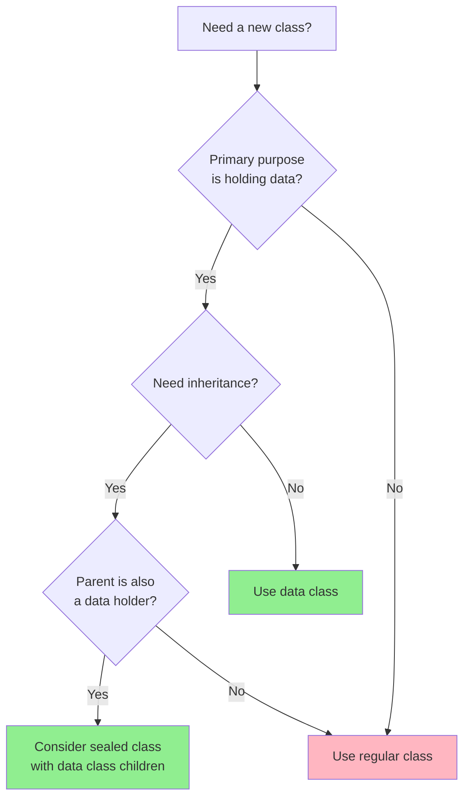

# How to Use Data Classes in Kotlin

Author: [nawazdhandala](https://www.github.com/nawazdhandala)

Tags: Kotlin, Data Classes, OOP, Immutability, Best Practices

Description: A practical guide to using Kotlin data classes for cleaner, more maintainable code with automatic equals, hashCode, copy, and destructuring capabilities.

---

If you've spent any time writing Java, you know the pain of creating simple classes to hold data. You need constructors, getters, setters, `equals()`, `hashCode()`, and `toString()` - all for what should be a simple container. Kotlin's data classes solve this problem elegantly.

## What is a Data Class?

A data class is a class primarily used to hold data. The Kotlin compiler automatically generates common methods like `equals()`, `hashCode()`, `toString()`, `copy()`, and component functions for destructuring.

Here's a basic data class definition. The `data` keyword tells Kotlin to generate utility methods based on properties declared in the primary constructor.

```kotlin
// A simple data class representing a user
// Properties in the primary constructor are used for generated methods
data class User(
    val id: Long,
    val name: String,
    val email: String
)

fun main() {
    val user = User(1, "John Doe", "john@example.com")

    // toString() is automatically generated
    println(user)  // Output: User(id=1, name=John Doe, email=john@example.com)
}
```

Compare this to the equivalent Java code, which would require 50+ lines with boilerplate methods.

## Requirements for Data Classes

Kotlin enforces a few rules for data classes:

| Requirement | Description |
|-------------|-------------|
| Primary constructor | Must have at least one parameter |
| Constructor parameters | Must be marked as `val` or `var` |
| Cannot be abstract | Data classes must be concrete |
| Cannot be open, sealed, or inner | Cannot be extended by other classes |

## Auto-Generated Methods

### equals() and hashCode()

Data classes generate `equals()` and `hashCode()` based on properties in the primary constructor. This is critical for comparing objects by value rather than reference.

```kotlin
data class Product(
    val sku: String,
    val name: String,
    val price: Double
)

fun main() {
    val product1 = Product("ABC123", "Laptop", 999.99)
    val product2 = Product("ABC123", "Laptop", 999.99)
    val product3 = Product("XYZ789", "Mouse", 29.99)

    // equals() compares all properties in the primary constructor
    println(product1 == product2)  // true - same values
    println(product1 == product3)  // false - different values

    // hashCode() is consistent with equals()
    println(product1.hashCode() == product2.hashCode())  // true

    // Works correctly in collections
    val productSet = setOf(product1, product2, product3)
    println(productSet.size)  // 2 - duplicates are detected
}
```

### toString()

The generated `toString()` includes the class name and all properties, which makes debugging much easier.

```kotlin
data class Order(
    val orderId: String,
    val customerId: Long,
    val items: List<String>,
    val total: Double
)

fun main() {
    val order = Order(
        orderId = "ORD-2024-001",
        customerId = 42,
        items = listOf("Laptop", "Mouse"),
        total = 1029.98
    )

    // Clean, readable output without manual implementation
    println(order)
    // Output: Order(orderId=ORD-2024-001, customerId=42, items=[Laptop, Mouse], total=1029.98)
}
```

### copy() for Immutable Updates

The `copy()` function creates a new instance with specified properties changed. This is perfect for working with immutable data.

```kotlin
data class Config(
    val host: String,
    val port: Int,
    val timeout: Int,
    val retries: Int
)

fun main() {
    val defaultConfig = Config(
        host = "localhost",
        port = 8080,
        timeout = 30,
        retries = 3
    )

    // Create a production config by copying and modifying specific fields
    val prodConfig = defaultConfig.copy(
        host = "api.production.com",
        port = 443
    )

    println(defaultConfig)  // Config(host=localhost, port=8080, timeout=30, retries=3)
    println(prodConfig)     // Config(host=api.production.com, port=443, timeout=30, retries=3)

    // Original is unchanged - immutability preserved
    println(defaultConfig.host)  // localhost
}
```

### Destructuring Declarations

Data classes automatically generate component functions that enable destructuring. The components are ordered by position in the primary constructor.

```kotlin
data class Coordinate(
    val x: Double,
    val y: Double,
    val z: Double
)

fun main() {
    val point = Coordinate(10.5, 20.3, 5.0)

    // Destructure into individual variables
    val (x, y, z) = point
    println("x=$x, y=$y, z=$z")  // x=10.5, y=20.3, z=5.0

    // Useful in loops
    val points = listOf(
        Coordinate(0.0, 0.0, 0.0),
        Coordinate(1.0, 2.0, 3.0),
        Coordinate(4.0, 5.0, 6.0)
    )

    for ((px, py, pz) in points) {
        println("Point at ($px, $py, $pz)")
    }

    // Works with map entries too
    val pointMap = mapOf("origin" to Coordinate(0.0, 0.0, 0.0))
    for ((name, coord) in pointMap) {
        val (cx, cy, cz) = coord
        println("$name: ($cx, $cy, $cz)")
    }
}
```

## Properties Outside the Primary Constructor

Properties declared in the class body are not included in the generated methods. Use this for derived or computed values.

```kotlin
data class Rectangle(
    val width: Double,
    val height: Double
) {
    // Not included in equals(), hashCode(), toString(), or copy()
    val area: Double = width * height
    val perimeter: Double = 2 * (width + height)
}

fun main() {
    val rect1 = Rectangle(10.0, 5.0)
    val rect2 = Rectangle(10.0, 5.0)

    // equals() only compares width and height
    println(rect1 == rect2)  // true

    // toString() only shows primary constructor properties
    println(rect1)  // Rectangle(width=10.0, height=5.0)

    // But computed properties are still accessible
    println("Area: ${rect1.area}")  // Area: 50.0
}
```

## Default Values and Named Arguments

Combine data classes with default parameters for flexible object creation.

```kotlin
data class HttpRequest(
    val url: String,
    val method: String = "GET",
    val headers: Map<String, String> = emptyMap(),
    val body: String? = null,
    val timeout: Int = 30000
)

fun main() {
    // Minimal creation - use defaults
    val simpleGet = HttpRequest(url = "https://api.example.com/users")

    // Override specific defaults
    val postRequest = HttpRequest(
        url = "https://api.example.com/users",
        method = "POST",
        body = """{"name": "John"}""",
        headers = mapOf("Content-Type" to "application/json")
    )

    // Named arguments make intent clear
    val customTimeout = HttpRequest(
        url = "https://slow-api.example.com/data",
        timeout = 60000
    )

    println(simpleGet)
    println(postRequest)
}
```

## Data Classes with Validation

Add validation in an `init` block to ensure data integrity.

```kotlin
data class Email(val address: String) {
    init {
        // Validate email format on construction
        require(address.contains("@")) {
            "Invalid email address: $address"
        }
        require(address.length <= 254) {
            "Email address too long: ${address.length} chars"
        }
    }
}

data class Age(val value: Int) {
    init {
        require(value in 0..150) {
            "Age must be between 0 and 150, got: $value"
        }
    }
}

fun main() {
    val validEmail = Email("user@example.com")
    println(validEmail)  // Email(address=user@example.com)

    // This throws IllegalArgumentException
    try {
        val invalidEmail = Email("not-an-email")
    } catch (e: IllegalArgumentException) {
        println("Validation failed: ${e.message}")
    }
}
```

## Nested Data Classes

Data classes can contain other data classes for modeling complex structures.

```kotlin
data class Address(
    val street: String,
    val city: String,
    val zipCode: String,
    val country: String
)

data class Company(
    val name: String,
    val address: Address,
    val employeeCount: Int
)

data class Employee(
    val id: Long,
    val name: String,
    val email: String,
    val company: Company
)

fun main() {
    val address = Address(
        street = "123 Tech Street",
        city = "San Francisco",
        zipCode = "94105",
        country = "USA"
    )

    val company = Company(
        name = "TechCorp",
        address = address,
        employeeCount = 500
    )

    val employee = Employee(
        id = 1,
        name = "Jane Smith",
        email = "jane@techcorp.com",
        company = company
    )

    println(employee)

    // Deep copy with nested changes
    val relocatedEmployee = employee.copy(
        company = employee.company.copy(
            address = employee.company.address.copy(
                city = "New York"
            )
        )
    )

    println("New city: ${relocatedEmployee.company.address.city}")
}
```

## Data Classes with Interfaces

Data classes can implement interfaces for polymorphic behavior.

```kotlin
// Define a common interface for entities
interface Entity {
    val id: Long
    fun validate(): Boolean
}

data class Customer(
    override val id: Long,
    val name: String,
    val email: String
) : Entity {
    override fun validate(): Boolean {
        return name.isNotBlank() && email.contains("@")
    }
}

data class Invoice(
    override val id: Long,
    val customerId: Long,
    val amount: Double,
    val paid: Boolean = false
) : Entity {
    override fun validate(): Boolean {
        return amount > 0 && customerId > 0
    }
}

fun processEntity(entity: Entity) {
    if (entity.validate()) {
        println("Processing entity ${entity.id}")
    } else {
        println("Invalid entity ${entity.id}")
    }
}

fun main() {
    val customer = Customer(1, "Acme Corp", "contact@acme.com")
    val invoice = Invoice(100, customerId = 1, amount = 1500.00)

    processEntity(customer)
    processEntity(invoice)
}
```

## Data Class vs Regular Class

Here's when to choose each:



## Common Patterns

### Builder Pattern Alternative

With default parameters and `copy()`, you rarely need builders in Kotlin.

```kotlin
data class ServerConfig(
    val host: String = "0.0.0.0",
    val port: Int = 8080,
    val maxConnections: Int = 100,
    val readTimeout: Int = 30,
    val writeTimeout: Int = 30,
    val ssl: Boolean = false,
    val certPath: String? = null
)

fun main() {
    // Builder-like fluent creation using copy()
    val config = ServerConfig()
        .copy(host = "192.168.1.1")
        .copy(port = 443)
        .copy(ssl = true)
        .copy(certPath = "/etc/ssl/cert.pem")

    // Or just use named arguments directly
    val betterConfig = ServerConfig(
        host = "192.168.1.1",
        port = 443,
        ssl = true,
        certPath = "/etc/ssl/cert.pem"
    )

    println(config)
}
```

### Data Transfer Objects (DTOs)

Data classes are perfect for DTOs when working with APIs.

```kotlin
import kotlinx.serialization.Serializable

@Serializable
data class UserDTO(
    val id: Long,
    val username: String,
    val email: String,
    val createdAt: String
)

@Serializable
data class ApiResponse<T>(
    val success: Boolean,
    val data: T?,
    val error: String? = null
)

// Usage with API responses
fun parseUserResponse(json: String): ApiResponse<UserDTO> {
    // Parse JSON into data class
    // With kotlinx.serialization or other libraries
    return ApiResponse(
        success = true,
        data = UserDTO(1, "john", "john@example.com", "2024-01-15")
    )
}
```

### State Management

Data classes work great for representing application state.

```kotlin
// Sealed class with data class variants for state
sealed class LoadingState<out T> {
    object Loading : LoadingState<Nothing>()
    data class Success<T>(val data: T) : LoadingState<T>()
    data class Error(val message: String, val cause: Throwable? = null) : LoadingState<Nothing>()
}

fun <T> handleState(state: LoadingState<T>) {
    when (state) {
        is LoadingState.Loading -> println("Loading...")
        is LoadingState.Success -> println("Got data: ${state.data}")
        is LoadingState.Error -> println("Error: ${state.message}")
    }
}

fun main() {
    val loading: LoadingState<String> = LoadingState.Loading
    val success: LoadingState<String> = LoadingState.Success("Hello, World!")
    val error: LoadingState<String> = LoadingState.Error("Network timeout")

    handleState(loading)
    handleState(success)
    handleState(error)
}
```

## Performance Considerations

Data classes are efficient, but keep these points in mind:

1. **Object creation**: Each `copy()` creates a new instance. For hot paths, consider mutable alternatives.

2. **hashCode() caching**: If using data classes as map keys frequently, the hashCode is recalculated each time. Consider caching for complex objects.

3. **Large property counts**: With many properties, generated methods do more work. This is rarely a bottleneck, but profile if concerned.

```kotlin
// If hashCode performance matters, cache it
data class CachedHashProduct(
    val sku: String,
    val name: String,
    val attributes: Map<String, String>
) {
    // Cache hashCode for objects used frequently as map keys
    private val cachedHashCode: Int by lazy {
        var result = sku.hashCode()
        result = 31 * result + name.hashCode()
        result = 31 * result + attributes.hashCode()
        result
    }

    override fun hashCode(): Int = cachedHashCode
}
```

## Summary

Kotlin data classes eliminate boilerplate while providing:

- Automatic `equals()`, `hashCode()`, `toString()`
- Immutable updates via `copy()`
- Destructuring support
- Clean syntax with default parameters

Use data classes whenever your primary goal is holding and transferring data. For classes with complex behavior, inheritance needs, or identity-based equality, stick with regular classes.

---

*Building applications with Kotlin? [OneUptime](https://oneuptime.com) provides comprehensive monitoring for your Kotlin services, including distributed tracing, metrics, and alerting. Track the health and performance of your JVM applications with ease.*
