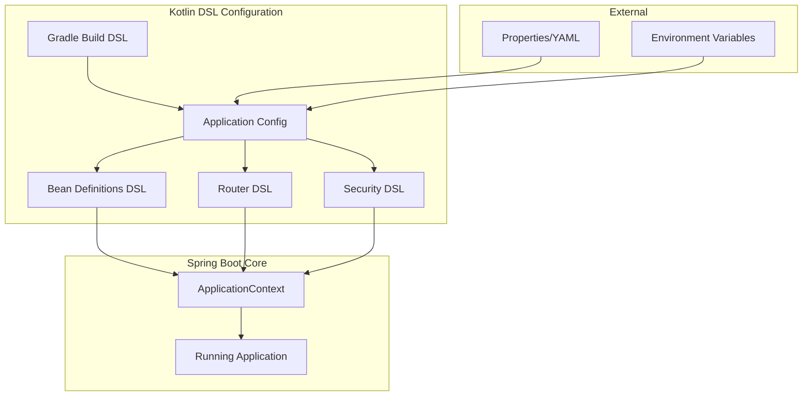
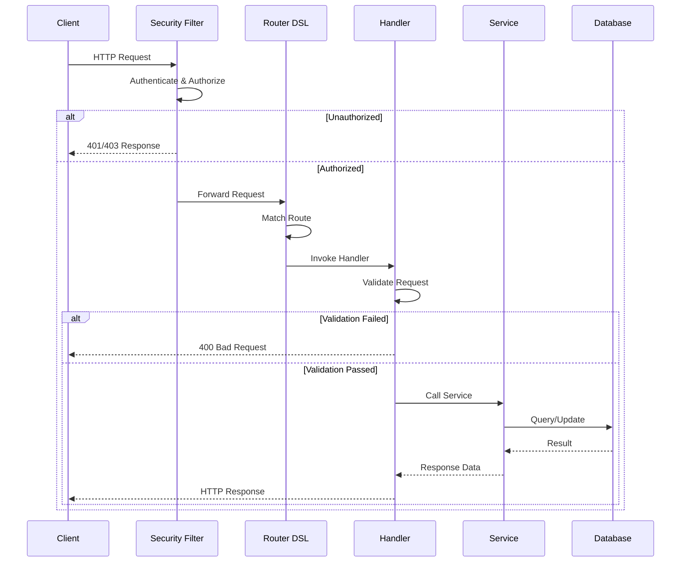

# How to Configure Kotlin DSL in Spring Boot

Author: [nawazdhandala](https://www.github.com/nawazdhandala)

Tags: Kotlin, Spring Boot, DSL, Configuration, Gradle, Beans, Router, Security

Description: Learn how to leverage Kotlin DSL for elegant Spring Boot configuration. This guide covers Gradle build scripts, bean definitions, routing, security configuration, and testing with practical examples and best practices.

---

> Kotlin DSL brings type-safe, expressive configuration to Spring Boot applications. Instead of verbose XML or annotation-heavy configurations, you can write clean, readable code that is easier to maintain and refactor. This guide shows you how to implement Kotlin DSL patterns across your entire Spring Boot application.

Kotlin's language features like extension functions, lambda expressions, and type-safe builders make it ideal for creating domain-specific languages. Spring Boot has embraced these capabilities, offering DSL alternatives for many configuration aspects.

---

## Why Use Kotlin DSL in Spring Boot?

| Aspect | Traditional Approach | Kotlin DSL |
|--------|---------------------|------------|
| **Type Safety** | Runtime errors | Compile-time checks |
| **Refactoring** | Error-prone | IDE-supported |
| **Readability** | Verbose annotations | Clean, declarative |
| **Testability** | Complex setup | Easy mocking |
| **IDE Support** | Limited | Full autocomplete |

---

## Architecture Overview

The following diagram shows how Kotlin DSL integrates with Spring Boot components:



---

## Gradle Kotlin DSL Setup

The first step is configuring your build with Gradle Kotlin DSL. This replaces the traditional Groovy-based build.gradle with a type-safe build.gradle.kts file.

### Basic Project Configuration

The following build script sets up a Spring Boot project with essential dependencies and Kotlin configuration:

```kotlin
// build.gradle.kts
import org.jetbrains.kotlin.gradle.tasks.KotlinCompile

// Define plugin versions for consistency across the project
plugins {
    id("org.springframework.boot") version "3.2.0"
    id("io.spring.dependency-management") version "1.1.4"
    kotlin("jvm") version "1.9.21"
    kotlin("plugin.spring") version "1.9.21"
    kotlin("plugin.jpa") version "1.9.21"
}

// Project metadata
group = "com.example"
version = "0.0.1-SNAPSHOT"

// Configure Java compatibility
java {
    sourceCompatibility = JavaVersion.VERSION_17
}

// Define repository sources for dependencies
repositories {
    mavenCentral()
}

// Declare project dependencies with type-safe accessors
dependencies {
    // Spring Boot starters
    implementation("org.springframework.boot:spring-boot-starter-web")
    implementation("org.springframework.boot:spring-boot-starter-webflux")
    implementation("org.springframework.boot:spring-boot-starter-data-jpa")
    implementation("org.springframework.boot:spring-boot-starter-security")
    implementation("org.springframework.boot:spring-boot-starter-validation")

    // Kotlin support libraries
    implementation("com.fasterxml.jackson.module:jackson-module-kotlin")
    implementation("io.projectreactor.kotlin:reactor-kotlin-extensions")
    implementation("org.jetbrains.kotlin:kotlin-reflect")
    implementation("org.jetbrains.kotlinx:kotlinx-coroutines-reactor")

    // Database
    runtimeOnly("org.postgresql:postgresql")

    // Testing dependencies
    testImplementation("org.springframework.boot:spring-boot-starter-test")
    testImplementation("io.projectreactor:reactor-test")
    testImplementation("org.springframework.security:spring-security-test")
}

// Configure Kotlin compiler options for all compile tasks
tasks.withType<KotlinCompile> {
    kotlinOptions {
        // Enable strict null safety
        freeCompilerArgs += "-Xjsr305=strict"
        jvmTarget = "17"
    }
}

// Configure test task to use JUnit Platform
tasks.withType<Test> {
    useJUnitPlatform()
}
```

### Multi-Module Project Configuration

For larger applications, organize your code into modules using the following structure:

```kotlin
// settings.gradle.kts
rootProject.name = "my-spring-app"

// Include all submodules in the build
include(
    "core",
    "api",
    "persistence",
    "security"
)

// Configure module directory naming convention
rootProject.children.forEach { project ->
    project.buildFileName = "${project.name}.gradle.kts"
}
```

The parent build file defines shared configuration that applies to all submodules:

```kotlin
// build.gradle.kts (root)
plugins {
    id("org.springframework.boot") version "3.2.0" apply false
    id("io.spring.dependency-management") version "1.1.4" apply false
    kotlin("jvm") version "1.9.21" apply false
    kotlin("plugin.spring") version "1.9.21" apply false
}

// Apply common configuration to all subprojects
subprojects {
    apply(plugin = "org.jetbrains.kotlin.jvm")
    apply(plugin = "org.jetbrains.kotlin.plugin.spring")
    apply(plugin = "io.spring.dependency-management")

    repositories {
        mavenCentral()
    }

    // Shared dependency versions managed centrally
    the<io.spring.gradle.dependencymanagement.dsl.DependencyManagementExtension>().apply {
        imports {
            mavenBom("org.springframework.boot:spring-boot-dependencies:3.2.0")
        }
    }
}
```

---

## Bean Definition DSL

Spring Framework 5.0 introduced the Kotlin Bean Definition DSL, allowing you to define beans programmatically with clean syntax.

### Basic Bean Registration

The beans DSL provides a functional way to register Spring beans without annotations:

```kotlin
// BeansConfiguration.kt
package com.example.config

import org.springframework.context.support.beans
import org.springframework.core.env.Environment

// Define beans using the functional DSL
// This approach offers explicit control over bean creation
val appBeans = beans {

    // Register a simple service bean
    // The bean name is inferred from the class name (userService)
    bean<UserService>()

    // Register a bean with explicit name
    // Useful when you need multiple beans of the same type
    bean("primaryUserRepository") {
        UserRepositoryImpl(ref())
    }

    // Register a bean with dependencies injected via ref()
    // ref() retrieves beans from the application context
    bean {
        UserController(
            userService = ref(),
            notificationService = ref()
        )
    }

    // Conditional bean registration based on environment
    // profile() checks the active Spring profiles
    profile("production") {
        bean {
            ProductionEmailService(
                smtpHost = env.getProperty("smtp.host", "localhost"),
                smtpPort = env.getProperty("smtp.port", Int::class.java, 587)
            )
        }
    }

    // Development profile beans
    profile("development") {
        bean<MockEmailService>()
    }
}

// Service interfaces and implementations
interface EmailService {
    fun send(to: String, subject: String, body: String)
}

class ProductionEmailService(
    private val smtpHost: String,
    private val smtpPort: Int
) : EmailService {
    override fun send(to: String, subject: String, body: String) {
        // Production email sending logic
        println("Sending email via $smtpHost:$smtpPort to $to")
    }
}

class MockEmailService : EmailService {
    override fun send(to: String, subject: String, body: String) {
        // Log instead of sending in development
        println("Mock email to $to: $subject")
    }
}
```

### Registering Beans in Application

Initialize the beans DSL when your application starts:

```kotlin
// Application.kt
package com.example

import com.example.config.appBeans
import org.springframework.boot.autoconfigure.SpringBootApplication
import org.springframework.boot.runApplication

@SpringBootApplication
class Application

fun main(args: Array<String>) {
    // runApplication with beans initializer
    // The beans DSL is applied to the application context
    runApplication<Application>(*args) {
        addInitializers(appBeans)
    }
}
```

### Advanced Bean Configuration

Create complex bean graphs with factory methods and lazy initialization:

```kotlin
// AdvancedBeansConfiguration.kt
package com.example.config

import org.springframework.context.support.beans
import org.springframework.web.client.RestTemplate
import java.time.Duration

val advancedBeans = beans {

    // Bean with custom initialization
    // Using Kotlin's apply scope function for configuration
    bean {
        RestTemplate().apply {
            // Configure timeouts
            requestFactory = SimpleClientHttpRequestFactory().apply {
                setConnectTimeout(Duration.ofSeconds(5))
                setReadTimeout(Duration.ofSeconds(10))
            }
        }
    }

    // Lazy bean initialization
    // Bean is only created when first accessed
    bean(isLazyInit = true) {
        ExpensiveResourceService(
            connectionPool = ref()
        )
    }

    // Primary bean designation
    // Used when multiple beans of the same type exist
    bean(isPrimary = true) {
        DefaultCacheManager(
            maxSize = env.getProperty("cache.maxSize", Int::class.java, 1000),
            ttlSeconds = env.getProperty("cache.ttl", Long::class.java, 3600)
        )
    }

    // Factory bean pattern
    // Useful for complex object creation
    bean {
        DatabaseConnectionFactory(
            url = env.getRequiredProperty("database.url"),
            username = env.getRequiredProperty("database.username"),
            password = env.getRequiredProperty("database.password")
        ).createConnection()
    }

    // Bean with destruction callback
    bean(destroyMethodName = "close") {
        ResourcePool(
            minConnections = 5,
            maxConnections = 20
        )
    }
}
```

---

## Router Function DSL

The WebFlux Router DSL provides a functional alternative to annotation-based controllers, perfect for reactive applications.

### Basic Router Configuration

Define HTTP endpoints using the router DSL for cleaner route definitions:

```kotlin
// RouterConfiguration.kt
package com.example.router

import org.springframework.context.annotation.Bean
import org.springframework.context.annotation.Configuration
import org.springframework.http.MediaType
import org.springframework.web.reactive.function.server.*

@Configuration
class RouterConfiguration(
    private val userHandler: UserHandler,
    private val productHandler: ProductHandler
) {

    // Define all application routes in a single, readable location
    @Bean
    fun apiRouter() = coRouter {

        // Apply common path prefix and content type
        "/api/v1".nest {
            accept(MediaType.APPLICATION_JSON).nest {

                // User routes grouped together
                "/users".nest {
                    // GET /api/v1/users - List all users
                    GET("", userHandler::listUsers)

                    // GET /api/v1/users/{id} - Get user by ID
                    GET("/{id}", userHandler::getUserById)

                    // POST /api/v1/users - Create new user
                    POST("", userHandler::createUser)

                    // PUT /api/v1/users/{id} - Update user
                    PUT("/{id}", userHandler::updateUser)

                    // DELETE /api/v1/users/{id} - Delete user
                    DELETE("/{id}", userHandler::deleteUser)
                }

                // Product routes
                "/products".nest {
                    GET("", productHandler::listProducts)
                    GET("/{id}", productHandler::getProductById)
                    GET("/category/{category}", productHandler::getByCategory)
                    POST("", productHandler::createProduct)
                }
            }
        }

        // Health check endpoint outside API versioning
        GET("/health") {
            ServerResponse.ok().bodyValueAndAwait(mapOf("status" to "UP"))
        }
    }
}
```

### Handler Implementation

Implement handler functions that process requests:

```kotlin
// UserHandler.kt
package com.example.handler

import com.example.model.User
import com.example.model.CreateUserRequest
import com.example.service.UserService
import org.springframework.http.HttpStatus
import org.springframework.stereotype.Component
import org.springframework.web.reactive.function.server.*

@Component
class UserHandler(private val userService: UserService) {

    // Handle GET request for all users
    // Returns a JSON array of user objects
    suspend fun listUsers(request: ServerRequest): ServerResponse {
        val users = userService.findAll()
        return ServerResponse.ok().bodyValueAndAwait(users)
    }

    // Handle GET request for single user by ID
    // Returns 404 if user not found
    suspend fun getUserById(request: ServerRequest): ServerResponse {
        val id = request.pathVariable("id").toLongOrNull()
            ?: return ServerResponse.badRequest()
                .bodyValueAndAwait(ErrorResponse("Invalid user ID"))

        return userService.findById(id)?.let { user ->
            ServerResponse.ok().bodyValueAndAwait(user)
        } ?: ServerResponse.notFound().buildAndAwait()
    }

    // Handle POST request to create new user
    // Validates request body and returns created user
    suspend fun createUser(request: ServerRequest): ServerResponse {
        val createRequest = try {
            request.awaitBody<CreateUserRequest>()
        } catch (e: Exception) {
            return ServerResponse.badRequest()
                .bodyValueAndAwait(ErrorResponse("Invalid request body"))
        }

        // Validate request
        val validationErrors = validateCreateRequest(createRequest)
        if (validationErrors.isNotEmpty()) {
            return ServerResponse.badRequest()
                .bodyValueAndAwait(ErrorResponse(validationErrors.joinToString(", ")))
        }

        val user = userService.create(createRequest)
        return ServerResponse.status(HttpStatus.CREATED).bodyValueAndAwait(user)
    }

    // Handle PUT request to update existing user
    suspend fun updateUser(request: ServerRequest): ServerResponse {
        val id = request.pathVariable("id").toLongOrNull()
            ?: return ServerResponse.badRequest()
                .bodyValueAndAwait(ErrorResponse("Invalid user ID"))

        val updateRequest = request.awaitBody<CreateUserRequest>()

        return userService.update(id, updateRequest)?.let { user ->
            ServerResponse.ok().bodyValueAndAwait(user)
        } ?: ServerResponse.notFound().buildAndAwait()
    }

    // Handle DELETE request
    suspend fun deleteUser(request: ServerRequest): ServerResponse {
        val id = request.pathVariable("id").toLongOrNull()
            ?: return ServerResponse.badRequest()
                .bodyValueAndAwait(ErrorResponse("Invalid user ID"))

        return if (userService.delete(id)) {
            ServerResponse.noContent().buildAndAwait()
        } else {
            ServerResponse.notFound().buildAndAwait()
        }
    }

    // Validation helper function
    private fun validateCreateRequest(request: CreateUserRequest): List<String> {
        val errors = mutableListOf<String>()

        if (request.email.isBlank()) {
            errors.add("Email is required")
        }
        if (!request.email.contains("@")) {
            errors.add("Email format is invalid")
        }
        if (request.name.length < 2) {
            errors.add("Name must be at least 2 characters")
        }

        return errors
    }
}

// Data classes for request/response
data class ErrorResponse(val message: String)

data class CreateUserRequest(
    val email: String,
    val name: String,
    val role: String = "USER"
)
```

### Router with Filters

Apply cross-cutting concerns using filters:

```kotlin
// FilteredRouter.kt
package com.example.router

import org.springframework.web.reactive.function.server.*
import kotlinx.coroutines.reactive.awaitFirstOrNull
import org.slf4j.LoggerFactory

// Router with logging and error handling filters
fun filteredRouter(handler: ApiHandler) = coRouter {

    // Apply filters to all routes
    filter { request, next ->
        val logger = LoggerFactory.getLogger("RouterFilter")
        val startTime = System.currentTimeMillis()

        logger.info("Incoming request: ${request.method()} ${request.path()}")

        try {
            val response = next(request)
            val duration = System.currentTimeMillis() - startTime
            logger.info("Request completed in ${duration}ms")
            response
        } catch (e: Exception) {
            logger.error("Request failed: ${e.message}", e)
            ServerResponse.status(500)
                .bodyValueAndAwait(mapOf("error" to "Internal server error"))
        }
    }

    // Authentication filter for protected routes
    "/api/protected".nest {
        filter { request, next ->
            val authHeader = request.headers().firstHeader("Authorization")

            if (authHeader == null || !authHeader.startsWith("Bearer ")) {
                return@filter ServerResponse.status(401)
                    .bodyValueAndAwait(mapOf("error" to "Unauthorized"))
            }

            // Token validation logic would go here
            next(request)
        }

        GET("/resource", handler::getProtectedResource)
    }
}
```

---

## Security DSL Configuration

Spring Security provides a Kotlin DSL for configuring authentication and authorization in a readable manner.

### Basic Security Configuration

Configure security rules using the DSL:

```kotlin
// SecurityConfiguration.kt
package com.example.config

import org.springframework.context.annotation.Bean
import org.springframework.context.annotation.Configuration
import org.springframework.security.config.annotation.web.builders.HttpSecurity
import org.springframework.security.config.annotation.web.configuration.EnableWebSecurity
import org.springframework.security.config.annotation.web.invoke
import org.springframework.security.config.http.SessionCreationPolicy
import org.springframework.security.crypto.bcrypt.BCryptPasswordEncoder
import org.springframework.security.crypto.password.PasswordEncoder
import org.springframework.security.web.SecurityFilterChain

@Configuration
@EnableWebSecurity
class SecurityConfiguration {

    // Configure the security filter chain using Kotlin DSL
    @Bean
    fun securityFilterChain(http: HttpSecurity): SecurityFilterChain {
        // Use the invoke operator for DSL syntax
        http {
            // Configure CSRF protection
            csrf { disable() }

            // Configure session management for stateless API
            sessionManagement {
                sessionCreationPolicy = SessionCreationPolicy.STATELESS
            }

            // Configure authorization rules
            authorizeHttpRequests {
                // Public endpoints
                authorize("/api/public/**", permitAll)
                authorize("/health", permitAll)
                authorize("/actuator/**", permitAll)

                // Authentication endpoints
                authorize("/api/auth/login", permitAll)
                authorize("/api/auth/register", permitAll)

                // Admin-only endpoints
                authorize("/api/admin/**", hasRole("ADMIN"))

                // User endpoints require authentication
                authorize("/api/users/**", hasAnyRole("USER", "ADMIN"))

                // All other requests require authentication
                authorize(anyRequest, authenticated)
            }

            // Configure HTTP Basic authentication
            httpBasic {
                realmName = "My Application"
            }

            // Configure exception handling
            exceptionHandling {
                authenticationEntryPoint = CustomAuthenticationEntryPoint()
                accessDeniedHandler = CustomAccessDeniedHandler()
            }

            // Add custom JWT filter
            addFilterBefore<UsernamePasswordAuthenticationFilter>(
                JwtAuthenticationFilter(jwtService)
            )
        }

        return http.build()
    }

    // Password encoder bean
    @Bean
    fun passwordEncoder(): PasswordEncoder = BCryptPasswordEncoder(12)
}
```

### WebFlux Security Configuration

For reactive applications, use the WebFlux security DSL:

```kotlin
// WebFluxSecurityConfiguration.kt
package com.example.config

import org.springframework.context.annotation.Bean
import org.springframework.context.annotation.Configuration
import org.springframework.security.config.annotation.web.reactive.EnableWebFluxSecurity
import org.springframework.security.config.web.server.ServerHttpSecurity
import org.springframework.security.config.web.server.invoke
import org.springframework.security.web.server.SecurityWebFilterChain

@Configuration
@EnableWebFluxSecurity
class WebFluxSecurityConfiguration {

    @Bean
    fun springSecurityFilterChain(http: ServerHttpSecurity): SecurityWebFilterChain {
        return http {
            // Disable CSRF for API
            csrf { disable() }

            // Configure CORS
            cors {
                configurationSource = corsConfigurationSource()
            }

            // Authorization rules
            authorizeExchange {
                authorize("/api/public/**", permitAll)
                authorize("/actuator/health", permitAll)
                authorize("/api/admin/**", hasRole("ADMIN"))
                authorize(anyExchange, authenticated)
            }

            // OAuth2 resource server configuration
            oauth2ResourceServer {
                jwt {
                    jwtDecoder = jwtDecoder()
                }
            }

            // Form login disabled for API
            formLogin { disable() }

            // HTTP Basic disabled
            httpBasic { disable() }
        }
    }

    // CORS configuration source
    private fun corsConfigurationSource() = UrlBasedCorsConfigurationSource().apply {
        registerCorsConfiguration("/api/**", CorsConfiguration().apply {
            allowedOrigins = listOf("https://example.com")
            allowedMethods = listOf("GET", "POST", "PUT", "DELETE")
            allowedHeaders = listOf("*")
            allowCredentials = true
            maxAge = 3600
        })
    }
}
```

### Method Security Configuration

Enable method-level security with annotations:

```kotlin
// MethodSecurityConfiguration.kt
package com.example.config

import org.springframework.context.annotation.Configuration
import org.springframework.security.config.annotation.method.configuration.EnableMethodSecurity

@Configuration
@EnableMethodSecurity(prePostEnabled = true, securedEnabled = true)
class MethodSecurityConfiguration

// Usage in service layer
@Service
class UserService(private val userRepository: UserRepository) {

    // Only users with ADMIN role can access this method
    @PreAuthorize("hasRole('ADMIN')")
    suspend fun deleteUser(id: Long): Boolean {
        return userRepository.deleteById(id) > 0
    }

    // Users can only view their own data or admins can view any
    @PreAuthorize("hasRole('ADMIN') or #id == authentication.principal.id")
    suspend fun findById(id: Long): User? {
        return userRepository.findById(id)
    }

    // Filter returned collection based on permissions
    @PostFilter("filterObject.ownerId == authentication.principal.id or hasRole('ADMIN')")
    suspend fun findAllResources(): List<Resource> {
        return resourceRepository.findAll()
    }
}
```

---

## Testing with Kotlin DSL

Kotlin DSL makes tests more readable and maintainable.

### MockK Integration

Use MockK for Kotlin-friendly mocking:

```kotlin
// UserServiceTest.kt
package com.example.service

import io.mockk.*
import io.mockk.impl.annotations.InjectMockKs
import io.mockk.impl.annotations.MockK
import kotlinx.coroutines.test.runTest
import org.junit.jupiter.api.BeforeEach
import org.junit.jupiter.api.Test
import org.junit.jupiter.api.assertThrows
import kotlin.test.assertEquals
import kotlin.test.assertNotNull

class UserServiceTest {

    // Create mock for repository
    @MockK
    private lateinit var userRepository: UserRepository

    // Create mock for email service
    @MockK
    private lateinit var emailService: EmailService

    // Inject mocks into service under test
    @InjectMockKs
    private lateinit var userService: UserService

    @BeforeEach
    fun setup() {
        MockKAnnotations.init(this)
    }

    @Test
    fun `should create user successfully`() = runTest {
        // Arrange - set up test data and mock behavior
        val request = CreateUserRequest(
            email = "test@example.com",
            name = "Test User"
        )

        val expectedUser = User(
            id = 1L,
            email = request.email,
            name = request.name
        )

        // Mock repository save method
        coEvery { userRepository.save(any()) } returns expectedUser

        // Mock email service (void method)
        coEvery { emailService.sendWelcomeEmail(any()) } just Runs

        // Act - call the method under test
        val result = userService.create(request)

        // Assert - verify the result
        assertNotNull(result)
        assertEquals(expectedUser.id, result.id)
        assertEquals(request.email, result.email)

        // Verify interactions
        coVerify(exactly = 1) { userRepository.save(any()) }
        coVerify(exactly = 1) { emailService.sendWelcomeEmail(expectedUser.email) }
    }

    @Test
    fun `should throw exception when user not found`() = runTest {
        // Arrange
        val userId = 999L
        coEvery { userRepository.findById(userId) } returns null

        // Act and Assert
        assertThrows<UserNotFoundException> {
            userService.findById(userId)
        }
    }

    @Test
    fun `should find user by email ignoring case`() = runTest {
        // Arrange
        val email = "TEST@EXAMPLE.COM"
        val expectedUser = User(id = 1L, email = email.lowercase(), name = "Test")

        coEvery {
            userRepository.findByEmailIgnoreCase(email)
        } returns expectedUser

        // Act
        val result = userService.findByEmail(email)

        // Assert
        assertEquals(expectedUser, result)

        // Verify email was lowercased in query
        coVerify {
            userRepository.findByEmailIgnoreCase(withArg {
                assertEquals(email, it)
            })
        }
    }
}
```

### Integration Testing with WebTestClient

Test your routes and security configuration:

```kotlin
// RouterIntegrationTest.kt
package com.example.router

import com.example.config.appBeans
import com.example.config.securityBeans
import org.junit.jupiter.api.Test
import org.springframework.beans.factory.annotation.Autowired
import org.springframework.boot.test.autoconfigure.web.reactive.AutoConfigureWebTestClient
import org.springframework.boot.test.context.SpringBootTest
import org.springframework.context.ApplicationContextInitializer
import org.springframework.context.support.GenericApplicationContext
import org.springframework.http.MediaType
import org.springframework.test.context.ContextConfiguration
import org.springframework.test.web.reactive.server.WebTestClient
import org.springframework.test.web.reactive.server.expectBody

// Initialize test context with bean definitions
class BeansInitializer : ApplicationContextInitializer<GenericApplicationContext> {
    override fun initialize(context: GenericApplicationContext) {
        appBeans.initialize(context)
        securityBeans.initialize(context)
    }
}

@SpringBootTest(webEnvironment = SpringBootTest.WebEnvironment.RANDOM_PORT)
@AutoConfigureWebTestClient
@ContextConfiguration(initializers = [BeansInitializer::class])
class RouterIntegrationTest {

    @Autowired
    private lateinit var webTestClient: WebTestClient

    @Test
    fun `should return list of users`() {
        webTestClient
            .get()
            .uri("/api/v1/users")
            .accept(MediaType.APPLICATION_JSON)
            .exchange()
            .expectStatus().isOk
            .expectHeader().contentType(MediaType.APPLICATION_JSON)
            .expectBody<List<User>>()
            .consumeWith { result ->
                val users = result.responseBody!!
                assert(users.isNotEmpty())
            }
    }

    @Test
    fun `should return 404 for non-existent user`() {
        webTestClient
            .get()
            .uri("/api/v1/users/99999")
            .accept(MediaType.APPLICATION_JSON)
            .exchange()
            .expectStatus().isNotFound
    }

    @Test
    fun `should create user with valid data`() {
        val request = CreateUserRequest(
            email = "newuser@example.com",
            name = "New User"
        )

        webTestClient
            .post()
            .uri("/api/v1/users")
            .contentType(MediaType.APPLICATION_JSON)
            .bodyValue(request)
            .exchange()
            .expectStatus().isCreated
            .expectBody<User>()
            .consumeWith { result ->
                val user = result.responseBody!!
                assertEquals(request.email, user.email)
                assertEquals(request.name, user.name)
            }
    }

    @Test
    fun `should reject invalid email format`() {
        val request = CreateUserRequest(
            email = "invalid-email",
            name = "Test User"
        )

        webTestClient
            .post()
            .uri("/api/v1/users")
            .contentType(MediaType.APPLICATION_JSON)
            .bodyValue(request)
            .exchange()
            .expectStatus().isBadRequest
    }

    @Test
    fun `should require authentication for protected endpoints`() {
        webTestClient
            .get()
            .uri("/api/admin/users")
            .exchange()
            .expectStatus().isUnauthorized
    }
}
```

---

## Request Flow Diagram

The following diagram illustrates how a request flows through a Kotlin DSL configured Spring Boot application:



---

## Best Practices

### 1. Organize DSL Configurations

Keep your DSL configurations organized in separate files:

```kotlin
// config/
//   BeansConfiguration.kt      - Bean definitions
//   RouterConfiguration.kt     - Route definitions
//   SecurityConfiguration.kt   - Security rules
//   ValidationConfiguration.kt - Validation rules
```

### 2. Use Extension Functions for Reusability

Create extension functions for common patterns:

```kotlin
// Extensions.kt
package com.example.extensions

import org.springframework.web.reactive.function.server.ServerRequest
import org.springframework.web.reactive.function.server.ServerResponse
import org.springframework.web.reactive.function.server.bodyValueAndAwait

// Extension for standard error responses
suspend fun ServerResponse.BodyBuilder.errorResponse(
    message: String
): ServerResponse = bodyValueAndAwait(mapOf("error" to message))

// Extension for pagination parameters
fun ServerRequest.paginationParams(): Pair<Int, Int> {
    val page = queryParam("page").orElse("0").toIntOrNull() ?: 0
    val size = queryParam("size").orElse("20").toIntOrNull() ?: 20
    return Pair(page, size.coerceIn(1, 100))
}

// Extension for extracting and validating path variables
fun ServerRequest.requirePathVariable(name: String): Long {
    return pathVariable(name).toLongOrNull()
        ?: throw IllegalArgumentException("Invalid $name parameter")
}
```

### 3. Leverage Type-Safe Builders

Create custom DSL builders for domain-specific configurations:

```kotlin
// NotificationDsl.kt
package com.example.notification

// DSL marker to prevent scope leakage
@DslMarker
annotation class NotificationDsl

// Builder for notification configuration
@NotificationDsl
class NotificationConfigBuilder {
    var emailEnabled: Boolean = true
    var smsEnabled: Boolean = false
    var pushEnabled: Boolean = true

    private val templates = mutableMapOf<String, String>()

    fun template(name: String, content: String) {
        templates[name] = content
    }

    fun build(): NotificationConfig = NotificationConfig(
        emailEnabled = emailEnabled,
        smsEnabled = smsEnabled,
        pushEnabled = pushEnabled,
        templates = templates.toMap()
    )
}

// DSL entry point function
fun notificationConfig(block: NotificationConfigBuilder.() -> Unit): NotificationConfig {
    return NotificationConfigBuilder().apply(block).build()
}

// Usage example
val config = notificationConfig {
    emailEnabled = true
    smsEnabled = false
    pushEnabled = true

    template("welcome", "Welcome to our service, {{name}}!")
    template("passwordReset", "Click here to reset: {{link}}")
}
```

### 4. Handle Errors Gracefully

Implement comprehensive error handling:

```kotlin
// ErrorHandling.kt
package com.example.error

import org.springframework.boot.web.error.ErrorAttributeOptions
import org.springframework.boot.web.reactive.error.DefaultErrorAttributes
import org.springframework.stereotype.Component
import org.springframework.web.reactive.function.server.ServerRequest

@Component
class CustomErrorAttributes : DefaultErrorAttributes() {

    override fun getErrorAttributes(
        request: ServerRequest,
        options: ErrorAttributeOptions
    ): MutableMap<String, Any> {
        val attributes = super.getErrorAttributes(request, options)

        // Add custom error fields
        val error = getError(request)

        when (error) {
            is ValidationException -> {
                attributes["code"] = "VALIDATION_ERROR"
                attributes["details"] = error.violations
            }
            is ResourceNotFoundException -> {
                attributes["code"] = "NOT_FOUND"
                attributes["resource"] = error.resourceType
            }
            is AuthenticationException -> {
                attributes["code"] = "UNAUTHORIZED"
            }
            else -> {
                attributes["code"] = "INTERNAL_ERROR"
            }
        }

        // Remove sensitive information
        attributes.remove("trace")

        return attributes
    }
}
```

### 5. Document Your DSL Configurations

Add clear documentation to your DSL configurations:

```kotlin
/**
 * Application bean definitions using Kotlin DSL.
 *
 * This configuration registers all service and repository beans
 * for the application. Beans are organized by layer:
 * - Services: Business logic
 * - Repositories: Data access
 * - Infrastructure: Cross-cutting concerns
 *
 * Profile-specific beans:
 * - production: Real implementations with external services
 * - development: Mock implementations for local development
 * - test: Test doubles for integration testing
 */
val appBeans = beans {
    // Service layer beans
    bean<UserService>()
    bean<OrderService>()

    // Repository beans
    bean<UserRepository>()
    bean<OrderRepository>()
}
```

---

## Conclusion

Kotlin DSL transforms Spring Boot configuration from verbose annotations and XML into clean, type-safe code. Key benefits include:

- **Type Safety**: Catch configuration errors at compile time rather than runtime
- **Refactoring Support**: IDE tools work seamlessly with DSL configurations
- **Readability**: Code reads like a specification document
- **Testability**: Easy to test configurations in isolation
- **Maintainability**: Clear structure makes updates straightforward

Start with Gradle Kotlin DSL for your build configuration, then gradually adopt bean definitions DSL and router DSL as you become comfortable with the patterns.

The investment in learning Kotlin DSL pays dividends in reduced bugs, faster development, and more maintainable codebases.

---

*Need to monitor your Spring Boot application in production? [OneUptime](https://oneuptime.com) provides comprehensive monitoring, alerting, and incident management for Kotlin and Spring Boot applications.*

**Related Reading:**
- [Building Web Applications with Kotlin and Spring Boot](https://oneuptime.com/blog/post/2026-01-26-kotlin-spring-boot/view)
- [Spring Security Best Practices](https://oneuptime.com/blog/post/2026-01-28-jenkins-security-best-practices/view)
