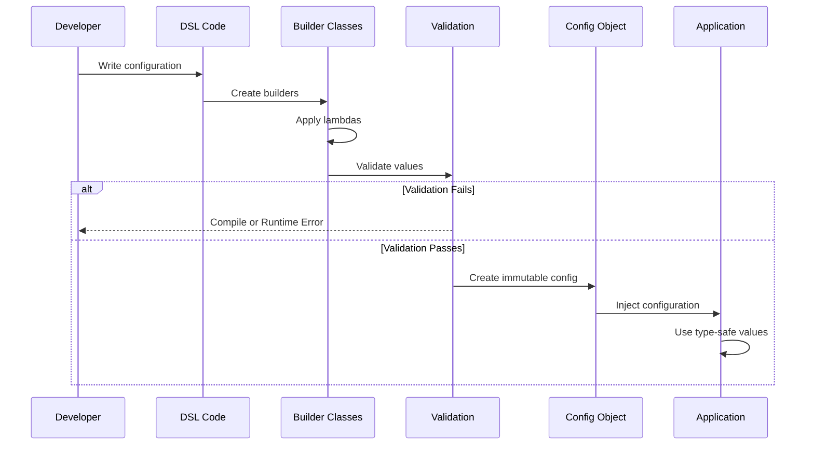

# How to Use Kotlin DSLs for Configuration

Author: [nawazdhandala](https://www.github.com/nawazdhandala)

Tags: Kotlin, DSL, Configuration, Type-Safe Builders, Domain-Specific Languages

Description: Learn how to create and use Kotlin DSLs for type-safe, readable configuration in your applications. This guide covers DSL design patterns, type-safe builders, scope control, and practical examples for building configuration systems.

---

> Domain-Specific Languages (DSLs) in Kotlin enable you to write configuration code that reads like a specification. Instead of parsing YAML files or dealing with error-prone string keys, you get compile-time safety, IDE autocompletion, and refactoring support. This guide shows you how to build and use Kotlin DSLs for configuration across various use cases.

Kotlin's language features like extension functions, lambdas with receivers, operator overloading, and infix notation make it exceptionally well-suited for creating internal DSLs. These DSLs eliminate entire categories of runtime errors while making your configuration code more expressive and maintainable.

---

## Why Use Kotlin DSLs for Configuration?

Traditional configuration approaches have significant drawbacks that Kotlin DSLs address:

| Approach | Problems | Kotlin DSL Solution |
|----------|----------|-------------------|
| **YAML/JSON** | No compile-time validation | Type-checked at compile time |
| **Properties files** | String keys cause typos | IDE autocomplete prevents errors |
| **XML** | Verbose, hard to refactor | Concise, refactoring-friendly |
| **Annotations** | Limited expressiveness | Full programming language power |
| **Environment variables** | No structure, easy to miss | Structured with defaults |

---

## DSL Architecture Overview

The following diagram shows the components involved in building a Kotlin DSL for configuration:

```mermaid
graph TB
    subgraph "DSL Components"
        A[DSL Entry Function] --> B[Builder Classes]
        B --> C[Configuration Data Classes]
        D[@DslMarker Annotation] --> B
    end

    subgraph "Language Features"
        E[Lambdas with Receivers] --> A
        F[Extension Functions] --> B
        G[Operator Overloading] --> B
        H[Infix Functions] --> B
    end

    subgraph "Output"
        C --> I[Immutable Config Object]
        I --> J[Application Runtime]
    end
```

---

## Building Your First Configuration DSL

Let us start with a practical example: building a DSL for server configuration.

### Step 1: Define the Configuration Data Classes

First, create immutable data classes that represent your final configuration. These classes hold the validated, parsed configuration values:

```kotlin
// ServerConfig.kt
package com.example.config

// Immutable configuration class for server settings
// Using data class provides equals, hashCode, and copy methods
data class ServerConfig(
    val host: String,
    val port: Int,
    val ssl: SslConfig?,
    val cors: CorsConfig,
    val logging: LoggingConfig,
    val routes: List<RouteConfig>
)

// SSL/TLS configuration
data class SslConfig(
    val keyStorePath: String,
    val keyStorePassword: String,
    val certificateAlias: String
)

// CORS (Cross-Origin Resource Sharing) settings
data class CorsConfig(
    val allowedOrigins: List<String>,
    val allowedMethods: List<String>,
    val allowedHeaders: List<String>,
    val allowCredentials: Boolean,
    val maxAge: Long
)

// Logging configuration
data class LoggingConfig(
    val level: LogLevel,
    val format: LogFormat,
    val outputPath: String?
)

// Route definition for the server
data class RouteConfig(
    val path: String,
    val methods: List<HttpMethod>,
    val handler: String,
    val middleware: List<String>
)

// Enums for type-safe option selection
enum class LogLevel { TRACE, DEBUG, INFO, WARN, ERROR }
enum class LogFormat { JSON, TEXT, STRUCTURED }
enum class HttpMethod { GET, POST, PUT, DELETE, PATCH, HEAD, OPTIONS }
```

### Step 2: Create DSL Marker Annotation

The @DslMarker annotation prevents scope leakage, ensuring users cannot accidentally access outer scope properties from nested builders:

```kotlin
// DslMarkers.kt
package com.example.config

// Marks all builder classes as part of the same DSL
// This prevents implicit access to outer receivers in nested lambdas
@DslMarker
annotation class ServerConfigDsl
```

### Step 3: Implement Builder Classes

Builder classes provide the mutable state during configuration and convert to immutable data classes when built:

```kotlin
// ServerConfigBuilder.kt
package com.example.config

// Main builder for server configuration
// Annotated with @ServerConfigDsl to enable scope control
@ServerConfigDsl
class ServerConfigBuilder {
    // Default values provide sensible configurations out of the box
    var host: String = "0.0.0.0"
    var port: Int = 8080

    // Nullable builders for optional sections
    private var sslBuilder: SslConfigBuilder? = null
    private var corsBuilder: CorsConfigBuilder = CorsConfigBuilder()
    private var loggingBuilder: LoggingConfigBuilder = LoggingConfigBuilder()
    private val routeBuilders: MutableList<RouteConfigBuilder> = mutableListOf()

    // DSL function for SSL configuration
    // Only called if SSL is needed
    fun ssl(block: SslConfigBuilder.() -> Unit) {
        sslBuilder = SslConfigBuilder().apply(block)
    }

    // DSL function for CORS configuration
    fun cors(block: CorsConfigBuilder.() -> Unit) {
        corsBuilder.apply(block)
    }

    // DSL function for logging configuration
    fun logging(block: LoggingConfigBuilder.() -> Unit) {
        loggingBuilder.apply(block)
    }

    // DSL function to add a route
    // Can be called multiple times for multiple routes
    fun route(path: String, block: RouteConfigBuilder.() -> Unit) {
        routeBuilders.add(RouteConfigBuilder(path).apply(block))
    }

    // Build the final immutable configuration object
    // Validates required fields before creating the object
    fun build(): ServerConfig {
        require(port in 1..65535) { "Port must be between 1 and 65535" }
        require(host.isNotBlank()) { "Host cannot be blank" }

        return ServerConfig(
            host = host,
            port = port,
            ssl = sslBuilder?.build(),
            cors = corsBuilder.build(),
            logging = loggingBuilder.build(),
            routes = routeBuilders.map { it.build() }
        )
    }
}

// Builder for SSL configuration
@ServerConfigDsl
class SslConfigBuilder {
    var keyStorePath: String = ""
    var keyStorePassword: String = ""
    var certificateAlias: String = "server"

    fun build(): SslConfig {
        require(keyStorePath.isNotBlank()) { "SSL keystore path is required" }
        require(keyStorePassword.isNotBlank()) { "SSL keystore password is required" }

        return SslConfig(
            keyStorePath = keyStorePath,
            keyStorePassword = keyStorePassword,
            certificateAlias = certificateAlias
        )
    }
}

// Builder for CORS configuration
@ServerConfigDsl
class CorsConfigBuilder {
    // Mutable lists allow incremental configuration
    private val origins: MutableList<String> = mutableListOf()
    private val methods: MutableList<String> = mutableListOf("GET", "POST")
    private val headers: MutableList<String> = mutableListOf("Content-Type")
    var allowCredentials: Boolean = false
    var maxAge: Long = 3600

    // Add allowed origins
    fun allowOrigin(vararg origin: String) {
        origins.addAll(origin)
    }

    // Add allowed methods
    fun allowMethod(vararg method: String) {
        methods.addAll(method)
    }

    // Add allowed headers
    fun allowHeader(vararg header: String) {
        headers.addAll(header)
    }

    fun build(): CorsConfig = CorsConfig(
        allowedOrigins = origins.toList(),
        allowedMethods = methods.toList(),
        allowedHeaders = headers.toList(),
        allowCredentials = allowCredentials,
        maxAge = maxAge
    )
}

// Builder for logging configuration
@ServerConfigDsl
class LoggingConfigBuilder {
    var level: LogLevel = LogLevel.INFO
    var format: LogFormat = LogFormat.JSON
    var outputPath: String? = null

    fun build(): LoggingConfig = LoggingConfig(
        level = level,
        format = format,
        outputPath = outputPath
    )
}

// Builder for route configuration
@ServerConfigDsl
class RouteConfigBuilder(private val path: String) {
    private val methods: MutableList<HttpMethod> = mutableListOf()
    var handler: String = ""
    private val middlewareList: MutableList<String> = mutableListOf()

    // Infix function for readable method specification
    infix fun handles(method: HttpMethod) {
        methods.add(method)
    }

    // Add multiple methods at once
    fun methods(vararg method: HttpMethod) {
        methods.addAll(method)
    }

    // Add middleware to the route
    fun middleware(vararg names: String) {
        middlewareList.addAll(names)
    }

    fun build(): RouteConfig {
        require(handler.isNotBlank()) { "Route handler is required for path: $path" }
        require(methods.isNotEmpty()) { "At least one HTTP method required for path: $path" }

        return RouteConfig(
            path = path,
            methods = methods.toList(),
            handler = handler,
            middleware = middlewareList.toList()
        )
    }
}
```

### Step 4: Create the DSL Entry Point

The entry point function provides a clean way to start building configuration:

```kotlin
// ServerConfigDsl.kt
package com.example.config

// Top-level function serves as the DSL entry point
// Returns an immutable ServerConfig after building
fun serverConfig(block: ServerConfigBuilder.() -> Unit): ServerConfig {
    return ServerConfigBuilder().apply(block).build()
}
```

### Step 5: Use the DSL

Now you can write configuration that reads like a specification:

```kotlin
// Main.kt
package com.example

import com.example.config.*

fun main() {
    // Configuration reads like a document describing the server
    val config = serverConfig {
        host = "api.example.com"
        port = 8443

        // SSL configuration block
        ssl {
            keyStorePath = "/etc/ssl/keystore.jks"
            keyStorePassword = System.getenv("SSL_PASSWORD") ?: "changeit"
            certificateAlias = "api-server"
        }

        // CORS configuration
        cors {
            allowOrigin("https://app.example.com", "https://admin.example.com")
            allowMethod("GET", "POST", "PUT", "DELETE")
            allowHeader("Authorization", "Content-Type", "X-Request-ID")
            allowCredentials = true
            maxAge = 7200
        }

        // Logging configuration
        logging {
            level = LogLevel.INFO
            format = LogFormat.JSON
            outputPath = "/var/log/api/server.log"
        }

        // Route definitions
        route("/api/users") {
            methods(HttpMethod.GET, HttpMethod.POST)
            handler = "UserController"
            middleware("auth", "rateLimit")
        }

        route("/api/users/{id}") {
            methods(HttpMethod.GET, HttpMethod.PUT, HttpMethod.DELETE)
            handler = "UserController"
            middleware("auth")
        }

        route("/health") {
            this handles HttpMethod.GET
            handler = "HealthController"
        }
    }

    // Access configuration values with full type safety
    println("Server starting on ${config.host}:${config.port}")
    println("SSL enabled: ${config.ssl != null}")
    println("Routes configured: ${config.routes.size}")
}
```

---

## Advanced DSL Patterns

### Operator Overloading for Cleaner Syntax

Use operator overloading to create intuitive syntax for common operations:

```kotlin
// DatabaseConfigDsl.kt
package com.example.config.database

// Configuration for database connection pooling
data class PoolConfig(
    val minConnections: Int,
    val maxConnections: Int,
    val idleTimeout: Long,
    val connectionTimeout: Long
)

@DslMarker
annotation class DatabaseDsl

@DatabaseDsl
class PoolConfigBuilder {
    var minConnections: Int = 5
    var maxConnections: Int = 20
    var idleTimeout: Long = 600_000  // 10 minutes
    var connectionTimeout: Long = 30_000  // 30 seconds

    // Operator overloading for range-based connection limits
    // Allows syntax: connections = 5..50
    operator fun IntRange.unaryPlus() {
        minConnections = this.first
        maxConnections = this.last
    }

    // Use rangeTo for connection configuration
    infix fun Int.connections(max: Int) {
        minConnections = this
        maxConnections = max
    }

    fun build(): PoolConfig = PoolConfig(
        minConnections = minConnections,
        maxConnections = maxConnections,
        idleTimeout = idleTimeout,
        connectionTimeout = connectionTimeout
    )
}

// Duration extension properties for readable timeouts
val Int.seconds: Long get() = this * 1000L
val Int.minutes: Long get() = this * 60 * 1000L
val Int.hours: Long get() = this * 60 * 60 * 1000L

@DatabaseDsl
class DatabaseConfigBuilder {
    var url: String = ""
    var username: String = ""
    var password: String = ""
    var driver: String = "org.postgresql.Driver"

    private var poolBuilder = PoolConfigBuilder()

    fun pool(block: PoolConfigBuilder.() -> Unit) {
        poolBuilder.apply(block)
    }

    fun build(): DatabaseConfig {
        require(url.isNotBlank()) { "Database URL is required" }
        return DatabaseConfig(
            url = url,
            username = username,
            password = password,
            driver = driver,
            pool = poolBuilder.build()
        )
    }
}

data class DatabaseConfig(
    val url: String,
    val username: String,
    val password: String,
    val driver: String,
    val pool: PoolConfig
)

fun databaseConfig(block: DatabaseConfigBuilder.() -> Unit): DatabaseConfig {
    return DatabaseConfigBuilder().apply(block).build()
}

// Usage example with operator overloading
fun example() {
    val dbConfig = databaseConfig {
        url = "jdbc:postgresql://localhost:5432/mydb"
        username = "app_user"
        password = System.getenv("DB_PASSWORD") ?: ""

        pool {
            // Using infix function for readable syntax
            5 connections 50

            // Using extension properties for durations
            idleTimeout = 10.minutes
            connectionTimeout = 30.seconds
        }
    }
}
```

### Conditional Configuration with Context Receivers

Create configuration that adapts based on environment or runtime conditions:

```kotlin
// EnvironmentAwareConfig.kt
package com.example.config

// Environment enumeration
enum class Environment { DEVELOPMENT, STAGING, PRODUCTION }

// Context class provides environment information during configuration
class ConfigContext(val environment: Environment) {
    val isDevelopment: Boolean get() = environment == Environment.DEVELOPMENT
    val isProduction: Boolean get() = environment == Environment.PRODUCTION
    val isStaging: Boolean get() = environment == Environment.STAGING
}

@DslMarker
annotation class AppConfigDsl

@AppConfigDsl
class AppConfigBuilder(private val context: ConfigContext) {
    var name: String = "MyApp"
    var version: String = "1.0.0"

    private var debugMode: Boolean = context.isDevelopment
    private var enableMetrics: Boolean = !context.isDevelopment
    private var logLevel: String = if (context.isDevelopment) "DEBUG" else "INFO"

    // Conditional configuration block
    // Only executes if the condition is true
    fun whenDevelopment(block: AppConfigBuilder.() -> Unit) {
        if (context.isDevelopment) {
            this.apply(block)
        }
    }

    fun whenProduction(block: AppConfigBuilder.() -> Unit) {
        if (context.isProduction) {
            this.apply(block)
        }
    }

    fun whenStaging(block: AppConfigBuilder.() -> Unit) {
        if (context.isStaging) {
            this.apply(block)
        }
    }

    // Debug mode configuration
    fun debug(enabled: Boolean = true) {
        debugMode = enabled
    }

    // Metrics configuration
    fun metrics(enabled: Boolean = true) {
        enableMetrics = enabled
    }

    // Log level configuration
    fun logLevel(level: String) {
        logLevel = level
    }

    fun build(): AppConfig = AppConfig(
        name = name,
        version = version,
        debugMode = debugMode,
        enableMetrics = enableMetrics,
        logLevel = logLevel
    )
}

data class AppConfig(
    val name: String,
    val version: String,
    val debugMode: Boolean,
    val enableMetrics: Boolean,
    val logLevel: String
)

// Entry point that accepts environment
fun appConfig(
    environment: Environment,
    block: AppConfigBuilder.() -> Unit
): AppConfig {
    val context = ConfigContext(environment)
    return AppConfigBuilder(context).apply(block).build()
}

// Usage with environment-specific configuration
fun example() {
    val env = Environment.valueOf(
        System.getenv("APP_ENV") ?: "DEVELOPMENT"
    )

    val config = appConfig(env) {
        name = "OrderService"
        version = "2.1.0"

        // Only applied in development
        whenDevelopment {
            debug(true)
            logLevel("TRACE")
            metrics(false)  // Disable metrics overhead in dev
        }

        // Only applied in production
        whenProduction {
            debug(false)
            logLevel("WARN")
            metrics(true)
        }

        // Staging gets intermediate settings
        whenStaging {
            debug(false)
            logLevel("INFO")
            metrics(true)
        }
    }
}
```

### Hierarchical Configuration with Nested DSLs

Build complex nested configurations while maintaining readability:

```kotlin
// MicroserviceConfig.kt
package com.example.config.microservice

@DslMarker
annotation class MicroserviceDsl

// Service discovery configuration
data class DiscoveryConfig(
    val type: DiscoveryType,
    val servers: List<String>,
    val serviceName: String,
    val healthCheckInterval: Long
)

enum class DiscoveryType { CONSUL, EUREKA, KUBERNETES, STATIC }

// Circuit breaker configuration
data class CircuitBreakerConfig(
    val enabled: Boolean,
    val failureThreshold: Int,
    val resetTimeout: Long,
    val halfOpenRequests: Int
)

// Retry configuration
data class RetryConfig(
    val maxAttempts: Int,
    val initialDelay: Long,
    val maxDelay: Long,
    val multiplier: Double
)

// Complete resilience configuration
data class ResilienceConfig(
    val circuitBreaker: CircuitBreakerConfig,
    val retry: RetryConfig
)

// Full microservice configuration
data class MicroserviceConfig(
    val name: String,
    val port: Int,
    val discovery: DiscoveryConfig,
    val resilience: ResilienceConfig,
    val upstreamServices: List<UpstreamServiceConfig>
)

// Configuration for upstream service dependencies
data class UpstreamServiceConfig(
    val name: String,
    val url: String,
    val timeout: Long,
    val resilience: ResilienceConfig?
)

// Builders
@MicroserviceDsl
class CircuitBreakerConfigBuilder {
    var enabled: Boolean = true
    var failureThreshold: Int = 5
    var resetTimeout: Long = 30_000
    var halfOpenRequests: Int = 3

    fun build(): CircuitBreakerConfig = CircuitBreakerConfig(
        enabled = enabled,
        failureThreshold = failureThreshold,
        resetTimeout = resetTimeout,
        halfOpenRequests = halfOpenRequests
    )
}

@MicroserviceDsl
class RetryConfigBuilder {
    var maxAttempts: Int = 3
    var initialDelay: Long = 100
    var maxDelay: Long = 5000
    var multiplier: Double = 2.0

    fun build(): RetryConfig = RetryConfig(
        maxAttempts = maxAttempts,
        initialDelay = initialDelay,
        maxDelay = maxDelay,
        multiplier = multiplier
    )
}

@MicroserviceDsl
class ResilienceConfigBuilder {
    private val circuitBreakerBuilder = CircuitBreakerConfigBuilder()
    private val retryBuilder = RetryConfigBuilder()

    fun circuitBreaker(block: CircuitBreakerConfigBuilder.() -> Unit) {
        circuitBreakerBuilder.apply(block)
    }

    fun retry(block: RetryConfigBuilder.() -> Unit) {
        retryBuilder.apply(block)
    }

    fun build(): ResilienceConfig = ResilienceConfig(
        circuitBreaker = circuitBreakerBuilder.build(),
        retry = retryBuilder.build()
    )
}

@MicroserviceDsl
class DiscoveryConfigBuilder {
    var type: DiscoveryType = DiscoveryType.KUBERNETES
    private val serverList: MutableList<String> = mutableListOf()
    var serviceName: String = ""
    var healthCheckInterval: Long = 10_000

    fun servers(vararg addresses: String) {
        serverList.addAll(addresses)
    }

    fun build(): DiscoveryConfig = DiscoveryConfig(
        type = type,
        servers = serverList.toList(),
        serviceName = serviceName,
        healthCheckInterval = healthCheckInterval
    )
}

@MicroserviceDsl
class UpstreamServiceConfigBuilder(private val name: String) {
    var url: String = ""
    var timeout: Long = 5000
    private var resilienceBuilder: ResilienceConfigBuilder? = null

    fun resilience(block: ResilienceConfigBuilder.() -> Unit) {
        resilienceBuilder = ResilienceConfigBuilder().apply(block)
    }

    fun build(): UpstreamServiceConfig = UpstreamServiceConfig(
        name = name,
        url = url,
        timeout = timeout,
        resilience = resilienceBuilder?.build()
    )
}

@MicroserviceDsl
class MicroserviceConfigBuilder {
    var name: String = ""
    var port: Int = 8080

    private val discoveryBuilder = DiscoveryConfigBuilder()
    private val resilienceBuilder = ResilienceConfigBuilder()
    private val upstreamBuilders: MutableList<UpstreamServiceConfigBuilder> = mutableListOf()

    fun discovery(block: DiscoveryConfigBuilder.() -> Unit) {
        discoveryBuilder.apply(block)
    }

    fun resilience(block: ResilienceConfigBuilder.() -> Unit) {
        resilienceBuilder.apply(block)
    }

    fun upstream(serviceName: String, block: UpstreamServiceConfigBuilder.() -> Unit) {
        upstreamBuilders.add(UpstreamServiceConfigBuilder(serviceName).apply(block))
    }

    fun build(): MicroserviceConfig {
        require(name.isNotBlank()) { "Service name is required" }
        return MicroserviceConfig(
            name = name,
            port = port,
            discovery = discoveryBuilder.build(),
            resilience = resilienceBuilder.build(),
            upstreamServices = upstreamBuilders.map { it.build() }
        )
    }
}

fun microservice(block: MicroserviceConfigBuilder.() -> Unit): MicroserviceConfig {
    return MicroserviceConfigBuilder().apply(block).build()
}

// Complete usage example showing nested DSL structure
fun example() {
    val config = microservice {
        name = "order-service"
        port = 8080

        discovery {
            type = DiscoveryType.CONSUL
            servers("consul-1.internal:8500", "consul-2.internal:8500")
            serviceName = "order-service"
            healthCheckInterval = 15_000
        }

        resilience {
            circuitBreaker {
                enabled = true
                failureThreshold = 10
                resetTimeout = 60_000
                halfOpenRequests = 5
            }

            retry {
                maxAttempts = 3
                initialDelay = 100
                maxDelay = 2000
                multiplier = 2.0
            }
        }

        upstream("user-service") {
            url = "http://user-service:8081"
            timeout = 3000

            resilience {
                circuitBreaker {
                    failureThreshold = 5
                }
                retry {
                    maxAttempts = 2
                }
            }
        }

        upstream("inventory-service") {
            url = "http://inventory-service:8082"
            timeout = 5000
        }

        upstream("payment-service") {
            url = "http://payment-service:8083"
            timeout = 10_000  // Payment needs longer timeout

            resilience {
                circuitBreaker {
                    failureThreshold = 3  // Fail fast for payment issues
                    resetTimeout = 120_000  // Longer recovery time
                }
                retry {
                    maxAttempts = 1  // No retries for payment
                }
            }
        }
    }
}
```

---

## Configuration DSL Flow

The following diagram shows how configuration flows from DSL code to runtime usage:



---

## Integrating with External Configuration Sources

Combine DSL defaults with external sources like environment variables or files:

```kotlin
// ConfigurationLoader.kt
package com.example.config

import java.util.Properties
import java.io.FileInputStream

// Configuration source that can provide values
interface ConfigSource {
    fun getString(key: String): String?
    fun getInt(key: String): Int?
    fun getBoolean(key: String): Boolean?
    fun getLong(key: String): Long?
}

// Environment variable source
class EnvironmentConfigSource(private val prefix: String = "") : ConfigSource {
    private fun envKey(key: String): String =
        if (prefix.isNotEmpty()) "${prefix}_$key" else key

    override fun getString(key: String): String? =
        System.getenv(envKey(key.uppercase().replace(".", "_")))

    override fun getInt(key: String): Int? =
        getString(key)?.toIntOrNull()

    override fun getBoolean(key: String): Boolean? =
        getString(key)?.toBoolean()

    override fun getLong(key: String): Long? =
        getString(key)?.toLongOrNull()
}

// Properties file source
class PropertiesConfigSource(filePath: String) : ConfigSource {
    private val properties = Properties().apply {
        FileInputStream(filePath).use { load(it) }
    }

    override fun getString(key: String): String? =
        properties.getProperty(key)

    override fun getInt(key: String): Int? =
        getString(key)?.toIntOrNull()

    override fun getBoolean(key: String): Boolean? =
        getString(key)?.toBoolean()

    override fun getLong(key: String): Long? =
        getString(key)?.toLongOrNull()
}

// Composite source that tries multiple sources in order
class CompositeConfigSource(private vararg val sources: ConfigSource) : ConfigSource {
    override fun getString(key: String): String? =
        sources.firstNotNullOfOrNull { it.getString(key) }

    override fun getInt(key: String): Int? =
        sources.firstNotNullOfOrNull { it.getInt(key) }

    override fun getBoolean(key: String): Boolean? =
        sources.firstNotNullOfOrNull { it.getBoolean(key) }

    override fun getLong(key: String): Long? =
        sources.firstNotNullOfOrNull { it.getLong(key) }
}

// Extended builder that uses external config sources
@ServerConfigDsl
class ExternalizedServerConfigBuilder(private val source: ConfigSource) {
    // DSL values act as defaults, external sources can override
    var host: String = source.getString("server.host") ?: "0.0.0.0"
    var port: Int = source.getInt("server.port") ?: 8080

    private var sslBuilder: SslConfigBuilder? = null
    private var loggingBuilder = LoggingConfigBuilder()

    fun ssl(block: SslConfigBuilder.() -> Unit) {
        sslBuilder = SslConfigBuilder().apply {
            // Pre-populate from external source
            keyStorePath = source.getString("server.ssl.keystore.path") ?: ""
            keyStorePassword = source.getString("server.ssl.keystore.password") ?: ""
        }.apply(block)
    }

    fun logging(block: LoggingConfigBuilder.() -> Unit) {
        loggingBuilder.apply {
            // Pre-populate from external source
            source.getString("server.logging.level")?.let { levelStr ->
                level = LogLevel.valueOf(levelStr.uppercase())
            }
        }.apply(block)
    }

    fun build(): ServerConfig {
        return ServerConfig(
            host = host,
            port = port,
            ssl = sslBuilder?.build(),
            cors = CorsConfig(emptyList(), emptyList(), emptyList(), false, 3600),
            logging = loggingBuilder.build(),
            routes = emptyList()
        )
    }
}

// Entry point with external configuration
fun serverConfigWithSource(
    source: ConfigSource,
    block: ExternalizedServerConfigBuilder.() -> Unit
): ServerConfig {
    return ExternalizedServerConfigBuilder(source).apply(block).build()
}

// Usage combining external sources with DSL
fun example() {
    // Create composite source: env vars override properties file
    val configSource = CompositeConfigSource(
        EnvironmentConfigSource("APP"),
        PropertiesConfigSource("application.properties")
    )

    val config = serverConfigWithSource(configSource) {
        // DSL can override or use external values
        // If APP_SERVER_PORT env var exists, it takes precedence
        // Otherwise uses properties file value
        // If neither exists, uses DSL default

        ssl {
            // Password comes from environment variable
            // Keystore path can be set in DSL
            keyStorePath = "/etc/ssl/server.jks"
        }

        logging {
            // Format is always JSON regardless of external config
            format = LogFormat.JSON
        }
    }
}
```

---

## Testing Configuration DSLs

Create comprehensive tests for your configuration DSL:

```kotlin
// ServerConfigDslTest.kt
package com.example.config

import org.junit.jupiter.api.Test
import org.junit.jupiter.api.assertThrows
import kotlin.test.assertEquals
import kotlin.test.assertNull
import kotlin.test.assertNotNull
import kotlin.test.assertTrue

class ServerConfigDslTest {

    @Test
    fun `should create minimal configuration with defaults`() {
        // Act - create config with only required values
        val config = serverConfig {
            // Using all defaults
        }

        // Assert - verify defaults are applied
        assertEquals("0.0.0.0", config.host)
        assertEquals(8080, config.port)
        assertNull(config.ssl)
        assertTrue(config.routes.isEmpty())
    }

    @Test
    fun `should create complete configuration`() {
        // Act
        val config = serverConfig {
            host = "api.example.com"
            port = 443

            ssl {
                keyStorePath = "/etc/ssl/keystore.jks"
                keyStorePassword = "secret"
                certificateAlias = "api"
            }

            cors {
                allowOrigin("https://example.com")
                allowMethod("GET", "POST")
                allowCredentials = true
            }

            logging {
                level = LogLevel.DEBUG
                format = LogFormat.STRUCTURED
            }

            route("/api/health") {
                methods(HttpMethod.GET)
                handler = "HealthHandler"
            }
        }

        // Assert
        assertEquals("api.example.com", config.host)
        assertEquals(443, config.port)
        assertNotNull(config.ssl)
        assertEquals("/etc/ssl/keystore.jks", config.ssl?.keyStorePath)
        assertEquals(1, config.cors.allowedOrigins.size)
        assertEquals(LogLevel.DEBUG, config.logging.level)
        assertEquals(1, config.routes.size)
    }

    @Test
    fun `should reject invalid port`() {
        // Act and Assert
        assertThrows<IllegalArgumentException> {
            serverConfig {
                port = 70000  // Invalid port number
            }
        }
    }

    @Test
    fun `should reject blank host`() {
        // Act and Assert
        assertThrows<IllegalArgumentException> {
            serverConfig {
                host = ""
            }
        }
    }

    @Test
    fun `should reject SSL config without keystore path`() {
        // Act and Assert
        assertThrows<IllegalArgumentException> {
            serverConfig {
                ssl {
                    keyStorePassword = "secret"
                    // Missing keyStorePath
                }
            }
        }
    }

    @Test
    fun `should reject route without handler`() {
        // Act and Assert
        assertThrows<IllegalArgumentException> {
            serverConfig {
                route("/api/test") {
                    methods(HttpMethod.GET)
                    // Missing handler
                }
            }
        }
    }

    @Test
    fun `should support multiple routes`() {
        // Act
        val config = serverConfig {
            route("/users") {
                methods(HttpMethod.GET, HttpMethod.POST)
                handler = "UserHandler"
            }
            route("/orders") {
                methods(HttpMethod.GET)
                handler = "OrderHandler"
                middleware("auth", "logging")
            }
        }

        // Assert
        assertEquals(2, config.routes.size)
        assertEquals("/users", config.routes[0].path)
        assertEquals("/orders", config.routes[1].path)
        assertEquals(2, config.routes[1].middleware.size)
    }

    @Test
    fun `should allow infix syntax for route methods`() {
        // Act
        val config = serverConfig {
            route("/health") {
                this handles HttpMethod.GET
                handler = "HealthHandler"
            }
        }

        // Assert
        assertEquals(1, config.routes[0].methods.size)
        assertEquals(HttpMethod.GET, config.routes[0].methods[0])
    }
}
```

---

## Best Practices for Configuration DSLs

### 1. Keep Builders Mutable, Configs Immutable

Builders should be mutable during construction but produce immutable configuration objects:

```kotlin
// Builder has mutable state
class ConfigBuilder {
    var value: String = ""  // Mutable during construction
}

// Config is immutable after creation
data class Config(val value: String)  // Cannot be changed
```

### 2. Use @DslMarker to Prevent Scope Confusion

Always use @DslMarker to prevent accessing outer scope receivers implicitly:

```kotlin
@DslMarker
annotation class MyDsl

@MyDsl
class OuterBuilder {
    var outerValue: String = ""

    fun inner(block: InnerBuilder.() -> Unit) {
        // Without @DslMarker, users could accidentally write:
        // inner { outerValue = "wrong" }  // Accessing outer scope!
    }
}

@MyDsl
class InnerBuilder {
    var innerValue: String = ""
}
```

### 3. Validate Early and Provide Clear Errors

Validate configuration during build() and provide actionable error messages:

```kotlin
fun build(): Config {
    require(port in 1..65535) {
        "Port must be between 1 and 65535, got: $port"
    }
    require(host.isNotBlank()) {
        "Host cannot be blank. Please provide a valid hostname or IP address."
    }
    // Build only after validation passes
    return Config(host, port)
}
```

### 4. Provide Sensible Defaults

Make the simplest configurations work without requiring every option:

```kotlin
class ServerConfigBuilder {
    // Sensible defaults mean minimal config still works
    var host: String = "0.0.0.0"  // Listen on all interfaces
    var port: Int = 8080          // Standard HTTP port
    var workers: Int = Runtime.getRuntime().availableProcessors()
}
```

### 5. Document DSL Usage with Examples

Include usage examples in documentation and tests:

```kotlin
/**
 * Creates a server configuration using DSL syntax.
 *
 * Example:
 * ```kotlin
 * val config = serverConfig {
 *     host = "localhost"
 *     port = 8080
 *
 *     ssl {
 *         keyStorePath = "/path/to/keystore.jks"
 *         keyStorePassword = "secret"
 *     }
 * }
 * ```
 *
 * @param block Configuration lambda
 * @return Immutable ServerConfig
 */
fun serverConfig(block: ServerConfigBuilder.() -> Unit): ServerConfig
```

---

## Conclusion

Kotlin DSLs transform configuration from error-prone text files into type-safe, refactorable code. Key advantages include:

- **Compile-time safety** catches configuration errors before deployment
- **IDE support** provides autocompletion and navigation
- **Refactoring** works across your entire codebase
- **Testing** becomes straightforward with standard unit tests
- **Documentation** lives alongside the code

Start with simple DSLs for your most common configuration needs, then expand as you identify patterns that benefit from the DSL approach. The investment in building a well-designed configuration DSL pays dividends in reduced bugs, faster development, and more maintainable systems.

---

*Building applications with Kotlin? [OneUptime](https://oneuptime.com) provides comprehensive monitoring, alerting, and incident management. Track your application health, set up intelligent alerts, and respond to issues faster with our open-source observability platform.*

**Related Reading:**
- [Kotlin Coroutines for Async Operations](https://oneuptime.com/blog/post/kotlin-coroutines-async/view)
- [Type-Safe Builders in Kotlin](https://oneuptime.com/blog/post/kotlin-type-safe-builders/view)
