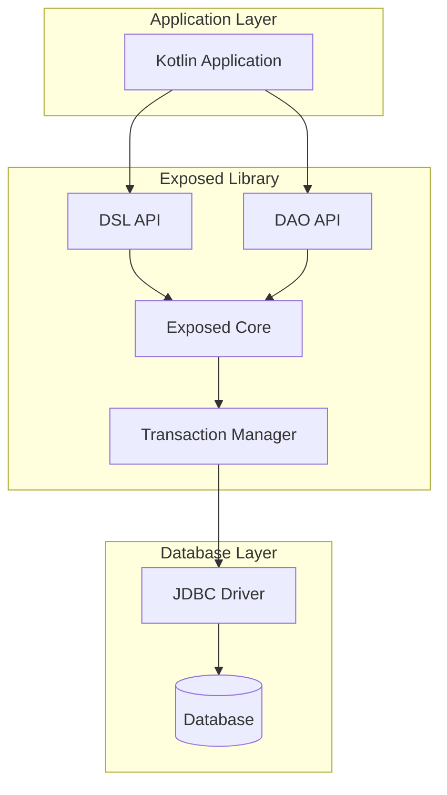
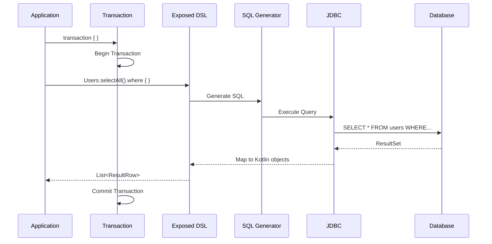

# How to Connect Kotlin to Databases with Exposed

Author: [nawazdhandala](https://www.github.com/nawazdhandala)

Tags: Kotlin, Exposed, Database, ORM, SQL, JetBrains, PostgreSQL, MySQL

Description: Learn how to connect Kotlin applications to databases using JetBrains Exposed, a lightweight SQL library that provides both DSL and DAO approaches. This guide covers setup, CRUD operations, transactions, relationships, and production best practices.

---

> Exposed is JetBrains' official SQL library for Kotlin, offering a type-safe and idiomatic way to interact with databases. Unlike heavyweight ORMs, Exposed gives you fine-grained control while maintaining Kotlin's expressive syntax. This guide will take you from setup to production-ready database operations.

Working with databases in Kotlin has never been easier thanks to Exposed. Whether you prefer writing raw SQL-like queries or working with higher-level Data Access Objects, Exposed provides both approaches in a single, cohesive library.

---

## Why Choose Exposed?

| Feature | Exposed | Hibernate | JDBC |
|---------|---------|-----------|------|
| **Type Safety** | Compile-time checks | Runtime errors | None |
| **Kotlin-First** | Native Kotlin DSL | Java-based | N/A |
| **Learning Curve** | Low | High | Medium |
| **Performance** | Minimal overhead | Significant overhead | Direct |
| **Flexibility** | DSL + DAO modes | ORM only | Manual |

Exposed stands out for several reasons:

- **Lightweight**: No heavy reflection or proxy generation
- **Type-safe**: Catch errors at compile time, not runtime
- **Two approaches**: Choose between DSL for control or DAO for convenience
- **Coroutine support**: First-class async database operations
- **Active development**: Maintained by JetBrains

---

## Architecture Overview

Understanding how Exposed works helps you make better design decisions.



Exposed operates in two modes:

1. **DSL (Domain Specific Language)**: Write SQL-like queries with Kotlin syntax
2. **DAO (Data Access Object)**: Work with entities as Kotlin objects

---

## Project Setup

### Gradle Configuration

Add the necessary dependencies to your `build.gradle.kts` file. This configuration includes both the DSL and DAO modules along with a PostgreSQL driver.

```kotlin
// build.gradle.kts
plugins {
    kotlin("jvm") version "1.9.22"
}

repositories {
    mavenCentral()
}

dependencies {
    // Exposed core modules
    implementation("org.jetbrains.exposed:exposed-core:0.47.0")
    implementation("org.jetbrains.exposed:exposed-dao:0.47.0")
    implementation("org.jetbrains.exposed:exposed-jdbc:0.47.0")

    // Date/time support
    implementation("org.jetbrains.exposed:exposed-java-time:0.47.0")

    // Database drivers - choose based on your database
    implementation("org.postgresql:postgresql:42.7.1")
    // Or for MySQL:
    // implementation("mysql:mysql-connector-java:8.0.33")
    // Or for H2 (testing):
    // implementation("com.h2database:h2:2.2.224")

    // Connection pooling (recommended for production)
    implementation("com.zaxxer:HikariCP:5.1.0")

    // Logging
    implementation("org.slf4j:slf4j-simple:2.0.11")
}
```

### Maven Configuration

For Maven projects, add these dependencies to your `pom.xml` file.

```xml
<!-- pom.xml -->
<dependencies>
    <dependency>
        <groupId>org.jetbrains.exposed</groupId>
        <artifactId>exposed-core</artifactId>
        <version>0.47.0</version>
    </dependency>
    <dependency>
        <groupId>org.jetbrains.exposed</groupId>
        <artifactId>exposed-dao</artifactId>
        <version>0.47.0</version>
    </dependency>
    <dependency>
        <groupId>org.jetbrains.exposed</groupId>
        <artifactId>exposed-jdbc</artifactId>
        <version>0.47.0</version>
    </dependency>
    <dependency>
        <groupId>org.postgresql</groupId>
        <artifactId>postgresql</artifactId>
        <version>42.7.1</version>
    </dependency>
</dependencies>
```

---

## Database Connection

### Basic Connection

The simplest way to connect is using `Database.connect()` with a JDBC URL.

```kotlin
// DatabaseConfig.kt
import org.jetbrains.exposed.sql.Database

// Connect to PostgreSQL with basic configuration
// The driver parameter is optional - Exposed auto-detects from the URL
fun connectToDatabase() {
    Database.connect(
        url = "jdbc:postgresql://localhost:5432/myapp",
        driver = "org.postgresql.Driver",
        user = "postgres",
        password = "password"
    )
}
```

### Production-Ready Connection with HikariCP

For production environments, use connection pooling with HikariCP. This improves performance and manages connections efficiently.

```kotlin
// DatabaseConfig.kt
import com.zaxxer.hikari.HikariConfig
import com.zaxxer.hikari.HikariDataSource
import org.jetbrains.exposed.sql.Database

object DatabaseFactory {

    // Initialize database with connection pooling
    // HikariCP manages a pool of reusable connections
    fun init() {
        val config = HikariConfig().apply {
            // JDBC connection URL
            jdbcUrl = System.getenv("DATABASE_URL")
                ?: "jdbc:postgresql://localhost:5432/myapp"

            // Database credentials
            username = System.getenv("DATABASE_USER") ?: "postgres"
            password = System.getenv("DATABASE_PASSWORD") ?: "password"

            // Pool configuration
            maximumPoolSize = 10          // Maximum connections in pool
            minimumIdle = 2               // Minimum idle connections
            idleTimeout = 60000           // 1 minute idle timeout
            connectionTimeout = 30000     // 30 seconds connection timeout
            maxLifetime = 1800000         // 30 minutes max connection lifetime

            // Performance optimizations
            isAutoCommit = false          // Exposed manages transactions
            transactionIsolation = "TRANSACTION_REPEATABLE_READ"

            // Validation query to check connection health
            connectionTestQuery = "SELECT 1"
        }

        val dataSource = HikariDataSource(config)
        Database.connect(dataSource)
    }
}
```

---

## Defining Tables with DSL

Tables in Exposed DSL are defined as Kotlin objects extending the `Table` class.

### Basic Table Definition

Define your database schema using Kotlin's type system. Each column has a specific type that maps to SQL.

```kotlin
// tables/Users.kt
import org.jetbrains.exposed.sql.Table
import org.jetbrains.exposed.sql.javatime.datetime
import java.time.LocalDateTime

// Users table definition
// Object declaration ensures a singleton instance
object Users : Table("users") {
    // Auto-incrementing primary key
    val id = integer("id").autoIncrement()

    // String columns with constraints
    val email = varchar("email", 255).uniqueIndex()
    val username = varchar("username", 100)
    val passwordHash = varchar("password_hash", 255)

    // Nullable column - use .nullable() modifier
    val bio = text("bio").nullable()

    // Boolean with default value
    val isActive = bool("is_active").default(true)

    // Timestamp columns using java.time
    val createdAt = datetime("created_at").default(LocalDateTime.now())
    val updatedAt = datetime("updated_at").default(LocalDateTime.now())

    // Define the primary key
    override val primaryKey = PrimaryKey(id)
}
```

### Table with Foreign Keys

Define relationships between tables using references.

```kotlin
// tables/Posts.kt
import org.jetbrains.exposed.sql.Table
import org.jetbrains.exposed.sql.ReferenceOption
import org.jetbrains.exposed.sql.javatime.datetime
import java.time.LocalDateTime

// Posts table with foreign key to Users
object Posts : Table("posts") {
    val id = integer("id").autoIncrement()

    // Foreign key reference to Users table
    // ReferenceOption.CASCADE deletes posts when user is deleted
    val authorId = integer("author_id")
        .references(Users.id, onDelete = ReferenceOption.CASCADE)

    val title = varchar("title", 255)
    val content = text("content")
    val slug = varchar("slug", 255).uniqueIndex()

    // Enum-like status using varchar
    val status = varchar("status", 20).default("draft")

    val publishedAt = datetime("published_at").nullable()
    val createdAt = datetime("created_at").default(LocalDateTime.now())

    override val primaryKey = PrimaryKey(id)
}

// Tags table for many-to-many relationship
object Tags : Table("tags") {
    val id = integer("id").autoIncrement()
    val name = varchar("name", 50).uniqueIndex()

    override val primaryKey = PrimaryKey(id)
}

// Junction table for Posts-Tags many-to-many relationship
object PostTags : Table("post_tags") {
    val postId = integer("post_id")
        .references(Posts.id, onDelete = ReferenceOption.CASCADE)
    val tagId = integer("tag_id")
        .references(Tags.id, onDelete = ReferenceOption.CASCADE)

    // Composite primary key
    override val primaryKey = PrimaryKey(postId, tagId)
}
```

### Creating Tables

Use `SchemaUtils` to create tables in the database.

```kotlin
// Main.kt
import org.jetbrains.exposed.sql.SchemaUtils
import org.jetbrains.exposed.sql.transactions.transaction

fun main() {
    DatabaseFactory.init()

    // Create tables within a transaction
    // SchemaUtils.create() generates CREATE TABLE statements
    transaction {
        SchemaUtils.create(Users, Posts, Tags, PostTags)
    }
}
```

---

## CRUD Operations with DSL

The DSL approach gives you fine-grained control over SQL queries.

### Insert Operations

Insert single or multiple rows with type-safe syntax.

```kotlin
// operations/UserOperations.kt
import org.jetbrains.exposed.sql.*
import org.jetbrains.exposed.sql.transactions.transaction

// Insert a single user and return the generated ID
fun createUser(email: String, username: String, passwordHash: String): Int {
    return transaction {
        // insertAndGetId returns the auto-generated primary key
        Users.insertAndGetId {
            it[Users.email] = email
            it[Users.username] = username
            it[Users.passwordHash] = passwordHash
        }.value
    }
}

// Insert multiple users in a batch for better performance
fun createUsers(userList: List<Triple<String, String, String>>) {
    transaction {
        // batchInsert is optimized for bulk inserts
        Users.batchInsert(userList) { (email, username, passwordHash) ->
            this[Users.email] = email
            this[Users.username] = username
            this[Users.passwordHash] = passwordHash
        }
    }
}

// Insert with returning clause (PostgreSQL)
fun createUserReturning(email: String, username: String, passwordHash: String): ResultRow {
    return transaction {
        Users.insert {
            it[Users.email] = email
            it[Users.username] = username
            it[Users.passwordHash] = passwordHash
        }.resultedValues!!.first()
    }
}
```

### Select Operations

Query data with type-safe filters and projections.

```kotlin
// operations/QueryOperations.kt
import org.jetbrains.exposed.sql.*
import org.jetbrains.exposed.sql.transactions.transaction

// Data class for mapping query results
data class UserDTO(
    val id: Int,
    val email: String,
    val username: String,
    val isActive: Boolean
)

// Select all users
fun getAllUsers(): List<UserDTO> {
    return transaction {
        Users.selectAll()
            .map { row ->
                UserDTO(
                    id = row[Users.id],
                    email = row[Users.email],
                    username = row[Users.username],
                    isActive = row[Users.isActive]
                )
            }
    }
}

// Select with WHERE clause
fun getUserByEmail(email: String): UserDTO? {
    return transaction {
        Users.selectAll()
            .where { Users.email eq email }
            .map { row ->
                UserDTO(
                    id = row[Users.id],
                    email = row[Users.email],
                    username = row[Users.username],
                    isActive = row[Users.isActive]
                )
            }
            .singleOrNull()
    }
}

// Select with multiple conditions
fun getActiveUsersByPattern(pattern: String): List<UserDTO> {
    return transaction {
        Users.selectAll()
            .where {
                (Users.isActive eq true) and
                (Users.username like "%$pattern%")
            }
            .orderBy(Users.createdAt to SortOrder.DESC)
            .limit(20)
            .map { row ->
                UserDTO(
                    id = row[Users.id],
                    email = row[Users.email],
                    username = row[Users.username],
                    isActive = row[Users.isActive]
                )
            }
    }
}

// Select specific columns only
fun getUserEmails(): List<String> {
    return transaction {
        Users.select(Users.email)
            .where { Users.isActive eq true }
            .map { it[Users.email] }
    }
}
```

### Update Operations

Update records with type-safe conditions.

```kotlin
// operations/UpdateOperations.kt
import org.jetbrains.exposed.sql.*
import org.jetbrains.exposed.sql.transactions.transaction
import java.time.LocalDateTime

// Update a single field
fun updateUserEmail(userId: Int, newEmail: String): Int {
    return transaction {
        // Returns the number of rows affected
        Users.update({ Users.id eq userId }) {
            it[email] = newEmail
            it[updatedAt] = LocalDateTime.now()
        }
    }
}

// Update multiple fields
fun updateUserProfile(userId: Int, username: String, bio: String?): Int {
    return transaction {
        Users.update({ Users.id eq userId }) {
            it[Users.username] = username
            it[Users.bio] = bio
            it[updatedAt] = LocalDateTime.now()
        }
    }
}

// Conditional update with complex WHERE clause
fun deactivateInactiveUsers(daysInactive: Long): Int {
    val cutoffDate = LocalDateTime.now().minusDays(daysInactive)

    return transaction {
        Users.update({
            (Users.isActive eq true) and
            (Users.updatedAt less cutoffDate)
        }) {
            it[isActive] = false
            it[updatedAt] = LocalDateTime.now()
        }
    }
}
```

### Delete Operations

Remove records safely with proper constraints.

```kotlin
// operations/DeleteOperations.kt
import org.jetbrains.exposed.sql.*
import org.jetbrains.exposed.sql.transactions.transaction

// Delete by ID
fun deleteUser(userId: Int): Int {
    return transaction {
        // Returns the number of deleted rows
        Users.deleteWhere { Users.id eq userId }
    }
}

// Delete with complex condition
fun deleteInactiveUsers(): Int {
    return transaction {
        Users.deleteWhere { Users.isActive eq false }
    }
}

// Delete all records (use with caution!)
fun deleteAllUsers(): Int {
    return transaction {
        Users.deleteAll()
    }
}
```

---

## Working with DAO

The DAO approach provides an object-oriented way to work with database entities.

### Entity Definitions

Define entities that map to your tables.

```kotlin
// entities/UserEntity.kt
import org.jetbrains.exposed.dao.IntEntity
import org.jetbrains.exposed.dao.IntEntityClass
import org.jetbrains.exposed.dao.id.EntityID
import org.jetbrains.exposed.dao.id.IntIdTable
import org.jetbrains.exposed.sql.javatime.datetime
import java.time.LocalDateTime

// Table definition for DAO - extends IntIdTable for auto-generated Int IDs
object UsersTable : IntIdTable("users") {
    val email = varchar("email", 255).uniqueIndex()
    val username = varchar("username", 100)
    val passwordHash = varchar("password_hash", 255)
    val bio = text("bio").nullable()
    val isActive = bool("is_active").default(true)
    val createdAt = datetime("created_at").default(LocalDateTime.now())
    val updatedAt = datetime("updated_at").default(LocalDateTime.now())
}

// Entity class representing a User record
class User(id: EntityID<Int>) : IntEntity(id) {
    // Companion object provides factory methods
    companion object : IntEntityClass<User>(UsersTable)

    // Properties map to table columns
    var email by UsersTable.email
    var username by UsersTable.username
    var passwordHash by UsersTable.passwordHash
    var bio by UsersTable.bio
    var isActive by UsersTable.isActive
    var createdAt by UsersTable.createdAt
    var updatedAt by UsersTable.updatedAt

    // One-to-many relationship: User has many Posts
    val posts by Post referrersOn PostsTable.author
}
```

### Entity with Relationships

Define entities with various relationship types.

```kotlin
// entities/PostEntity.kt
import org.jetbrains.exposed.dao.IntEntity
import org.jetbrains.exposed.dao.IntEntityClass
import org.jetbrains.exposed.dao.id.EntityID
import org.jetbrains.exposed.dao.id.IntIdTable
import org.jetbrains.exposed.sql.ReferenceOption
import org.jetbrains.exposed.sql.javatime.datetime
import java.time.LocalDateTime

object PostsTable : IntIdTable("posts") {
    val author = reference("author_id", UsersTable, onDelete = ReferenceOption.CASCADE)
    val title = varchar("title", 255)
    val content = text("content")
    val slug = varchar("slug", 255).uniqueIndex()
    val status = varchar("status", 20).default("draft")
    val publishedAt = datetime("published_at").nullable()
    val createdAt = datetime("created_at").default(LocalDateTime.now())
}

object TagsTable : IntIdTable("tags") {
    val name = varchar("name", 50).uniqueIndex()
}

// Junction table for many-to-many
object PostTagsTable : IntIdTable("post_tags") {
    val post = reference("post_id", PostsTable, onDelete = ReferenceOption.CASCADE)
    val tag = reference("tag_id", TagsTable, onDelete = ReferenceOption.CASCADE)
}

class Post(id: EntityID<Int>) : IntEntity(id) {
    companion object : IntEntityClass<Post>(PostsTable)

    var author by User referencedOn PostsTable.author
    var title by PostsTable.title
    var content by PostsTable.content
    var slug by PostsTable.slug
    var status by PostsTable.status
    var publishedAt by PostsTable.publishedAt
    var createdAt by PostsTable.createdAt

    // Many-to-many relationship through junction table
    var tags by Tag via PostTagsTable
}

class Tag(id: EntityID<Int>) : IntEntity(id) {
    companion object : IntEntityClass<Tag>(TagsTable)

    var name by TagsTable.name

    // Reverse many-to-many
    val posts by Post via PostTagsTable
}
```

### DAO CRUD Operations

Perform database operations using the entity classes.

```kotlin
// services/UserService.kt
import org.jetbrains.exposed.sql.transactions.transaction

class UserService {

    // Create a new user
    fun createUser(email: String, username: String, passwordHash: String): User {
        return transaction {
            User.new {
                this.email = email
                this.username = username
                this.passwordHash = passwordHash
            }
        }
    }

    // Find user by ID
    fun findById(id: Int): User? {
        return transaction {
            User.findById(id)
        }
    }

    // Find user by email
    fun findByEmail(email: String): User? {
        return transaction {
            User.find { UsersTable.email eq email }.singleOrNull()
        }
    }

    // Get all active users
    fun findAllActive(): List<User> {
        return transaction {
            User.find { UsersTable.isActive eq true }.toList()
        }
    }

    // Update user
    fun updateUser(id: Int, username: String?, bio: String?): User? {
        return transaction {
            User.findById(id)?.apply {
                username?.let { this.username = it }
                bio?.let { this.bio = it }
                this.updatedAt = LocalDateTime.now()
            }
        }
    }

    // Delete user
    fun deleteUser(id: Int): Boolean {
        return transaction {
            User.findById(id)?.let {
                it.delete()
                true
            } ?: false
        }
    }
}
```

---

## Transactions and Error Handling

Proper transaction management is crucial for data integrity.

### Basic Transactions

All database operations must occur within a transaction block.

```kotlin
// transactions/TransactionExamples.kt
import org.jetbrains.exposed.sql.transactions.transaction
import org.jetbrains.exposed.sql.transactions.TransactionManager
import java.sql.Connection

// Basic transaction - auto-commits on success, rolls back on exception
fun basicTransaction() {
    transaction {
        // All operations here are atomic
        val user = User.new {
            email = "user@example.com"
            username = "newuser"
            passwordHash = "hashed"
        }

        Post.new {
            author = user
            title = "First Post"
            content = "Hello World"
            slug = "first-post"
        }
        // Commits automatically when block completes
    }
}

// Transaction with custom isolation level
fun isolatedTransaction() {
    transaction(Connection.TRANSACTION_SERIALIZABLE) {
        // Serializable isolation prevents phantom reads
        // Use for critical operations requiring strong consistency
        val count = User.count()
        // Process based on count...
    }
}
```

### Nested Transactions

Handle complex operations with nested transaction blocks.

```kotlin
// transactions/NestedTransactions.kt
import org.jetbrains.exposed.sql.transactions.transaction

// Nested transactions use savepoints
fun nestedTransactionExample() {
    transaction {
        val user = User.new {
            email = "outer@example.com"
            username = "outer"
            passwordHash = "hashed"
        }

        try {
            // Inner transaction creates a savepoint
            transaction {
                Post.new {
                    author = user
                    title = "Nested Post"
                    content = "This might fail"
                    slug = "nested-post"
                }

                // Simulate an error
                throw RuntimeException("Inner transaction failed")
            }
        } catch (e: Exception) {
            // Inner transaction rolled back to savepoint
            // Outer transaction can continue
            println("Inner failed, but outer continues")
        }

        // This still succeeds - user is created
        Post.new {
            author = user
            title = "Safe Post"
            content = "This succeeds"
            slug = "safe-post"
        }
    }
}
```

### Error Handling Patterns

Implement robust error handling for database operations.

```kotlin
// transactions/ErrorHandling.kt
import org.jetbrains.exposed.exceptions.ExposedSQLException
import org.jetbrains.exposed.sql.transactions.transaction

sealed class DatabaseResult<out T> {
    data class Success<T>(val data: T) : DatabaseResult<T>()
    data class Error(val message: String, val cause: Throwable? = null) : DatabaseResult<Nothing>()
}

// Safe transaction wrapper with result type
inline fun <T> safeTransaction(crossinline block: () -> T): DatabaseResult<T> {
    return try {
        transaction {
            DatabaseResult.Success(block())
        }
    } catch (e: ExposedSQLException) {
        // Handle specific SQL exceptions
        when {
            e.message?.contains("unique constraint") == true ->
                DatabaseResult.Error("Duplicate entry exists", e)
            e.message?.contains("foreign key") == true ->
                DatabaseResult.Error("Referenced record not found", e)
            else ->
                DatabaseResult.Error("Database error: ${e.message}", e)
        }
    } catch (e: Exception) {
        DatabaseResult.Error("Unexpected error: ${e.message}", e)
    }
}

// Usage example
fun createUserSafely(email: String, username: String): DatabaseResult<User> {
    return safeTransaction {
        User.new {
            this.email = email
            this.username = username
            this.passwordHash = "temp"
        }
    }
}
```

---

## Advanced Queries

### Joins

Combine data from multiple tables efficiently.

```kotlin
// queries/JoinExamples.kt
import org.jetbrains.exposed.sql.*
import org.jetbrains.exposed.sql.transactions.transaction

data class PostWithAuthor(
    val postId: Int,
    val title: String,
    val authorName: String,
    val authorEmail: String
)

// Inner join - returns only matching records
fun getPostsWithAuthors(): List<PostWithAuthor> {
    return transaction {
        (Posts innerJoin Users)
            .select(Posts.id, Posts.title, Users.username, Users.email)
            .map { row ->
                PostWithAuthor(
                    postId = row[Posts.id],
                    title = row[Posts.title],
                    authorName = row[Users.username],
                    authorEmail = row[Users.email]
                )
            }
    }
}

// Left join - includes posts even without authors
fun getPostsWithOptionalAuthors(): List<PostWithAuthor> {
    return transaction {
        (Posts leftJoin Users)
            .select(Posts.id, Posts.title, Users.username, Users.email)
            .map { row ->
                PostWithAuthor(
                    postId = row[Posts.id],
                    title = row[Posts.title],
                    authorName = row[Users.username] ?: "Unknown",
                    authorEmail = row[Users.email] ?: ""
                )
            }
    }
}

// Complex join with conditions
fun getPublishedPostsByActiveAuthors(): List<PostWithAuthor> {
    return transaction {
        (Posts innerJoin Users)
            .select(Posts.id, Posts.title, Users.username, Users.email)
            .where {
                (Posts.status eq "published") and
                (Users.isActive eq true)
            }
            .orderBy(Posts.publishedAt to SortOrder.DESC)
            .map { row ->
                PostWithAuthor(
                    postId = row[Posts.id],
                    title = row[Posts.title],
                    authorName = row[Users.username],
                    authorEmail = row[Users.email]
                )
            }
    }
}
```

### Aggregations

Perform calculations across rows.

```kotlin
// queries/AggregationExamples.kt
import org.jetbrains.exposed.sql.*
import org.jetbrains.exposed.sql.transactions.transaction

data class AuthorStats(
    val authorId: Int,
    val username: String,
    val postCount: Long,
    val publishedCount: Long
)

// Count posts per author
fun getPostCountByAuthor(): List<AuthorStats> {
    return transaction {
        (Users leftJoin Posts)
            .select(
                Users.id,
                Users.username,
                Posts.id.count(),
                Posts.id.countIf { Posts.status eq "published" }
            )
            .groupBy(Users.id, Users.username)
            .map { row ->
                AuthorStats(
                    authorId = row[Users.id],
                    username = row[Users.username],
                    postCount = row[Posts.id.count()],
                    publishedCount = row[Posts.id.countIf { Posts.status eq "published" }]
                )
            }
    }
}

// Using aggregate functions
fun getStats() {
    transaction {
        // Total user count
        val totalUsers = Users.selectAll().count()

        // Active users
        val activeUsers = Users.selectAll()
            .where { Users.isActive eq true }
            .count()

        // Users with posts (subquery)
        val usersWithPosts = Users.selectAll()
            .where {
                Users.id inSubQuery Posts.select(Posts.authorId).withDistinct()
            }
            .count()

        println("Total: $totalUsers, Active: $activeUsers, With Posts: $usersWithPosts")
    }
}
```

### Subqueries

Use subqueries for complex data retrieval.

```kotlin
// queries/SubqueryExamples.kt
import org.jetbrains.exposed.sql.*
import org.jetbrains.exposed.sql.transactions.transaction

// Find users who have written at least one published post
fun getUsersWithPublishedPosts(): List<User> {
    return transaction {
        val publishedAuthors = Posts
            .select(Posts.authorId)
            .where { Posts.status eq "published" }
            .withDistinct()

        User.find {
            UsersTable.id inSubQuery publishedAuthors
        }.toList()
    }
}

// Find posts by the most active author
fun getPostsByMostActiveAuthor(): List<Post> {
    return transaction {
        // Subquery to find author with most posts
        val mostActiveAuthor = Posts
            .select(Posts.authorId, Posts.id.count())
            .groupBy(Posts.authorId)
            .orderBy(Posts.id.count() to SortOrder.DESC)
            .limit(1)
            .map { it[Posts.authorId] }
            .firstOrNull()

        mostActiveAuthor?.let { authorId ->
            Post.find { PostsTable.author eq authorId }.toList()
        } ?: emptyList()
    }
}
```

---

## Coroutine Support

Exposed supports Kotlin coroutines for async database operations.

```kotlin
// async/CoroutineSupport.kt
import kotlinx.coroutines.*
import org.jetbrains.exposed.sql.transactions.experimental.newSuspendedTransaction
import org.jetbrains.exposed.sql.transactions.experimental.suspendedTransactionAsync

// Suspended transaction - blocks the current coroutine
suspend fun getUserAsync(id: Int): User? {
    return newSuspendedTransaction(Dispatchers.IO) {
        User.findById(id)
    }
}

// Async transaction - returns Deferred for parallel operations
suspend fun getMultipleUsersAsync(ids: List<Int>): List<User?> {
    return coroutineScope {
        ids.map { id ->
            async {
                newSuspendedTransaction(Dispatchers.IO) {
                    User.findById(id)
                }
            }
        }.awaitAll()
    }
}

// Transaction within a specific dispatcher
suspend fun createUserAsync(email: String, username: String): User {
    return newSuspendedTransaction(Dispatchers.IO) {
        User.new {
            this.email = email
            this.username = username
            this.passwordHash = "hashed"
        }
    }
}

// Example usage in a Ktor route
// Route("/users") {
//     get("/{id}") {
//         val id = call.parameters["id"]?.toIntOrNull()
//         val user = getUserAsync(id ?: 0)
//         call.respond(user ?: HttpStatusCode.NotFound)
//     }
// }
```

---

## Query Flow Visualization

Understanding how queries flow through Exposed helps with debugging.



---

## Best Practices

### 1. Use Connection Pooling

Always use connection pooling in production to manage database connections efficiently.

```kotlin
// Always use HikariCP or similar in production
val hikariConfig = HikariConfig().apply {
    maximumPoolSize = 10
    minimumIdle = 2
    idleTimeout = 60000
}
```

### 2. Index Your Queries

Define indexes on frequently queried columns.

```kotlin
object Users : Table("users") {
    val email = varchar("email", 255).uniqueIndex()
    val username = varchar("username", 100).index()
    val createdAt = datetime("created_at").index()
}
```

### 3. Use Batch Operations

Batch inserts are significantly faster than individual inserts.

```kotlin
// Good - batch insert
Users.batchInsert(userList) { user ->
    this[Users.email] = user.email
    this[Users.username] = user.username
}

// Avoid - individual inserts in a loop
userList.forEach { user ->
    Users.insert { /* ... */ }
}
```

### 4. Limit Query Results

Always paginate large result sets.

```kotlin
fun getUsers(page: Int, pageSize: Int = 20): List<User> {
    return transaction {
        User.all()
            .limit(pageSize)
            .offset((page - 1).toLong() * pageSize)
            .toList()
    }
}
```

### 5. Handle Nullable Fields Properly

Use Kotlin's null safety with nullable database columns.

```kotlin
// Table definition
val bio = text("bio").nullable()

// Safe access
val userBio: String = user.bio ?: "No bio available"
```

### 6. Log SQL Queries During Development

Enable SQL logging to debug query issues.

```kotlin
// Add to your logging configuration
transaction {
    addLogger(StdOutSqlLogger)
    // Your queries here - SQL will be printed
}
```

---

## Testing with H2

Use an in-memory database for fast, isolated tests.

```kotlin
// test/DatabaseTest.kt
import org.jetbrains.exposed.sql.Database
import org.jetbrains.exposed.sql.SchemaUtils
import org.jetbrains.exposed.sql.transactions.transaction
import org.junit.jupiter.api.*

class UserServiceTest {

    companion object {
        @BeforeAll
        @JvmStatic
        fun setup() {
            // Use H2 in-memory database for tests
            Database.connect(
                url = "jdbc:h2:mem:test;DB_CLOSE_DELAY=-1",
                driver = "org.h2.Driver"
            )

            transaction {
                SchemaUtils.create(UsersTable, PostsTable)
            }
        }

        @AfterAll
        @JvmStatic
        fun teardown() {
            transaction {
                SchemaUtils.drop(PostsTable, UsersTable)
            }
        }
    }

    @BeforeEach
    fun cleanDatabase() {
        transaction {
            PostsTable.deleteAll()
            UsersTable.deleteAll()
        }
    }

    @Test
    fun `should create user successfully`() {
        val service = UserService()

        val user = service.createUser(
            email = "test@example.com",
            username = "testuser",
            passwordHash = "hashed"
        )

        Assertions.assertNotNull(user.id)
        Assertions.assertEquals("test@example.com", user.email)
    }

    @Test
    fun `should find user by email`() {
        val service = UserService()
        service.createUser("find@example.com", "findme", "hashed")

        val found = service.findByEmail("find@example.com")

        Assertions.assertNotNull(found)
        Assertions.assertEquals("findme", found?.username)
    }
}
```

---

## Conclusion

JetBrains Exposed provides a powerful yet lightweight approach to database access in Kotlin. By leveraging both DSL and DAO patterns, you can choose the right abstraction level for each use case. The type-safe query building catches errors at compile time, while the Kotlin-native syntax makes database code readable and maintainable.

Key takeaways:

- **DSL mode** gives you SQL-like control with type safety
- **DAO mode** provides convenient object-oriented access
- **Connection pooling** is essential for production deployments
- **Coroutine support** enables efficient async operations
- **Proper transaction management** ensures data integrity

Start with the approach that feels most natural for your team, and remember that you can mix both DSL and DAO in the same project as needed.

---

*Need to monitor your Kotlin application's database performance? [OneUptime](https://oneuptime.com) provides comprehensive monitoring with query tracking, performance metrics, and alerting for your database-backed applications.*

**Related Reading:**
- [How to Use Ktor for Kotlin Web Applications](https://oneuptime.com/blog/post/2026-01-26-kotlin-ktor-web/view)
- [How to Use Kotlin with Spring Boot](https://oneuptime.com/blog/post/2026-01-26-kotlin-spring-boot/view)
