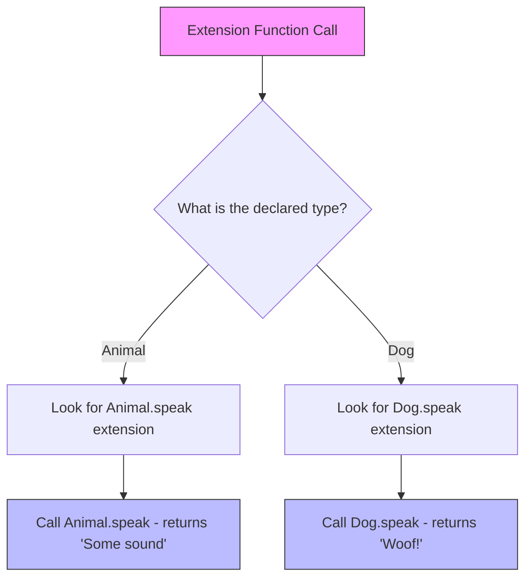

# How to Implement Extension Functions in Kotlin

Author: [nawazdhandala](https://www.github.com/nawazdhandala)

Tags: Kotlin, Extension Functions, Functional Programming, Code Reuse

Description: Learn how to use Kotlin extension functions to add new functionality to existing classes without inheritance or modifying source code.

---

Kotlin extension functions let you add new methods to existing classes without touching their source code or using inheritance. You can extend classes from third-party libraries, the standard library, or even final classes. This makes your code more readable and your APIs more intuitive.

## What Are Extension Functions?

An extension function is a function that adds behavior to an existing class. You define it outside the class, but call it as if it were a member function.

The syntax uses the class name as a prefix to the function name, separated by a dot. Inside the function, `this` refers to the receiver object (the instance the function is called on).

```kotlin
// Define an extension function on the String class
// 'String.' is the receiver type - we're extending String
// 'this' inside the function refers to the String instance
fun String.addExclamation(): String {
    return this + "!"
}

// Now you can call it on any String as if it were a built-in method
fun main() {
    val greeting = "Hello"
    println(greeting.addExclamation())  // Output: Hello!

    // Works on string literals too
    println("World".addExclamation())   // Output: World!
}
```

## Basic Extension Function Patterns

### Adding Utility Methods

Extension functions shine when you need utility methods that work on existing types. Instead of creating static utility classes like in Java, you add methods directly to the types they operate on.

```kotlin
// Add a method to check if an Int is even
// Much more readable than Utils.isEven(number)
fun Int.isEven(): Boolean {
    return this % 2 == 0
}

// Add a method to repeat a string n times with a separator
// Parameters work just like regular functions
fun String.repeatWithSeparator(times: Int, separator: String = ", "): String {
    return (1..times).map { this }.joinToString(separator)
}

fun main() {
    println(4.isEven())                                  // true
    println(7.isEven())                                  // false
    println("Kotlin".repeatWithSeparator(3))             // Kotlin, Kotlin, Kotlin
    println("Hi".repeatWithSeparator(2, " - "))          // Hi - Hi
}
```

### Working with Nullable Receivers

Extension functions can have nullable receiver types. This is useful for adding safe operations to potentially null values without requiring null checks at every call site.

```kotlin
// Extension on nullable String - handles null internally
// The '?' in 'String?' means this function can be called on null values
fun String?.orEmpty(): String {
    return this ?: ""
}

// Safe length that returns 0 for null instead of throwing
fun String?.safeLength(): Int {
    return this?.length ?: 0
}

// Check if a nullable string is null or blank
fun String?.isNullOrBlank(): Boolean {
    // Contract: if this function returns false, 'this' is not null
    return this == null || this.isBlank()
}

fun main() {
    val name: String? = null
    val greeting: String? = "Hello"

    println(name.orEmpty())        // "" (empty string, not null)
    println(greeting.orEmpty())    // Hello

    println(name.safeLength())     // 0
    println(greeting.safeLength()) // 5

    // No NPE risk - the extension handles null
    if (!name.isNullOrBlank()) {
        println(name.uppercase())  // Smart cast: name is String here
    }
}
```

## Extension Functions on Collections

Collections are a common target for extension functions. The Kotlin standard library already includes many useful extensions, but you can add your own for domain-specific operations.

```kotlin
// Get the second element safely, or null if the list is too short
// 'List<T>' is a generic receiver type
fun <T> List<T>.secondOrNull(): T? {
    return if (this.size >= 2) this[1] else null
}

// Swap two elements in a mutable list, returning the list for chaining
// 'MutableList<T>' because we need to modify the list
fun <T> MutableList<T>.swap(index1: Int, index2: Int): MutableList<T> {
    // Bounds checking to avoid IndexOutOfBoundsException
    require(index1 in indices && index2 in indices) {
        "Indices must be within list bounds"
    }
    val temp = this[index1]
    this[index1] = this[index2]
    this[index2] = temp
    return this  // Return for method chaining
}

// Find the most frequent element in a collection
fun <T> Collection<T>.mostFrequent(): T? {
    return this.groupingBy { it }
        .eachCount()
        .maxByOrNull { it.value }
        ?.key
}

fun main() {
    val numbers = listOf(1, 2, 3, 4)
    println(numbers.secondOrNull())                    // 2
    println(emptyList<Int>().secondOrNull())          // null

    val mutableList = mutableListOf("a", "b", "c")
    mutableList.swap(0, 2)
    println(mutableList)                               // [c, b, a]

    val votes = listOf("yes", "no", "yes", "yes", "no")
    println(votes.mostFrequent())                      // yes
}
```

## Extension Properties

Besides functions, you can also define extension properties. These must be computed properties since you cannot add actual fields to existing classes.

```kotlin
// Extension property to get the last character of a String
// Uses 'get()' because extension properties cannot have backing fields
val String.lastChar: Char
    get() = this[length - 1]

// Extension property with both getter and setter on StringBuilder
// StringBuilder is mutable, so a setter makes sense here
var StringBuilder.lastChar: Char
    get() = this[length - 1]
    set(value) {
        this.setCharAt(length - 1, value)
    }

// Extension property for checking if a list has duplicates
val <T> List<T>.hasDuplicates: Boolean
    get() = this.size != this.toSet().size

fun main() {
    println("Kotlin".lastChar)                // n

    val sb = StringBuilder("Hello!")
    sb.lastChar = '?'                         // Uses the setter
    println(sb)                               // Hello?

    println(listOf(1, 2, 3).hasDuplicates)    // false
    println(listOf(1, 2, 2).hasDuplicates)    // true
}
```

## Extension Functions vs Member Functions

When a class already has a member function with the same signature, the member function always wins. Extensions cannot override existing behavior.

```kotlin
class Example {
    // Member function
    fun greet() = "Member says hello"
}

// Extension function with the same name
fun Example.greet() = "Extension says hello"

// Extension function with a different signature - this works
fun Example.greet(name: String) = "Extension says hello to $name"

fun main() {
    val example = Example()
    println(example.greet())           // Member says hello (member wins)
    println(example.greet("World"))    // Extension says hello to World
}
```

## Extension Functions and Inheritance

Extension functions are resolved statically based on the declared type, not the runtime type. This differs from regular member function dispatch.

```kotlin
open class Animal
class Dog : Animal()

// Extension on the base class
fun Animal.speak() = "Some sound"

// Extension on the derived class
fun Dog.speak() = "Woof!"

fun main() {
    val animal: Animal = Animal()
    val dog: Dog = Dog()
    val dogAsAnimal: Animal = Dog()  // Declared as Animal, actual type is Dog

    println(animal.speak())           // Some sound
    println(dog.speak())              // Woof!
    println(dogAsAnimal.speak())      // Some sound (uses declared type Animal)
}
```

The diagram below shows how extension function resolution works:



## Practical Examples

### Building a DSL with Extensions

Extension functions are powerful for creating domain-specific languages. Here we build a simple HTML builder:

```kotlin
// StringBuilder extension for building HTML elements
// 'block' is a lambda with StringBuilder as receiver
fun StringBuilder.tag(
    name: String,
    block: StringBuilder.() -> Unit
): StringBuilder {
    append("<$name>")
    this.block()           // Execute the lambda with 'this' as receiver
    append("</$name>")
    return this
}

// Convenience extensions for common tags
fun StringBuilder.html(block: StringBuilder.() -> Unit) = tag("html", block)
fun StringBuilder.body(block: StringBuilder.() -> Unit) = tag("body", block)
fun StringBuilder.p(block: StringBuilder.() -> Unit) = tag("p", block)
fun StringBuilder.h1(block: StringBuilder.() -> Unit) = tag("h1", block)

// Extension to add text content
fun StringBuilder.text(content: String): StringBuilder {
    append(content)
    return this
}

fun main() {
    // Build HTML using the DSL
    val html = StringBuilder().html {
        body {
            h1 { text("Welcome") }
            p { text("This is a paragraph.") }
        }
    }

    println(html)
    // Output: <html><body><h1>Welcome</h1><p>This is a paragraph.</p></body></html>
}
```

### Extending Third-Party Classes

Extension functions let you add missing functionality to library classes without creating wrappers:

```kotlin
import java.time.LocalDate
import java.time.LocalDateTime
import java.time.format.DateTimeFormatter
import java.time.temporal.ChronoUnit

// Add a readable date format to LocalDate
fun LocalDate.toReadableString(): String {
    return this.format(DateTimeFormatter.ofPattern("MMMM d, yyyy"))
}

// Check if a date is a weekend
fun LocalDate.isWeekend(): Boolean {
    return this.dayOfWeek.value in listOf(6, 7)  // Saturday = 6, Sunday = 7
}

// Calculate days until another date
fun LocalDate.daysUntil(other: LocalDate): Long {
    return ChronoUnit.DAYS.between(this, other)
}

// Add an extension to LocalDateTime for ISO formatting
fun LocalDateTime.toIsoString(): String {
    return this.format(DateTimeFormatter.ISO_LOCAL_DATE_TIME)
}

fun main() {
    val today = LocalDate.now()
    val nextWeek = today.plusDays(7)

    println(today.toReadableString())          // February 2, 2026
    println("Is weekend: ${today.isWeekend()}") // Is weekend: false (if weekday)
    println("Days until next week: ${today.daysUntil(nextWeek)}") // 7

    val now = LocalDateTime.now()
    println(now.toIsoString())                 // 2026-02-02T14:30:00
}
```

### Validation Extensions

Extension functions can create fluent validation APIs:

```kotlin
// Result type to hold validation state
data class ValidationResult(
    val isValid: Boolean,
    val errors: List<String> = emptyList()
)

// String validation extensions that return validation results
fun String.validateNotBlank(fieldName: String): ValidationResult {
    return if (this.isNotBlank()) {
        ValidationResult(true)
    } else {
        ValidationResult(false, listOf("$fieldName cannot be blank"))
    }
}

fun String.validateEmail(): ValidationResult {
    val emailRegex = "^[A-Za-z0-9+_.-]+@[A-Za-z0-9.-]+$".toRegex()
    return if (this.matches(emailRegex)) {
        ValidationResult(true)
    } else {
        ValidationResult(false, listOf("Invalid email format"))
    }
}

fun String.validateMinLength(min: Int, fieldName: String): ValidationResult {
    return if (this.length >= min) {
        ValidationResult(true)
    } else {
        ValidationResult(false, listOf("$fieldName must be at least $min characters"))
    }
}

// Combine multiple validation results
fun List<ValidationResult>.combine(): ValidationResult {
    val allErrors = this.flatMap { it.errors }
    return ValidationResult(
        isValid = allErrors.isEmpty(),
        errors = allErrors
    )
}

fun main() {
    val email = "user@example.com"
    val password = "abc"

    val validations = listOf(
        email.validateNotBlank("Email"),
        email.validateEmail(),
        password.validateMinLength(8, "Password")
    )

    val result = validations.combine()

    if (!result.isValid) {
        println("Validation failed:")
        result.errors.forEach { println("  - $it") }
    }
    // Output:
    // Validation failed:
    //   - Password must be at least 8 characters
}
```

## Best Practices

| Practice | Description |
|----------|-------------|
| **Don't overuse** | Only create extensions when they improve readability |
| **Keep them focused** | Each extension should do one thing well |
| **Prefer standard library** | Check if Kotlin already provides what you need |
| **Use meaningful names** | Extension names should clearly describe their purpose |
| **Consider scope** | Put extensions in appropriate packages to control visibility |
| **Document nullable receivers** | Make it clear when an extension handles null |

## When to Use Extension Functions

Extension functions work best when:

- Adding utility methods to types you don't control
- Creating domain-specific languages (DSLs)
- Making existing APIs more Kotlin-idiomatic
- Adding convenience methods for common operations
- Keeping related functionality together without creating utility classes

Avoid them when:

- The functionality should be part of the class itself
- You need to access private members
- The extension would be confusing or unexpected
- A regular function would be clearer

## Summary

| Concept | Key Point |
|---------|-----------|
| **Syntax** | `fun ReceiverType.functionName(): ReturnType` |
| **Receiver** | `this` refers to the instance the function is called on |
| **Resolution** | Static, based on declared type, not runtime type |
| **Member priority** | Member functions always win over extensions |
| **Nullable receivers** | Use `ReceiverType?` to handle null values |
| **Properties** | Must be computed, cannot have backing fields |

Extension functions make Kotlin code more expressive and readable. They let you write `string.isEmail()` instead of `EmailUtils.isValid(string)`, keeping your code focused on what it does rather than where utilities are located.

---

*Want to monitor your Kotlin applications in production? OneUptime provides comprehensive observability with distributed tracing, metrics, and logs. Track performance issues, set up alerts, and debug problems faster. Get started at [oneuptime.com](https://oneuptime.com).*
