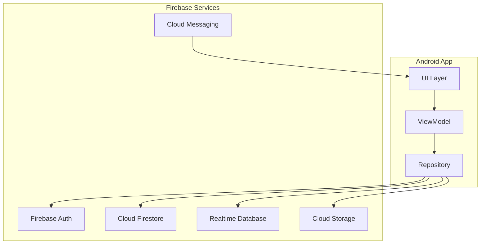
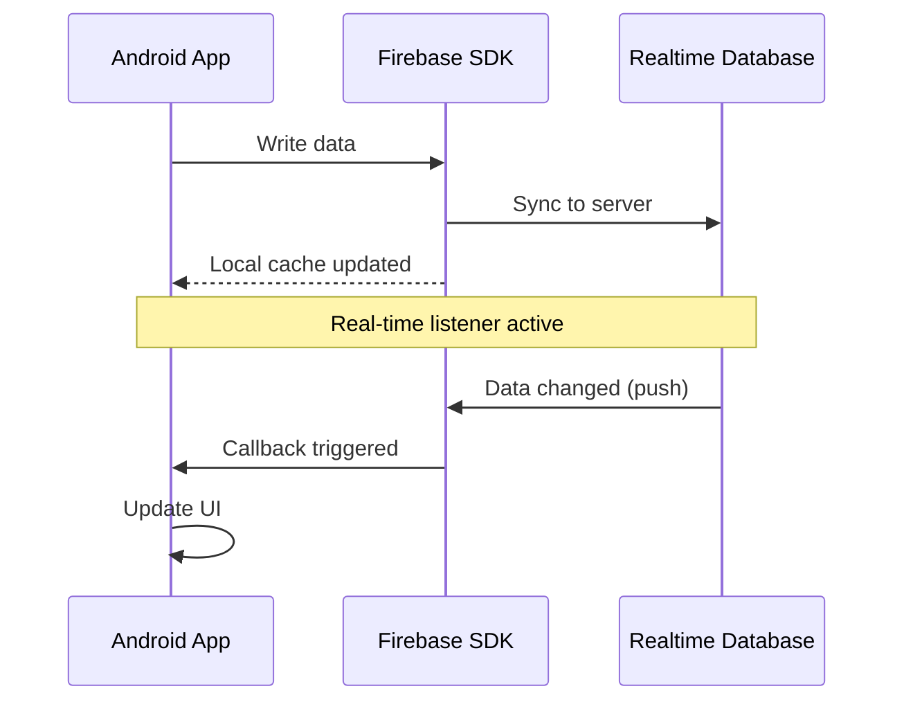
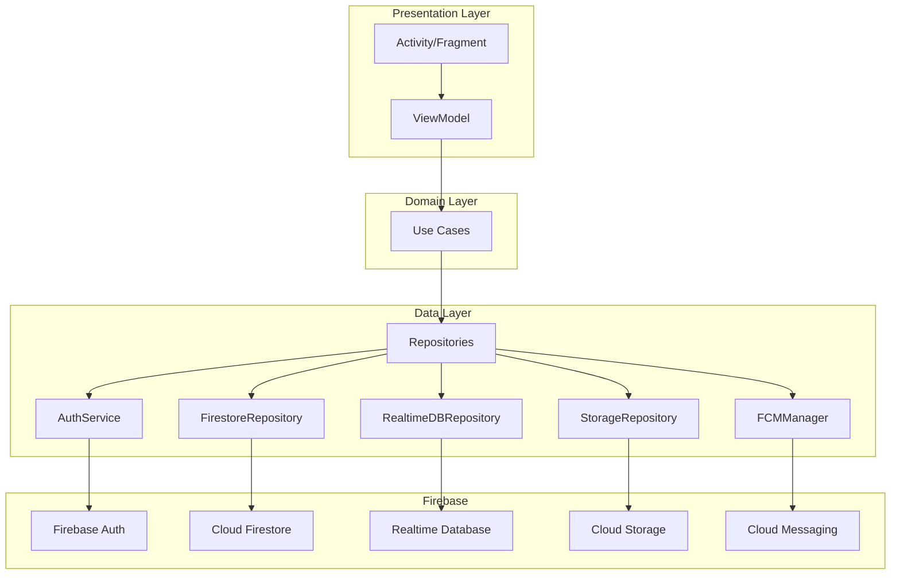

# How to Use Firebase with Kotlin

Author: [nawazdhandala](https://www.github.com/nawazdhandala)

Tags: Kotlin, Firebase, Android, Backend

Description: A comprehensive guide to integrating Firebase with Kotlin for Android development, covering Authentication, Firestore, Realtime Database, Cloud Storage, and Cloud Messaging with practical examples and best practices.

---

> Firebase provides a comprehensive suite of backend services that integrate seamlessly with Kotlin for Android development. From authentication to real-time databases, Firebase eliminates the need to build and maintain your own backend infrastructure. This guide walks you through implementing Firebase services in your Kotlin Android applications.

Firebase is Google's mobile development platform that provides tools and infrastructure to build, improve, and grow your apps. When combined with Kotlin's concise syntax and null safety features, you get a powerful combination for building modern Android applications.

---

## Why Use Firebase with Kotlin?

| Feature | Benefit |
|---------|---------|
| **Real-time Sync** | Automatic data synchronization across devices |
| **Offline Support** | Built-in offline persistence for Firestore and Realtime Database |
| **Scalability** | Scales automatically with your user base |
| **Kotlin Extensions** | Official KTX libraries for idiomatic Kotlin code |
| **Coroutines Support** | Native support for Kotlin coroutines |

---

## Firebase Architecture Overview

Understanding how Firebase services interact with your Android app helps you design better architectures.



---

## Project Setup

Before diving into implementation, let's set up a new Android project with Firebase.

### Step 1: Create Firebase Project

1. Go to the [Firebase Console](https://console.firebase.google.com/)
2. Click "Add project" and follow the setup wizard
3. Add your Android app using your package name
4. Download the `google-services.json` file
5. Place it in your app's `app/` directory

### Step 2: Configure Gradle Files

Add the Firebase dependencies to your project. Start with the project-level build.gradle.

```kotlin
// build.gradle.kts (Project level)
plugins {
    id("com.android.application") version "8.2.0" apply false
    id("org.jetbrains.kotlin.android") version "1.9.20" apply false
    // Add the Google services Gradle plugin
    id("com.google.gms.google-services") version "4.4.0" apply false
}
```

Next, configure the app-level build.gradle with Firebase dependencies.

```kotlin
// build.gradle.kts (App level)
plugins {
    id("com.android.application")
    id("org.jetbrains.kotlin.android")
    id("com.google.gms.google-services")
}

android {
    namespace = "com.example.firebaseapp"
    compileSdk = 34

    defaultConfig {
        applicationId = "com.example.firebaseapp"
        minSdk = 24
        targetSdk = 34
        versionCode = 1
        versionName = "1.0"
    }

    // Enable view binding for cleaner UI code
    buildFeatures {
        viewBinding = true
    }

    compileOptions {
        sourceCompatibility = JavaVersion.VERSION_17
        targetCompatibility = JavaVersion.VERSION_17
    }

    kotlinOptions {
        jvmTarget = "17"
    }
}

dependencies {
    // Firebase BoM manages all Firebase library versions
    implementation(platform("com.google.firebase:firebase-bom:32.7.0"))

    // Firebase services with KTX extensions for Kotlin
    implementation("com.google.firebase:firebase-auth-ktx")
    implementation("com.google.firebase:firebase-firestore-ktx")
    implementation("com.google.firebase:firebase-database-ktx")
    implementation("com.google.firebase:firebase-storage-ktx")
    implementation("com.google.firebase:firebase-messaging-ktx")
    implementation("com.google.firebase:firebase-analytics-ktx")

    // Kotlin Coroutines for async operations
    implementation("org.jetbrains.kotlinx:kotlinx-coroutines-android:1.7.3")
    implementation("org.jetbrains.kotlinx:kotlinx-coroutines-play-services:1.7.3")

    // AndroidX Lifecycle for ViewModel
    implementation("androidx.lifecycle:lifecycle-viewmodel-ktx:2.7.0")
    implementation("androidx.lifecycle:lifecycle-runtime-ktx:2.7.0")

    // AndroidX Core
    implementation("androidx.core:core-ktx:1.12.0")
    implementation("androidx.appcompat:appcompat:1.6.1")
    implementation("com.google.android.material:material:1.11.0")
}
```

---

## Firebase Authentication

Firebase Authentication provides backend services for easy user authentication. Let's implement email/password and Google Sign-In.

### Authentication Service Class

Create a reusable authentication service that handles all auth operations with proper error handling.

```kotlin
// AuthService.kt
package com.example.firebaseapp.auth

import com.google.firebase.auth.FirebaseAuth
import com.google.firebase.auth.FirebaseUser
import com.google.firebase.auth.GoogleAuthProvider
import kotlinx.coroutines.channels.awaitClose
import kotlinx.coroutines.flow.Flow
import kotlinx.coroutines.flow.callbackFlow
import kotlinx.coroutines.tasks.await

// Sealed class to represent different authentication states
sealed class AuthResult<out T> {
    data class Success<T>(val data: T) : AuthResult<T>()
    data class Error(val message: String) : AuthResult<Nothing>()
    data object Loading : AuthResult<Nothing>()
}

class AuthService {
    // Get Firebase Auth instance
    private val auth: FirebaseAuth = FirebaseAuth.getInstance()

    // Get current user if logged in
    val currentUser: FirebaseUser?
        get() = auth.currentUser

    // Check if user is authenticated
    val isAuthenticated: Boolean
        get() = currentUser != null

    // Observe authentication state changes as a Flow
    // This allows reactive UI updates when auth state changes
    fun authStateFlow(): Flow<FirebaseUser?> = callbackFlow {
        val listener = FirebaseAuth.AuthStateListener { firebaseAuth ->
            trySend(firebaseAuth.currentUser)
        }
        auth.addAuthStateListener(listener)

        // Clean up listener when Flow is cancelled
        awaitClose {
            auth.removeAuthStateListener(listener)
        }
    }

    // Register a new user with email and password
    // Uses Kotlin coroutines for async operation
    suspend fun signUpWithEmail(
        email: String,
        password: String
    ): AuthResult<FirebaseUser> {
        return try {
            val result = auth.createUserWithEmailAndPassword(email, password).await()
            result.user?.let {
                AuthResult.Success(it)
            } ?: AuthResult.Error("User creation failed")
        } catch (e: Exception) {
            AuthResult.Error(e.message ?: "Unknown error occurred")
        }
    }

    // Sign in existing user with email and password
    suspend fun signInWithEmail(
        email: String,
        password: String
    ): AuthResult<FirebaseUser> {
        return try {
            val result = auth.signInWithEmailAndPassword(email, password).await()
            result.user?.let {
                AuthResult.Success(it)
            } ?: AuthResult.Error("Sign in failed")
        } catch (e: Exception) {
            AuthResult.Error(e.message ?: "Unknown error occurred")
        }
    }

    // Sign in with Google using ID token from Google Sign-In
    suspend fun signInWithGoogle(idToken: String): AuthResult<FirebaseUser> {
        return try {
            val credential = GoogleAuthProvider.getCredential(idToken, null)
            val result = auth.signInWithCredential(credential).await()
            result.user?.let {
                AuthResult.Success(it)
            } ?: AuthResult.Error("Google sign in failed")
        } catch (e: Exception) {
            AuthResult.Error(e.message ?: "Unknown error occurred")
        }
    }

    // Send password reset email to user
    suspend fun sendPasswordResetEmail(email: String): AuthResult<Unit> {
        return try {
            auth.sendPasswordResetEmail(email).await()
            AuthResult.Success(Unit)
        } catch (e: Exception) {
            AuthResult.Error(e.message ?: "Failed to send reset email")
        }
    }

    // Sign out current user
    fun signOut() {
        auth.signOut()
    }

    // Delete current user account
    suspend fun deleteAccount(): AuthResult<Unit> {
        return try {
            currentUser?.delete()?.await()
            AuthResult.Success(Unit)
        } catch (e: Exception) {
            AuthResult.Error(e.message ?: "Failed to delete account")
        }
    }
}
```

### Authentication ViewModel

Implement a ViewModel that manages authentication state and handles user interactions.

```kotlin
// AuthViewModel.kt
package com.example.firebaseapp.auth

import androidx.lifecycle.ViewModel
import androidx.lifecycle.viewModelScope
import com.google.firebase.auth.FirebaseUser
import kotlinx.coroutines.flow.MutableStateFlow
import kotlinx.coroutines.flow.StateFlow
import kotlinx.coroutines.flow.asStateFlow
import kotlinx.coroutines.launch

// UI state for authentication screens
data class AuthUiState(
    val isLoading: Boolean = false,
    val user: FirebaseUser? = null,
    val errorMessage: String? = null,
    val isAuthenticated: Boolean = false
)

class AuthViewModel : ViewModel() {
    private val authService = AuthService()

    // Mutable state flow for internal updates
    private val _uiState = MutableStateFlow(AuthUiState())

    // Expose immutable state flow to UI
    val uiState: StateFlow<AuthUiState> = _uiState.asStateFlow()

    init {
        // Observe auth state changes and update UI accordingly
        viewModelScope.launch {
            authService.authStateFlow().collect { user ->
                _uiState.value = _uiState.value.copy(
                    user = user,
                    isAuthenticated = user != null
                )
            }
        }
    }

    // Handle sign up button click
    fun signUp(email: String, password: String) {
        viewModelScope.launch {
            _uiState.value = _uiState.value.copy(isLoading = true, errorMessage = null)

            when (val result = authService.signUpWithEmail(email, password)) {
                is AuthResult.Success -> {
                    _uiState.value = _uiState.value.copy(
                        isLoading = false,
                        user = result.data
                    )
                }
                is AuthResult.Error -> {
                    _uiState.value = _uiState.value.copy(
                        isLoading = false,
                        errorMessage = result.message
                    )
                }
                is AuthResult.Loading -> {
                    // Already handled above
                }
            }
        }
    }

    // Handle sign in button click
    fun signIn(email: String, password: String) {
        viewModelScope.launch {
            _uiState.value = _uiState.value.copy(isLoading = true, errorMessage = null)

            when (val result = authService.signInWithEmail(email, password)) {
                is AuthResult.Success -> {
                    _uiState.value = _uiState.value.copy(
                        isLoading = false,
                        user = result.data
                    )
                }
                is AuthResult.Error -> {
                    _uiState.value = _uiState.value.copy(
                        isLoading = false,
                        errorMessage = result.message
                    )
                }
                is AuthResult.Loading -> {
                    // Already handled above
                }
            }
        }
    }

    // Handle Google Sign-In result
    fun handleGoogleSignIn(idToken: String) {
        viewModelScope.launch {
            _uiState.value = _uiState.value.copy(isLoading = true, errorMessage = null)

            when (val result = authService.signInWithGoogle(idToken)) {
                is AuthResult.Success -> {
                    _uiState.value = _uiState.value.copy(
                        isLoading = false,
                        user = result.data
                    )
                }
                is AuthResult.Error -> {
                    _uiState.value = _uiState.value.copy(
                        isLoading = false,
                        errorMessage = result.message
                    )
                }
                is AuthResult.Loading -> {
                    // Already handled above
                }
            }
        }
    }

    // Handle sign out
    fun signOut() {
        authService.signOut()
    }

    // Clear error message after user acknowledges it
    fun clearError() {
        _uiState.value = _uiState.value.copy(errorMessage = null)
    }
}
```

---

## Cloud Firestore

Cloud Firestore is a flexible, scalable NoSQL cloud database. It provides real-time synchronization and offline support.

### Data Model

Define your data models as Kotlin data classes with proper annotations for Firestore serialization.

```kotlin
// models/User.kt
package com.example.firebaseapp.models

import com.google.firebase.Timestamp
import com.google.firebase.firestore.DocumentId
import com.google.firebase.firestore.ServerTimestamp

// Data class representing a user document in Firestore
// @DocumentId automatically maps the document ID
data class User(
    @DocumentId
    val id: String = "",
    val email: String = "",
    val displayName: String = "",
    val photoUrl: String? = null,
    val bio: String = "",
    @ServerTimestamp
    val createdAt: Timestamp? = null,
    @ServerTimestamp
    val updatedAt: Timestamp? = null
)

// Data class for a task document
data class Task(
    @DocumentId
    val id: String = "",
    val userId: String = "",
    val title: String = "",
    val description: String = "",
    val isCompleted: Boolean = false,
    val priority: Int = 0,
    val dueDate: Timestamp? = null,
    @ServerTimestamp
    val createdAt: Timestamp? = null
)
```

### Firestore Repository

Create a repository class that handles all Firestore operations with proper error handling and real-time updates.

```kotlin
// repository/FirestoreRepository.kt
package com.example.firebaseapp.repository

import com.example.firebaseapp.models.Task
import com.example.firebaseapp.models.User
import com.google.firebase.firestore.FirebaseFirestore
import com.google.firebase.firestore.Query
import com.google.firebase.firestore.SetOptions
import com.google.firebase.firestore.snapshots
import kotlinx.coroutines.flow.Flow
import kotlinx.coroutines.flow.map
import kotlinx.coroutines.tasks.await

// Sealed class for repository operation results
sealed class FirestoreResult<out T> {
    data class Success<T>(val data: T) : FirestoreResult<T>()
    data class Error(val message: String) : FirestoreResult<Nothing>()
}

class FirestoreRepository {
    // Get Firestore instance
    private val db = FirebaseFirestore.getInstance()

    // Collection references
    private val usersCollection = db.collection("users")
    private val tasksCollection = db.collection("tasks")

    // Create or update user profile in Firestore
    // Uses merge option to update only specified fields
    suspend fun saveUserProfile(user: User): FirestoreResult<Unit> {
        return try {
            usersCollection.document(user.id)
                .set(user, SetOptions.merge())
                .await()
            FirestoreResult.Success(Unit)
        } catch (e: Exception) {
            FirestoreResult.Error(e.message ?: "Failed to save user profile")
        }
    }

    // Get user profile by ID
    suspend fun getUserProfile(userId: String): FirestoreResult<User?> {
        return try {
            val snapshot = usersCollection.document(userId).get().await()
            val user = snapshot.toObject(User::class.java)
            FirestoreResult.Success(user)
        } catch (e: Exception) {
            FirestoreResult.Error(e.message ?: "Failed to get user profile")
        }
    }

    // Observe user profile changes in real-time
    // Returns a Flow that emits updates whenever the document changes
    fun observeUserProfile(userId: String): Flow<User?> {
        return usersCollection.document(userId)
            .snapshots()
            .map { snapshot ->
                snapshot.toObject(User::class.java)
            }
    }

    // Create a new task
    suspend fun createTask(task: Task): FirestoreResult<String> {
        return try {
            val docRef = tasksCollection.add(task).await()
            FirestoreResult.Success(docRef.id)
        } catch (e: Exception) {
            FirestoreResult.Error(e.message ?: "Failed to create task")
        }
    }

    // Update existing task
    suspend fun updateTask(task: Task): FirestoreResult<Unit> {
        return try {
            tasksCollection.document(task.id)
                .set(task, SetOptions.merge())
                .await()
            FirestoreResult.Success(Unit)
        } catch (e: Exception) {
            FirestoreResult.Error(e.message ?: "Failed to update task")
        }
    }

    // Delete a task
    suspend fun deleteTask(taskId: String): FirestoreResult<Unit> {
        return try {
            tasksCollection.document(taskId).delete().await()
            FirestoreResult.Success(Unit)
        } catch (e: Exception) {
            FirestoreResult.Error(e.message ?: "Failed to delete task")
        }
    }

    // Get all tasks for a user with real-time updates
    // Ordered by creation date, newest first
    fun observeUserTasks(userId: String): Flow<List<Task>> {
        return tasksCollection
            .whereEqualTo("userId", userId)
            .orderBy("createdAt", Query.Direction.DESCENDING)
            .snapshots()
            .map { snapshot ->
                snapshot.documents.mapNotNull { doc ->
                    doc.toObject(Task::class.java)
                }
            }
    }

    // Get incomplete tasks with priority filtering
    fun observeIncompleteTasks(
        userId: String,
        minPriority: Int = 0
    ): Flow<List<Task>> {
        return tasksCollection
            .whereEqualTo("userId", userId)
            .whereEqualTo("isCompleted", false)
            .whereGreaterThanOrEqualTo("priority", minPriority)
            .orderBy("priority", Query.Direction.DESCENDING)
            .orderBy("createdAt", Query.Direction.DESCENDING)
            .snapshots()
            .map { snapshot ->
                snapshot.documents.mapNotNull { doc ->
                    doc.toObject(Task::class.java)
                }
            }
    }

    // Batch operation to mark multiple tasks as completed
    suspend fun completeMultipleTasks(taskIds: List<String>): FirestoreResult<Unit> {
        return try {
            db.runBatch { batch ->
                taskIds.forEach { taskId ->
                    val docRef = tasksCollection.document(taskId)
                    batch.update(docRef, "isCompleted", true)
                }
            }.await()
            FirestoreResult.Success(Unit)
        } catch (e: Exception) {
            FirestoreResult.Error(e.message ?: "Failed to complete tasks")
        }
    }

    // Transaction to safely transfer task ownership
    suspend fun transferTask(
        taskId: String,
        newUserId: String
    ): FirestoreResult<Unit> {
        return try {
            db.runTransaction { transaction ->
                val docRef = tasksCollection.document(taskId)
                val snapshot = transaction.get(docRef)

                // Verify task exists
                if (!snapshot.exists()) {
                    throw Exception("Task not found")
                }

                // Update the userId
                transaction.update(docRef, "userId", newUserId)
            }.await()
            FirestoreResult.Success(Unit)
        } catch (e: Exception) {
            FirestoreResult.Error(e.message ?: "Failed to transfer task")
        }
    }
}
```

---

## Realtime Database

Firebase Realtime Database is optimized for low-latency, real-time data synchronization. It's ideal for presence systems and live updates.

### Realtime Database Data Flow



### Presence System Implementation

Implement a user presence system to track online/offline status in real-time.

```kotlin
// presence/PresenceManager.kt
package com.example.firebaseapp.presence

import com.google.firebase.auth.FirebaseAuth
import com.google.firebase.database.DataSnapshot
import com.google.firebase.database.DatabaseError
import com.google.firebase.database.FirebaseDatabase
import com.google.firebase.database.ServerValue
import com.google.firebase.database.ValueEventListener
import kotlinx.coroutines.channels.awaitClose
import kotlinx.coroutines.flow.Flow
import kotlinx.coroutines.flow.callbackFlow

// Data class representing user presence status
data class UserPresence(
    val isOnline: Boolean = false,
    val lastSeen: Long = 0
)

class PresenceManager {
    // Get Realtime Database instance
    private val database = FirebaseDatabase.getInstance()
    private val auth = FirebaseAuth.getInstance()

    // Reference to presence node
    private val presenceRef = database.getReference("presence")

    // Reference to connection state
    private val connectedRef = database.getReference(".info/connected")

    // Set up presence tracking for current user
    // This uses onDisconnect to automatically update status when user disconnects
    fun setupPresence() {
        val userId = auth.currentUser?.uid ?: return
        val userPresenceRef = presenceRef.child(userId)

        // Listen for connection state changes
        connectedRef.addValueEventListener(object : ValueEventListener {
            override fun onDataChange(snapshot: DataSnapshot) {
                val connected = snapshot.getValue(Boolean::class.java) ?: false

                if (connected) {
                    // Set up onDisconnect handler first
                    // This ensures offline status is set even if app crashes
                    userPresenceRef.child("isOnline")
                        .onDisconnect()
                        .setValue(false)

                    userPresenceRef.child("lastSeen")
                        .onDisconnect()
                        .setValue(ServerValue.TIMESTAMP)

                    // Now set online status
                    userPresenceRef.child("isOnline").setValue(true)
                    userPresenceRef.child("lastSeen").setValue(ServerValue.TIMESTAMP)
                }
            }

            override fun onCancelled(error: DatabaseError) {
                // Handle error - log or report
            }
        })
    }

    // Go offline manually (e.g., when app goes to background)
    fun goOffline() {
        val userId = auth.currentUser?.uid ?: return
        val userPresenceRef = presenceRef.child(userId)

        userPresenceRef.child("isOnline").setValue(false)
        userPresenceRef.child("lastSeen").setValue(ServerValue.TIMESTAMP)
    }

    // Observe a specific user's presence as a Flow
    fun observeUserPresence(userId: String): Flow<UserPresence> = callbackFlow {
        val userRef = presenceRef.child(userId)

        val listener = object : ValueEventListener {
            override fun onDataChange(snapshot: DataSnapshot) {
                val isOnline = snapshot.child("isOnline")
                    .getValue(Boolean::class.java) ?: false
                val lastSeen = snapshot.child("lastSeen")
                    .getValue(Long::class.java) ?: 0L

                trySend(UserPresence(isOnline, lastSeen))
            }

            override fun onCancelled(error: DatabaseError) {
                close(error.toException())
            }
        }

        userRef.addValueEventListener(listener)

        // Remove listener when Flow is cancelled
        awaitClose {
            userRef.removeEventListener(listener)
        }
    }

    // Observe all online users
    fun observeOnlineUsers(): Flow<List<String>> = callbackFlow {
        val listener = object : ValueEventListener {
            override fun onDataChange(snapshot: DataSnapshot) {
                val onlineUsers = mutableListOf<String>()

                snapshot.children.forEach { child ->
                    val isOnline = child.child("isOnline")
                        .getValue(Boolean::class.java) ?: false
                    if (isOnline) {
                        child.key?.let { onlineUsers.add(it) }
                    }
                }

                trySend(onlineUsers)
            }

            override fun onCancelled(error: DatabaseError) {
                close(error.toException())
            }
        }

        presenceRef.addValueEventListener(listener)

        awaitClose {
            presenceRef.removeEventListener(listener)
        }
    }
}
```

### Chat Implementation with Realtime Database

Build a simple real-time chat feature using Firebase Realtime Database.

```kotlin
// chat/ChatRepository.kt
package com.example.firebaseapp.chat

import com.google.firebase.auth.FirebaseAuth
import com.google.firebase.database.DataSnapshot
import com.google.firebase.database.DatabaseError
import com.google.firebase.database.FirebaseDatabase
import com.google.firebase.database.ServerValue
import com.google.firebase.database.ValueEventListener
import kotlinx.coroutines.channels.awaitClose
import kotlinx.coroutines.flow.Flow
import kotlinx.coroutines.flow.callbackFlow
import kotlinx.coroutines.tasks.await

// Data class representing a chat message
data class ChatMessage(
    val id: String = "",
    val senderId: String = "",
    val senderName: String = "",
    val text: String = "",
    val timestamp: Long = 0,
    val isRead: Boolean = false
)

class ChatRepository {
    private val database = FirebaseDatabase.getInstance()
    private val auth = FirebaseAuth.getInstance()
    private val chatsRef = database.getReference("chats")

    // Generate a unique chat room ID for two users
    // Ensures consistent ID regardless of who initiates
    private fun getChatRoomId(userId1: String, userId2: String): String {
        return if (userId1 < userId2) {
            "${userId1}_${userId2}"
        } else {
            "${userId2}_${userId1}"
        }
    }

    // Send a message to a chat room
    suspend fun sendMessage(
        receiverId: String,
        text: String
    ): Result<String> {
        return try {
            val currentUser = auth.currentUser
                ?: return Result.failure(Exception("Not authenticated"))

            val chatRoomId = getChatRoomId(currentUser.uid, receiverId)
            val messageRef = chatsRef.child(chatRoomId).child("messages").push()

            val message = mapOf(
                "id" to messageRef.key,
                "senderId" to currentUser.uid,
                "senderName" to (currentUser.displayName ?: "Unknown"),
                "text" to text,
                "timestamp" to ServerValue.TIMESTAMP,
                "isRead" to false
            )

            messageRef.setValue(message).await()
            Result.success(messageRef.key ?: "")
        } catch (e: Exception) {
            Result.failure(e)
        }
    }

    // Observe messages in a chat room as a Flow
    // Messages are ordered by timestamp
    fun observeMessages(otherUserId: String): Flow<List<ChatMessage>> = callbackFlow {
        val currentUserId = auth.currentUser?.uid
            ?: throw Exception("Not authenticated")

        val chatRoomId = getChatRoomId(currentUserId, otherUserId)
        val messagesRef = chatsRef.child(chatRoomId).child("messages")
            .orderByChild("timestamp")

        val listener = object : ValueEventListener {
            override fun onDataChange(snapshot: DataSnapshot) {
                val messages = mutableListOf<ChatMessage>()

                snapshot.children.forEach { child ->
                    val message = ChatMessage(
                        id = child.child("id").getValue(String::class.java) ?: "",
                        senderId = child.child("senderId").getValue(String::class.java) ?: "",
                        senderName = child.child("senderName").getValue(String::class.java) ?: "",
                        text = child.child("text").getValue(String::class.java) ?: "",
                        timestamp = child.child("timestamp").getValue(Long::class.java) ?: 0L,
                        isRead = child.child("isRead").getValue(Boolean::class.java) ?: false
                    )
                    messages.add(message)
                }

                trySend(messages)
            }

            override fun onCancelled(error: DatabaseError) {
                close(error.toException())
            }
        }

        messagesRef.addValueEventListener(listener)

        awaitClose {
            messagesRef.removeEventListener(listener)
        }
    }

    // Mark all messages from a sender as read
    suspend fun markMessagesAsRead(otherUserId: String) {
        val currentUserId = auth.currentUser?.uid ?: return
        val chatRoomId = getChatRoomId(currentUserId, otherUserId)

        val messagesRef = chatsRef.child(chatRoomId).child("messages")
        val snapshot = messagesRef
            .orderByChild("senderId")
            .equalTo(otherUserId)
            .get()
            .await()

        snapshot.children.forEach { child ->
            child.ref.child("isRead").setValue(true)
        }
    }
}
```

---

## Cloud Storage

Firebase Cloud Storage provides secure file uploads and downloads. Let's implement image upload with progress tracking.

### Storage Repository

Create a repository that handles file uploads with progress tracking and proper error handling.

```kotlin
// storage/StorageRepository.kt
package com.example.firebaseapp.storage

import android.net.Uri
import com.google.firebase.auth.FirebaseAuth
import com.google.firebase.storage.FirebaseStorage
import kotlinx.coroutines.channels.awaitClose
import kotlinx.coroutines.flow.Flow
import kotlinx.coroutines.flow.callbackFlow
import kotlinx.coroutines.tasks.await
import java.util.UUID

// Sealed class representing upload state
sealed class UploadState {
    data object Idle : UploadState()
    data class Progress(val percentage: Int) : UploadState()
    data class Success(val downloadUrl: String) : UploadState()
    data class Error(val message: String) : UploadState()
}

class StorageRepository {
    private val storage = FirebaseStorage.getInstance()
    private val auth = FirebaseAuth.getInstance()

    // Reference to storage bucket
    private val storageRef = storage.reference

    // Upload profile image with progress tracking
    // Returns a Flow that emits upload progress and final result
    fun uploadProfileImage(imageUri: Uri): Flow<UploadState> = callbackFlow {
        val userId = auth.currentUser?.uid
        if (userId == null) {
            trySend(UploadState.Error("User not authenticated"))
            close()
            return@callbackFlow
        }

        // Create unique file path
        val fileName = "profile_${userId}_${System.currentTimeMillis()}.jpg"
        val imageRef = storageRef.child("users/$userId/profile/$fileName")

        // Start upload
        val uploadTask = imageRef.putFile(imageUri)

        // Track progress
        uploadTask.addOnProgressListener { snapshot ->
            val progress = (100.0 * snapshot.bytesTransferred / snapshot.totalByteCount).toInt()
            trySend(UploadState.Progress(progress))
        }

        // Handle success
        uploadTask.addOnSuccessListener {
            // Get download URL after successful upload
            imageRef.downloadUrl.addOnSuccessListener { downloadUri ->
                trySend(UploadState.Success(downloadUri.toString()))
                close()
            }.addOnFailureListener { e ->
                trySend(UploadState.Error(e.message ?: "Failed to get download URL"))
                close()
            }
        }

        // Handle failure
        uploadTask.addOnFailureListener { e ->
            trySend(UploadState.Error(e.message ?: "Upload failed"))
            close()
        }

        // Cancel upload if Flow is cancelled
        awaitClose {
            uploadTask.cancel()
        }
    }

    // Upload any file with custom path
    fun uploadFile(
        fileUri: Uri,
        storagePath: String
    ): Flow<UploadState> = callbackFlow {
        val fileRef = storageRef.child(storagePath)
        val uploadTask = fileRef.putFile(fileUri)

        uploadTask.addOnProgressListener { snapshot ->
            val progress = (100.0 * snapshot.bytesTransferred / snapshot.totalByteCount).toInt()
            trySend(UploadState.Progress(progress))
        }

        uploadTask.addOnSuccessListener {
            fileRef.downloadUrl.addOnSuccessListener { downloadUri ->
                trySend(UploadState.Success(downloadUri.toString()))
                close()
            }.addOnFailureListener { e ->
                trySend(UploadState.Error(e.message ?: "Failed to get download URL"))
                close()
            }
        }

        uploadTask.addOnFailureListener { e ->
            trySend(UploadState.Error(e.message ?: "Upload failed"))
            close()
        }

        awaitClose {
            uploadTask.cancel()
        }
    }

    // Delete a file from storage
    suspend fun deleteFile(storagePath: String): Result<Unit> {
        return try {
            storageRef.child(storagePath).delete().await()
            Result.success(Unit)
        } catch (e: Exception) {
            Result.failure(e)
        }
    }

    // Get download URL for existing file
    suspend fun getDownloadUrl(storagePath: String): Result<String> {
        return try {
            val url = storageRef.child(storagePath).downloadUrl.await()
            Result.success(url.toString())
        } catch (e: Exception) {
            Result.failure(e)
        }
    }

    // List all files in a directory
    suspend fun listFiles(directoryPath: String): Result<List<String>> {
        return try {
            val result = storageRef.child(directoryPath).listAll().await()
            val fileNames = result.items.map { it.name }
            Result.success(fileNames)
        } catch (e: Exception) {
            Result.failure(e)
        }
    }
}
```

---

## Firebase Cloud Messaging

Firebase Cloud Messaging (FCM) enables push notifications. Let's implement a complete notification system.

### FCM Service

Create a service that handles incoming messages and displays notifications.

```kotlin
// messaging/FirebaseMessagingService.kt
package com.example.firebaseapp.messaging

import android.app.NotificationChannel
import android.app.NotificationManager
import android.app.PendingIntent
import android.content.Context
import android.content.Intent
import android.os.Build
import androidx.core.app.NotificationCompat
import com.example.firebaseapp.MainActivity
import com.example.firebaseapp.R
import com.google.firebase.messaging.FirebaseMessagingService
import com.google.firebase.messaging.RemoteMessage

class MyFirebaseMessagingService : FirebaseMessagingService() {

    companion object {
        private const val CHANNEL_ID = "default_channel"
        private const val CHANNEL_NAME = "Default Notifications"
    }

    // Called when a new FCM token is generated
    // This happens on app install and when token is refreshed
    override fun onNewToken(token: String) {
        super.onNewToken(token)
        // Send token to your server for targeting this device
        sendTokenToServer(token)
    }

    // Called when a message is received while app is in foreground
    override fun onMessageReceived(remoteMessage: RemoteMessage) {
        super.onMessageReceived(remoteMessage)

        // Handle notification payload
        remoteMessage.notification?.let { notification ->
            showNotification(
                title = notification.title ?: "New Notification",
                body = notification.body ?: ""
            )
        }

        // Handle data payload for custom processing
        if (remoteMessage.data.isNotEmpty()) {
            handleDataMessage(remoteMessage.data)
        }
    }

    // Process custom data payloads
    private fun handleDataMessage(data: Map<String, String>) {
        val type = data["type"]
        val payload = data["payload"]

        when (type) {
            "chat" -> {
                // Handle chat notification
                val senderId = data["senderId"]
                val message = data["message"]
                showNotification(
                    title = "New Message",
                    body = message ?: ""
                )
            }
            "task" -> {
                // Handle task notification
                val taskTitle = data["taskTitle"]
                showNotification(
                    title = "Task Reminder",
                    body = taskTitle ?: ""
                )
            }
            else -> {
                // Handle generic notification
                showNotification(
                    title = "Notification",
                    body = payload ?: ""
                )
            }
        }
    }

    // Display a notification to the user
    private fun showNotification(title: String, body: String) {
        val notificationManager = getSystemService(Context.NOTIFICATION_SERVICE)
            as NotificationManager

        // Create notification channel for Android O and above
        if (Build.VERSION.SDK_INT >= Build.VERSION_CODES.O) {
            val channel = NotificationChannel(
                CHANNEL_ID,
                CHANNEL_NAME,
                NotificationManager.IMPORTANCE_DEFAULT
            ).apply {
                description = "Default notification channel"
                enableVibration(true)
            }
            notificationManager.createNotificationChannel(channel)
        }

        // Create intent for notification tap action
        val intent = Intent(this, MainActivity::class.java).apply {
            flags = Intent.FLAG_ACTIVITY_NEW_TASK or Intent.FLAG_ACTIVITY_CLEAR_TASK
        }

        val pendingIntent = PendingIntent.getActivity(
            this,
            0,
            intent,
            PendingIntent.FLAG_IMMUTABLE
        )

        // Build the notification
        val notification = NotificationCompat.Builder(this, CHANNEL_ID)
            .setSmallIcon(R.drawable.ic_notification)
            .setContentTitle(title)
            .setContentText(body)
            .setPriority(NotificationCompat.PRIORITY_DEFAULT)
            .setContentIntent(pendingIntent)
            .setAutoCancel(true)
            .build()

        // Show the notification with unique ID
        notificationManager.notify(System.currentTimeMillis().toInt(), notification)
    }

    // Send FCM token to your backend server
    private fun sendTokenToServer(token: String) {
        // Implementation depends on your backend
        // Could use Firestore, your own API, etc.
    }
}
```

### FCM Token Manager

Manage FCM tokens and topic subscriptions.

```kotlin
// messaging/FCMTokenManager.kt
package com.example.firebaseapp.messaging

import com.google.firebase.auth.FirebaseAuth
import com.google.firebase.firestore.FirebaseFirestore
import com.google.firebase.messaging.FirebaseMessaging
import kotlinx.coroutines.tasks.await

class FCMTokenManager {
    private val messaging = FirebaseMessaging.getInstance()
    private val firestore = FirebaseFirestore.getInstance()
    private val auth = FirebaseAuth.getInstance()

    // Get the current FCM token
    suspend fun getToken(): String? {
        return try {
            messaging.token.await()
        } catch (e: Exception) {
            null
        }
    }

    // Save FCM token to Firestore for the current user
    // This allows your backend to send targeted notifications
    suspend fun saveTokenToFirestore(): Result<Unit> {
        return try {
            val userId = auth.currentUser?.uid
                ?: return Result.failure(Exception("Not authenticated"))
            val token = getToken()
                ?: return Result.failure(Exception("Failed to get token"))

            firestore.collection("users")
                .document(userId)
                .update("fcmToken", token)
                .await()

            Result.success(Unit)
        } catch (e: Exception) {
            Result.failure(e)
        }
    }

    // Subscribe to a topic for broadcast notifications
    suspend fun subscribeToTopic(topic: String): Result<Unit> {
        return try {
            messaging.subscribeToTopic(topic).await()
            Result.success(Unit)
        } catch (e: Exception) {
            Result.failure(e)
        }
    }

    // Unsubscribe from a topic
    suspend fun unsubscribeFromTopic(topic: String): Result<Unit> {
        return try {
            messaging.unsubscribeFromTopic(topic).await()
            Result.success(Unit)
        } catch (e: Exception) {
            Result.failure(e)
        }
    }

    // Delete the FCM token (useful for sign out)
    suspend fun deleteToken(): Result<Unit> {
        return try {
            messaging.deleteToken().await()
            Result.success(Unit)
        } catch (e: Exception) {
            Result.failure(e)
        }
    }
}
```

---

## Best Practices

### 1. Security Rules

Always configure proper security rules for Firestore and Realtime Database.

```javascript
// Firestore Security Rules
rules_version = '2';
service cloud.firestore {
  match /databases/{database}/documents {
    // Users can only read/write their own profile
    match /users/{userId} {
      allow read, write: if request.auth != null && request.auth.uid == userId;
    }

    // Tasks can only be accessed by their owner
    match /tasks/{taskId} {
      allow read, write: if request.auth != null &&
        request.auth.uid == resource.data.userId;
      allow create: if request.auth != null &&
        request.auth.uid == request.resource.data.userId;
    }
  }
}
```

### 2. Offline Persistence

Enable offline persistence for better user experience.

```kotlin
// Enable Firestore offline persistence (enabled by default on Android)
// For custom settings:
val settings = FirebaseFirestoreSettings.Builder()
    .setPersistenceEnabled(true)
    .setCacheSizeBytes(FirebaseFirestoreSettings.CACHE_SIZE_UNLIMITED)
    .build()

FirebaseFirestore.getInstance().firestoreSettings = settings

// Enable Realtime Database disk persistence
FirebaseDatabase.getInstance().setPersistenceEnabled(true)
```

### 3. Error Handling Pattern

Implement consistent error handling across your app.

```kotlin
// utils/FirebaseErrorHandler.kt
package com.example.firebaseapp.utils

import com.google.firebase.FirebaseNetworkException
import com.google.firebase.auth.FirebaseAuthException

object FirebaseErrorHandler {

    // Convert Firebase exceptions to user-friendly messages
    fun getErrorMessage(exception: Exception): String {
        return when (exception) {
            is FirebaseAuthException -> getAuthErrorMessage(exception.errorCode)
            is FirebaseNetworkException -> "Network error. Please check your connection."
            else -> exception.message ?: "An unexpected error occurred"
        }
    }

    // Map Firebase Auth error codes to readable messages
    private fun getAuthErrorMessage(errorCode: String): String {
        return when (errorCode) {
            "ERROR_INVALID_EMAIL" -> "Invalid email address format"
            "ERROR_WRONG_PASSWORD" -> "Incorrect password"
            "ERROR_USER_NOT_FOUND" -> "No account found with this email"
            "ERROR_EMAIL_ALREADY_IN_USE" -> "This email is already registered"
            "ERROR_WEAK_PASSWORD" -> "Password is too weak"
            "ERROR_USER_DISABLED" -> "This account has been disabled"
            "ERROR_TOO_MANY_REQUESTS" -> "Too many attempts. Please try again later"
            else -> "Authentication failed"
        }
    }
}
```

### 4. Dependency Injection

Use dependency injection for better testability.

```kotlin
// di/FirebaseModule.kt
package com.example.firebaseapp.di

import com.example.firebaseapp.auth.AuthService
import com.example.firebaseapp.repository.FirestoreRepository
import com.example.firebaseapp.storage.StorageRepository

// Simple service locator pattern
// For production, consider using Hilt or Koin
object FirebaseModule {

    val authService: AuthService by lazy {
        AuthService()
    }

    val firestoreRepository: FirestoreRepository by lazy {
        FirestoreRepository()
    }

    val storageRepository: StorageRepository by lazy {
        StorageRepository()
    }
}
```

---

## Complete Application Architecture

Here's how all the components fit together in a typical Firebase-powered Android app.



---

## Conclusion

Firebase with Kotlin provides a powerful combination for building modern Android applications. Key takeaways:

- **Use KTX extensions** for idiomatic Kotlin code with Firebase
- **Leverage Kotlin coroutines** with the play-services library for async operations
- **Use Flows** for real-time data observation
- **Implement proper security rules** before deploying to production
- **Enable offline persistence** for better user experience
- **Handle errors consistently** with user-friendly messages
- **Use sealed classes** for representing operation results

Firebase eliminates the need for building and maintaining backend infrastructure, allowing you to focus on creating great user experiences.

---

*Need to monitor your Firebase-powered Android app in production? [OneUptime](https://oneuptime.com) provides comprehensive monitoring with error tracking and performance insights.*

**Related Reading:**
- [How to Implement Clean Architecture in Android](https://oneuptime.com/blog/post/2026-01-07-go-clean-architecture/view)
- [Kotlin Coroutines Best Practices](https://oneuptime.com/blog/post/2026-01-26-kotlin-coroutines/view)
