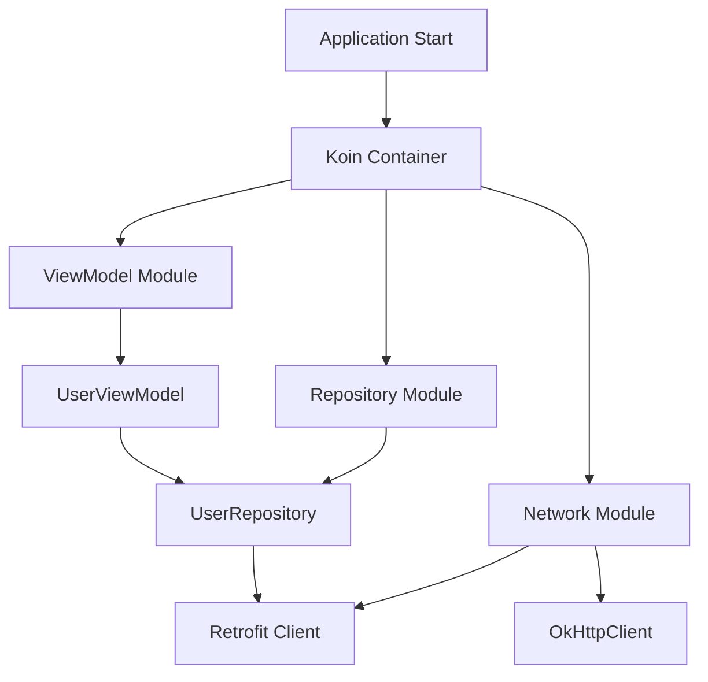

# How to Implement Dependency Injection with Koin in Kotlin

Author: [nawazdhandala](https://github.com/nawazdhandala)

Tags: Kotlin, Koin, Dependency Injection, Android, Architecture

Description: A practical guide to implementing dependency injection in Kotlin applications using Koin, covering modules, scopes, testing, and best practices.

---

Dependency injection is one of those patterns that sounds intimidating but makes your code significantly easier to test and maintain. If you've been put off by Dagger's annotation processing and generated code, Koin offers a refreshing alternative - it's a lightweight DI framework written in pure Kotlin that uses a simple DSL to define your dependencies.

This guide covers everything you need to get productive with Koin in both Android and pure Kotlin projects.

---

## Why Koin?

Koin takes a different approach from Dagger/Hilt. Instead of compile-time code generation, it resolves dependencies at runtime using a straightforward DSL. This means faster build times and a gentler learning curve.

| Feature | Koin | Dagger/Hilt |
|---------|------|-------------|
| Resolution Time | Runtime | Compile-time |
| Build Speed | Fast (no annotation processing) | Slower (code generation) |
| Learning Curve | Gentle | Steep |
| Error Detection | Runtime | Compile-time |
| Kotlin Support | Native DSL | Java-based with Kotlin support |
| Testing | Built-in test utilities | Requires additional setup |

The trade-off is clear: Koin is simpler but catches dependency errors at runtime rather than compile time. For most projects, especially smaller to medium-sized ones, this is an acceptable trade-off.

---

## Installation

Add Koin to your project. For Android projects using Gradle:

```kotlin
// build.gradle.kts
dependencies {
    // Core Koin dependency
    implementation("io.insert-koin:koin-core:3.5.0")

    // Android-specific features
    implementation("io.insert-koin:koin-android:3.5.0")

    // ViewModel support
    implementation("io.insert-koin:koin-androidx-viewmodel:3.5.0")

    // Testing utilities
    testImplementation("io.insert-koin:koin-test:3.5.0")
    testImplementation("io.insert-koin:koin-test-junit4:3.5.0")
}
```

For a pure Kotlin/JVM project, you only need koin-core:

```kotlin
implementation("io.insert-koin:koin-core:3.5.0")
```

---

## Koin Architecture Overview



---

## Defining Modules

Modules are where you declare your dependencies. Let's build a realistic example with a network layer, repository, and ViewModel.

```kotlin
// di/NetworkModule.kt
import org.koin.dsl.module
import retrofit2.Retrofit
import retrofit2.converter.gson.GsonConverterFactory
import okhttp3.OkHttpClient
import okhttp3.logging.HttpLoggingInterceptor
import java.util.concurrent.TimeUnit

val networkModule = module {
    // single - creates one instance and reuses it (singleton)
    single {
        HttpLoggingInterceptor().apply {
            level = HttpLoggingInterceptor.Level.BODY
        }
    }

    // Inject the logging interceptor we defined above using get()
    single {
        OkHttpClient.Builder()
            .addInterceptor(get<HttpLoggingInterceptor>())
            .connectTimeout(30, TimeUnit.SECONDS)
            .readTimeout(30, TimeUnit.SECONDS)
            .build()
    }

    // Build Retrofit with the OkHttpClient
    single {
        Retrofit.Builder()
            .baseUrl("https://api.example.com/")
            .client(get()) // Koin injects OkHttpClient automatically
            .addConverterFactory(GsonConverterFactory.create())
            .build()
    }

    // Create the API service from Retrofit
    single<UserApiService> {
        get<Retrofit>().create(UserApiService::class.java)
    }
}
```

---

## Single vs Factory

The two main ways to provide dependencies are `single` and `factory`. Understanding when to use each is important.

```kotlin
val repositoryModule = module {
    // single - same instance every time you inject it
    // Use for stateless services, repositories, API clients
    single<UserRepository> {
        UserRepositoryImpl(
            apiService = get(),
            database = get()
        )
    }

    // factory - new instance every time
    // Use for objects that hold state or need fresh instances
    factory<SessionManager> {
        SessionManager(
            tokenStorage = get()
        )
    }

    // You can also use named qualifiers for multiple implementations
    single<Logger>(named("file")) { FileLogger() }
    single<Logger>(named("console")) { ConsoleLogger() }
}
```

When injecting a named dependency:

```kotlin
class SomeClass(
    private val fileLogger: Logger,
    private val consoleLogger: Logger
)

// In your module:
factory {
    SomeClass(
        fileLogger = get(named("file")),
        consoleLogger = get(named("console"))
    )
}
```

---

## Scopes

Scopes let you tie the lifecycle of dependencies to specific parts of your application. This is particularly useful in Android when you want dependencies to live as long as an Activity or Fragment.

```kotlin
val scopedModule = module {
    // Define a scope tied to a specific lifecycle
    scope<MainActivity> {
        // This instance lives only while MainActivity exists
        scoped { MainActivityPresenter(get()) }

        // Factory still creates new instances within the scope
        factory { SomeDialogHelper(get()) }
    }
}
```

Using scopes in your Activity:

```kotlin
class MainActivity : AppCompatActivity(), KoinScopeComponent {
    // Create a scope tied to this activity
    override val scope: Scope by activityScope()

    // Inject scoped dependencies
    private val presenter: MainActivityPresenter by inject()

    override fun onDestroy() {
        super.onDestroy()
        // Scope is automatically closed when activity is destroyed
    }
}
```

---

## Injecting in ViewModels

Koin has first-class support for Android ViewModels. Here's how to set it up:

```kotlin
// viewmodels/UserViewModel.kt
class UserViewModel(
    private val userRepository: UserRepository,
    private val analyticsTracker: AnalyticsTracker
) : ViewModel() {

    private val _users = MutableLiveData<List<User>>()
    val users: LiveData<List<User>> = _users

    private val _loading = MutableLiveData<Boolean>()
    val loading: LiveData<Boolean> = _loading

    fun loadUsers() {
        viewModelScope.launch {
            _loading.value = true
            try {
                val result = userRepository.getUsers()
                _users.value = result
                analyticsTracker.trackEvent("users_loaded", mapOf("count" to result.size))
            } catch (e: Exception) {
                // Handle error
            } finally {
                _loading.value = false
            }
        }
    }
}
```

Define ViewModels in a module using `viewModel`:

```kotlin
// di/ViewModelModule.kt
import org.koin.androidx.viewmodel.dsl.viewModel

val viewModelModule = module {
    // viewModel - special factory for Android ViewModels
    // Handles SavedStateHandle and lifecycle automatically
    viewModel {
        UserViewModel(
            userRepository = get(),
            analyticsTracker = get()
        )
    }

    // Pass parameters to ViewModel
    viewModel { (userId: String) ->
        UserDetailViewModel(
            userId = userId,
            userRepository = get()
        )
    }
}
```

Inject ViewModels in your Activity or Fragment:

```kotlin
class UserListFragment : Fragment() {
    // Lazy injection - ViewModel created when first accessed
    private val viewModel: UserViewModel by viewModel()

    // With parameters
    private val detailViewModel: UserDetailViewModel by viewModel {
        parametersOf(arguments?.getString("userId"))
    }

    override fun onViewCreated(view: View, savedInstanceState: Bundle?) {
        super.onViewCreated(view, savedInstanceState)

        viewModel.users.observe(viewLifecycleOwner) { users ->
            // Update UI with users
        }

        viewModel.loadUsers()
    }
}
```

---

## Starting Koin

Initialize Koin in your Application class:

```kotlin
// MyApplication.kt
class MyApplication : Application() {
    override fun onCreate() {
        super.onCreate()

        startKoin {
            // Enable logging in debug builds
            androidLogger(Level.DEBUG)

            // Provide Android context
            androidContext(this@MyApplication)

            // Load all your modules
            modules(
                networkModule,
                repositoryModule,
                viewModelModule
            )
        }
    }
}
```

For pure Kotlin/JVM projects:

```kotlin
fun main() {
    startKoin {
        // Use SLF4J logger
        printLogger(Level.DEBUG)

        modules(
            networkModule,
            repositoryModule
        )
    }

    // Get dependencies anywhere using KoinComponent
    val userRepository: UserRepository = getKoin().get()
}
```

---

## Testing with Koin

Koin provides excellent testing utilities. You can easily override dependencies with mocks:

```kotlin
class UserViewModelTest : KoinTest {
    // Get the real or mocked dependency
    private val userRepository: UserRepository by inject()

    @get:Rule
    val koinTestRule = KoinTestRule.create {
        modules(
            module {
                // Override with a mock
                single<UserRepository> { mockk(relaxed = true) }
                single<AnalyticsTracker> { mockk(relaxed = true) }
                viewModel { UserViewModel(get(), get()) }
            }
        )
    }

    @Test
    fun `loadUsers updates users LiveData`() = runTest {
        // Arrange
        val mockUsers = listOf(User("1", "John"), User("2", "Jane"))
        coEvery { userRepository.getUsers() } returns mockUsers

        val viewModel: UserViewModel by inject()

        // Act
        viewModel.loadUsers()

        // Assert
        assertEquals(mockUsers, viewModel.users.value)
    }
}
```

You can also verify your module configuration is correct:

```kotlin
class ModuleCheckTest : KoinTest {
    @Test
    fun `verify all modules`() {
        // This checks that all dependencies can be resolved
        koinApplication {
            modules(
                networkModule,
                repositoryModule,
                viewModelModule
            )
        }.checkModules()
    }
}
```

---

## Best Practices

1. **Keep modules focused** - One module per layer (network, data, presentation) makes dependencies easier to track.

2. **Use interfaces** - Always inject interfaces rather than concrete implementations. This makes testing and swapping implementations trivial.

3. **Check modules in CI** - Run `checkModules()` in your test suite to catch missing dependencies before runtime.

4. **Avoid service locator pattern** - Prefer constructor injection over calling `get()` directly in your classes. Use `KoinComponent` sparingly.

5. **Use named qualifiers** - When you have multiple implementations of the same interface, named qualifiers keep things explicit.

---

## Wrapping Up

Koin offers a pragmatic approach to dependency injection in Kotlin. The DSL is intuitive, there's no code generation slowing down builds, and the testing story is solid. For projects where compile-time safety isn't critical, Koin hits a sweet spot between simplicity and functionality.

Start with the basics - single, factory, and viewModel - and add scopes as your app grows more complex. The framework scales well, and you won't find yourself fighting the DI container instead of building features.
