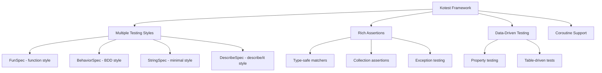

# How to Write Unit Tests with Kotest in Kotlin

Author: [nawazdhandala](https://www.github.com/nawazdhandala)

Tags: Kotlin, Kotest, Testing, Unit Tests, TDD

Description: Learn how to write expressive and maintainable unit tests in Kotlin using Kotest, covering test styles, matchers, data-driven testing, and mocking patterns.

---

> Testing in Kotlin becomes much more enjoyable with Kotest. It offers multiple testing styles, powerful assertions, and first-class coroutine support that feels natural in idiomatic Kotlin code.

Kotest is a flexible testing framework for Kotlin that gives you the freedom to write tests the way you think about them, whether that's BDD-style specs, simple function-based tests, or data-driven tests.

---

## Why Kotest?



---

## Project Setup

Add Kotest dependencies to your Gradle build file. This configuration includes the core testing framework, assertions library, and JUnit 5 runner for IDE integration.

```kotlin
// build.gradle.kts
plugins {
    kotlin("jvm") version "1.9.22"
}

dependencies {
    // Kotest framework
    testImplementation("io.kotest:kotest-runner-junit5:5.8.0")

    // Kotest assertions library
    testImplementation("io.kotest:kotest-assertions-core:5.8.0")

    // Property-based testing (optional)
    testImplementation("io.kotest:kotest-property:5.8.0")

    // MockK for mocking (optional)
    testImplementation("io.mockk:mockk:1.13.9")
}

tasks.withType<Test>().configureEach {
    useJUnitPlatform()
}
```

---

## Testing Styles

Kotest offers several testing styles. Pick the one that matches how you think about your tests.

### FunSpec - Function Style

FunSpec is great for developers coming from JUnit or pytest. Each test is a simple function call with a descriptive name.

```kotlin
// src/test/kotlin/UserServiceFunSpecTest.kt
import io.kotest.core.spec.style.FunSpec
import io.kotest.matchers.shouldBe
import io.kotest.matchers.shouldNotBe

class UserServiceFunSpecTest : FunSpec({

    // Simple test case
    test("should create user with valid email") {
        val service = UserService()
        val user = service.createUser("john@example.com", "John Doe")

        user.id shouldNotBe null
        user.email shouldBe "john@example.com"
        user.name shouldBe "John Doe"
    }

    // Test with context for grouping related tests
    context("when validating emails") {
        test("should accept valid email formats") {
            val validator = EmailValidator()

            validator.isValid("user@domain.com") shouldBe true
            validator.isValid("user.name@domain.co.uk") shouldBe true
        }

        test("should reject invalid email formats") {
            val validator = EmailValidator()

            validator.isValid("invalid") shouldBe false
            validator.isValid("@domain.com") shouldBe false
        }
    }
})
```

### BehaviorSpec - BDD Style

BehaviorSpec follows the Given-When-Then pattern, making tests read like specifications. This is useful when tests need to be understood by non-developers.

```kotlin
// src/test/kotlin/OrderServiceBehaviorSpecTest.kt
import io.kotest.core.spec.style.BehaviorSpec
import io.kotest.matchers.shouldBe
import io.kotest.matchers.collections.shouldHaveSize

class OrderServiceBehaviorSpecTest : BehaviorSpec({

    given("a shopping cart with items") {
        val cart = ShoppingCart()
        cart.addItem(Item("Laptop", 999.99))
        cart.addItem(Item("Mouse", 29.99))

        `when`("checkout is initiated") {
            val orderService = OrderService()
            val order = orderService.checkout(cart)

            then("order should be created with all items") {
                order.items shouldHaveSize 2
            }

            then("order total should include all items") {
                order.total shouldBe 1029.98
            }

            then("order status should be pending") {
                order.status shouldBe OrderStatus.PENDING
            }
        }
    }

    given("an empty shopping cart") {
        val cart = ShoppingCart()

        `when`("checkout is attempted") {
            val orderService = OrderService()

            then("should throw an exception") {
                val exception = shouldThrow<EmptyCartException> {
                    orderService.checkout(cart)
                }
                exception.message shouldBe "Cannot checkout empty cart"
            }
        }
    }
})
```

### StringSpec - Minimal Style

StringSpec is the most concise style, where the test name is just a string. Perfect for simple, focused tests.

```kotlin
// src/test/kotlin/CalculatorStringSpecTest.kt
import io.kotest.core.spec.style.StringSpec
import io.kotest.matchers.shouldBe

class CalculatorStringSpecTest : StringSpec({

    val calculator = Calculator()

    "addition of two positive numbers" {
        calculator.add(2, 3) shouldBe 5
    }

    "subtraction with negative result" {
        calculator.subtract(3, 7) shouldBe -4
    }

    "multiplication by zero returns zero" {
        calculator.multiply(100, 0) shouldBe 0
    }

    "division by non-zero number" {
        calculator.divide(10, 2) shouldBe 5
    }
})
```

### DescribeSpec - Describe/It Style

DescribeSpec uses the describe/it pattern popular in JavaScript testing frameworks like Jest and Mocha.

```kotlin
// src/test/kotlin/AuthServiceDescribeSpecTest.kt
import io.kotest.core.spec.style.DescribeSpec
import io.kotest.matchers.shouldBe
import io.kotest.matchers.shouldNotBe

class AuthServiceDescribeSpecTest : DescribeSpec({

    describe("AuthService") {
        val authService = AuthService()

        describe("login") {
            it("should return token for valid credentials") {
                val result = authService.login("admin", "password123")

                result.token shouldNotBe null
                result.expiresIn shouldBe 3600
            }

            it("should throw for invalid password") {
                shouldThrow<InvalidCredentialsException> {
                    authService.login("admin", "wrong")
                }
            }

            it("should throw for unknown user") {
                shouldThrow<UserNotFoundException> {
                    authService.login("unknown", "password")
                }
            }
        }

        describe("logout") {
            it("should invalidate the token") {
                val loginResult = authService.login("admin", "password123")
                authService.logout(loginResult.token)

                authService.isTokenValid(loginResult.token) shouldBe false
            }
        }
    }
})
```

---

## Assertions and Matchers

Kotest provides a rich set of matchers that make assertions readable and type-safe.

### Basic Matchers

These are the fundamental matchers you will use in almost every test.

```kotlin
// src/test/kotlin/MatchersExampleTest.kt
import io.kotest.core.spec.style.FunSpec
import io.kotest.matchers.shouldBe
import io.kotest.matchers.shouldNotBe
import io.kotest.matchers.types.shouldBeInstanceOf
import io.kotest.matchers.string.*
import io.kotest.matchers.comparables.*

class MatchersExampleTest : FunSpec({

    test("equality matchers") {
        val result = "hello"

        result shouldBe "hello"
        result shouldNotBe "world"
    }

    test("string matchers") {
        val message = "Hello, World!"

        message shouldStartWith "Hello"
        message shouldEndWith "!"
        message shouldContain "World"
        message shouldMatch "Hello.*"
        message.shouldHaveLength(13)
    }

    test("comparison matchers") {
        val score = 85

        score shouldBeGreaterThan 80
        score shouldBeLessThan 100
        score shouldBeGreaterThanOrEqualTo 85
        score.shouldBeBetween(80, 90)
    }

    test("type matchers") {
        val result: Any = "test"

        result.shouldBeInstanceOf<String>()
    }

    test("null matchers") {
        val value: String? = null
        val nonNull: String? = "exists"

        value.shouldBeNull()
        nonNull.shouldNotBeNull()
    }
})
```

### Collection Matchers

Working with lists, sets, and maps is common in testing. Kotest has dedicated matchers for collections.

```kotlin
// src/test/kotlin/CollectionMatchersTest.kt
import io.kotest.core.spec.style.FunSpec
import io.kotest.matchers.collections.*
import io.kotest.matchers.maps.*

class CollectionMatchersTest : FunSpec({

    test("list matchers") {
        val numbers = listOf(1, 2, 3, 4, 5)

        numbers shouldHaveSize 5
        numbers shouldContain 3
        numbers shouldContainAll listOf(1, 3, 5)
        numbers shouldContainExactly listOf(1, 2, 3, 4, 5)
        numbers.shouldBeSorted()
        numbers shouldHaveAtLeastSize 3
    }

    test("checking element presence") {
        val fruits = listOf("apple", "banana", "cherry")

        fruits shouldContainAnyOf listOf("apple", "grape")
        fruits shouldNotContain "grape"
        fruits.shouldContainInOrder("apple", "cherry")
    }

    test("map matchers") {
        val config = mapOf(
            "host" to "localhost",
            "port" to 8080,
            "debug" to true
        )

        config shouldHaveSize 3
        config shouldContainKey "host"
        config shouldContainValue 8080
        config shouldContain ("debug" to true)
        config.shouldNotBeEmpty()
    }

    test("empty and single element") {
        val empty = emptyList<String>()
        val single = listOf("only")

        empty.shouldBeEmpty()
        single.shouldHaveSingleElement("only")
    }
})
```

---

## Exception Testing

Testing that your code throws the right exceptions is important. Kotest makes this straightforward.

```kotlin
// src/test/kotlin/ExceptionTest.kt
import io.kotest.core.spec.style.FunSpec
import io.kotest.assertions.throwables.shouldThrow
import io.kotest.assertions.throwables.shouldThrowAny
import io.kotest.assertions.throwables.shouldNotThrow
import io.kotest.matchers.shouldBe

class ExceptionTest : FunSpec({

    test("should throw specific exception type") {
        val repository = UserRepository()

        val exception = shouldThrow<UserNotFoundException> {
            repository.findById(999)
        }

        exception.message shouldBe "User with id 999 not found"
        exception.userId shouldBe 999
    }

    test("should throw any exception") {
        val parser = JsonParser()

        shouldThrowAny {
            parser.parse("invalid json {")
        }
    }

    test("should not throw any exception") {
        val calculator = Calculator()

        shouldNotThrow<ArithmeticException> {
            calculator.divide(10, 2)
        }
    }

    test("exception with custom validation") {
        val validator = InputValidator()

        val exception = shouldThrow<ValidationException> {
            validator.validate(mapOf("email" to "invalid"))
        }

        exception.errors shouldContainKey "email"
        exception.errors["email"] shouldBe "Invalid email format"
    }
})
```

---

## Data-Driven Testing

When you need to test the same logic with multiple inputs, data-driven testing keeps your code DRY.

### Table-Driven Tests

Use `forAll` with `row` to define test cases in a table format.

```kotlin
// src/test/kotlin/DataDrivenTest.kt
import io.kotest.core.spec.style.FunSpec
import io.kotest.datatest.withData
import io.kotest.matchers.shouldBe
import io.kotest.data.forAll
import io.kotest.data.row

class DataDrivenTest : FunSpec({

    // Using forAll with row for table-driven tests
    test("password strength validation") {
        forAll(
            row("abc", PasswordStrength.WEAK),
            row("abc123", PasswordStrength.WEAK),
            row("Abc12345", PasswordStrength.MEDIUM),
            row("Abc123!@#", PasswordStrength.STRONG),
            row("MyP@ssw0rd!2024", PasswordStrength.VERY_STRONG)
        ) { password, expectedStrength ->
            val validator = PasswordValidator()
            validator.checkStrength(password) shouldBe expectedStrength
        }
    }

    // Using forAll with named parameters
    test("email validation") {
        forAll(
            row("user@domain.com", true, "standard email"),
            row("user.name@domain.co.uk", true, "email with subdomain"),
            row("user+tag@domain.com", true, "email with plus addressing"),
            row("invalid", false, "no @ symbol"),
            row("@domain.com", false, "missing local part"),
            row("user@", false, "missing domain")
        ) { email, shouldBeValid, description ->
            val validator = EmailValidator()
            validator.isValid(email) shouldBe shouldBeValid
        }
    }
})
```

### Data Classes as Test Cases

For more complex test data, use data classes with `withData`.

```kotlin
// src/test/kotlin/DataClassDrivenTest.kt
import io.kotest.core.spec.style.FunSpec
import io.kotest.datatest.withData
import io.kotest.matchers.shouldBe

// Data class representing a test case
data class PriceCalculationTestCase(
    val basePrice: Double,
    val quantity: Int,
    val discountPercent: Double,
    val expectedTotal: Double
)

class DataClassDrivenTest : FunSpec({

    context("price calculation with discounts") {
        withData(
            PriceCalculationTestCase(100.0, 1, 0.0, 100.0),
            PriceCalculationTestCase(100.0, 2, 0.0, 200.0),
            PriceCalculationTestCase(100.0, 1, 10.0, 90.0),
            PriceCalculationTestCase(100.0, 5, 20.0, 400.0),
            PriceCalculationTestCase(49.99, 3, 15.0, 127.47)
        ) { (basePrice, quantity, discountPercent, expectedTotal) ->
            val calculator = PriceCalculator()
            val total = calculator.calculate(basePrice, quantity, discountPercent)

            // Use tolerance for floating point comparison
            total shouldBe (expectedTotal plusOrMinus 0.01)
        }
    }
})
```

---

## Test Lifecycle and Setup

Kotest provides hooks for setting up and tearing down test resources at different scopes.

```kotlin
// src/test/kotlin/LifecycleTest.kt
import io.kotest.core.spec.style.FunSpec
import io.kotest.matchers.shouldBe

class LifecycleTest : FunSpec({

    lateinit var database: TestDatabase
    lateinit var userRepository: UserRepository

    // Runs once before all tests in this spec
    beforeSpec {
        println("Starting test suite")
        database = TestDatabase.create()
    }

    // Runs before each test
    beforeTest {
        database.clear()
        userRepository = UserRepository(database)
    }

    // Runs after each test
    afterTest { (testCase, result) ->
        println("Test '${testCase.name.testName}' finished with ${result.isSuccess}")
    }

    // Runs once after all tests in this spec
    afterSpec {
        database.close()
        println("Test suite completed")
    }

    test("create user") {
        val user = userRepository.create("test@example.com")
        user.email shouldBe "test@example.com"
    }

    test("find user") {
        userRepository.create("find@example.com")
        val found = userRepository.findByEmail("find@example.com")
        found?.email shouldBe "find@example.com"
    }
})
```

---

## Mocking with MockK

MockK integrates naturally with Kotest for mocking dependencies. Here is how to use them together.

```kotlin
// src/test/kotlin/MockingTest.kt
import io.kotest.core.spec.style.FunSpec
import io.kotest.matchers.shouldBe
import io.mockk.*

class MockingTest : FunSpec({

    // Create mocks
    val userRepository = mockk<UserRepository>()
    val emailService = mockk<EmailService>()
    val userService = UserService(userRepository, emailService)

    beforeTest {
        // Clear all mocks before each test
        clearAllMocks()
    }

    test("should create user and send welcome email") {
        // Arrange: Define mock behavior
        val expectedUser = User(1, "new@example.com", "New User")

        every { userRepository.save(any()) } returns expectedUser
        every { emailService.sendWelcomeEmail(any()) } just Runs

        // Act
        val result = userService.registerUser("new@example.com", "New User")

        // Assert
        result shouldBe expectedUser

        // Verify interactions
        verify(exactly = 1) { userRepository.save(any()) }
        verify(exactly = 1) { emailService.sendWelcomeEmail(expectedUser) }
    }

    test("should not send email if user creation fails") {
        // Arrange
        every { userRepository.save(any()) } throws DatabaseException("Connection failed")

        // Act and Assert
        shouldThrow<DatabaseException> {
            userService.registerUser("fail@example.com", "Fail User")
        }

        // Verify email was never sent
        verify(exactly = 0) { emailService.sendWelcomeEmail(any()) }
    }

    test("should use slot to capture arguments") {
        val userSlot = slot<User>()

        every { userRepository.save(capture(userSlot)) } answers {
            userSlot.captured.copy(id = 42)
        }
        every { emailService.sendWelcomeEmail(any()) } just Runs

        userService.registerUser("captured@example.com", "Captured User")

        userSlot.captured.email shouldBe "captured@example.com"
        userSlot.captured.name shouldBe "Captured User"
    }
})
```

---

## Testing Coroutines

Kotest has first-class support for coroutines. Tests can be suspend functions directly.

```kotlin
// src/test/kotlin/CoroutineTest.kt
import io.kotest.core.spec.style.FunSpec
import io.kotest.matchers.shouldBe
import kotlinx.coroutines.delay
import kotlinx.coroutines.async
import kotlinx.coroutines.coroutineScope

class CoroutineTest : FunSpec({

    test("async service call") {
        val service = AsyncUserService()

        // This is a suspend function, works naturally in Kotest
        val user = service.fetchUser(1)

        user.name shouldBe "John Doe"
    }

    test("parallel async calls") {
        val service = AsyncUserService()

        coroutineScope {
            val user1 = async { service.fetchUser(1) }
            val user2 = async { service.fetchUser(2) }

            user1.await().id shouldBe 1
            user2.await().id shouldBe 2
        }
    }

    test("testing with timeouts") {
        val slowService = SlowService()

        // Kotest handles coroutine timeouts
        val result = slowService.processWithDelay()

        result shouldBe "processed"
    }
})

// Example async service
class AsyncUserService {
    suspend fun fetchUser(id: Int): User {
        delay(100) // Simulate network call
        return User(id, "user$id@example.com", "John Doe")
    }
}

class SlowService {
    suspend fun processWithDelay(): String {
        delay(500)
        return "processed"
    }
}
```

---

## Configuration

Create a `kotest.properties` file or a `ProjectConfig` class for global settings.

```kotlin
// src/test/kotlin/ProjectConfig.kt
import io.kotest.core.config.AbstractProjectConfig
import io.kotest.core.spec.IsolationMode
import kotlin.time.Duration.Companion.seconds

object ProjectConfig : AbstractProjectConfig() {

    // Each test gets its own instance of the spec class
    override val isolationMode = IsolationMode.InstancePerTest

    // Global timeout for all tests
    override val timeout = 30.seconds

    // Run tests in parallel
    override val parallelism = 4

    // Fail fast on first failure
    override val failfast = false

    // Global listeners
    override fun listeners() = listOf(
        DatabaseSetupListener(),
        TestReportListener()
    )

    // Extensions
    override fun extensions() = listOf(
        SpringExtension
    )
}
```

---

## Best Practices

| Practice | Why It Matters |
|----------|----------------|
| Use descriptive test names | Makes failures easy to understand |
| One assertion per test | Easier to identify what broke |
| Keep tests independent | Tests should not depend on each other |
| Use appropriate matchers | More readable and better error messages |
| Group related tests | Use context/describe for organization |
| Clean up after tests | Prevent test pollution |
| Mock external dependencies | Tests should be fast and deterministic |

---

## Running Tests

```bash
# Run all tests
./gradlew test

# Run specific test class
./gradlew test --tests "UserServiceFunSpecTest"

# Run tests matching a pattern
./gradlew test --tests "*Service*"

# Run with verbose output
./gradlew test --info

# Run in parallel
./gradlew test --parallel
```

---

*Building reliable software requires comprehensive testing. [OneUptime](https://oneuptime.com) helps you monitor your applications in production and get alerted when something goes wrong, complementing your test suite with real-world observability.*

**Related Topics:**
- [How to Configure Kotlin DSL in Spring Boot](https://oneuptime.com/blog/post/2026-02-02-kotlin-dsl-spring-boot/view)
- [How to Use Data Classes in Kotlin](https://oneuptime.com/blog/post/2026-02-02-kotlin-data-classes/view)
