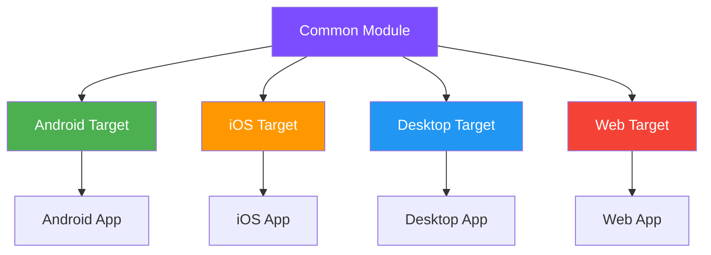

# How to Build Kotlin Multiplatform Applications

Author: [nawazdhandala](https://www.github.com/nawazdhandala)

Tags: Kotlin, Multiplatform, KMP, Mobile, Cross-Platform

Description: Learn how to build cross-platform applications using Kotlin Multiplatform, sharing business logic across Android, iOS, desktop, and web targets.

---

Building applications for multiple platforms traditionally meant writing the same logic multiple times in different languages. Kotlin Multiplatform (KMP) changes this by letting you share code between Android, iOS, desktop, and web while keeping native UI and platform-specific features where they matter.

This guide walks through setting up a KMP project, structuring shared code, handling platform-specific implementations, and connecting everything to native UI layers.

## Understanding Kotlin Multiplatform Architecture

KMP uses a source set structure that separates common code from platform-specific implementations. The key concept is "expect/actual" declarations, which let you define interfaces in common code and implement them per platform.



## Project Setup

### Gradle Configuration

Start with the root `build.gradle.kts` file that configures the Kotlin Multiplatform plugin. This sets up the targets you want to support and configures dependencies for each platform.

```kotlin
// build.gradle.kts (root)
plugins {
    kotlin("multiplatform") version "1.9.22"
    kotlin("plugin.serialization") version "1.9.22"
    id("com.android.library") version "8.2.0"
}

kotlin {
    // Android target configuration
    androidTarget {
        compilations.all {
            kotlinOptions {
                jvmTarget = "17"
            }
        }
    }

    // iOS targets - arm64 for devices, simulatorArm64 for M1/M2 Macs
    iosArm64()
    iosSimulatorArm64()

    // Desktop targets
    jvm("desktop")

    // Web target using Kotlin/JS
    js(IR) {
        browser {
            commonWebpackConfig {
                cssSupport { enabled.set(true) }
            }
        }
    }

    // Source set configuration
    sourceSets {
        val commonMain by getting {
            dependencies {
                // Coroutines for async operations
                implementation("org.jetbrains.kotlinx:kotlinx-coroutines-core:1.7.3")
                // Serialization for JSON parsing
                implementation("org.jetbrains.kotlinx:kotlinx-serialization-json:1.6.2")
                // HTTP client
                implementation("io.ktor:ktor-client-core:2.3.7")
                implementation("io.ktor:ktor-client-content-negotiation:2.3.7")
                implementation("io.ktor:ktor-serialization-kotlinx-json:2.3.7")
            }
        }

        val commonTest by getting {
            dependencies {
                implementation(kotlin("test"))
            }
        }

        val androidMain by getting {
            dependencies {
                implementation("io.ktor:ktor-client-android:2.3.7")
            }
        }

        val iosMain by creating {
            dependsOn(commonMain)
            dependencies {
                implementation("io.ktor:ktor-client-darwin:2.3.7")
            }
        }

        val iosArm64Main by getting { dependsOn(iosMain) }
        val iosSimulatorArm64Main by getting { dependsOn(iosMain) }

        val desktopMain by getting {
            dependencies {
                implementation("io.ktor:ktor-client-cio:2.3.7")
            }
        }

        val jsMain by getting {
            dependencies {
                implementation("io.ktor:ktor-client-js:2.3.7")
            }
        }
    }
}

// Android library configuration
android {
    namespace = "com.example.shared"
    compileSdk = 34

    defaultConfig {
        minSdk = 24
    }

    compileOptions {
        sourceCompatibility = JavaVersion.VERSION_17
        targetCompatibility = JavaVersion.VERSION_17
    }
}
```

### Project Structure

The directory structure follows KMP conventions, with source sets organized by target. Shared code goes in `commonMain`, while platform-specific code goes in the respective target directories.

```
shared/
├── src/
│   ├── commonMain/
│   │   └── kotlin/
│   │       └── com/example/shared/
│   │           ├── data/
│   │           ├── domain/
│   │           └── Platform.kt
│   ├── commonTest/
│   │   └── kotlin/
│   ├── androidMain/
│   │   └── kotlin/
│   │       └── com/example/shared/
│   │           └── Platform.android.kt
│   ├── iosMain/
│   │   └── kotlin/
│   │       └── com/example/shared/
│   │           └── Platform.ios.kt
│   ├── desktopMain/
│   │   └── kotlin/
│   └── jsMain/
│       └── kotlin/
├── build.gradle.kts
└── gradle.properties
```

## Expect/Actual Declarations

The expect/actual mechanism is how KMP handles platform differences. You declare what you expect in common code, then provide actual implementations for each platform.

### Platform Information

Define a common interface for platform-specific information. This pattern is useful for accessing device info, file systems, or other native APIs.

```kotlin
// commonMain/kotlin/com/example/shared/Platform.kt

// Expect declaration - no implementation here, just the contract
expect class Platform() {
    val name: String
    val version: String
    fun getDeviceId(): String
}

// Common function using the expect class
fun getPlatformInfo(): String {
    val platform = Platform()
    return "Running on ${platform.name} version ${platform.version}"
}
```

Provide actual implementations for each target. Each implementation uses native platform APIs to get the information.

```kotlin
// androidMain/kotlin/com/example/shared/Platform.android.kt
import android.os.Build
import android.provider.Settings
import android.content.Context

actual class Platform {
    actual val name: String = "Android"
    actual val version: String = "${Build.VERSION.SDK_INT}"

    actual fun getDeviceId(): String {
        return Build.ID
    }
}
```

```kotlin
// iosMain/kotlin/com/example/shared/Platform.ios.kt
import platform.UIKit.UIDevice

actual class Platform {
    actual val name: String = "iOS"
    actual val version: String = UIDevice.currentDevice.systemVersion

    actual fun getDeviceId(): String {
        return UIDevice.currentDevice.identifierForVendor?.UUIDString ?: "unknown"
    }
}
```

```kotlin
// desktopMain/kotlin/com/example/shared/Platform.desktop.kt

actual class Platform {
    actual val name: String = System.getProperty("os.name") ?: "Desktop"
    actual val version: String = System.getProperty("os.version") ?: "unknown"

    actual fun getDeviceId(): String {
        return System.getProperty("user.name") + "-" + System.currentTimeMillis()
    }
}
```

```kotlin
// jsMain/kotlin/com/example/shared/Platform.js.kt
import kotlinx.browser.window

actual class Platform {
    actual val name: String = "Web"
    actual val version: String = window.navigator.userAgent

    actual fun getDeviceId(): String {
        // Generate or retrieve from localStorage
        return window.navigator.userAgent.hashCode().toString()
    }
}
```

## Shared Business Logic

The real power of KMP is sharing business logic. Put domain models, repositories, and use cases in common code.

### Data Models

Define data classes in common code using Kotlin serialization. These work across all platforms.

```kotlin
// commonMain/kotlin/com/example/shared/data/models/User.kt
import kotlinx.serialization.Serializable

@Serializable
data class User(
    val id: String,
    val email: String,
    val name: String,
    val avatarUrl: String? = null,
    val createdAt: Long
)

@Serializable
data class UserCredentials(
    val email: String,
    val password: String
)

@Serializable
data class AuthResponse(
    val token: String,
    val user: User,
    val expiresAt: Long
)
```

### Repository Pattern

Create repositories that handle data operations. The implementation uses Ktor, which works across all KMP targets.

```kotlin
// commonMain/kotlin/com/example/shared/data/repository/UserRepository.kt
import io.ktor.client.*
import io.ktor.client.call.*
import io.ktor.client.plugins.contentnegotiation.*
import io.ktor.client.request.*
import io.ktor.http.*
import io.ktor.serialization.kotlinx.json.*
import kotlinx.serialization.json.Json

class UserRepository(
    private val baseUrl: String
) {
    // Configure HTTP client with JSON serialization
    private val client = HttpClient {
        install(ContentNegotiation) {
            json(Json {
                ignoreUnknownKeys = true
                isLenient = true
            })
        }
    }

    // Authenticate user and return auth response
    suspend fun login(credentials: UserCredentials): Result<AuthResponse> {
        return try {
            val response = client.post("$baseUrl/auth/login") {
                contentType(ContentType.Application.Json)
                setBody(credentials)
            }
            Result.success(response.body())
        } catch (e: Exception) {
            Result.failure(e)
        }
    }

    // Fetch user profile with auth token
    suspend fun getProfile(token: String): Result<User> {
        return try {
            val response = client.get("$baseUrl/users/me") {
                header("Authorization", "Bearer $token")
            }
            Result.success(response.body())
        } catch (e: Exception) {
            Result.failure(e)
        }
    }

    // Update user profile
    suspend fun updateProfile(token: String, user: User): Result<User> {
        return try {
            val response = client.put("$baseUrl/users/me") {
                header("Authorization", "Bearer $token")
                contentType(ContentType.Application.Json)
                setBody(user)
            }
            Result.success(response.body())
        } catch (e: Exception) {
            Result.failure(e)
        }
    }

    // Clean up resources
    fun close() {
        client.close()
    }
}
```

### Use Cases

Use cases encapsulate business logic and can be shared across platforms. They coordinate between repositories and handle domain-specific rules.

```kotlin
// commonMain/kotlin/com/example/shared/domain/usecase/AuthUseCase.kt
import kotlinx.coroutines.flow.Flow
import kotlinx.coroutines.flow.flow

class AuthUseCase(
    private val userRepository: UserRepository,
    private val tokenStorage: TokenStorage
) {
    // Login flow that stores token on success
    fun login(email: String, password: String): Flow<AuthState> = flow {
        emit(AuthState.Loading)

        // Validate input
        if (!isValidEmail(email)) {
            emit(AuthState.Error("Invalid email format"))
            return@flow
        }

        if (password.length < 8) {
            emit(AuthState.Error("Password must be at least 8 characters"))
            return@flow
        }

        // Attempt login
        val result = userRepository.login(UserCredentials(email, password))

        result.fold(
            onSuccess = { response ->
                tokenStorage.saveToken(response.token)
                emit(AuthState.Success(response.user))
            },
            onFailure = { error ->
                emit(AuthState.Error(error.message ?: "Login failed"))
            }
        )
    }

    // Check if user is logged in
    suspend fun isLoggedIn(): Boolean {
        val token = tokenStorage.getToken() ?: return false
        return userRepository.getProfile(token).isSuccess
    }

    // Logout and clear stored token
    suspend fun logout() {
        tokenStorage.clearToken()
    }

    private fun isValidEmail(email: String): Boolean {
        return email.contains("@") && email.contains(".")
    }
}

// Auth state sealed class for type-safe state handling
sealed class AuthState {
    object Loading : AuthState()
    data class Success(val user: User) : AuthState()
    data class Error(val message: String) : AuthState()
}
```

## Platform-Specific Storage

Storage is inherently platform-specific. Use expect/actual to define a common interface with native implementations.

```kotlin
// commonMain/kotlin/com/example/shared/data/storage/TokenStorage.kt

// Common interface - each platform implements this differently
expect class TokenStorage {
    suspend fun saveToken(token: String)
    suspend fun getToken(): String?
    suspend fun clearToken()
}
```

```kotlin
// androidMain/kotlin/com/example/shared/data/storage/TokenStorage.android.kt
import android.content.Context
import android.content.SharedPreferences
import androidx.security.crypto.EncryptedSharedPreferences
import androidx.security.crypto.MasterKey

actual class TokenStorage(context: Context) {
    private val masterKey = MasterKey.Builder(context)
        .setKeyScheme(MasterKey.KeyScheme.AES256_GCM)
        .build()

    // Use encrypted shared preferences for secure storage
    private val prefs: SharedPreferences = EncryptedSharedPreferences.create(
        context,
        "secure_prefs",
        masterKey,
        EncryptedSharedPreferences.PrefKeyEncryptionScheme.AES256_SIV,
        EncryptedSharedPreferences.PrefValueEncryptionScheme.AES256_GCM
    )

    actual suspend fun saveToken(token: String) {
        prefs.edit().putString("auth_token", token).apply()
    }

    actual suspend fun getToken(): String? {
        return prefs.getString("auth_token", null)
    }

    actual suspend fun clearToken() {
        prefs.edit().remove("auth_token").apply()
    }
}
```

```kotlin
// iosMain/kotlin/com/example/shared/data/storage/TokenStorage.ios.kt
import platform.Foundation.NSUserDefaults
import platform.Security.*
import kotlinx.cinterop.*

actual class TokenStorage {
    private val keychain = KeychainHelper()

    actual suspend fun saveToken(token: String) {
        keychain.save("auth_token", token)
    }

    actual suspend fun getToken(): String? {
        return keychain.get("auth_token")
    }

    actual suspend fun clearToken() {
        keychain.delete("auth_token")
    }
}

// Helper class for iOS Keychain operations
class KeychainHelper {
    fun save(key: String, value: String) {
        val query = mapOf(
            kSecClass to kSecClassGenericPassword,
            kSecAttrAccount to key,
            kSecValueData to value.encodeToByteArray().toNSData()
        )
        SecItemDelete(query.toCFDictionary())
        SecItemAdd(query.toCFDictionary(), null)
    }

    fun get(key: String): String? {
        val query = mapOf(
            kSecClass to kSecClassGenericPassword,
            kSecAttrAccount to key,
            kSecReturnData to true,
            kSecMatchLimit to kSecMatchLimitOne
        )

        val result = memScoped {
            val dataRef = alloc<CFTypeRefVar>()
            val status = SecItemCopyMatching(query.toCFDictionary(), dataRef.ptr)
            if (status == errSecSuccess) {
                dataRef.value?.let { NSData.fromCFData(it) }
            } else null
        }

        return result?.toByteArray()?.decodeToString()
    }

    fun delete(key: String) {
        val query = mapOf(
            kSecClass to kSecClassGenericPassword,
            kSecAttrAccount to key
        )
        SecItemDelete(query.toCFDictionary())
    }
}
```

## State Management with Flows

Use Kotlin Flows for reactive state management. Flows work across all platforms and integrate well with native UI frameworks.

```kotlin
// commonMain/kotlin/com/example/shared/presentation/UserViewModel.kt
import kotlinx.coroutines.CoroutineScope
import kotlinx.coroutines.Dispatchers
import kotlinx.coroutines.flow.*
import kotlinx.coroutines.launch

class UserViewModel(
    private val authUseCase: AuthUseCase,
    private val userRepository: UserRepository
) {
    private val scope = CoroutineScope(Dispatchers.Default)

    // State flow for UI state
    private val _uiState = MutableStateFlow<UserUiState>(UserUiState.Initial)
    val uiState: StateFlow<UserUiState> = _uiState.asStateFlow()

    // Login action
    fun login(email: String, password: String) {
        authUseCase.login(email, password)
            .onEach { state ->
                _uiState.value = when (state) {
                    is AuthState.Loading -> UserUiState.Loading
                    is AuthState.Success -> UserUiState.LoggedIn(state.user)
                    is AuthState.Error -> UserUiState.Error(state.message)
                }
            }
            .launchIn(scope)
    }

    // Logout action
    fun logout() {
        scope.launch {
            authUseCase.logout()
            _uiState.value = UserUiState.Initial
        }
    }

    // Check auth status on startup
    fun checkAuthStatus() {
        scope.launch {
            _uiState.value = UserUiState.Loading
            if (authUseCase.isLoggedIn()) {
                // Token is valid, fetch profile
                val token = authUseCase.getToken()
                if (token != null) {
                    userRepository.getProfile(token).fold(
                        onSuccess = { user ->
                            _uiState.value = UserUiState.LoggedIn(user)
                        },
                        onFailure = {
                            _uiState.value = UserUiState.Initial
                        }
                    )
                }
            } else {
                _uiState.value = UserUiState.Initial
            }
        }
    }
}

// UI state sealed class
sealed class UserUiState {
    object Initial : UserUiState()
    object Loading : UserUiState()
    data class LoggedIn(val user: User) : UserUiState()
    data class Error(val message: String) : UserUiState()
}
```

## iOS Integration with Swift

Export the shared module to iOS using the Kotlin/Native framework. Swift code can then use Kotlin classes directly.

### Kotlin Configuration for iOS

Configure the iOS framework export in your Gradle file. This creates an XCFramework that works with both simulators and devices.

```kotlin
// build.gradle.kts - iOS framework configuration
kotlin {
    listOf(
        iosArm64(),
        iosSimulatorArm64()
    ).forEach { target ->
        target.binaries.framework {
            baseName = "SharedKit"
            isStatic = true
        }
    }
}
```

### Swift Usage

Use the exported framework in your iOS app. Kotlin flows become Swift's AsyncSequence compatible through helper wrappers.

```swift
// iOS/App/ViewModels/LoginViewModel.swift
import SharedKit
import Combine

@MainActor
class LoginViewModel: ObservableObject {
    @Published var email = ""
    @Published var password = ""
    @Published var isLoading = false
    @Published var errorMessage: String?
    @Published var user: User?

    private let viewModel: UserViewModel
    private var stateObserver: Task<Void, Never>?

    init() {
        // Initialize shared Kotlin ViewModel
        let tokenStorage = TokenStorage()
        let userRepository = UserRepository(baseUrl: "https://api.example.com")
        let authUseCase = AuthUseCase(
            userRepository: userRepository,
            tokenStorage: tokenStorage
        )
        self.viewModel = UserViewModel(
            authUseCase: authUseCase,
            userRepository: userRepository
        )

        observeState()
    }

    private func observeState() {
        // Observe Kotlin StateFlow from Swift
        stateObserver = Task {
            for await state in viewModel.uiState {
                handleState(state)
            }
        }
    }

    private func handleState(_ state: UserUiState) {
        switch state {
        case is UserUiState.Initial:
            isLoading = false
            user = nil
            errorMessage = nil

        case is UserUiState.Loading:
            isLoading = true
            errorMessage = nil

        case let loggedIn as UserUiState.LoggedIn:
            isLoading = false
            user = loggedIn.user
            errorMessage = nil

        case let error as UserUiState.Error:
            isLoading = false
            errorMessage = error.message

        default:
            break
        }
    }

    func login() {
        viewModel.login(email: email, password: password)
    }

    func logout() {
        viewModel.logout()
    }

    deinit {
        stateObserver?.cancel()
    }
}
```

```swift
// iOS/App/Views/LoginView.swift
import SwiftUI

struct LoginView: View {
    @StateObject private var viewModel = LoginViewModel()

    var body: some View {
        VStack(spacing: 20) {
            if let user = viewModel.user {
                // Logged in state
                VStack {
                    Text("Welcome, \(user.name)")
                        .font(.title)

                    Button("Logout") {
                        viewModel.logout()
                    }
                    .buttonStyle(.borderedProminent)
                }
            } else {
                // Login form
                TextField("Email", text: $viewModel.email)
                    .textFieldStyle(.roundedBorder)
                    .autocapitalization(.none)

                SecureField("Password", text: $viewModel.password)
                    .textFieldStyle(.roundedBorder)

                if let error = viewModel.errorMessage {
                    Text(error)
                        .foregroundColor(.red)
                        .font(.caption)
                }

                Button(action: viewModel.login) {
                    if viewModel.isLoading {
                        ProgressView()
                    } else {
                        Text("Login")
                    }
                }
                .buttonStyle(.borderedProminent)
                .disabled(viewModel.isLoading)
            }
        }
        .padding()
    }
}
```

## Android Integration with Jetpack Compose

On Android, the shared module integrates naturally with Jetpack Compose and the Android lifecycle.

```kotlin
// android/app/src/main/kotlin/com/example/app/ui/LoginScreen.kt
import androidx.compose.foundation.layout.*
import androidx.compose.material3.*
import androidx.compose.runtime.*
import androidx.compose.ui.Alignment
import androidx.compose.ui.Modifier
import androidx.compose.ui.platform.LocalContext
import androidx.compose.ui.text.input.PasswordVisualTransformation
import androidx.compose.ui.unit.dp
import androidx.lifecycle.compose.collectAsStateWithLifecycle
import com.example.shared.presentation.UserViewModel
import com.example.shared.presentation.UserUiState

@Composable
fun LoginScreen(
    viewModel: UserViewModel,
    onLoginSuccess: () -> Unit
) {
    // Collect state from shared ViewModel
    val uiState by viewModel.uiState.collectAsStateWithLifecycle()

    var email by remember { mutableStateOf("") }
    var password by remember { mutableStateOf("") }

    // Handle login success navigation
    LaunchedEffect(uiState) {
        if (uiState is UserUiState.LoggedIn) {
            onLoginSuccess()
        }
    }

    Column(
        modifier = Modifier
            .fillMaxSize()
            .padding(16.dp),
        horizontalAlignment = Alignment.CenterHorizontally,
        verticalArrangement = Arrangement.Center
    ) {
        when (val state = uiState) {
            is UserUiState.LoggedIn -> {
                // Show logged in user
                Text(
                    text = "Welcome, ${state.user.name}",
                    style = MaterialTheme.typography.headlineMedium
                )

                Spacer(modifier = Modifier.height(16.dp))

                Button(onClick = { viewModel.logout() }) {
                    Text("Logout")
                }
            }

            else -> {
                // Login form
                OutlinedTextField(
                    value = email,
                    onValueChange = { email = it },
                    label = { Text("Email") },
                    modifier = Modifier.fillMaxWidth()
                )

                Spacer(modifier = Modifier.height(8.dp))

                OutlinedTextField(
                    value = password,
                    onValueChange = { password = it },
                    label = { Text("Password") },
                    visualTransformation = PasswordVisualTransformation(),
                    modifier = Modifier.fillMaxWidth()
                )

                // Show error if present
                if (state is UserUiState.Error) {
                    Spacer(modifier = Modifier.height(8.dp))
                    Text(
                        text = state.message,
                        color = MaterialTheme.colorScheme.error,
                        style = MaterialTheme.typography.bodySmall
                    )
                }

                Spacer(modifier = Modifier.height(16.dp))

                Button(
                    onClick = { viewModel.login(email, password) },
                    enabled = state !is UserUiState.Loading,
                    modifier = Modifier.fillMaxWidth()
                ) {
                    if (state is UserUiState.Loading) {
                        CircularProgressIndicator(
                            modifier = Modifier.size(20.dp),
                            color = MaterialTheme.colorScheme.onPrimary
                        )
                    } else {
                        Text("Login")
                    }
                }
            }
        }
    }
}
```

## Testing Shared Code

Write tests in commonTest that run on all platforms. Use expect/actual for platform-specific test utilities.

```kotlin
// commonTest/kotlin/com/example/shared/UserRepositoryTest.kt
import kotlin.test.*
import kotlinx.coroutines.test.runTest

class UserRepositoryTest {

    private lateinit var repository: UserRepository

    @BeforeTest
    fun setup() {
        // Use mock server URL for testing
        repository = UserRepository("http://localhost:8080")
    }

    @AfterTest
    fun teardown() {
        repository.close()
    }

    @Test
    fun `login with valid credentials returns success`() = runTest {
        val credentials = UserCredentials(
            email = "test@example.com",
            password = "password123"
        )

        val result = repository.login(credentials)

        assertTrue(result.isSuccess)
        result.onSuccess { response ->
            assertNotNull(response.token)
            assertEquals("test@example.com", response.user.email)
        }
    }

    @Test
    fun `login with invalid credentials returns failure`() = runTest {
        val credentials = UserCredentials(
            email = "wrong@example.com",
            password = "wrongpassword"
        )

        val result = repository.login(credentials)

        assertTrue(result.isFailure)
    }
}
```

### Fake Implementations for Testing

Create fake implementations of platform-specific classes for testing.

```kotlin
// commonTest/kotlin/com/example/shared/FakeTokenStorage.kt

class FakeTokenStorage : TokenStorageInterface {
    private var storedToken: String? = null

    override suspend fun saveToken(token: String) {
        storedToken = token
    }

    override suspend fun getToken(): String? {
        return storedToken
    }

    override suspend fun clearToken() {
        storedToken = null
    }
}
```

## Building and Distribution

### Building for All Targets

Use Gradle tasks to build for specific targets.

```bash
# Build shared library for all targets
./gradlew build

# Build only Android
./gradlew :shared:assembleRelease

# Build iOS framework
./gradlew :shared:linkReleaseFrameworkIosArm64

# Build XCFramework for iOS distribution
./gradlew :shared:assembleXCFramework

# Build desktop JAR
./gradlew :shared:desktopJar

# Build JS bundle
./gradlew :shared:jsBrowserProductionWebpack
```

### CocoaPods Integration for iOS

Configure CocoaPods to distribute the iOS framework.

```kotlin
// build.gradle.kts
kotlin {
    cocoapods {
        summary = "Shared KMP module"
        homepage = "https://github.com/example/app"
        version = "1.0.0"

        ios.deploymentTarget = "14.0"

        framework {
            baseName = "SharedKit"
            isStatic = true
        }
    }
}
```

Then in your iOS project's Podfile:

```ruby
# Podfile
platform :ios, '14.0'

target 'MyApp' do
  use_frameworks!

  pod 'SharedKit', :path => '../shared'
end
```

## Common Patterns and Best Practices

### Dependency Injection

Use a simple DI approach that works across platforms.

```kotlin
// commonMain/kotlin/com/example/shared/di/ServiceLocator.kt

object ServiceLocator {
    private var tokenStorage: TokenStorage? = null
    private var userRepository: UserRepository? = null
    private var authUseCase: AuthUseCase? = null

    // Platform-specific initialization
    fun initialize(tokenStorage: TokenStorage, baseUrl: String) {
        this.tokenStorage = tokenStorage
        this.userRepository = UserRepository(baseUrl)
        this.authUseCase = AuthUseCase(
            userRepository = userRepository!!,
            tokenStorage = tokenStorage
        )
    }

    fun getAuthUseCase(): AuthUseCase {
        return authUseCase ?: throw IllegalStateException("ServiceLocator not initialized")
    }

    fun getUserRepository(): UserRepository {
        return userRepository ?: throw IllegalStateException("ServiceLocator not initialized")
    }
}
```

### Error Handling

Create a common error hierarchy for consistent error handling across platforms.

```kotlin
// commonMain/kotlin/com/example/shared/domain/error/AppError.kt

sealed class AppError : Exception() {
    data class Network(override val message: String) : AppError()
    data class Authentication(override val message: String) : AppError()
    data class Validation(val field: String, override val message: String) : AppError()
    data class Server(val code: Int, override val message: String) : AppError()
    data class Unknown(override val cause: Throwable?) : AppError()
}

// Extension to convert exceptions to AppError
fun Throwable.toAppError(): AppError {
    return when (this) {
        is AppError -> this
        is java.net.UnknownHostException -> AppError.Network("No internet connection")
        is java.net.SocketTimeoutException -> AppError.Network("Connection timed out")
        else -> AppError.Unknown(this)
    }
}
```

## Summary

| Component | Location | Purpose |
|-----------|----------|---------|
| **Data models** | commonMain | Shared domain objects |
| **Repositories** | commonMain | Data access layer |
| **Use cases** | commonMain | Business logic |
| **ViewModels** | commonMain | UI state management |
| **Platform APIs** | *Main variants | Native functionality |
| **Storage** | *Main variants | Secure data persistence |
| **UI** | Platform apps | Native user interface |

Kotlin Multiplatform lets you share significant portions of your codebase while maintaining native performance and UI on each platform. Start with data models and networking, then gradually move business logic into shared code as you identify common patterns across your applications.

---

*Building cross-platform applications with KMP? [OneUptime](https://oneuptime.com) provides unified monitoring for all your platforms, whether Android, iOS, or web, with a single observability solution that tracks performance across your entire application stack.*
