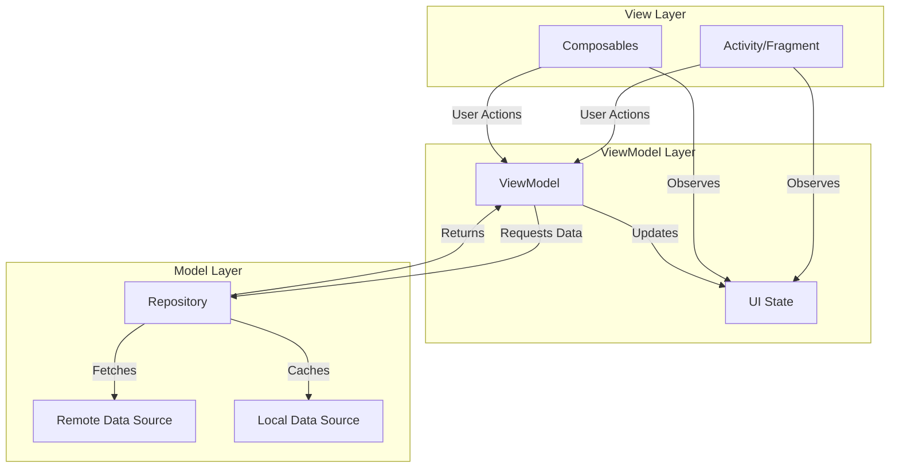

# How to Implement MVVM Architecture in Kotlin

Author: [nawazdhandala](https://github.com/nawazdhandala)

Tags: Kotlin, MVVM, Android, Architecture, Jetpack

Description: Learn how to implement MVVM (Model-View-ViewModel) architecture in Kotlin Android applications using Jetpack components like ViewModel, LiveData, and StateFlow for clean, testable, and maintainable code.

---

Building Android apps without a proper architecture is like building a house without blueprints. It might work initially, but as features pile up, you end up with spaghetti code that's impossible to test or maintain. MVVM (Model-View-ViewModel) solves this by providing clear separation of concerns, making your code more modular and testable. Kotlin and Android Jetpack components make implementing MVVM surprisingly straightforward.

## Understanding MVVM Architecture

MVVM divides your application into three distinct layers:

- **Model**: Your data layer containing business logic, data classes, repositories, and data sources (API, database).
- **View**: Activities, Fragments, and Composables that display data and handle user interactions.
- **ViewModel**: The bridge between Model and View that holds UI state, exposes data streams, and handles UI logic.

Here's how the components interact:



The key principle is unidirectional data flow: the View observes state from the ViewModel, user actions trigger ViewModel methods, and the ViewModel updates state based on data from the Model layer.

## Setting Up Dependencies

Before implementing MVVM, add the required Jetpack dependencies to your app's build.gradle.kts file. These libraries provide the core components for ViewModel lifecycle management and reactive state handling.

```kotlin
// build.gradle.kts (app level)
dependencies {
    // ViewModel and lifecycle components
    implementation("androidx.lifecycle:lifecycle-viewmodel-ktx:2.7.0")
    implementation("androidx.lifecycle:lifecycle-runtime-ktx:2.7.0")

    // LiveData (optional - you can use StateFlow instead)
    implementation("androidx.lifecycle:lifecycle-livedata-ktx:2.7.0")

    // Coroutines for async operations
    implementation("org.jetbrains.kotlinx:kotlinx-coroutines-android:1.7.3")

    // For Jetpack Compose (if using)
    implementation("androidx.lifecycle:lifecycle-viewmodel-compose:2.7.0")
    implementation("androidx.lifecycle:lifecycle-runtime-compose:2.7.0")

    // Retrofit for network calls
    implementation("com.squareup.retrofit2:retrofit:2.9.0")
    implementation("com.squareup.retrofit2:converter-gson:2.9.0")

    // Room for local database
    implementation("androidx.room:room-runtime:2.6.1")
    implementation("androidx.room:room-ktx:2.6.1")
    ksp("androidx.room:room-compiler:2.6.1")
}
```

## Building the Model Layer

Let's build a practical user management feature. Start with the data classes that represent your domain models.

```kotlin
// Domain model representing a User entity
// This is a pure Kotlin data class with no Android dependencies
data class User(
    val id: Long,
    val name: String,
    val email: String,
    val avatarUrl: String?
)

// Data Transfer Object for API responses
// Separate from domain model to decouple API structure from app logic
data class UserDto(
    val id: Long,
    val name: String,
    val email: String,
    val avatar_url: String?
) {
    // Extension function to convert DTO to domain model
    fun toDomain(): User = User(
        id = id,
        name = name,
        email = email,
        avatarUrl = avatar_url
    )
}
```

Next, create the data sources. The remote data source handles API calls while the local data source manages cached data.

```kotlin
// Retrofit API interface for network operations
// Suspend functions integrate seamlessly with coroutines
interface UserApi {
    @GET("users")
    suspend fun getUsers(): List<UserDto>

    @GET("users/{id}")
    suspend fun getUserById(@Path("id") id: Long): UserDto

    @POST("users")
    suspend fun createUser(@Body user: UserDto): UserDto

    @DELETE("users/{id}")
    suspend fun deleteUser(@Path("id") id: Long)
}

// Room entity for local caching
// Annotated for Room database persistence
@Entity(tableName = "users")
data class UserEntity(
    @PrimaryKey val id: Long,
    val name: String,
    val email: String,
    val avatarUrl: String?
) {
    fun toDomain(): User = User(id, name, email, avatarUrl)

    companion object {
        fun fromDomain(user: User): UserEntity = UserEntity(
            id = user.id,
            name = user.name,
            email = user.email,
            avatarUrl = user.avatarUrl
        )
    }
}

// Room DAO for database operations
// Flow return type enables reactive updates when data changes
@Dao
interface UserDao {
    @Query("SELECT * FROM users")
    fun getAllUsers(): Flow<List<UserEntity>>

    @Query("SELECT * FROM users WHERE id = :id")
    suspend fun getUserById(id: Long): UserEntity?

    @Insert(onConflict = OnConflictStrategy.REPLACE)
    suspend fun insertUsers(users: List<UserEntity>)

    @Delete
    suspend fun deleteUser(user: UserEntity)

    @Query("DELETE FROM users")
    suspend fun deleteAllUsers()
}
```

The repository acts as the single source of truth, coordinating between remote and local data sources.

```kotlin
// Repository interface for abstraction
// Enables easy testing with mock implementations
interface UserRepository {
    fun getUsers(): Flow<Result<List<User>>>
    suspend fun getUserById(id: Long): Result<User>
    suspend fun refreshUsers(): Result<Unit>
    suspend fun deleteUser(id: Long): Result<Unit>
}

// Concrete repository implementation
// Implements offline-first strategy with network refresh
class UserRepositoryImpl(
    private val api: UserApi,
    private val dao: UserDao,
    private val dispatcher: CoroutineDispatcher = Dispatchers.IO
) : UserRepository {

    // Returns a Flow that emits cached data and refreshes from network
    // Offline-first approach: show cached data immediately, then update
    override fun getUsers(): Flow<Result<List<User>>> = flow {
        // First emit cached data
        dao.getAllUsers()
            .map { entities -> entities.map { it.toDomain() } }
            .collect { users ->
                emit(Result.success(users))
            }
    }.onStart {
        // Trigger network refresh when flow starts collecting
        try {
            refreshUsers()
        } catch (e: Exception) {
            // Log error but don't fail - we have cached data
        }
    }.flowOn(dispatcher)

    override suspend fun getUserById(id: Long): Result<User> =
        withContext(dispatcher) {
            try {
                // Try local first
                dao.getUserById(id)?.let {
                    return@withContext Result.success(it.toDomain())
                }
                // Fallback to network
                val user = api.getUserById(id).toDomain()
                dao.insertUsers(listOf(UserEntity.fromDomain(user)))
                Result.success(user)
            } catch (e: Exception) {
                Result.failure(e)
            }
        }

    override suspend fun refreshUsers(): Result<Unit> =
        withContext(dispatcher) {
            try {
                val users = api.getUsers().map { it.toDomain() }
                dao.deleteAllUsers()
                dao.insertUsers(users.map { UserEntity.fromDomain(it) })
                Result.success(Unit)
            } catch (e: Exception) {
                Result.failure(e)
            }
        }

    override suspend fun deleteUser(id: Long): Result<Unit> =
        withContext(dispatcher) {
            try {
                api.deleteUser(id)
                dao.getUserById(id)?.let { dao.deleteUser(it) }
                Result.success(Unit)
            } catch (e: Exception) {
                Result.failure(e)
            }
        }
}
```

## Creating the ViewModel Layer

The ViewModel holds UI state and exposes it via observable streams. Here's how to structure it properly with sealed classes for representing different UI states.

```kotlin
// Sealed class representing all possible UI states
// Exhaustive when expressions ensure all states are handled
sealed class UserListUiState {
    object Loading : UserListUiState()
    data class Success(val users: List<User>) : UserListUiState()
    data class Error(val message: String) : UserListUiState()
    object Empty : UserListUiState()
}

// Sealed class for one-time events (navigation, toasts, etc.)
// These should not be replayed when configuration changes
sealed class UserListEvent {
    data class ShowSnackbar(val message: String) : UserListEvent()
    data class NavigateToDetail(val userId: Long) : UserListEvent()
    object NavigateToCreate : UserListEvent()
}

// ViewModel managing the user list screen
// Extends AndroidX ViewModel for lifecycle awareness
class UserListViewModel(
    private val repository: UserRepository
) : ViewModel() {

    // StateFlow for UI state - survives configuration changes
    // Private mutable, public immutable pattern
    private val _uiState = MutableStateFlow<UserListUiState>(UserListUiState.Loading)
    val uiState: StateFlow<UserListUiState> = _uiState.asStateFlow()

    // SharedFlow for one-time events
    // replay = 0 ensures events are not replayed on new collectors
    private val _events = MutableSharedFlow<UserListEvent>(replay = 0)
    val events: SharedFlow<UserListEvent> = _events.asSharedFlow()

    // Track loading state for pull-to-refresh
    private val _isRefreshing = MutableStateFlow(false)
    val isRefreshing: StateFlow<Boolean> = _isRefreshing.asStateFlow()

    init {
        loadUsers()
    }

    // Load users from repository
    // Collects the Flow and updates UI state accordingly
    private fun loadUsers() {
        viewModelScope.launch {
            repository.getUsers()
                .onStart { _uiState.value = UserListUiState.Loading }
                .catch { e ->
                    _uiState.value = UserListUiState.Error(
                        e.message ?: "Unknown error occurred"
                    )
                }
                .collect { result ->
                    result.fold(
                        onSuccess = { users ->
                            _uiState.value = if (users.isEmpty()) {
                                UserListUiState.Empty
                            } else {
                                UserListUiState.Success(users)
                            }
                        },
                        onFailure = { e ->
                            _uiState.value = UserListUiState.Error(
                                e.message ?: "Failed to load users"
                            )
                        }
                    )
                }
        }
    }

    // Handle pull-to-refresh action
    fun onRefresh() {
        viewModelScope.launch {
            _isRefreshing.value = true
            repository.refreshUsers().fold(
                onSuccess = {
                    _events.emit(UserListEvent.ShowSnackbar("Users refreshed"))
                },
                onFailure = { e ->
                    _events.emit(UserListEvent.ShowSnackbar(
                        e.message ?: "Refresh failed"
                    ))
                }
            )
            _isRefreshing.value = false
        }
    }

    // Handle user click action
    fun onUserClick(user: User) {
        viewModelScope.launch {
            _events.emit(UserListEvent.NavigateToDetail(user.id))
        }
    }

    // Handle delete action
    fun onDeleteUser(user: User) {
        viewModelScope.launch {
            repository.deleteUser(user.id).fold(
                onSuccess = {
                    _events.emit(UserListEvent.ShowSnackbar("User deleted"))
                },
                onFailure = { e ->
                    _events.emit(UserListEvent.ShowSnackbar(
                        e.message ?: "Delete failed"
                    ))
                }
            )
        }
    }

    // Handle add user action
    fun onAddUserClick() {
        viewModelScope.launch {
            _events.emit(UserListEvent.NavigateToCreate)
        }
    }
}
```

For complex screens, you might want to use a UiState data class instead of sealed classes.

```kotlin
// Alternative approach using a data class for UI state
// Better for screens with multiple independent pieces of state
data class UserDetailUiState(
    val user: User? = null,
    val isLoading: Boolean = false,
    val error: String? = null,
    val isSaving: Boolean = false
)

class UserDetailViewModel(
    private val repository: UserRepository,
    private val userId: Long
) : ViewModel() {

    private val _uiState = MutableStateFlow(UserDetailUiState(isLoading = true))
    val uiState: StateFlow<UserDetailUiState> = _uiState.asStateFlow()

    init {
        loadUser()
    }

    private fun loadUser() {
        viewModelScope.launch {
            _uiState.update { it.copy(isLoading = true, error = null) }

            repository.getUserById(userId).fold(
                onSuccess = { user ->
                    _uiState.update { it.copy(user = user, isLoading = false) }
                },
                onFailure = { e ->
                    _uiState.update {
                        it.copy(
                            isLoading = false,
                            error = e.message ?: "Failed to load user"
                        )
                    }
                }
            )
        }
    }

    fun onRetry() {
        loadUser()
    }
}
```

## Connecting the View Layer

Here's how to connect your ViewModel to both traditional Views with XML and Jetpack Compose.

### With Jetpack Compose

```kotlin
// Composable function that displays the user list
// collectAsStateWithLifecycle ensures proper lifecycle handling
@Composable
fun UserListScreen(
    viewModel: UserListViewModel = viewModel(),
    onNavigateToDetail: (Long) -> Unit,
    onNavigateToCreate: () -> Unit
) {
    // Collect UI state with lifecycle awareness
    val uiState by viewModel.uiState.collectAsStateWithLifecycle()
    val isRefreshing by viewModel.isRefreshing.collectAsStateWithLifecycle()

    // Handle one-time events
    val context = LocalContext.current
    LaunchedEffect(Unit) {
        viewModel.events.collect { event ->
            when (event) {
                is UserListEvent.ShowSnackbar -> {
                    // Show snackbar using your preferred method
                }
                is UserListEvent.NavigateToDetail -> {
                    onNavigateToDetail(event.userId)
                }
                UserListEvent.NavigateToCreate -> {
                    onNavigateToCreate()
                }
            }
        }
    }

    // Render UI based on state
    Scaffold(
        floatingActionButton = {
            FloatingActionButton(onClick = viewModel::onAddUserClick) {
                Icon(Icons.Default.Add, contentDescription = "Add user")
            }
        }
    ) { padding ->
        SwipeRefresh(
            state = rememberSwipeRefreshState(isRefreshing),
            onRefresh = viewModel::onRefresh,
            modifier = Modifier.padding(padding)
        ) {
            when (val state = uiState) {
                is UserListUiState.Loading -> {
                    LoadingIndicator()
                }
                is UserListUiState.Success -> {
                    UserList(
                        users = state.users,
                        onUserClick = viewModel::onUserClick,
                        onDeleteUser = viewModel::onDeleteUser
                    )
                }
                is UserListUiState.Error -> {
                    ErrorMessage(
                        message = state.message,
                        onRetry = viewModel::onRefresh
                    )
                }
                is UserListUiState.Empty -> {
                    EmptyState(message = "No users found")
                }
            }
        }
    }
}

// Reusable user list composable
@Composable
private fun UserList(
    users: List<User>,
    onUserClick: (User) -> Unit,
    onDeleteUser: (User) -> Unit
) {
    LazyColumn {
        items(
            items = users,
            key = { it.id }
        ) { user ->
            UserListItem(
                user = user,
                onClick = { onUserClick(user) },
                onDelete = { onDeleteUser(user) }
            )
        }
    }
}

// Individual user item composable
@Composable
private fun UserListItem(
    user: User,
    onClick: () -> Unit,
    onDelete: () -> Unit
) {
    Card(
        modifier = Modifier
            .fillMaxWidth()
            .padding(horizontal = 16.dp, vertical = 8.dp)
            .clickable(onClick = onClick)
    ) {
        Row(
            modifier = Modifier.padding(16.dp),
            verticalAlignment = Alignment.CenterVertically
        ) {
            // Avatar
            AsyncImage(
                model = user.avatarUrl,
                contentDescription = "User avatar",
                modifier = Modifier
                    .size(48.dp)
                    .clip(CircleShape)
            )

            Spacer(modifier = Modifier.width(16.dp))

            // User info
            Column(modifier = Modifier.weight(1f)) {
                Text(
                    text = user.name,
                    style = MaterialTheme.typography.titleMedium
                )
                Text(
                    text = user.email,
                    style = MaterialTheme.typography.bodyMedium,
                    color = MaterialTheme.colorScheme.onSurfaceVariant
                )
            }

            // Delete button
            IconButton(onClick = onDelete) {
                Icon(
                    Icons.Default.Delete,
                    contentDescription = "Delete user",
                    tint = MaterialTheme.colorScheme.error
                )
            }
        }
    }
}
```

### With XML Views and Fragments

```kotlin
// Fragment connecting to ViewModel with XML layouts
// Uses ViewBinding for type-safe view access
class UserListFragment : Fragment(R.layout.fragment_user_list) {

    // ViewModel scoped to Fragment lifecycle
    private val viewModel: UserListViewModel by viewModels {
        UserListViewModelFactory(
            (requireActivity().application as MyApplication).userRepository
        )
    }

    private var _binding: FragmentUserListBinding? = null
    private val binding get() = _binding!!

    private lateinit var adapter: UserAdapter

    override fun onViewCreated(view: View, savedInstanceState: Bundle?) {
        super.onViewCreated(view, savedInstanceState)
        _binding = FragmentUserListBinding.bind(view)

        setupRecyclerView()
        setupSwipeRefresh()
        observeState()
        observeEvents()
    }

    private fun setupRecyclerView() {
        adapter = UserAdapter(
            onUserClick = { user -> viewModel.onUserClick(user) },
            onDeleteClick = { user -> viewModel.onDeleteUser(user) }
        )
        binding.recyclerView.adapter = adapter
        binding.recyclerView.layoutManager = LinearLayoutManager(requireContext())
    }

    private fun setupSwipeRefresh() {
        binding.swipeRefresh.setOnRefreshListener {
            viewModel.onRefresh()
        }
    }

    // Observe UI state using repeatOnLifecycle for proper lifecycle handling
    private fun observeState() {
        viewLifecycleOwner.lifecycleScope.launch {
            viewLifecycleOwner.repeatOnLifecycle(Lifecycle.State.STARTED) {
                launch {
                    viewModel.uiState.collect { state ->
                        when (state) {
                            is UserListUiState.Loading -> showLoading()
                            is UserListUiState.Success -> showUsers(state.users)
                            is UserListUiState.Error -> showError(state.message)
                            is UserListUiState.Empty -> showEmpty()
                        }
                    }
                }

                launch {
                    viewModel.isRefreshing.collect { isRefreshing ->
                        binding.swipeRefresh.isRefreshing = isRefreshing
                    }
                }
            }
        }
    }

    // Observe one-time events
    private fun observeEvents() {
        viewLifecycleOwner.lifecycleScope.launch {
            viewLifecycleOwner.repeatOnLifecycle(Lifecycle.State.STARTED) {
                viewModel.events.collect { event ->
                    when (event) {
                        is UserListEvent.ShowSnackbar -> {
                            Snackbar.make(
                                binding.root,
                                event.message,
                                Snackbar.LENGTH_SHORT
                            ).show()
                        }
                        is UserListEvent.NavigateToDetail -> {
                            findNavController().navigate(
                                UserListFragmentDirections
                                    .actionUserListToDetail(event.userId)
                            )
                        }
                        UserListEvent.NavigateToCreate -> {
                            findNavController().navigate(
                                UserListFragmentDirections.actionUserListToCreate()
                            )
                        }
                    }
                }
            }
        }
    }

    private fun showLoading() {
        binding.progressBar.isVisible = true
        binding.recyclerView.isVisible = false
        binding.errorLayout.isVisible = false
        binding.emptyLayout.isVisible = false
    }

    private fun showUsers(users: List<User>) {
        binding.progressBar.isVisible = false
        binding.recyclerView.isVisible = true
        binding.errorLayout.isVisible = false
        binding.emptyLayout.isVisible = false
        adapter.submitList(users)
    }

    private fun showError(message: String) {
        binding.progressBar.isVisible = false
        binding.recyclerView.isVisible = false
        binding.errorLayout.isVisible = true
        binding.emptyLayout.isVisible = false
        binding.errorText.text = message
    }

    private fun showEmpty() {
        binding.progressBar.isVisible = false
        binding.recyclerView.isVisible = false
        binding.errorLayout.isVisible = false
        binding.emptyLayout.isVisible = true
    }

    override fun onDestroyView() {
        super.onDestroyView()
        _binding = null
    }
}
```

## ViewModel Factory for Dependency Injection

Android ViewModels cannot have constructor parameters by default. Use a ViewModelFactory to inject dependencies.

```kotlin
// ViewModelFactory for creating ViewModels with dependencies
// Required when ViewModel needs constructor parameters
class UserListViewModelFactory(
    private val repository: UserRepository
) : ViewModelProvider.Factory {

    @Suppress("UNCHECKED_CAST")
    override fun <T : ViewModel> create(modelClass: Class<T>): T {
        if (modelClass.isAssignableFrom(UserListViewModel::class.java)) {
            return UserListViewModel(repository) as T
        }
        throw IllegalArgumentException("Unknown ViewModel class: ${modelClass.name}")
    }
}

// With SavedStateHandle for process death survival
class UserDetailViewModelFactory(
    private val repository: UserRepository,
    private val userId: Long,
    owner: SavedStateRegistryOwner,
    defaultArgs: Bundle? = null
) : AbstractSavedStateViewModelFactory(owner, defaultArgs) {

    @Suppress("UNCHECKED_CAST")
    override fun <T : ViewModel> create(
        key: String,
        modelClass: Class<T>,
        handle: SavedStateHandle
    ): T {
        if (modelClass.isAssignableFrom(UserDetailViewModel::class.java)) {
            return UserDetailViewModel(repository, userId) as T
        }
        throw IllegalArgumentException("Unknown ViewModel class: ${modelClass.name}")
    }
}
```

For better dependency injection, consider using Hilt.

```kotlin
// ViewModel with Hilt injection
// @HiltViewModel eliminates the need for ViewModelFactory
@HiltViewModel
class UserListViewModel @Inject constructor(
    private val repository: UserRepository
) : ViewModel() {
    // Same implementation as before
}

// Using in Fragment with Hilt
@AndroidEntryPoint
class UserListFragment : Fragment(R.layout.fragment_user_list) {
    // Hilt provides the ViewModel automatically
    private val viewModel: UserListViewModel by viewModels()
}

// Using in Composable with Hilt
@Composable
fun UserListScreen(
    // hiltViewModel() provides the ViewModel
    viewModel: UserListViewModel = hiltViewModel()
) {
    // Implementation
}
```

## Testing Your MVVM Implementation

Proper MVVM architecture makes testing straightforward. Here's how to test each layer.

```kotlin
// Test the ViewModel with a fake repository
class UserListViewModelTest {

    // Coroutine test dispatcher for controlling coroutine execution
    @get:Rule
    val mainDispatcherRule = MainDispatcherRule()

    private lateinit var viewModel: UserListViewModel
    private lateinit var fakeRepository: FakeUserRepository

    @Before
    fun setup() {
        fakeRepository = FakeUserRepository()
        viewModel = UserListViewModel(fakeRepository)
    }

    @Test
    fun `initial state is loading`() = runTest {
        // Given a fresh ViewModel
        val newViewModel = UserListViewModel(FakeUserRepository())

        // Then initial state should be loading
        assertEquals(UserListUiState.Loading, newViewModel.uiState.value)
    }

    @Test
    fun `when users loaded successfully, state is Success`() = runTest {
        // Given
        val users = listOf(
            User(1, "John", "john@example.com", null),
            User(2, "Jane", "jane@example.com", null)
        )
        fakeRepository.setUsers(users)

        // When
        advanceUntilIdle()

        // Then
        val state = viewModel.uiState.value
        assertTrue(state is UserListUiState.Success)
        assertEquals(users, (state as UserListUiState.Success).users)
    }

    @Test
    fun `when repository returns empty, state is Empty`() = runTest {
        // Given
        fakeRepository.setUsers(emptyList())

        // When
        advanceUntilIdle()

        // Then
        assertEquals(UserListUiState.Empty, viewModel.uiState.value)
    }

    @Test
    fun `when repository throws error, state is Error`() = runTest {
        // Given
        fakeRepository.setShouldThrowError(true)

        // When - create new ViewModel to trigger loading
        val errorViewModel = UserListViewModel(fakeRepository)
        advanceUntilIdle()

        // Then
        val state = errorViewModel.uiState.value
        assertTrue(state is UserListUiState.Error)
    }

    @Test
    fun `onUserClick emits NavigateToDetail event`() = runTest {
        // Given
        val user = User(1, "John", "john@example.com", null)
        val events = mutableListOf<UserListEvent>()

        backgroundScope.launch {
            viewModel.events.collect { events.add(it) }
        }

        // When
        viewModel.onUserClick(user)
        advanceUntilIdle()

        // Then
        assertTrue(events.any { it is UserListEvent.NavigateToDetail })
        assertEquals(1L, (events.first() as UserListEvent.NavigateToDetail).userId)
    }

    @Test
    fun `onRefresh updates isRefreshing state`() = runTest {
        // Given
        fakeRepository.setUsers(listOf(User(1, "John", "john@example.com", null)))

        // When
        viewModel.onRefresh()

        // Then - isRefreshing should be true during refresh
        assertTrue(viewModel.isRefreshing.value)

        advanceUntilIdle()

        // And false after completion
        assertFalse(viewModel.isRefreshing.value)
    }
}

// Fake repository for testing
// Allows controlling responses for different test scenarios
class FakeUserRepository : UserRepository {

    private var users: List<User> = emptyList()
    private var shouldThrowError = false

    fun setUsers(users: List<User>) {
        this.users = users
    }

    fun setShouldThrowError(shouldThrow: Boolean) {
        this.shouldThrowError = shouldThrow
    }

    override fun getUsers(): Flow<Result<List<User>>> = flow {
        if (shouldThrowError) {
            emit(Result.failure(Exception("Test error")))
        } else {
            emit(Result.success(users))
        }
    }

    override suspend fun getUserById(id: Long): Result<User> {
        if (shouldThrowError) {
            return Result.failure(Exception("Test error"))
        }
        return users.find { it.id == id }
            ?.let { Result.success(it) }
            ?: Result.failure(Exception("User not found"))
    }

    override suspend fun refreshUsers(): Result<Unit> {
        if (shouldThrowError) {
            return Result.failure(Exception("Test error"))
        }
        return Result.success(Unit)
    }

    override suspend fun deleteUser(id: Long): Result<Unit> {
        if (shouldThrowError) {
            return Result.failure(Exception("Test error"))
        }
        users = users.filter { it.id != id }
        return Result.success(Unit)
    }
}

// Test rule for replacing Main dispatcher in tests
class MainDispatcherRule(
    private val dispatcher: TestDispatcher = UnconfinedTestDispatcher()
) : TestWatcher() {

    override fun starting(description: Description) {
        Dispatchers.setMain(dispatcher)
    }

    override fun finished(description: Description) {
        Dispatchers.resetMain()
    }
}
```

## Best Practices and Tips

1. **Keep ViewModels focused**: One ViewModel per screen or feature. Do not create a single ViewModel for your entire app.

2. **Avoid Android framework classes in ViewModels**: Do not pass Context, Activity, or View references to ViewModels. This breaks testability and can cause memory leaks.

3. **Use StateFlow over LiveData for new projects**: StateFlow integrates better with coroutines and provides a more consistent API.

4. **Handle configuration changes properly**: ViewModels survive configuration changes, but make sure your state is properly restored.

5. **Use sealed classes for UI state**: They ensure exhaustive handling of all states and make invalid states unrepresentable.

6. **Separate events from state**: Use SharedFlow for one-time events (navigation, toasts) that should not be replayed on configuration changes.

7. **Test your ViewModels**: With proper separation, ViewModel tests become simple unit tests without Android dependencies.

## Wrapping Up

MVVM in Kotlin Android development provides a clean separation between your UI and business logic. The combination of Kotlin coroutines, Flow, and Jetpack ViewModel makes implementing this pattern straightforward. Start with a simple ViewModel and StateFlow, add your repository layer, and test thoroughly. Your codebase will be more maintainable, testable, and easier to reason about.

---

Need to monitor your Kotlin Android applications in production? [OneUptime](https://oneuptime.com) provides comprehensive monitoring, error tracking, and alerting for mobile applications. Track crashes, monitor API performance, and get notified when issues affect your users - all from a single dashboard. Start monitoring your apps today and catch issues before your users do.
