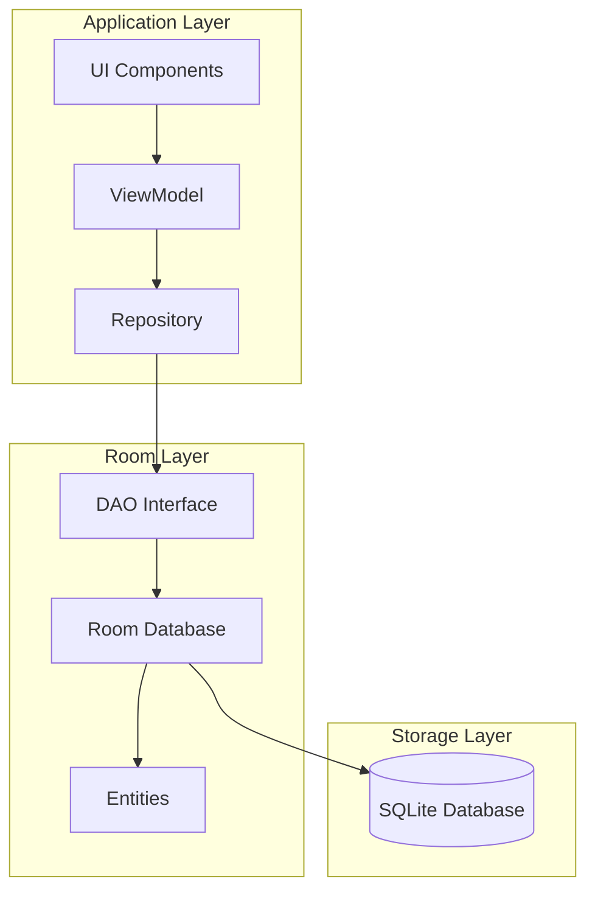
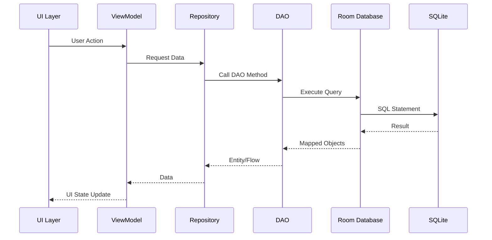
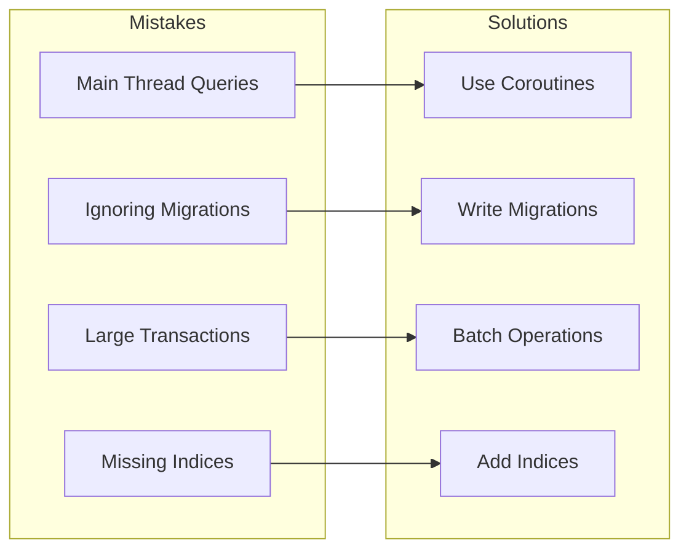

# How to Use Room Database with Kotlin

Author: [nawazdhandala](https://www.github.com/nawazdhandala)

Tags: Kotlin, Room, Android, Database, SQLite, Persistence, Coroutines, Flow

Description: A comprehensive guide to using Room Database in Android applications with Kotlin, covering entities, DAOs, database setup, migrations, and best practices for efficient local data persistence.

---

> Room provides an abstraction layer over SQLite, making database operations simpler while leveraging compile-time SQL validation. This guide walks you through building robust Android applications with Room and Kotlin.

Managing local data persistence in Android applications can be challenging. While SQLite is powerful, writing raw SQL queries and managing database connections manually is error-prone and verbose. Room, part of Android Jetpack, solves these problems by providing a clean abstraction layer that combines the power of SQLite with the safety of compile-time verification.

---

## What is Room Database?

Room is an official Android persistence library that provides:

- **Compile-time SQL verification** - Catch errors before runtime
- **Seamless integration** - Works with Kotlin coroutines and Flow
- **Migration support** - Handle schema changes gracefully
- **Type converters** - Store complex objects easily

---

## Room Architecture Overview



Room consists of three major components:

| Component | Purpose | Annotation |
|-----------|---------|------------|
| **Entity** | Represents a table in the database | `@Entity` |
| **DAO** | Contains methods to access the database | `@Dao` |
| **Database** | Holds the database and serves as access point | `@Database` |

---

## Project Setup

Before diving into code, you need to add Room dependencies to your project.

The following configuration adds Room with KSP (Kotlin Symbol Processing) for annotation processing, which is faster than KAPT.

```kotlin
// build.gradle.kts (Project level)
plugins {
    id("com.google.devtools.ksp") version "1.9.20-1.0.14" apply false
}
```

Add the Room dependencies and KSP plugin to your app-level build file.

```kotlin
// build.gradle.kts (App level)
plugins {
    id("com.google.devtools.ksp")
}

dependencies {
    val roomVersion = "2.6.1"

    // Room runtime library - required for all Room functionality
    implementation("androidx.room:room-runtime:$roomVersion")

    // KSP annotation processor - generates Room implementation code
    ksp("androidx.room:room-compiler:$roomVersion")

    // Kotlin Extensions and Coroutines support - enables suspend functions
    implementation("androidx.room:room-ktx:$roomVersion")

    // Optional: Paging 3 integration for large datasets
    implementation("androidx.room:room-paging:$roomVersion")
}
```

---

## Creating Entities

Entities define your database tables. Each entity class represents a table, and each property represents a column.

This entity defines a User table with an auto-generated primary key, required name field, and optional email field.

```kotlin
// User.kt
package com.example.app.data.entity

import androidx.room.Entity
import androidx.room.PrimaryKey
import androidx.room.ColumnInfo
import androidx.room.Index

// @Entity annotation marks this class as a database table
// tableName specifies the table name (defaults to class name if not provided)
// indices creates database indices for faster queries on specified columns
@Entity(
    tableName = "users",
    indices = [Index(value = ["email"], unique = true)]
)
data class User(
    // @PrimaryKey marks this as the primary key
    // autoGenerate = true lets Room auto-increment the ID
    @PrimaryKey(autoGenerate = true)
    val id: Long = 0,

    // @ColumnInfo customizes column properties
    // name specifies the column name in the database
    @ColumnInfo(name = "user_name")
    val name: String,

    // Nullable types in Kotlin translate to nullable columns
    val email: String? = null,

    // Default values work seamlessly with Room
    @ColumnInfo(name = "created_at")
    val createdAt: Long = System.currentTimeMillis(),

    // Boolean values are stored as integers (0 or 1)
    @ColumnInfo(name = "is_active", defaultValue = "1")
    val isActive: Boolean = true
)
```

### Entity Relationships

Room supports relationships between entities. Here is an example of a one-to-many relationship between users and posts.

This defines a Post entity that references a User through a foreign key relationship.

```kotlin
// Post.kt
package com.example.app.data.entity

import androidx.room.Entity
import androidx.room.PrimaryKey
import androidx.room.ForeignKey
import androidx.room.Index
import androidx.room.ColumnInfo

// Foreign key ensures referential integrity between tables
// onDelete = CASCADE means posts are deleted when the user is deleted
@Entity(
    tableName = "posts",
    foreignKeys = [
        ForeignKey(
            entity = User::class,
            parentColumns = ["id"],
            childColumns = ["user_id"],
            onDelete = ForeignKey.CASCADE
        )
    ],
    indices = [Index("user_id")]
)
data class Post(
    @PrimaryKey(autoGenerate = true)
    val id: Long = 0,

    @ColumnInfo(name = "user_id")
    val userId: Long,

    val title: String,

    val content: String,

    @ColumnInfo(name = "published_at")
    val publishedAt: Long = System.currentTimeMillis()
)
```

### Embedded Objects

For complex data structures, use @Embedded to include an object's fields directly in the table.

This approach flattens the Address object's fields into the User table, avoiding a separate table.

```kotlin
// Address.kt
package com.example.app.data.entity

// No @Entity annotation - this is an embedded object, not a table
data class Address(
    val street: String,
    val city: String,
    val state: String,
    @ColumnInfo(name = "zip_code")
    val zipCode: String,
    val country: String = "USA"
)

// UserWithAddress.kt
@Entity(tableName = "users_with_address")
data class UserWithAddress(
    @PrimaryKey(autoGenerate = true)
    val id: Long = 0,

    val name: String,

    // @Embedded includes all Address fields in this table
    // prefix adds a prefix to avoid column name conflicts
    @Embedded(prefix = "addr_")
    val address: Address
)
```

---

## Creating DAOs (Data Access Objects)

DAOs define the methods for accessing your database. Room generates the implementation at compile time.

This DAO provides all CRUD operations for the User entity using suspend functions for asynchronous execution.

```kotlin
// UserDao.kt
package com.example.app.data.dao

import androidx.room.Dao
import androidx.room.Insert
import androidx.room.Update
import androidx.room.Delete
import androidx.room.Query
import androidx.room.OnConflictStrategy
import androidx.room.Transaction
import androidx.room.Upsert
import kotlinx.coroutines.flow.Flow
import com.example.app.data.entity.User

// @Dao annotation marks this interface as a Data Access Object
@Dao
interface UserDao {

    // Insert operations
    // OnConflictStrategy.REPLACE replaces existing row on conflict
    // suspend makes this a coroutine function for async execution
    @Insert(onConflict = OnConflictStrategy.REPLACE)
    suspend fun insertUser(user: User): Long

    // Insert multiple users in a single transaction
    @Insert(onConflict = OnConflictStrategy.IGNORE)
    suspend fun insertUsers(users: List<User>): List<Long>

    // Upsert (insert or update) - available in Room 2.5+
    @Upsert
    suspend fun upsertUser(user: User)

    // Update operations
    // Returns the number of rows updated
    @Update
    suspend fun updateUser(user: User): Int

    // Delete operations
    // Returns the number of rows deleted
    @Delete
    suspend fun deleteUser(user: User): Int

    // Query operations with @Query annotation
    // Room verifies SQL at compile time
    @Query("SELECT * FROM users ORDER BY created_at DESC")
    suspend fun getAllUsers(): List<User>

    // Flow returns a reactive stream that emits updates automatically
    // Perfect for observing database changes in real-time
    @Query("SELECT * FROM users ORDER BY user_name ASC")
    fun observeAllUsers(): Flow<List<User>>

    // Parameterized queries use :paramName syntax
    @Query("SELECT * FROM users WHERE id = :userId")
    suspend fun getUserById(userId: Long): User?

    // Flow version for observing a single user
    @Query("SELECT * FROM users WHERE id = :userId")
    fun observeUserById(userId: Long): Flow<User?>

    // Search with LIKE operator
    // Note: % wildcards are part of the parameter, not the query
    @Query("SELECT * FROM users WHERE user_name LIKE :searchQuery")
    suspend fun searchUsers(searchQuery: String): List<User>

    // Count queries
    @Query("SELECT COUNT(*) FROM users")
    suspend fun getUserCount(): Int

    // Delete all users
    @Query("DELETE FROM users")
    suspend fun deleteAllUsers()

    // Conditional delete
    @Query("DELETE FROM users WHERE is_active = 0")
    suspend fun deleteInactiveUsers(): Int

    // Update specific fields
    @Query("UPDATE users SET is_active = :isActive WHERE id = :userId")
    suspend fun updateUserActiveStatus(userId: Long, isActive: Boolean): Int
}
```

### Complex Queries with Relationships

For queries that span multiple tables, create data classes to hold the combined results.

This approach returns a user along with all their posts in a single query.

```kotlin
// UserWithPosts.kt
package com.example.app.data.entity

import androidx.room.Embedded
import androidx.room.Relation

// This class represents a User with all their Posts
// It is not an @Entity - it is used for query results only
data class UserWithPosts(
    // @Embedded includes all User fields
    @Embedded
    val user: User,

    // @Relation defines the one-to-many relationship
    // parentColumn is the User's primary key
    // entityColumn is the Post's foreign key
    @Relation(
        parentColumn = "id",
        entityColumn = "user_id"
    )
    val posts: List<Post>
)

// UserDao.kt - Add this method
@Dao
interface UserDao {
    // ... previous methods ...

    // @Transaction ensures both queries run in a single transaction
    // This is required when using @Relation
    @Transaction
    @Query("SELECT * FROM users WHERE id = :userId")
    suspend fun getUserWithPosts(userId: Long): UserWithPosts?

    @Transaction
    @Query("SELECT * FROM users")
    fun observeUsersWithPosts(): Flow<List<UserWithPosts>>
}
```

---

## Creating the Database

The database class ties everything together. It must be abstract and extend RoomDatabase.

This singleton pattern ensures only one database instance exists throughout the app lifecycle.

```kotlin
// AppDatabase.kt
package com.example.app.data

import android.content.Context
import androidx.room.Database
import androidx.room.Room
import androidx.room.RoomDatabase
import androidx.room.TypeConverters
import com.example.app.data.dao.UserDao
import com.example.app.data.dao.PostDao
import com.example.app.data.entity.User
import com.example.app.data.entity.Post
import com.example.app.data.converter.Converters

// @Database annotation configures the database
// entities lists all tables in the database
// version is incremented when schema changes
// exportSchema saves schema to a file for migration validation
@Database(
    entities = [User::class, Post::class],
    version = 1,
    exportSchema = true
)
@TypeConverters(Converters::class)
abstract class AppDatabase : RoomDatabase() {

    // Abstract methods return DAO instances
    // Room generates the implementations
    abstract fun userDao(): UserDao
    abstract fun postDao(): PostDao

    companion object {
        // Volatile ensures visibility across threads
        @Volatile
        private var INSTANCE: AppDatabase? = null

        // Singleton pattern with double-checked locking
        fun getInstance(context: Context): AppDatabase {
            // Return existing instance if available
            return INSTANCE ?: synchronized(this) {
                // Double-check inside synchronized block
                INSTANCE ?: buildDatabase(context).also { INSTANCE = it }
            }
        }

        private fun buildDatabase(context: Context): AppDatabase {
            return Room.databaseBuilder(
                context.applicationContext,
                AppDatabase::class.java,
                "app_database"
            )
            // Enable destructive migrations during development only
            // Remove this in production and use proper migrations
            .fallbackToDestructiveMigration()
            .build()
        }
    }
}
```

---

## Type Converters

Room only supports primitive types by default. Use TypeConverters to store complex objects.

This converter allows storing Date objects and Lists of strings in the database.

```kotlin
// Converters.kt
package com.example.app.data.converter

import androidx.room.TypeConverter
import java.util.Date
import com.google.gson.Gson
import com.google.gson.reflect.TypeToken

class Converters {

    // Convert Date to Long for storage
    @TypeConverter
    fun fromTimestamp(value: Long?): Date? {
        return value?.let { Date(it) }
    }

    // Convert Long back to Date when reading
    @TypeConverter
    fun dateToTimestamp(date: Date?): Long? {
        return date?.time
    }

    // Convert List<String> to JSON string for storage
    @TypeConverter
    fun fromStringList(value: List<String>?): String? {
        return value?.let { Gson().toJson(it) }
    }

    // Convert JSON string back to List<String>
    @TypeConverter
    fun toStringList(value: String?): List<String>? {
        return value?.let {
            val type = object : TypeToken<List<String>>() {}.type
            Gson().fromJson(it, type)
        }
    }

    // Convert enum to string
    @TypeConverter
    fun fromUserStatus(status: UserStatus): String {
        return status.name
    }

    // Convert string back to enum
    @TypeConverter
    fun toUserStatus(value: String): UserStatus {
        return UserStatus.valueOf(value)
    }
}

// UserStatus enum for type converter example
enum class UserStatus {
    ACTIVE,
    INACTIVE,
    PENDING,
    BANNED
}
```

---

## Repository Pattern

The repository abstracts data sources from the rest of the application. This provides a clean API for data access.

This repository handles all user-related data operations and can easily be extended to include remote data sources.

```kotlin
// UserRepository.kt
package com.example.app.data.repository

import kotlinx.coroutines.flow.Flow
import com.example.app.data.dao.UserDao
import com.example.app.data.entity.User
import com.example.app.data.entity.UserWithPosts

class UserRepository(private val userDao: UserDao) {

    // Expose Flow for reactive UI updates
    val allUsers: Flow<List<User>> = userDao.observeAllUsers()

    // Create a new user and return the generated ID
    suspend fun createUser(name: String, email: String?): Long {
        val user = User(name = name, email = email)
        return userDao.insertUser(user)
    }

    // Get a specific user by ID
    suspend fun getUser(userId: Long): User? {
        return userDao.getUserById(userId)
    }

    // Observe a specific user for real-time updates
    fun observeUser(userId: Long): Flow<User?> {
        return userDao.observeUserById(userId)
    }

    // Update an existing user
    suspend fun updateUser(user: User): Boolean {
        return userDao.updateUser(user) > 0
    }

    // Delete a user
    suspend fun deleteUser(user: User): Boolean {
        return userDao.deleteUser(user) > 0
    }

    // Search users by name
    suspend fun searchUsers(query: String): List<User> {
        // Add wildcards for partial matching
        return userDao.searchUsers("%$query%")
    }

    // Get user with all their posts
    suspend fun getUserWithPosts(userId: Long): UserWithPosts? {
        return userDao.getUserWithPosts(userId)
    }

    // Deactivate a user
    suspend fun deactivateUser(userId: Long): Boolean {
        return userDao.updateUserActiveStatus(userId, false) > 0
    }
}
```

---

## Database Flow



---

## ViewModel Integration

The ViewModel connects your UI to the repository and manages UI state.

This ViewModel uses StateFlow for state management and handles all user-related operations.

```kotlin
// UserViewModel.kt
package com.example.app.ui.viewmodel

import androidx.lifecycle.ViewModel
import androidx.lifecycle.ViewModelProvider
import androidx.lifecycle.viewModelScope
import kotlinx.coroutines.flow.MutableStateFlow
import kotlinx.coroutines.flow.StateFlow
import kotlinx.coroutines.flow.asStateFlow
import kotlinx.coroutines.flow.catch
import kotlinx.coroutines.launch
import com.example.app.data.entity.User
import com.example.app.data.repository.UserRepository

// Sealed class for UI state management
sealed class UserUiState {
    object Loading : UserUiState()
    data class Success(val users: List<User>) : UserUiState()
    data class Error(val message: String) : UserUiState()
}

class UserViewModel(private val repository: UserRepository) : ViewModel() {

    // Private mutable state
    private val _uiState = MutableStateFlow<UserUiState>(UserUiState.Loading)

    // Public immutable state for UI observation
    val uiState: StateFlow<UserUiState> = _uiState.asStateFlow()

    // Selected user for detail view
    private val _selectedUser = MutableStateFlow<User?>(null)
    val selectedUser: StateFlow<User?> = _selectedUser.asStateFlow()

    init {
        // Start observing users when ViewModel is created
        observeUsers()
    }

    private fun observeUsers() {
        viewModelScope.launch {
            repository.allUsers
                .catch { exception ->
                    _uiState.value = UserUiState.Error(
                        exception.message ?: "Unknown error occurred"
                    )
                }
                .collect { users ->
                    _uiState.value = UserUiState.Success(users)
                }
        }
    }

    fun createUser(name: String, email: String?) {
        viewModelScope.launch {
            try {
                repository.createUser(name, email)
                // No need to manually refresh - Flow handles it
            } catch (e: Exception) {
                _uiState.value = UserUiState.Error(e.message ?: "Failed to create user")
            }
        }
    }

    fun selectUser(userId: Long) {
        viewModelScope.launch {
            _selectedUser.value = repository.getUser(userId)
        }
    }

    fun updateUser(user: User) {
        viewModelScope.launch {
            try {
                repository.updateUser(user)
            } catch (e: Exception) {
                _uiState.value = UserUiState.Error(e.message ?: "Failed to update user")
            }
        }
    }

    fun deleteUser(user: User) {
        viewModelScope.launch {
            try {
                repository.deleteUser(user)
            } catch (e: Exception) {
                _uiState.value = UserUiState.Error(e.message ?: "Failed to delete user")
            }
        }
    }

    fun searchUsers(query: String) {
        viewModelScope.launch {
            try {
                val results = repository.searchUsers(query)
                _uiState.value = UserUiState.Success(results)
            } catch (e: Exception) {
                _uiState.value = UserUiState.Error(e.message ?: "Search failed")
            }
        }
    }
}

// ViewModelFactory for dependency injection
class UserViewModelFactory(
    private val repository: UserRepository
) : ViewModelProvider.Factory {

    @Suppress("UNCHECKED_CAST")
    override fun <T : ViewModel> create(modelClass: Class<T>): T {
        if (modelClass.isAssignableFrom(UserViewModel::class.java)) {
            return UserViewModel(repository) as T
        }
        throw IllegalArgumentException("Unknown ViewModel class")
    }
}
```

---

## Database Migrations

When your schema changes, you need migrations to preserve user data.

This migration adds a new column to the users table without losing existing data.

```kotlin
// Migrations.kt
package com.example.app.data.migration

import androidx.room.migration.Migration
import androidx.sqlite.db.SupportSQLiteDatabase

// Migration from version 1 to version 2
// Adding a 'profile_image' column to users table
val MIGRATION_1_2 = object : Migration(1, 2) {
    override fun migrate(database: SupportSQLiteDatabase) {
        // Add new column with default value
        database.execSQL(
            "ALTER TABLE users ADD COLUMN profile_image TEXT DEFAULT NULL"
        )
    }
}

// Migration from version 2 to version 3
// Adding an index for better query performance
val MIGRATION_2_3 = object : Migration(2, 3) {
    override fun migrate(database: SupportSQLiteDatabase) {
        // Create index on created_at for faster sorting
        database.execSQL(
            "CREATE INDEX IF NOT EXISTS index_users_created_at ON users(created_at)"
        )
    }
}

// Complex migration - creating a new table
val MIGRATION_3_4 = object : Migration(3, 4) {
    override fun migrate(database: SupportSQLiteDatabase) {
        // Create new tags table
        database.execSQL("""
            CREATE TABLE IF NOT EXISTS tags (
                id INTEGER PRIMARY KEY AUTOINCREMENT NOT NULL,
                name TEXT NOT NULL,
                color TEXT NOT NULL DEFAULT '#000000'
            )
        """)

        // Create junction table for many-to-many relationship
        database.execSQL("""
            CREATE TABLE IF NOT EXISTS user_tags (
                user_id INTEGER NOT NULL,
                tag_id INTEGER NOT NULL,
                PRIMARY KEY(user_id, tag_id),
                FOREIGN KEY(user_id) REFERENCES users(id) ON DELETE CASCADE,
                FOREIGN KEY(tag_id) REFERENCES tags(id) ON DELETE CASCADE
            )
        """)
    }
}
```

Apply migrations when building the database.

```kotlin
// AppDatabase.kt - Updated buildDatabase method
private fun buildDatabase(context: Context): AppDatabase {
    return Room.databaseBuilder(
        context.applicationContext,
        AppDatabase::class.java,
        "app_database"
    )
    // Add all migrations in order
    .addMigrations(MIGRATION_1_2, MIGRATION_2_3, MIGRATION_3_4)
    // For testing, you can add a callback
    .addCallback(object : RoomDatabase.Callback() {
        override fun onCreate(db: SupportSQLiteDatabase) {
            super.onCreate(db)
            // Database created for the first time
            // Seed initial data if needed
        }

        override fun onOpen(db: SupportSQLiteDatabase) {
            super.onOpen(db)
            // Database opened
        }
    })
    .build()
}
```

---

## Testing Room Database

Room provides testing utilities for verifying your database implementation.

These tests verify that your DAO methods work correctly with an in-memory database.

```kotlin
// UserDaoTest.kt
package com.example.app.data.dao

import android.content.Context
import androidx.room.Room
import androidx.test.core.app.ApplicationProvider
import androidx.test.ext.junit.runners.AndroidJUnit4
import kotlinx.coroutines.flow.first
import kotlinx.coroutines.runBlocking
import org.junit.After
import org.junit.Before
import org.junit.Test
import org.junit.runner.RunWith
import org.junit.Assert.*
import com.example.app.data.AppDatabase
import com.example.app.data.entity.User
import java.io.IOException

@RunWith(AndroidJUnit4::class)
class UserDaoTest {

    private lateinit var userDao: UserDao
    private lateinit var database: AppDatabase

    @Before
    fun createDatabase() {
        // Use in-memory database for testing
        // Data is not persisted after tests
        val context = ApplicationProvider.getApplicationContext<Context>()
        database = Room.inMemoryDatabaseBuilder(
            context,
            AppDatabase::class.java
        )
        // Allow main thread queries for testing only
        .allowMainThreadQueries()
        .build()

        userDao = database.userDao()
    }

    @After
    @Throws(IOException::class)
    fun closeDatabase() {
        database.close()
    }

    @Test
    fun insertUser_returnsGeneratedId() = runBlocking {
        // Given a new user
        val user = User(name = "John Doe", email = "john@example.com")

        // When inserting the user
        val id = userDao.insertUser(user)

        // Then the returned ID should be positive
        assertTrue(id > 0)
    }

    @Test
    fun getUserById_returnsCorrectUser() = runBlocking {
        // Given an inserted user
        val user = User(name = "Jane Doe", email = "jane@example.com")
        val id = userDao.insertUser(user)

        // When retrieving the user by ID
        val retrievedUser = userDao.getUserById(id)

        // Then the retrieved user should match
        assertNotNull(retrievedUser)
        assertEquals("Jane Doe", retrievedUser?.name)
        assertEquals("jane@example.com", retrievedUser?.email)
    }

    @Test
    fun observeAllUsers_emitsUpdates() = runBlocking {
        // Given an empty database
        val initialUsers = userDao.observeAllUsers().first()
        assertTrue(initialUsers.isEmpty())

        // When inserting a user
        userDao.insertUser(User(name = "Test User"))

        // Then the Flow should emit the updated list
        val updatedUsers = userDao.observeAllUsers().first()
        assertEquals(1, updatedUsers.size)
        assertEquals("Test User", updatedUsers[0].name)
    }

    @Test
    fun updateUser_modifiesExistingRecord() = runBlocking {
        // Given an inserted user
        val user = User(name = "Original Name")
        val id = userDao.insertUser(user)

        // When updating the user
        val updatedUser = user.copy(id = id, name = "Updated Name")
        val rowsAffected = userDao.updateUser(updatedUser)

        // Then one row should be affected
        assertEquals(1, rowsAffected)

        // And the user should have the new name
        val retrievedUser = userDao.getUserById(id)
        assertEquals("Updated Name", retrievedUser?.name)
    }

    @Test
    fun deleteUser_removesRecord() = runBlocking {
        // Given an inserted user
        val user = User(name = "To Be Deleted")
        val id = userDao.insertUser(user)

        // When deleting the user
        val userToDelete = userDao.getUserById(id)!!
        val rowsDeleted = userDao.deleteUser(userToDelete)

        // Then one row should be deleted
        assertEquals(1, rowsDeleted)

        // And the user should no longer exist
        assertNull(userDao.getUserById(id))
    }

    @Test
    fun searchUsers_findsByPartialName() = runBlocking {
        // Given multiple users
        userDao.insertUser(User(name = "John Smith"))
        userDao.insertUser(User(name = "Jane Smith"))
        userDao.insertUser(User(name = "Bob Johnson"))

        // When searching for "Smith"
        val results = userDao.searchUsers("%Smith%")

        // Then only matching users should be returned
        assertEquals(2, results.size)
        assertTrue(results.all { it.name.contains("Smith") })
    }
}
```

### Testing Migrations

Test your migrations to ensure data is preserved correctly.

```kotlin
// MigrationTest.kt
package com.example.app.data.migration

import androidx.room.testing.MigrationTestHelper
import androidx.sqlite.db.framework.FrameworkSQLiteOpenHelperFactory
import androidx.test.ext.junit.runners.AndroidJUnit4
import androidx.test.platform.app.InstrumentationRegistry
import org.junit.Rule
import org.junit.Test
import org.junit.runner.RunWith
import com.example.app.data.AppDatabase
import java.io.IOException

@RunWith(AndroidJUnit4::class)
class MigrationTest {

    private val testDatabaseName = "migration-test"

    // MigrationTestHelper helps test Room migrations
    @get:Rule
    val helper: MigrationTestHelper = MigrationTestHelper(
        InstrumentationRegistry.getInstrumentation(),
        AppDatabase::class.java.canonicalName,
        FrameworkSQLiteOpenHelperFactory()
    )

    @Test
    @Throws(IOException::class)
    fun migrate1To2() {
        // Create database with version 1 schema
        helper.createDatabase(testDatabaseName, 1).apply {
            // Insert test data using SQL
            execSQL("""
                INSERT INTO users (user_name, email, created_at, is_active)
                VALUES ('Test User', 'test@example.com', ${System.currentTimeMillis()}, 1)
            """)
            close()
        }

        // Run migration and validate
        helper.runMigrationsAndValidate(
            testDatabaseName,
            2,
            true,
            MIGRATION_1_2
        )

        // Verify data is preserved and new column exists
        val database = helper.runMigrationsAndValidate(
            testDatabaseName,
            2,
            true,
            MIGRATION_1_2
        )

        val cursor = database.query("SELECT * FROM users WHERE user_name = 'Test User'")
        assertTrue(cursor.moveToFirst())

        // New column should exist and be null
        val profileImageIndex = cursor.getColumnIndex("profile_image")
        assertTrue(profileImageIndex >= 0)
        assertTrue(cursor.isNull(profileImageIndex))

        cursor.close()
    }
}
```

---

## Best Practices

### 1. Use Flow for Reactive Updates

Room's Flow support provides automatic UI updates when data changes.

```kotlin
// Prefer this approach for lists that need real-time updates
@Query("SELECT * FROM users")
fun observeAllUsers(): Flow<List<User>>

// Instead of manually refreshing
@Query("SELECT * FROM users")
suspend fun getAllUsers(): List<User>
```

### 2. Keep DAOs Focused

Create separate DAOs for different entities rather than one large DAO.

```kotlin
// Good - separate DAOs for each entity
@Dao
interface UserDao { /* user operations */ }

@Dao
interface PostDao { /* post operations */ }

// Avoid - one massive DAO for everything
@Dao
interface AppDao { /* all operations mixed together */ }
```

### 3. Use Transactions for Batch Operations

Wrap multiple operations in transactions for atomicity and performance.

```kotlin
@Dao
interface UserDao {
    @Transaction
    suspend fun replaceAllUsers(users: List<User>) {
        deleteAllUsers()
        insertUsers(users)
    }

    @Query("DELETE FROM users")
    suspend fun deleteAllUsers()

    @Insert
    suspend fun insertUsers(users: List<User>)
}
```

### 4. Handle Null Safely

Use Kotlin's null safety features with Room.

```kotlin
// Nullable return for queries that might not find data
@Query("SELECT * FROM users WHERE id = :id")
suspend fun getUserById(id: Long): User?

// In repository, handle nulls appropriately
suspend fun getUser(id: Long): User {
    return userDao.getUserById(id)
        ?: throw UserNotFoundException("User with id $id not found")
}
```

### 5. Index Frequently Queried Columns

Add indices to columns used in WHERE clauses and JOIN conditions.

```kotlin
@Entity(
    tableName = "users",
    indices = [
        Index(value = ["email"], unique = true),
        Index(value = ["created_at"]),
        Index(value = ["is_active", "created_at"])
    ]
)
data class User(/* ... */)
```

### 6. Use Proper OnConflictStrategy

Choose the right conflict strategy for your use case.

```kotlin
// REPLACE - delete existing row and insert new one
@Insert(onConflict = OnConflictStrategy.REPLACE)
suspend fun insertOrReplace(user: User): Long

// IGNORE - keep existing row, ignore new one
@Insert(onConflict = OnConflictStrategy.IGNORE)
suspend fun insertIfNotExists(user: User): Long

// ABORT (default) - cancel operation on conflict
@Insert(onConflict = OnConflictStrategy.ABORT)
suspend fun insertStrict(user: User): Long
```

---

## Common Pitfalls to Avoid



| Pitfall | Why It's Bad | Solution |
|---------|--------------|----------|
| Main thread queries | Blocks UI, causes ANR | Use suspend functions with coroutines |
| Ignoring migrations | Data loss on updates | Always write migrations |
| Large transactions | Memory issues | Batch in chunks of 500-1000 |
| Missing indices | Slow queries | Index WHERE/JOIN columns |
| Not closing cursor | Memory leaks | Room handles this - use built-in methods |
| Storing large blobs | Performance issues | Store file paths instead |

---

## Performance Tips

### Batch Insert Large Datasets

When inserting thousands of records, batch them to avoid memory issues.

```kotlin
// Insert in batches of 500
suspend fun insertUsersInBatches(users: List<User>) {
    users.chunked(500).forEach { batch ->
        userDao.insertUsers(batch)
    }
}
```

### Use Paging for Large Lists

Room integrates with Paging 3 for efficient large dataset handling.

```kotlin
// In DAO
@Query("SELECT * FROM users ORDER BY created_at DESC")
fun getUsersPagingSource(): PagingSource<Int, User>

// In Repository
fun getUsersPager(): Pager<Int, User> {
    return Pager(
        config = PagingConfig(
            pageSize = 20,
            enablePlaceholders = false
        ),
        pagingSourceFactory = { userDao.getUsersPagingSource() }
    )
}
```

---

## Conclusion

Room Database provides a powerful yet simple way to handle local data persistence in Android applications. By leveraging Kotlin's features like coroutines, Flow, and null safety, Room enables you to write clean, maintainable data access code.

Key takeaways:

- **Entities** define your database schema with compile-time validation
- **DAOs** provide type-safe database operations
- **Flow** enables reactive UI updates automatically
- **Migrations** preserve user data across schema changes
- **Repository pattern** abstracts data sources for cleaner architecture

With these patterns and best practices, you can build robust Android applications with reliable local data storage.

---

*Need to monitor your Android application's performance? [OneUptime](https://oneuptime.com) provides comprehensive monitoring solutions for mobile applications, including crash reporting and performance tracking.*

**Related Reading:**
- [How to Implement Dependency Injection in Android with Hilt](https://oneuptime.com/blog/post/android-hilt-dependency-injection)
- [How to Use Kotlin Coroutines for Background Tasks](https://oneuptime.com/blog/post/kotlin-coroutines-guide)
