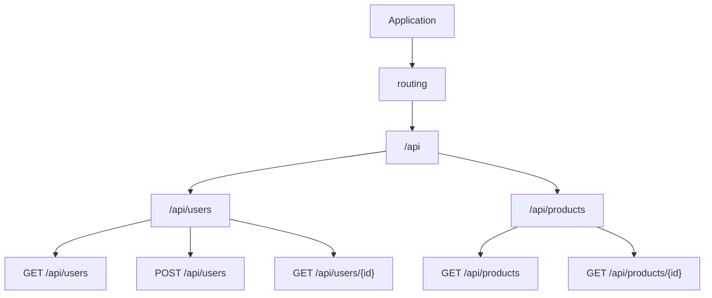

# How to Configure Ktor Server with Routing

Author: [nawazdhandala](https://www.github.com/nawazdhandala)

Tags: Kotlin, Ktor, Web Server, Routing, Backend

Description: Learn how to set up a Ktor server with routing, including route organization, parameter handling, authentication, and best practices for building scalable APIs.

---

Ktor is a lightweight, asynchronous framework for building web applications in Kotlin. Unlike heavier frameworks, Ktor gives you flexibility to add only what you need. Routing is at the core of any Ktor application, and understanding how to structure it properly makes the difference between a maintainable codebase and a tangled mess.

## Getting Started with Ktor

### Project Setup

First, add the Ktor dependencies to your `build.gradle.kts`:

```kotlin
plugins {
    kotlin("jvm") version "1.9.22"
    id("io.ktor.plugin") version "2.3.7"
    kotlin("plugin.serialization") version "1.9.22"
}

dependencies {
    // Ktor server core
    implementation("io.ktor:ktor-server-core-jvm")
    implementation("io.ktor:ktor-server-netty-jvm")

    // Content negotiation for JSON
    implementation("io.ktor:ktor-server-content-negotiation-jvm")
    implementation("io.ktor:ktor-serialization-kotlinx-json-jvm")

    // Status pages for error handling
    implementation("io.ktor:ktor-server-status-pages-jvm")

    // Authentication
    implementation("io.ktor:ktor-server-auth-jvm")
    implementation("io.ktor:ktor-server-auth-jwt-jvm")

    // Logging
    implementation("ch.qos.logback:logback-classic:1.4.14")

    // Testing
    testImplementation("io.ktor:ktor-server-tests-jvm")
    testImplementation("org.jetbrains.kotlin:kotlin-test-junit:1.9.22")
}
```

### Basic Server Configuration

Create your main application file with a simple server setup:

```kotlin
// Application.kt
package com.example

import io.ktor.server.application.*
import io.ktor.server.engine.*
import io.ktor.server.netty.*
import io.ktor.server.response.*
import io.ktor.server.routing.*

fun main() {
    // Create and start the Netty server on port 8080
    embeddedServer(Netty, port = 8080, host = "0.0.0.0") {
        // Configure the application module
        module()
    }.start(wait = true)
}

// Application module - this is where you configure plugins and routes
fun Application.module() {
    configureRouting()
}

// Separate function for routing configuration
fun Application.configureRouting() {
    routing {
        // Root endpoint
        get("/") {
            call.respondText("Hello, Ktor!")
        }

        // Health check endpoint
        get("/health") {
            call.respondText("OK")
        }
    }
}
```

## Understanding Ktor Routing

### Route Structure

Ktor routing follows a hierarchical structure where routes can be nested. This diagram shows how routes are organized:



### HTTP Methods

Ktor provides DSL functions for all standard HTTP methods:

```kotlin
fun Application.configureRouting() {
    routing {
        // GET - Retrieve resources
        get("/users") {
            call.respondText("List of users")
        }

        // POST - Create new resources
        post("/users") {
            call.respondText("User created", status = HttpStatusCode.Created)
        }

        // PUT - Replace entire resource
        put("/users/{id}") {
            val id = call.parameters["id"]
            call.respondText("User $id replaced")
        }

        // PATCH - Partial update
        patch("/users/{id}") {
            val id = call.parameters["id"]
            call.respondText("User $id updated")
        }

        // DELETE - Remove resource
        delete("/users/{id}") {
            val id = call.parameters["id"]
            call.respondText("User $id deleted", status = HttpStatusCode.NoContent)
        }

        // HEAD - Same as GET but without body
        head("/users") {
            call.response.status(HttpStatusCode.OK)
        }

        // OPTIONS - Describe communication options
        options("/users") {
            call.response.header("Allow", "GET, POST, PUT, DELETE")
            call.respond(HttpStatusCode.OK)
        }
    }
}
```

## Route Parameters

### Path Parameters

Extract values from the URL path using curly braces:

```kotlin
routing {
    // Single path parameter
    get("/users/{id}") {
        // Extract the 'id' parameter from the path
        val userId = call.parameters["id"]
            ?: return@get call.respondText(
                "Missing user ID",
                status = HttpStatusCode.BadRequest
            )

        call.respondText("User ID: $userId")
    }

    // Multiple path parameters
    get("/organizations/{orgId}/teams/{teamId}/members") {
        val orgId = call.parameters["orgId"]
        val teamId = call.parameters["teamId"]

        call.respondText("Org: $orgId, Team: $teamId")
    }

    // Optional path parameter with wildcard
    get("/files/{path...}") {
        // Captures everything after /files/
        val path = call.parameters.getAll("path")?.joinToString("/")
        call.respondText("File path: $path")
    }
}
```

### Query Parameters

Handle query string parameters for filtering and pagination:

```kotlin
routing {
    get("/users") {
        // Extract query parameters with defaults
        val page = call.request.queryParameters["page"]?.toIntOrNull() ?: 1
        val limit = call.request.queryParameters["limit"]?.toIntOrNull() ?: 10
        val sortBy = call.request.queryParameters["sortBy"] ?: "createdAt"
        val order = call.request.queryParameters["order"] ?: "desc"

        // Multiple values for the same parameter (e.g., ?status=active&status=pending)
        val statuses = call.request.queryParameters.getAll("status") ?: emptyList()

        call.respondText(
            "Page: $page, Limit: $limit, Sort: $sortBy $order, Statuses: $statuses"
        )
    }
}
```

## JSON Serialization

### Setting Up Content Negotiation

Configure JSON serialization using kotlinx.serialization:

```kotlin
import io.ktor.serialization.kotlinx.json.*
import io.ktor.server.plugins.contentnegotiation.*
import kotlinx.serialization.json.Json

fun Application.configureSerialization() {
    install(ContentNegotiation) {
        json(Json {
            // Pretty print JSON responses
            prettyPrint = true
            // Don't fail on unknown keys in requests
            ignoreUnknownKeys = true
            // Include default values in serialization
            encodeDefaults = true
        })
    }
}
```

### Data Classes and Request/Response Handling

Define your data models and handle JSON bodies:

```kotlin
import kotlinx.serialization.Serializable

// Data models
@Serializable
data class User(
    val id: Long? = null,
    val name: String,
    val email: String,
    val role: String = "user"
)

@Serializable
data class CreateUserRequest(
    val name: String,
    val email: String,
    val password: String
)

@Serializable
data class ApiResponse<T>(
    val success: Boolean,
    val data: T? = null,
    val error: String? = null
)

// Routes with JSON handling
fun Application.configureUserRoutes() {
    routing {
        route("/api/users") {
            // GET all users - returns JSON array
            get {
                val users = listOf(
                    User(1, "Alice", "alice@example.com"),
                    User(2, "Bob", "bob@example.com")
                )
                call.respond(ApiResponse(success = true, data = users))
            }

            // GET single user - returns JSON object
            get("/{id}") {
                val id = call.parameters["id"]?.toLongOrNull()
                    ?: return@get call.respond(
                        HttpStatusCode.BadRequest,
                        ApiResponse<User>(success = false, error = "Invalid user ID")
                    )

                // Simulate database lookup
                val user = User(id, "Alice", "alice@example.com")
                call.respond(ApiResponse(success = true, data = user))
            }

            // POST - create user from JSON body
            post {
                // Receive and deserialize JSON body
                val request = call.receive<CreateUserRequest>()

                // Create user (simulate database insert)
                val newUser = User(
                    id = 1,
                    name = request.name,
                    email = request.email
                )

                call.respond(
                    HttpStatusCode.Created,
                    ApiResponse(success = true, data = newUser)
                )
            }
        }
    }
}
```

## Route Organization

### Grouping Routes with route()

Organize related routes under common prefixes:

```kotlin
fun Application.configureRouting() {
    routing {
        // API version prefix
        route("/api/v1") {
            // User routes
            route("/users") {
                get { /* list users */ }
                post { /* create user */ }

                route("/{id}") {
                    get { /* get user by id */ }
                    put { /* update user */ }
                    delete { /* delete user */ }

                    // Nested resources
                    route("/orders") {
                        get { /* get user's orders */ }
                    }
                }
            }

            // Product routes
            route("/products") {
                get { /* list products */ }
                get("/{id}") { /* get product */ }
            }
        }
    }
}
```

### Modular Route Files

For larger applications, split routes into separate files:

```kotlin
// routes/UserRoutes.kt
package com.example.routes

import io.ktor.server.application.*
import io.ktor.server.response.*
import io.ktor.server.routing.*

fun Route.userRoutes() {
    route("/users") {
        get {
            call.respondText("List users")
        }

        post {
            call.respondText("Create user")
        }

        route("/{id}") {
            get {
                val id = call.parameters["id"]
                call.respondText("Get user $id")
            }

            put {
                val id = call.parameters["id"]
                call.respondText("Update user $id")
            }

            delete {
                val id = call.parameters["id"]
                call.respondText("Delete user $id")
            }
        }
    }
}
```

```kotlin
// routes/ProductRoutes.kt
package com.example.routes

import io.ktor.server.application.*
import io.ktor.server.response.*
import io.ktor.server.routing.*

fun Route.productRoutes() {
    route("/products") {
        get {
            call.respondText("List products")
        }

        get("/{id}") {
            val id = call.parameters["id"]
            call.respondText("Get product $id")
        }
    }
}
```

```kotlin
// Application.kt - combine all routes
package com.example

import com.example.routes.productRoutes
import com.example.routes.userRoutes
import io.ktor.server.application.*
import io.ktor.server.routing.*

fun Application.configureRouting() {
    routing {
        route("/api/v1") {
            // Include route modules
            userRoutes()
            productRoutes()
        }
    }
}
```

## Error Handling

### Status Pages Plugin

Handle exceptions and return proper error responses:

```kotlin
import io.ktor.server.plugins.statuspages.*

@Serializable
data class ErrorResponse(
    val success: Boolean = false,
    val error: String,
    val code: String? = null
)

// Custom exceptions
class NotFoundException(message: String) : Exception(message)
class ValidationException(message: String) : Exception(message)
class UnauthorizedException(message: String) : Exception(message)

fun Application.configureStatusPages() {
    install(StatusPages) {
        // Handle specific exceptions
        exception<NotFoundException> { call, cause ->
            call.respond(
                HttpStatusCode.NotFound,
                ErrorResponse(error = cause.message ?: "Resource not found", code = "NOT_FOUND")
            )
        }

        exception<ValidationException> { call, cause ->
            call.respond(
                HttpStatusCode.BadRequest,
                ErrorResponse(error = cause.message ?: "Validation failed", code = "VALIDATION_ERROR")
            )
        }

        exception<UnauthorizedException> { call, cause ->
            call.respond(
                HttpStatusCode.Unauthorized,
                ErrorResponse(error = cause.message ?: "Unauthorized", code = "UNAUTHORIZED")
            )
        }

        // Handle JSON parsing errors
        exception<ContentTransformationException> { call, cause ->
            call.respond(
                HttpStatusCode.BadRequest,
                ErrorResponse(error = "Invalid request body", code = "INVALID_JSON")
            )
        }

        // Catch-all for unexpected errors
        exception<Throwable> { call, cause ->
            call.application.log.error("Unhandled exception", cause)
            call.respond(
                HttpStatusCode.InternalServerError,
                ErrorResponse(error = "Internal server error", code = "INTERNAL_ERROR")
            )
        }

        // Handle HTTP status codes
        status(HttpStatusCode.NotFound) { call, status ->
            call.respond(
                status,
                ErrorResponse(error = "Endpoint not found", code = "ENDPOINT_NOT_FOUND")
            )
        }
    }
}
```

### Using Exceptions in Routes

```kotlin
fun Route.userRoutes(userRepository: UserRepository) {
    route("/users") {
        get("/{id}") {
            val id = call.parameters["id"]?.toLongOrNull()
                ?: throw ValidationException("Invalid user ID format")

            val user = userRepository.findById(id)
                ?: throw NotFoundException("User with ID $id not found")

            call.respond(ApiResponse(success = true, data = user))
        }
    }
}
```

## Authentication

### JWT Authentication Setup

Protect routes with JWT tokens:

```kotlin
import io.ktor.server.auth.*
import io.ktor.server.auth.jwt.*
import com.auth0.jwt.JWT
import com.auth0.jwt.algorithms.Algorithm

fun Application.configureSecurity() {
    val jwtSecret = environment.config.property("jwt.secret").getString()
    val jwtIssuer = environment.config.property("jwt.issuer").getString()
    val jwtAudience = environment.config.property("jwt.audience").getString()
    val jwtRealm = environment.config.property("jwt.realm").getString()

    install(Authentication) {
        jwt("auth-jwt") {
            realm = jwtRealm

            verifier(
                JWT.require(Algorithm.HMAC256(jwtSecret))
                    .withAudience(jwtAudience)
                    .withIssuer(jwtIssuer)
                    .build()
            )

            validate { credential ->
                // Extract claims and create principal
                if (credential.payload.audience.contains(jwtAudience)) {
                    JWTPrincipal(credential.payload)
                } else {
                    null
                }
            }

            challenge { defaultScheme, realm ->
                call.respond(
                    HttpStatusCode.Unauthorized,
                    ErrorResponse(error = "Token is invalid or expired")
                )
            }
        }
    }
}
```

### Protected Routes

```kotlin
fun Application.configureRouting() {
    routing {
        // Public routes
        route("/api/v1") {
            post("/auth/login") {
                // Login logic - generate JWT token
            }

            post("/auth/register") {
                // Registration logic
            }
        }

        // Protected routes - require valid JWT
        authenticate("auth-jwt") {
            route("/api/v1") {
                // These routes require authentication
                get("/profile") {
                    // Access the authenticated user
                    val principal = call.principal<JWTPrincipal>()
                    val userId = principal?.payload?.getClaim("userId")?.asLong()
                    val email = principal?.payload?.getClaim("email")?.asString()

                    call.respond(mapOf("userId" to userId, "email" to email))
                }

                userRoutes()
                productRoutes()
            }
        }
    }
}
```

## Request Validation

### Custom Validation

Create reusable validation logic:

```kotlin
// Validation utilities
object Validators {
    fun validateEmail(email: String): Boolean {
        return email.matches(Regex("^[A-Za-z0-9+_.-]+@(.+)$"))
    }

    fun validatePassword(password: String): List<String> {
        val errors = mutableListOf<String>()
        if (password.length < 8) errors.add("Password must be at least 8 characters")
        if (!password.any { it.isUpperCase() }) errors.add("Password must contain uppercase letter")
        if (!password.any { it.isDigit() }) errors.add("Password must contain a digit")
        return errors
    }
}

// Request validation extension
suspend fun <T> ApplicationCall.receiveValidated(
    block: suspend (T) -> List<String>
): T where T : Any {
    val request = receive<T>()
    val errors = block(request)
    if (errors.isNotEmpty()) {
        throw ValidationException(errors.joinToString("; "))
    }
    return request
}

// Usage in routes
post("/users") {
    val request = call.receiveValidated<CreateUserRequest> { req ->
        val errors = mutableListOf<String>()
        if (req.name.isBlank()) errors.add("Name is required")
        if (!Validators.validateEmail(req.email)) errors.add("Invalid email format")
        errors.addAll(Validators.validatePassword(req.password))
        errors
    }

    // Proceed with valid request
    val user = userService.createUser(request)
    call.respond(HttpStatusCode.Created, ApiResponse(success = true, data = user))
}
```

## Middleware and Interceptors

### Request Logging

```kotlin
import io.ktor.server.plugins.callloging.*
import io.ktor.server.request.*
import org.slf4j.event.Level

fun Application.configureMonitoring() {
    install(CallLogging) {
        level = Level.INFO

        // Log request details
        format { call ->
            val status = call.response.status()
            val method = call.request.httpMethod.value
            val path = call.request.path()
            val duration = call.processingTimeMillis()
            "$method $path - $status (${duration}ms)"
        }

        // Filter what gets logged
        filter { call ->
            // Don't log health checks
            call.request.path() != "/health"
        }
    }
}
```

### Custom Interceptors

Create custom plugins for cross-cutting concerns:

```kotlin
import io.ktor.server.application.*
import io.ktor.util.*

// Custom plugin for request timing
val RequestTimingPlugin = createApplicationPlugin(name = "RequestTiming") {
    onCall { call ->
        call.attributes.put(RequestStartTime, System.currentTimeMillis())
    }

    onCallRespond { call, _ ->
        val startTime = call.attributes.getOrNull(RequestStartTime)
        if (startTime != null) {
            val duration = System.currentTimeMillis() - startTime
            call.response.headers.append("X-Response-Time", "${duration}ms")
        }
    }
}

private val RequestStartTime = AttributeKey<Long>("RequestStartTime")

// Install the plugin
fun Application.configurePlugins() {
    install(RequestTimingPlugin)
}
```

## Testing Routes

### Setting Up Tests

```kotlin
import io.ktor.client.request.*
import io.ktor.client.statement.*
import io.ktor.http.*
import io.ktor.server.testing.*
import kotlin.test.*

class UserRoutesTest {

    @Test
    fun `GET users returns list of users`() = testApplication {
        // Configure application for testing
        application {
            configureSerialization()
            configureRouting()
        }

        // Make request
        val response = client.get("/api/v1/users")

        // Assert response
        assertEquals(HttpStatusCode.OK, response.status)
        assertTrue(response.bodyAsText().contains("success"))
    }

    @Test
    fun `POST user creates new user`() = testApplication {
        application {
            configureSerialization()
            configureRouting()
        }

        val response = client.post("/api/v1/users") {
            contentType(ContentType.Application.Json)
            setBody("""{"name": "Test User", "email": "test@example.com", "password": "Test1234"}""")
        }

        assertEquals(HttpStatusCode.Created, response.status)
    }

    @Test
    fun `GET user by invalid ID returns bad request`() = testApplication {
        application {
            configureSerialization()
            configureStatusPages()
            configureRouting()
        }

        val response = client.get("/api/v1/users/invalid")

        assertEquals(HttpStatusCode.BadRequest, response.status)
    }
}
```

## Complete Application Example

Here's a complete example tying everything together:

```kotlin
// Application.kt
package com.example

import io.ktor.server.application.*
import io.ktor.server.engine.*
import io.ktor.server.netty.*

fun main() {
    embeddedServer(Netty, port = 8080, host = "0.0.0.0") {
        module()
    }.start(wait = true)
}

fun Application.module() {
    configureSerialization()
    configureMonitoring()
    configureStatusPages()
    configureSecurity()
    configureRouting()
}

fun Application.configureRouting() {
    routing {
        // Health check - always public
        get("/health") {
            call.respond(mapOf("status" to "healthy"))
        }

        route("/api/v1") {
            // Public authentication routes
            authRoutes()

            // Protected routes
            authenticate("auth-jwt") {
                userRoutes()
                productRoutes()
            }
        }
    }
}
```

## Summary

| Feature | Implementation |
|---------|----------------|
| **Basic routing** | `get()`, `post()`, `put()`, `delete()` DSL functions |
| **Path parameters** | `{param}` syntax with `call.parameters` |
| **Query parameters** | `call.request.queryParameters` |
| **JSON handling** | ContentNegotiation plugin with kotlinx.serialization |
| **Route grouping** | `route()` blocks for hierarchical organization |
| **Error handling** | StatusPages plugin with exception handlers |
| **Authentication** | JWT plugin with `authenticate()` blocks |
| **Testing** | `testApplication` DSL |

Ktor's routing system is powerful yet straightforward. Start with simple routes, add JSON serialization, then layer in authentication and error handling as your application grows. The modular nature of Ktor means you only pay for what you use, keeping your application lightweight and fast.

---

*Building APIs with Ktor? Make sure your services stay reliable with proper monitoring. [OneUptime](https://oneuptime.com) provides comprehensive observability for your Kotlin applications, from uptime monitoring to distributed tracing, so you can catch issues before your users do.*
