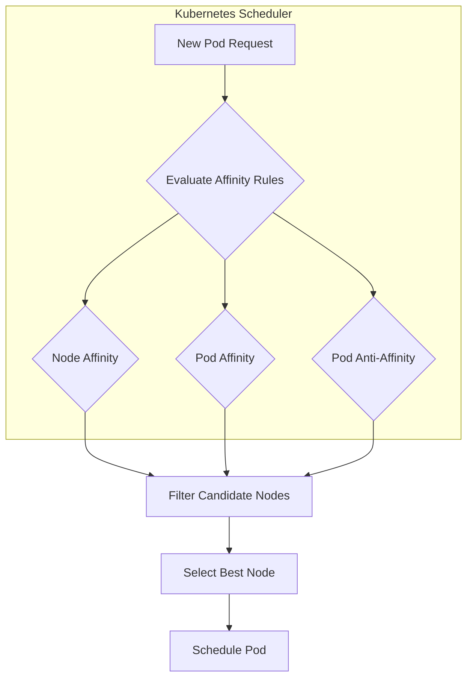
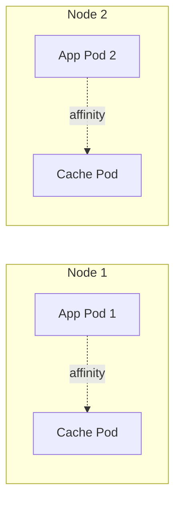
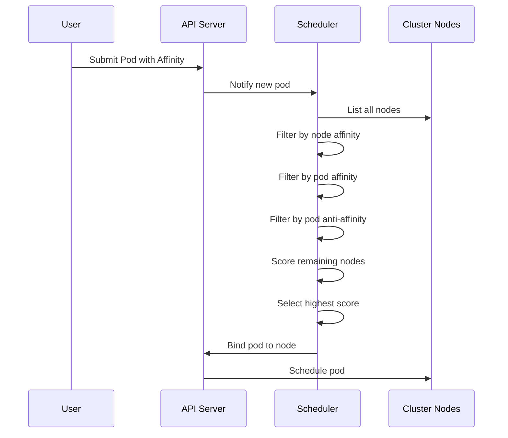

# How to Configure Kubernetes Affinity Rules

Author: [nawazdhandala](https://www.github.com/nawazdhandala)

Tags: Kubernetes, Affinity, Node Affinity, Pod Affinity, Scheduling, DevOps

Description: A practical guide to configuring Kubernetes affinity rules including node affinity, pod affinity, and inter-pod affinity for optimized workload placement and performance.

---

Kubernetes affinity rules give you fine-grained control over where pods get scheduled in your cluster. Unlike simple node selectors, affinity rules support expressive matching logic and can consider the location of other pods when making scheduling decisions.

## What Are Affinity Rules?

Affinity rules influence the Kubernetes scheduler's decisions about pod placement. You can attract pods to certain nodes (affinity) or repel them from others (anti-affinity). The scheduler evaluates these rules during the scheduling phase.



## Types of Affinity Rules

Kubernetes supports three types of affinity:

| Type | Purpose | Use Case |
|------|---------|----------|
| Node Affinity | Schedule pods on nodes with specific labels | GPU workloads, SSD storage |
| Pod Affinity | Schedule pods near other pods | Co-locate services for low latency |
| Pod Anti-Affinity | Schedule pods away from other pods | Distribute replicas across nodes |

## Node Affinity

Node affinity allows pods to specify preferences or requirements for nodes based on node labels.

### Required Node Affinity

The following YAML configuration ensures pods only schedule on nodes labeled with the SSD disk type. Hard requirements block scheduling if no matching node exists.

```yaml
apiVersion: v1
kind: Pod
metadata:
  name: database-pod
spec:
  affinity:
    nodeAffinity:
      # Hard requirement - pod will not schedule without match
      requiredDuringSchedulingIgnoredDuringExecution:
        nodeSelectorTerms:
          - matchExpressions:
              # Node must have disk-type=ssd label
              - key: disk-type
                operator: In
                values:
                  - ssd
  containers:
    - name: database
      image: postgres:15
```

### Preferred Node Affinity

Soft preferences influence scheduling but do not block it. Weights between 1-100 determine priority when multiple preferences exist.

```yaml
apiVersion: v1
kind: Pod
metadata:
  name: web-server
spec:
  affinity:
    nodeAffinity:
      # Soft preference - scheduler will try but not require
      preferredDuringSchedulingIgnoredDuringExecution:
        # Weight determines preference strength (1-100)
        - weight: 80
          preference:
            matchExpressions:
              # Prefer nodes in us-west-2a zone
              - key: topology.kubernetes.io/zone
                operator: In
                values:
                  - us-west-2a
        # Lower weight preference for instance type
        - weight: 20
          preference:
            matchExpressions:
              - key: node.kubernetes.io/instance-type
                operator: In
                values:
                  - m5.large
                  - m5.xlarge
  containers:
    - name: nginx
      image: nginx:1.25
```

### Available Operators

Node affinity supports several matching operators:

| Operator | Description | Example |
|----------|-------------|---------|
| In | Value is in the list | zone In [us-west-2a, us-west-2b] |
| NotIn | Value is not in the list | zone NotIn [us-east-1a] |
| Exists | Key exists (any value) | gpu Exists |
| DoesNotExist | Key does not exist | spot DoesNotExist |
| Gt | Value is greater than | memory Gt 64 |
| Lt | Value is less than | memory Lt 128 |

## Pod Affinity

Pod affinity schedules pods based on the location of other running pods. Co-locating related services reduces network latency and improves performance.



### Basic Pod Affinity

Application pods schedule on the same node as cache pods using this configuration. The topologyKey determines what "same location" means.

```yaml
apiVersion: apps/v1
kind: Deployment
metadata:
  name: app-server
spec:
  replicas: 3
  selector:
    matchLabels:
      app: myapp
  template:
    metadata:
      labels:
        app: myapp
    spec:
      affinity:
        podAffinity:
          # Hard requirement to co-locate with cache pods
          requiredDuringSchedulingIgnoredDuringExecution:
            - labelSelector:
                matchLabels:
                  # Schedule near pods with app=redis label
                  app: redis
              # Same node (hostname) as the matched pods
              topologyKey: kubernetes.io/hostname
      containers:
        - name: app
          image: myapp:v2
```

### Zone-Level Pod Affinity

Sometimes you want pods in the same availability zone but not necessarily on the same node. Adjust the topologyKey to control the scope.

```yaml
apiVersion: apps/v1
kind: Deployment
metadata:
  name: frontend
spec:
  replicas: 4
  selector:
    matchLabels:
      app: frontend
  template:
    metadata:
      labels:
        app: frontend
    spec:
      affinity:
        podAffinity:
          # Prefer same zone as backend pods
          preferredDuringSchedulingIgnoredDuringExecution:
            - weight: 100
              podAffinityTerm:
                labelSelector:
                  matchLabels:
                    app: backend
                # Same zone as matched pods, not same node
                topologyKey: topology.kubernetes.io/zone
      containers:
        - name: frontend
          image: frontend:v1
```

## Combining Node and Pod Affinity

Real-world deployments often combine multiple affinity types. The scheduler evaluates all rules together when making placement decisions.

```yaml
apiVersion: apps/v1
kind: Deployment
metadata:
  name: ml-inference
spec:
  replicas: 2
  selector:
    matchLabels:
      app: ml-inference
  template:
    metadata:
      labels:
        app: ml-inference
    spec:
      affinity:
        # Require GPU nodes
        nodeAffinity:
          requiredDuringSchedulingIgnoredDuringExecution:
            nodeSelectorTerms:
              - matchExpressions:
                  - key: nvidia.com/gpu
                    operator: Exists
        # Co-locate with model cache for faster loading
        podAffinity:
          preferredDuringSchedulingIgnoredDuringExecution:
            - weight: 75
              podAffinityTerm:
                labelSelector:
                  matchLabels:
                    app: model-cache
                topologyKey: kubernetes.io/hostname
        # Spread inference pods across nodes
        podAntiAffinity:
          preferredDuringSchedulingIgnoredDuringExecution:
            - weight: 50
              podAffinityTerm:
                labelSelector:
                  matchLabels:
                    app: ml-inference
                topologyKey: kubernetes.io/hostname
      containers:
        - name: inference
          image: ml-inference:v3
          resources:
            limits:
              nvidia.com/gpu: 1
```

## Using matchExpressions vs matchLabels

Both selectors work with affinity rules. Use matchLabels for simple key-value matching and matchExpressions for complex logic.

### matchLabels - Simple Matching

Simple equality matching works well for straightforward requirements.

```yaml
affinity:
  podAffinity:
    requiredDuringSchedulingIgnoredDuringExecution:
      - labelSelector:
          # Exact match: app=database AND tier=storage
          matchLabels:
            app: database
            tier: storage
        topologyKey: kubernetes.io/hostname
```

### matchExpressions - Complex Matching

Expression-based matching supports operators and multiple values per key.

```yaml
affinity:
  podAffinity:
    requiredDuringSchedulingIgnoredDuringExecution:
      - labelSelector:
          matchExpressions:
            # Match pods where app is either mysql OR postgres
            - key: app
              operator: In
              values:
                - mysql
                - postgres
            # And environment is production
            - key: environment
              operator: In
              values:
                - production
        topologyKey: kubernetes.io/hostname
```

## Scheduling Flow Visualization

Understanding how the scheduler processes affinity rules helps with debugging placement issues.



## Practical Examples

### Example 1: Web Application with Cache

Deploy a web application that stays close to its Redis cache for optimal performance.

```yaml
# First deploy Redis cache
apiVersion: apps/v1
kind: Deployment
metadata:
  name: redis-cache
spec:
  replicas: 1
  selector:
    matchLabels:
      app: redis
      role: cache
  template:
    metadata:
      labels:
        app: redis
        role: cache
    spec:
      # Place Redis on nodes with SSD storage
      affinity:
        nodeAffinity:
          requiredDuringSchedulingIgnoredDuringExecution:
            nodeSelectorTerms:
              - matchExpressions:
                  - key: disk-type
                    operator: In
                    values:
                      - ssd
      containers:
        - name: redis
          image: redis:7
          ports:
            - containerPort: 6379
---
# Web app deployment with pod affinity to Redis
apiVersion: apps/v1
kind: Deployment
metadata:
  name: web-app
spec:
  replicas: 3
  selector:
    matchLabels:
      app: web
  template:
    metadata:
      labels:
        app: web
    spec:
      affinity:
        # Co-locate with Redis on same node
        podAffinity:
          preferredDuringSchedulingIgnoredDuringExecution:
            - weight: 100
              podAffinityTerm:
                labelSelector:
                  matchLabels:
                    app: redis
                    role: cache
                topologyKey: kubernetes.io/hostname
        # Spread web pods across nodes
        podAntiAffinity:
          preferredDuringSchedulingIgnoredDuringExecution:
            - weight: 50
              podAffinityTerm:
                labelSelector:
                  matchLabels:
                    app: web
                topologyKey: kubernetes.io/hostname
      containers:
        - name: web
          image: webapp:v1
          ports:
            - containerPort: 8080
```

### Example 2: Multi-Tier Application

A complete deployment with frontend, backend, and database tiers using coordinated affinity rules.

```yaml
apiVersion: apps/v1
kind: Deployment
metadata:
  name: backend-api
spec:
  replicas: 3
  selector:
    matchLabels:
      app: backend
      tier: api
  template:
    metadata:
      labels:
        app: backend
        tier: api
    spec:
      affinity:
        # Prefer compute-optimized nodes
        nodeAffinity:
          preferredDuringSchedulingIgnoredDuringExecution:
            - weight: 70
              preference:
                matchExpressions:
                  - key: node-type
                    operator: In
                    values:
                      - compute-optimized
        # Stay in same zone as database
        podAffinity:
          preferredDuringSchedulingIgnoredDuringExecution:
            - weight: 80
              podAffinityTerm:
                labelSelector:
                  matchLabels:
                    tier: database
                topologyKey: topology.kubernetes.io/zone
        # Spread backend replicas
        podAntiAffinity:
          requiredDuringSchedulingIgnoredDuringExecution:
            - labelSelector:
                matchLabels:
                  app: backend
                  tier: api
              topologyKey: kubernetes.io/hostname
      containers:
        - name: api
          image: backend-api:v2
          ports:
            - containerPort: 3000
          resources:
            requests:
              cpu: "500m"
              memory: "512Mi"
```

## Verifying Affinity Configuration

After deploying pods with affinity rules, verify the scheduler respected your configuration.

### Check Pod Placement

Confirm pods landed on expected nodes with the following commands.

```bash
# View pods with node assignment
kubectl get pods -l app=web -o wide

# Expected output shows distribution across nodes:
# NAME       READY   STATUS    NODE        AGE
# web-abc    1/1     Running   node-1      5m
# web-def    1/1     Running   node-2      5m
# web-ghi    1/1     Running   node-3      5m

# Check node labels to verify affinity worked
kubectl get nodes --show-labels | grep -E "disk-type|node-type"
```

### Inspect Pod Affinity Settings

Review the applied affinity configuration on running pods.

```bash
# View affinity rules applied to a pod
kubectl get pod web-abc -o jsonpath='{.spec.affinity}' | jq .

# Get deployment affinity configuration
kubectl get deployment web-app -o yaml | grep -A 30 "affinity:"
```

### Examine Scheduling Events

Scheduler events reveal why pods landed on specific nodes.

```bash
# View scheduler decisions for a pod
kubectl describe pod web-abc | grep -A 10 "Events:"

# Check for scheduling failures
kubectl get events --field-selector reason=FailedScheduling
```

## Troubleshooting Common Issues

### Pod Stuck in Pending

When affinity rules cannot be satisfied, pods remain in Pending state. Check the pod events for details.

```bash
# Describe the pending pod
kubectl describe pod stuck-pod

# Look for messages like:
# Warning  FailedScheduling  0/5 nodes are available:
#   3 node(s) didn't match Pod's node affinity/selector
#   2 node(s) didn't match pod affinity rules

# Solutions:
# 1. Add labels to nodes: kubectl label node node-1 disk-type=ssd
# 2. Change from required to preferred affinity
# 3. Add more nodes that match requirements
```

### Affinity Rules Not Applied

Pods scheduling anywhere despite affinity rules often indicates YAML structure issues.

```bash
# Verify affinity exists in pod spec
kubectl get pod my-pod -o yaml | grep -A 50 "affinity:"

# Check for typos in label selectors
kubectl get pods --show-labels | grep myapp

# Validate deployment manifest
kubectl apply --dry-run=client -f deployment.yaml
```

### Weight Not Affecting Placement

Preferred affinity weights only matter when multiple valid nodes exist.

```bash
# Check node scores during scheduling
kubectl describe pod new-pod | grep -A 5 "Scheduled"

# Verify multiple nodes match requirements
kubectl get nodes -l disk-type=ssd

# If only one node matches, weight comparison never happens
```

## Best Practices

### 1. Start with Preferred, Move to Required

Begin with soft preferences to avoid scheduling failures. Only use required affinity when placement is critical.

```yaml
# Start with this - allows fallback
preferredDuringSchedulingIgnoredDuringExecution:
  - weight: 100
    preference:
      matchExpressions:
        - key: disk-type
          operator: In
          values:
            - ssd

# Move to this only when verified
# requiredDuringSchedulingIgnoredDuringExecution:
#   nodeSelectorTerms:
#     - matchExpressions:
#         - key: disk-type
#           operator: In
#           values:
#             - ssd
```

### 2. Use Meaningful Weights

Weight values (1-100) should reflect actual priority. Larger differences between weights make preferences clearer.

```yaml
preferredDuringSchedulingIgnoredDuringExecution:
  # High priority - same zone as database
  - weight: 100
    podAffinityTerm:
      labelSelector:
        matchLabels:
          tier: database
      topologyKey: topology.kubernetes.io/zone
  # Medium priority - compute nodes
  - weight: 50
    preference:
      matchExpressions:
        - key: node-type
          operator: In
          values:
            - compute
  # Low priority - specific instance type
  - weight: 10
    preference:
      matchExpressions:
        - key: instance-type
          operator: In
          values:
            - m5.xlarge
```

### 3. Document Your Affinity Decisions

Comments in YAML files help future maintainers understand placement requirements.

```yaml
spec:
  affinity:
    nodeAffinity:
      # Business requirement: PCI compliance requires
      # sensitive data on isolated nodes
      requiredDuringSchedulingIgnoredDuringExecution:
        nodeSelectorTerms:
          - matchExpressions:
              - key: compliance
                operator: In
                values:
                  - pci-dss
    podAffinity:
      # Performance requirement: payment service needs
      # sub-millisecond latency to fraud detection
      preferredDuringSchedulingIgnoredDuringExecution:
        - weight: 90
          podAffinityTerm:
            labelSelector:
              matchLabels:
                app: fraud-detection
            topologyKey: kubernetes.io/hostname
```

### 4. Consider Cluster Capacity

Hard affinity rules can prevent scheduling when resources are constrained.

```yaml
# With 3 GPU nodes and 5 GPU pods using required anti-affinity
# Result: 2 pods stuck in Pending

# Better approach - use preferred anti-affinity
affinity:
  podAntiAffinity:
    preferredDuringSchedulingIgnoredDuringExecution:
      - weight: 100
        podAffinityTerm:
          labelSelector:
            matchLabels:
              app: gpu-workload
          topologyKey: kubernetes.io/hostname
```

### 5. Test Affinity Changes in Staging

Always validate affinity rules in a non-production environment before deploying.

```bash
# Dry run to catch syntax errors
kubectl apply --dry-run=server -f deployment.yaml

# Deploy to staging first
kubectl apply -f deployment.yaml -n staging

# Verify placement matches expectations
kubectl get pods -n staging -o wide

# Monitor for scheduling issues
kubectl get events -n staging --watch
```

---

Kubernetes affinity rules provide powerful scheduling controls that go beyond simple node selection. Use node affinity for hardware requirements, pod affinity for co-location benefits, and combine multiple rules for complex placement strategies. Start with preferred affinity to maintain scheduling flexibility, and only use required affinity when specific placement is essential for your application's functionality.
