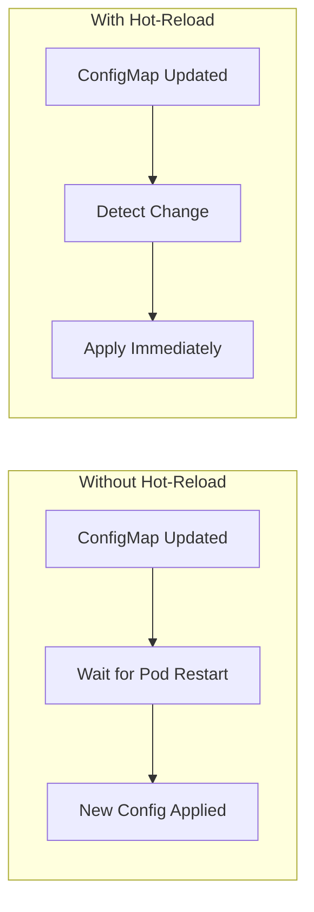
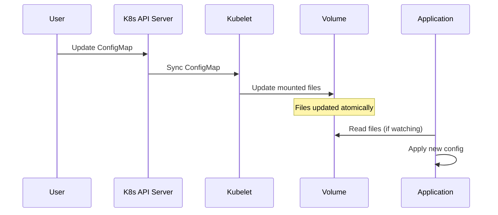
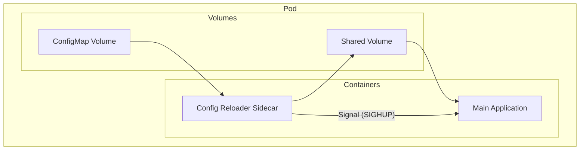
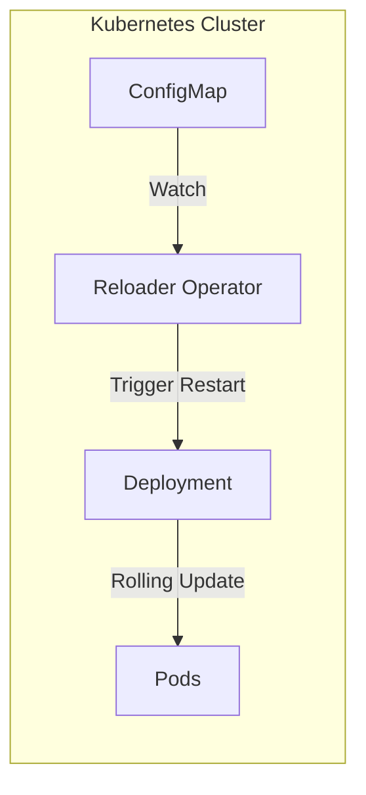

# How to Implement ConfigMap Hot-Reload in Applications

Author: [nawazdhandala](https://www.github.com/nawazdhandala)

Tags: Kubernetes, ConfigMap, Hot-Reload, DevOps, Cloud Native, Configuration Management

Description: A practical guide to implementing ConfigMap hot-reload in Kubernetes applications. Learn how to automatically detect configuration changes and apply them without restarting pods using file watchers, sidecar containers, and operator patterns.

---

Kubernetes ConfigMaps provide a convenient way to store configuration data separately from container images. However, when you update a ConfigMap, your application pods do not automatically pick up the changes. By default, you need to restart pods or trigger a rolling update to apply new configuration values. ConfigMap hot-reload solves that problem by enabling applications to detect and apply configuration changes dynamically.

## Understanding the ConfigMap Update Problem



When you mount a ConfigMap as a volume in Kubernetes, the kubelet periodically syncs the ConfigMap data to the mounted volume. The default sync period is around 60 seconds, but your application still needs to actively watch for and respond to these file changes.

Key challenges include:

1. **Volume Mount Updates** - Kubernetes updates mounted ConfigMaps eventually, but applications ignore changes by default
2. **Environment Variables** - ConfigMaps injected as environment variables never update without a pod restart
3. **Application Awareness** - Most applications read configuration at startup and never check again

## ConfigMap Volume Mount Behavior

Before implementing hot-reload, understanding how Kubernetes handles ConfigMap volume mounts is essential.



Kubernetes uses symbolic links to update ConfigMap volumes atomically. The mounted directory contains:

- A `..data` symlink pointing to a timestamped directory
- Individual file symlinks pointing through `..data`

When an update occurs, Kubernetes creates a new timestamped directory with the updated content and atomically swaps the `..data` symlink.

## Method 1: File Watcher in Application Code

The most direct approach involves implementing file watching within your application. Here are implementations for common languages.

### Node.js Implementation

The following Node.js application uses the `chokidar` library to watch for ConfigMap file changes and reload configuration automatically.

```javascript
// config-watcher.js
// Hot-reload configuration from mounted ConfigMap volumes
// Uses chokidar for efficient cross-platform file watching

const chokidar = require('chokidar');
const fs = require('fs');
const path = require('path');

// Store current configuration in memory
let currentConfig = {};

// Path where ConfigMap is mounted as a volume
const CONFIG_PATH = process.env.CONFIG_PATH || '/etc/config';

/**
 * Load configuration from all files in the config directory
 * Handles both key-value files and JSON configuration files
 */
function loadConfig() {
    const newConfig = {};

    try {
        const files = fs.readdirSync(CONFIG_PATH);

        for (const file of files) {
            // Skip Kubernetes internal symlinks and directories
            if (file.startsWith('..')) continue;

            const filePath = path.join(CONFIG_PATH, file);
            const stat = fs.statSync(filePath);

            if (stat.isFile()) {
                const content = fs.readFileSync(filePath, 'utf8').trim();

                // Try parsing as JSON for complex configuration
                try {
                    newConfig[file] = JSON.parse(content);
                } catch {
                    // Store as string if not valid JSON
                    newConfig[file] = content;
                }
            }
        }

        console.log('Configuration loaded:', Object.keys(newConfig));
        return newConfig;
    } catch (error) {
        console.error('Failed to load configuration:', error.message);
        return currentConfig;
    }
}

/**
 * Initialize the file watcher on the ConfigMap mount path
 * Watches the ..data symlink which Kubernetes updates atomically
 */
function initializeWatcher(onConfigChange) {
    // Load initial configuration
    currentConfig = loadConfig();
    onConfigChange(currentConfig);

    // Watch the ..data symlink for atomic updates
    // Kubernetes swaps this symlink when ConfigMap changes
    const watcher = chokidar.watch(path.join(CONFIG_PATH, '..data'), {
        persistent: true,
        followSymlinks: true,
        // Ignore initial add events
        ignoreInitial: true,
        // Small delay to ensure all files are written
        awaitWriteFinish: {
            stabilityThreshold: 100,
            pollInterval: 50
        }
    });

    // Handle symlink changes (ConfigMap updates)
    watcher.on('change', () => {
        console.log('ConfigMap change detected, reloading...');
        currentConfig = loadConfig();
        onConfigChange(currentConfig);
    });

    // Also watch for the symlink being replaced
    watcher.on('add', () => {
        console.log('ConfigMap symlink recreated, reloading...');
        currentConfig = loadConfig();
        onConfigChange(currentConfig);
    });

    watcher.on('error', (error) => {
        console.error('Watcher error:', error);
    });

    console.log(`Watching for ConfigMap changes at ${CONFIG_PATH}`);
    return watcher;
}

/**
 * Get the current configuration value for a given key
 */
function getConfig(key) {
    return currentConfig[key];
}

/**
 * Get all current configuration
 */
function getAllConfig() {
    return { ...currentConfig };
}

module.exports = {
    initializeWatcher,
    getConfig,
    getAllConfig
};
```

Use the config watcher in your Express application.

```javascript
// app.js
// Express application with hot-reloadable configuration

const express = require('express');
const { initializeWatcher, getConfig, getAllConfig } = require('./config-watcher');

const app = express();

// Store application settings that can change at runtime
let appSettings = {
    logLevel: 'info',
    maxConnections: 100,
    featureFlags: {}
};

/**
 * Callback function invoked when configuration changes
 * Update application behavior based on new configuration
 */
function handleConfigChange(config) {
    console.log('Applying new configuration...');

    // Update log level if changed
    if (config.LOG_LEVEL && config.LOG_LEVEL !== appSettings.logLevel) {
        appSettings.logLevel = config.LOG_LEVEL;
        console.log(`Log level changed to: ${appSettings.logLevel}`);
    }

    // Update max connections
    if (config.MAX_CONNECTIONS) {
        appSettings.maxConnections = parseInt(config.MAX_CONNECTIONS, 10);
        console.log(`Max connections set to: ${appSettings.maxConnections}`);
    }

    // Update feature flags from JSON config
    if (config['features.json']) {
        appSettings.featureFlags = config['features.json'];
        console.log('Feature flags updated:', appSettings.featureFlags);
    }

    console.log('Configuration applied successfully');
}

// Initialize the config watcher
initializeWatcher(handleConfigChange);

// Health check endpoint
app.get('/health', (req, res) => {
    res.json({ status: 'healthy' });
});

// Endpoint to view current configuration
app.get('/config', (req, res) => {
    res.json({
        settings: appSettings,
        rawConfig: getAllConfig()
    });
});

// Example endpoint using feature flags
app.get('/feature/:name', (req, res) => {
    const featureName = req.params.name;
    const enabled = appSettings.featureFlags[featureName] || false;
    res.json({ feature: featureName, enabled });
});

const PORT = process.env.PORT || 8080;
app.listen(PORT, () => {
    console.log(`Server running on port ${PORT}`);
});
```

### Go Implementation

Go applications can use the fsnotify library for efficient file system monitoring.

```go
// config/watcher.go
// ConfigMap hot-reload implementation for Go applications
// Uses fsnotify for cross-platform file system notifications

package config

import (
    "encoding/json"
    "io/ioutil"
    "log"
    "os"
    "path/filepath"
    "strings"
    "sync"
    "time"

    "github.com/fsnotify/fsnotify"
)

// Config holds the current configuration state
type Config struct {
    mu     sync.RWMutex
    values map[string]interface{}
    path   string
}

// ConfigChangeHandler is called when configuration changes
type ConfigChangeHandler func(config map[string]interface{})

// NewConfig creates a new Config instance for the given path
func NewConfig(configPath string) *Config {
    return &Config{
        values: make(map[string]interface{}),
        path:   configPath,
    }
}

// Load reads all configuration files from the ConfigMap mount
func (c *Config) Load() error {
    c.mu.Lock()
    defer c.mu.Unlock()

    newValues := make(map[string]interface{})

    files, err := ioutil.ReadDir(c.path)
    if err != nil {
        return err
    }

    for _, file := range files {
        // Skip Kubernetes internal symlinks
        if strings.HasPrefix(file.Name(), "..") {
            continue
        }

        if file.IsDir() {
            continue
        }

        filePath := filepath.Join(c.path, file.Name())
        content, err := ioutil.ReadFile(filePath)
        if err != nil {
            log.Printf("Failed to read %s: %v", filePath, err)
            continue
        }

        // Try parsing as JSON
        var jsonValue interface{}
        if err := json.Unmarshal(content, &jsonValue); err == nil {
            newValues[file.Name()] = jsonValue
        } else {
            // Store as string if not valid JSON
            newValues[file.Name()] = strings.TrimSpace(string(content))
        }
    }

    c.values = newValues
    log.Printf("Configuration loaded: %d keys", len(newValues))
    return nil
}

// Get returns a configuration value by key
func (c *Config) Get(key string) interface{} {
    c.mu.RLock()
    defer c.mu.RUnlock()
    return c.values[key]
}

// GetString returns a configuration value as a string
func (c *Config) GetString(key string) string {
    value := c.Get(key)
    if str, ok := value.(string); ok {
        return str
    }
    return ""
}

// GetAll returns a copy of all configuration values
func (c *Config) GetAll() map[string]interface{} {
    c.mu.RLock()
    defer c.mu.RUnlock()

    copy := make(map[string]interface{})
    for k, v := range c.values {
        copy[k] = v
    }
    return copy
}

// Watch starts watching for ConfigMap changes
// Returns a stop channel to terminate watching
func (c *Config) Watch(onChange ConfigChangeHandler) (chan struct{}, error) {
    // Load initial configuration
    if err := c.Load(); err != nil {
        return nil, err
    }
    onChange(c.GetAll())

    watcher, err := fsnotify.NewWatcher()
    if err != nil {
        return nil, err
    }

    // Watch the ..data symlink that Kubernetes updates atomically
    dataLink := filepath.Join(c.path, "..data")
    if err := watcher.Add(c.path); err != nil {
        watcher.Close()
        return nil, err
    }

    stop := make(chan struct{})

    // Debounce timer to avoid multiple reloads for single update
    var debounceTimer *time.Timer
    debounceDuration := 100 * time.Millisecond

    go func() {
        defer watcher.Close()

        for {
            select {
            case event, ok := <-watcher.Events:
                if !ok {
                    return
                }

                // Check if the ..data symlink was modified
                if strings.Contains(event.Name, "..data") {
                    // Debounce rapid successive events
                    if debounceTimer != nil {
                        debounceTimer.Stop()
                    }
                    debounceTimer = time.AfterFunc(debounceDuration, func() {
                        log.Println("ConfigMap change detected, reloading...")
                        if err := c.Load(); err != nil {
                            log.Printf("Failed to reload config: %v", err)
                            return
                        }
                        onChange(c.GetAll())
                    })
                }

            case err, ok := <-watcher.Errors:
                if !ok {
                    return
                }
                log.Printf("Watcher error: %v", err)

            case <-stop:
                return
            }
        }
    }()

    log.Printf("Watching for ConfigMap changes at %s", c.path)
    return stop, nil
}
```

Integrate the config watcher into your Go application.

```go
// main.go
// Example Go application with ConfigMap hot-reload

package main

import (
    "encoding/json"
    "log"
    "net/http"
    "os"
    "strconv"
    "sync"

    "myapp/config"
)

// AppSettings holds runtime application settings
type AppSettings struct {
    mu             sync.RWMutex
    LogLevel       string
    MaxConnections int
    FeatureFlags   map[string]bool
}

var (
    cfg      *config.Config
    settings = &AppSettings{
        LogLevel:       "info",
        MaxConnections: 100,
        FeatureFlags:   make(map[string]bool),
    }
)

// handleConfigChange processes configuration updates
func handleConfigChange(newConfig map[string]interface{}) {
    settings.mu.Lock()
    defer settings.mu.Unlock()

    log.Println("Applying new configuration...")

    // Update log level
    if level, ok := newConfig["LOG_LEVEL"].(string); ok {
        settings.LogLevel = level
        log.Printf("Log level changed to: %s", level)
    }

    // Update max connections
    if maxConn, ok := newConfig["MAX_CONNECTIONS"].(string); ok {
        if val, err := strconv.Atoi(maxConn); err == nil {
            settings.MaxConnections = val
            log.Printf("Max connections set to: %d", val)
        }
    }

    // Update feature flags from JSON config
    if features, ok := newConfig["features.json"].(map[string]interface{}); ok {
        for key, value := range features {
            if enabled, ok := value.(bool); ok {
                settings.FeatureFlags[key] = enabled
            }
        }
        log.Printf("Feature flags updated: %v", settings.FeatureFlags)
    }

    log.Println("Configuration applied successfully")
}

func healthHandler(w http.ResponseWriter, r *http.Request) {
    w.Header().Set("Content-Type", "application/json")
    json.NewEncoder(w).Encode(map[string]string{"status": "healthy"})
}

func configHandler(w http.ResponseWriter, r *http.Request) {
    settings.mu.RLock()
    defer settings.mu.RUnlock()

    w.Header().Set("Content-Type", "application/json")
    json.NewEncoder(w).Encode(map[string]interface{}{
        "logLevel":       settings.LogLevel,
        "maxConnections": settings.MaxConnections,
        "featureFlags":   settings.FeatureFlags,
        "rawConfig":      cfg.GetAll(),
    })
}

func main() {
    configPath := os.Getenv("CONFIG_PATH")
    if configPath == "" {
        configPath = "/etc/config"
    }

    cfg = config.NewConfig(configPath)

    // Start watching for configuration changes
    stop, err := cfg.Watch(handleConfigChange)
    if err != nil {
        log.Fatalf("Failed to start config watcher: %v", err)
    }
    defer close(stop)

    http.HandleFunc("/health", healthHandler)
    http.HandleFunc("/config", configHandler)

    port := os.Getenv("PORT")
    if port == "" {
        port = "8080"
    }

    log.Printf("Server running on port %s", port)
    log.Fatal(http.ListenAndServe(":"+port, nil))
}
```

### Python Implementation

Python applications can leverage the watchdog library for file system monitoring.

```python
# config_watcher.py
# ConfigMap hot-reload implementation for Python applications
# Uses watchdog for cross-platform file system monitoring

import os
import json
import logging
import threading
from pathlib import Path
from typing import Callable, Dict, Any, Optional
from watchdog.observers import Observer
from watchdog.events import FileSystemEventHandler, FileSystemEvent

logging.basicConfig(level=logging.INFO)
logger = logging.getLogger(__name__)


class ConfigMapWatcher:
    """
    Watches a ConfigMap mount directory for changes and triggers callbacks.
    Handles Kubernetes atomic symlink updates correctly.
    """

    def __init__(self, config_path: str = "/etc/config"):
        self.config_path = Path(config_path)
        self._config: Dict[str, Any] = {}
        self._lock = threading.RLock()
        self._observer: Optional[Observer] = None
        self._callbacks: list[Callable[[Dict[str, Any]], None]] = []
        self._debounce_timer: Optional[threading.Timer] = None
        self._debounce_delay = 0.1  # 100ms debounce

    def load_config(self) -> Dict[str, Any]:
        """
        Load all configuration files from the ConfigMap mount directory.
        Returns a dictionary mapping filenames to their parsed contents.
        """
        new_config = {}

        try:
            for item in self.config_path.iterdir():
                # Skip Kubernetes internal symlinks
                if item.name.startswith('..'):
                    continue

                if item.is_file():
                    content = item.read_text().strip()

                    # Try parsing as JSON for complex configuration
                    try:
                        new_config[item.name] = json.loads(content)
                    except json.JSONDecodeError:
                        # Store as string if not valid JSON
                        new_config[item.name] = content

            logger.info(f"Configuration loaded: {list(new_config.keys())}")

        except Exception as e:
            logger.error(f"Failed to load configuration: {e}")
            return self._config

        return new_config

    def get(self, key: str, default: Any = None) -> Any:
        """Get a configuration value by key with optional default."""
        with self._lock:
            return self._config.get(key, default)

    def get_all(self) -> Dict[str, Any]:
        """Get a copy of all current configuration."""
        with self._lock:
            return dict(self._config)

    def on_change(self, callback: Callable[[Dict[str, Any]], None]) -> None:
        """Register a callback to be invoked when configuration changes."""
        self._callbacks.append(callback)

    def _notify_change(self) -> None:
        """Notify all registered callbacks of configuration change."""
        config_copy = self.get_all()
        for callback in self._callbacks:
            try:
                callback(config_copy)
            except Exception as e:
                logger.error(f"Callback error: {e}")

    def _handle_change(self) -> None:
        """Handle a detected configuration change with debouncing."""
        # Cancel any pending debounce timer
        if self._debounce_timer is not None:
            self._debounce_timer.cancel()

        # Set new debounce timer
        self._debounce_timer = threading.Timer(
            self._debounce_delay,
            self._apply_change
        )
        self._debounce_timer.start()

    def _apply_change(self) -> None:
        """Apply configuration change after debounce delay."""
        logger.info("ConfigMap change detected, reloading...")

        with self._lock:
            self._config = self.load_config()

        self._notify_change()

    def start(self) -> None:
        """Start watching for ConfigMap changes."""
        # Load initial configuration
        with self._lock:
            self._config = self.load_config()
        self._notify_change()

        # Create file system event handler
        watcher = self

        class ConfigMapHandler(FileSystemEventHandler):
            def on_any_event(self, event: FileSystemEvent) -> None:
                # Check if the ..data symlink was modified
                if '..data' in str(event.src_path):
                    watcher._handle_change()

        # Start observer
        self._observer = Observer()
        self._observer.schedule(
            ConfigMapHandler(),
            str(self.config_path),
            recursive=False
        )
        self._observer.start()

        logger.info(f"Watching for ConfigMap changes at {self.config_path}")

    def stop(self) -> None:
        """Stop watching for ConfigMap changes."""
        if self._observer is not None:
            self._observer.stop()
            self._observer.join()

        if self._debounce_timer is not None:
            self._debounce_timer.cancel()


# Global config watcher instance
_watcher: Optional[ConfigMapWatcher] = None


def init_config(config_path: str = "/etc/config") -> ConfigMapWatcher:
    """Initialize the global config watcher."""
    global _watcher
    _watcher = ConfigMapWatcher(config_path)
    return _watcher


def get_config(key: str, default: Any = None) -> Any:
    """Get a configuration value from the global watcher."""
    if _watcher is None:
        raise RuntimeError("Config watcher not initialized")
    return _watcher.get(key, default)


def get_all_config() -> Dict[str, Any]:
    """Get all configuration from the global watcher."""
    if _watcher is None:
        raise RuntimeError("Config watcher not initialized")
    return _watcher.get_all()
```

Use the config watcher in a Flask application.

```python
# app.py
# Flask application with ConfigMap hot-reload

import os
import logging
from flask import Flask, jsonify
from config_watcher import init_config, get_config, get_all_config

logging.basicConfig(level=logging.INFO)
logger = logging.getLogger(__name__)

app = Flask(__name__)

# Application settings that can change at runtime
app_settings = {
    'log_level': 'info',
    'max_connections': 100,
    'feature_flags': {}
}


def handle_config_change(config: dict) -> None:
    """
    Callback function invoked when configuration changes.
    Update application behavior based on new configuration.
    """
    logger.info("Applying new configuration...")

    # Update log level
    if 'LOG_LEVEL' in config:
        app_settings['log_level'] = config['LOG_LEVEL']
        logger.info(f"Log level changed to: {app_settings['log_level']}")

    # Update max connections
    if 'MAX_CONNECTIONS' in config:
        app_settings['max_connections'] = int(config['MAX_CONNECTIONS'])
        logger.info(f"Max connections set to: {app_settings['max_connections']}")

    # Update feature flags from JSON config
    if 'features.json' in config:
        app_settings['feature_flags'] = config['features.json']
        logger.info(f"Feature flags updated: {app_settings['feature_flags']}")

    logger.info("Configuration applied successfully")


@app.route('/health')
def health():
    """Health check endpoint."""
    return jsonify({'status': 'healthy'})


@app.route('/config')
def config():
    """Return current configuration."""
    return jsonify({
        'settings': app_settings,
        'raw_config': get_all_config()
    })


@app.route('/feature/<name>')
def feature(name: str):
    """Check if a feature flag is enabled."""
    enabled = app_settings['feature_flags'].get(name, False)
    return jsonify({'feature': name, 'enabled': enabled})


if __name__ == '__main__':
    # Initialize config watcher
    config_path = os.environ.get('CONFIG_PATH', '/etc/config')
    watcher = init_config(config_path)
    watcher.on_change(handle_config_change)
    watcher.start()

    # Run Flask application
    port = int(os.environ.get('PORT', 8080))
    app.run(host='0.0.0.0', port=port)
```

## Method 2: Sidecar Container Pattern

For applications that cannot be modified or for teams preferring infrastructure-level solutions, a sidecar container can watch for ConfigMap changes and signal the main application.



### Kubernetes Deployment with Sidecar

The following deployment configuration adds a sidecar container that watches for ConfigMap changes and signals the main application.

```yaml
# deployment-with-sidecar.yaml
# Deployment with config reloader sidecar container
# The sidecar watches ConfigMap changes and sends SIGHUP to the main process

apiVersion: apps/v1
kind: Deployment
metadata:
  name: app-with-config-reloader
  labels:
    app: myapp
spec:
  replicas: 3
  selector:
    matchLabels:
      app: myapp
  template:
    metadata:
      labels:
        app: myapp
    spec:
      # Share process namespace so sidecar can signal main container
      shareProcessNamespace: true

      containers:
        # Main application container
        - name: app
          image: myapp:latest
          ports:
            - containerPort: 8080
          volumeMounts:
            # Mount ConfigMap to the application config directory
            - name: config-volume
              mountPath: /etc/config
              readOnly: true
          env:
            - name: CONFIG_PATH
              value: /etc/config
          resources:
            requests:
              cpu: 100m
              memory: 128Mi
            limits:
              cpu: 500m
              memory: 512Mi

        # Config reloader sidecar
        - name: config-reloader
          image: jimmidyson/configmap-reload:v0.9.0
          args:
            # Directory to watch for changes
            - --volume-dir=/etc/config
            # Webhook to call when changes detected
            - --webhook-url=http://localhost:8080/-/reload
            # Webhook method
            - --webhook-method=POST
          volumeMounts:
            - name: config-volume
              mountPath: /etc/config
              readOnly: true
          resources:
            requests:
              cpu: 10m
              memory: 16Mi
            limits:
              cpu: 50m
              memory: 64Mi

      volumes:
        - name: config-volume
          configMap:
            name: app-config
```

### Custom Config Reloader Sidecar

Build a custom sidecar that sends signals to the main application process.

```dockerfile
# Dockerfile for custom config reloader sidecar
# Watches ConfigMap directory and sends SIGHUP to PID 1

FROM alpine:3.19

RUN apk add --no-cache inotify-tools bash curl

COPY reload.sh /reload.sh
RUN chmod +x /reload.sh

ENTRYPOINT ["/reload.sh"]
```

The reload script watches for changes and signals the main process.

```bash
#!/bin/bash
# reload.sh
# Watch ConfigMap directory and signal main application on changes

CONFIG_DIR="${CONFIG_DIR:-/etc/config}"
SIGNAL="${RELOAD_SIGNAL:-SIGHUP}"
WEBHOOK_URL="${WEBHOOK_URL:-}"
MAIN_PID="${MAIN_PID:-1}"

echo "Config reloader started"
echo "Watching: $CONFIG_DIR"
echo "Signal: $SIGNAL"
echo "Webhook URL: $WEBHOOK_URL"

# Function to trigger reload
trigger_reload() {
    echo "$(date): ConfigMap change detected"

    # Send signal to main process if enabled
    if [ "$MAIN_PID" != "" ]; then
        echo "Sending $SIGNAL to PID $MAIN_PID"
        kill -s "$SIGNAL" "$MAIN_PID" 2>/dev/null || true
    fi

    # Call webhook if configured
    if [ "$WEBHOOK_URL" != "" ]; then
        echo "Calling webhook: $WEBHOOK_URL"
        curl -s -X POST "$WEBHOOK_URL" || true
    fi

    echo "Reload triggered successfully"
}

# Wait for config directory to exist
while [ ! -d "$CONFIG_DIR" ]; do
    echo "Waiting for $CONFIG_DIR to exist..."
    sleep 1
done

# Watch for changes using inotifywait
# The ..data symlink is what Kubernetes updates atomically
while true; do
    # Watch for symlink changes in the config directory
    inotifywait -q -e create,modify,delete "$CONFIG_DIR" 2>/dev/null | while read -r event; do
        if echo "$event" | grep -q "..data"; then
            trigger_reload
        fi
    done

    # Small delay before restarting watch
    sleep 1
done
```

### Prometheus-Style Reload Endpoint

Many applications support a reload endpoint pattern. Add a simple reload handler to your application.

```go
// reload_handler.go
// HTTP handler for triggering configuration reload
// Compatible with configmap-reload sidecar

package main

import (
    "log"
    "net/http"
    "sync"
)

// ReloadHandler provides an HTTP endpoint for triggering config reload
type ReloadHandler struct {
    mu           sync.Mutex
    reloadFunc   func() error
    reloadCount  int64
    lastError    error
}

// NewReloadHandler creates a new reload handler
func NewReloadHandler(reloadFunc func() error) *ReloadHandler {
    return &ReloadHandler{
        reloadFunc: reloadFunc,
    }
}

// ServeHTTP handles reload requests
func (h *ReloadHandler) ServeHTTP(w http.ResponseWriter, r *http.Request) {
    if r.Method != http.MethodPost {
        http.Error(w, "Method not allowed", http.StatusMethodNotAllowed)
        return
    }

    h.mu.Lock()
    defer h.mu.Unlock()

    log.Println("Reload request received")

    if err := h.reloadFunc(); err != nil {
        h.lastError = err
        log.Printf("Reload failed: %v", err)
        http.Error(w, err.Error(), http.StatusInternalServerError)
        return
    }

    h.reloadCount++
    h.lastError = nil

    log.Printf("Reload successful (count: %d)", h.reloadCount)
    w.WriteHeader(http.StatusOK)
    w.Write([]byte("Configuration reloaded"))
}

// Register the reload handler with your router
func registerReloadHandler(mux *http.ServeMux, handler *ReloadHandler) {
    mux.Handle("/-/reload", handler)
    mux.Handle("/reload", handler)
}
```

## Method 3: Reloader Operator

For cluster-wide automatic reloading, the Stakater Reloader operator watches ConfigMaps and triggers rolling restarts when changes occur.



### Install Reloader Operator

Deploy the Reloader operator using Helm or kubectl.

```bash
# Install using Helm
helm repo add stakater https://stakater.github.io/stakater-charts
helm repo update

helm install reloader stakater/reloader \
  --namespace kube-system \
  --set reloader.watchGlobally=true
```

Alternative installation using kubectl.

```bash
# Install using kubectl
kubectl apply -f https://raw.githubusercontent.com/stakater/Reloader/master/deployments/kubernetes/reloader.yaml
```

### Configure Deployments for Auto-Reload

Annotate your deployments to enable automatic reloading when ConfigMaps change.

```yaml
# deployment-with-reloader.yaml
# Deployment configured for automatic ConfigMap reload
# Reloader operator watches the annotation and triggers rolling restart

apiVersion: apps/v1
kind: Deployment
metadata:
  name: myapp
  annotations:
    # Reload when ANY referenced ConfigMap or Secret changes
    reloader.stakater.com/auto: "true"
spec:
  replicas: 3
  selector:
    matchLabels:
      app: myapp
  template:
    metadata:
      labels:
        app: myapp
    spec:
      containers:
        - name: app
          image: myapp:latest
          envFrom:
            # Reference ConfigMap for environment variables
            - configMapRef:
                name: app-config
          volumeMounts:
            # Mount ConfigMap as files
            - name: config-volume
              mountPath: /etc/config
      volumes:
        - name: config-volume
          configMap:
            name: app-config
```

For more granular control, specify which ConfigMaps to watch.

```yaml
# deployment-specific-configmap.yaml
# Watch only specific ConfigMaps for changes

apiVersion: apps/v1
kind: Deployment
metadata:
  name: myapp
  annotations:
    # Watch specific ConfigMaps (comma-separated)
    configmap.reloader.stakater.com/reload: "app-config,feature-flags"
    # Watch specific Secrets (comma-separated)
    secret.reloader.stakater.com/reload: "app-secrets"
spec:
  # ... deployment spec
```

### ConfigMap Example for Reloader

Create a ConfigMap that Reloader will watch.

```yaml
# configmap.yaml
# ConfigMap with application configuration
# Changes trigger automatic pod restart via Reloader

apiVersion: v1
kind: ConfigMap
metadata:
  name: app-config
  labels:
    app: myapp
data:
  # Simple key-value configuration
  LOG_LEVEL: "info"
  MAX_CONNECTIONS: "100"
  CACHE_TTL: "300"

  # JSON configuration file
  features.json: |
    {
      "new_dashboard": true,
      "beta_api": false,
      "dark_mode": true
    }

  # Configuration file
  app.conf: |
    server:
      port: 8080
      host: 0.0.0.0

    database:
      pool_size: 10
      timeout: 30s

    logging:
      level: info
      format: json
```

## Method 4: Kubernetes API Watch

For applications requiring programmatic control, directly watching the Kubernetes API provides the most flexibility.

### Go Client Implementation

Use the Kubernetes Go client to watch ConfigMap changes directly.

```go
// k8s_config_watcher.go
// Watch ConfigMap changes using Kubernetes API
// Provides real-time notifications without file system dependency

package config

import (
    "context"
    "log"
    "sync"

    corev1 "k8s.io/api/core/v1"
    metav1 "k8s.io/apimachinery/pkg/apis/meta/v1"
    "k8s.io/apimachinery/pkg/watch"
    "k8s.io/client-go/kubernetes"
    "k8s.io/client-go/rest"
)

// K8sConfigWatcher watches ConfigMaps using the Kubernetes API
type K8sConfigWatcher struct {
    client    *kubernetes.Clientset
    namespace string
    name      string
    config    map[string]string
    mu        sync.RWMutex
    callbacks []func(map[string]string)
}

// NewK8sConfigWatcher creates a new Kubernetes API config watcher
func NewK8sConfigWatcher(namespace, configMapName string) (*K8sConfigWatcher, error) {
    // Create in-cluster config
    config, err := rest.InClusterConfig()
    if err != nil {
        return nil, err
    }

    // Create Kubernetes client
    clientset, err := kubernetes.NewForConfig(config)
    if err != nil {
        return nil, err
    }

    return &K8sConfigWatcher{
        client:    clientset,
        namespace: namespace,
        name:      configMapName,
        config:    make(map[string]string),
        callbacks: make([]func(map[string]string), 0),
    }, nil
}

// OnChange registers a callback for configuration changes
func (w *K8sConfigWatcher) OnChange(callback func(map[string]string)) {
    w.callbacks = append(w.callbacks, callback)
}

// Get returns a configuration value
func (w *K8sConfigWatcher) Get(key string) string {
    w.mu.RLock()
    defer w.mu.RUnlock()
    return w.config[key]
}

// GetAll returns all configuration values
func (w *K8sConfigWatcher) GetAll() map[string]string {
    w.mu.RLock()
    defer w.mu.RUnlock()

    copy := make(map[string]string)
    for k, v := range w.config {
        copy[k] = v
    }
    return copy
}

// Watch starts watching the ConfigMap for changes
func (w *K8sConfigWatcher) Watch(ctx context.Context) error {
    // Get initial ConfigMap
    cm, err := w.client.CoreV1().ConfigMaps(w.namespace).Get(
        ctx, w.name, metav1.GetOptions{},
    )
    if err != nil {
        return err
    }

    w.updateConfig(cm.Data)

    // Start watching for changes
    watcher, err := w.client.CoreV1().ConfigMaps(w.namespace).Watch(
        ctx,
        metav1.ListOptions{
            FieldSelector: "metadata.name=" + w.name,
        },
    )
    if err != nil {
        return err
    }

    go func() {
        defer watcher.Stop()

        for {
            select {
            case event, ok := <-watcher.ResultChan():
                if !ok {
                    log.Println("ConfigMap watch channel closed, reconnecting...")
                    // Reconnect logic would go here
                    return
                }

                switch event.Type {
                case watch.Modified:
                    if cm, ok := event.Object.(*corev1.ConfigMap); ok {
                        log.Println("ConfigMap modified, updating configuration...")
                        w.updateConfig(cm.Data)
                    }
                case watch.Deleted:
                    log.Println("ConfigMap deleted!")
                    w.updateConfig(make(map[string]string))
                }

            case <-ctx.Done():
                return
            }
        }
    }()

    log.Printf("Watching ConfigMap %s/%s", w.namespace, w.name)
    return nil
}

// updateConfig updates the internal configuration and notifies callbacks
func (w *K8sConfigWatcher) updateConfig(data map[string]string) {
    w.mu.Lock()
    w.config = data
    w.mu.Unlock()

    // Notify callbacks
    configCopy := w.GetAll()
    for _, callback := range w.callbacks {
        go callback(configCopy)
    }
}
```

### Required RBAC Configuration

Grant your application permission to watch ConfigMaps.

```yaml
# rbac.yaml
# RBAC configuration for ConfigMap watching
# Required for applications that watch the Kubernetes API directly

apiVersion: v1
kind: ServiceAccount
metadata:
  name: configmap-watcher
  namespace: default

---
apiVersion: rbac.authorization.k8s.io/v1
kind: Role
metadata:
  name: configmap-reader
  namespace: default
rules:
  - apiGroups: [""]
    resources: ["configmaps"]
    # Limit to specific ConfigMaps if possible
    resourceNames: ["app-config"]
    verbs: ["get", "watch", "list"]

---
apiVersion: rbac.authorization.k8s.io/v1
kind: RoleBinding
metadata:
  name: configmap-watcher-binding
  namespace: default
subjects:
  - kind: ServiceAccount
    name: configmap-watcher
    namespace: default
roleRef:
  kind: Role
  name: configmap-reader
  apiGroup: rbac.authorization.k8s.io
```

Reference the service account in your deployment.

```yaml
# deployment-with-api-watch.yaml
apiVersion: apps/v1
kind: Deployment
metadata:
  name: myapp
spec:
  template:
    spec:
      serviceAccountName: configmap-watcher
      containers:
        - name: app
          image: myapp:latest
          env:
            - name: CONFIGMAP_NAME
              value: app-config
            - name: CONFIGMAP_NAMESPACE
              valueFrom:
                fieldRef:
                  fieldPath: metadata.namespace
```

## Handling Configuration Validation

Validating configuration before applying changes prevents application errors.

```go
// config_validator.go
// Validate configuration before applying changes
// Prevents invalid configuration from affecting the application

package config

import (
    "errors"
    "fmt"
    "strconv"
)

// ConfigValidator validates configuration values
type ConfigValidator struct {
    rules []ValidationRule
}

// ValidationRule defines a single validation rule
type ValidationRule struct {
    Key       string
    Validator func(value string) error
    Required  bool
}

// NewConfigValidator creates a new validator with predefined rules
func NewConfigValidator() *ConfigValidator {
    return &ConfigValidator{
        rules: []ValidationRule{
            {
                Key:      "LOG_LEVEL",
                Required: false,
                Validator: func(value string) error {
                    validLevels := map[string]bool{
                        "debug": true, "info": true,
                        "warn": true, "error": true,
                    }
                    if !validLevels[value] {
                        return fmt.Errorf("invalid log level: %s", value)
                    }
                    return nil
                },
            },
            {
                Key:      "MAX_CONNECTIONS",
                Required: true,
                Validator: func(value string) error {
                    num, err := strconv.Atoi(value)
                    if err != nil {
                        return fmt.Errorf("must be a number: %v", err)
                    }
                    if num < 1 || num > 10000 {
                        return fmt.Errorf("must be between 1 and 10000")
                    }
                    return nil
                },
            },
            {
                Key:      "PORT",
                Required: true,
                Validator: func(value string) error {
                    port, err := strconv.Atoi(value)
                    if err != nil {
                        return fmt.Errorf("must be a number: %v", err)
                    }
                    if port < 1 || port > 65535 {
                        return fmt.Errorf("must be valid port (1-65535)")
                    }
                    return nil
                },
            },
        },
    }
}

// Validate checks all configuration values against rules
func (v *ConfigValidator) Validate(config map[string]string) error {
    var errs []error

    for _, rule := range v.rules {
        value, exists := config[rule.Key]

        // Check required fields
        if rule.Required && !exists {
            errs = append(errs, fmt.Errorf("%s is required", rule.Key))
            continue
        }

        // Validate if value exists
        if exists && rule.Validator != nil {
            if err := rule.Validator(value); err != nil {
                errs = append(errs, fmt.Errorf("%s: %v", rule.Key, err))
            }
        }
    }

    if len(errs) > 0 {
        return errors.Join(errs...)
    }

    return nil
}

// ValidatedConfigWatcher wraps a config watcher with validation
type ValidatedConfigWatcher struct {
    watcher   *Config
    validator *ConfigValidator
    lastValid map[string]interface{}
}

// NewValidatedConfigWatcher creates a watcher with validation
func NewValidatedConfigWatcher(configPath string) *ValidatedConfigWatcher {
    return &ValidatedConfigWatcher{
        watcher:   NewConfig(configPath),
        validator: NewConfigValidator(),
        lastValid: make(map[string]interface{}),
    }
}

// Watch starts watching with validation
func (v *ValidatedConfigWatcher) Watch(onChange ConfigChangeHandler) (chan struct{}, error) {
    // Wrap the callback with validation
    validatingCallback := func(config map[string]interface{}) {
        // Convert to string map for validation
        stringConfig := make(map[string]string)
        for k, val := range config {
            if s, ok := val.(string); ok {
                stringConfig[k] = s
            }
        }

        // Validate new configuration
        if err := v.validator.Validate(stringConfig); err != nil {
            fmt.Printf("Configuration validation failed: %v\n", err)
            fmt.Println("Keeping previous valid configuration")

            // Call handler with last valid config
            onChange(v.lastValid)
            return
        }

        // Store as last valid and apply
        v.lastValid = config
        onChange(config)
    }

    return v.watcher.Watch(validatingCallback)
}
```

## Graceful Configuration Updates

Implement graceful configuration updates to avoid disrupting active requests.

```go
// graceful_config.go
// Graceful configuration updates with request draining
// Ensures in-flight requests complete before configuration changes

package config

import (
    "context"
    "log"
    "sync"
    "sync/atomic"
    "time"
)

// GracefulConfig manages configuration with graceful updates
type GracefulConfig struct {
    current     atomic.Value // *ConfigSnapshot
    pending     *ConfigSnapshot
    mu          sync.RWMutex
    activeConns int64
    drainWait   time.Duration
}

// ConfigSnapshot holds a point-in-time configuration
type ConfigSnapshot struct {
    Values    map[string]interface{}
    Version   int64
    Timestamp time.Time
}

// NewGracefulConfig creates a new graceful config manager
func NewGracefulConfig(drainWait time.Duration) *GracefulConfig {
    gc := &GracefulConfig{
        drainWait: drainWait,
    }

    // Initialize with empty config
    gc.current.Store(&ConfigSnapshot{
        Values:    make(map[string]interface{}),
        Version:   0,
        Timestamp: time.Now(),
    })

    return gc
}

// Get returns the current configuration snapshot
func (gc *GracefulConfig) Get() *ConfigSnapshot {
    return gc.current.Load().(*ConfigSnapshot)
}

// AcquireConn marks a new connection as active
// Call this when starting to process a request
func (gc *GracefulConfig) AcquireConn() {
    atomic.AddInt64(&gc.activeConns, 1)
}

// ReleaseConn marks a connection as complete
// Call this when finished processing a request
func (gc *GracefulConfig) ReleaseConn() {
    atomic.AddInt64(&gc.activeConns, -1)
}

// Update applies new configuration gracefully
func (gc *GracefulConfig) Update(newValues map[string]interface{}) error {
    gc.mu.Lock()
    defer gc.mu.Unlock()

    current := gc.Get()

    // Create new snapshot
    newSnapshot := &ConfigSnapshot{
        Values:    newValues,
        Version:   current.Version + 1,
        Timestamp: time.Now(),
    }

    // Store as pending
    gc.pending = newSnapshot

    // Wait for active connections to drain
    log.Printf("Waiting for %d active connections to drain...",
        atomic.LoadInt64(&gc.activeConns))

    ctx, cancel := context.WithTimeout(context.Background(), gc.drainWait)
    defer cancel()

    ticker := time.NewTicker(100 * time.Millisecond)
    defer ticker.Stop()

    for {
        select {
        case <-ticker.C:
            if atomic.LoadInt64(&gc.activeConns) == 0 {
                log.Println("All connections drained, applying new config")
                gc.current.Store(newSnapshot)
                gc.pending = nil
                return nil
            }
        case <-ctx.Done():
            log.Println("Drain timeout, applying config anyway")
            gc.current.Store(newSnapshot)
            gc.pending = nil
            return nil
        }
    }
}

// Middleware provides HTTP middleware for graceful config
func (gc *GracefulConfig) Middleware(next http.Handler) http.Handler {
    return http.HandlerFunc(func(w http.ResponseWriter, r *http.Request) {
        gc.AcquireConn()
        defer gc.ReleaseConn()

        // Add config version to response headers for debugging
        config := gc.Get()
        w.Header().Set("X-Config-Version", fmt.Sprintf("%d", config.Version))

        next.ServeHTTP(w, r)
    })
}
```

## Testing Hot-Reload Functionality

Verify your hot-reload implementation works correctly.

```go
// config_test.go
// Tests for ConfigMap hot-reload functionality

package config

import (
    "os"
    "path/filepath"
    "testing"
    "time"
)

func TestConfigHotReload(t *testing.T) {
    // Create temporary config directory
    tmpDir, err := os.MkdirTemp("", "config-test")
    if err != nil {
        t.Fatalf("Failed to create temp dir: %v", err)
    }
    defer os.RemoveAll(tmpDir)

    // Simulate Kubernetes ConfigMap structure
    dataDir := filepath.Join(tmpDir, "..data_1")
    os.Mkdir(dataDir, 0755)

    // Create initial config file
    configFile := filepath.Join(dataDir, "LOG_LEVEL")
    os.WriteFile(configFile, []byte("info"), 0644)

    // Create ..data symlink
    dataLink := filepath.Join(tmpDir, "..data")
    os.Symlink(dataDir, dataLink)

    // Create config file symlink
    os.Symlink(filepath.Join(dataLink, "LOG_LEVEL"), filepath.Join(tmpDir, "LOG_LEVEL"))

    // Initialize config watcher
    cfg := NewConfig(tmpDir)

    configChanges := make(chan map[string]interface{}, 1)
    stop, err := cfg.Watch(func(config map[string]interface{}) {
        select {
        case configChanges <- config:
        default:
        }
    })
    if err != nil {
        t.Fatalf("Failed to start watcher: %v", err)
    }
    defer close(stop)

    // Wait for initial config
    select {
    case config := <-configChanges:
        if config["LOG_LEVEL"] != "info" {
            t.Errorf("Expected LOG_LEVEL=info, got %v", config["LOG_LEVEL"])
        }
    case <-time.After(2 * time.Second):
        t.Fatal("Timeout waiting for initial config")
    }

    // Simulate ConfigMap update (Kubernetes style)
    newDataDir := filepath.Join(tmpDir, "..data_2")
    os.Mkdir(newDataDir, 0755)
    os.WriteFile(filepath.Join(newDataDir, "LOG_LEVEL"), []byte("debug"), 0644)

    // Atomic symlink swap
    newLink := filepath.Join(tmpDir, "..data_new")
    os.Symlink(newDataDir, newLink)
    os.Rename(newLink, dataLink)

    // Wait for config update
    select {
    case config := <-configChanges:
        if config["LOG_LEVEL"] != "debug" {
            t.Errorf("Expected LOG_LEVEL=debug, got %v", config["LOG_LEVEL"])
        }
    case <-time.After(2 * time.Second):
        t.Fatal("Timeout waiting for config update")
    }
}

func TestConfigValidation(t *testing.T) {
    validator := NewConfigValidator()

    tests := []struct {
        name    string
        config  map[string]string
        wantErr bool
    }{
        {
            name: "valid config",
            config: map[string]string{
                "LOG_LEVEL":       "info",
                "MAX_CONNECTIONS": "100",
                "PORT":            "8080",
            },
            wantErr: false,
        },
        {
            name: "invalid log level",
            config: map[string]string{
                "LOG_LEVEL":       "verbose",
                "MAX_CONNECTIONS": "100",
                "PORT":            "8080",
            },
            wantErr: true,
        },
        {
            name: "missing required field",
            config: map[string]string{
                "LOG_LEVEL": "info",
            },
            wantErr: true,
        },
        {
            name: "invalid port",
            config: map[string]string{
                "MAX_CONNECTIONS": "100",
                "PORT":            "99999",
            },
            wantErr: true,
        },
    }

    for _, tt := range tests {
        t.Run(tt.name, func(t *testing.T) {
            err := validator.Validate(tt.config)
            if (err != nil) != tt.wantErr {
                t.Errorf("Validate() error = %v, wantErr %v", err, tt.wantErr)
            }
        })
    }
}
```

## Best Practices

### 1. Choose the Right Method

| Method | Best For | Complexity | Latency |
|--------|----------|------------|---------|
| File Watcher | Custom applications, full control | Medium | < 1s |
| Sidecar | Legacy apps, no code changes | Low | < 1s |
| Reloader Operator | Simple use cases, team-wide | Low | Rolling restart time |
| K8s API Watch | Real-time needs, complex logic | High | Immediate |

### 2. Implement Rollback Capability

Store previous configuration to enable quick rollback on errors.

```go
// Keep last N valid configurations
type ConfigHistory struct {
    configs []map[string]interface{}
    maxSize int
    mu      sync.Mutex
}

func (h *ConfigHistory) Push(config map[string]interface{}) {
    h.mu.Lock()
    defer h.mu.Unlock()

    h.configs = append(h.configs, config)
    if len(h.configs) > h.maxSize {
        h.configs = h.configs[1:]
    }
}

func (h *ConfigHistory) Rollback() map[string]interface{} {
    h.mu.Lock()
    defer h.mu.Unlock()

    if len(h.configs) < 2 {
        return nil
    }

    // Remove current, return previous
    h.configs = h.configs[:len(h.configs)-1]
    return h.configs[len(h.configs)-1]
}
```

### 3. Add Observability

Track configuration changes with metrics and logging.

```go
// Prometheus metrics for config changes
var (
    configReloadTotal = prometheus.NewCounterVec(
        prometheus.CounterOpts{
            Name: "config_reload_total",
            Help: "Total number of configuration reloads",
        },
        []string{"status"},
    )

    configReloadDuration = prometheus.NewHistogram(
        prometheus.HistogramOpts{
            Name:    "config_reload_duration_seconds",
            Help:    "Duration of configuration reload",
            Buckets: prometheus.DefBuckets,
        },
    )

    configVersion = prometheus.NewGauge(
        prometheus.GaugeOpts{
            Name: "config_version",
            Help: "Current configuration version",
        },
    )
)

func init() {
    prometheus.MustRegister(configReloadTotal, configReloadDuration, configVersion)
}
```

### 4. Handle Edge Cases

Account for scenarios like missing files, permission errors, and partial updates.

```go
// Robust config loading with retries
func loadConfigWithRetry(path string, maxRetries int) (map[string]interface{}, error) {
    var lastErr error

    for i := 0; i < maxRetries; i++ {
        config, err := loadConfig(path)
        if err == nil {
            return config, nil
        }

        lastErr = err
        time.Sleep(time.Duration(i+1) * 100 * time.Millisecond)
    }

    return nil, fmt.Errorf("failed after %d retries: %w", maxRetries, lastErr)
}
```

---

ConfigMap hot-reload enables dynamic configuration updates without pod restarts, improving application availability and reducing deployment friction. Start with the file watcher pattern for new applications, use the sidecar pattern for legacy systems, and consider the Reloader operator for team-wide adoption. Always validate configuration changes and implement proper error handling to ensure reliable production deployments.
