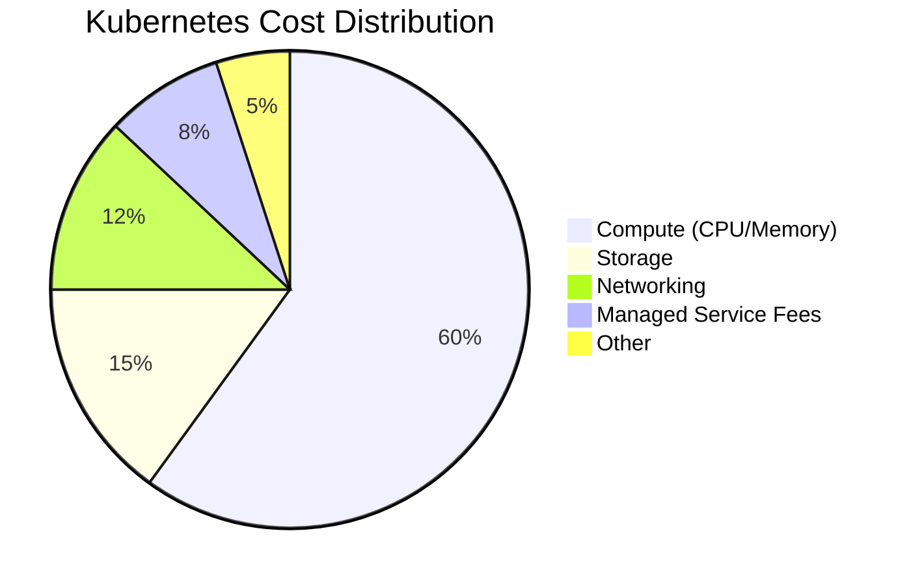
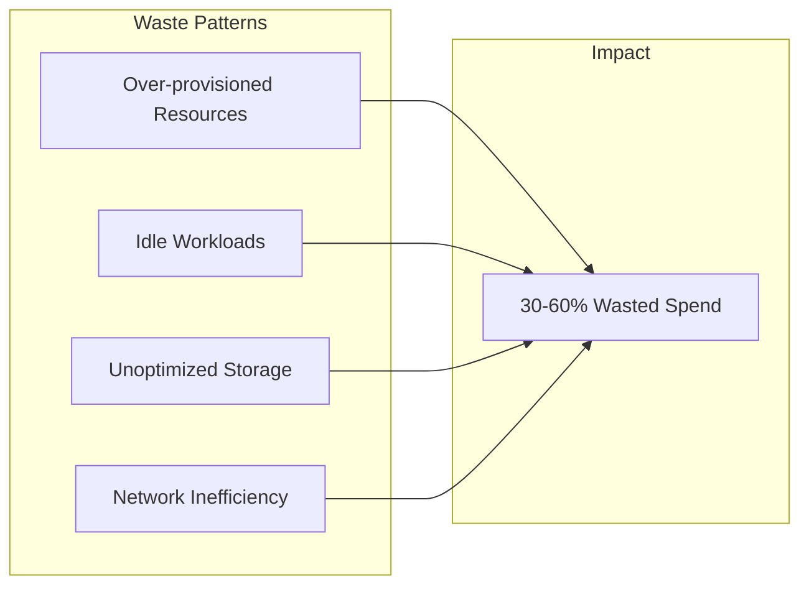
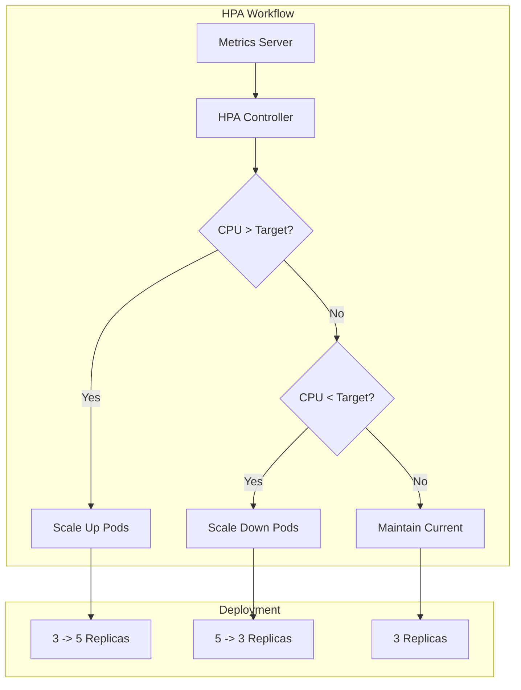
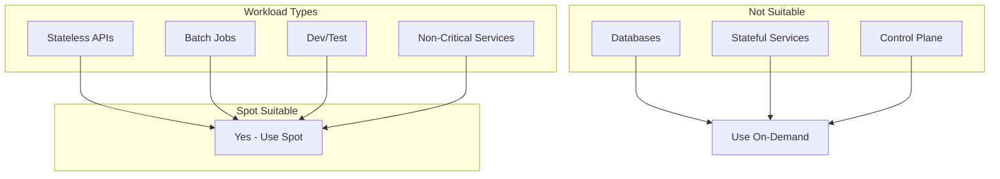
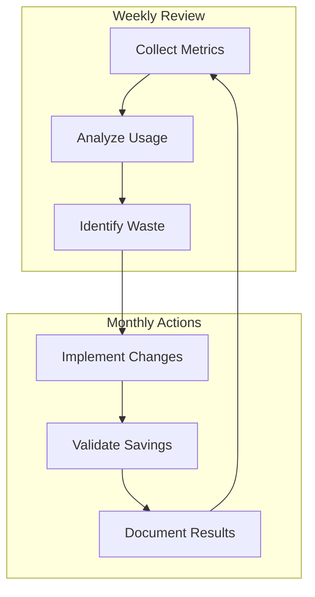

# How to Handle Kubernetes Cost Optimization

Author: [nawazdhandala](https://www.github.com/nawazdhandala)

Tags: Kubernetes, Cost Optimization, FinOps, Cloud Native, DevOps, Resource Management, Autoscaling

Description: A practical guide to reducing Kubernetes costs through resource right-sizing, autoscaling strategies, spot instances, and effective cost visibility tools.

---

Running Kubernetes in production can quickly become expensive without proper cost management strategies. Organizations often discover that cloud bills exceed expectations due to over-provisioned resources, idle workloads, and inefficient scheduling. Optimizing Kubernetes costs requires a combination of visibility, automation, and continuous improvement practices.

## Understanding Kubernetes Cost Drivers

Before optimizing, you need to understand where your money goes. Kubernetes costs primarily come from compute resources (CPU and memory), storage, networking, and managed service fees.



### Common Cost Waste Patterns

Most Kubernetes environments suffer from similar inefficiencies that inflate cloud bills:



## Resource Right-Sizing

Right-sizing means matching resource requests and limits to actual workload needs. Many teams set high requests "just in case" and never revisit them.

### Analyzing Current Resource Usage

The following command retrieves CPU and memory usage metrics for all pods in a namespace. Running this regularly helps identify over-provisioned workloads.

```bash
# Get resource usage for all pods in a namespace
# Shows actual CPU and memory consumption versus requested amounts
kubectl top pods -n production --containers

# Output example:
# POD                     NAME        CPU(cores)   MEMORY(bytes)
# api-server-xyz          api         125m         256Mi
# api-server-xyz          sidecar     5m           32Mi
```

### Comparing Requests vs Actual Usage

Create a script to identify pods with significant gaps between requested resources and actual usage.

```bash
#!/bin/bash
# identify-overprovisioned.sh
# Finds pods where actual usage is less than 50% of requested resources

NAMESPACE=${1:-default}

echo "Analyzing resource utilization in namespace: $NAMESPACE"
echo "=================================================="

# Get pods with their resource requests
kubectl get pods -n $NAMESPACE -o jsonpath='{range .items[*]}{.metadata.name}{"\t"}{.spec.containers[0].resources.requests.cpu}{"\t"}{.spec.containers[0].resources.requests.memory}{"\n"}{end}'

# Compare with actual usage
echo ""
echo "Current Usage:"
kubectl top pods -n $NAMESPACE
```

### Setting Appropriate Resource Requests

Base your resource requests on observed usage patterns. Add a 20-30% buffer above the 95th percentile of actual usage.

The following deployment configuration shows proper resource settings based on observed metrics.

```yaml
# optimized-deployment.yaml
# Resource settings based on 2 weeks of production metrics:
# - CPU P95: 180m, P99: 220m
# - Memory P95: 380Mi, P99: 420Mi
apiVersion: apps/v1
kind: Deployment
metadata:
  name: api-server
  namespace: production
spec:
  replicas: 3
  selector:
    matchLabels:
      app: api-server
  template:
    metadata:
      labels:
        app: api-server
    spec:
      containers:
        - name: api
          image: myapp/api:v2.1.0
          resources:
            # Request slightly above P95 to handle normal traffic
            requests:
              cpu: 200m
              memory: 400Mi
            # Limits allow bursting but prevent runaway resource consumption
            limits:
              cpu: 500m
              memory: 800Mi
```

## Implementing Autoscaling

Autoscaling adjusts resources automatically based on demand, preventing both over-provisioning during quiet periods and under-provisioning during traffic spikes.

### Horizontal Pod Autoscaler (HPA)

HPA scales the number of pod replicas based on observed CPU utilization or custom metrics.



The HPA configuration below targets 70% CPU utilization, which balances responsiveness with cost efficiency.

```yaml
# hpa-cost-optimized.yaml
# Optimized HPA settings that prioritize cost efficiency
# Higher utilization targets mean fewer pods but higher density
apiVersion: autoscaling/v2
kind: HorizontalPodAutoscaler
metadata:
  name: api-server-hpa
  namespace: production
spec:
  scaleTargetRef:
    apiVersion: apps/v1
    kind: Deployment
    name: api-server
  # Minimum replicas for high availability
  minReplicas: 2
  # Maximum replicas to cap costs
  maxReplicas: 20
  metrics:
    - type: Resource
      resource:
        name: cpu
        target:
          # Target 70% utilization for better cost efficiency
          # Lower values like 50% cause more pods but lower utilization
          type: Utilization
          averageUtilization: 70
    - type: Resource
      resource:
        name: memory
        target:
          type: Utilization
          averageUtilization: 75
  behavior:
    # Conservative scale-down prevents thrashing and saves resources
    scaleDown:
      stabilizationWindowSeconds: 300
      policies:
        - type: Percent
          value: 10
          periodSeconds: 60
    # Aggressive scale-up ensures responsiveness
    scaleUp:
      stabilizationWindowSeconds: 0
      policies:
        - type: Percent
          value: 100
          periodSeconds: 15
```

### Vertical Pod Autoscaler (VPA)

VPA automatically adjusts CPU and memory requests based on historical usage patterns.

The following VPA configuration monitors a deployment and recommends optimal resource settings.

```yaml
# vpa-recommendation.yaml
# VPA in recommendation mode collects data without making changes
# Review recommendations before enabling automatic updates
apiVersion: autoscaling.k8s.io/v1
kind: VerticalPodAutoscaler
metadata:
  name: api-server-vpa
  namespace: production
spec:
  targetRef:
    apiVersion: apps/v1
    kind: Deployment
    name: api-server
  # Start with "Off" mode to review recommendations before enabling
  updatePolicy:
    updateMode: "Off"
  resourcePolicy:
    containerPolicies:
      - containerName: api
        # Set boundaries to prevent extreme recommendations
        minAllowed:
          cpu: 50m
          memory: 128Mi
        maxAllowed:
          cpu: 2
          memory: 4Gi
```

Query VPA recommendations to understand optimal resource settings.

```bash
# Check VPA recommendations for a specific deployment
# Compare these values against current requests to identify savings
kubectl get vpa api-server-vpa -n production -o jsonpath='{.status.recommendation.containerRecommendations[*]}' | jq .

# Sample output shows lower bound, target, and upper bound recommendations
# {
#   "containerName": "api",
#   "lowerBound": { "cpu": "100m", "memory": "200Mi" },
#   "target": { "cpu": "180m", "memory": "350Mi" },
#   "upperBound": { "cpu": "300m", "memory": "500Mi" }
# }
```

## Leveraging Spot Instances

Spot instances (called Spot on AWS, Preemptible on GCP, and Spot on Azure) offer 60-90% discounts compared to on-demand pricing. The tradeoff is that cloud providers can reclaim these instances with short notice.



### Configuring Workloads for Spot

Use node affinity and tolerations to schedule appropriate workloads on spot instances.

```yaml
# spot-tolerant-deployment.yaml
# Deploys stateless workloads to spot instances for cost savings
# Includes topology spread to handle spot interruptions gracefully
apiVersion: apps/v1
kind: Deployment
metadata:
  name: batch-processor
  namespace: batch
spec:
  replicas: 5
  selector:
    matchLabels:
      app: batch-processor
  template:
    metadata:
      labels:
        app: batch-processor
    spec:
      # Prefer spot instances but allow fallback to on-demand
      affinity:
        nodeAffinity:
          preferredDuringSchedulingIgnoredDuringExecution:
            - weight: 100
              preference:
                matchExpressions:
                  - key: node.kubernetes.io/capacity-type
                    operator: In
                    values:
                      - spot
      # Tolerate spot instance taints
      tolerations:
        - key: "kubernetes.io/capacity-type"
          operator: "Equal"
          value: "spot"
          effect: "NoSchedule"
      # Spread pods across availability zones for resilience
      topologySpreadConstraints:
        - maxSkew: 1
          topologyKey: topology.kubernetes.io/zone
          whenUnsatisfiable: ScheduleAnyway
          labelSelector:
            matchLabels:
              app: batch-processor
      # Short termination grace period for faster rescheduling
      terminationGracePeriodSeconds: 30
      containers:
        - name: processor
          image: myapp/batch:v1.5.0
          resources:
            requests:
              cpu: 500m
              memory: 512Mi
```

### Handling Spot Interruptions

Implement proper shutdown handling to deal with spot instance interruptions.

```python
# graceful_shutdown.py
# Handles spot instance termination notices gracefully
# Completes in-progress work before shutdown

import signal
import sys
import time
from threading import Event

shutdown_event = Event()

def handle_termination(signum, frame):
    """
    Signal handler for graceful shutdown.
    Called when Kubernetes sends SIGTERM before pod eviction.
    """
    print("Received termination signal, initiating graceful shutdown...")
    shutdown_event.set()

# Register signal handlers for graceful shutdown
signal.signal(signal.SIGTERM, handle_termination)
signal.signal(signal.SIGINT, handle_termination)

def process_batch():
    """
    Main processing loop that checks for shutdown signals.
    Completes current work item before exiting.
    """
    while not shutdown_event.is_set():
        # Simulate work processing
        work_item = get_next_work_item()
        if work_item:
            process_work(work_item)
            mark_work_complete(work_item)
        else:
            # No work available, sleep briefly
            time.sleep(1)

    print("Shutdown complete, all work items processed")
    sys.exit(0)

def get_next_work_item():
    # Fetch next work item from queue
    pass

def process_work(item):
    # Process the work item
    pass

def mark_work_complete(item):
    # Mark item as complete in database/queue
    pass

if __name__ == "__main__":
    process_batch()
```

## Cost Visibility and Monitoring

You cannot optimize what you cannot measure. Implement cost monitoring to track spending by namespace, team, and application.

### Setting Up Cost Allocation Labels

Consistent labeling enables accurate cost attribution across teams and projects.

```yaml
# namespace-with-cost-labels.yaml
# Namespace configuration with cost allocation metadata
# Labels enable breaking down costs by team and project
apiVersion: v1
kind: Namespace
metadata:
  name: payments-team
  labels:
    # Cost center for financial tracking
    cost-center: "engineering-payments"
    # Team ownership for accountability
    team: "payments"
    # Environment classification
    environment: "production"
    # Business unit for executive reporting
    business-unit: "platform"
---
# LimitRange ensures all pods in the namespace have resource requests
apiVersion: v1
kind: LimitRange
metadata:
  name: default-limits
  namespace: payments-team
spec:
  limits:
    - type: Container
      # Default resources if not specified
      default:
        cpu: 200m
        memory: 256Mi
      # Default requests for cost tracking
      defaultRequest:
        cpu: 100m
        memory: 128Mi
```

### Prometheus Metrics for Cost Tracking

Collect resource metrics using Prometheus for cost analysis.

```yaml
# prometheus-rules.yaml
# Recording rules that pre-calculate cost metrics
# Reduces query complexity and improves dashboard performance
apiVersion: monitoring.coreos.com/v1
kind: PrometheusRule
metadata:
  name: cost-metrics
  namespace: monitoring
spec:
  groups:
    - name: cost.rules
      rules:
        # Calculate CPU cost per namespace
        # Multiplies CPU usage by hourly rate
        - record: namespace:cpu_cost_hourly:sum
          expr: |
            sum by (namespace) (
              rate(container_cpu_usage_seconds_total{container!=""}[5m])
            ) * 0.031611  # AWS m5.large hourly rate per vCPU

        # Calculate memory cost per namespace
        # Converts bytes to GB and multiplies by hourly rate
        - record: namespace:memory_cost_hourly:sum
          expr: |
            sum by (namespace) (
              container_memory_usage_bytes{container!=""}
            ) / 1024 / 1024 / 1024 * 0.004237  # AWS hourly rate per GB

        # Identify idle resources by comparing requests to usage
        - record: namespace:idle_cpu_ratio:avg
          expr: |
            1 - (
              sum by (namespace) (rate(container_cpu_usage_seconds_total[5m]))
              /
              sum by (namespace) (kube_pod_container_resource_requests{resource="cpu"})
            )
```

### Cost Dashboard Query Examples

Use these PromQL queries in Grafana dashboards to visualize costs.

```promql
# Total estimated monthly cost by namespace
# Multiplies hourly cost by hours in a month
sum by (namespace) (
  namespace:cpu_cost_hourly:sum + namespace:memory_cost_hourly:sum
) * 720

# Top 10 most expensive deployments
topk(10,
  sum by (deployment) (
    label_replace(
      rate(container_cpu_usage_seconds_total{container!=""}[5m]) * 0.031611,
      "deployment", "$1", "pod", "(.*)-[a-z0-9]+-[a-z0-9]+"
    )
  )
)

# Resource efficiency score (usage / requests)
# Values below 0.5 indicate significant over-provisioning
sum(rate(container_cpu_usage_seconds_total[5m]))
/
sum(kube_pod_container_resource_requests{resource="cpu"})
```

## Implementing Resource Quotas

Resource quotas prevent runaway costs by limiting what each namespace can consume.

```yaml
# resource-quota.yaml
# Limits total resources available to a namespace
# Prevents any single team from consuming excessive cluster resources
apiVersion: v1
kind: ResourceQuota
metadata:
  name: team-quota
  namespace: payments-team
spec:
  hard:
    # Limit total CPU requests to 20 cores
    requests.cpu: "20"
    # Limit total memory requests to 40GB
    requests.memory: "40Gi"
    # Limit CPU limits to prevent burst overcommit
    limits.cpu: "40"
    limits.memory: "80Gi"
    # Limit number of pods to prevent pod sprawl
    pods: "100"
    # Limit persistent storage claims
    persistentvolumeclaims: "20"
    requests.storage: "500Gi"
```

Monitor quota usage to identify teams approaching limits.

```bash
# Check quota usage across all namespaces
# Identify namespaces approaching their limits
kubectl get resourcequota -A -o custom-columns=\
NAMESPACE:.metadata.namespace,\
NAME:.metadata.name,\
CPU_USED:.status.used.requests\\.cpu,\
CPU_HARD:.status.hard.requests\\.cpu,\
MEM_USED:.status.used.requests\\.memory,\
MEM_HARD:.status.hard.requests\\.memory
```

## Scheduling Optimization

Efficient scheduling maximizes resource utilization across your cluster.

### Pod Priority and Preemption

Use priority classes to ensure critical workloads get resources while allowing less important workloads to be preempted.

```yaml
# priority-classes.yaml
# Define priority levels for workload scheduling
# Higher priority workloads can preempt lower priority ones
apiVersion: scheduling.k8s.io/v1
kind: PriorityClass
metadata:
  name: critical
value: 1000000
globalDefault: false
description: "Critical production workloads that should never be preempted"
---
apiVersion: scheduling.k8s.io/v1
kind: PriorityClass
metadata:
  name: high-priority
value: 100000
globalDefault: false
description: "Important workloads with high availability requirements"
---
apiVersion: scheduling.k8s.io/v1
kind: PriorityClass
metadata:
  name: batch
value: 1000
globalDefault: false
preemptionPolicy: PreemptLowerPriority
description: "Batch jobs that can be preempted if cluster resources are needed"
```

### Bin Packing Configuration

Configure the scheduler to maximize node utilization through bin packing.

```yaml
# scheduler-config.yaml
# Scheduler configuration optimized for cost efficiency
# Prioritizes filling nodes before scaling out
apiVersion: kubescheduler.config.k8s.io/v1
kind: KubeSchedulerConfiguration
profiles:
  - schedulerName: cost-optimized-scheduler
    plugins:
      score:
        enabled:
          # Prefer nodes with more allocated resources (bin packing)
          - name: NodeResourcesFit
            weight: 10
        disabled:
          # Disable spreading which works against bin packing
          - name: NodeResourcesBalancedAllocation
    pluginConfig:
      - name: NodeResourcesFit
        args:
          # Favor nodes where resources are already allocated
          scoringStrategy:
            type: MostAllocated
            resources:
              - name: cpu
                weight: 1
              - name: memory
                weight: 1
```

## Cleanup and Maintenance

Regular cleanup prevents resource accumulation that inflates costs.

### Identifying Unused Resources

The following script identifies common resource waste patterns.

```bash
#!/bin/bash
# cleanup-audit.sh
# Identifies unused Kubernetes resources that may be wasting money

echo "=== Pods in Failed State (older than 24h) ==="
kubectl get pods -A --field-selector=status.phase=Failed \
  -o jsonpath='{range .items[*]}{.metadata.namespace}/{.metadata.name}{"\n"}{end}'

echo ""
echo "=== Completed Jobs (older than 7 days) ==="
kubectl get jobs -A -o json | jq -r '
  .items[] |
  select(.status.completionTime != null) |
  select((now - (.status.completionTime | fromdateiso8601)) > 604800) |
  "\(.metadata.namespace)/\(.metadata.name)"
'

echo ""
echo "=== Unbound PersistentVolumeClaims ==="
kubectl get pvc -A --field-selector=status.phase!=Bound \
  -o custom-columns=NAMESPACE:.metadata.namespace,NAME:.metadata.name,STATUS:.status.phase

echo ""
echo "=== ConfigMaps not referenced by any pod ==="
for ns in $(kubectl get ns -o jsonpath='{.items[*].metadata.name}'); do
  for cm in $(kubectl get cm -n $ns -o jsonpath='{.items[*].metadata.name}'); do
    # Check if configmap is used by any pod
    refs=$(kubectl get pods -n $ns -o json | grep -c "\"name\": \"$cm\"" || true)
    if [ "$refs" -eq 0 ]; then
      echo "$ns/$cm"
    fi
  done
done
```

### Automated TTL for Jobs

Configure automatic cleanup for completed jobs.

```yaml
# job-with-ttl.yaml
# Job configuration with automatic cleanup after completion
# Prevents accumulation of completed job resources
apiVersion: batch/v1
kind: Job
metadata:
  name: data-export
spec:
  # Automatically delete job 1 hour after completion
  ttlSecondsAfterFinished: 3600
  template:
    spec:
      restartPolicy: Never
      containers:
        - name: exporter
          image: myapp/exporter:v1.0
```

## Cost Optimization Workflow

Implement a continuous optimization process rather than one-time fixes.



### Weekly Cost Review Checklist

Run through this checklist weekly to maintain cost efficiency:

```markdown
## Weekly Cost Review

### Resource Utilization
- [ ] CPU utilization above 60% cluster-wide
- [ ] Memory utilization above 65% cluster-wide
- [ ] No pods with less than 30% resource utilization

### Autoscaling Health
- [ ] HPA actively scaling workloads
- [ ] No pods hitting resource limits frequently
- [ ] VPA recommendations reviewed

### Waste Identification
- [ ] No orphaned PVCs
- [ ] No failed pods older than 24 hours
- [ ] No completed jobs older than 7 days

### Spot Instance Usage
- [ ] Non-critical workloads running on spot
- [ ] Spot interruption rate acceptable
- [ ] Fallback to on-demand working correctly
```

## Summary

Kubernetes cost optimization requires ongoing attention and a multi-faceted approach. Start by gaining visibility into where costs originate through proper labeling and monitoring. Right-size workloads based on actual usage data rather than guesswork. Implement autoscaling to match resources with demand automatically. Leverage spot instances for fault-tolerant workloads to achieve significant savings. Finally, establish regular review processes to catch and address waste before it accumulates.

The most successful cost optimization programs treat FinOps as a continuous practice rather than a one-time project. By combining technical controls with organizational processes, teams can achieve 30-50% reductions in Kubernetes spending while maintaining performance and reliability requirements.
