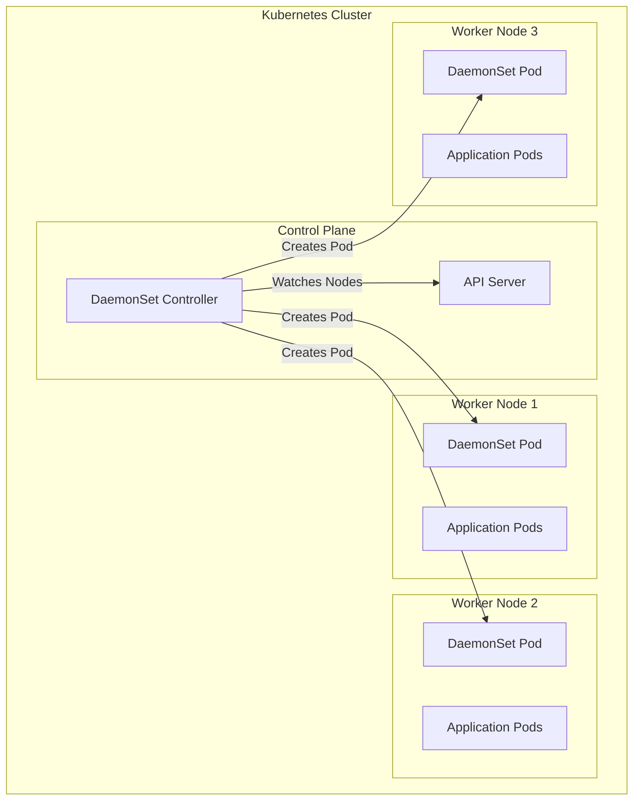
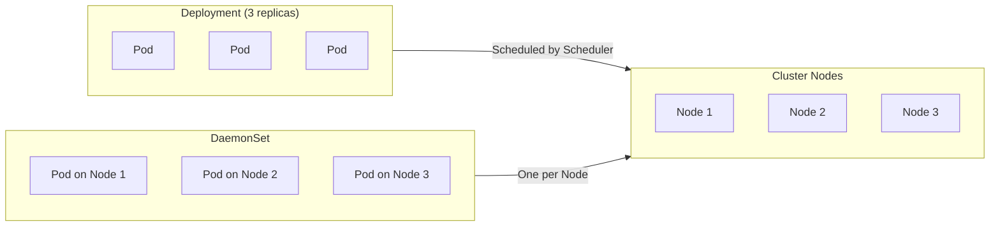
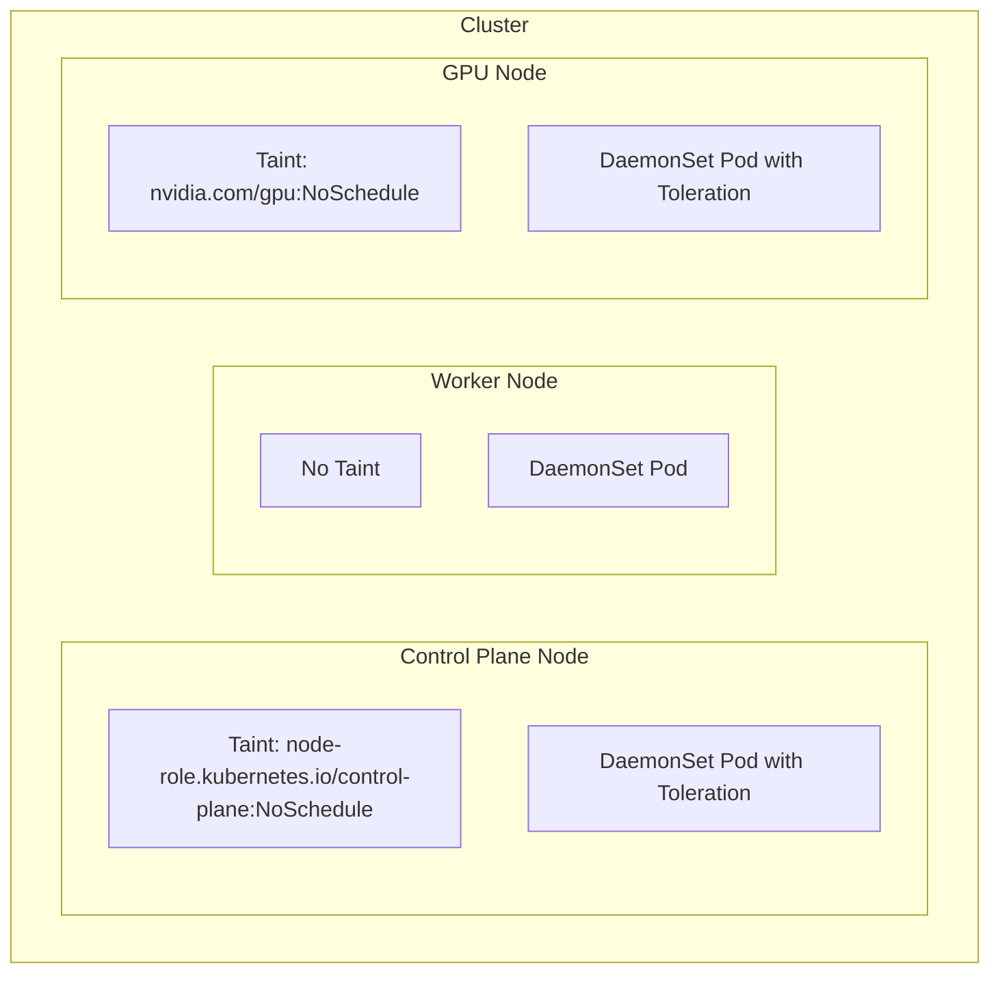
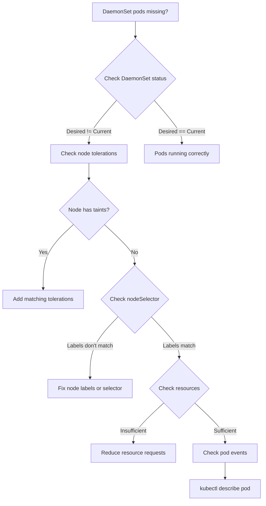

# How to Use Kubernetes DaemonSets

Author: [nawazdhandala](https://www.github.com/nawazdhandala)

Tags: Kubernetes, DaemonSets, Container Orchestration, DevOps, K8s Tutorial

Description: A complete guide to Kubernetes DaemonSets - learn how to create, configure, update, and troubleshoot DaemonSets to run pods on every node in your cluster.

---

DaemonSets are a powerful Kubernetes workload resource that ensures a copy of a specific pod runs on all (or a subset of) nodes in your cluster. Unlike Deployments that run a specified number of replicas across the cluster, DaemonSets guarantee exactly one pod per node, making them perfect for cluster-wide operations like logging, monitoring, and networking.

## What is a DaemonSet?

A DaemonSet ensures that as nodes join the cluster, pods are automatically scheduled on them. When nodes are removed, those pods are garbage collected. Deleting a DaemonSet cleans up all the pods it created.

Here's how DaemonSets work within a Kubernetes cluster:



## When to Use DaemonSets

DaemonSets are ideal for scenarios where you need to run a service on every node:

| Use Case | Example | Why DaemonSet? |
|----------|---------|----------------|
| Log Collection | Fluentd, Fluent Bit, Filebeat | Needs access to node-level logs |
| Monitoring | Node Exporter, Datadog Agent | Collects metrics from each node |
| Networking | Calico, Cilium, Weave | Manages network on every node |
| Storage | CSI Node Plugins | Handles volume mounts on each node |
| Security | Falco, Twistlock | Monitors system calls on every node |

## Creating Your First DaemonSet

Let's start with a simple DaemonSet that runs an nginx container on every node. The following YAML defines a basic DaemonSet with minimal configuration:

```yaml
# basic-daemonset.yaml
# A simple DaemonSet that runs nginx on every cluster node
apiVersion: apps/v1
kind: DaemonSet
metadata:
  name: nginx-daemonset
  namespace: default
  labels:
    app: nginx-daemon
spec:
  # The selector must match the pod template labels
  selector:
    matchLabels:
      app: nginx-daemon
  template:
    metadata:
      labels:
        app: nginx-daemon
    spec:
      containers:
        - name: nginx
          image: nginx:1.25
          ports:
            - containerPort: 80
              name: http
          # Resource limits ensure the pod doesn't consume excessive node resources
          resources:
            requests:
              cpu: 50m
              memory: 64Mi
            limits:
              cpu: 100m
              memory: 128Mi
```

Apply the DaemonSet using kubectl:

```bash
# Create the DaemonSet
kubectl apply -f basic-daemonset.yaml

# Verify the DaemonSet was created
kubectl get daemonset nginx-daemonset

# Check that pods are running on each node
kubectl get pods -l app=nginx-daemon -o wide
```

## DaemonSet vs Deployment

Understanding when to use each workload type is crucial for designing your Kubernetes architecture:



| Feature | Deployment | DaemonSet |
|---------|------------|-----------|
| Replica Count | You specify the number | Automatic (one per node) |
| Scheduling | Scheduler decides placement | Guaranteed one per node |
| Scaling | Manual or HPA | Scales with cluster nodes |
| Primary Use | Stateless applications | Node-level services |

## Configuring Node Selection

Sometimes you need to run DaemonSet pods only on specific nodes. Kubernetes provides several mechanisms for node selection.

### Using nodeSelector

nodeSelector is the simplest way to constrain pods to nodes with specific labels:

```yaml
# node-selector-daemonset.yaml
# DaemonSet that only runs on nodes with SSD storage
apiVersion: apps/v1
kind: DaemonSet
metadata:
  name: ssd-monitor
  namespace: monitoring
spec:
  selector:
    matchLabels:
      app: ssd-monitor
  template:
    metadata:
      labels:
        app: ssd-monitor
    spec:
      # Only schedule on nodes labeled with disk-type=ssd
      nodeSelector:
        disk-type: ssd
      containers:
        - name: ssd-monitor
          image: myregistry/ssd-monitor:v1.0.0
          resources:
            requests:
              cpu: 25m
              memory: 32Mi
```

### Using Node Affinity

Node affinity provides more expressive rules for node selection:

```yaml
# node-affinity-daemonset.yaml
# DaemonSet using node affinity for more flexible scheduling
apiVersion: apps/v1
kind: DaemonSet
metadata:
  name: zone-aware-agent
  namespace: monitoring
spec:
  selector:
    matchLabels:
      app: zone-aware-agent
  template:
    metadata:
      labels:
        app: zone-aware-agent
    spec:
      affinity:
        nodeAffinity:
          # Required: Node must be in us-east region
          requiredDuringSchedulingIgnoredDuringExecution:
            nodeSelectorTerms:
              - matchExpressions:
                  - key: topology.kubernetes.io/region
                    operator: In
                    values:
                      - us-east-1
                      - us-east-2
          # Preferred: Would like nodes with newer instance types
          preferredDuringSchedulingIgnoredDuringExecution:
            - weight: 100
              preference:
                matchExpressions:
                  - key: node.kubernetes.io/instance-type
                    operator: In
                    values:
                      - m5.large
                      - m5.xlarge
      containers:
        - name: agent
          image: myregistry/zone-agent:v2.0.0
          resources:
            requests:
              cpu: 50m
              memory: 64Mi
```

## Working with Tolerations

By default, DaemonSet pods won't be scheduled on nodes with taints. Tolerations allow your DaemonSet to run on tainted nodes, including control plane nodes.



Here's how to configure tolerations for common scenarios:

```yaml
# tolerations-daemonset.yaml
# DaemonSet configured to run on all nodes, including control plane
apiVersion: apps/v1
kind: DaemonSet
metadata:
  name: cluster-monitor
  namespace: kube-system
spec:
  selector:
    matchLabels:
      app: cluster-monitor
  template:
    metadata:
      labels:
        app: cluster-monitor
    spec:
      tolerations:
        # Tolerate control plane taint (Kubernetes 1.24+)
        - key: node-role.kubernetes.io/control-plane
          operator: Exists
          effect: NoSchedule
        # Tolerate legacy master taint (pre-1.24)
        - key: node-role.kubernetes.io/master
          operator: Exists
          effect: NoSchedule
        # Tolerate not-ready nodes to continue monitoring
        - key: node.kubernetes.io/not-ready
          operator: Exists
          effect: NoExecute
        # Tolerate unreachable nodes
        - key: node.kubernetes.io/unreachable
          operator: Exists
          effect: NoExecute
      containers:
        - name: monitor
          image: myregistry/cluster-monitor:v1.2.0
          resources:
            requests:
              cpu: 100m
              memory: 128Mi
            limits:
              cpu: 200m
              memory: 256Mi
```

To tolerate all taints (useful for critical system services):

```yaml
# Tolerate all taints - use with caution
tolerations:
  - operator: Exists
```

## Update Strategies

DaemonSets support two update strategies: RollingUpdate and OnDelete.

### RollingUpdate Strategy

RollingUpdate is the default and preferred strategy for most scenarios:

```yaml
# rolling-update-daemonset.yaml
# DaemonSet with controlled rolling update
apiVersion: apps/v1
kind: DaemonSet
metadata:
  name: log-collector
  namespace: logging
spec:
  # Configure rolling update behavior
  updateStrategy:
    type: RollingUpdate
    rollingUpdate:
      # Maximum number of pods that can be unavailable during update
      # Can be an absolute number or percentage
      maxUnavailable: 1
      # For larger clusters, use percentage
      # maxUnavailable: 10%
      # Maximum number of pods that can be created above desired count
      maxSurge: 0
  selector:
    matchLabels:
      app: log-collector
  template:
    metadata:
      labels:
        app: log-collector
    spec:
      containers:
        - name: fluent-bit
          image: fluent/fluent-bit:2.2.0
          resources:
            requests:
              cpu: 100m
              memory: 128Mi
```

### OnDelete Strategy

OnDelete requires manual pod deletion to trigger updates, giving you precise control:

```yaml
# ondelete-daemonset.yaml
# DaemonSet with manual update control
apiVersion: apps/v1
kind: DaemonSet
metadata:
  name: critical-agent
  namespace: kube-system
spec:
  # Pods only update when manually deleted
  updateStrategy:
    type: OnDelete
  selector:
    matchLabels:
      app: critical-agent
  template:
    metadata:
      labels:
        app: critical-agent
    spec:
      containers:
        - name: agent
          image: myregistry/critical-agent:v3.0.0
          resources:
            requests:
              cpu: 50m
              memory: 64Mi
```

## Accessing Host Resources

DaemonSets often need access to host-level resources. The following example shows common patterns for accessing host filesystems, network, and process namespaces:

```yaml
# host-access-daemonset.yaml
# DaemonSet with host resource access for log collection
apiVersion: apps/v1
kind: DaemonSet
metadata:
  name: host-log-collector
  namespace: logging
spec:
  selector:
    matchLabels:
      app: host-log-collector
  template:
    metadata:
      labels:
        app: host-log-collector
    spec:
      # Use host network for network monitoring scenarios
      # hostNetwork: true

      # Access host process namespace (needed for process monitoring)
      # hostPID: true

      containers:
        - name: collector
          image: fluent/fluent-bit:2.2.0
          # Security context for reading host files
          securityContext:
            # Run as root to access host logs
            runAsUser: 0
            # Read-only root filesystem for security
            readOnlyRootFilesystem: true
          # Mount host paths to access node-level logs
          volumeMounts:
            - name: varlog
              mountPath: /var/log
              readOnly: true
            - name: containers-log
              mountPath: /var/lib/docker/containers
              readOnly: true
            - name: machine-id
              mountPath: /etc/machine-id
              readOnly: true
          # Environment variable to identify which node the pod runs on
          env:
            - name: NODE_NAME
              valueFrom:
                fieldRef:
                  fieldPath: spec.nodeName
          resources:
            requests:
              cpu: 100m
              memory: 128Mi
            limits:
              cpu: 500m
              memory: 512Mi
      # Define volumes for host paths
      volumes:
        - name: varlog
          hostPath:
            path: /var/log
            type: Directory
        - name: containers-log
          hostPath:
            path: /var/lib/docker/containers
            type: DirectoryOrCreate
        - name: machine-id
          hostPath:
            path: /etc/machine-id
            type: File
      # Run on all nodes including those with taints
      tolerations:
        - operator: Exists
```

## Practical Example: Node Monitoring Agent

Let's build a complete monitoring agent DaemonSet that collects system metrics from every node:

```yaml
# monitoring-agent-daemonset.yaml
# Complete monitoring agent DaemonSet with all best practices
apiVersion: apps/v1
kind: DaemonSet
metadata:
  name: node-monitor
  namespace: monitoring
  labels:
    app.kubernetes.io/name: node-monitor
    app.kubernetes.io/component: monitoring
spec:
  selector:
    matchLabels:
      app.kubernetes.io/name: node-monitor
  updateStrategy:
    type: RollingUpdate
    rollingUpdate:
      maxUnavailable: 1
  template:
    metadata:
      labels:
        app.kubernetes.io/name: node-monitor
      annotations:
        prometheus.io/scrape: "true"
        prometheus.io/port: "9100"
    spec:
      serviceAccountName: node-monitor
      # High priority to ensure monitoring always runs
      priorityClassName: system-node-critical

      # Use host network to report accurate network metrics
      hostNetwork: true
      hostPID: true

      containers:
        - name: node-exporter
          image: prom/node-exporter:v1.7.0
          args:
            - --path.procfs=/host/proc
            - --path.sysfs=/host/sys
            - --path.rootfs=/host/root
            - --collector.filesystem.mount-points-exclude=^/(dev|proc|sys|run|var/lib/docker/.+)($|/)
          ports:
            - containerPort: 9100
              hostPort: 9100
              name: metrics
              protocol: TCP
          securityContext:
            privileged: false
            runAsNonRoot: true
            runAsUser: 65534
          resources:
            requests:
              cpu: 50m
              memory: 64Mi
            limits:
              cpu: 200m
              memory: 128Mi
          # Health checks ensure the exporter is functioning
          livenessProbe:
            httpGet:
              path: /
              port: 9100
            initialDelaySeconds: 10
            periodSeconds: 15
          readinessProbe:
            httpGet:
              path: /
              port: 9100
            initialDelaySeconds: 5
            periodSeconds: 10
          volumeMounts:
            - name: proc
              mountPath: /host/proc
              readOnly: true
            - name: sys
              mountPath: /host/sys
              readOnly: true
            - name: root
              mountPath: /host/root
              readOnly: true
              mountPropagation: HostToContainer

      volumes:
        - name: proc
          hostPath:
            path: /proc
        - name: sys
          hostPath:
            path: /sys
        - name: root
          hostPath:
            path: /

      tolerations:
        - operator: Exists

      # Ensure Linux nodes only
      nodeSelector:
        kubernetes.io/os: linux
---
# ServiceAccount for the DaemonSet
apiVersion: v1
kind: ServiceAccount
metadata:
  name: node-monitor
  namespace: monitoring
---
# Headless service for service discovery
apiVersion: v1
kind: Service
metadata:
  name: node-monitor
  namespace: monitoring
  labels:
    app.kubernetes.io/name: node-monitor
spec:
  clusterIP: None
  ports:
    - name: metrics
      port: 9100
      targetPort: metrics
  selector:
    app.kubernetes.io/name: node-monitor
```

## Managing DaemonSets

Here are essential kubectl commands for managing DaemonSets:

```bash
# List all DaemonSets across all namespaces
kubectl get daemonset --all-namespaces

# Get detailed information about a specific DaemonSet
kubectl describe daemonset node-monitor -n monitoring

# Check the rollout status
kubectl rollout status daemonset/node-monitor -n monitoring

# View rollout history
kubectl rollout history daemonset/node-monitor -n monitoring

# Rollback to previous version
kubectl rollout undo daemonset/node-monitor -n monitoring

# Rollback to specific revision
kubectl rollout undo daemonset/node-monitor -n monitoring --to-revision=2

# Pause a rollout (useful for canary-style updates)
kubectl rollout pause daemonset/node-monitor -n monitoring

# Resume a paused rollout
kubectl rollout resume daemonset/node-monitor -n monitoring

# Delete a DaemonSet (pods are deleted automatically)
kubectl delete daemonset node-monitor -n monitoring
```

## Troubleshooting DaemonSets

When DaemonSet pods don't run on expected nodes, use the following diagnostic approach:



Common troubleshooting commands:

```bash
# Check DaemonSet status and compare desired vs current pods
kubectl get daemonset node-monitor -n monitoring -o wide

# View events for scheduling issues
kubectl describe daemonset node-monitor -n monitoring | grep -A 20 Events

# Check which nodes are missing pods
kubectl get nodes -o wide
kubectl get pods -n monitoring -l app.kubernetes.io/name=node-monitor -o wide

# Check node taints that might prevent scheduling
kubectl get nodes -o custom-columns=NAME:.metadata.name,TAINTS:.spec.taints

# Check node labels for nodeSelector matching
kubectl get nodes --show-labels

# View pod logs for application errors
kubectl logs -n monitoring -l app.kubernetes.io/name=node-monitor --tail=100

# Check pod events for a specific pod
kubectl describe pod <pod-name> -n monitoring
```

## Best Practices

Following these best practices ensures reliable DaemonSet deployments:

### 1. Always Set Resource Limits

Resource limits prevent DaemonSet pods from consuming excessive node resources:

```yaml
resources:
  requests:
    cpu: 50m
    memory: 64Mi
  limits:
    cpu: 200m
    memory: 256Mi
```

### 2. Use Priority Classes for Critical Services

Ensure critical DaemonSets are scheduled even under resource pressure:

```yaml
# For critical system services
priorityClassName: system-node-critical

# For important but non-critical services
priorityClassName: system-cluster-critical
```

### 3. Implement Health Checks

Health checks ensure pods are functioning correctly:

```yaml
livenessProbe:
  httpGet:
    path: /health
    port: 8080
  initialDelaySeconds: 10
  periodSeconds: 15
  failureThreshold: 3

readinessProbe:
  httpGet:
    path: /ready
    port: 8080
  initialDelaySeconds: 5
  periodSeconds: 10
```

### 4. Use Appropriate Security Context

Minimize privileges while maintaining functionality:

```yaml
securityContext:
  runAsNonRoot: true
  runAsUser: 65534
  readOnlyRootFilesystem: true
  allowPrivilegeEscalation: false
```

### 5. Label Resources Consistently

Use standard Kubernetes labels for better organization:

```yaml
metadata:
  labels:
    app.kubernetes.io/name: my-daemonset
    app.kubernetes.io/component: monitoring
    app.kubernetes.io/part-of: observability-stack
    app.kubernetes.io/version: "1.0.0"
```

## Conclusion

DaemonSets are essential for running cluster-wide services that need to operate on every node. Key takeaways from working with DaemonSets include understanding when to use them versus Deployments, configuring proper tolerations and node selection, implementing appropriate update strategies, and following security best practices.

For production deployments, always consider resource limits, health checks, and monitoring to ensure your DaemonSet pods run reliably across your cluster.

## Related Posts

- [How to Run Kubernetes DaemonSets for Node-Level Services](https://oneuptime.com/blog/post/2026-01-19-kubernetes-daemonsets-node-services/view) - Advanced use cases for DaemonSets
- [How to Use Taints and Tolerations in Kubernetes](https://oneuptime.com/blog/post/2026-01-19-kubernetes-taints-tolerations-scheduling/view) - Deep dive into node scheduling
- [How to Set Up Prometheus and Grafana on Kubernetes](https://oneuptime.com/blog/post/2026-01-19-kubernetes-prometheus-grafana-setup/view) - Monitoring your cluster
