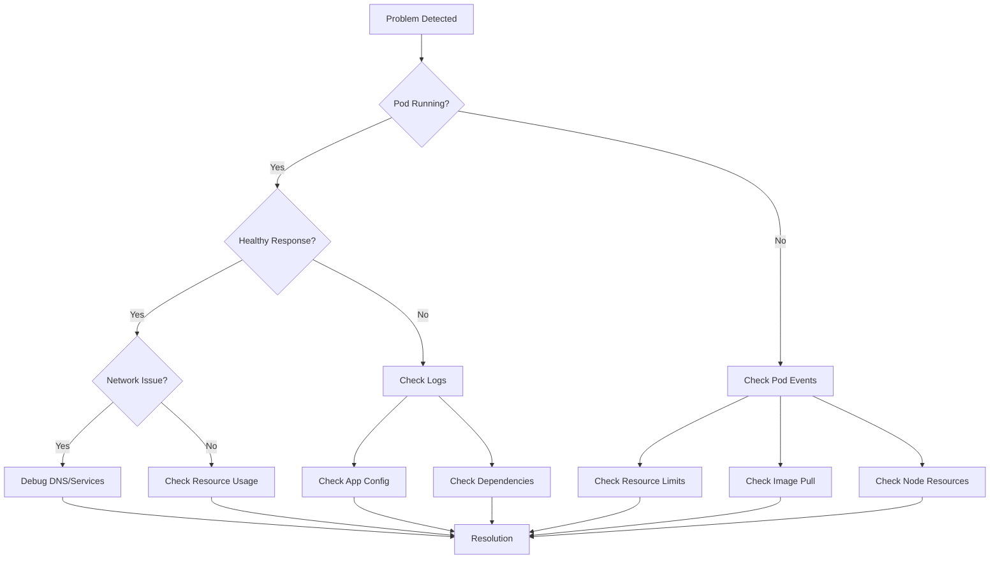
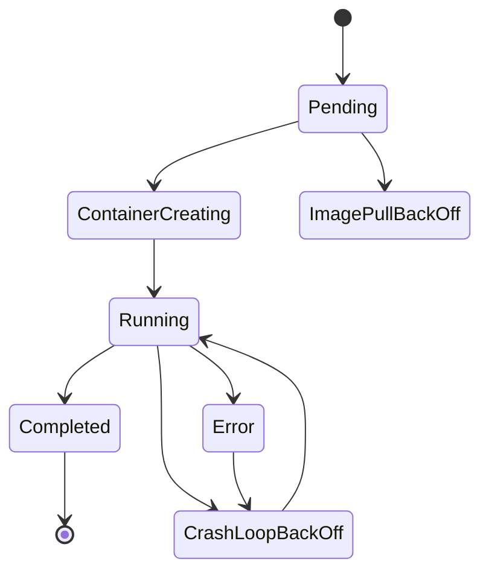
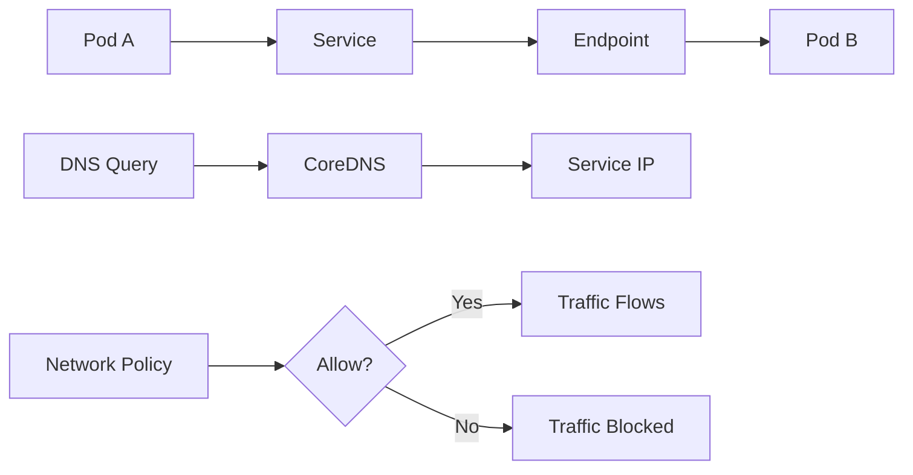
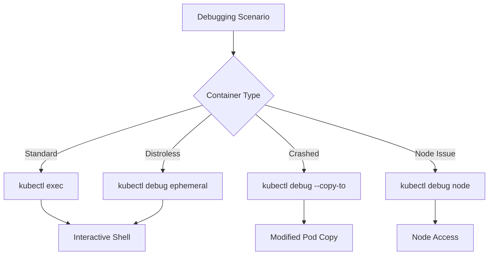
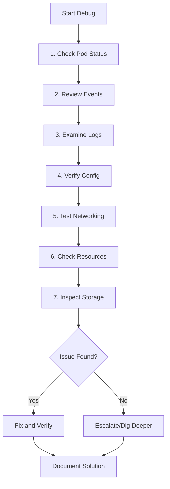

# How to Debug Kubernetes Applications

Author: [nawazdhandala](https://www.github.com/nawazdhandala)

Tags: Kubernetes, Debugging, DevOps, Troubleshooting, Containers, kubectl

Description: A practical guide to debugging Kubernetes applications, covering log analysis, pod inspection, resource diagnostics, networking issues, and advanced troubleshooting techniques with real-world examples.

---

Debugging applications running in Kubernetes clusters requires a different mindset than debugging traditional applications. Containers introduce layers of abstraction, networking complexity, and distributed systems challenges that can make finding root causes tricky. Let me walk you through battle-tested approaches for identifying and resolving issues in your Kubernetes workloads.

## Understanding the Debugging Workflow

Before diving into specific commands, understanding the typical debugging workflow helps you approach problems systematically.



## Inspecting Pod Status and Events

Pod events tell you exactly what Kubernetes sees when trying to run your workload. Start every debugging session here.

The following command shows detailed pod information including conditions, events, and container states.

```bash
# Get comprehensive pod details with events
kubectl describe pod <pod-name> -n <namespace>

# Quick status check across all pods in namespace
kubectl get pods -n <namespace> -o wide

# Watch pods in real-time for status changes
kubectl get pods -n <namespace> -w
```

### Decoding Common Pod States

Different pod statuses indicate specific problems that require different approaches.



Here are the most common pod states and their meanings:

| State | Cause | First Action |
|-------|-------|--------------|
| Pending | No suitable node, resource constraints | Check node resources, taints, affinity |
| ImagePullBackOff | Image not found, auth issues | Verify image name, check registry secrets |
| CrashLoopBackOff | Container crashes repeatedly | Check logs, verify config and dependencies |
| OOMKilled | Container exceeded memory limit | Increase memory limits or optimize app |
| Error | Container exited with error | Check logs for error messages |

## Analyzing Container Logs

Logs are your window into what the application experiences at runtime. Kubernetes provides several ways to access them.

Use the following commands to retrieve logs from containers in different states.

```bash
# Get current logs from a running container
kubectl logs <pod-name> -n <namespace>

# Get logs from a specific container in multi-container pod
kubectl logs <pod-name> -c <container-name> -n <namespace>

# Follow logs in real-time (like tail -f)
kubectl logs -f <pod-name> -n <namespace>

# Get logs from previous container instance (after restart)
kubectl logs <pod-name> --previous -n <namespace>

# Get logs with timestamps for correlation
kubectl logs <pod-name> --timestamps -n <namespace>

# Get last 100 lines only
kubectl logs <pod-name> --tail=100 -n <namespace>

# Get logs from last 30 minutes
kubectl logs <pod-name> --since=30m -n <namespace>
```

### Aggregating Logs Across Pods

When debugging issues that span multiple replicas, aggregate logs using label selectors.

```bash
# Get logs from all pods matching a label
kubectl logs -l app=myapp -n <namespace>

# Follow logs from all matching pods simultaneously
kubectl logs -l app=myapp -n <namespace> -f

# Combine with stern for better multi-pod log tailing
# Install: brew install stern (macOS) or download from GitHub
stern myapp -n <namespace>
stern "myapp-.*" -n <namespace> --since 15m
```

## Executing Commands Inside Containers

Sometimes you need to get inside a container to investigate the runtime environment directly.

The exec command lets you run arbitrary commands inside running containers.

```bash
# Start an interactive shell session
kubectl exec -it <pod-name> -n <namespace> -- /bin/sh

# Run a specific command
kubectl exec <pod-name> -n <namespace> -- cat /app/config.yaml

# Execute in specific container of multi-container pod
kubectl exec -it <pod-name> -c <container-name> -n <namespace> -- /bin/bash

# Check environment variables
kubectl exec <pod-name> -n <namespace> -- env

# Test network connectivity from inside pod
kubectl exec <pod-name> -n <namespace> -- curl -v http://other-service:8080

# Check DNS resolution
kubectl exec <pod-name> -n <namespace> -- nslookup kubernetes.default
```

### When Your Container Has No Shell

Distroless and minimal images often lack debugging tools. Use ephemeral debug containers instead.

```bash
# Attach a debug container to running pod
kubectl debug -it <pod-name> --image=busybox --target=<container-name>

# Use a full-featured network debugging image
kubectl debug -it <pod-name> --image=nicolaka/netshoot --target=<container-name>

# Copy pod with modified entrypoint to debug crashed containers
kubectl debug <pod-name> -it --copy-to=debug-pod --container=<container-name> -- sleep infinity
```

## Debugging Networking Issues

Network problems in Kubernetes can stem from DNS, services, network policies, or the underlying CNI. A systematic approach helps isolate the issue.



### DNS Debugging

DNS issues cause most connectivity problems between services. Verify DNS resolution first.

```bash
# Check if CoreDNS pods are running
kubectl get pods -n kube-system -l k8s-app=kube-dns

# Test DNS resolution from a debug pod
kubectl run dns-test --image=busybox:1.28 --rm -it --restart=Never -- nslookup kubernetes.default

# Check DNS configuration inside pod
kubectl exec <pod-name> -- cat /etc/resolv.conf

# Test full service name resolution
kubectl exec <pod-name> -- nslookup myservice.mynamespace.svc.cluster.local

# Check CoreDNS logs for errors
kubectl logs -n kube-system -l k8s-app=kube-dns
```

### Service and Endpoint Verification

Services route traffic to pods through endpoints. Verify both are configured correctly.

```bash
# Check service details
kubectl describe service <service-name> -n <namespace>

# Verify endpoints exist and point to pods
kubectl get endpoints <service-name> -n <namespace>

# Compare selector with pod labels
kubectl get pods -n <namespace> --show-labels | grep <app-label>

# Check service type and ports
kubectl get svc <service-name> -n <namespace> -o yaml
```

### Network Policy Debugging

Network policies can silently block traffic. Check if policies affect your pods.

```bash
# List network policies in namespace
kubectl get networkpolicy -n <namespace>

# Describe policy to see ingress/egress rules
kubectl describe networkpolicy <policy-name> -n <namespace>

# Check which pods match policy selector
kubectl get pods -n <namespace> -l <policy-selector>

# Test connectivity with verbose output
kubectl exec <pod-name> -- curl -v --connect-timeout 5 http://target-service:8080
```

## Resource Debugging

Resource constraints cause pods to be evicted, throttled, or fail to schedule. Monitor resource usage proactively.

The following commands help identify resource-related issues.

```bash
# Check resource requests and limits for pod
kubectl describe pod <pod-name> | grep -A 5 "Limits:\|Requests:"

# View actual resource usage (requires metrics-server)
kubectl top pods -n <namespace>

# Check node resource capacity and usage
kubectl top nodes

# Find pods with high resource usage
kubectl top pods -n <namespace> --sort-by=memory

# Check for resource quota restrictions
kubectl describe resourcequota -n <namespace>

# View limit ranges in namespace
kubectl describe limitrange -n <namespace>
```

### Investigating OOMKilled Containers

Out-of-memory kills indicate the container exceeded its memory limit.

```bash
# Confirm OOMKilled status
kubectl describe pod <pod-name> | grep -A 10 "Last State:"

# Check container memory limit
kubectl get pod <pod-name> -o jsonpath='{.spec.containers[0].resources.limits.memory}'

# Monitor memory usage in real-time
kubectl exec <pod-name> -- cat /sys/fs/cgroup/memory/memory.usage_in_bytes

# View memory limit in container
kubectl exec <pod-name> -- cat /sys/fs/cgroup/memory/memory.limit_in_bytes
```

## Debugging with kubectl debug

The `kubectl debug` command provides powerful debugging capabilities for tricky scenarios.



### Ephemeral Container Debugging

Attach a debug container to investigate a running pod without restarting it.

```bash
# Basic ephemeral container with busybox
kubectl debug -it <pod-name> --image=busybox --target=<container-name>

# Network debugging with netshoot
kubectl debug -it <pod-name> --image=nicolaka/netshoot --target=<container-name>

# Share process namespace to see other container processes
kubectl debug -it <pod-name> --image=busybox --target=<container-name> --share-processes

# Inside debug container, investigate
ps aux
cat /proc/1/environ | tr '\0' '\n'
netstat -tulpn
```

### Node-Level Debugging

Sometimes issues originate at the node level, requiring direct node access.

```bash
# Create debug pod on specific node
kubectl debug node/<node-name> -it --image=ubuntu

# Inside node debug pod, access host filesystem
chroot /host

# Check kubelet status
systemctl status kubelet

# View kubelet logs
journalctl -u kubelet -n 200

# Check container runtime
crictl ps
crictl logs <container-id>

# Inspect network configuration
ip addr
ip route
iptables -L -n
```

## Configuration and Secret Debugging

Misconfigured ConfigMaps and Secrets cause many application failures. Verify configuration reaches your pods correctly.

```bash
# List ConfigMaps in namespace
kubectl get configmaps -n <namespace>

# View ConfigMap contents
kubectl describe configmap <configmap-name> -n <namespace>

# Check mounted ConfigMap in pod
kubectl exec <pod-name> -- ls -la /etc/config/

# View Secret (base64 encoded by default)
kubectl get secret <secret-name> -n <namespace> -o jsonpath='{.data}'

# Decode a specific secret value
kubectl get secret <secret-name> -n <namespace> -o jsonpath='{.data.password}' | base64 -d

# Verify environment variables from ConfigMap/Secret
kubectl exec <pod-name> -- env | grep -i <expected-var>
```

## Debugging Persistent Volume Issues

Storage problems prevent pods from starting or cause data access failures.

```bash
# List PersistentVolumeClaims
kubectl get pvc -n <namespace>

# Check PVC status and bound PV
kubectl describe pvc <pvc-name> -n <namespace>

# List PersistentVolumes
kubectl get pv

# Check PV details and reclaim policy
kubectl describe pv <pv-name>

# View storage class details
kubectl describe storageclass <storageclass-name>

# Check events for storage provisioning issues
kubectl get events -n <namespace> | grep -i pvc
```

### Common PVC Issues

| Status | Cause | Resolution |
|--------|-------|------------|
| Pending | No matching PV, StorageClass issue | Check StorageClass, verify provisioner |
| Lost | PV deleted while PVC bound | Restore PV or recreate workload |
| Bound (pod pending) | Access mode mismatch, node affinity | Verify access modes, check node selector |

## Creating a Debug Toolkit Deployment

Deploy a persistent debugging pod in your cluster for ongoing troubleshooting.

A debug pod with networking and system tools available makes investigation easier.

```yaml
# debug-toolkit.yaml
apiVersion: v1
kind: Pod
metadata:
  name: debug-toolkit
  namespace: default
  labels:
    app: debug-toolkit
spec:
  containers:
  - name: debug
    image: nicolaka/netshoot
    command: ["sleep", "infinity"]
    resources:
      limits:
        memory: "256Mi"
        cpu: "500m"
      requests:
        memory: "128Mi"
        cpu: "100m"
    securityContext:
      capabilities:
        add:
        - NET_ADMIN
        - SYS_PTRACE
```

Apply and use the debug toolkit.

```bash
# Deploy the debug toolkit
kubectl apply -f debug-toolkit.yaml

# Access the debug pod
kubectl exec -it debug-toolkit -- bash

# From inside, test connectivity to any service
curl -v http://myservice.mynamespace.svc.cluster.local:8080
dig myservice.mynamespace.svc.cluster.local
tcpdump -i eth0 port 8080
```

## Debugging Application Crashes

When applications crash, gather information systematically before the evidence disappears.

```bash
# Get crash information from pod description
kubectl describe pod <pod-name> -n <namespace>

# Check previous container logs (crucial for CrashLoopBackOff)
kubectl logs <pod-name> --previous -n <namespace>

# Check restart count and last termination reason
kubectl get pod <pod-name> -o jsonpath='{.status.containerStatuses[0].restartCount}'
kubectl get pod <pod-name> -o jsonpath='{.status.containerStatuses[0].lastState.terminated.reason}'

# For Java applications, check for heap dumps
kubectl exec <pod-name> -- ls -la /tmp/*.hprof

# Copy crash artifacts out of the container
kubectl cp <pod-name>:/tmp/crash.log ./crash.log
```

## Debugging Deployment Rollouts

Failed deployments leave your application in an inconsistent state. Debug rollout issues proactively.

```bash
# Check deployment status
kubectl rollout status deployment/<deployment-name> -n <namespace>

# View rollout history
kubectl rollout history deployment/<deployment-name> -n <namespace>

# Check ReplicaSet status
kubectl get rs -n <namespace>

# Describe ReplicaSet for events
kubectl describe rs <replicaset-name> -n <namespace>

# Rollback to previous version if needed
kubectl rollout undo deployment/<deployment-name> -n <namespace>

# Rollback to specific revision
kubectl rollout undo deployment/<deployment-name> --to-revision=2 -n <namespace>
```

## Event Stream Analysis

Kubernetes events provide a timeline of cluster activities. Monitoring events helps identify patterns.

```bash
# Get all events in namespace sorted by time
kubectl get events -n <namespace> --sort-by='.lastTimestamp'

# Filter events by type
kubectl get events -n <namespace> --field-selector type=Warning

# Watch events in real-time
kubectl get events -n <namespace> -w

# Get events for specific resource
kubectl get events -n <namespace> --field-selector involvedObject.name=<pod-name>

# Export events for analysis
kubectl get events -n <namespace> -o json > events.json
```

## Building a Debugging Checklist

Systematic debugging requires a consistent approach. Follow a checklist to avoid missing obvious issues.



### Quick Debug Commands Reference

Keep these commands handy for rapid troubleshooting.

```bash
# Quick pod health check
kubectl get pods -n <namespace> -o wide

# Get all failing pods across cluster
kubectl get pods -A | grep -v Running | grep -v Completed

# Check recent cluster events
kubectl get events -A --sort-by='.lastTimestamp' | tail -50

# Node health overview
kubectl get nodes -o wide

# Resource pressure check
kubectl top nodes && kubectl top pods -A | head -20

# DNS health check
kubectl get pods -n kube-system -l k8s-app=kube-dns

# Quick service connectivity test
kubectl run curl-test --image=curlimages/curl --rm -it --restart=Never -- curl -v http://service:port
```

## Best Practices for Kubernetes Debugging

Adopt these practices to make debugging easier over time:

1. **Enable structured logging** - JSON logs with consistent fields make searching easier
2. **Set resource requests and limits** - Prevents resource starvation and makes debugging predictable
3. **Use liveness and readiness probes** - Helps Kubernetes detect unhealthy pods automatically
4. **Label everything** - Labels enable filtering and selecting resources during debugging
5. **Keep images minimal but debuggable** - Include basic tools like curl and wget when possible
6. **Centralize logs** - Send logs to a centralized system for correlation across services
7. **Monitor proactively** - Set up alerts before users report problems

---

Debugging Kubernetes applications becomes manageable with a systematic approach and the right tools. Start with pod status and events, examine logs, verify configuration, and test networking. Most issues fall into predictable categories once you know where to look. Practice these techniques regularly, and troubleshooting will become second nature.
