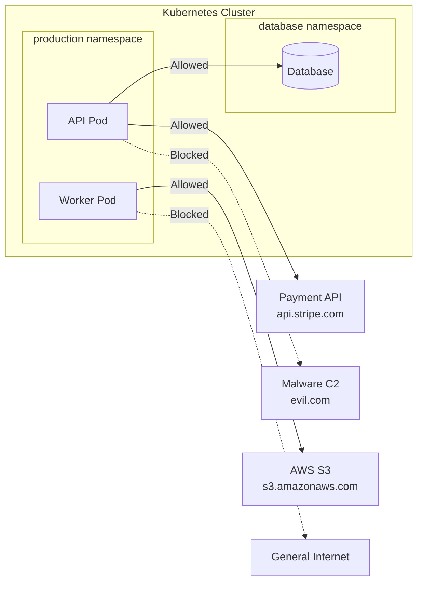
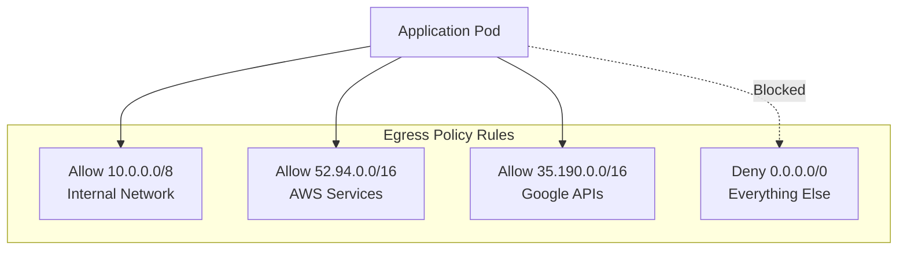
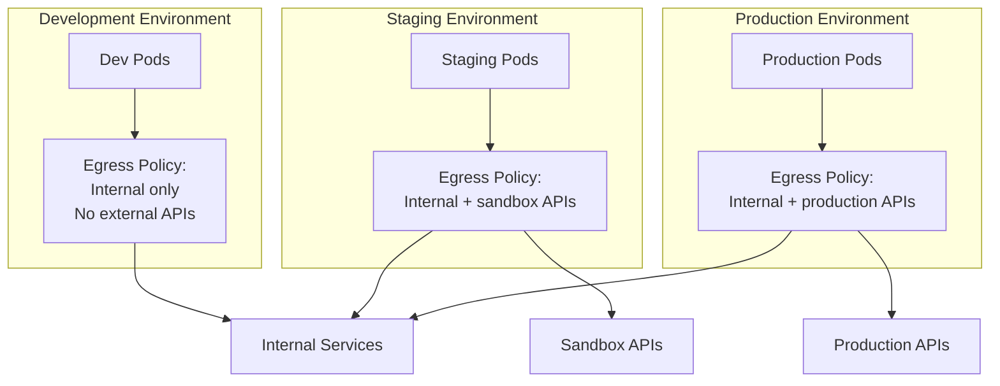
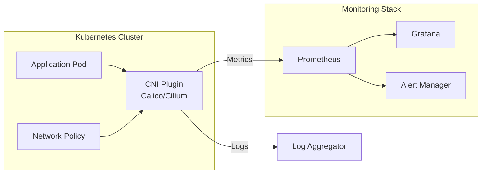

# How to Implement Kubernetes Egress Network Policies

Author: [nawazdhandala](https://www.github.com/nawazdhandala)

Tags: Kubernetes, Network Policies, Egress, Security, Networking, DevOps, Cloud Native

Description: A practical guide to implementing Kubernetes egress network policies for controlling outbound traffic from pods, including CIDR-based rules, DNS-based filtering, namespace isolation, and monitoring strategies.

---

> Controlling outbound traffic from your Kubernetes pods is just as important as controlling inbound traffic. Egress network policies give you the power to restrict which external services your workloads can communicate with, reducing your attack surface and meeting compliance requirements.

## Why Egress Policies Matter

When a pod gets compromised, attackers often try to establish outbound connections to command-and-control servers, exfiltrate data, or download additional malware. Without egress restrictions, any pod can reach any destination on the internet. A well-designed egress policy strategy prevents lateral movement and limits the blast radius of security incidents.



## Network Policy Basics

Kubernetes NetworkPolicy resources use label selectors to target pods and define ingress and egress rules. By default, pods accept traffic from any source and can send traffic to any destination. Once you apply a NetworkPolicy selecting a pod, that pod becomes isolated according to the policy rules.

The following example shows a basic egress policy structure.

```yaml
# basic-egress-policy.yaml
# Demonstrates the fundamental structure of an egress network policy
apiVersion: networking.k8s.io/v1
kind: NetworkPolicy
metadata:
  name: api-egress-policy
  namespace: production
spec:
  # Select pods by label - only pods matching these labels are affected
  podSelector:
    matchLabels:
      app: api-server
  # Specify that we're defining egress rules
  policyTypes:
    - Egress
  # Define allowed outbound destinations
  egress:
    # Rule 1: Allow DNS resolution (critical for most applications)
    - to:
        - namespaceSelector:
            matchLabels:
              kubernetes.io/metadata.name: kube-system
          podSelector:
            matchLabels:
              k8s-app: kube-dns
      ports:
        - protocol: UDP
          port: 53
        - protocol: TCP
          port: 53
    # Rule 2: Allow HTTPS to specific external CIDR
    - to:
        - ipBlock:
            cidr: 35.190.247.0/24
      ports:
        - protocol: TCP
          port: 443
```

Apply the policy and verify it's active.

```bash
# Apply the network policy
kubectl apply -f basic-egress-policy.yaml

# Verify the policy was created
kubectl get networkpolicy -n production

# Describe the policy to see details
kubectl describe networkpolicy api-egress-policy -n production
```

## Allowing DNS Resolution

Almost every application needs DNS to function. When implementing egress policies, always include rules for DNS resolution. Forgetting DNS is the most common mistake that causes applications to break after applying network policies.

```yaml
# dns-egress-policy.yaml
# Allows DNS resolution to CoreDNS in kube-system namespace
apiVersion: networking.k8s.io/v1
kind: NetworkPolicy
metadata:
  name: allow-dns-egress
  namespace: production
spec:
  podSelector: {}  # Applies to all pods in the namespace
  policyTypes:
    - Egress
  egress:
    # Allow DNS queries to kube-dns/CoreDNS
    - to:
        - namespaceSelector:
            matchLabels:
              kubernetes.io/metadata.name: kube-system
          podSelector:
            matchLabels:
              k8s-app: kube-dns
      ports:
        - protocol: UDP
          port: 53
        - protocol: TCP
          port: 53
```

Some clusters use different DNS configurations. Check your cluster's DNS setup before applying policies.

```bash
# Find your cluster's DNS service
kubectl get svc -n kube-system | grep dns

# Check DNS pod labels
kubectl get pods -n kube-system -l k8s-app=kube-dns --show-labels

# If using CoreDNS with different labels
kubectl get pods -n kube-system -l app.kubernetes.io/name=coredns --show-labels
```

## CIDR-Based Egress Rules

CIDR blocks let you allow traffic to specific IP ranges. Use cases include allowing access to external APIs, cloud provider services, or specific network segments.



The following policy demonstrates multiple CIDR-based rules for different services.

```yaml
# cidr-egress-policy.yaml
# Controls egress to specific IP ranges for different purposes
apiVersion: networking.k8s.io/v1
kind: NetworkPolicy
metadata:
  name: payment-service-egress
  namespace: production
spec:
  podSelector:
    matchLabels:
      app: payment-processor
      tier: backend
  policyTypes:
    - Egress
  egress:
    # DNS resolution is always required
    - to:
        - namespaceSelector:
            matchLabels:
              kubernetes.io/metadata.name: kube-system
          podSelector:
            matchLabels:
              k8s-app: kube-dns
      ports:
        - protocol: UDP
          port: 53

    # Allow Stripe API endpoints (example IP ranges)
    - to:
        - ipBlock:
            cidr: 35.190.247.0/24
        - ipBlock:
            cidr: 35.201.97.0/24
      ports:
        - protocol: TCP
          port: 443

    # Allow internal payment gateway on private network
    - to:
        - ipBlock:
            cidr: 10.100.0.0/16
            # Exclude specific subnet reserved for other purposes
            except:
              - 10.100.255.0/24
      ports:
        - protocol: TCP
          port: 8443

    # Allow AWS services in us-east-1 region
    - to:
        - ipBlock:
            cidr: 52.94.0.0/16
        - ipBlock:
            cidr: 54.239.0.0/16
      ports:
        - protocol: TCP
          port: 443
```

## Namespace-Based Egress Control

Controlling traffic between namespaces provides isolation between different teams, environments, or security zones. Namespace selectors let you define which namespaces your pods can communicate with.

```yaml
# namespace-egress-policy.yaml
# Restricts pods to communicate only with specific namespaces
apiVersion: networking.k8s.io/v1
kind: NetworkPolicy
metadata:
  name: frontend-egress
  namespace: frontend
spec:
  podSelector:
    matchLabels:
      app: web-frontend
  policyTypes:
    - Egress
  egress:
    # Allow DNS
    - to:
        - namespaceSelector:
            matchLabels:
              kubernetes.io/metadata.name: kube-system
          podSelector:
            matchLabels:
              k8s-app: kube-dns
      ports:
        - protocol: UDP
          port: 53

    # Allow traffic to backend API namespace
    - to:
        - namespaceSelector:
            matchLabels:
              tier: backend
              env: production
          podSelector:
            matchLabels:
              app: api-gateway
      ports:
        - protocol: TCP
          port: 8080

    # Allow traffic to caching layer namespace
    - to:
        - namespaceSelector:
            matchLabels:
              tier: cache
          podSelector:
            matchLabels:
              app: redis
      ports:
        - protocol: TCP
          port: 6379

    # Deny all other egress by not specifying additional rules
```

Set up the required namespace labels for the policy to work correctly.

```bash
# Label namespaces for policy targeting
kubectl label namespace backend tier=backend env=production
kubectl label namespace cache tier=cache
kubectl label namespace frontend tier=frontend env=production

# Verify labels
kubectl get namespaces --show-labels | grep -E "tier|env"
```

## Default Deny Egress Policy

A default deny policy blocks all egress traffic unless explicitly allowed by another policy. Implementing default deny is a security best practice that enforces the principle of least privilege.

```yaml
# default-deny-egress.yaml
# Blocks all egress traffic for pods in the namespace
# Apply explicit allow policies after this
apiVersion: networking.k8s.io/v1
kind: NetworkPolicy
metadata:
  name: default-deny-all-egress
  namespace: production
spec:
  # Empty selector matches all pods in namespace
  podSelector: {}
  policyTypes:
    - Egress
  # Empty egress list means deny all outbound traffic
  egress: []
```

After applying default deny, add specific allow policies for legitimate traffic.

```yaml
# allow-essential-egress.yaml
# Re-enables essential egress after default deny
apiVersion: networking.k8s.io/v1
kind: NetworkPolicy
metadata:
  name: allow-essential-egress
  namespace: production
spec:
  podSelector: {}
  policyTypes:
    - Egress
  egress:
    # DNS is essential for everything
    - to:
        - namespaceSelector:
            matchLabels:
              kubernetes.io/metadata.name: kube-system
          podSelector:
            matchLabels:
              k8s-app: kube-dns
      ports:
        - protocol: UDP
          port: 53
        - protocol: TCP
          port: 53

    # Allow cluster-internal traffic
    - to:
        - ipBlock:
            cidr: 10.0.0.0/8
        - ipBlock:
            cidr: 172.16.0.0/12
        - ipBlock:
            cidr: 192.168.0.0/16
```

## Environment Isolation Patterns

Different environments require different levels of access. Production workloads might need access to external payment APIs while development environments should be more restricted.



The following policies demonstrate environment-specific egress rules.

```yaml
# dev-egress-policy.yaml
# Restrictive policy for development environment
apiVersion: networking.k8s.io/v1
kind: NetworkPolicy
metadata:
  name: dev-egress-policy
  namespace: development
spec:
  podSelector: {}
  policyTypes:
    - Egress
  egress:
    # DNS only
    - to:
        - namespaceSelector:
            matchLabels:
              kubernetes.io/metadata.name: kube-system
          podSelector:
            matchLabels:
              k8s-app: kube-dns
      ports:
        - protocol: UDP
          port: 53

    # Cluster-internal only, no external access
    - to:
        - ipBlock:
            cidr: 10.0.0.0/8
        - ipBlock:
            cidr: 172.16.0.0/12

---
# staging-egress-policy.yaml
# Staging environment with sandbox API access
apiVersion: networking.k8s.io/v1
kind: NetworkPolicy
metadata:
  name: staging-egress-policy
  namespace: staging
spec:
  podSelector: {}
  policyTypes:
    - Egress
  egress:
    # DNS
    - to:
        - namespaceSelector:
            matchLabels:
              kubernetes.io/metadata.name: kube-system
          podSelector:
            matchLabels:
              k8s-app: kube-dns
      ports:
        - protocol: UDP
          port: 53

    # Cluster-internal
    - to:
        - ipBlock:
            cidr: 10.0.0.0/8

    # Sandbox payment API (example)
    - to:
        - ipBlock:
            cidr: 35.190.247.0/24
      ports:
        - protocol: TCP
          port: 443

---
# prod-egress-policy.yaml
# Production environment with production API access
apiVersion: networking.k8s.io/v1
kind: NetworkPolicy
metadata:
  name: prod-egress-policy
  namespace: production
spec:
  podSelector: {}
  policyTypes:
    - Egress
  egress:
    # DNS
    - to:
        - namespaceSelector:
            matchLabels:
              kubernetes.io/metadata.name: kube-system
          podSelector:
            matchLabels:
              k8s-app: kube-dns
      ports:
        - protocol: UDP
          port: 53

    # Cluster-internal
    - to:
        - ipBlock:
            cidr: 10.0.0.0/8

    # Production payment APIs
    - to:
        - ipBlock:
            cidr: 35.190.247.0/24
        - ipBlock:
            cidr: 35.201.97.0/24
      ports:
        - protocol: TCP
          port: 443

    # Production monitoring endpoints
    - to:
        - ipBlock:
            cidr: 52.94.0.0/16
      ports:
        - protocol: TCP
          port: 443
```

## Pod-Specific Egress Policies

Fine-grained control over individual workloads ensures each component has only the access it needs.

```yaml
# microservice-egress-policies.yaml
# Individual policies for different microservices
apiVersion: networking.k8s.io/v1
kind: NetworkPolicy
metadata:
  name: order-service-egress
  namespace: production
spec:
  podSelector:
    matchLabels:
      app: order-service
  policyTypes:
    - Egress
  egress:
    # DNS
    - to:
        - namespaceSelector:
            matchLabels:
              kubernetes.io/metadata.name: kube-system
          podSelector:
            matchLabels:
              k8s-app: kube-dns
      ports:
        - protocol: UDP
          port: 53

    # Access to inventory service
    - to:
        - podSelector:
            matchLabels:
              app: inventory-service
      ports:
        - protocol: TCP
          port: 8080

    # Access to payment service
    - to:
        - podSelector:
            matchLabels:
              app: payment-service
      ports:
        - protocol: TCP
          port: 8080

    # Access to database
    - to:
        - namespaceSelector:
            matchLabels:
              tier: database
          podSelector:
            matchLabels:
              app: postgresql
      ports:
        - protocol: TCP
          port: 5432

---
apiVersion: networking.k8s.io/v1
kind: NetworkPolicy
metadata:
  name: notification-service-egress
  namespace: production
spec:
  podSelector:
    matchLabels:
      app: notification-service
  policyTypes:
    - Egress
  egress:
    # DNS
    - to:
        - namespaceSelector:
            matchLabels:
              kubernetes.io/metadata.name: kube-system
          podSelector:
            matchLabels:
              k8s-app: kube-dns
      ports:
        - protocol: UDP
          port: 53

    # Email service provider (SendGrid example)
    - to:
        - ipBlock:
            cidr: 167.89.0.0/17
      ports:
        - protocol: TCP
          port: 443

    # SMS provider (Twilio example)
    - to:
        - ipBlock:
            cidr: 54.172.0.0/16
      ports:
        - protocol: TCP
          port: 443

    # Push notification service (Firebase)
    - to:
        - ipBlock:
            cidr: 142.250.0.0/16
      ports:
        - protocol: TCP
          port: 443
```

## Testing Egress Policies

Before rolling out policies to production, verify they work as expected. Create a test pod to check connectivity.

```yaml
# test-pod.yaml
# Temporary pod for testing network connectivity
apiVersion: v1
kind: Pod
metadata:
  name: network-test
  namespace: production
  labels:
    app: network-test
spec:
  containers:
    - name: netshoot
      image: nicolaka/netshoot:latest
      command:
        - sleep
        - "3600"
      securityContext:
        runAsNonRoot: true
        runAsUser: 1000
```

Run connectivity tests from the test pod.

```bash
# Deploy test pod
kubectl apply -f test-pod.yaml

# Wait for pod to be ready
kubectl wait --for=condition=Ready pod/network-test -n production

# Test DNS resolution
kubectl exec -n production network-test -- nslookup google.com

# Test allowed external endpoint
kubectl exec -n production network-test -- curl -v --connect-timeout 5 https://api.stripe.com

# Test blocked endpoint (should timeout or fail)
kubectl exec -n production network-test -- curl -v --connect-timeout 5 https://example.com

# Test internal service connectivity
kubectl exec -n production network-test -- curl -v --connect-timeout 5 http://api-gateway.backend:8080/health

# Clean up test pod
kubectl delete pod network-test -n production
```

## Monitoring and Logging

Visibility into network policy decisions helps with troubleshooting and security auditing. Most CNI plugins provide metrics and logging for policy enforcement.



For Calico, enable flow logs to see policy decisions.

```yaml
# calico-felixconfiguration.yaml
# Enable Calico flow logging for policy visibility
apiVersion: projectcalico.org/v3
kind: FelixConfiguration
metadata:
  name: default
spec:
  flowLogsFileEnabled: true
  flowLogsFileIncludeLabels: true
  flowLogsFileIncludePolicies: true
  flowLogsFlushIntervalSeconds: 10
  flowLogsEnableHostEndpoint: true
```

For Cilium with Hubble, observe egress traffic patterns.

```bash
# Enable Hubble if not already enabled
cilium hubble enable

# Watch all egress traffic
hubble observe --type trace:to-network

# Filter by namespace
hubble observe --namespace production --type trace:to-network

# Watch policy verdicts
hubble observe --verdict DROPPED --type policy-verdict

# Export to JSON for analysis
hubble observe --type trace:to-network -o json > egress-flows.json
```

## Prometheus Metrics for Policy Monitoring

```yaml
# prometheus-rules.yaml
# Alerting rules for network policy violations
apiVersion: monitoring.coreos.com/v1
kind: PrometheusRule
metadata:
  name: network-policy-alerts
  namespace: monitoring
spec:
  groups:
    - name: network-policies
      rules:
        # Alert on high rate of policy denials
        - alert: HighNetworkPolicyDenials
          expr: |
            sum(rate(cilium_policy_verdict_total{
              verdict="denied"
            }[5m])) by (namespace) > 10
          for: 2m
          labels:
            severity: warning
          annotations:
            summary: High rate of network policy denials in {{ $labels.namespace }}
            description: More than 10 connections per second being denied

        # Alert when egress is completely blocked
        - alert: EgressCompletelyBlocked
          expr: |
            sum(rate(cilium_forward_count_total{
              direction="EGRESS"
            }[5m])) by (namespace) == 0
            and
            sum(rate(cilium_policy_verdict_total{
              verdict="denied",
              direction="egress"
            }[5m])) by (namespace) > 0
          for: 5m
          labels:
            severity: critical
          annotations:
            summary: All egress traffic blocked in {{ $labels.namespace }}
```

## Troubleshooting Common Issues

When egress policies don't work as expected, follow these debugging steps.

```bash
# Check if network policies are supported by your CNI
kubectl get pods -n kube-system | grep -E "calico|cilium|weave"

# List all network policies in a namespace
kubectl get networkpolicy -n production

# Describe a specific policy
kubectl describe networkpolicy api-egress-policy -n production

# Check pod labels match policy selector
kubectl get pods -n production --show-labels | grep api-server

# Verify namespace labels
kubectl get namespace production --show-labels

# Check CNI-specific policy status (Calico)
calicoctl get networkpolicy -n production -o yaml

# Check CNI-specific policy status (Cilium)
kubectl get ciliumnetworkpolicies -n production
```

Common issues and solutions include the following scenarios.

DNS resolution failing after applying policies typically means your DNS egress rule doesn't match the actual DNS service labels. Check your cluster's DNS configuration.

```bash
# Find the correct DNS pod labels
kubectl get pods -n kube-system -l k8s-app=kube-dns -o yaml | grep -A5 labels
```

Pods can't reach allowed destinations when the destination CIDR might have changed. External APIs often use multiple IP ranges or CDNs.

```bash
# Resolve the actual IP addresses
dig +short api.stripe.com

# Check if traffic is being blocked
kubectl exec -n production test-pod -- traceroute api.stripe.com
```

Policies not taking effect could indicate your CNI doesn't support Kubernetes NetworkPolicy. Verify your CNI plugin supports network policies.

## Best Practices Summary

Start with default deny and add explicit allow rules. New applications often break when default deny is applied retroactively, so begin with restrictive policies.

Always allow DNS in your egress rules. Applications need DNS to resolve hostnames, and blocked DNS manifests as connection timeouts.

Use namespaces strategically for isolation boundaries. Group related services in namespaces and control inter-namespace traffic with policies.

Document your policies with clear names and comments in the YAML files. Future operators need to understand why each rule exists.

Test policies in non-production environments first. Verify connectivity before rolling out to production workloads.

Monitor policy enforcement continuously. Set up alerts for denied connections to catch misconfigurations early.

Review and update policies regularly. External API IP ranges change, and your policies need to reflect current infrastructure.

Keep policies as simple as possible. Complex policies are hard to maintain and troubleshoot.

Use labels consistently across all resources. Inconsistent labeling makes policies brittle and hard to manage.

Version control all network policies. Store policies in Git alongside application manifests for auditability.

---

Implementing egress network policies is a fundamental security practice for any Kubernetes deployment. By controlling outbound traffic, you limit the damage from compromised workloads and maintain compliance with security requirements. Start with a few critical namespaces, learn from the process, and gradually expand coverage across your cluster.

For comprehensive monitoring of your Kubernetes clusters and network policies, check out [OneUptime](https://oneuptime.com) for real-time visibility into your infrastructure health and security posture.
