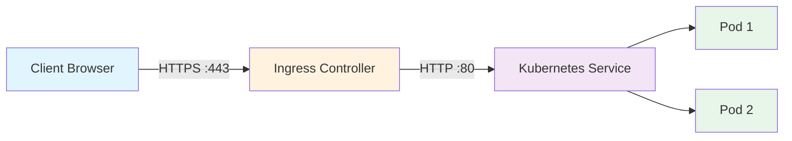
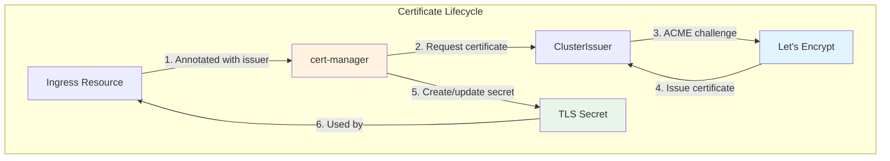
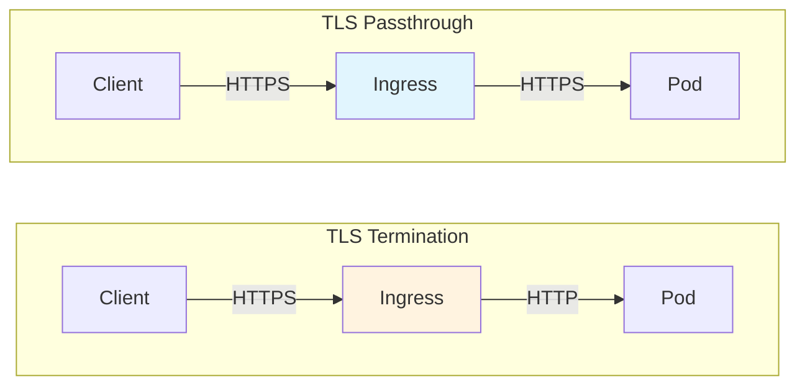

# How to Configure Kubernetes Ingress TLS Termination

Author: [nawazdhandala](https://github.com/nawazdhandala)

Tags: Kubernetes, Ingress, TLS, SSL, HTTPS, Security, DevOps, Certificates

Description: A practical guide to configuring TLS termination in Kubernetes Ingress controllers, covering certificate management, Let's Encrypt automation, and production best practices.

---

Securing traffic to your Kubernetes applications requires TLS termination at some point in the request path. Ingress controllers provide a natural place for handling HTTPS connections, offloading encryption overhead from your backend pods while presenting valid certificates to clients.

## How TLS Termination Works in Kubernetes

When a client connects to your application over HTTPS, the TLS handshake needs to happen somewhere. With Ingress TLS termination, the Ingress controller handles the encrypted connection from clients and forwards plain HTTP to your backend services.



The Ingress controller acts as a reverse proxy, terminating TLS connections and handling certificate presentation. Your application pods only need to serve HTTP traffic internally.

## Prerequisites

Before configuring TLS termination, ensure you have:

- A running Kubernetes cluster (1.19+)
- An Ingress controller installed (nginx-ingress, traefik, or similar)
- kubectl configured to access your cluster
- A domain name pointing to your Ingress controller's external IP

## Creating a TLS Secret Manually

Kubernetes stores TLS certificates as Secrets of type `kubernetes.io/tls`. You need two files: your certificate (including any intermediate CA certificates) and your private key.

Create a TLS secret from existing certificate files:

```bash
# Create a TLS secret from certificate and key files
# The certificate file should include the full chain (your cert + intermediates)
kubectl create secret tls my-app-tls \
  --cert=fullchain.pem \
  --key=privkey.pem \
  --namespace=my-namespace
```

Alternatively, define the secret as a YAML manifest for version control:

```yaml
# tls-secret.yaml
# Stores TLS certificate and private key for Ingress HTTPS termination
# Both values must be base64 encoded
apiVersion: v1
kind: Secret
metadata:
  name: my-app-tls
  namespace: my-namespace
type: kubernetes.io/tls
data:
  # Base64 encoded certificate chain (cert + intermediates)
  tls.crt: LS0tLS1CRUdJTi...
  # Base64 encoded private key
  tls.key: LS0tLS1CRUdJTi...
```

Generate base64-encoded values from your certificate files:

```bash
# Encode certificate and key for use in YAML manifests
# Use -w0 to prevent line wrapping in the output
cat fullchain.pem | base64 -w0
cat privkey.pem | base64 -w0
```

## Configuring Ingress with TLS

Once your TLS secret exists, reference it in your Ingress resource. The following example shows a complete Ingress configuration with TLS termination.

```yaml
# ingress-tls.yaml
# Ingress resource with TLS termination enabled
# Routes HTTPS traffic to the backend service
apiVersion: networking.k8s.io/v1
kind: Ingress
metadata:
  name: my-app-ingress
  namespace: my-namespace
  annotations:
    # Force HTTPS redirect for all HTTP requests
    nginx.ingress.kubernetes.io/ssl-redirect: "true"
    # Use strong TLS protocols only
    nginx.ingress.kubernetes.io/ssl-protocols: "TLSv1.2 TLSv1.3"
spec:
  ingressClassName: nginx
  # TLS configuration - map hostnames to certificate secrets
  tls:
    - hosts:
        - app.example.com
        - www.app.example.com
      secretName: my-app-tls
  rules:
    - host: app.example.com
      http:
        paths:
          - path: /
            pathType: Prefix
            backend:
              service:
                name: my-app-service
                port:
                  number: 80
    - host: www.app.example.com
      http:
        paths:
          - path: /
            pathType: Prefix
            backend:
              service:
                name: my-app-service
                port:
                  number: 80
```

Apply the Ingress configuration:

```bash
# Deploy the Ingress resource to your cluster
kubectl apply -f ingress-tls.yaml

# Verify the Ingress was created with TLS configured
kubectl get ingress my-app-ingress -n my-namespace -o yaml
```

## Automating Certificates with cert-manager

Managing certificates manually becomes tedious quickly. cert-manager automates certificate issuance and renewal by integrating with certificate authorities like Let's Encrypt.



### Installing cert-manager

Deploy cert-manager using the official Helm chart:

```bash
# Add the Jetstack Helm repository
helm repo add jetstack https://charts.jetstack.io
helm repo update

# Install cert-manager with CRDs included
# The CRDs define Certificate, Issuer, and ClusterIssuer resources
helm install cert-manager jetstack/cert-manager \
  --namespace cert-manager \
  --create-namespace \
  --set installCRDs=true \
  --set global.leaderElection.namespace=cert-manager

# Verify cert-manager pods are running
kubectl get pods -n cert-manager
```

### Creating a ClusterIssuer for Let's Encrypt

A ClusterIssuer works across all namespaces, making it ideal for clusters with multiple applications.

```yaml
# cluster-issuer.yaml
# ClusterIssuer for Let's Encrypt production certificates
# Uses HTTP-01 challenge solved by the nginx Ingress controller
apiVersion: cert-manager.io/v1
kind: ClusterIssuer
metadata:
  name: letsencrypt-prod
spec:
  acme:
    # Let's Encrypt production endpoint
    server: https://acme-v02.api.letsencrypt.org/directory
    # Email for certificate expiry notifications
    email: admin@example.com
    # Secret to store ACME account private key
    privateKeySecretRef:
      name: letsencrypt-prod-account-key
    solvers:
      # HTTP-01 challenge - cert-manager creates temporary Ingress rules
      - http01:
          ingress:
            class: nginx
```

For testing, use the staging endpoint to avoid rate limits:

```yaml
# cluster-issuer-staging.yaml
# ClusterIssuer for Let's Encrypt staging (testing) environment
# Staging certificates are not trusted by browsers but have higher rate limits
apiVersion: cert-manager.io/v1
kind: ClusterIssuer
metadata:
  name: letsencrypt-staging
spec:
  acme:
    # Staging endpoint for testing certificate issuance
    server: https://acme-staging-v02.api.letsencrypt.org/directory
    email: admin@example.com
    privateKeySecretRef:
      name: letsencrypt-staging-account-key
    solvers:
      - http01:
          ingress:
            class: nginx
```

Apply both issuers:

```bash
# Create the ClusterIssuers
kubectl apply -f cluster-issuer-staging.yaml
kubectl apply -f cluster-issuer.yaml

# Check issuer status - should show Ready: True
kubectl get clusterissuer
```

### Ingress with Automatic Certificate Provisioning

With cert-manager installed, annotate your Ingress to automatically request certificates.

```yaml
# ingress-certmanager.yaml
# Ingress with automatic TLS certificate from Let's Encrypt
# cert-manager watches for this annotation and creates certificates
apiVersion: networking.k8s.io/v1
kind: Ingress
metadata:
  name: my-app-ingress
  namespace: my-namespace
  annotations:
    # Tell cert-manager which issuer to use
    cert-manager.io/cluster-issuer: "letsencrypt-prod"
    # Redirect HTTP to HTTPS
    nginx.ingress.kubernetes.io/ssl-redirect: "true"
spec:
  ingressClassName: nginx
  tls:
    - hosts:
        - app.example.com
      # cert-manager creates this secret automatically
      secretName: my-app-tls-auto
  rules:
    - host: app.example.com
      http:
        paths:
          - path: /
            pathType: Prefix
            backend:
              service:
                name: my-app-service
                port:
                  number: 80
```

Monitor certificate issuance:

```bash
# Watch certificate creation progress
kubectl get certificate -n my-namespace -w

# Check certificate details and status
kubectl describe certificate my-app-tls-auto -n my-namespace

# View certificate request events if something goes wrong
kubectl get certificaterequest -n my-namespace
kubectl describe certificaterequest <request-name> -n my-namespace
```

## Wildcard Certificates with DNS-01 Challenge

HTTP-01 challenges work for single domains, but wildcard certificates require DNS-01 validation. You will need to configure your DNS provider credentials.

```yaml
# dns01-issuer.yaml
# ClusterIssuer using DNS-01 challenge for wildcard certificates
# Requires API credentials for your DNS provider
apiVersion: cert-manager.io/v1
kind: ClusterIssuer
metadata:
  name: letsencrypt-dns
spec:
  acme:
    server: https://acme-v02.api.letsencrypt.org/directory
    email: admin@example.com
    privateKeySecretRef:
      name: letsencrypt-dns-account-key
    solvers:
      - dns01:
          # Example: Cloudflare DNS provider
          cloudflare:
            email: cloudflare@example.com
            apiTokenSecretRef:
              name: cloudflare-api-token
              key: api-token
        # Only use this solver for example.com and its subdomains
        selector:
          dnsZones:
            - "example.com"
```

Create the Cloudflare API token secret:

```yaml
# cloudflare-secret.yaml
# Stores Cloudflare API token for DNS-01 challenge
# Token needs Zone:DNS:Edit permissions
apiVersion: v1
kind: Secret
metadata:
  name: cloudflare-api-token
  namespace: cert-manager
type: Opaque
stringData:
  api-token: "your-cloudflare-api-token-here"
```

Use the wildcard certificate in your Ingress:

```yaml
# ingress-wildcard.yaml
# Ingress using a wildcard certificate for all subdomains
apiVersion: networking.k8s.io/v1
kind: Ingress
metadata:
  name: wildcard-ingress
  namespace: my-namespace
  annotations:
    cert-manager.io/cluster-issuer: "letsencrypt-dns"
    nginx.ingress.kubernetes.io/ssl-redirect: "true"
spec:
  ingressClassName: nginx
  tls:
    - hosts:
        # Wildcard covers all subdomains
        - "*.example.com"
      secretName: wildcard-example-tls
  rules:
    - host: api.example.com
      http:
        paths:
          - path: /
            pathType: Prefix
            backend:
              service:
                name: api-service
                port:
                  number: 80
    - host: app.example.com
      http:
        paths:
          - path: /
            pathType: Prefix
            backend:
              service:
                name: app-service
                port:
                  number: 80
```

## TLS Termination vs TLS Passthrough

Sometimes you need end-to-end encryption where the Ingress controller does not decrypt traffic. TLS passthrough sends encrypted traffic directly to your pods.



Configure TLS passthrough for nginx-ingress:

```yaml
# ingress-passthrough.yaml
# Ingress with TLS passthrough - traffic stays encrypted to the pod
# Useful for applications that handle their own TLS (mTLS, specific ciphers)
apiVersion: networking.k8s.io/v1
kind: Ingress
metadata:
  name: passthrough-ingress
  namespace: my-namespace
  annotations:
    # Enable SSL passthrough - requires controller flag --enable-ssl-passthrough
    nginx.ingress.kubernetes.io/ssl-passthrough: "true"
    # Backend protocol must be HTTPS since we're passing through
    nginx.ingress.kubernetes.io/backend-protocol: "HTTPS"
spec:
  ingressClassName: nginx
  rules:
    - host: secure.example.com
      http:
        paths:
          - path: /
            pathType: Prefix
            backend:
              service:
                name: secure-service
                port:
                  number: 443
```

Enable passthrough in the nginx-ingress controller deployment:

```bash
# If using Helm, upgrade with passthrough enabled
helm upgrade nginx-ingress ingress-nginx/ingress-nginx \
  --namespace ingress-nginx \
  --set controller.extraArgs.enable-ssl-passthrough=true
```

## Hardening TLS Configuration

Default TLS settings may allow outdated protocols. Configure strong TLS settings through Ingress annotations or ConfigMaps.

```yaml
# nginx-configmap.yaml
# Global TLS configuration for nginx-ingress controller
# Applied to all Ingress resources using this controller
apiVersion: v1
kind: ConfigMap
metadata:
  name: nginx-ingress-controller
  namespace: ingress-nginx
data:
  # Only allow TLS 1.2 and 1.3
  ssl-protocols: "TLSv1.2 TLSv1.3"
  # Strong cipher suites in preference order
  ssl-ciphers: "ECDHE-ECDSA-AES128-GCM-SHA256:ECDHE-RSA-AES128-GCM-SHA256:ECDHE-ECDSA-AES256-GCM-SHA384:ECDHE-RSA-AES256-GCM-SHA384"
  # Prefer server ciphers over client preferences
  ssl-prefer-server-ciphers: "true"
  # Enable HSTS with 1 year max-age
  hsts: "true"
  hsts-max-age: "31536000"
  hsts-include-subdomains: "true"
  hsts-preload: "true"
```

Per-Ingress TLS hardening:

```yaml
# ingress-hardened.yaml
# Ingress with hardened TLS settings via annotations
apiVersion: networking.k8s.io/v1
kind: Ingress
metadata:
  name: hardened-ingress
  namespace: my-namespace
  annotations:
    cert-manager.io/cluster-issuer: "letsencrypt-prod"
    nginx.ingress.kubernetes.io/ssl-redirect: "true"
    # TLS hardening annotations
    nginx.ingress.kubernetes.io/ssl-protocols: "TLSv1.2 TLSv1.3"
    nginx.ingress.kubernetes.io/ssl-ciphers: "ECDHE-ECDSA-AES128-GCM-SHA256:ECDHE-RSA-AES128-GCM-SHA256"
    # HSTS header
    nginx.ingress.kubernetes.io/configuration-snippet: |
      add_header Strict-Transport-Security "max-age=31536000; includeSubDomains" always;
spec:
  ingressClassName: nginx
  tls:
    - hosts:
        - secure.example.com
      secretName: secure-example-tls
  rules:
    - host: secure.example.com
      http:
        paths:
          - path: /
            pathType: Prefix
            backend:
              service:
                name: secure-service
                port:
                  number: 80
```

## Troubleshooting TLS Issues

Common problems and their solutions:

**Certificate not found or secret missing:**

```bash
# Check if the secret exists in the correct namespace
kubectl get secret my-app-tls -n my-namespace

# Verify secret type and data keys
kubectl get secret my-app-tls -n my-namespace -o yaml

# Ensure the secret has both tls.crt and tls.key fields
```

**cert-manager not issuing certificates:**

```bash
# Check Certificate resource status
kubectl describe certificate my-app-tls -n my-namespace

# Look for CertificateRequest and Order resources
kubectl get certificaterequest -n my-namespace
kubectl get order -n my-namespace

# Check cert-manager logs for errors
kubectl logs -n cert-manager deploy/cert-manager -f

# For HTTP-01 challenges, verify the solver pod can be reached
kubectl get pods -n my-namespace | grep cm-acme
```

**SSL certificate error in browser:**

```bash
# Test certificate chain with openssl
openssl s_client -connect app.example.com:443 -servername app.example.com

# Verify certificate dates
echo | openssl s_client -connect app.example.com:443 2>/dev/null | \
  openssl x509 -noout -dates

# Check certificate chain completeness
echo | openssl s_client -connect app.example.com:443 2>/dev/null | \
  openssl x509 -noout -text | grep -A1 "Issuer"
```

**Ingress controller not picking up TLS secret:**

```bash
# Restart nginx-ingress pods to reload certificates
kubectl rollout restart deployment nginx-ingress-controller -n ingress-nginx

# Check nginx configuration includes your certificate
kubectl exec -n ingress-nginx deploy/nginx-ingress-controller -- \
  cat /etc/nginx/nginx.conf | grep ssl_certificate
```

## Monitoring Certificate Expiry

Prevent outages by monitoring certificate expiration. cert-manager exposes metrics that Prometheus can scrape.

```yaml
# servicemonitor.yaml
# Prometheus ServiceMonitor for cert-manager metrics
# Alerts on certificates expiring within 30 days
apiVersion: monitoring.coreos.com/v1
kind: ServiceMonitor
metadata:
  name: cert-manager
  namespace: cert-manager
spec:
  selector:
    matchLabels:
      app.kubernetes.io/name: cert-manager
  endpoints:
    - port: tcp-prometheus-servicemonitor
      interval: 60s
```

Create a PrometheusRule for expiry alerts:

```yaml
# alert-rules.yaml
# Prometheus alert rules for certificate expiration
apiVersion: monitoring.coreos.com/v1
kind: PrometheusRule
metadata:
  name: cert-manager-alerts
  namespace: cert-manager
spec:
  groups:
    - name: cert-manager
      rules:
        - alert: CertificateExpiringSoon
          expr: certmanager_certificate_expiration_timestamp_seconds - time() < 604800
          for: 1h
          labels:
            severity: warning
          annotations:
            summary: "Certificate {{ $labels.name }} expires in less than 7 days"
        - alert: CertificateExpiryCritical
          expr: certmanager_certificate_expiration_timestamp_seconds - time() < 86400
          for: 1h
          labels:
            severity: critical
          annotations:
            summary: "Certificate {{ $labels.name }} expires in less than 24 hours"
```

## Summary

Properly configured TLS termination protects your users and their data while simplifying certificate management across your cluster.

| Approach | Best For | Complexity |
|----------|----------|------------|
| Manual TLS Secret | Existing certificates, air-gapped environments | Low |
| cert-manager HTTP-01 | Single domains, simple setups | Medium |
| cert-manager DNS-01 | Wildcard certificates, private clusters | Medium-High |
| TLS Passthrough | mTLS requirements, compliance needs | High |

Starting with cert-manager and Let's Encrypt covers most production use cases. The automatic renewal eliminates certificate expiry as a source of outages, and the declarative configuration fits naturally into GitOps workflows.
