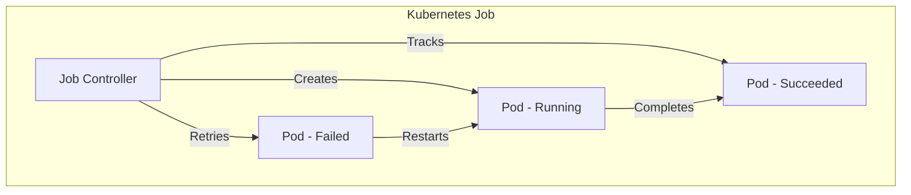
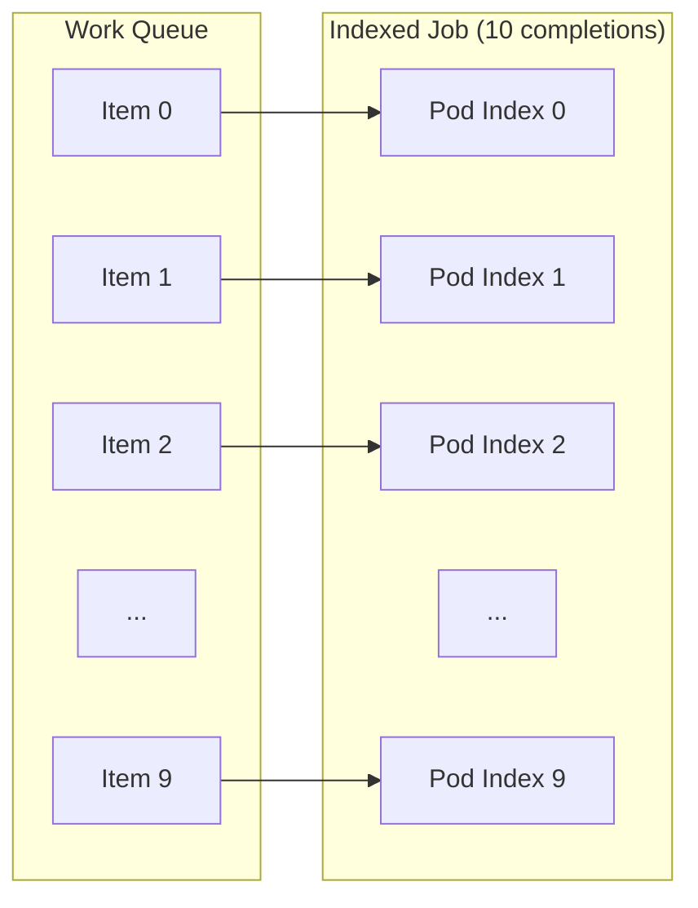
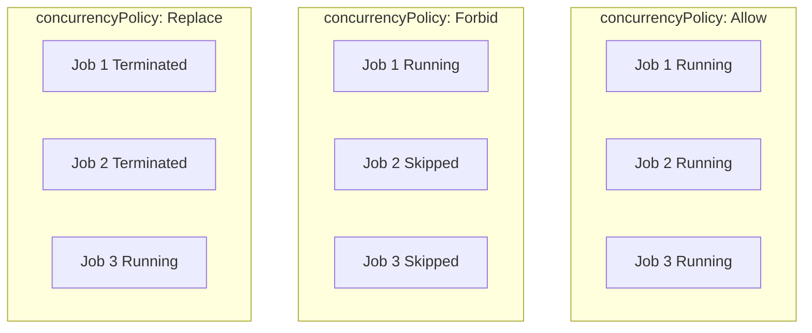

# How to Use Kubernetes Jobs and CronJobs

Author: [nawazdhandala](https://www.github.com/nawazdhandala)

Tags: Kubernetes, Jobs, CronJobs, Batch Processing, DevOps, Container Orchestration, Scheduling

Description: A practical guide to running batch workloads and scheduled tasks in Kubernetes using Jobs and CronJobs, covering configuration options, failure handling, parallelism, and production best practices.

---

Running one-off tasks and scheduled batch processes requires a different approach than managing long-running services. Kubernetes provides two powerful primitives for these workloads: Jobs for one-time executions and CronJobs for recurring scheduled tasks. Understanding how to configure these resources correctly can save hours of debugging and prevent costly failures in production.

## Understanding Kubernetes Jobs

A Job creates one or more Pods and ensures that a specified number of them successfully terminate. Unlike Deployments that maintain a desired number of running replicas, Jobs track successful completions and stop creating new Pods once the success criteria is met.



## Creating Your First Job

The following manifest creates a simple Job that runs a computation and exits. Notice how the restartPolicy must be set to either "Never" or "OnFailure" since Jobs are not meant to run indefinitely.

```yaml
# simple-job.yaml
# A basic Job that performs a one-time computation
apiVersion: batch/v1
kind: Job
metadata:
  # Descriptive name for the Job
  name: pi-calculation
  namespace: default
spec:
  # Number of times to retry the Job before considering it failed
  backoffLimit: 4

  # Maximum time the Job can run before being terminated
  activeDeadlineSeconds: 600

  template:
    metadata:
      labels:
        app: pi-calculator
    spec:
      # Jobs must use Never or OnFailure restart policy
      restartPolicy: Never
      containers:
        - name: pi
          image: perl:5.34
          # Calculate pi to 2000 decimal places
          command: ["perl", "-Mbignum=bpi", "-wle", "print bpi(2000)"]
          resources:
            requests:
              memory: "64Mi"
              cpu: "250m"
            limits:
              memory: "128Mi"
              cpu: "500m"
```

Apply the Job and monitor its progress.

```bash
# Create the Job
kubectl apply -f simple-job.yaml

# Watch the Job status
kubectl get jobs -w

# View the logs from the completed Pod
kubectl logs job/pi-calculation
```

## Job Completion Modes

Kubernetes supports different completion modes depending on your workload requirements.

### Single Completion Job

The default mode runs a single Pod and marks the Job as complete when that Pod succeeds.

```yaml
# single-completion-job.yaml
# Job that requires exactly one successful completion
apiVersion: batch/v1
kind: Job
metadata:
  name: database-migration
spec:
  # Completions defaults to 1
  completions: 1

  # Only one Pod can run at a time
  parallelism: 1

  template:
    spec:
      restartPolicy: Never
      containers:
        - name: migrate
          image: myapp/migrations:v1.2.0
          command: ["./migrate.sh"]
          env:
            - name: DATABASE_URL
              valueFrom:
                secretKeyRef:
                  name: database-credentials
                  key: url
```

### Fixed Completion Count

When you need to process a fixed number of work items, set the completions field accordingly. Each completion represents one successful Pod execution.

```yaml
# fixed-completions-job.yaml
# Job that must complete 5 times
apiVersion: batch/v1
kind: Job
metadata:
  name: batch-processor
spec:
  # Total number of successful completions required
  completions: 5

  # Run up to 2 Pods simultaneously
  parallelism: 2

  # Completion mode determines how completions are tracked
  completionMode: NonIndexed

  template:
    spec:
      restartPolicy: OnFailure
      containers:
        - name: processor
          image: batch-processor:latest
          command: ["./process-batch.sh"]
```

### Indexed Jobs

Indexed Jobs assign each Pod a unique index, useful when processing items from a queue or when each Pod needs to work on a specific subset of data.

```yaml
# indexed-job.yaml
# Each Pod receives a unique index via JOB_COMPLETION_INDEX
apiVersion: batch/v1
kind: Job
metadata:
  name: indexed-batch-processor
spec:
  completions: 10
  parallelism: 3

  # Indexed mode assigns each Pod a unique completion index
  completionMode: Indexed

  template:
    spec:
      restartPolicy: Never
      containers:
        - name: worker
          image: batch-worker:latest
          command:
            - /bin/bash
            - -c
            # The JOB_COMPLETION_INDEX environment variable contains the Pod's index
            - |
              echo "Processing item at index $JOB_COMPLETION_INDEX"
              ./process-item.sh --index $JOB_COMPLETION_INDEX
```



## Handling Job Failures

Properly configuring failure handling prevents runaway resource consumption and helps with debugging.

### Backoff Limit and Pod Failure Policy

The backoffLimit field controls how many times a Job retries before being marked as failed. Each retry uses exponential backoff starting at 10 seconds.

```yaml
# failure-handling-job.yaml
# Job with comprehensive failure handling configuration
apiVersion: batch/v1
kind: Job
metadata:
  name: resilient-job
spec:
  # Retry up to 6 times before failing
  backoffLimit: 6

  # Maximum runtime - prevents infinite hangs
  activeDeadlineSeconds: 3600

  # Time in seconds to keep a finished Job before cleanup
  ttlSecondsAfterFinished: 86400

  # Pod failure policy provides fine-grained control over retries
  podFailurePolicy:
    rules:
      # Do not retry on out-of-memory errors
      - action: FailJob
        onExitCodes:
          containerName: worker
          operator: In
          values: [137]  # OOMKilled exit code

      # Ignore transient infrastructure failures
      - action: Ignore
        onPodConditions:
          - type: DisruptionTarget

  template:
    spec:
      restartPolicy: Never
      containers:
        - name: worker
          image: worker:latest
          resources:
            requests:
              memory: "256Mi"
              cpu: "500m"
            limits:
              memory: "512Mi"
              cpu: "1000m"
```

### Suspend and Resume Jobs

You can suspend a running Job to pause execution without losing progress.

```bash
# Suspend a running Job
kubectl patch job/batch-processor --type=strategic --patch '{"spec":{"suspend":true}}'

# Resume the suspended Job
kubectl patch job/batch-processor --type=strategic --patch '{"spec":{"suspend":false}}'
```

## Working with CronJobs

CronJobs create Jobs on a schedule, similar to the Unix cron utility. They are perfect for recurring tasks like backups, report generation, and cleanup operations.

```mermaid
flowchart TD
    subgraph CronJob["CronJob Controller"]
        Schedule[Schedule: "0 2 * * *"]
        CJ[CronJob Object]
    end

    subgraph Jobs["Created Jobs"]
        J1[Job - Day 1]
        J2[Job - Day 2]
        J3[Job - Day 3]
    end

    CJ --> |"2:00 AM"| J1
    CJ --> |"2:00 AM"| J2
    CJ --> |"2:00 AM"| J3

    J1 --> P1[Pod]
    J2 --> P2[Pod]
    J3 --> P3[Pod]
```

### Creating a CronJob

The schedule field uses standard cron syntax with five time fields: minute, hour, day of month, month, and day of week.

```yaml
# backup-cronjob.yaml
# CronJob that runs daily database backups at 2 AM
apiVersion: batch/v1
kind: CronJob
metadata:
  name: database-backup
  namespace: production
spec:
  # Run at 2:00 AM every day
  schedule: "0 2 * * *"

  # Timezone for the schedule (Kubernetes 1.27+)
  timeZone: "America/New_York"

  # What to do if a scheduled time is missed
  startingDeadlineSeconds: 300

  # Concurrency policy controls overlapping Jobs
  concurrencyPolicy: Forbid

  # Number of successful Job history entries to retain
  successfulJobsHistoryLimit: 3

  # Number of failed Job history entries to retain
  failedJobsHistoryLimit: 3

  # Suspend the CronJob without deleting it
  suspend: false

  jobTemplate:
    spec:
      backoffLimit: 2
      activeDeadlineSeconds: 7200
      template:
        spec:
          restartPolicy: OnFailure
          containers:
            - name: backup
              image: backup-tool:latest
              command:
                - /bin/sh
                - -c
                - |
                  # Generate timestamp for backup file
                  TIMESTAMP=$(date +%Y%m%d-%H%M%S)

                  # Perform the backup
                  pg_dump $DATABASE_URL > /backups/db-${TIMESTAMP}.sql

                  # Compress the backup
                  gzip /backups/db-${TIMESTAMP}.sql

                  # Upload to cloud storage
                  aws s3 cp /backups/db-${TIMESTAMP}.sql.gz \
                    s3://my-backups/database/

                  # Clean up local file
                  rm /backups/db-${TIMESTAMP}.sql.gz

                  echo "Backup completed successfully"
              env:
                - name: DATABASE_URL
                  valueFrom:
                    secretKeyRef:
                      name: database-credentials
                      key: url
              volumeMounts:
                - name: backup-storage
                  mountPath: /backups
          volumes:
            - name: backup-storage
              emptyDir: {}
```

### Cron Schedule Syntax

Here is a quick reference for common cron expressions.

```yaml
# Common cron schedule examples
schedule: "*/5 * * * *"     # Every 5 minutes
schedule: "0 * * * *"       # Every hour
schedule: "0 0 * * *"       # Every day at midnight
schedule: "0 2 * * *"       # Every day at 2 AM
schedule: "0 0 * * 0"       # Every Sunday at midnight
schedule: "0 0 1 * *"       # First day of every month
schedule: "0 0 1 1 *"       # First day of January (yearly)
schedule: "0 9-17 * * 1-5"  # Hourly, 9 AM to 5 PM, Monday through Friday
```

### Concurrency Policies

The concurrencyPolicy field determines behavior when a new scheduled run occurs while a previous Job is still running.

```yaml
# concurrency-examples.yaml
# Allow concurrent runs - all Jobs will run
apiVersion: batch/v1
kind: CronJob
metadata:
  name: allow-concurrent
spec:
  schedule: "*/1 * * * *"
  concurrencyPolicy: Allow  # Default behavior
  jobTemplate:
    spec:
      template:
        spec:
          restartPolicy: Never
          containers:
            - name: worker
              image: slow-task:latest
---
# Forbid concurrent runs - skip if previous Job is running
apiVersion: batch/v1
kind: CronJob
metadata:
  name: forbid-concurrent
spec:
  schedule: "*/1 * * * *"
  concurrencyPolicy: Forbid  # Skip new runs if Job is active
  jobTemplate:
    spec:
      template:
        spec:
          restartPolicy: Never
          containers:
            - name: worker
              image: slow-task:latest
---
# Replace concurrent runs - terminate old Job and start new
apiVersion: batch/v1
kind: CronJob
metadata:
  name: replace-concurrent
spec:
  schedule: "*/1 * * * *"
  concurrencyPolicy: Replace  # Kill old Job, start new one
  jobTemplate:
    spec:
      template:
        spec:
          restartPolicy: Never
          containers:
            - name: worker
              image: slow-task:latest
```



## Practical Use Cases

### Data Processing Pipeline

Process files uploaded to a storage bucket using an indexed Job for parallel processing.

```yaml
# data-processing-job.yaml
# Parallel data processing Job with work queue pattern
apiVersion: batch/v1
kind: Job
metadata:
  name: process-uploaded-files
spec:
  completions: 100
  parallelism: 10
  completionMode: Indexed

  template:
    spec:
      restartPolicy: Never

      # Init container lists files and assigns work
      initContainers:
        - name: file-lister
          image: amazon/aws-cli:latest
          command:
            - /bin/sh
            - -c
            - |
              # List all files to process
              aws s3 ls s3://data-bucket/input/ | awk '{print $4}' > /work/files.txt

              # Calculate which files this Pod should process
              TOTAL_FILES=$(wc -l < /work/files.txt)
              FILES_PER_POD=$((TOTAL_FILES / 100 + 1))
              START=$((JOB_COMPLETION_INDEX * FILES_PER_POD + 1))

              # Extract this Pod's assigned files
              sed -n "${START},$((START + FILES_PER_POD - 1))p" /work/files.txt > /work/my-files.txt
          volumeMounts:
            - name: work-dir
              mountPath: /work

      containers:
        - name: processor
          image: data-processor:latest
          command:
            - /bin/sh
            - -c
            - |
              # Process each assigned file
              while read filename; do
                echo "Processing $filename"
                aws s3 cp "s3://data-bucket/input/$filename" /tmp/
                ./process.sh "/tmp/$filename"
                aws s3 cp "/tmp/${filename}.processed" "s3://data-bucket/output/"
                rm "/tmp/$filename" "/tmp/${filename}.processed"
              done < /work/my-files.txt
          volumeMounts:
            - name: work-dir
              mountPath: /work
          resources:
            requests:
              memory: "1Gi"
              cpu: "1"
            limits:
              memory: "2Gi"
              cpu: "2"

      volumes:
        - name: work-dir
          emptyDir: {}
```

### Log Rotation and Cleanup

Scheduled cleanup of old resources and log files.

```yaml
# cleanup-cronjob.yaml
# Daily cleanup of old resources
apiVersion: batch/v1
kind: CronJob
metadata:
  name: cluster-cleanup
spec:
  schedule: "0 3 * * *"
  concurrencyPolicy: Forbid
  successfulJobsHistoryLimit: 1
  failedJobsHistoryLimit: 3

  jobTemplate:
    spec:
      backoffLimit: 1
      template:
        spec:
          restartPolicy: Never
          serviceAccountName: cleanup-service-account
          containers:
            - name: cleanup
              image: bitnami/kubectl:latest
              command:
                - /bin/bash
                - -c
                - |
                  echo "Starting cluster cleanup..."

                  # Delete completed Jobs older than 7 days
                  kubectl get jobs --all-namespaces \
                    -o jsonpath='{range .items[?(@.status.succeeded==1)]}{.metadata.namespace}/{.metadata.name} {.status.completionTime}{"\n"}{end}' | \
                    while read job_info timestamp; do
                      if [ -n "$timestamp" ]; then
                        job_age=$(($(date +%s) - $(date -d "$timestamp" +%s)))
                        if [ $job_age -gt 604800 ]; then  # 7 days in seconds
                          namespace=$(echo $job_info | cut -d'/' -f1)
                          name=$(echo $job_info | cut -d'/' -f2)
                          echo "Deleting old Job: $namespace/$name"
                          kubectl delete job -n "$namespace" "$name"
                        fi
                      fi
                    done

                  # Delete failed Pods older than 24 hours
                  kubectl get pods --all-namespaces --field-selector=status.phase=Failed \
                    -o jsonpath='{range .items[*]}{.metadata.namespace}/{.metadata.name}{"\n"}{end}' | \
                    while read pod_info; do
                      namespace=$(echo $pod_info | cut -d'/' -f1)
                      name=$(echo $pod_info | cut -d'/' -f2)
                      echo "Deleting failed Pod: $namespace/$name"
                      kubectl delete pod -n "$namespace" "$name"
                    done

                  # Delete completed Pods
                  kubectl get pods --all-namespaces --field-selector=status.phase=Succeeded \
                    -o jsonpath='{range .items[*]}{.metadata.namespace}/{.metadata.name}{"\n"}{end}' | \
                    while read pod_info; do
                      namespace=$(echo $pod_info | cut -d'/' -f1)
                      name=$(echo $pod_info | cut -d'/' -f2)
                      echo "Deleting completed Pod: $namespace/$name"
                      kubectl delete pod -n "$namespace" "$name"
                    done

                  echo "Cleanup completed"
---
# Service account and RBAC for cleanup Job
apiVersion: v1
kind: ServiceAccount
metadata:
  name: cleanup-service-account
---
apiVersion: rbac.authorization.k8s.io/v1
kind: ClusterRole
metadata:
  name: cleanup-role
rules:
  - apiGroups: ["batch"]
    resources: ["jobs"]
    verbs: ["get", "list", "delete"]
  - apiGroups: [""]
    resources: ["pods"]
    verbs: ["get", "list", "delete"]
---
apiVersion: rbac.authorization.k8s.io/v1
kind: ClusterRoleBinding
metadata:
  name: cleanup-role-binding
subjects:
  - kind: ServiceAccount
    name: cleanup-service-account
    namespace: default
roleRef:
  kind: ClusterRole
  name: cleanup-role
  apiGroup: rbac.authorization.k8s.io
```

### Report Generation

Generate and email weekly reports.

```yaml
# report-cronjob.yaml
# Weekly report generation CronJob
apiVersion: batch/v1
kind: CronJob
metadata:
  name: weekly-report
spec:
  # Run every Monday at 8 AM
  schedule: "0 8 * * 1"
  timeZone: "America/Los_Angeles"
  concurrencyPolicy: Forbid

  jobTemplate:
    spec:
      backoffLimit: 3
      activeDeadlineSeconds: 3600
      template:
        spec:
          restartPolicy: OnFailure
          containers:
            - name: report-generator
              image: report-tool:latest
              command:
                - /bin/bash
                - -c
                - |
                  # Set date range for last week
                  END_DATE=$(date +%Y-%m-%d)
                  START_DATE=$(date -d "7 days ago" +%Y-%m-%d)

                  echo "Generating report for $START_DATE to $END_DATE"

                  # Generate the report
                  ./generate-report.sh \
                    --start "$START_DATE" \
                    --end "$END_DATE" \
                    --output /reports/weekly-report.pdf

                  # Send via email
                  ./send-email.sh \
                    --to "team@company.com" \
                    --subject "Weekly Report: $START_DATE - $END_DATE" \
                    --attachment /reports/weekly-report.pdf

                  # Upload to archive
                  aws s3 cp /reports/weekly-report.pdf \
                    "s3://reports-archive/weekly/report-${END_DATE}.pdf"
              env:
                - name: DATABASE_URL
                  valueFrom:
                    secretKeyRef:
                      name: database-credentials
                      key: url
                - name: SMTP_PASSWORD
                  valueFrom:
                    secretKeyRef:
                      name: smtp-credentials
                      key: password
              volumeMounts:
                - name: reports
                  mountPath: /reports
          volumes:
            - name: reports
              emptyDir: {}
```

## Monitoring Jobs and CronJobs

Effective monitoring helps detect failures quickly and ensures scheduled tasks run as expected.

### Prometheus Metrics

Kubernetes exposes Job and CronJob metrics that Prometheus can scrape.

```yaml
# prometheus-rules.yaml
# Alerting rules for Jobs and CronJobs
apiVersion: monitoring.coreos.com/v1
kind: PrometheusRule
metadata:
  name: job-alerts
spec:
  groups:
    - name: kubernetes-jobs
      rules:
        # Alert on failed Jobs
        - alert: KubernetesJobFailed
          expr: kube_job_status_failed > 0
          for: 1m
          labels:
            severity: warning
          annotations:
            summary: "Job {{ $labels.job_name }} failed"
            description: "Job {{ $labels.namespace }}/{{ $labels.job_name }} has failed"

        # Alert on Jobs running too long
        - alert: KubernetesJobRunningTooLong
          expr: |
            time() - kube_job_status_start_time{job_name!=""} > 7200
            and kube_job_status_active > 0
          for: 5m
          labels:
            severity: warning
          annotations:
            summary: "Job {{ $labels.job_name }} running for over 2 hours"

        # Alert on CronJob not scheduled
        - alert: CronJobNotScheduled
          expr: |
            time() - kube_cronjob_next_schedule_time > 3600
          for: 10m
          labels:
            severity: critical
          annotations:
            summary: "CronJob {{ $labels.cronjob }} missed scheduled run"
            description: "CronJob {{ $labels.namespace }}/{{ $labels.cronjob }} has not run for over an hour past scheduled time"

        # Alert on CronJob suspended
        - alert: CronJobSuspended
          expr: kube_cronjob_spec_suspend == 1
          for: 24h
          labels:
            severity: info
          annotations:
            summary: "CronJob {{ $labels.cronjob }} is suspended"
```

### Grafana Dashboard

Key metrics to display on your Jobs dashboard:

```yaml
# Key metrics for Jobs dashboard:
# - kube_job_status_active: Number of active Jobs
# - kube_job_status_succeeded: Number of successful Jobs
# - kube_job_status_failed: Number of failed Jobs
# - kube_job_complete: Job completion timestamp
# - kube_job_spec_completions: Desired completions
# - kube_job_spec_parallelism: Parallelism setting

# Key metrics for CronJobs dashboard:
# - kube_cronjob_status_active: Number of active Jobs spawned by CronJob
# - kube_cronjob_next_schedule_time: Next scheduled run time
# - kube_cronjob_status_last_schedule_time: Last scheduled run time
# - kube_cronjob_spec_suspend: Whether CronJob is suspended
```

## Best Practices

### Resource Management

Always specify resource requests and limits for Jobs to prevent resource contention.

```yaml
# resource-managed-job.yaml
# Job with proper resource management
apiVersion: batch/v1
kind: Job
metadata:
  name: resource-managed-job
spec:
  template:
    spec:
      restartPolicy: Never
      containers:
        - name: worker
          image: worker:latest
          resources:
            # Request minimum resources needed
            requests:
              memory: "512Mi"
              cpu: "500m"
              ephemeral-storage: "1Gi"
            # Set limits to prevent runaway consumption
            limits:
              memory: "1Gi"
              cpu: "1000m"
              ephemeral-storage: "2Gi"
```

### Deadline and TTL Configuration

Set appropriate deadlines to prevent Jobs from running indefinitely.

```yaml
# deadline-job.yaml
# Job with proper timeout configuration
apiVersion: batch/v1
kind: Job
metadata:
  name: time-bounded-job
spec:
  # Maximum time the Job can be active before termination
  activeDeadlineSeconds: 3600  # 1 hour

  # Automatically clean up finished Jobs
  ttlSecondsAfterFinished: 86400  # 24 hours

  # Limit retries to prevent infinite loops
  backoffLimit: 3

  template:
    spec:
      restartPolicy: Never
      # Container-level timeout
      activeDeadlineSeconds: 3000
      containers:
        - name: worker
          image: worker:latest
```

### Node Selection and Tolerations

Control where Jobs run using node selectors and tolerations.

```yaml
# node-selector-job.yaml
# Job with node selection constraints
apiVersion: batch/v1
kind: Job
metadata:
  name: gpu-job
spec:
  template:
    spec:
      restartPolicy: Never

      # Run only on GPU nodes
      nodeSelector:
        node-type: gpu
        accelerator: nvidia-tesla-v100

      # Tolerate GPU node taints
      tolerations:
        - key: "nvidia.com/gpu"
          operator: "Exists"
          effect: "NoSchedule"

      # Prefer nodes with available resources
      affinity:
        nodeAffinity:
          preferredDuringSchedulingIgnoredDuringExecution:
            - weight: 100
              preference:
                matchExpressions:
                  - key: workload-type
                    operator: In
                    values:
                      - batch

      containers:
        - name: ml-training
          image: ml-trainer:latest
          resources:
            limits:
              nvidia.com/gpu: 1
```

### Graceful Shutdown

Implement proper signal handling in your containers.

```yaml
# graceful-shutdown-job.yaml
# Job with graceful shutdown handling
apiVersion: batch/v1
kind: Job
metadata:
  name: graceful-job
spec:
  template:
    spec:
      restartPolicy: Never

      # Grace period for SIGTERM before SIGKILL
      terminationGracePeriodSeconds: 300

      containers:
        - name: worker
          image: worker:latest
          command:
            - /bin/bash
            - -c
            - |
              # Trap SIGTERM for graceful shutdown
              trap 'echo "Received SIGTERM, cleaning up..."; cleanup; exit 0' TERM

              cleanup() {
                # Save state
                save_checkpoint

                # Close connections
                close_db_connection

                # Upload partial results
                upload_results
              }

              # Main processing loop
              while [ "$processing" = true ]; do
                process_next_item
              done
          lifecycle:
            preStop:
              exec:
                command:
                  - /bin/sh
                  - -c
                  - "save_checkpoint && sync"
```

## Troubleshooting

### Common Issues and Solutions

```bash
# Check Job status and events
kubectl describe job my-job

# View Pod logs for a Job
kubectl logs job/my-job

# List all Pods created by a Job
kubectl get pods -l job-name=my-job

# Check CronJob schedule and last run
kubectl get cronjob my-cronjob -o wide

# View recent Jobs created by a CronJob
kubectl get jobs -l cronjob-name=my-cronjob

# Debug a stuck Job
kubectl describe pod $(kubectl get pods -l job-name=my-job -o jsonpath='{.items[0].metadata.name}')

# Force delete a stuck Job
kubectl delete job my-job --cascade=foreground

# Manually trigger a CronJob
kubectl create job my-manual-job --from=cronjob/my-cronjob
```

### Debugging CronJobs Not Running

```bash
# Verify the schedule is correct
kubectl get cronjob my-cronjob -o jsonpath='{.spec.schedule}'

# Check if the CronJob is suspended
kubectl get cronjob my-cronjob -o jsonpath='{.spec.suspend}'

# View the last scheduled time
kubectl get cronjob my-cronjob -o jsonpath='{.status.lastScheduleTime}'

# Check for missed schedules due to startingDeadlineSeconds
kubectl describe cronjob my-cronjob | grep -A5 "Events"

# Verify RBAC permissions for the service account
kubectl auth can-i create pods --as=system:serviceaccount:default:my-sa
```

---

Jobs and CronJobs fill an essential role in Kubernetes by handling batch workloads and scheduled tasks. By understanding completion modes, failure handling, and concurrency policies, you can build robust automation that runs reliably in production. Start with simple Jobs for one-off tasks, graduate to CronJobs for recurring operations, and always implement proper monitoring to catch failures before they impact your systems.

**Related Reading:**

- [How to Use Vault with Kubernetes](https://oneuptime.com/blog/post/2026-02-02-vault-kubernetes/view)
- [How to Configure MetalLB with Kubernetes](https://oneuptime.com/blog/post/2023-11-06-configure-metallb-with-kubernetes-microk8s/view)
