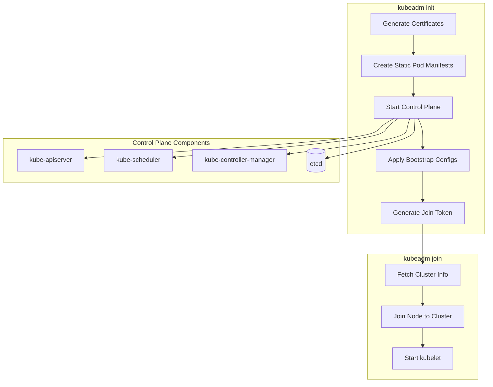
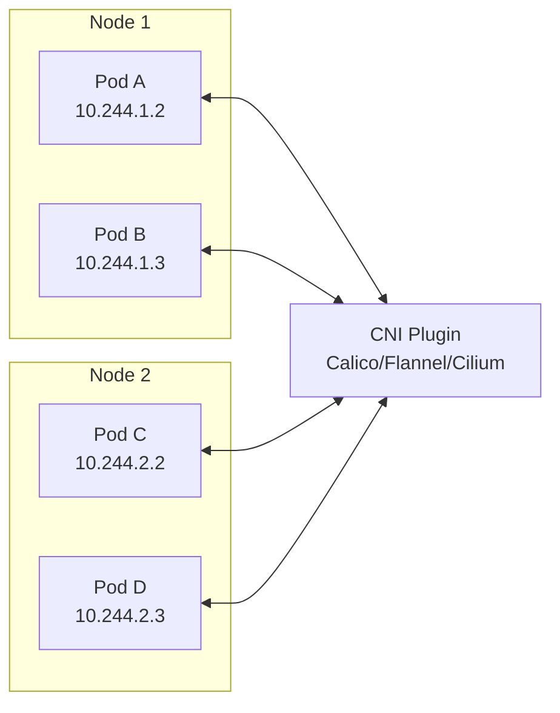
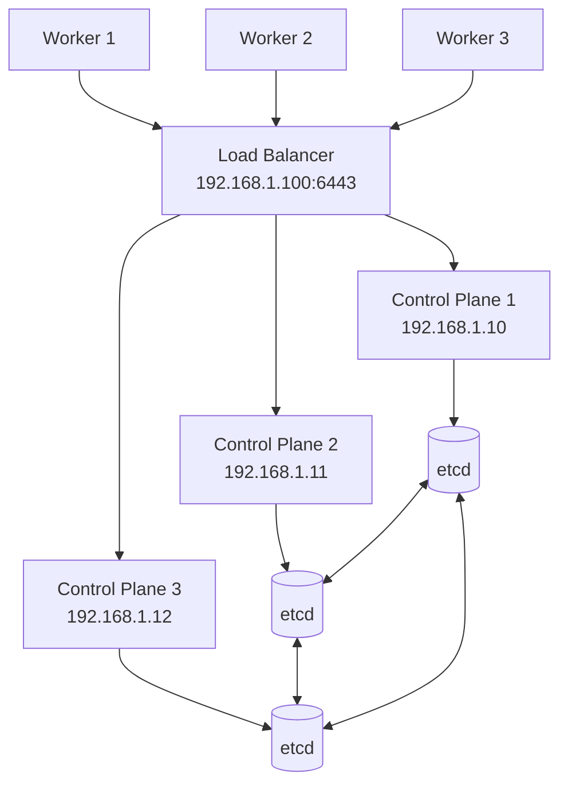
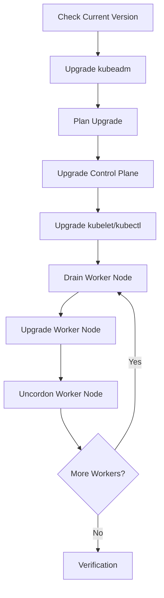

# How to Bootstrap Kubernetes Clusters with kubeadm

Author: [nawazdhandala](https://www.github.com/nawazdhandala)

Tags: Kubernetes, kubeadm, Cluster Setup, DevOps, Container Orchestration, Self-Managed Kubernetes

Description: A practical guide to bootstrapping production-ready Kubernetes clusters with kubeadm, covering prerequisites, installation, networking, joining worker nodes, and high availability configurations.

---

kubeadm is the official Kubernetes tool for creating clusters from scratch. Unlike managed services like EKS or GKE, kubeadm gives you full control over your cluster configuration while handling the complex bootstrapping process. Let's walk through setting up a production-ready Kubernetes cluster step by step.

## What kubeadm Does

kubeadm automates the cluster bootstrap process by handling certificate generation, control plane component configuration, and cluster initialization.



## Prerequisites

Before running kubeadm, every node in your cluster needs proper preparation. Here are the requirements.

### Hardware Requirements

| Role | CPU | Memory | Disk |
|------|-----|--------|------|
| Control Plane | 2+ cores | 2+ GB | 50+ GB |
| Worker Node | 1+ cores | 1+ GB | 20+ GB |

### System Preparation

The following script prepares Ubuntu/Debian systems for Kubernetes installation by disabling swap, loading required kernel modules, and configuring system parameters.

```bash
#!/bin/bash
# prepare-node.sh - Run on ALL nodes (control plane and workers)

set -e

echo "=== Disabling swap ==="
# Kubernetes requires swap to be disabled
swapoff -a
# Remove swap entries from fstab to persist across reboots
sed -i '/swap/d' /etc/fstab

echo "=== Loading required kernel modules ==="
# overlay: Required for overlay filesystem used by container runtimes
# br_netfilter: Required for iptables to see bridged traffic
cat <<EOF | tee /etc/modules-load.d/k8s.conf
overlay
br_netfilter
EOF

modprobe overlay
modprobe br_netfilter

echo "=== Configuring sysctl parameters ==="
# Enable IP forwarding and bridge-nf-call for Kubernetes networking
cat <<EOF | tee /etc/sysctl.d/k8s.conf
net.bridge.bridge-nf-call-iptables  = 1
net.bridge.bridge-nf-call-ip6tables = 1
net.ipv4.ip_forward                 = 1
EOF

sysctl --system

echo "=== Verifying settings ==="
lsmod | grep br_netfilter
lsmod | grep overlay
sysctl net.bridge.bridge-nf-call-iptables net.bridge.bridge-nf-call-ip6tables net.ipv4.ip_forward
```

### Installing containerd

Container runtime installation is required on all nodes. containerd is the recommended runtime for Kubernetes 1.24+.

```bash
#!/bin/bash
# install-containerd.sh - Run on ALL nodes

set -e

echo "=== Installing containerd ==="
apt-get update
apt-get install -y ca-certificates curl gnupg

# Add Docker's official GPG key (containerd is distributed via Docker repos)
install -m 0755 -d /etc/apt/keyrings
curl -fsSL https://download.docker.com/linux/ubuntu/gpg | gpg --dearmor -o /etc/apt/keyrings/docker.gpg
chmod a+r /etc/apt/keyrings/docker.gpg

# Add the repository
echo \
  "deb [arch=$(dpkg --print-architecture) signed-by=/etc/apt/keyrings/docker.gpg] https://download.docker.com/linux/ubuntu \
  $(. /etc/os-release && echo "$VERSION_CODENAME") stable" | \
  tee /etc/apt/sources.list.d/docker.list > /dev/null

apt-get update
apt-get install -y containerd.io

echo "=== Configuring containerd ==="
# Generate default config
containerd config default | tee /etc/containerd/config.toml

# Enable systemd cgroup driver (required for Kubernetes)
sed -i 's/SystemdCgroup = false/SystemdCgroup = true/' /etc/containerd/config.toml

systemctl restart containerd
systemctl enable containerd

echo "=== Verifying containerd ==="
systemctl status containerd --no-pager
```

### Installing kubeadm, kubelet, and kubectl

All three components need to be installed on control plane nodes. Worker nodes only need kubeadm and kubelet.

```bash
#!/bin/bash
# install-kubeadm.sh - Run on ALL nodes

set -e

KUBERNETES_VERSION="1.29"

echo "=== Installing Kubernetes packages ==="
apt-get update
apt-get install -y apt-transport-https ca-certificates curl gpg

# Add Kubernetes apt repository
curl -fsSL https://pkgs.k8s.io/core:/stable:/v${KUBERNETES_VERSION}/deb/Release.key | \
  gpg --dearmor -o /etc/apt/keyrings/kubernetes-apt-keyring.gpg

echo "deb [signed-by=/etc/apt/keyrings/kubernetes-apt-keyring.gpg] https://pkgs.k8s.io/core:/stable:/v${KUBERNETES_VERSION}/deb/ /" | \
  tee /etc/apt/sources.list.d/kubernetes.list

apt-get update
apt-get install -y kubelet kubeadm kubectl

# Prevent automatic updates that could break the cluster
apt-mark hold kubelet kubeadm kubectl

echo "=== Verifying installation ==="
kubeadm version
kubelet --version
kubectl version --client
```

## Initializing the Control Plane

With all prerequisites in place, you can now initialize the cluster. Run the following only on the designated control plane node.

### Basic Initialization

For a simple single control plane setup, use kubeadm init with your pod network CIDR.

```bash
# Initialize the control plane
# --pod-network-cidr: IP range for pod networking (required by most CNI plugins)
# --apiserver-advertise-address: IP address the API server will advertise
kubeadm init \
  --pod-network-cidr=10.244.0.0/16 \
  --apiserver-advertise-address=192.168.1.10
```

### Using a Configuration File

For more control and reproducibility, use a configuration file instead of command-line flags.

```yaml
# kubeadm-config.yaml
apiVersion: kubeadm.k8s.io/v1beta3
kind: InitConfiguration
localAPIEndpoint:
  advertiseAddress: 192.168.1.10
  bindPort: 6443
nodeRegistration:
  criSocket: unix:///var/run/containerd/containerd.sock
  name: control-plane-1
  taints:
    - effect: NoSchedule
      key: node-role.kubernetes.io/control-plane
---
apiVersion: kubeadm.k8s.io/v1beta3
kind: ClusterConfiguration
kubernetesVersion: v1.29.0
clusterName: production-cluster
networking:
  podSubnet: 10.244.0.0/16
  serviceSubnet: 10.96.0.0/12
  dnsDomain: cluster.local
controlPlaneEndpoint: "192.168.1.10:6443"
apiServer:
  certSANs:
    - "192.168.1.10"
    - "kubernetes.example.com"
  extraArgs:
    audit-log-path: /var/log/kubernetes/audit.log
    audit-log-maxage: "30"
    audit-log-maxbackup: "10"
    audit-log-maxsize: "100"
controllerManager:
  extraArgs:
    bind-address: "0.0.0.0"
scheduler:
  extraArgs:
    bind-address: "0.0.0.0"
etcd:
  local:
    dataDir: /var/lib/etcd
---
apiVersion: kubelet.config.k8s.io/v1beta1
kind: KubeletConfiguration
cgroupDriver: systemd
containerRuntimeEndpoint: unix:///var/run/containerd/containerd.sock
```

Apply the configuration file to initialize the cluster.

```bash
# Initialize using the configuration file
kubeadm init --config kubeadm-config.yaml

# After successful initialization, save the output
# It contains the join command for worker nodes
```

### Post-Initialization Setup

After kubeadm init completes, configure kubectl access for the admin user.

```bash
# Set up kubeconfig for the current user
mkdir -p $HOME/.kube
cp -i /etc/kubernetes/admin.conf $HOME/.kube/config
chown $(id -u):$(id -g) $HOME/.kube/config

# Verify the cluster is running
kubectl get nodes
kubectl get pods -n kube-system
```

## Installing a CNI Plugin

Kubernetes requires a Container Network Interface (CNI) plugin for pod networking. Without one, pods cannot communicate with each other.



### Calico Installation

Calico provides networking and network policy enforcement. Choose Calico for production clusters requiring network policies.

```bash
# Install Calico operator
kubectl create -f https://raw.githubusercontent.com/projectcalico/calico/v3.27.0/manifests/tigera-operator.yaml

# Install Calico custom resources
# Download and modify the CIDR if different from 192.168.0.0/16
curl -O https://raw.githubusercontent.com/projectcalico/calico/v3.27.0/manifests/custom-resources.yaml

# Edit custom-resources.yaml if your pod CIDR is different
# Default is 192.168.0.0/16, change to match --pod-network-cidr
kubectl create -f custom-resources.yaml

# Wait for Calico pods to be ready
kubectl get pods -n calico-system -w
```

### Flannel Installation

Flannel is simpler and works well for basic networking needs without network policies.

```bash
# Install Flannel
# Make sure the pod CIDR matches your kubeadm init configuration
kubectl apply -f https://github.com/flannel-io/flannel/releases/latest/download/kube-flannel.yml

# Verify Flannel is running
kubectl get pods -n kube-flannel
```

### Cilium Installation

Cilium offers advanced networking features including eBPF-based networking and observability.

```bash
# Install Cilium CLI
CILIUM_CLI_VERSION=$(curl -s https://raw.githubusercontent.com/cilium/cilium-cli/main/stable.txt)
curl -L --fail --remote-name-all https://github.com/cilium/cilium-cli/releases/download/${CILIUM_CLI_VERSION}/cilium-linux-amd64.tar.gz
tar xzvf cilium-linux-amd64.tar.gz
mv cilium /usr/local/bin/

# Install Cilium in the cluster
cilium install --version 1.15.0

# Verify installation
cilium status --wait
```

## Joining Worker Nodes

After installing the CNI plugin, worker nodes can join the cluster using the join command from kubeadm init output.

### Using the Join Command

The join command includes a token and CA certificate hash for secure cluster joining.

```bash
# Run on each worker node
# Replace with your actual values from kubeadm init output
kubeadm join 192.168.1.10:6443 \
  --token abcdef.0123456789abcdef \
  --discovery-token-ca-cert-hash sha256:1234567890abcdef...
```

### Generating a New Join Token

Tokens expire after 24 hours by default. Generate new ones if needed.

```bash
# On the control plane node, create a new token
kubeadm token create --print-join-command

# List existing tokens
kubeadm token list

# Create a token with custom TTL (e.g., 2 hours)
kubeadm token create --ttl 2h --print-join-command
```

### Verifying Node Join

Check that all nodes have joined successfully from the control plane.

```bash
# List all nodes
kubectl get nodes

# Check node details
kubectl describe node worker-1

# View system pods across all nodes
kubectl get pods -n kube-system -o wide
```

## High Availability Control Plane

Production clusters need multiple control plane nodes for redundancy. Here's how to set up HA with kubeadm.



### Load Balancer Setup

Set up a load balancer in front of the control plane nodes. HAProxy is a common choice.

```bash
# /etc/haproxy/haproxy.cfg
frontend kubernetes-frontend
    bind *:6443
    mode tcp
    option tcplog
    default_backend kubernetes-backend

backend kubernetes-backend
    mode tcp
    option tcp-check
    balance roundrobin
    server cp1 192.168.1.10:6443 check fall 3 rise 2
    server cp2 192.168.1.11:6443 check fall 3 rise 2
    server cp3 192.168.1.12:6443 check fall 3 rise 2
```

### First Control Plane Node

Initialize the first control plane with the load balancer endpoint.

```yaml
# ha-kubeadm-config.yaml
apiVersion: kubeadm.k8s.io/v1beta3
kind: InitConfiguration
localAPIEndpoint:
  advertiseAddress: 192.168.1.10
  bindPort: 6443
nodeRegistration:
  criSocket: unix:///var/run/containerd/containerd.sock
---
apiVersion: kubeadm.k8s.io/v1beta3
kind: ClusterConfiguration
kubernetesVersion: v1.29.0
# Point to the load balancer, not individual nodes
controlPlaneEndpoint: "192.168.1.100:6443"
networking:
  podSubnet: 10.244.0.0/16
  serviceSubnet: 10.96.0.0/12
apiServer:
  certSANs:
    - "192.168.1.100"
    - "192.168.1.10"
    - "192.168.1.11"
    - "192.168.1.12"
    - "kubernetes.example.com"
```

Run the initialization with certificate upload for additional control plane nodes.

```bash
# Initialize first control plane
kubeadm init --config ha-kubeadm-config.yaml --upload-certs

# The output includes a join command for additional control plane nodes
# Save both the control plane join command and the worker join command
```

### Additional Control Plane Nodes

Join additional control plane nodes using the special control-plane flag.

```bash
# Run on additional control plane nodes
kubeadm join 192.168.1.100:6443 \
  --token abcdef.0123456789abcdef \
  --discovery-token-ca-cert-hash sha256:1234567890abcdef... \
  --control-plane \
  --certificate-key abc123def456...
```

### Generating New Certificate Key

Certificate keys expire after 2 hours. Generate new ones if needed.

```bash
# On the first control plane node
kubeadm init phase upload-certs --upload-certs

# Then create a new join command
kubeadm token create --print-join-command

# Combine the two for the full control plane join command
```

## Cluster Verification

After setting up the cluster, run through verification checks to ensure everything works correctly.

```bash
#!/bin/bash
# verify-cluster.sh

echo "=== Node Status ==="
kubectl get nodes -o wide

echo ""
echo "=== System Pods ==="
kubectl get pods -n kube-system

echo ""
echo "=== Component Status ==="
kubectl get componentstatuses 2>/dev/null || echo "Note: componentstatuses is deprecated"

echo ""
echo "=== Cluster Info ==="
kubectl cluster-info

echo ""
echo "=== Testing Pod Deployment ==="
kubectl run nginx-test --image=nginx --restart=Never
sleep 10
kubectl get pod nginx-test
kubectl delete pod nginx-test

echo ""
echo "=== Testing Service Creation ==="
kubectl create deployment nginx --image=nginx
kubectl expose deployment nginx --port=80 --type=ClusterIP
kubectl get svc nginx
kubectl delete deployment nginx
kubectl delete svc nginx

echo ""
echo "=== Verification Complete ==="
```

## Cluster Upgrades with kubeadm

Upgrading a kubeadm cluster requires careful coordination across all nodes.



### Upgrade Control Plane

Start by upgrading the first control plane node.

```bash
#!/bin/bash
# upgrade-control-plane.sh

NEW_VERSION="1.30.0"

echo "=== Upgrading kubeadm ==="
apt-mark unhold kubeadm
apt-get update
apt-get install -y kubeadm=${NEW_VERSION}-*
apt-mark hold kubeadm

echo "=== Checking upgrade plan ==="
kubeadm upgrade plan

echo "=== Applying upgrade ==="
# For first control plane node
kubeadm upgrade apply v${NEW_VERSION}

# For additional control plane nodes, use:
# kubeadm upgrade node

echo "=== Upgrading kubelet and kubectl ==="
apt-mark unhold kubelet kubectl
apt-get install -y kubelet=${NEW_VERSION}-* kubectl=${NEW_VERSION}-*
apt-mark hold kubelet kubectl

systemctl daemon-reload
systemctl restart kubelet

echo "=== Verifying upgrade ==="
kubectl get nodes
```

### Upgrade Worker Nodes

Worker nodes should be drained before upgrading to avoid workload disruption.

```bash
#!/bin/bash
# upgrade-worker.sh

NODE_NAME=$1
NEW_VERSION="1.30.0"

if [ -z "$NODE_NAME" ]; then
    echo "Usage: $0 <node-name>"
    exit 1
fi

echo "=== Draining node $NODE_NAME ==="
kubectl drain $NODE_NAME --ignore-daemonsets --delete-emptydir-data

# SSH to worker and run these commands:
echo "=== On the worker node, run: ==="
cat << EOF
apt-mark unhold kubeadm kubelet kubectl
apt-get update
apt-get install -y kubeadm=${NEW_VERSION}-* kubelet=${NEW_VERSION}-* kubectl=${NEW_VERSION}-*
apt-mark hold kubeadm kubelet kubectl
kubeadm upgrade node
systemctl daemon-reload
systemctl restart kubelet
EOF

# After upgrading the worker, uncordon it
echo "=== After upgrade completes, uncordon: ==="
echo "kubectl uncordon $NODE_NAME"
```

## Troubleshooting Common Issues

### kubeadm init Fails

Debug initialization failures with verbose output.

```bash
# Run with verbose output
kubeadm init --v=5

# Check kubelet logs
journalctl -xeu kubelet

# Check container runtime
crictl ps
crictl logs <container-id>

# Verify prerequisites
kubeadm init phase preflight
```

### Node Won't Join

Diagnose join failures with these steps.

```bash
# On the control plane, verify the token is valid
kubeadm token list

# On the worker, check connectivity
curl -k https://192.168.1.10:6443/healthz

# Check if ports are open
nc -zv 192.168.1.10 6443

# Run join with verbose output
kubeadm join --v=5 192.168.1.10:6443 --token ... --discovery-token-ca-cert-hash ...
```

### Pods Stuck in Pending

Pods often get stuck in Pending when CNI is not installed or misconfigured.

```bash
# Check if CNI is running
kubectl get pods -n kube-system | grep -E "calico|flannel|cilium"

# Check node conditions
kubectl describe node <node-name> | grep -A 10 Conditions

# Check kubelet logs for CNI errors
journalctl -u kubelet | grep -i cni
```

### Reset and Start Over

When things go wrong, reset the node and start fresh.

```bash
# Reset kubeadm configuration
kubeadm reset -f

# Clean up iptables
iptables -F && iptables -t nat -F && iptables -t mangle -F && iptables -X

# Clean up IPVS (if used)
ipvsadm --clear

# Remove CNI configuration
rm -rf /etc/cni/net.d/*

# Remove etcd data
rm -rf /var/lib/etcd

# Clean up kubeconfig
rm -rf ~/.kube
```

## Security Hardening

After bootstrapping, apply these security measures to your cluster.

### Secure the API Server

Restrict access to the Kubernetes API server.

```yaml
# kubeadm-config.yaml additions for security
apiVersion: kubeadm.k8s.io/v1beta3
kind: ClusterConfiguration
apiServer:
  extraArgs:
    # Enable audit logging
    audit-log-path: /var/log/kubernetes/audit.log
    audit-log-maxage: "30"
    audit-log-maxbackup: "10"
    audit-log-maxsize: "100"
    # Disable anonymous auth
    anonymous-auth: "false"
    # Enable RBAC
    authorization-mode: "Node,RBAC"
    # Secure etcd communication
    etcd-cafile: /etc/kubernetes/pki/etcd/ca.crt
    etcd-certfile: /etc/kubernetes/pki/apiserver-etcd-client.crt
    etcd-keyfile: /etc/kubernetes/pki/apiserver-etcd-client.key
```

### Encrypt Secrets at Rest

Enable encryption for secrets stored in etcd.

```yaml
# /etc/kubernetes/encryption-config.yaml
apiVersion: apiserver.config.k8s.io/v1
kind: EncryptionConfiguration
resources:
  - resources:
      - secrets
    providers:
      - aescbc:
          keys:
            - name: key1
              # Generate with: head -c 32 /dev/urandom | base64
              secret: <base64-encoded-32-byte-key>
      - identity: {}
```

Add the encryption config to the API server.

```yaml
# In kubeadm config
apiServer:
  extraArgs:
    encryption-provider-config: /etc/kubernetes/encryption-config.yaml
  extraVolumes:
    - name: encryption-config
      hostPath: /etc/kubernetes/encryption-config.yaml
      mountPath: /etc/kubernetes/encryption-config.yaml
      readOnly: true
```

## Summary

kubeadm provides a reliable way to bootstrap production-ready Kubernetes clusters while maintaining full control over your infrastructure. Key takeaways:

- Prepare all nodes with container runtime and kernel configurations before running kubeadm
- Use configuration files for reproducible cluster setup
- Always install a CNI plugin after initializing the control plane
- Plan for high availability with multiple control plane nodes and a load balancer
- Follow the proper upgrade sequence: control plane first, then workers one at a time
- Apply security hardening after the initial bootstrap

For more Kubernetes operational guides, check out our posts on [etcd backup and recovery](https://oneuptime.com/blog/post/2026-01-06-kubernetes-etcd-backup-recovery/view) and [Kubernetes RBAC best practices](https://oneuptime.com/blog/post/2026-01-06-kubernetes-rbac-best-practices/view).
