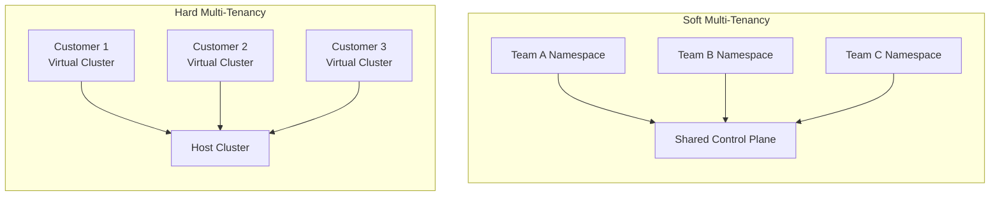
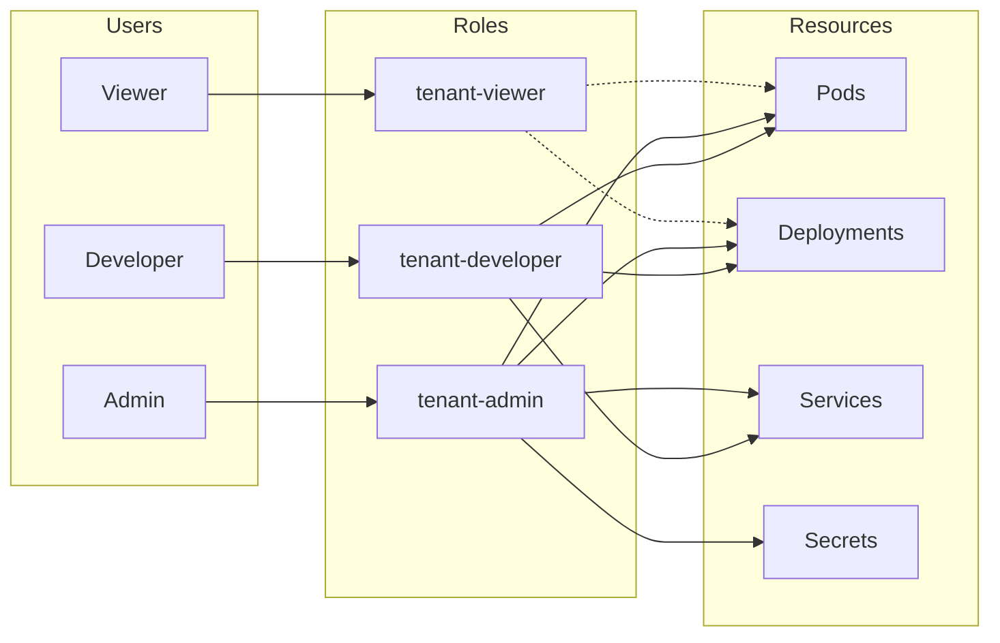
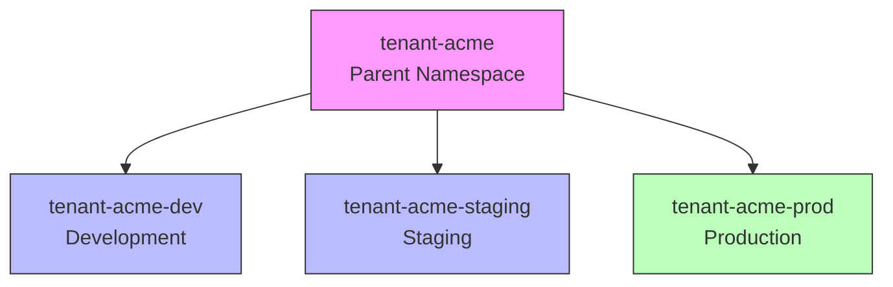

# How to Configure Kubernetes Multi-Tenancy

Author: [nawazdhandala](https://www.github.com/nawazdhandala)

Tags: Kubernetes, Multi-Tenancy, Security, Namespaces, RBAC, Resource Quotas, DevOps

Description: A practical guide to configuring Kubernetes for multi-tenancy, covering namespace isolation, RBAC, network policies, resource quotas, and hierarchical namespaces for secure shared clusters.

---

Running multiple teams or customers on a single Kubernetes cluster saves money and reduces operational overhead. But getting isolation right requires careful configuration across namespaces, RBAC, network policies, and resource management. Let me walk you through a production-ready multi-tenant setup.

## Understanding Multi-Tenancy Models

Kubernetes supports different isolation levels depending on your security requirements.



### Soft Multi-Tenancy

Teams within the same organization share a cluster. Trust exists between tenants, and isolation prevents accidental interference rather than malicious attacks.

### Hard Multi-Tenancy

Different customers or untrusted workloads share infrastructure. Strong isolation boundaries are required, often using virtual clusters or dedicated node pools.

## Namespace-Based Isolation

Namespaces provide the foundation for tenant isolation. Each tenant gets one or more namespaces with controlled access.

### Creating Tenant Namespaces

The following YAML creates a namespace with appropriate labels for a tenant named "acme". Labels help with policy targeting and resource tracking.

```yaml
apiVersion: v1
kind: Namespace
metadata:
  name: tenant-acme
  labels:
    tenant: acme
    environment: production
    cost-center: cc-12345
  annotations:
    contacts: "platform-team@acme.com"
    description: "ACME Corp production workloads"
```

### Namespace Automation Script

For managing many tenants, automation is essential. The script below creates namespaces with standard labels and annotations.

```bash
#!/bin/bash
# create-tenant-namespace.sh
# Creates a tenant namespace with standard configuration

TENANT_NAME=$1
ENVIRONMENT=${2:-production}
COST_CENTER=${3:-unknown}

if [ -z "$TENANT_NAME" ]; then
    echo "Usage: $0 <tenant-name> [environment] [cost-center]"
    exit 1
fi

NAMESPACE="tenant-${TENANT_NAME}"

# Create namespace with labels
kubectl create namespace "$NAMESPACE" --dry-run=client -o yaml | \
kubectl label --local -f - \
    tenant="$TENANT_NAME" \
    environment="$ENVIRONMENT" \
    cost-center="$COST_CENTER" \
    --dry-run=client -o yaml | \
kubectl apply -f -

echo "Created namespace: $NAMESPACE"
```

## RBAC Configuration for Tenants

Role-Based Access Control restricts what users can do within their namespaces. A well-designed RBAC model prevents tenants from accessing resources outside their boundary.



### Tenant Admin Role

Tenant admins have full control within their namespace but cannot access cluster-level resources. The role below grants broad permissions within the namespace scope.

```yaml
apiVersion: rbac.authorization.k8s.io/v1
kind: Role
metadata:
  name: tenant-admin
  namespace: tenant-acme
rules:
  # Full access to workload resources
  - apiGroups: ["", "apps", "batch"]
    resources: ["pods", "deployments", "replicasets", "statefulsets",
                "daemonsets", "jobs", "cronjobs"]
    verbs: ["*"]

  # Full access to service resources
  - apiGroups: ["", "networking.k8s.io"]
    resources: ["services", "endpoints", "ingresses"]
    verbs: ["*"]

  # Full access to configuration
  - apiGroups: [""]
    resources: ["configmaps", "secrets"]
    verbs: ["*"]

  # Read access to events and logs
  - apiGroups: [""]
    resources: ["events", "pods/log"]
    verbs: ["get", "list", "watch"]

  # Manage service accounts within namespace
  - apiGroups: [""]
    resources: ["serviceaccounts"]
    verbs: ["*"]

  # Read-only access to resource quotas
  - apiGroups: [""]
    resources: ["resourcequotas", "limitranges"]
    verbs: ["get", "list", "watch"]
```

### Tenant Developer Role

Developers need fewer permissions than admins. Restricting secret access and certain operations reduces the blast radius of compromised credentials.

```yaml
apiVersion: rbac.authorization.k8s.io/v1
kind: Role
metadata:
  name: tenant-developer
  namespace: tenant-acme
rules:
  # Workload management - no delete on production
  - apiGroups: ["", "apps"]
    resources: ["pods", "deployments", "replicasets"]
    verbs: ["get", "list", "watch", "create", "update", "patch"]

  # Service management
  - apiGroups: [""]
    resources: ["services"]
    verbs: ["get", "list", "watch", "create", "update", "patch"]

  # ConfigMap access - no secrets
  - apiGroups: [""]
    resources: ["configmaps"]
    verbs: ["get", "list", "watch", "create", "update", "patch"]

  # Read-only secrets (for debugging)
  - apiGroups: [""]
    resources: ["secrets"]
    verbs: ["get", "list"]

  # Pod operations for debugging
  - apiGroups: [""]
    resources: ["pods/log", "pods/exec", "pods/portforward"]
    verbs: ["get", "create"]
```

### Tenant Viewer Role

Read-only access for auditors, support staff, or monitoring systems.

```yaml
apiVersion: rbac.authorization.k8s.io/v1
kind: Role
metadata:
  name: tenant-viewer
  namespace: tenant-acme
rules:
  - apiGroups: ["", "apps", "batch", "networking.k8s.io"]
    resources: ["*"]
    verbs: ["get", "list", "watch"]
  # Explicitly exclude secrets from viewing
  - apiGroups: [""]
    resources: ["secrets"]
    verbs: []
```

### Binding Roles to Users

RoleBindings connect users or groups to roles. The binding below grants the tenant-admin role to a specific group.

```yaml
apiVersion: rbac.authorization.k8s.io/v1
kind: RoleBinding
metadata:
  name: acme-admins
  namespace: tenant-acme
subjects:
  - kind: Group
    name: acme-admins
    apiGroup: rbac.authorization.k8s.io
  - kind: User
    name: alice@acme.com
    apiGroup: rbac.authorization.k8s.io
roleRef:
  kind: Role
  name: tenant-admin
  apiGroup: rbac.authorization.k8s.io
---
apiVersion: rbac.authorization.k8s.io/v1
kind: RoleBinding
metadata:
  name: acme-developers
  namespace: tenant-acme
subjects:
  - kind: Group
    name: acme-developers
    apiGroup: rbac.authorization.k8s.io
roleRef:
  kind: Role
  name: tenant-developer
  apiGroup: rbac.authorization.k8s.io
```

## Resource Quotas

Resource quotas prevent any single tenant from consuming all cluster resources. Without quotas, one misbehaving workload can starve others.

### Compute Resource Quota

The quota below limits CPU, memory, and object counts within a namespace. Adjust values based on your cluster capacity and tenant requirements.

```yaml
apiVersion: v1
kind: ResourceQuota
metadata:
  name: compute-quota
  namespace: tenant-acme
spec:
  hard:
    # CPU limits
    requests.cpu: "20"
    limits.cpu: "40"

    # Memory limits
    requests.memory: 40Gi
    limits.memory: 80Gi

    # Storage limits
    requests.storage: 100Gi
    persistentvolumeclaims: "20"

    # Object count limits
    pods: "100"
    services: "50"
    secrets: "100"
    configmaps: "100"
    replicationcontrollers: "20"

    # Prevent LoadBalancer abuse
    services.loadbalancers: "5"
    services.nodeports: "10"
```

### Priority-Based Quotas

Different quotas for different priority classes allow tenants to run both critical and best-effort workloads.

```yaml
apiVersion: v1
kind: ResourceQuota
metadata:
  name: high-priority-quota
  namespace: tenant-acme
spec:
  hard:
    requests.cpu: "10"
    requests.memory: 20Gi
  scopeSelector:
    matchExpressions:
      - operator: In
        scopeName: PriorityClass
        values: ["high-priority"]
---
apiVersion: v1
kind: ResourceQuota
metadata:
  name: low-priority-quota
  namespace: tenant-acme
spec:
  hard:
    requests.cpu: "20"
    requests.memory: 40Gi
  scopeSelector:
    matchExpressions:
      - operator: In
        scopeName: PriorityClass
        values: ["low-priority", "best-effort"]
```

## Limit Ranges

LimitRanges set default and maximum resource requests for individual containers. Every pod should have resource limits to prevent runaway consumption.

```yaml
apiVersion: v1
kind: LimitRange
metadata:
  name: default-limits
  namespace: tenant-acme
spec:
  limits:
    # Container defaults and limits
    - type: Container
      default:
        cpu: "500m"
        memory: "512Mi"
      defaultRequest:
        cpu: "100m"
        memory: "128Mi"
      max:
        cpu: "4"
        memory: "8Gi"
      min:
        cpu: "50m"
        memory: "64Mi"

    # Pod-level limits
    - type: Pod
      max:
        cpu: "8"
        memory: "16Gi"

    # PVC size limits
    - type: PersistentVolumeClaim
      max:
        storage: "50Gi"
      min:
        storage: "1Gi"
```

## Network Policies for Tenant Isolation

Network policies are critical for multi-tenancy. Without them, any pod can communicate with any other pod in the cluster.

### Default Deny Policy

Start with a default deny policy, then explicitly allow required traffic. The policy below blocks all ingress traffic to pods in the namespace.

```yaml
apiVersion: networking.k8s.io/v1
kind: NetworkPolicy
metadata:
  name: default-deny-all
  namespace: tenant-acme
spec:
  podSelector: {}
  policyTypes:
    - Ingress
    - Egress
```

### Allow Intra-Tenant Communication

Pods within the same tenant namespace should communicate freely.

```yaml
apiVersion: networking.k8s.io/v1
kind: NetworkPolicy
metadata:
  name: allow-same-namespace
  namespace: tenant-acme
spec:
  podSelector: {}
  policyTypes:
    - Ingress
    - Egress
  ingress:
    - from:
        - podSelector: {}
  egress:
    - to:
        - podSelector: {}
```

### Allow DNS Resolution

Without DNS access, pods cannot resolve service names. The policy explicitly allows traffic to kube-dns.

```yaml
apiVersion: networking.k8s.io/v1
kind: NetworkPolicy
metadata:
  name: allow-dns
  namespace: tenant-acme
spec:
  podSelector: {}
  policyTypes:
    - Egress
  egress:
    - to:
        - namespaceSelector:
            matchLabels:
              kubernetes.io/metadata.name: kube-system
          podSelector:
            matchLabels:
              k8s-app: kube-dns
      ports:
        - protocol: UDP
          port: 53
        - protocol: TCP
          port: 53
```

### Allow Ingress Traffic

Allow external traffic through the ingress controller to tenant services.

```yaml
apiVersion: networking.k8s.io/v1
kind: NetworkPolicy
metadata:
  name: allow-ingress-controller
  namespace: tenant-acme
spec:
  podSelector:
    matchLabels:
      allow-ingress: "true"
  policyTypes:
    - Ingress
  ingress:
    - from:
        - namespaceSelector:
            matchLabels:
              kubernetes.io/metadata.name: ingress-nginx
      ports:
        - protocol: TCP
          port: 8080
        - protocol: TCP
          port: 443
```

### Complete Network Policy Set

Combining all policies into a single manifest simplifies deployment.

```yaml
apiVersion: networking.k8s.io/v1
kind: NetworkPolicy
metadata:
  name: tenant-network-policy
  namespace: tenant-acme
spec:
  podSelector: {}
  policyTypes:
    - Ingress
    - Egress
  ingress:
    # Allow from same namespace
    - from:
        - podSelector: {}
    # Allow from ingress controller
    - from:
        - namespaceSelector:
            matchLabels:
              kubernetes.io/metadata.name: ingress-nginx
  egress:
    # Allow to same namespace
    - to:
        - podSelector: {}
    # Allow DNS
    - to:
        - namespaceSelector:
            matchLabels:
              kubernetes.io/metadata.name: kube-system
          podSelector:
            matchLabels:
              k8s-app: kube-dns
      ports:
        - protocol: UDP
          port: 53
        - protocol: TCP
          port: 53
    # Allow external HTTPS (for pulling images, calling APIs)
    - to:
        - ipBlock:
            cidr: 0.0.0.0/0
            except:
              - 10.0.0.0/8
              - 172.16.0.0/12
              - 192.168.0.0/16
      ports:
        - protocol: TCP
          port: 443
```

## Pod Security Standards

Pod Security Standards restrict what pods can do at runtime. Enforcing these standards prevents privilege escalation and container escapes.

### Namespace Labels for Pod Security

Apply Pod Security Standards using namespace labels.

```yaml
apiVersion: v1
kind: Namespace
metadata:
  name: tenant-acme
  labels:
    tenant: acme
    # Enforce restricted security standard
    pod-security.kubernetes.io/enforce: restricted
    pod-security.kubernetes.io/enforce-version: latest
    # Warn on baseline violations
    pod-security.kubernetes.io/warn: baseline
    pod-security.kubernetes.io/warn-version: latest
```

### Restricted Pod Example

Pods must comply with the security standards. The deployment below shows a compliant configuration.

```yaml
apiVersion: apps/v1
kind: Deployment
metadata:
  name: secure-app
  namespace: tenant-acme
spec:
  replicas: 2
  selector:
    matchLabels:
      app: secure-app
  template:
    metadata:
      labels:
        app: secure-app
    spec:
      securityContext:
        runAsNonRoot: true
        runAsUser: 1000
        runAsGroup: 1000
        fsGroup: 1000
        seccompProfile:
          type: RuntimeDefault
      containers:
        - name: app
          image: myregistry/app:v1.0
          securityContext:
            allowPrivilegeEscalation: false
            readOnlyRootFilesystem: true
            capabilities:
              drop:
                - ALL
          resources:
            requests:
              cpu: "100m"
              memory: "128Mi"
            limits:
              cpu: "500m"
              memory: "512Mi"
          volumeMounts:
            - name: tmp
              mountPath: /tmp
            - name: cache
              mountPath: /app/cache
      volumes:
        - name: tmp
          emptyDir: {}
        - name: cache
          emptyDir: {}
```

## Hierarchical Namespaces

Hierarchical Namespace Controller (HNC) enables namespace hierarchies where child namespaces inherit policies from parents. Teams can create sub-namespaces without cluster admin involvement.



### Installing Hierarchical Namespace Controller

Install HNC using kubectl.

```bash
# Install HNC
kubectl apply -f https://github.com/kubernetes-sigs/hierarchical-namespaces/releases/download/v1.1.0/default.yaml

# Wait for controller to be ready
kubectl wait --for=condition=available --timeout=60s \
    deployment/hnc-controller-manager -n hnc-system
```

### Creating Namespace Hierarchy

Define the parent namespace with HNC configuration.

```yaml
apiVersion: hnc.x-k8s.io/v1alpha2
kind: HierarchyConfiguration
metadata:
  name: hierarchy
  namespace: tenant-acme
spec:
  # Optionally set a parent
  # parent: org-namespaces
  allowCascadingDeletion: false
---
# Create subnamespace
apiVersion: hnc.x-k8s.io/v1alpha2
kind: SubnamespaceAnchor
metadata:
  name: dev
  namespace: tenant-acme
---
apiVersion: hnc.x-k8s.io/v1alpha2
kind: SubnamespaceAnchor
metadata:
  name: staging
  namespace: tenant-acme
---
apiVersion: hnc.x-k8s.io/v1alpha2
kind: SubnamespaceAnchor
metadata:
  name: prod
  namespace: tenant-acme
```

### Propagating Policies

HNC propagates labeled resources to child namespaces. Mark resources for propagation.

```yaml
# Parent namespace - resources here propagate to children
apiVersion: v1
kind: ResourceQuota
metadata:
  name: inherited-quota
  namespace: tenant-acme
  labels:
    hnc.x-k8s.io/inherited-from: tenant-acme
spec:
  hard:
    pods: "50"
    requests.cpu: "10"
    requests.memory: "20Gi"
---
apiVersion: networking.k8s.io/v1
kind: NetworkPolicy
metadata:
  name: inherited-network-policy
  namespace: tenant-acme
  labels:
    hnc.x-k8s.io/inherited-from: tenant-acme
spec:
  podSelector: {}
  policyTypes:
    - Ingress
  ingress:
    - from:
        - namespaceSelector:
            matchLabels:
              tenant: acme
```

## Node Isolation

For stronger isolation, dedicate nodes to specific tenants using taints and tolerations.

### Tainting Nodes for Tenants

Taints prevent pods from scheduling on nodes unless they tolerate the taint.

```bash
# Taint nodes for specific tenant
kubectl taint nodes node-1 tenant=acme:NoSchedule
kubectl taint nodes node-2 tenant=acme:NoSchedule

# Label nodes for node selector
kubectl label nodes node-1 tenant=acme
kubectl label nodes node-2 tenant=acme
```

### Pod Configuration for Node Isolation

Pods must include tolerations and node selectors to run on dedicated nodes.

```yaml
apiVersion: apps/v1
kind: Deployment
metadata:
  name: tenant-app
  namespace: tenant-acme
spec:
  replicas: 3
  selector:
    matchLabels:
      app: tenant-app
  template:
    metadata:
      labels:
        app: tenant-app
    spec:
      nodeSelector:
        tenant: acme
      tolerations:
        - key: tenant
          operator: Equal
          value: acme
          effect: NoSchedule
      containers:
        - name: app
          image: myregistry/app:v1.0
```

### Enforcing Node Isolation with Admission Webhooks

Use a validating admission webhook to ensure pods only run on allowed nodes. The policy below uses Kyverno.

```yaml
apiVersion: kyverno.io/v1
kind: ClusterPolicy
metadata:
  name: enforce-tenant-node-isolation
spec:
  validationFailureAction: Enforce
  background: false
  rules:
    - name: require-tenant-toleration
      match:
        any:
          - resources:
              kinds:
                - Pod
              namespaces:
                - "tenant-*"
      validate:
        message: "Pods in tenant namespaces must include tenant toleration"
        pattern:
          spec:
            tolerations:
              - key: tenant
                operator: Equal
                effect: NoSchedule
```

## Monitoring and Auditing

Multi-tenant clusters require visibility into tenant resource usage and activities.

### Prometheus Metrics by Namespace

Configure Prometheus to track metrics per namespace for chargeback and capacity planning.

```yaml
# Recording rules for namespace metrics
apiVersion: monitoring.coreos.com/v1
kind: PrometheusRule
metadata:
  name: namespace-metrics
  namespace: monitoring
spec:
  groups:
    - name: namespace.rules
      rules:
        - record: namespace:container_cpu_usage_seconds_total:sum_rate
          expr: |
            sum by (namespace) (
              rate(container_cpu_usage_seconds_total{container!=""}[5m])
            )

        - record: namespace:container_memory_working_set_bytes:sum
          expr: |
            sum by (namespace) (
              container_memory_working_set_bytes{container!=""}
            )

        - record: namespace:kube_pod_container_resource_requests:sum
          expr: |
            sum by (namespace, resource) (
              kube_pod_container_resource_requests
            )
```

### Audit Logging

Enable Kubernetes audit logging to track who did what in each namespace.

```yaml
# Audit policy for multi-tenant clusters
apiVersion: audit.k8s.io/v1
kind: Policy
rules:
  # Log all changes to secrets
  - level: Metadata
    resources:
      - group: ""
        resources: ["secrets"]

  # Log all changes in tenant namespaces
  - level: RequestResponse
    namespaces: ["tenant-*"]
    verbs: ["create", "update", "patch", "delete"]
    resources:
      - group: ""
        resources: ["pods", "services", "configmaps"]
      - group: "apps"
        resources: ["deployments", "statefulsets"]

  # Log RBAC changes
  - level: RequestResponse
    resources:
      - group: "rbac.authorization.k8s.io"
        resources: ["roles", "rolebindings", "clusterroles", "clusterrolebindings"]

  # Skip logging read operations on common resources
  - level: None
    verbs: ["get", "list", "watch"]
    resources:
      - group: ""
        resources: ["events", "nodes"]
```

## Complete Tenant Onboarding

Putting it all together, here is a complete tenant onboarding manifest.

```yaml
# tenant-onboarding.yaml
# Complete configuration for onboarding a new tenant

# Namespace with security labels
apiVersion: v1
kind: Namespace
metadata:
  name: tenant-newcorp
  labels:
    tenant: newcorp
    environment: production
    cost-center: cc-99999
    pod-security.kubernetes.io/enforce: restricted
    pod-security.kubernetes.io/enforce-version: latest
---
# Resource quota
apiVersion: v1
kind: ResourceQuota
metadata:
  name: compute-quota
  namespace: tenant-newcorp
spec:
  hard:
    requests.cpu: "20"
    limits.cpu: "40"
    requests.memory: 40Gi
    limits.memory: 80Gi
    pods: "100"
    services: "50"
    services.loadbalancers: "2"
---
# Limit range
apiVersion: v1
kind: LimitRange
metadata:
  name: default-limits
  namespace: tenant-newcorp
spec:
  limits:
    - type: Container
      default:
        cpu: "500m"
        memory: "512Mi"
      defaultRequest:
        cpu: "100m"
        memory: "128Mi"
      max:
        cpu: "4"
        memory: "8Gi"
---
# Network policy
apiVersion: networking.k8s.io/v1
kind: NetworkPolicy
metadata:
  name: tenant-isolation
  namespace: tenant-newcorp
spec:
  podSelector: {}
  policyTypes:
    - Ingress
    - Egress
  ingress:
    - from:
        - podSelector: {}
    - from:
        - namespaceSelector:
            matchLabels:
              kubernetes.io/metadata.name: ingress-nginx
  egress:
    - to:
        - podSelector: {}
    - to:
        - namespaceSelector:
            matchLabels:
              kubernetes.io/metadata.name: kube-system
          podSelector:
            matchLabels:
              k8s-app: kube-dns
      ports:
        - protocol: UDP
          port: 53
    - to:
        - ipBlock:
            cidr: 0.0.0.0/0
            except:
              - 10.0.0.0/8
              - 172.16.0.0/12
              - 192.168.0.0/16
      ports:
        - protocol: TCP
          port: 443
---
# Admin role
apiVersion: rbac.authorization.k8s.io/v1
kind: Role
metadata:
  name: tenant-admin
  namespace: tenant-newcorp
rules:
  - apiGroups: ["", "apps", "batch", "networking.k8s.io"]
    resources: ["*"]
    verbs: ["*"]
---
# Admin binding
apiVersion: rbac.authorization.k8s.io/v1
kind: RoleBinding
metadata:
  name: tenant-admins
  namespace: tenant-newcorp
subjects:
  - kind: Group
    name: newcorp-admins
    apiGroup: rbac.authorization.k8s.io
roleRef:
  kind: Role
  name: tenant-admin
  apiGroup: rbac.authorization.k8s.io
```

### Onboarding Script

Automate tenant onboarding with a script that generates and applies configurations.

```bash
#!/bin/bash
# onboard-tenant.sh
# Onboards a new tenant with complete isolation configuration

set -e

TENANT_NAME=$1
CPU_QUOTA=${2:-20}
MEMORY_QUOTA=${3:-40Gi}
ADMIN_GROUP=${4:-"${TENANT_NAME}-admins"}

if [ -z "$TENANT_NAME" ]; then
    echo "Usage: $0 <tenant-name> [cpu-quota] [memory-quota] [admin-group]"
    exit 1
fi

NAMESPACE="tenant-${TENANT_NAME}"

echo "Onboarding tenant: $TENANT_NAME"
echo "Namespace: $NAMESPACE"
echo "CPU Quota: $CPU_QUOTA"
echo "Memory Quota: $MEMORY_QUOTA"
echo "Admin Group: $ADMIN_GROUP"

# Generate manifest from template
cat << EOF | kubectl apply -f -
apiVersion: v1
kind: Namespace
metadata:
  name: $NAMESPACE
  labels:
    tenant: $TENANT_NAME
    pod-security.kubernetes.io/enforce: restricted
---
apiVersion: v1
kind: ResourceQuota
metadata:
  name: compute-quota
  namespace: $NAMESPACE
spec:
  hard:
    requests.cpu: "$CPU_QUOTA"
    limits.cpu: "$((CPU_QUOTA * 2))"
    requests.memory: "$MEMORY_QUOTA"
    pods: "100"
---
apiVersion: networking.k8s.io/v1
kind: NetworkPolicy
metadata:
  name: tenant-isolation
  namespace: $NAMESPACE
spec:
  podSelector: {}
  policyTypes:
    - Ingress
    - Egress
  ingress:
    - from:
        - podSelector: {}
  egress:
    - to:
        - podSelector: {}
    - to:
        - namespaceSelector:
            matchLabels:
              kubernetes.io/metadata.name: kube-system
      ports:
        - protocol: UDP
          port: 53
---
apiVersion: rbac.authorization.k8s.io/v1
kind: RoleBinding
metadata:
  name: tenant-admins
  namespace: $NAMESPACE
subjects:
  - kind: Group
    name: $ADMIN_GROUP
    apiGroup: rbac.authorization.k8s.io
roleRef:
  kind: ClusterRole
  name: admin
  apiGroup: rbac.authorization.k8s.io
EOF

echo "Tenant $TENANT_NAME onboarded successfully"
kubectl get all -n $NAMESPACE
```

## Troubleshooting Multi-Tenancy Issues

### Checking Resource Quota Status

```bash
# View quota usage
kubectl describe resourcequota -n tenant-acme

# Find pods blocked by quota
kubectl get events -n tenant-acme --field-selector reason=FailedCreate
```

### Debugging Network Policy Issues

```bash
# List all network policies
kubectl get networkpolicies -n tenant-acme -o yaml

# Test connectivity from a pod
kubectl exec -n tenant-acme deployment/app -- \
    curl -v --max-time 5 http://other-service.tenant-acme.svc.cluster.local

# Check if CNI supports network policies
kubectl get pods -n kube-system -l k8s-app=calico-node
```

### Verifying RBAC Configuration

```bash
# Check what a user can do
kubectl auth can-i --list --as=alice@acme.com -n tenant-acme

# Test specific permission
kubectl auth can-i create deployments --as=alice@acme.com -n tenant-acme

# Find role bindings for a user
kubectl get rolebindings -n tenant-acme -o json | \
    jq '.items[] | select(.subjects[]?.name == "alice@acme.com")'
```

---

Multi-tenancy in Kubernetes requires careful orchestration of namespaces, RBAC, network policies, resource quotas, and security standards. Start with soft multi-tenancy for internal teams, and add stronger isolation mechanisms as your security requirements grow. Regular audits and monitoring ensure your isolation boundaries remain intact as the cluster evolves.
