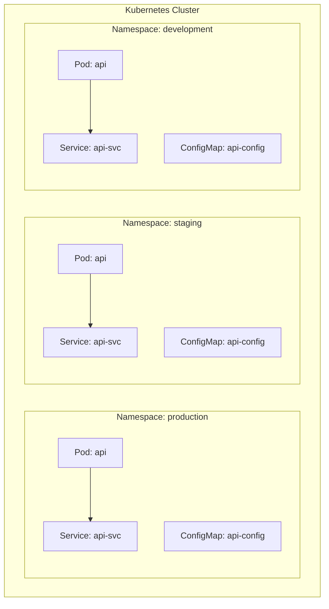
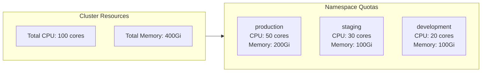
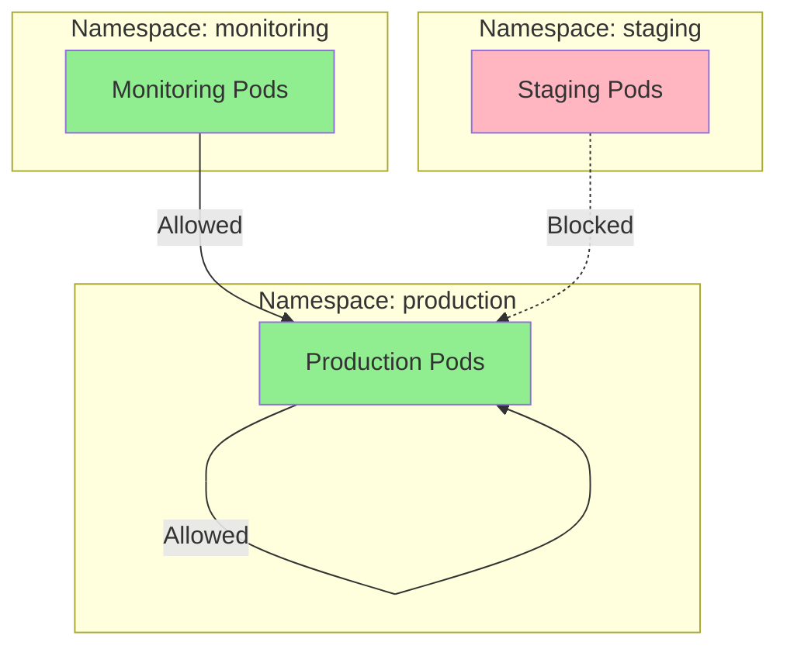
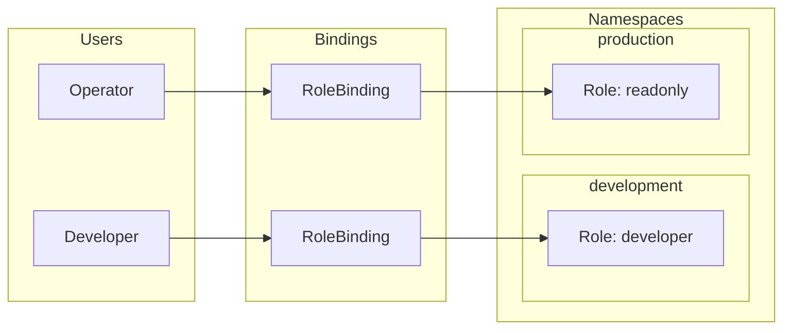
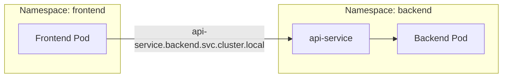
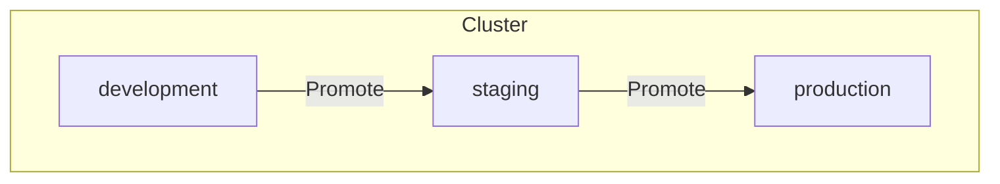
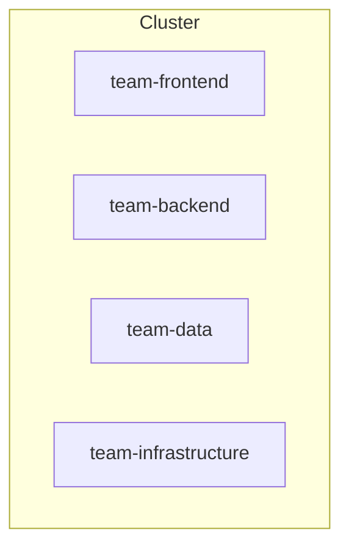
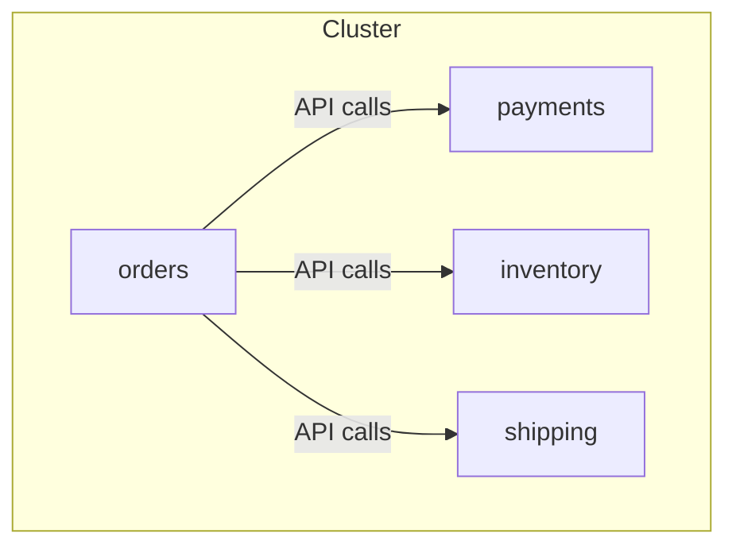

# How to Use Kubernetes Namespaces

Author: [nawazdhandala](https://www.github.com/nawazdhandala)

Tags: Kubernetes, Namespaces, Multi-tenancy, DevOps, Resource Management

Description: A practical guide to Kubernetes namespaces covering creation, resource quotas, network policies, RBAC integration, and best practices for organizing workloads in production clusters.

---

Kubernetes namespaces provide a mechanism for isolating groups of resources within a single cluster. Think of them as virtual clusters within your physical cluster. Organizations use namespaces to separate environments (dev, staging, production), teams (frontend, backend, data), or applications (payments, orders, inventory).

## Understanding Namespaces

The following diagram shows how namespaces provide logical isolation within a Kubernetes cluster. Each namespace contains its own set of resources, and cross-namespace communication requires explicit configuration.



Notice that each namespace can have resources with identical names. The api pod, api-svc service, and api-config ConfigMap exist in all three namespaces without conflict. Namespaces act as a scope for names.

## Default Namespaces in Kubernetes

Every Kubernetes cluster comes with several pre-created namespaces. Understanding their purpose helps you decide where to deploy your workloads.

```bash
# List all namespaces in your cluster
kubectl get namespaces

# Output shows the default namespaces:
# NAME              STATUS   AGE
# default           Active   45d
# kube-node-lease   Active   45d
# kube-public       Active   45d
# kube-system       Active   45d
```

- **default**: Where resources go when no namespace is specified. Avoid using it for production workloads.
- **kube-system**: Contains system components like kube-dns, kube-proxy, and metrics-server. Never deploy application workloads here.
- **kube-public**: Readable by all users (including unauthenticated). Rarely used in practice.
- **kube-node-lease**: Holds Lease objects for node heartbeats. Improves performance of node heartbeat detection.

## Creating Namespaces

### Imperative Method

Quick namespace creation works well for development and testing scenarios where you need to spin up isolated environments rapidly.

```bash
# Create a namespace with a single command
kubectl create namespace team-backend

# Verify the namespace was created
kubectl get namespace team-backend
```

### Declarative Method (Recommended)

Declarative configuration allows you to version control your namespace definitions and apply them consistently across environments. Store these YAML files in your Git repository alongside other infrastructure code.

```yaml
# namespace-production.yaml
# Creates a production namespace with labels for organization and cost tracking
apiVersion: v1
kind: Namespace
metadata:
  name: production
  labels:
    environment: production
    team: platform
    cost-center: engineering
```

Apply the namespace configuration to your cluster using kubectl.

```bash
# Apply the namespace definition from a YAML file
kubectl apply -f namespace-production.yaml
```

### Creating Multiple Namespaces

When setting up a new cluster, you often need to create several namespaces at once. A single YAML file with multiple documents keeps your namespace definitions organized and easy to review.

```yaml
# namespaces.yaml
# Environment namespaces separated by document markers
apiVersion: v1
kind: Namespace
metadata:
  name: development
  labels:
    environment: development
---
apiVersion: v1
kind: Namespace
metadata:
  name: staging
  labels:
    environment: staging
---
apiVersion: v1
kind: Namespace
metadata:
  name: production
  labels:
    environment: production
```

## Working with Namespaces

### Setting the Default Namespace

Constantly typing -n namespace gets tedious. Configure your kubectl context to use a specific namespace by default, reducing repetitive typing and preventing accidental deployments to the wrong namespace.

```bash
# Set the default namespace for your current context
kubectl config set-context --current --namespace=development

# Verify the change took effect
kubectl config view --minify | grep namespace:

# Now commands run against the development namespace by default
kubectl get pods  # Shows pods in development namespace
```

### Switching Between Namespaces

kubectx and kubens are community tools that make context and namespace switching much faster. For teams working across multiple clusters and namespaces, these tools significantly improve productivity.

```bash
# Install kubens via krew
kubectl krew install ns

# Switch namespace quickly
kubectl ns production

# Or use the kubens standalone tool
kubens staging
```

### Viewing Resources Across Namespaces

Sometimes you need visibility across your entire cluster. These commands help you understand what resources exist in all namespaces, useful for auditing and troubleshooting.

```bash
# List pods in all namespaces
kubectl get pods --all-namespaces
# Or use the shorthand flag
kubectl get pods -A

# List all deployments with their namespaces
kubectl get deployments -A

# Watch pods across all namespaces in real-time
kubectl get pods -A --watch
```

## Resource Quotas

Resource quotas prevent a single namespace from consuming all cluster resources. Without quotas, a runaway application in development could starve production workloads. Quotas enforce fair sharing of compute, memory, and storage resources.



### Defining Resource Quotas

Resource quotas define hard limits on the total resources a namespace can consume. Once a quota is reached, new pods cannot be scheduled until existing pods are deleted or reduced.

```yaml
# resource-quota.yaml
# Limits compute resources and object counts for the production namespace
apiVersion: v1
kind: ResourceQuota
metadata:
  name: production-quota
  namespace: production
spec:
  hard:
    # Compute resource limits - total across all pods in namespace
    requests.cpu: "20"           # 20 CPU cores total
    requests.memory: 40Gi        # 40Gi memory total
    limits.cpu: "40"             # Cannot exceed 40 cores
    limits.memory: 80Gi          # Cannot exceed 80Gi

    # Storage limits - PVC capacity and count
    requests.storage: 100Gi      # 100Gi total storage claims
    persistentvolumeclaims: "10" # Maximum 10 PVCs

    # Object count limits - prevent resource sprawl
    pods: "50"                   # Maximum 50 pods
    services: "20"               # Maximum 20 services
    secrets: "50"                # Maximum 50 secrets
    configmaps: "50"             # Maximum 50 configmaps
```

### Monitoring Quota Usage

Regularly check quota consumption to identify namespaces approaching their limits. Proactive monitoring prevents deployment failures due to quota exhaustion.

```bash
# View quota usage for a namespace
kubectl describe resourcequota production-quota -n production

# Output shows used vs hard limits:
# Name:                   production-quota
# Namespace:              production
# Resource                Used    Hard
# --------                ----    ----
# configmaps              12      50
# limits.cpu              8       40
# limits.memory           16Gi    80Gi
# persistentvolumeclaims  3       10
# pods                    15      50
# requests.cpu            4       20
# requests.memory         8Gi     40Gi
# requests.storage        30Gi    100Gi
# secrets                 8       50
# services                5       20
```

## Limit Ranges

While resource quotas control total namespace consumption, LimitRanges set constraints on individual containers and pods. LimitRanges can enforce minimum and maximum resource requests, and provide defaults when developers forget to specify them.

```yaml
# limit-range.yaml
# Defines per-container constraints and defaults for the development namespace
apiVersion: v1
kind: LimitRange
metadata:
  name: container-limits
  namespace: development
spec:
  limits:
    # Container-level limits
    - type: Container
      default:              # Applied when no limit is specified
        cpu: "500m"
        memory: "512Mi"
      defaultRequest:       # Applied when no request is specified
        cpu: "100m"
        memory: "128Mi"
      min:                  # Minimum allowed values
        cpu: "50m"
        memory: "64Mi"
      max:                  # Maximum allowed values
        cpu: "2"
        memory: "4Gi"

    # Pod-level limits (sum of all containers)
    - type: Pod
      max:
        cpu: "4"
        memory: "8Gi"
```

Developers often forget to specify resource requests and limits. LimitRanges ensure every container has sensible defaults, preventing unbounded resource consumption.

```bash
# Apply the limit range
kubectl apply -f limit-range.yaml

# View limit ranges in a namespace
kubectl describe limitrange container-limits -n development
```

## Network Policies for Namespace Isolation

By default, pods can communicate with any other pod in the cluster, regardless of namespace. Network policies restrict traffic flow between namespaces, implementing a zero-trust security model.



### Deny All Ingress by Default

Starting with a deny-all policy and then explicitly allowing required traffic follows security best practices. Apply this policy to every namespace that needs isolation.

```yaml
# deny-all-ingress.yaml
# Blocks all incoming traffic to pods in the production namespace
apiVersion: networking.k8s.io/v1
kind: NetworkPolicy
metadata:
  name: deny-all-ingress
  namespace: production
spec:
  # Apply to all pods in the namespace
  podSelector: {}
  policyTypes:
    - Ingress
  # No ingress rules means all ingress is denied
```

### Allow Traffic from Specific Namespaces

After denying all traffic, create policies that allow legitimate communication paths. Label-based namespace selection makes policies flexible and maintainable.

```yaml
# allow-from-monitoring.yaml
# Permits monitoring namespace to scrape metrics from production pods
apiVersion: networking.k8s.io/v1
kind: NetworkPolicy
metadata:
  name: allow-monitoring
  namespace: production
spec:
  podSelector: {}
  policyTypes:
    - Ingress
  ingress:
    - from:
        # Allow traffic from any pod in namespaces labeled monitoring=true
        - namespaceSelector:
            matchLabels:
              monitoring: "true"
      ports:
        - protocol: TCP
          port: 9090  # Prometheus metrics port
```

### Allow Same-Namespace Communication

Pods within the same namespace often need to communicate freely. Allow intra-namespace traffic while maintaining isolation from other namespaces.

```yaml
# allow-same-namespace.yaml
# Permits pods within production to communicate with each other
apiVersion: networking.k8s.io/v1
kind: NetworkPolicy
metadata:
  name: allow-same-namespace
  namespace: production
spec:
  podSelector: {}
  policyTypes:
    - Ingress
  ingress:
    - from:
        # Match pods in the same namespace (production)
        - podSelector: {}
```

## RBAC and Namespaces

Role-Based Access Control works hand-in-hand with namespaces to provide fine-grained access control. Roles are namespace-scoped, allowing different permissions per namespace.



### Namespace-Scoped Roles

Roles define permissions within a single namespace. Different teams can have different access levels to different namespaces based on their responsibilities.

```yaml
# developer-role.yaml
# Grants full access to workload resources in development namespace
apiVersion: rbac.authorization.k8s.io/v1
kind: Role
metadata:
  name: developer
  namespace: development
rules:
  # Full access to common workload resources
  - apiGroups: ["", "apps", "batch"]
    resources: ["pods", "deployments", "services", "configmaps", "secrets", "jobs"]
    verbs: ["get", "list", "watch", "create", "update", "patch", "delete"]
  # Debugging access
  - apiGroups: [""]
    resources: ["pods/log", "pods/exec", "pods/portforward"]
    verbs: ["get", "create"]
---
# Bind the role to a group of developers
apiVersion: rbac.authorization.k8s.io/v1
kind: RoleBinding
metadata:
  name: developer-binding
  namespace: development
subjects:
  - kind: Group
    name: developers@example.com
    apiGroup: rbac.authorization.k8s.io
roleRef:
  kind: Role
  name: developer
  apiGroup: rbac.authorization.k8s.io
```

### Read-Only Production Access

Production environments typically need stricter access controls. Give developers read-only access to production for troubleshooting while preventing accidental modifications.

```yaml
# production-readonly.yaml
# Grants read-only access to production namespace
apiVersion: rbac.authorization.k8s.io/v1
kind: Role
metadata:
  name: readonly
  namespace: production
rules:
  # Read-only access to workloads
  - apiGroups: ["", "apps", "batch"]
    resources: ["pods", "deployments", "services", "configmaps", "jobs", "events"]
    verbs: ["get", "list", "watch"]
  # View logs for debugging
  - apiGroups: [""]
    resources: ["pods/log"]
    verbs: ["get"]
  # Explicitly no access to secrets
---
apiVersion: rbac.authorization.k8s.io/v1
kind: RoleBinding
metadata:
  name: readonly-binding
  namespace: production
subjects:
  - kind: Group
    name: developers@example.com
    apiGroup: rbac.authorization.k8s.io
roleRef:
  kind: Role
  name: readonly
  apiGroup: rbac.authorization.k8s.io
```

## Service Discovery Across Namespaces

Services in one namespace can access services in another using fully qualified domain names. The DNS format follows a predictable pattern that includes the namespace name.



### Cross-Namespace Service Communication

Within the same namespace, services are accessible by their short name. Across namespaces, use the full DNS name that includes the target namespace.

```yaml
# frontend-deployment.yaml
# Frontend pod configured to call backend API in another namespace
apiVersion: apps/v1
kind: Deployment
metadata:
  name: frontend
  namespace: frontend
spec:
  replicas: 3
  selector:
    matchLabels:
      app: frontend
  template:
    metadata:
      labels:
        app: frontend
    spec:
      containers:
        - name: frontend
          image: myapp/frontend:latest
          env:
            # Full DNS name: <service>.<namespace>.svc.cluster.local
            - name: API_URL
              value: "http://api-service.backend.svc.cluster.local:8080"
            # Same namespace services can use short names
            - name: CACHE_URL
              value: "http://redis-cache:6379"
```

### ExternalName Services for Simpler Cross-Namespace References

ExternalName services create an alias for services in other namespaces. Applications can use a simple service name while the DNS resolution handles the cross-namespace lookup.

```yaml
# external-name-service.yaml
# Creates a local alias for a service in another namespace
apiVersion: v1
kind: Service
metadata:
  name: backend-api
  namespace: frontend
spec:
  type: ExternalName
  # Points to the actual service in the backend namespace
  externalName: api-service.backend.svc.cluster.local
```

Applications in the frontend namespace can now reach the backend API using just backend-api instead of the full DNS name.

## Namespace Lifecycle Management

### Deleting Namespaces

Deleting a namespace removes all resources within it. Use caution, especially with production namespaces. Consider adding protection mechanisms like finalizers or admission controllers.

```bash
# Delete a namespace and ALL its resources
kubectl delete namespace staging

# The deletion is immediate and irreversible
# All pods, services, secrets, configmaps, etc. are deleted

# Check if namespace is stuck in Terminating state
kubectl get namespace staging -o yaml
```

### Preventing Accidental Deletion

Labels and annotations help identify critical namespaces. While Kubernetes does not natively prevent namespace deletion, admission controllers like OPA Gatekeeper can enforce policies based on labels.

```yaml
# protected-namespace.yaml
# Namespace with protection labels for policy enforcement
apiVersion: v1
kind: Namespace
metadata:
  name: production
  labels:
    environment: production
    protected: "true"  # Use with admission controller policies
  annotations:
    description: "Production workloads - do not delete"
    owner: "platform-team@example.com"
```

## Namespace Organization Patterns

### By Environment

Separating environments into namespaces is the most common pattern. Each environment has its own resource quotas, network policies, and RBAC rules.



### By Team

Large organizations often assign namespaces to teams. Each team manages their namespace independently while sharing cluster infrastructure.



### By Application

Microservices architectures benefit from application-based namespaces. Each application or bounded context gets its own namespace with appropriate isolation.



## Best Practices

### Naming Conventions

Consistent naming makes cluster administration easier. Establish conventions early and document them for your team.

```bash
# Environment-based naming
development
staging
production

# Team-based naming
team-frontend
team-backend
team-data-engineering

# Application-based naming
payments-service
order-management
inventory-system

# Combined approach
prod-team-backend
staging-payments
```

### Always Specify Namespaces

Relying on the default namespace leads to confusion and potential security issues. Always specify namespaces explicitly in your YAML manifests.

```yaml
# Good practice - explicit namespace in every resource
apiVersion: apps/v1
kind: Deployment
metadata:
  name: api
  namespace: production  # Always specify namespace
spec:
  # ...
```

### Label Namespaces Consistently

Labels enable filtering, network policies, and cost allocation. Standardize on a label schema across all namespaces.

```yaml
apiVersion: v1
kind: Namespace
metadata:
  name: production
  labels:
    # Environment classification
    environment: production
    # Team ownership
    team: platform
    # Cost tracking
    cost-center: engineering
    # Security classification
    data-classification: sensitive
```

### Set Resource Quotas on All Namespaces

Quotas prevent resource contention and unexpected costs. Even development namespaces should have quotas to teach developers to write resource-efficient applications.

```bash
# Check which namespaces lack resource quotas
kubectl get namespaces -o name | while read ns; do
  quota=$(kubectl get resourcequota -n "${ns#namespace/}" 2>/dev/null)
  if [ -z "$quota" ]; then
    echo "No quota: ${ns#namespace/}"
  fi
done
```

## Troubleshooting

### Namespace Stuck in Terminating State

Sometimes namespaces get stuck during deletion due to finalizers or unresponsive controllers. Diagnose and fix these issues carefully.

```bash
# Check why namespace is stuck
kubectl get namespace staging -o yaml

# Look for finalizers that might be blocking deletion
# Output may show something like:
# finalizers:
# - kubernetes

# Check for resources that might be stuck
kubectl api-resources --verbs=list --namespaced -o name | xargs -n 1 kubectl get -n staging --ignore-not-found

# If truly stuck and you understand the implications, remove finalizers
# WARNING: Only do this if you know why the namespace is stuck
kubectl patch namespace staging -p '{"metadata":{"finalizers":null}}' --type=merge
```

### Resource Quota Exceeded

When deployments fail due to quota exhaustion, identify the culprit and either clean up or request quota increases.

```bash
# Check current quota usage
kubectl describe resourcequota -n production

# Find pods consuming the most resources
kubectl top pods -n production --sort-by=memory

# Check for orphaned resources consuming quota
kubectl get pods -n production --field-selector=status.phase=Succeeded
kubectl get pods -n production --field-selector=status.phase=Failed
```

### Network Policy Blocking Traffic

Troubleshoot network policy issues by verifying what policies apply and testing connectivity.

```bash
# List all network policies in a namespace
kubectl get networkpolicies -n production

# Describe a specific policy to see its rules
kubectl describe networkpolicy allow-monitoring -n production

# Test connectivity from a debug pod
kubectl run debug --rm -it --image=busybox -n staging -- wget -qO- http://api.production.svc.cluster.local
```

---

Namespaces are fundamental to organizing workloads in Kubernetes. Start with environment-based namespaces, add resource quotas to prevent runaway consumption, implement network policies for security, and use RBAC to control who can do what where. A well-organized namespace strategy makes your cluster easier to manage, more secure, and ready for growth.
