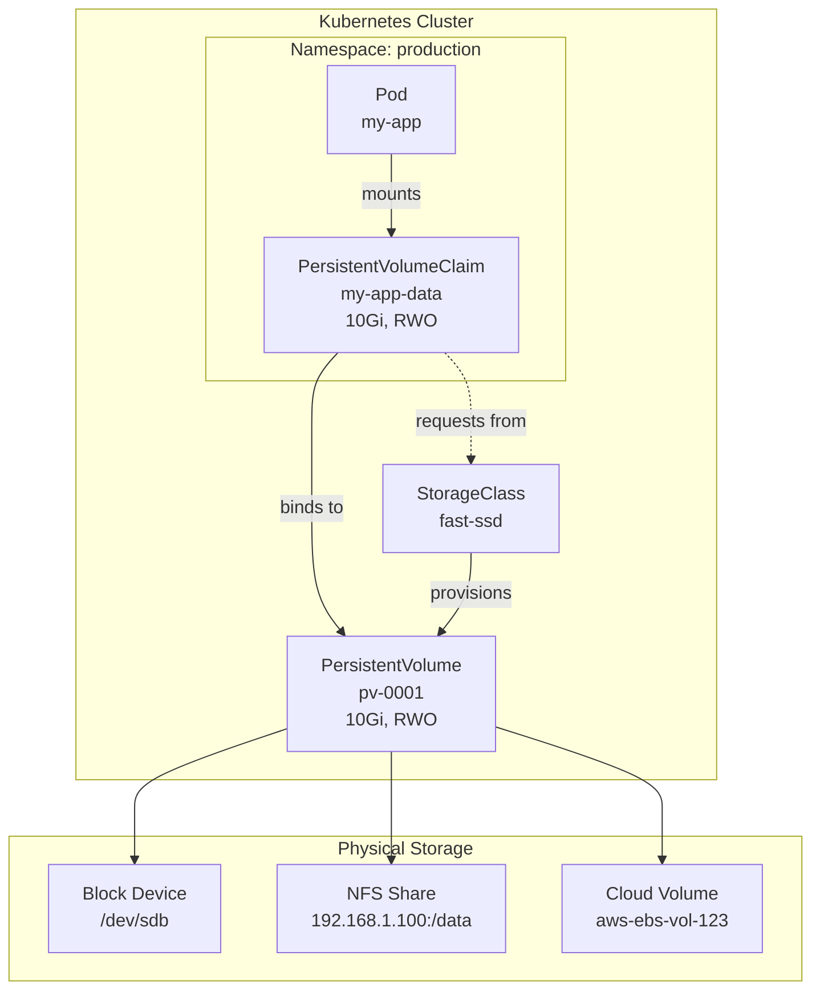
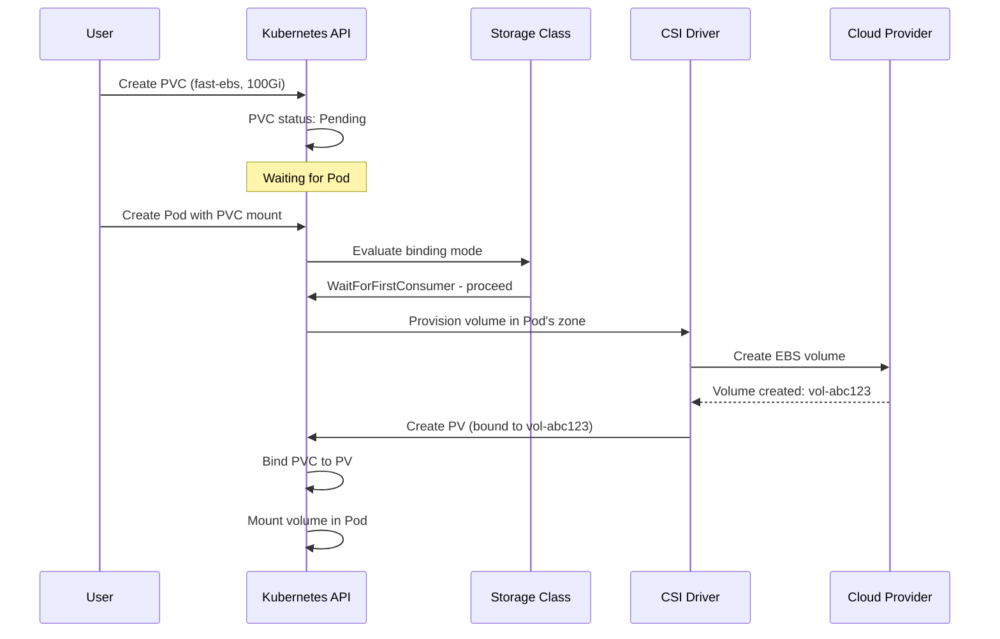
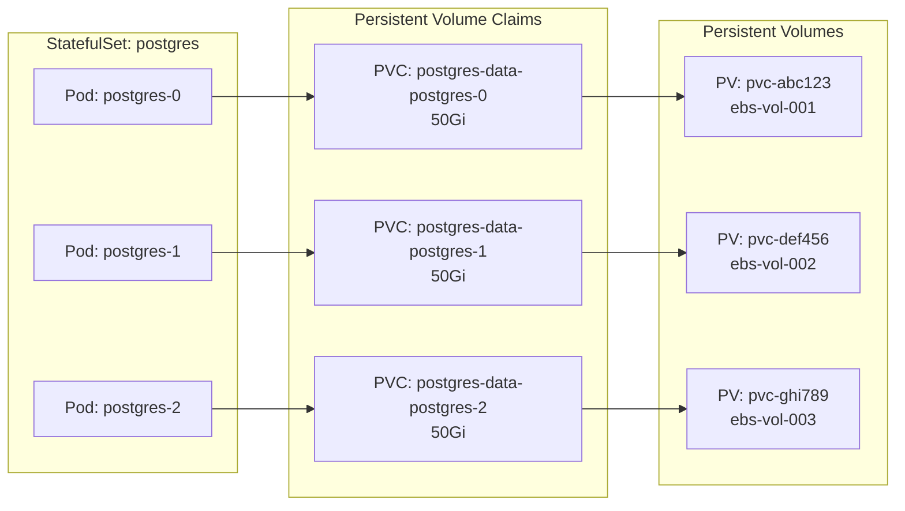
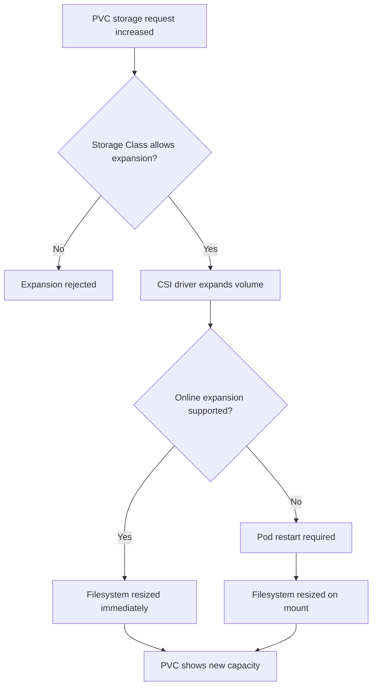

# How to Use Kubernetes Persistent Volumes

Author: [nawazdhandala](https://www.github.com/nawazdhandala)

Tags: Kubernetes, Persistent Volumes, Storage, PVC

Description: A comprehensive guide to using Kubernetes Persistent Volumes for stateful workloads. Learn how to create PVs and PVCs, configure storage classes, implement dynamic provisioning, and apply best practices for production deployments.

---

Containers are ephemeral by design. When a Pod restarts, its filesystem resets to the original container image state. This works perfectly for stateless applications, but databases, message queues, and file storage systems need data to survive Pod restarts, node failures, and even cluster migrations. Kubernetes Persistent Volumes solve this problem by providing an abstraction layer that decouples storage provisioning from Pod lifecycles.

This guide covers everything you need to know about using Persistent Volumes effectively: from basic concepts to advanced patterns used in production environments.

## Understanding the Persistent Volume Architecture

Kubernetes storage relies on three primary components working together:

- **Persistent Volume (PV):** A cluster-level resource representing actual storage, whether a local disk, network-attached storage, or cloud block device.
- **Persistent Volume Claim (PVC):** A namespace-scoped request for storage that binds to a matching PV.
- **Storage Class:** A template that defines how to dynamically provision new PVs when a PVC requests storage.

The following diagram illustrates how these components interact:



## Static Provisioning: Manual PV Creation

Static provisioning requires administrators to pre-create Persistent Volumes before applications can use them. This approach works well for existing storage infrastructure or when you need fine-grained control over volume placement.

### Creating a Persistent Volume

The following manifest defines a PV backed by an NFS share. The capacity, access modes, and reclaim policy determine how Kubernetes manages this storage.

```yaml
# pv-nfs-data.yaml
# Defines a 50Gi Persistent Volume backed by an NFS server.
# This PV can be mounted by multiple Pods simultaneously (ReadWriteMany).
# The 'Retain' reclaim policy keeps data safe when the PVC is deleted.
apiVersion: v1
kind: PersistentVolume
metadata:
  name: nfs-data-pv
  labels:
    type: nfs
    environment: production
spec:
  # Total storage capacity available from this volume
  capacity:
    storage: 50Gi

  # Access modes define how Pods can mount this volume:
  # - ReadWriteOnce (RWO): Single node read-write
  # - ReadOnlyMany (ROX): Multiple nodes read-only
  # - ReadWriteMany (RWX): Multiple nodes read-write
  accessModes:
    - ReadWriteMany

  # What happens when the bound PVC is deleted:
  # - Retain: Keep the PV and data for manual cleanup
  # - Delete: Remove the PV and underlying storage
  # - Recycle: Clear data and make PV available again (deprecated)
  persistentVolumeReclaimPolicy: Retain

  # StorageClass name for matching with PVCs
  # Empty string means this PV won't match PVCs requesting a specific class
  storageClassName: ""

  # Mount options passed to the underlying storage system
  mountOptions:
    - hard
    - nfsvers=4.1

  # NFS-specific configuration
  nfs:
    server: 192.168.1.100
    path: /exports/app-data
```

Apply the manifest and verify the PV is available:

```bash
# Create the Persistent Volume from the manifest
kubectl apply -f pv-nfs-data.yaml

# List all Persistent Volumes and their status
# STATUS should show 'Available' for unbound PVs
kubectl get pv

# Get detailed information about a specific PV
kubectl describe pv nfs-data-pv
```

### Creating a Persistent Volume Claim

Applications request storage through PVCs. The following claim requests 20Gi from any available PV that matches the specified criteria.

```yaml
# pvc-app-data.yaml
# Requests 20Gi of ReadWriteMany storage for the application.
# Kubernetes will bind this claim to a matching PV automatically.
apiVersion: v1
kind: PersistentVolumeClaim
metadata:
  name: app-data-pvc
  namespace: production
spec:
  # Access mode must match (or be a subset of) the PV's access modes
  accessModes:
    - ReadWriteMany

  # Storage request - PV must have at least this much capacity
  resources:
    requests:
      storage: 20Gi

  # Empty string to match PVs without a storage class
  # Or specify a class name for dynamic provisioning
  storageClassName: ""

  # Optional: Select specific PVs using label selectors
  selector:
    matchLabels:
      type: nfs
      environment: production
```

Apply the PVC and check the binding status:

```bash
# Create the PVC in the production namespace
kubectl apply -f pvc-app-data.yaml

# Check if the PVC bound to a PV successfully
# STATUS should change from 'Pending' to 'Bound'
kubectl get pvc -n production

# View binding details including the assigned PV name
kubectl describe pvc app-data-pvc -n production
```

## Dynamic Provisioning: Automatic Volume Creation

Dynamic provisioning eliminates the need to pre-create PVs. When a PVC references a Storage Class, Kubernetes automatically provisions a new volume from the underlying storage system.

### Configuring a Storage Class

Storage Classes define provisioner-specific parameters. The following example configures AWS EBS with gp3 volumes and encryption enabled.

```yaml
# storageclass-ebs-gp3.yaml
# Defines a Storage Class for AWS EBS gp3 volumes with encryption.
# PVCs requesting this class will automatically provision new EBS volumes.
apiVersion: storage.k8s.io/v1
kind: StorageClass
metadata:
  name: fast-ebs
  annotations:
    # Set as the default class for PVCs without explicit storageClassName
    storageclass.kubernetes.io/is-default-class: "true"

# CSI driver name for AWS EBS
# Other common provisioners:
# - kubernetes.io/gce-pd (GCP)
# - kubernetes.io/azure-disk (Azure)
# - csi.longhorn.io (Longhorn)
provisioner: ebs.csi.aws.com

# Provisioner-specific parameters
parameters:
  # EBS volume type: gp2, gp3, io1, io2, st1, sc1
  type: gp3

  # Encrypt volumes using the default AWS KMS key
  encrypted: "true"

  # File system type for the volume
  fsType: ext4

# Volume expansion allows resizing PVCs after creation
allowVolumeExpansion: true

# WaitForFirstConsumer delays provisioning until a Pod mounts the PVC
# This ensures the volume is created in the same zone as the Pod
volumeBindingMode: WaitForFirstConsumer

# Reclaim policy for dynamically provisioned PVs
reclaimPolicy: Delete

# Mount options applied to all volumes from this class
mountOptions:
  - discard
```

### Using Dynamic Provisioning

With a Storage Class configured, PVCs can request storage without administrators manually creating PVs.

```yaml
# pvc-database.yaml
# Requests 100Gi of fast-ebs storage for a PostgreSQL database.
# The volume will be provisioned automatically when a Pod mounts this PVC.
apiVersion: v1
kind: PersistentVolumeClaim
metadata:
  name: postgres-data
  namespace: databases
spec:
  accessModes:
    - ReadWriteOnce
  resources:
    requests:
      storage: 100Gi
  # Reference the Storage Class by name
  storageClassName: fast-ebs
```

The provisioning lifecycle with `WaitForFirstConsumer` works as follows:



## Mounting Volumes in Pods

Once a PVC is bound, Pods can mount the storage using volume definitions.

### Basic Volume Mount

The following Deployment mounts a persistent volume at `/data` inside the container.

```yaml
# deployment-app.yaml
# Deploys an application with persistent storage mounted at /data.
# Data persists across Pod restarts and rescheduling events.
apiVersion: apps/v1
kind: Deployment
metadata:
  name: file-processor
  namespace: production
spec:
  replicas: 1
  selector:
    matchLabels:
      app: file-processor
  template:
    metadata:
      labels:
        app: file-processor
    spec:
      containers:
        - name: processor
          image: myregistry/file-processor:v2.1.0

          # Mount the persistent volume inside the container
          volumeMounts:
            - name: data-volume
              mountPath: /data
              # Optional: Mount as read-only
              # readOnly: true

          # Resource limits for predictable performance
          resources:
            requests:
              memory: "256Mi"
              cpu: "250m"
            limits:
              memory: "512Mi"
              cpu: "500m"

      # Define volumes available to containers in this Pod
      volumes:
        - name: data-volume
          persistentVolumeClaim:
            claimName: app-data-pvc
```

### Mounting Subpaths

When multiple applications need separate directories within the same PVC, use `subPath` to isolate their data.

```yaml
# deployment-multi-app.yaml
# Two containers share one PVC but write to different subdirectories.
# This reduces the number of volumes while maintaining data isolation.
apiVersion: apps/v1
kind: Deployment
metadata:
  name: data-services
  namespace: production
spec:
  replicas: 1
  selector:
    matchLabels:
      app: data-services
  template:
    metadata:
      labels:
        app: data-services
    spec:
      containers:
        # First container writes to /data backed by shared-pvc/uploads
        - name: upload-handler
          image: myregistry/upload-handler:v1.0.0
          volumeMounts:
            - name: shared-storage
              mountPath: /data
              # Only mount the 'uploads' subdirectory
              subPath: uploads

        # Second container writes to /cache backed by shared-pvc/cache
        - name: cache-manager
          image: myregistry/cache-manager:v1.0.0
          volumeMounts:
            - name: shared-storage
              mountPath: /cache
              subPath: cache

      volumes:
        - name: shared-storage
          persistentVolumeClaim:
            claimName: shared-pvc
```

## StatefulSets and Volume Claim Templates

StatefulSets provide stable network identities and persistent storage for each replica. Volume claim templates automatically create PVCs for each Pod.

```yaml
# statefulset-postgres.yaml
# Deploys a PostgreSQL cluster with dedicated storage for each replica.
# Each Pod gets its own PVC named postgres-data-postgres-{0,1,2}.
apiVersion: apps/v1
kind: StatefulSet
metadata:
  name: postgres
  namespace: databases
spec:
  serviceName: postgres
  replicas: 3
  selector:
    matchLabels:
      app: postgres

  template:
    metadata:
      labels:
        app: postgres
    spec:
      containers:
        - name: postgres
          image: postgres:15
          ports:
            - containerPort: 5432
              name: postgres

          # Mount the per-replica persistent volume
          volumeMounts:
            - name: postgres-data
              mountPath: /var/lib/postgresql/data

          # PostgreSQL configuration via environment variables
          env:
            - name: POSTGRES_DB
              value: myapp
            - name: PGDATA
              value: /var/lib/postgresql/data/pgdata

          envFrom:
            - secretRef:
                name: postgres-credentials

  # Volume claim template creates a PVC for each replica
  # Pod postgres-0 gets PVC postgres-data-postgres-0
  # Pod postgres-1 gets PVC postgres-data-postgres-1, etc.
  volumeClaimTemplates:
    - metadata:
        name: postgres-data
      spec:
        accessModes:
          - ReadWriteOnce
        storageClassName: fast-ebs
        resources:
          requests:
            storage: 50Gi
```

The relationship between StatefulSet Pods and their PVCs follows a predictable pattern:



## Access Modes Explained

Access modes define how many nodes can mount a volume and whether they can write to it.

| Mode | Short | Description | Use Case |
|------|-------|-------------|----------|
| ReadWriteOnce | RWO | Single node read-write | Databases, single-instance apps |
| ReadOnlyMany | ROX | Multiple nodes read-only | Shared configuration, static assets |
| ReadWriteMany | RWX | Multiple nodes read-write | Shared file storage, CMS uploads |
| ReadWriteOncePod | RWOP | Single Pod read-write | Strict single-writer guarantees |

Not all storage backends support all access modes. Check your CSI driver documentation:

```bash
# List storage classes and their provisioners
kubectl get storageclass

# Check CSI driver capabilities
kubectl get csidrivers -o wide
```

## Expanding Persistent Volumes

Modern storage classes support online volume expansion. First, ensure your Storage Class allows expansion:

```yaml
# Verify allowVolumeExpansion is true in your Storage Class
apiVersion: storage.k8s.io/v1
kind: StorageClass
metadata:
  name: expandable-storage
provisioner: ebs.csi.aws.com
allowVolumeExpansion: true  # Required for PVC resizing
parameters:
  type: gp3
```

To expand a PVC, edit its storage request:

```bash
# Patch the PVC to request more storage
# This triggers the CSI driver to expand the underlying volume
kubectl patch pvc postgres-data -n databases -p \
  '{"spec":{"resources":{"requests":{"storage":"100Gi"}}}}'

# Monitor the expansion progress
# Look for the 'FileSystemResizePending' condition
kubectl describe pvc postgres-data -n databases
```

The expansion process varies by storage type:



## Snapshot and Restore

Volume snapshots provide point-in-time copies for backup and cloning. First, verify your cluster supports snapshots:

```bash
# Check if VolumeSnapshot CRDs are installed
kubectl get crd | grep volumesnapshot

# List available snapshot classes
kubectl get volumesnapshotclass
```

### Creating a Snapshot

```yaml
# snapshot-postgres.yaml
# Creates a point-in-time snapshot of the PostgreSQL data volume.
# Use this for backups or creating test environments from production data.
apiVersion: snapshot.storage.k8s.io/v1
kind: VolumeSnapshot
metadata:
  name: postgres-snapshot-20260202
  namespace: databases
spec:
  # Reference the snapshot class provided by your CSI driver
  volumeSnapshotClassName: csi-aws-vsc

  # Source PVC to snapshot
  source:
    persistentVolumeClaimName: postgres-data-postgres-0
```

### Restoring from a Snapshot

Create a new PVC from the snapshot:

```yaml
# pvc-restored.yaml
# Creates a new PVC pre-populated with data from a snapshot.
# Useful for creating test environments or recovering from data corruption.
apiVersion: v1
kind: PersistentVolumeClaim
metadata:
  name: postgres-restored
  namespace: databases
spec:
  accessModes:
    - ReadWriteOnce
  storageClassName: fast-ebs
  resources:
    requests:
      # Must be at least as large as the original volume
      storage: 50Gi

  # Restore from the snapshot instead of creating empty storage
  dataSource:
    name: postgres-snapshot-20260202
    kind: VolumeSnapshot
    apiGroup: snapshot.storage.k8s.io
```

## Best Practices for Production

### 1. Always Set Resource Requests

Storage I/O can impact Pod scheduling. Set appropriate requests to ensure Pods land on nodes with sufficient storage bandwidth.

```yaml
# Include storage-related annotations for scheduling hints
metadata:
  annotations:
    # Some schedulers use these hints for placement
    volume.kubernetes.io/storage-provisioner: ebs.csi.aws.com
```

### 2. Implement Reclaim Policy Carefully

For production data, always use the `Retain` reclaim policy. This prevents accidental data loss when PVCs are deleted.

```yaml
# Change an existing PV's reclaim policy
kubectl patch pv pv-name -p '{"spec":{"persistentVolumeReclaimPolicy":"Retain"}}'
```

### 3. Use Pod Disruption Budgets

Protect stateful workloads during cluster maintenance:

```yaml
# pdb-postgres.yaml
# Ensures at least 2 PostgreSQL replicas remain available during disruptions.
apiVersion: policy/v1
kind: PodDisruptionBudget
metadata:
  name: postgres-pdb
  namespace: databases
spec:
  minAvailable: 2
  selector:
    matchLabels:
      app: postgres
```

### 4. Monitor Volume Usage

Set up alerts before volumes fill up. Export metrics to your observability platform:

```bash
# Check current PVC usage via kubectl
kubectl exec -n databases postgres-0 -- df -h /var/lib/postgresql/data

# For automated monitoring, use kubelet metrics:
# kubelet_volume_stats_used_bytes
# kubelet_volume_stats_capacity_bytes
```

### 5. Label and Annotate Resources

Maintain visibility into storage ownership:

```yaml
metadata:
  labels:
    app: postgres
    team: platform
    cost-center: infrastructure
  annotations:
    description: "Primary PostgreSQL database for user service"
    backup-schedule: "daily-2am"
```

### 6. Test Failure Scenarios

Regularly verify your storage survives disruptions:

```bash
# Simulate Pod failure - PVC should reattach
kubectl delete pod postgres-0 -n databases

# Simulate node failure (drain the node)
kubectl drain node-1 --ignore-daemonsets --delete-emptydir-data

# Verify data integrity after failover
kubectl exec -n databases postgres-0 -- psql -U postgres -c "SELECT count(*) FROM users;"
```

## Troubleshooting Common Issues

### PVC Stuck in Pending State

```bash
# Check PVC events for binding failures
kubectl describe pvc my-pvc -n my-namespace

# Common causes:
# - No PV matches the request (static provisioning)
# - Storage Class provisioner is not running
# - Insufficient storage quota
# - Zone mismatch with WaitForFirstConsumer

# List available PVs and their status
kubectl get pv --show-labels

# Check if the CSI driver pods are running
kubectl get pods -n kube-system | grep csi
```

### Volume Mount Failures

```bash
# Check Pod events for mount errors
kubectl describe pod my-pod -n my-namespace

# Common causes:
# - Node cannot reach storage backend (network/firewall)
# - Filesystem corruption requiring fsck
# - Stale NFS handles after storage server restart

# View kubelet logs for mount details
journalctl -u kubelet | grep -i mount
```

### Volume Full

```bash
# Check filesystem usage inside the Pod
kubectl exec -n databases postgres-0 -- df -h

# For immediate relief, identify large files
kubectl exec -n databases postgres-0 -- du -sh /var/lib/postgresql/data/*

# Expand the PVC if the Storage Class allows it
kubectl patch pvc postgres-data-postgres-0 -n databases -p \
  '{"spec":{"resources":{"requests":{"storage":"200Gi"}}}}'
```

## Summary

Kubernetes Persistent Volumes provide the foundation for running stateful applications reliably. The key concepts to remember:

- **PVs** represent actual storage resources at the cluster level
- **PVCs** are namespace-scoped requests that bind to matching PVs
- **Storage Classes** enable dynamic provisioning and define storage characteristics
- **StatefulSets** provide per-replica storage with predictable naming

For production deployments:

1. Use dynamic provisioning with appropriate Storage Classes
2. Set `persistentVolumeReclaimPolicy: Retain` for critical data
3. Implement regular snapshot backups
4. Monitor volume capacity and set alerts at 80% usage
5. Test failover scenarios before you need them

Storage failures are inevitable. The difference between a minor incident and a major outage depends on how well you understand your persistent volume configuration and how thoroughly you have tested recovery procedures.
