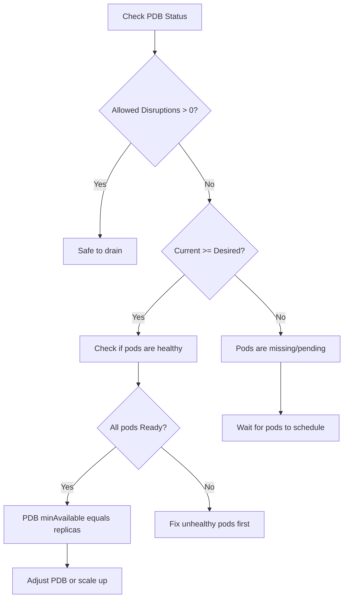
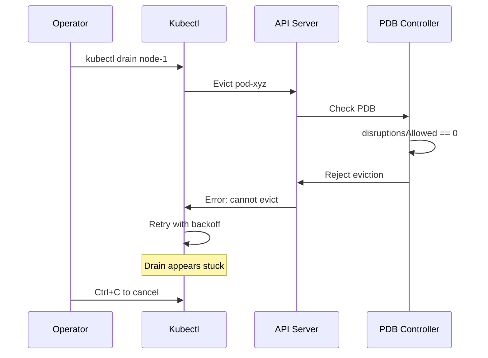
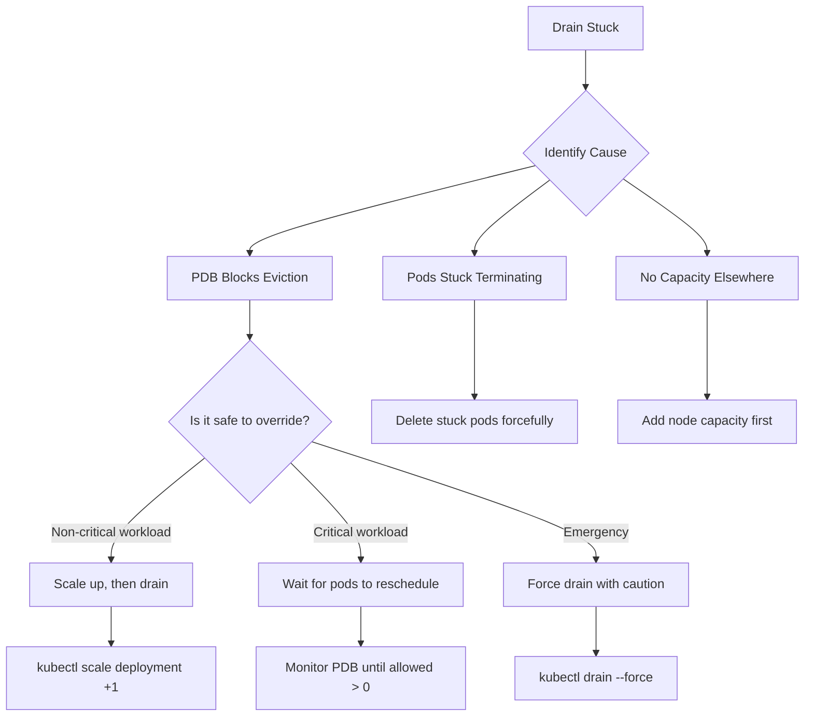
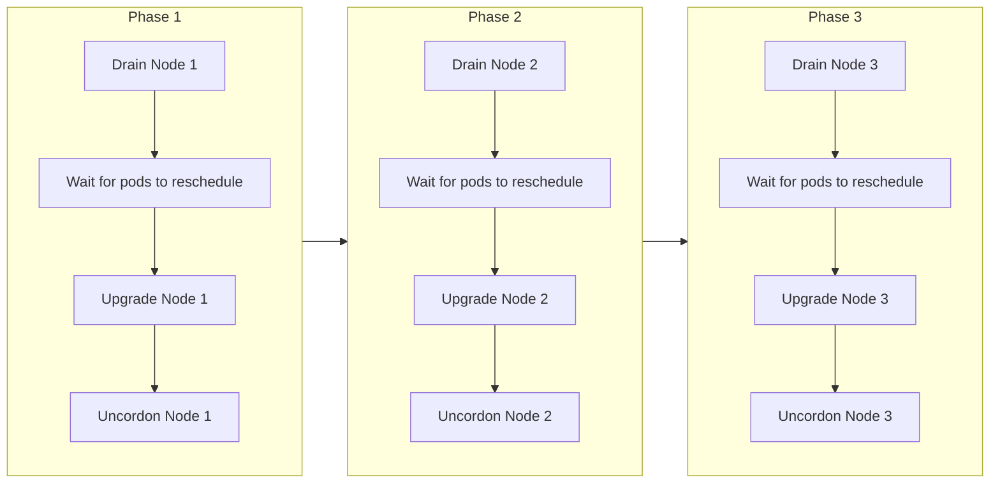
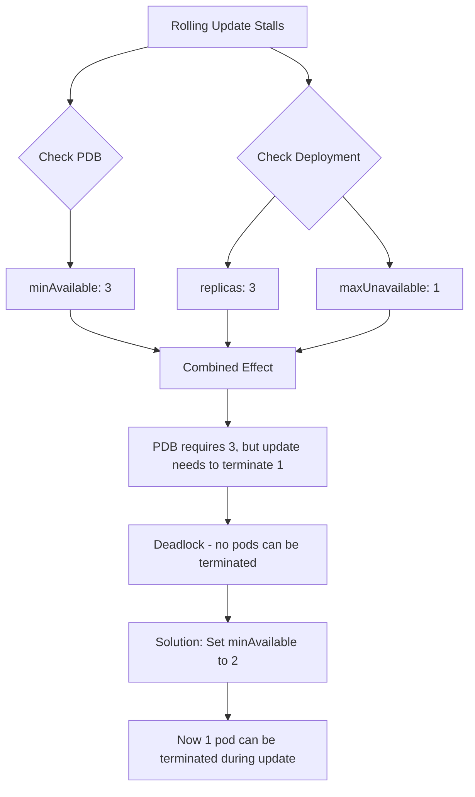

# How to Handle Kubernetes Pod Disruption Budgets

Author: [nawazdhandala](https://www.github.com/nawazdhandala)

Tags: Kubernetes, Pod Disruption Budget, Operations, Troubleshooting, Cluster Maintenance

Description: A hands-on guide to handling Pod Disruption Budgets in Kubernetes, covering inspection, validation, troubleshooting stuck drains, operational workflows, and day-to-day PDB management.

---

Managing Pod Disruption Budgets (PDBs) goes beyond just creating YAML files. Real-world Kubernetes operations require you to inspect PDB states, validate configurations, troubleshoot blocked evictions, and coordinate maintenance windows. Operations teams need practical skills for handling PDBs when things go wrong during cluster maintenance.

## Inspecting PDB Status

### Viewing All PDBs in Your Cluster

The first command to run during any maintenance window gives you an overview of all PDBs and their current state.

```bash
# List all PDBs across namespaces with detailed status
kubectl get pdb -A -o wide
```

Output shows the key metrics you need:

```
NAMESPACE    NAME           MIN AVAILABLE   MAX UNAVAILABLE   ALLOWED DISRUPTIONS   AGE
production   api-pdb        2               N/A               3                     15d
production   web-pdb        N/A             1                 1                     15d
production   postgres-pdb   2               N/A               0                     15d
staging      api-pdb        1               N/A               2                     10d
```

The `ALLOWED DISRUPTIONS` column tells you how many pods can be evicted right now. A value of `0` means no disruptions are allowed and node drains will block.

### Deep Inspection of a Single PDB

When you need more details about a specific PDB, use describe to see the full picture.

```bash
# Get detailed information about a specific PDB
kubectl describe pdb postgres-pdb -n production
```

Key fields to examine in the output:

```yaml
Name:           postgres-pdb
Namespace:      production
Min available:  2
Selector:       app=postgres
Status:
    Allowed disruptions:  0
    Current:              2
    Desired:              3
    Expected:             3
Conditions:
  Type                   Status  Reason
  ----                   ------  ------
  DisruptionAllowed      False   InsufficientPods
```

The `DisruptionAllowed` condition reveals why evictions might be blocked. In the example above, the cluster has only 2 healthy pods but needs 2 minimum, leaving no room for disruption.

### Checking PDB Health Metrics



Use JSON output to extract specific metrics for scripting:

```bash
# Extract allowed disruptions count
kubectl get pdb web-pdb -n production -o jsonpath='{.status.disruptionsAllowed}'

# Get current healthy pod count
kubectl get pdb web-pdb -n production -o jsonpath='{.status.currentHealthy}'

# Check if disruptions are blocked across all PDBs
kubectl get pdb -A -o json | jq '.items[] | select(.status.disruptionsAllowed == 0) | "\(.metadata.namespace)/\(.metadata.name)"'
```

## Validating PDB Configurations

### Checking Selector Matches

A common problem occurs when PDB selectors do not match any pods. Always verify your selectors.

```bash
# First, see what selector the PDB uses
kubectl get pdb api-pdb -n production -o jsonpath='{.spec.selector.matchLabels}'

# Then verify pods exist with those labels
kubectl get pods -n production -l app=api

# Compare pod count with PDB expectations
kubectl get pdb api-pdb -n production -o jsonpath='Current: {.status.currentHealthy}, Expected: {.status.expectedPods}'
```

### Validation Script for PDB Health

The following script checks all PDBs for common configuration issues before maintenance windows.

```bash
#!/bin/bash
# pdb-validation.sh - Validate PDB configurations before maintenance

echo "=== PDB Validation Report ==="
echo ""

# Check for PDBs with zero allowed disruptions
echo "PDBs Blocking Disruptions:"
kubectl get pdb -A -o json | jq -r '
  .items[] |
  select(.status.disruptionsAllowed == 0) |
  "  \(.metadata.namespace)/\(.metadata.name) - Current: \(.status.currentHealthy), Min: \(.spec.minAvailable // "N/A")"
'
echo ""

# Check for PDBs where current < desired (unhealthy state)
echo "PDBs with Unhealthy Pods:"
kubectl get pdb -A -o json | jq -r '
  .items[] |
  select(.status.currentHealthy < .status.desiredHealthy) |
  "  \(.metadata.namespace)/\(.metadata.name) - Current: \(.status.currentHealthy), Desired: \(.status.desiredHealthy)"
'
echo ""

# Check for overly restrictive PDBs (minAvailable equals expected)
echo "Potentially Overly Restrictive PDBs:"
kubectl get pdb -A -o json | jq -r '
  .items[] |
  select(.spec.minAvailable != null) |
  select(.status.expectedPods == .spec.minAvailable) |
  "  \(.metadata.namespace)/\(.metadata.name) - minAvailable equals replica count"
'
echo ""

echo "=== Validation Complete ==="
```

### Testing PDB Behavior with Dry Run

Before actual maintenance, verify how drains will behave without making changes.

```bash
# Dry run to see what would happen
kubectl drain node-worker-1 --ignore-daemonsets --dry-run=client

# Check which pods on a node are protected by PDBs
kubectl get pods -o wide --field-selector spec.nodeName=node-worker-1 | while read line; do
  pod=$(echo $line | awk '{print $1}')
  ns=$(echo $line | awk '{print $2}')
  if [ "$pod" != "NAME" ]; then
    labels=$(kubectl get pod $pod -n $ns -o jsonpath='{.metadata.labels}' 2>/dev/null)
    echo "Pod: $pod, Labels: $labels"
  fi
done
```

## Handling Stuck Node Drains

### Understanding Why Drains Block

When a drain operation hangs, PDBs are often the cause. Here is the diagnostic workflow.



### Diagnosing Blocked Evictions

Run these commands to identify the blocking PDB:

```bash
# See which PDBs have zero allowed disruptions
kubectl get pdb -A -o wide | grep "0"

# Check the events for eviction failures
kubectl get events -A --field-selector reason=EvictionFailed

# See pod status on the node being drained
kubectl get pods -A -o wide --field-selector spec.nodeName=node-worker-1
```

### Resolution Strategies

Different situations require different approaches. The flowchart below helps you choose.



**Strategy 1: Scale Up Before Draining**

The safest approach adds capacity before removing a node.

```bash
# Identify deployments on the node
kubectl get pods -o wide --field-selector spec.nodeName=node-worker-1 \
  -o jsonpath='{range .items[*]}{.metadata.ownerReferences[0].name}{"\n"}{end}' | sort -u

# Scale up each affected deployment
kubectl scale deployment api-server -n production --replicas=5

# Wait for new pods to become ready
kubectl wait --for=condition=Ready pod -l app=api-server -n production --timeout=120s

# Now drain should work
kubectl drain node-worker-1 --ignore-daemonsets --delete-emptydir-data
```

**Strategy 2: Fix Unhealthy Pods**

Sometimes PDBs block because pods are unhealthy, not because of capacity.

```bash
# Find pods that are not Ready
kubectl get pods -A -o wide | grep -v "Running\|Completed"

# Check why a pod is not ready
kubectl describe pod <pod-name> -n <namespace>

# Common fixes:
# - Restart stuck pods
kubectl delete pod <pod-name> -n <namespace>

# - Fix failing probes by checking logs
kubectl logs <pod-name> -n <namespace>

# - Address resource constraints
kubectl top pods -n <namespace>
```

**Strategy 3: Emergency Force Drain**

Only use force when you understand the impact and have no other option.

```bash
# Force drain bypasses PDB protection
# WARNING: May cause service disruption
kubectl drain node-worker-1 \
  --ignore-daemonsets \
  --delete-emptydir-data \
  --force \
  --grace-period=30

# Document the forced action
echo "$(date) - Force drained node-worker-1 by $USER - Reason: <your reason>" >> /var/log/k8s-maintenance.log
```

## Operational Workflows

### Pre-Maintenance Checklist

Run through the following checklist before any planned maintenance.

```bash
#!/bin/bash
# pre-maintenance-check.sh

NODE=$1
if [ -z "$NODE" ]; then
  echo "Usage: $0 <node-name>"
  exit 1
fi

echo "=== Pre-Maintenance Check for $NODE ==="

# Check 1: PDB status
echo ""
echo "1. PDB Status:"
kubectl get pdb -A -o wide
blocked=$(kubectl get pdb -A -o json | jq '[.items[] | select(.status.disruptionsAllowed == 0)] | length')
if [ "$blocked" -gt 0 ]; then
  echo "   WARNING: $blocked PDB(s) are blocking disruptions"
fi

# Check 2: Pods on target node
echo ""
echo "2. Pods on $NODE:"
kubectl get pods -A -o wide --field-selector spec.nodeName=$NODE | head -20

# Check 3: Resource capacity on other nodes
echo ""
echo "3. Cluster Capacity:"
kubectl top nodes

# Check 4: Pending pods (indicates capacity issues)
echo ""
echo "4. Pending Pods:"
pending=$(kubectl get pods -A --field-selector status.phase=Pending -o name | wc -l)
echo "   Count: $pending"

# Check 5: Dry run the drain
echo ""
echo "5. Drain Dry Run:"
kubectl drain $NODE --ignore-daemonsets --dry-run=client 2>&1 | head -10

echo ""
echo "=== Check Complete ==="
```

### Coordinating Multi-Node Maintenance

When upgrading multiple nodes, sequence the operations to respect PDBs.



Script to automate sequential node maintenance:

```bash
#!/bin/bash
# sequential-node-upgrade.sh

NODES="node-worker-1 node-worker-2 node-worker-3"
DRAIN_TIMEOUT=300

for node in $NODES; do
  echo "=== Processing $node ==="

  # Cordon to prevent new scheduling
  kubectl cordon $node

  # Drain with timeout
  timeout $DRAIN_TIMEOUT kubectl drain $node \
    --ignore-daemonsets \
    --delete-emptydir-data \
    --timeout=240s

  if [ $? -ne 0 ]; then
    echo "ERROR: Failed to drain $node within timeout"
    echo "Check PDB status and resolve manually"
    exit 1
  fi

  # Perform upgrade (replace with your upgrade command)
  echo "Upgrade $node here..."
  sleep 10

  # Uncordon to allow scheduling again
  kubectl uncordon $node

  # Wait for node to be Ready
  kubectl wait --for=condition=Ready node/$node --timeout=120s

  # Brief pause to let pods stabilize
  echo "Waiting for pod stabilization..."
  sleep 30

  # Verify PDBs are healthy before continuing
  blocked=$(kubectl get pdb -A -o json | jq '[.items[] | select(.status.disruptionsAllowed == 0)] | length')
  if [ "$blocked" -gt 0 ]; then
    echo "Waiting for PDBs to recover..."
    sleep 60
  fi

  echo "=== Completed $node ==="
  echo ""
done

echo "All nodes processed successfully"
```

### Handling PDBs During Cluster Autoscaling

Cluster autoscaler respects PDBs when scaling down nodes. Handle situations where autoscaling gets stuck.

```bash
# Check cluster autoscaler logs for PDB-related issues
kubectl logs -n kube-system -l app=cluster-autoscaler --tail=100 | grep -i pdb

# See which nodes are candidates for scale-down
kubectl get nodes -o json | jq '.items[] | select(.metadata.annotations["cluster-autoscaler.kubernetes.io/scale-down-disabled"] != "true") | .metadata.name'

# Temporarily exclude a node from scale-down
kubectl annotate node node-worker-3 cluster-autoscaler.kubernetes.io/scale-down-disabled=true
```

## Modifying PDBs Safely

### Updating PDB Without Downtime

Changing a PDB requires care to avoid creating a window where protections are missing.

```bash
# Option 1: Apply updated PDB (replaces in place)
# PDBs support in-place updates for minAvailable/maxUnavailable changes
kubectl apply -f updated-pdb.yaml

# Option 2: For selector changes, delete and recreate quickly
kubectl delete pdb api-pdb -n production && kubectl apply -f new-api-pdb.yaml

# Verify the update took effect
kubectl describe pdb api-pdb -n production
```

### Temporarily Relaxing PDBs for Maintenance

During major upgrades, you might need to temporarily allow more disruptions.

```yaml
# Save original PDB first
# kubectl get pdb web-pdb -n production -o yaml > web-pdb-backup.yaml

# Create a relaxed version for maintenance windows
apiVersion: policy/v1
kind: PodDisruptionBudget
metadata:
  name: web-pdb
  namespace: production
  labels:
    maintenance-mode: "true"
spec:
  maxUnavailable: "50%"
  selector:
    matchLabels:
      app: web
```

Workflow for temporary relaxation:

```bash
# 1. Backup current PDB
kubectl get pdb web-pdb -n production -o yaml > /tmp/web-pdb-backup.yaml

# 2. Apply relaxed PDB
kubectl apply -f relaxed-web-pdb.yaml

# 3. Perform maintenance
kubectl drain node-worker-1 --ignore-daemonsets

# 4. Restore original PDB after maintenance
kubectl apply -f /tmp/web-pdb-backup.yaml

# 5. Verify restoration
kubectl get pdb web-pdb -n production -o wide
```

## Monitoring PDB Health

### Key Metrics to Watch

PDB metrics from kube-state-metrics help you monitor disruption readiness.

```yaml
# Prometheus alert rules for PDB monitoring
apiVersion: monitoring.coreos.com/v1
kind: PrometheusRule
metadata:
  name: pdb-monitoring
  namespace: monitoring
spec:
  groups:
    - name: pdb-health
      rules:
        # Alert when PDBs block all disruptions for extended period
        - alert: PDBBlockingAllDisruptions
          expr: |
            kube_poddisruptionbudget_status_pod_disruptions_allowed == 0
          for: 30m
          labels:
            severity: warning
          annotations:
            summary: "PDB {{ $labels.namespace }}/{{ $labels.poddisruptionbudget }} blocking disruptions"
            description: "No disruptions allowed for 30+ minutes. Maintenance operations will be blocked."

        # Alert when current pods are below desired
        - alert: PDBUnhealthyPodCount
          expr: |
            kube_poddisruptionbudget_status_current_healthy
            <
            kube_poddisruptionbudget_status_desired_healthy
          for: 10m
          labels:
            severity: warning
          annotations:
            summary: "PDB {{ $labels.namespace }}/{{ $labels.poddisruptionbudget }} has fewer healthy pods than desired"

        # Alert for PDBs that never allow disruption (misconfiguration)
        - alert: PDBNeverAllowsDisruption
          expr: |
            max_over_time(kube_poddisruptionbudget_status_pod_disruptions_allowed[24h]) == 0
          for: 1h
          labels:
            severity: info
          annotations:
            summary: "PDB {{ $labels.namespace }}/{{ $labels.poddisruptionbudget }} may be misconfigured"
            description: "PDB has not allowed any disruptions in 24 hours."
```

### Grafana Dashboard Queries

Useful PromQL queries for PDB dashboards:

```promql
# Current disruption allowance per PDB
kube_poddisruptionbudget_status_pod_disruptions_allowed

# Percentage of healthy pods vs desired
kube_poddisruptionbudget_status_current_healthy
/
kube_poddisruptionbudget_status_desired_healthy * 100

# Count of PDBs blocking maintenance
count(kube_poddisruptionbudget_status_pod_disruptions_allowed == 0)

# PDB status over time for trend analysis
sum by (namespace, poddisruptionbudget) (
  changes(kube_poddisruptionbudget_status_pod_disruptions_allowed[1h])
)
```

## Common Issues and Solutions

### Issue 1: PDB Created But Shows Zero Pods

**Symptom:** PDB status shows `Current: 0, Expected: 0`

**Cause:** Selector does not match any pods

**Solution:**

```bash
# Check what selector the PDB uses
kubectl get pdb api-pdb -n production -o jsonpath='{.spec.selector.matchLabels}'

# Verify pods exist with those labels
kubectl get pods -n production -l app=api

# If labels are wrong, update the PDB selector
kubectl patch pdb api-pdb -n production --type='json' \
  -p='[{"op": "replace", "path": "/spec/selector/matchLabels/app", "value": "api-server"}]'
```

### Issue 2: Drain Times Out But Node Has Few Pods

**Symptom:** Drain takes forever even with only 2-3 pods on node

**Cause:** One pod is protected by a PDB with `minAvailable` equal to current count

**Solution:**

```bash
# Identify which PDB is blocking
for pod in $(kubectl get pods -o name --field-selector spec.nodeName=node-worker-1); do
  echo "Checking $pod..."
  kubectl get pdb -A -o json | jq --arg pod "${pod#pod/}" '
    .items[] |
    select(.status.disruptionsAllowed == 0) |
    .metadata.name
  '
done

# Scale up the deployment to allow disruption
kubectl scale deployment affected-app --replicas=+1 -n production
```

### Issue 3: PDB Blocks Cluster Autoscaler Scale-Down

**Symptom:** Cluster autoscaler logs show "cannot scale down: PDB violation"

**Cause:** PDB prevents eviction, node stays underutilized

**Solution:**

```bash
# Review PDB configuration
kubectl get pdb -A -o wide

# For workloads that can tolerate disruption, use maxUnavailable
kubectl patch pdb batch-workers-pdb -n production --type='json' \
  -p='[{"op": "replace", "path": "/spec/maxUnavailable", "value": "50%"}, {"op": "remove", "path": "/spec/minAvailable"}]'

# Or annotate pods to be safe-to-evict
kubectl annotate pods -l app=batch-worker -n production \
  "cluster-autoscaler.kubernetes.io/safe-to-evict=true"
```

### Issue 4: Rolling Update Stalls

**Symptom:** Deployment update progress stalls, new pods are not rolling out

**Cause:** PDB and Deployment maxUnavailable conflict

**Solution:**

```bash
# Check both PDB and Deployment settings
kubectl get pdb web-pdb -n production -o yaml
kubectl get deployment web -n production -o jsonpath='{.spec.strategy}'

# Ensure combined settings allow at least one pod to be unavailable
# If PDB has minAvailable: 3 and Deployment has 3 replicas, updates will stall

# Fix by adjusting PDB
kubectl patch pdb web-pdb -n production --type='json' \
  -p='[{"op": "replace", "path": "/spec/minAvailable", "value": 2}]'
```



## Best Practices Summary

**For Day-to-Day Operations:**
- Run PDB validation before every maintenance window
- Use dry-run mode to test drains before executing them
- Keep PDB status visible on your operations dashboard
- Document emergency override procedures for your team

**For PDB Configuration:**
- Always leave room for at least one disruption
- Use `maxUnavailable` for workloads with variable replica counts
- Use `minAvailable` when you need guaranteed minimum capacity
- Test PDB behavior in staging before applying to production

**For Troubleshooting:**
- Check `disruptionsAllowed` first when drains block
- Verify selector labels match actual pod labels
- Scale up before draining when PDBs are tight
- Reserve force drain for genuine emergencies only

---

Handling Pod Disruption Budgets requires understanding both the configuration and operational aspects. By building solid inspection, validation, and troubleshooting workflows, you can maintain cluster health while keeping your applications available. Focus on proactive monitoring and pre-maintenance checks to catch issues before they become blockers during critical maintenance windows.
